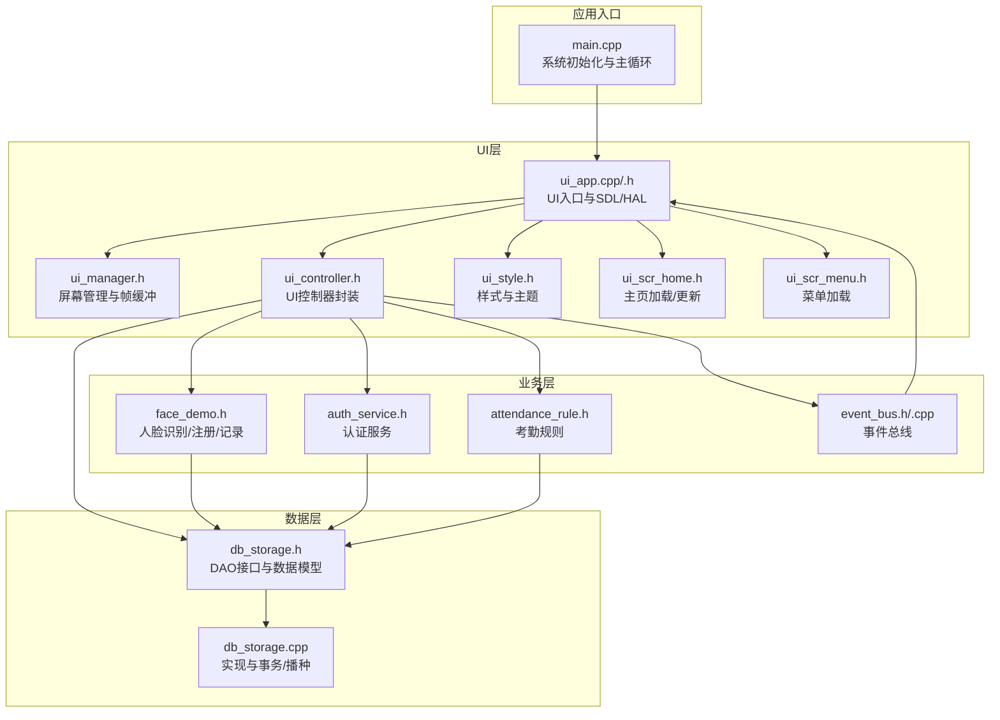
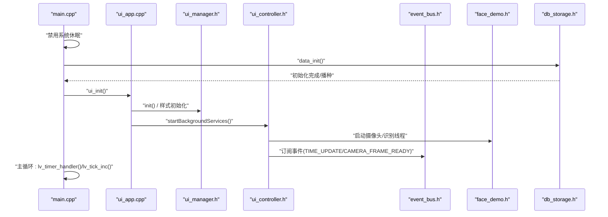
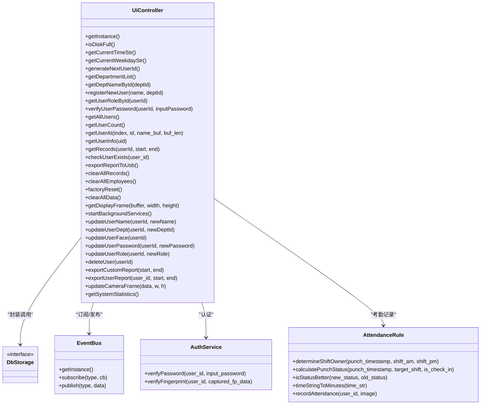

# API参考手册

<cite>
**本文档引用的文件**
- [src/main.cpp](file://src/main.cpp)
- [src/ui/ui_app.h](file://src/ui/ui_app.h)
- [src/ui/ui_app.cpp](file://src/ui/ui_app.cpp)
- [src/ui/ui_controller.h](file://src/ui/ui_controller.h)
- [src/ui/managers/ui_manager.h](file://src/ui/managers/ui_manager.h)
- [src/ui/common/ui_style.h](file://src/ui/common/ui_style.h)
- [src/ui/screens/home/ui_scr_home.h](file://src/ui/screens/home/ui_scr_home.h)
- [src/ui/screens/menu/ui_scr_menu.h](file://src/ui/screens/menu/ui_scr_menu.h)
- [src/business/face_demo.h](file://src/business/face_demo.h)
- [src/business/auth_service.h](file://src/business/auth_service.h)
- [src/business/attendance_rule.h](file://src/business/attendance_rule.h)
- [src/business/event_bus.h](file://src/business/event_bus.h)
- [src/business/event_bus.cpp](file://src/business/event_bus.cpp)
- [src/data/db_storage.h](file://src/data/db_storage.h)
- [src/data/db_storage.cpp](file://src/data/db_storage.cpp)
</cite>

## 目录
1. [简介](#简介)
2. [项目结构](#项目结构)
3. [核心组件](#核心组件)
4. [架构总览](#架构总览)
5. [详细组件分析](#详细组件分析)
6. [依赖关系分析](#依赖关系分析)
7. [性能考虑](#性能考虑)
8. [故障排查指南](#故障排查指南)
9. [结论](#结论)
10. [附录](#附录)

## 简介
本手册面向SmartAttendance系统的开发者与集成者，提供完整的API参考文档，涵盖UI组件API、业务逻辑API与数据层API。内容包括：
- UI组件API：屏幕加载、样式与主题、输入设备绑定、摄像头帧共享与事件发布。
- 业务逻辑API：人脸识别与注册、用户认证、考勤规则计算与记录落库。
- 数据层API：数据库初始化、表结构与索引、CRUD接口、事务管理、系统配置与报表辅助查询。

文档还包含参数说明、返回值定义、异常处理策略、使用示例路径、版本信息、废弃警告与迁移指南，帮助读者快速上手并正确集成。

## 项目结构
系统采用分层架构：
- UI层：基于LVGL，负责屏幕管理、样式主题、输入设备与摄像头帧共享。
- 业务层：封装人脸识别、用户认证、考勤规则与事件总线。
- 数据层：基于SQLite3，提供DAO接口、事务管理与系统配置。

**图表来源**
- [src/main.cpp:187-246](file://src/main.cpp#L187-L246)
- [src/ui/ui_app.cpp:34-94](file://src/ui/ui_app.cpp#L34-L94)
- [src/ui/managers/ui_manager.h:71-156](file://src/ui/managers/ui_manager.h#L71-L156)
- [src/ui/ui_controller.h:21-106](file://src/ui/ui_controller.h#L21-L106)
- [src/business/face_demo.h:34-196](file://src/business/face_demo.h#L34-L196)
- [src/business/auth_service.h:23-46](file://src/business/auth_service.h#L23-L46)
- [src/business/attendance_rule.h:43-92](file://src/business/attendance_rule.h#L43-L92)
- [src/business/event_bus.h:21-41](file://src/business/event_bus.h#L21-L41)
- [src/data/db_storage.h:189-596](file://src/data/db_storage.h#L189-L596)
- [src/data/db_storage.cpp:108-285](file://src/data/db_storage.cpp#L108-L285)

**章节来源**
- [src/main.cpp:187-246](file://src/main.cpp#L187-L246)
- [src/ui/ui_app.cpp:34-94](file://src/ui/ui_app.cpp#L34-L94)
- [src/ui/managers/ui_manager.h:71-156](file://src/ui/managers/ui_manager.h#L71-L156)
- [src/ui/ui_controller.h:21-106](file://src/ui/ui_controller.h#L21-L106)
- [src/business/face_demo.h:34-196](file://src/business/face_demo.h#L34-L196)
- [src/business/auth_service.h:23-46](file://src/business/auth_service.h#L23-L46)
- [src/business/attendance_rule.h:43-92](file://src/business/attendance_rule.h#L43-L92)
- [src/business/event_bus.h:21-41](file://src/business/event_bus.h#L21-L41)
- [src/data/db_storage.h:189-596](file://src/data/db_storage.h#L189-L596)
- [src/data/db_storage.cpp:108-285](file://src/data/db_storage.cpp#L108-L285)

## 核心组件
- UI入口与HAL：负责LVGL初始化、SDL窗口与输入设备创建、样式主题初始化、屏幕加载与后台服务启动。
- UI控制器：封装业务/数据层调用，提供系统状态、员工管理、记录查询、报表导出、摄像头帧获取与更新等接口。
- 业务模块：人脸识别与注册、用户认证、考勤规则计算、事件总线。
- 数据层：数据库初始化、表结构与索引、CRUD接口、事务管理、系统配置与报表辅助查询。

**章节来源**
- [src/ui/ui_app.cpp:34-94](file://src/ui/ui_app.cpp#L34-L94)
- [src/ui/ui_controller.h:21-106](file://src/ui/ui_controller.h#L21-L106)
- [src/business/face_demo.h:34-196](file://src/business/face_demo.h#L34-L196)
- [src/business/auth_service.h:23-46](file://src/business/auth_service.h#L23-L46)
- [src/business/attendance_rule.h:43-92](file://src/business/attendance_rule.h#L43-L92)
- [src/business/event_bus.h:21-41](file://src/business/event_bus.h#L21-L41)
- [src/data/db_storage.h:189-596](file://src/data/db_storage.h#L189-L596)
- [src/data/db_storage.cpp:108-285](file://src/data/db_storage.cpp#L108-L285)

## 架构总览
系统启动流程与组件交互如下：

**图表来源**
- [src/main.cpp:187-246](file://src/main.cpp#L187-L246)
- [src/ui/ui_app.cpp:34-94](file://src/ui/ui_app.cpp#L34-L94)
- [src/ui/managers/ui_manager.h:71-156](file://src/ui/managers/ui_manager.h#L71-L156)
- [src/ui/ui_controller.h:63-106](file://src/ui/ui_controller.h#L63-L106)
- [src/business/event_bus.h:21-41](file://src/business/event_bus.h#L21-L41)
- [src/business/face_demo.h:34-196](file://src/business/face_demo.h#L34-L196)
- [src/data/db_storage.h:189-214](file://src/data/db_storage.h#L189-L214)

**章节来源**
- [src/main.cpp:187-246](file://src/main.cpp#L187-L246)
- [src/ui/ui_app.cpp:34-94](file://src/ui/ui_app.cpp#L34-L94)
- [src/ui/managers/ui_manager.h:71-156](file://src/ui/managers/ui_manager.h#L71-L156)
- [src/ui/ui_controller.h:63-106](file://src/ui/ui_controller.h#L63-L106)
- [src/business/event_bus.h:21-41](file://src/business/event_bus.h#L21-L41)
- [src/business/face_demo.h:34-196](file://src/business/face_demo.h#L34-L196)
- [src/data/db_storage.h:189-214](file://src/data/db_storage.h#L189-L214)

## 详细组件分析

### UI组件API
- UI入口初始化
  - 接口：ui_init()
  - 功能：初始化LVGL与SDL、创建窗口与输入设备、样式主题初始化、屏幕加载与后台服务启动。
  - 参数：无
  - 返回：无
  - 异常：SDL窗口创建失败时输出错误信息
  - 示例路径：[src/ui/ui_app.cpp:34-94](file://src/ui/ui_app.cpp#L34-L94)

- 屏幕管理与帧缓冲
  - 接口：UiManager::init()、registerScreen()、destroyAllScreensExcept()、updateCameraFrame()、trySetFramePending()、clearFramePending()
  - 功能：屏幕注册与销毁、按键组绑定、摄像头帧缓冲区管理、帧待更新标记。
  - 参数：屏幕类型、屏幕指针引用、帧数据指针与大小、原子标志
  - 返回：无/布尔
  - 异常：互斥锁保护，线程安全
  - 示例路径：[src/ui/managers/ui_manager.h:71-156](file://src/ui/managers/ui_manager.h#L71-L156)

- UI控制器封装
  - 接口：UiController单例与各类业务封装（系统状态、员工管理、记录查询、维护与报表、摄像头图像获取、更新用户信息、系统统计）
  - 功能：对外暴露简化的业务调用接口，封装数据层与业务层交互。
  - 参数：用户ID、名称、部门ID、密码、人脸图像、时间范围、报表参数等
  - 返回：布尔/容器/结构体
  - 异常：线程安全与原子标志控制
  - 示例路径：[src/ui/ui_controller.h:21-106](file://src/ui/ui_controller.h#L21-L106)

- 样式与主题
  - 接口：ui_style_init()、字体与颜色宏定义
  - 功能：全局样式初始化与主题色定义
  - 参数：无
  - 返回：无
  - 异常：无
  - 示例路径：[src/ui/common/ui_style.h:43-48](file://src/ui/common/ui_style.h#L43-L48)

- 屏幕加载与更新
  - 接口：ui_scr_home.h中的load_screen()、update_time()、update_disk_status()；ui_scr_menu.h中的load_menu_screen()
  - 功能：主页与菜单屏幕加载、时间与磁盘状态更新
  - 参数：时间字符串、日期字符串、磁盘状态
  - 返回：无
  - 异常：无
  - 示例路径：[src/ui/screens/home/ui_scr_home.h:10-24](file://src/ui/screens/home/ui_scr_home.h#L10-L24)、[src/ui/screens/menu/ui_scr_menu.h:9-13](file://src/ui/screens/menu/ui_scr_menu.h#L9-L13)

**章节来源**
- [src/ui/ui_app.cpp:34-94](file://src/ui/ui_app.cpp#L34-L94)
- [src/ui/managers/ui_manager.h:71-156](file://src/ui/managers/ui_manager.h#L71-L156)
- [src/ui/ui_controller.h:21-106](file://src/ui/ui_controller.h#L21-L106)
- [src/ui/common/ui_style.h:43-48](file://src/ui/common/ui_style.h#L43-L48)
- [src/ui/screens/home/ui_scr_home.h:10-24](file://src/ui/screens/home/ui_scr_home.h#L10-L24)
- [src/ui/screens/menu/ui_scr_menu.h:9-13](file://src/ui/screens/menu/ui_scr_menu.h#L9-L13)

### 业务逻辑API

#### 人脸识别与注册
- 接口：business_init()、business_quit()、business_get_display_frame()、business_register_user()、business_update_user_face()、business_load_records()、business_get_record_count()、business_get_record_at()、business_get_user_count()、business_get_user_at()、convertToGrayscale()
- 功能：业务模块初始化/退出、显示帧获取、用户注册与人脸更新、记录缓存与查询、用户列表查询、灰度转换
- 参数：缓冲区指针与尺寸、用户名称与部门ID、索引与输出缓冲、记录格式化缓冲等
- 返回：布尔/整数/字符串
- 异常：摄像头/模型加载失败、注册失败、索引越界
- 示例路径：[src/business/face_demo.h:34-196](file://src/business/face_demo.h#L34-L196)

#### 用户认证服务
- 接口：AuthService::verifyPassword()、AuthService::verifyFingerprint()
- 功能：密码与指纹验证（1:1）
- 参数：用户ID、输入密码、采集指纹特征数据
- 返回：枚举AuthResult
- 异常：用户不存在、密码错误、指纹不匹配、无特征数据、数据库错误
- 示例路径：[src/business/auth_service.h:23-46](file://src/business/auth_service.h#L23-L46)

#### 考勤规则与记录
- 接口：AttendanceRule::recordAttendance()、calculatePunchStatus()、determineShiftOwner()、isStatusBetter()、timeStringToMinutes()
- 功能：考勤状态计算、打卡归属班次判断、状态比较、记录落库
- 参数：用户ID、现场抓拍图、时间戳、目标班次配置
- 返回：枚举RecordResult/PunchResult/整数
- 异常：无排班、重复打卡、数据库错误
- 示例路径：[src/business/attendance_rule.h:43-92](file://src/business/attendance_rule.h#L43-L92)

#### 事件总线
- 接口：EventBus::getInstance()、subscribe()、publish()
- 功能：事件订阅与发布（时间更新、磁盘状态、摄像头帧就绪）
- 参数：事件类型、回调函数
- 返回：无
- 异常：线程安全，回调列表复制后逐个调用
- 示例路径：[src/business/event_bus.h:21-41](file://src/business/event_bus.h#L21-L41)、[src/business/event_bus.cpp:1-28](file://src/business/event_bus.cpp#L1-L28)

**章节来源**
- [src/business/face_demo.h:34-196](file://src/business/face_demo.h#L34-L196)
- [src/business/auth_service.h:23-46](file://src/business/auth_service.h#L23-L46)
- [src/business/attendance_rule.h:43-92](file://src/business/attendance_rule.h#L43-L92)
- [src/business/event_bus.h:21-41](file://src/business/event_bus.h#L21-L41)
- [src/business/event_bus.cpp:1-28](file://src/business/event_bus.cpp#L1-L28)

### 数据层API

#### 数据库初始化与关闭
- 接口：data_init()、data_seed()、data_close()
- 功能：数据库连接、表结构创建与索引、默认数据播种、资源释放
- 参数：无
- 返回：布尔/无
- 异常：文件系统错误、SQL执行失败、外键约束失败
- 示例路径：[src/data/db_storage.h:189-214](file://src/data/db_storage.h#L189-L214)、[src/data/db_storage.cpp:108-285](file://src/data/db_storage.cpp#L108-L285)

#### 部门管理接口
- 接口：db_add_department()、db_get_departments()、db_delete_department()
- 功能：新增/查询/删除部门
- 参数：部门名称、部门ID
- 返回：布尔/容器
- 异常：唯一性冲突、外键约束SET NULL
- 示例路径：[src/data/db_storage.h:215-237](file://src/data/db_storage.h#L215-L237)

#### 班次管理接口
- 接口：db_update_shift()、db_get_shifts()、db_get_shift_info()、db_add_shift()、db_delete_shift()、db_get_global_rules()、db_update_global_rules()、db_get_all_bells()、db_update_bell()
- 功能：班次时间更新、查询、创建、删除、全局规则与响铃配置
- 参数：时段起止、跨天标志、规则配置、响铃配置
- 返回：布尔/容器/可选结构体
- 异常：SQL错误、外键约束
- 示例路径：[src/data/db_storage.h:238-314](file://src/data/db_storage.h#L238-L314)

#### 用户管理接口
- 接口：db_add_user()、db_batch_add_users()、db_delete_user()、db_get_user_info()、db_get_all_users()、db_get_all_users_info()、db_assign_user_shift()、db_get_user_shift()、db_update_user_basic()、db_update_user_face()、db_update_user_password()、db_update_user_fingerprint()、db_get_all_users_light()
- 功能：用户注册/导入/删除、信息查询与更新、人脸/密码/指纹更新、ID->Name映射
- 参数：UserData结构体、人脸图像、密码、指纹特征、用户ID与字段
- 返回：整数/布尔/容器/可选结构体
- 异常：BLOB序列化/反序列化、外键CASCADE
- 示例路径：[src/data/db_storage.h:315-420](file://src/data/db_storage.h#L315-L420)

#### 考勤记录接口
- 接口：db_log_attendance()、db_get_records()、db_get_records_by_user()、db_getLastPunchTime()、db_cleanup_old_attendance_images()、db_get_all_records_by_time()、db_get_users_by_dept()
- 功能：记录落库、时间段查询、清理过期图片、批量报表查询
- 参数：用户ID、班次ID、图像、状态、时间戳范围、部门ID
- 返回：布尔/容器/整数
- 异常：文件系统清理失败、SQL错误
- 示例路径：[src/data/db_storage.h:421-461](file://src/data/db_storage.h#L421-L461)、[src/data/db_storage.h:578-595](file://src/data/db_storage.h#L578-L595)

#### 事务管理接口
- 接口：db_begin_transaction()、db_commit_transaction()
- 功能：开启/提交事务，用于批量操作加速
- 参数：无
- 返回：布尔
- 异常：事务状态错误
- 示例路径：[src/data/db_storage.h:463-474](file://src/data/db_storage.h#L463-L474)

#### 排班管理接口
- 接口：db_set_dept_schedule()、db_set_user_special_schedule()、db_get_user_shift_smart()
- 功能：部门周排班、个人特殊日期排班、智能获取当天班次（含周末规则）
- 参数：部门ID/用户ID、星期/日期、班次ID、时间戳
- 返回：布尔/可选结构体
- 异常：外键约束、SQL错误
- 示例路径：[src/data/db_storage.h:475-504](file://src/data/db_storage.h#L475-L504)

#### 系统配置与报表辅助
- 接口：db_get_system_stats()、db_get_system_config()、db_set_system_config()、db_set_holiday()、db_delete_holiday()、db_get_holiday()
- 功能：系统统计、全局配置KV、节假日管理
- 参数：键名、值、日期字符串、节日名称
- 返回：结构体/字符串/布尔/可选字符串
- 异常：SQL错误
- 示例路径：[src/data/db_storage.h:532-577](file://src/data/db_storage.h#L532-L577)

**章节来源**
- [src/data/db_storage.h:189-596](file://src/data/db_storage.h#L189-L596)
- [src/data/db_storage.cpp:108-285](file://src/data/db_storage.cpp#L108-L285)

## 依赖关系分析

**图表来源**
- [src/ui/ui_controller.h:21-106](file://src/ui/ui_controller.h#L21-L106)
- [src/business/event_bus.h:21-41](file://src/business/event_bus.h#L21-L41)
- [src/business/auth_service.h:23-46](file://src/business/auth_service.h#L23-L46)
- [src/business/attendance_rule.h:43-92](file://src/business/attendance_rule.h#L43-L92)
- [src/data/db_storage.h:189-596](file://src/data/db_storage.h#L189-L596)

**章节来源**
- [src/ui/ui_controller.h:21-106](file://src/ui/ui_controller.h#L21-L106)
- [src/business/event_bus.h:21-41](file://src/business/event_bus.h#L21-L41)
- [src/business/auth_service.h:23-46](file://src/business/auth_service.h#L23-L46)
- [src/business/attendance_rule.h:43-92](file://src/business/attendance_rule.h#L43-L92)
- [src/data/db_storage.h:189-596](file://src/data/db_storage.h#L189-L596)

## 性能考虑
- 数据层
  - WAL模式与PRAGMA调优：提升读写并发性能，读写不互斥。
  - 预编译语句：高频插入语句预编译，减少SQL解析开销。
  - 读写锁：共享锁用于读、排他锁用于写，降低竞争。
  - 索引：联合索引加速“按用户+时间”查询。
- UI层
  - 帧缓冲与原子标志：线程安全共享摄像头帧，避免频繁拷贝。
  - 屏幕资源异步清理：防止主线程阻塞导致崩溃。
- 业务层
  - 事务批量导入：db_batch_add_users使用事务加速。
  - 预处理配置：直方图均衡化、裁剪与ROI增强参数可调，平衡识别精度与性能。

**章节来源**
- [src/data/db_storage.cpp:123-135](file://src/data/db_storage.cpp#L123-L135)
- [src/data/db_storage.cpp:275-282](file://src/data/db_storage.cpp#L275-L282)
- [src/data/db_storage.cpp:35-65](file://src/data/db_storage.cpp#L35-L65)
- [src/data/db_storage.cpp:253-257](file://src/data/db_storage.cpp#L253-L257)
- [src/ui/managers/ui_manager.h:88-103](file://src/ui/managers/ui_manager.h#L88-L103)
- [src/data/db_storage.h:332-333](file://src/data/db_storage.h#L332-L333)

## 故障排查指南
- UI初始化失败
  - 现象：无法创建SDL窗口或键盘绑定失败。
  - 排查：确认WSLg/SDL2环境配置，检查lv_conf.h中SDL驱动启用状态。
  - 参考：[src/ui/ui_app.cpp:45-81](file://src/ui/ui_app.cpp#L45-L81)
- 数据库初始化失败
  - 现象：无法打开数据库或表创建失败。
  - 排查：检查文件权限、磁盘空间、SQL语法；查看播种过程。
  - 参考：[src/data/db_storage.cpp:117-121](file://src/data/db_storage.cpp#L117-L121)、[src/data/db_storage.cpp:318-388](file://src/data/db_storage.cpp#L318-L388)
- 人脸识别/注册失败
  - 现象：无视频帧、注册失败、索引越界。
  - 排查：确认摄像头可用、预处理配置合理、用户列表缓存有效。
  - 参考：[src/business/face_demo.h:99-136](file://src/business/face_demo.h#L99-L136)、[src/business/face_demo.h:105-119](file://src/business/face_demo.h#L105-L119)
- 考勤记录异常
  - 现象：无排班、重复打卡、数据库写入失败。
  - 排查：检查排班规则、重复打卡限制、数据库事务状态。
  - 参考：[src/business/attendance_rule.h:72-88](file://src/business/attendance_rule.h#L72-L88)、[src/data/db_storage.h:463-474](file://src/data/db_storage.h#L463-L474)

**章节来源**
- [src/ui/ui_app.cpp:45-81](file://src/ui/ui_app.cpp#L45-L81)
- [src/data/db_storage.cpp:117-121](file://src/data/db_storage.cpp#L117-L121)
- [src/data/db_storage.cpp:318-388](file://src/data/db_storage.cpp#L318-L388)
- [src/business/face_demo.h:99-136](file://src/business/face_demo.h#L99-L136)
- [src/business/face_demo.h:105-119](file://src/business/face_demo.h#L105-L119)
- [src/business/attendance_rule.h:72-88](file://src/business/attendance_rule.h#L72-L88)
- [src/data/db_storage.h:463-474](file://src/data/db_storage.h#L463-L474)

## 结论
本API参考手册系统梳理了SmartAttendance的UI组件、业务逻辑与数据层接口，提供了参数、返回值、异常处理与使用示例路径。通过合理的分层设计与性能优化，系统能够稳定地支撑人脸识别、用户认证与考勤记录等核心功能。建议在集成过程中遵循事务批量导入、帧缓冲共享与事件总线订阅等最佳实践，确保系统性能与可靠性。

## 附录

### API版本信息与废弃警告
- 版本：系统主程序版本标注为1.3（修复编译错误）。
- 废弃与迁移：当前代码未发现明确废弃API；如需迁移，请关注数据层播种逻辑与UI控制器封装的演进。

**章节来源**
- [src/main.cpp:5](file://src/main.cpp#L5)

### 常见用法与最佳实践
- UI初始化与主循环
  - 步骤：禁用休眠 → 初始化数据层 → 初始化UI → 初始化业务 → 主循环驱动LVGL。
  - 参考：[src/main.cpp:187-246](file://src/main.cpp#L187-L246)
- UI控制器封装调用
  - 步骤：获取单例 → 启动后台服务 → 调用业务封装接口 → 订阅事件。
  - 参考：[src/ui/ui_controller.h:21-106](file://src/ui/ui_controller.h#L21-L106)、[src/ui/ui_app.cpp:86-93](file://src/ui/ui_app.cpp#L86-L93)
- 数据层事务批量导入
  - 步骤：db_begin_transaction() → 多次写入 → db_commit_transaction()。
  - 参考：[src/data/db_storage.h:332](file://src/data/db_storage.h#L332)、[src/data/db_storage.h:463-474](file://src/data/db_storage.h#L463-L474)
- 人脸识别与注册
  - 步骤：business_init() → 获取显示帧 → 注册用户 → 更新人脸。
  - 参考：[src/business/face_demo.h:34-136](file://src/business/face_demo.h#L34-L136)

**章节来源**
- [src/main.cpp:187-246](file://src/main.cpp#L187-L246)
- [src/ui/ui_controller.h:21-106](file://src/ui/ui_controller.h#L21-L106)
- [src/ui/ui_app.cpp:86-93](file://src/ui/ui_app.cpp#L86-L93)
- [src/data/db_storage.h:332](file://src/data/db_storage.h#L332)
- [src/data/db_storage.h:463-474](file://src/data/db_storage.h#L463-L474)
- [src/business/face_demo.h:34-136](file://src/business/face_demo.h#L34-L136)