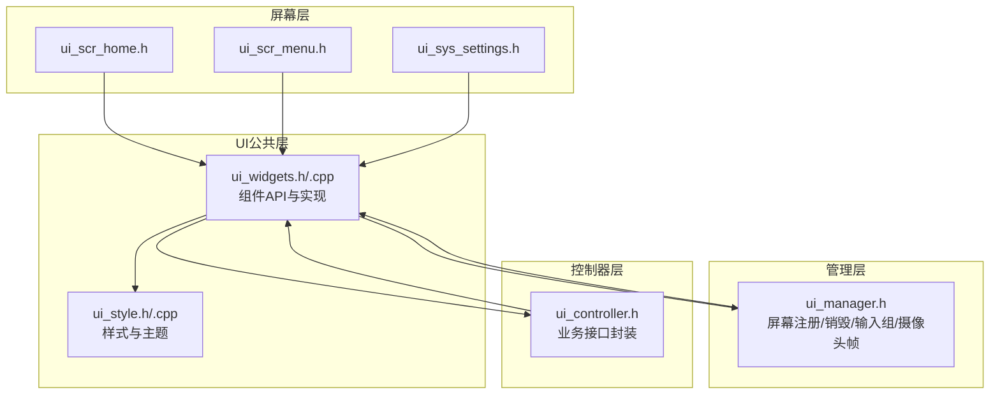
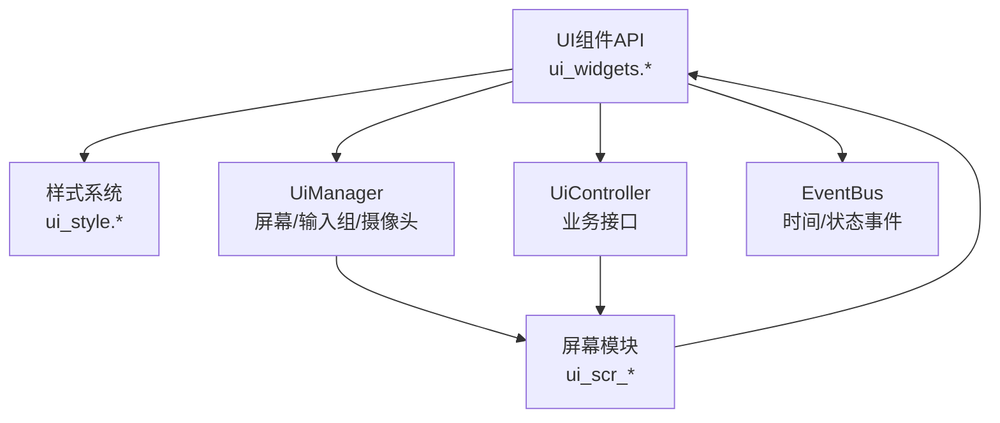
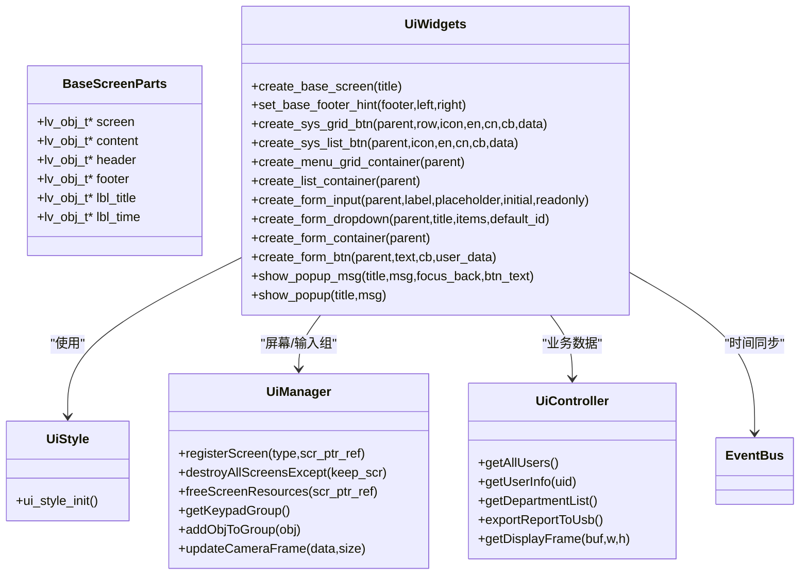
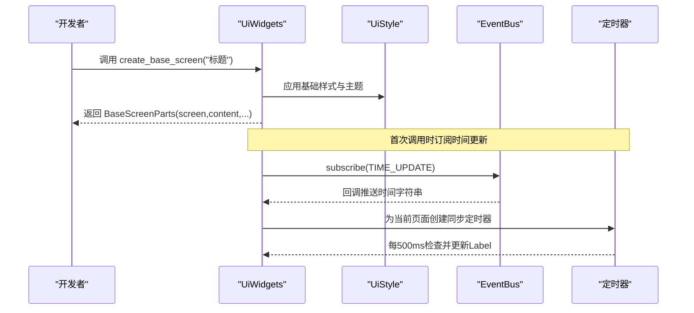
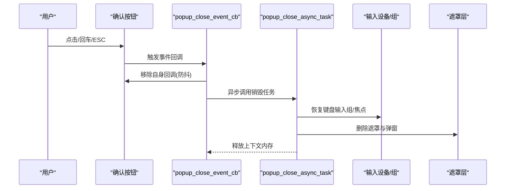
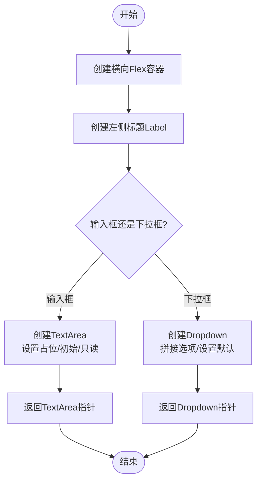
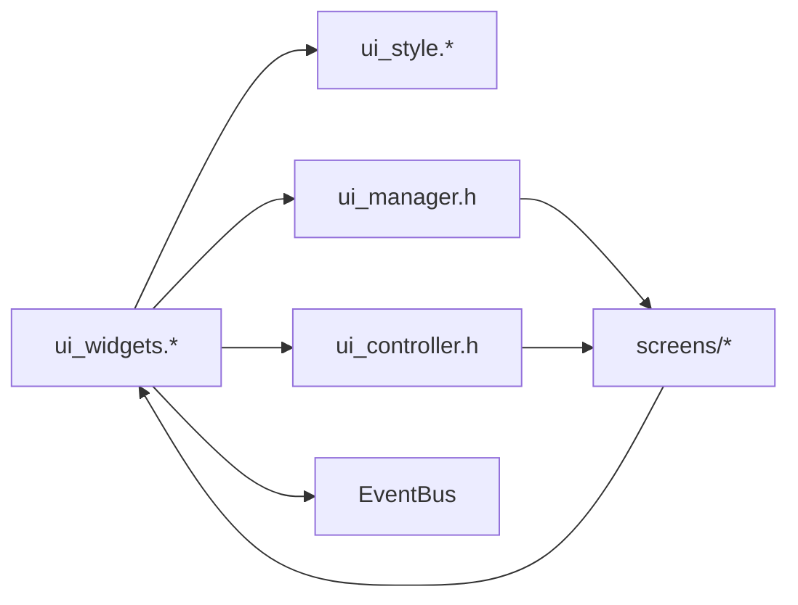

# UI组件API

<cite>
**本文引用的文件**
- [src/ui/common/ui_widgets.h](file://src/ui/common/ui_widgets.h)
- [src/ui/common/ui_widgets.cpp](file://src/ui/common/ui_widgets.cpp)
- [src/ui/common/ui_style.h](file://src/ui/common/ui_style.h)
- [src/ui/common/ui_style.cpp](file://src/ui/common/ui_style.cpp)
- [src/ui/managers/ui_manager.h](file://src/ui/managers/ui_manager.h)
- [src/ui/ui_controller.h](file://src/ui/ui_controller.h)
- [src/ui/screens/home/ui_scr_home.h](file://src/ui/screens/home/ui_scr_home.h)
- [src/ui/screens/menu/ui_scr_menu.h](file://src/ui/screens/menu/ui_scr_menu.h)
- [src/ui/screens/system/ui_sys_settings.h](file://src/ui/screens/system/ui_sys_settings.h)
</cite>

## 目录
1. [简介](#简介)
2. [项目结构](#项目结构)
3. [核心组件](#核心组件)
4. [架构总览](#架构总览)
5. [详细组件分析](#详细组件分析)
6. [依赖关系分析](#依赖关系分析)
7. [性能考量](#性能考量)
8. [故障排查指南](#故障排查指南)
9. [结论](#结论)
10. [附录](#附录)

## 简介
本文件系统化梳理 SmartAttendance 项目中的 UI 组件 API，覆盖基础屏幕创建、系统菜单按钮、列表按钮、表单输入与下拉框等核心接口；同时文档化样式系统（颜色、字体、布局）与事件处理机制，并提供组合使用示例，帮助开发者快速构建一致、可维护的用户界面。

## 项目结构
UI 相关代码主要集中在 src/ui 目录，采用“公共组件 + 屏幕实现 + 管理器 + 控制器”的分层组织：
- common：通用 UI 组件与样式定义
- screens：各业务屏幕的加载与更新接口
- managers：UI 管理器（屏幕注册、销毁、输入组管理、摄像头帧管理）
- ui_controller：UI 层与业务/数据层的桥接接口

图表来源
- [src/ui/common/ui_widgets.h:1-152](file://src/ui/common/ui_widgets.h#L1-L152)
- [src/ui/common/ui_widgets.cpp:1-776](file://src/ui/common/ui_widgets.cpp#L1-L776)
- [src/ui/common/ui_style.h:1-48](file://src/ui/common/ui_style.h#L1-L48)
- [src/ui/common/ui_style.cpp:1-78](file://src/ui/common/ui_style.cpp#L1-L78)
- [src/ui/managers/ui_manager.h:1-156](file://src/ui/managers/ui_manager.h#L1-L156)
- [src/ui/ui_controller.h:1-106](file://src/ui/ui_controller.h#L1-L106)
- [src/ui/screens/home/ui_scr_home.h:1-28](file://src/ui/screens/home/ui_scr_home.h#L1-L28)
- [src/ui/screens/menu/ui_scr_menu.h:1-17](file://src/ui/screens/menu/ui_scr_menu.h#L1-L17)
- [src/ui/screens/system/ui_sys_settings.h:1-93](file://src/ui/screens/system/ui_sys_settings.h#L1-L93)

章节来源
- [src/ui/common/ui_widgets.h:1-152](file://src/ui/common/ui_widgets.h#L1-L152)
- [src/ui/common/ui_style.h:1-48](file://src/ui/common/ui_style.h#L1-L48)
- [src/ui/managers/ui_manager.h:1-156](file://src/ui/managers/ui_manager.h#L1-L156)
- [src/ui/ui_controller.h:1-106](file://src/ui/ui_controller.h#L1-L106)

## 核心组件
本节聚焦 UI 组件 API 的参数、返回值、典型使用场景与注意事项。

- 基础屏幕创建
  - 函数：create_base_screen
  - 参数
    - title: const char*，页面标题文字
  - 返回值
    - BaseScreenParts：包含 screen、content、header、footer、lbl_title、lbl_time 指针
  - 使用场景
    - 所有屏幕的基础框架，自动创建顶部 Header（含星期、标题、时间）、底部 Footer（含提示），以及中间 Content 区域
  - 注意事项
    - Header/Content/Footer 尺寸与布局已预设，Content 默认关闭滚动条，可通过业务容器自行开启
    - 时间与星期的同步通过 EventBus 订阅与定时器刷新实现，避免重复订阅

- 设置底部提示语
  - 函数：set_base_footer_hint
  - 参数
    - footer: lv_obj_t*，Footer 容器
    - left_text: const char*，左对齐提示
    - right_text: const char*，右对齐提示（可选）
  - 返回值
    - 无
  - 使用场景
    - 动态更新底部操作提示，如“退出-ESC”、“确认-OK”

- 系统菜单按钮（九宫格 Grid）
  - 函数：create_sys_grid_btn
  - 参数
    - parent: lv_obj_t*，Grid 容器
    - row: int，Grid 行索引
    - icon: const char*，图标符号（可选）
    - text_en: const char*，英文文本（可选）
    - text_cn: const char*，中文文本（可选）
    - event_cb: lv_event_cb_t，事件回调
    - user_data: const char*，用户数据（注意生命周期）
  - 返回值
    - lv_obj_t*，按钮对象
  - 使用场景
    - 九宫格菜单项，按钮宽度占满整行，垂直拉伸

- 系统菜单按钮（列表 Flex）
  - 函数：create_sys_list_btn
  - 参数
    - parent: lv_obj_t*，Flex 列表容器
    - icon: const char*，图标符号（可选）
    - text_en: const char*，英文文本（可选）
    - text_cn: const char*，中文文本（可选）
    - event_cb: lv_event_cb_t，事件回调
    - user_data: const char*，用户数据
  - 返回值
    - lv_obj_t*，按钮对象
  - 使用场景
    - 列表型菜单项，宽度 100%，高度按比例分配

- 菜单网格容器
  - 函数：create_menu_grid_container
  - 参数
    - parent: lv_obj_t*，父容器
  - 返回值
    - lv_obj_t*，Grid 容器
  - 使用场景
    - 九宫格菜单的外层容器，自动居中、隐藏滚动条、预设 2 列 3 行网格

- 列表容器
  - 函数：create_list_container
  - 参数
    - parent: lv_obj_t*，父容器
  - 返回值
    - lv_obj_t*，Flex 列表容器
  - 使用场景
    - 垂直列表布局，自动滚动、顶部对齐

- 表单输入组
  - 函数：create_form_input
  - 参数
    - parent: lv_obj_t*，父容器（通常为表单容器）
    - label_text: const char*，左侧标题
    - placeholder_text: const char*，占位提示（可选）
    - initial_text: const char*，初始文本（可选）
    - is_readonly: bool，是否只读
  - 返回值
    - lv_obj_t*，文本输入框（TextArea）指针
  - 使用场景
    - 表单输入，支持只读模式与占位提示

- 表单下拉框
  - 函数：create_form_dropdown
  - 参数
    - parent: lv_obj_t*，父容器
    - title: const char*，左侧标题
    - items: vector<pair<int, string>>，选项列表（ID, 名称）
    - default_id: int，默认选中 ID
  - 返回值
    - lv_obj_t*，下拉框对象
  - 使用场景
    - 部门、班次等枚举选择

- 表单容器
  - 函数：create_form_container
  - 参数
    - parent: lv_obj_t*，父容器
  - 返回值
    - lv_obj_t*，表单容器
  - 使用场景
    - 垂直 Flex 布局，统一间距与滚动行为

- 表单按钮
  - 函数：create_form_btn
  - 参数
    - parent: lv_obj_t*，父容器
    - btn_text: const char*，按钮文字
    - event_cb: lv_event_cb_t，事件回调
    - user_data: void*，用户数据
  - 返回值
    - lv_obj_t*，按钮对象
  - 使用场景
    - 表单提交、确认等操作

- 通用弹窗
  - 函数：show_popup_msg
  - 参数
    - title: const char*，标题（可选）
    - msg: const char*，内容
    - focus_back_obj: lv_obj_t*，关闭后焦点恢复对象（可选）
    - btn_text: const char*，按钮文字（可选）
  - 返回值
    - 无
  - 使用场景
    - 信息提示、确认提示，支持点击与回车/ESC 关闭

- 通用 MsgBox 弹窗
  - 函数：show_popup
  - 参数
    - title: const char*，标题
    - msg: const char*，内容
  - 返回值
    - 无
  - 使用场景
    - 快速提示消息

章节来源
- [src/ui/common/ui_widgets.h:19-152](file://src/ui/common/ui_widgets.h#L19-L152)
- [src/ui/common/ui_widgets.cpp:61-179](file://src/ui/common/ui_widgets.cpp#L61-L179)
- [src/ui/common/ui_widgets.cpp:182-196](file://src/ui/common/ui_widgets.cpp#L182-L196)
- [src/ui/common/ui_widgets.cpp:202-276](file://src/ui/common/ui_widgets.cpp#L202-L276)
- [src/ui/common/ui_widgets.cpp:279-331](file://src/ui/common/ui_widgets.cpp#L279-L331)
- [src/ui/common/ui_widgets.cpp:367-397](file://src/ui/common/ui_widgets.cpp#L367-L397)
- [src/ui/common/ui_widgets.cpp:337-364](file://src/ui/common/ui_widgets.cpp#L337-L364)
- [src/ui/common/ui_widgets.cpp:403-463](file://src/ui/common/ui_widgets.cpp#L403-L463)
- [src/ui/common/ui_widgets.cpp:466-521](file://src/ui/common/ui_widgets.cpp#L466-L521)
- [src/ui/common/ui_widgets.cpp:527-550](file://src/ui/common/ui_widgets.cpp#L527-L550)
- [src/ui/common/ui_widgets.cpp:556-582](file://src/ui/common/ui_widgets.cpp#L556-L582)
- [src/ui/common/ui_widgets.cpp:648-775](file://src/ui/common/ui_widgets.cpp#L648-L775)

## 架构总览
UI 层通过公共组件 API 构建屏幕，样式系统提供统一的主题与字体；管理层负责屏幕注册与销毁、输入组切换与摄像头帧同步；控制器层封装业务接口，供屏幕与组件调用。

图表来源
- [src/ui/common/ui_widgets.h:1-152](file://src/ui/common/ui_widgets.h#L1-L152)
- [src/ui/common/ui_style.h:1-48](file://src/ui/common/ui_style.h#L1-L48)
- [src/ui/managers/ui_manager.h:1-156](file://src/ui/managers/ui_manager.h#L1-L156)
- [src/ui/ui_controller.h:1-106](file://src/ui/ui_controller.h#L1-L106)
- [src/ui/screens/home/ui_scr_home.h:1-28](file://src/ui/screens/home/ui_scr_home.h#L1-L28)
- [src/ui/screens/menu/ui_scr_menu.h:1-17](file://src/ui/screens/menu/ui_scr_menu.h#L1-L17)
- [src/ui/screens/system/ui_sys_settings.h:1-93](file://src/ui/screens/system/ui_sys_settings.h#L1-L93)

## 详细组件分析

### 样式系统 API
- 颜色定义
  - 主题色：主蓝色、文本主色、面板背景、全局背景、栏位渐变起止、栏位边框、透明度等
- 字体设置
  - 字体声明：Noto 中文字体、图标字体指针
- 通用样式对象
  - 按钮聚焦样式、中文字体样式、基础全屏样式、玻璃质感栏、透明面板、默认按钮、特殊聚焦样式
- 初始化
  - ui_style_init：一次性初始化所有样式对象，避免重复初始化

章节来源
- [src/ui/common/ui_style.h:15-48](file://src/ui/common/ui_style.h#L15-L48)
- [src/ui/common/ui_style.cpp:16-78](file://src/ui/common/ui_style.cpp#L16-L78)

### 事件处理机制
- 事件回调签名
  - lv_event_cb_t：回调函数签名，接收事件对象与用户数据
- 事件类型
  - LV_EVENT_ALL：绑定所有事件类型
  - LV_EVENT_CLICKED：点击事件
  - LV_EVENT_KEY：键盘事件（Enter/ESC）
- 事件绑定与解绑
  - 组件创建时绑定回调；弹窗关闭时移除回调，防止重复触发
- 焦点管理
  - 弹窗专用输入组隔离，关闭后恢复原焦点对象
- 时间同步
  - 通过 EventBus 订阅时间更新，定时器同步至当前页面 Label，销毁时自动清理

章节来源
- [src/ui/common/ui_widgets.cpp:29-55](file://src/ui/common/ui_widgets.cpp#L29-L55)
- [src/ui/common/ui_widgets.cpp:623-640](file://src/ui/common/ui_widgets.cpp#L623-L640)
- [src/ui/common/ui_widgets.cpp:744-758](file://src/ui/common/ui_widgets.cpp#L744-L758)

### 组件类图（代码级）

图表来源
- [src/ui/common/ui_widgets.h:10-152](file://src/ui/common/ui_widgets.h#L10-L152)
- [src/ui/common/ui_style.h:28-48](file://src/ui/common/ui_style.h#L28-L48)
- [src/ui/managers/ui_manager.h:71-156](file://src/ui/managers/ui_manager.h#L71-L156)
- [src/ui/ui_controller.h:21-106](file://src/ui/ui_controller.h#L21-L106)

### 基础屏幕创建流程（序列图）

图表来源
- [src/ui/common/ui_widgets.cpp:61-179](file://src/ui/common/ui_widgets.cpp#L61-L179)
- [src/ui/common/ui_widgets.cpp:118-137](file://src/ui/common/ui_widgets.cpp#L118-L137)

### 弹窗关闭流程（序列图）

图表来源
- [src/ui/common/ui_widgets.cpp:623-640](file://src/ui/common/ui_widgets.cpp#L623-L640)
- [src/ui/common/ui_widgets.cpp:588-620](file://src/ui/common/ui_widgets.cpp#L588-L620)
- [src/ui/common/ui_widgets.cpp:744-758](file://src/ui/common/ui_widgets.cpp#L744-L758)

### 表单输入与下拉框流程（流程图）

图表来源
- [src/ui/common/ui_widgets.cpp:403-463](file://src/ui/common/ui_widgets.cpp#L403-L463)
- [src/ui/common/ui_widgets.cpp:466-521](file://src/ui/common/ui_widgets.cpp#L466-L521)

## 依赖关系分析
- 组件耦合
  - ui_widgets 依赖 ui_style（颜色/字体/样式）、UiManager（屏幕/输入组）、UiController（业务数据）、EventBus（时间）
- 屏幕管理
  - UiManager 统一注册/销毁屏幕，避免资源泄漏；提供输入组隔离，保障弹窗交互安全
- 控制器桥接
  - UiController 封装业务接口，UI 层通过单例访问，降低耦合度
- 样式一致性
  - ui_style_init 一次性初始化，确保全系统主题一致

图表来源
- [src/ui/common/ui_widgets.h:1-152](file://src/ui/common/ui_widgets.h#L1-L152)
- [src/ui/common/ui_style.h:1-48](file://src/ui/common/ui_style.h#L1-L48)
- [src/ui/managers/ui_manager.h:1-156](file://src/ui/managers/ui_manager.h#L1-L156)
- [src/ui/ui_controller.h:1-106](file://src/ui/ui_controller.h#L1-L106)

章节来源
- [src/ui/common/ui_widgets.h:1-152](file://src/ui/common/ui_widgets.h#L1-L152)
- [src/ui/managers/ui_manager.h:104-122](file://src/ui/managers/ui_manager.h#L104-L122)
- [src/ui/ui_controller.h:21-106](file://src/ui/ui_controller.h#L21-L106)

## 性能考量
- 样式初始化
  - ui_style_init 仅初始化一次，避免重复分配与设置样式带来的开销
- 滚动策略
  - Content 默认关闭滚动条，列表/表单容器按需开启自动滚动，减少不必要的渲染
- 事件与定时器
  - 页面销毁时自动清理定时器与事件回调，防止内存泄漏与无效刷新
- 弹窗异步销毁
  - 使用 lv_async_call 延迟销毁，确保当前事件处理完成后再释放资源，避免崩溃

[本节为通用指导，无需列出章节来源]

## 故障排查指南
- 弹窗无法关闭或重复触发
  - 检查是否在回调中移除了事件回调；确认使用了 popup_close_event_cb 并传入正确的 PopupContext
- 焦点丢失
  - 弹窗关闭后应恢复 focus_back_obj；若无效，检查传入对象是否仍有效
- 时间不同步
  - 确认 EventBus 订阅仅初始化一次；检查定时器是否被销毁；确认 create_base_screen 已被调用
- 下拉框选项不显示
  - 检查 items 是否为空；确认 default_id 对应的索引正确
- 只读输入框仍可编辑
  - 检查 is_readonly 参数与只读样式设置逻辑

章节来源
- [src/ui/common/ui_widgets.cpp:623-640](file://src/ui/common/ui_widgets.cpp#L623-L640)
- [src/ui/common/ui_widgets.cpp:588-620](file://src/ui/common/ui_widgets.cpp#L588-L620)
- [src/ui/common/ui_widgets.cpp:118-137](file://src/ui/common/ui_widgets.cpp#L118-L137)
- [src/ui/common/ui_widgets.cpp:505-521](file://src/ui/common/ui_widgets.cpp#L505-L521)
- [src/ui/common/ui_widgets.cpp:456-462](file://src/ui/common/ui_widgets.cpp#L456-L462)

## 结论
通过统一的 UI 组件 API、样式系统与事件机制，SmartAttendance 实现了可复用、可维护的界面开发范式。开发者可基于 create_base_screen 与各类容器/按钮/表单组件快速搭建复杂界面，配合 UiManager 与 UiController 实现稳定的屏幕管理与业务集成。

[本节为总结性内容，无需列出章节来源]

## 附录

### 使用示例：组合多个组件创建复杂界面
- 步骤
  1) 创建基础屏幕框架：调用 create_base_screen("系统设置") 获取 BaseScreenParts
  2) 创建菜单网格容器：调用 create_menu_grid_container(parts.content) 作为九宫格外层容器
  3) 添加九宫格按钮：多次调用 create_sys_grid_btn，传入图标、英文/中文文本与事件回调
  4) 动态更新底部提示：调用 set_base_footer_hint(parts.footer, "返回-ESC", "确认-OK")
  5) 业务数据绑定：通过 UiController 获取部门/用户列表，用于下拉框或列表项
  6) 表单场景：使用 create_form_container + create_form_input/create_form_dropdown + create_form_btn 组合表单
  7) 弹窗提示：使用 show_popup_msg 或 show_popup 提示信息与确认

章节来源
- [src/ui/common/ui_widgets.cpp:61-179](file://src/ui/common/ui_widgets.cpp#L61-L179)
- [src/ui/common/ui_widgets.cpp:367-397](file://src/ui/common/ui_widgets.cpp#L367-L397)
- [src/ui/common/ui_widgets.cpp:279-331](file://src/ui/common/ui_widgets.cpp#L279-L331)
- [src/ui/common/ui_widgets.cpp:182-196](file://src/ui/common/ui_widgets.cpp#L182-L196)
- [src/ui/common/ui_widgets.cpp:527-550](file://src/ui/common/ui_widgets.cpp#L527-L550)
- [src/ui/common/ui_widgets.cpp:403-463](file://src/ui/common/ui_widgets.cpp#L403-L463)
- [src/ui/common/ui_widgets.cpp:466-521](file://src/ui/common/ui_widgets.cpp#L466-L521)
- [src/ui/common/ui_widgets.cpp:556-582](file://src/ui/common/ui_widgets.cpp#L556-L582)
- [src/ui/common/ui_widgets.cpp:648-775](file://src/ui/common/ui_widgets.cpp#L648-L775)