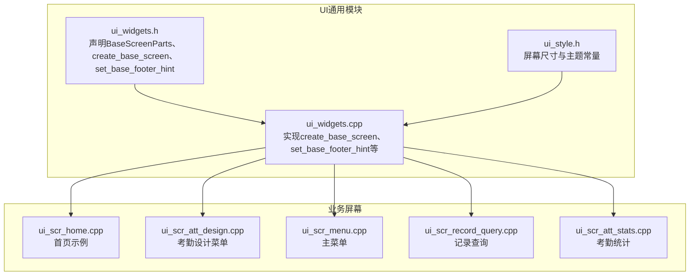
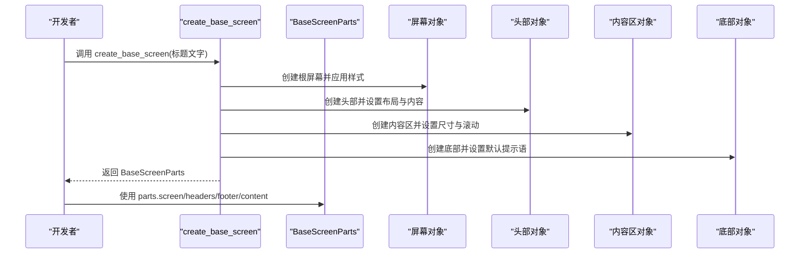
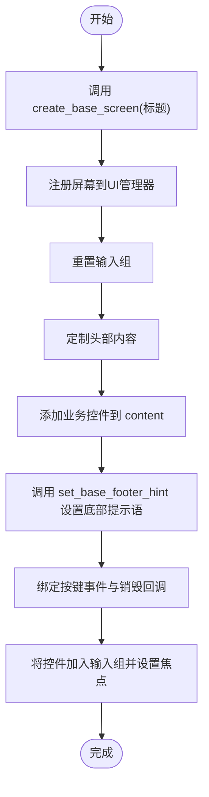
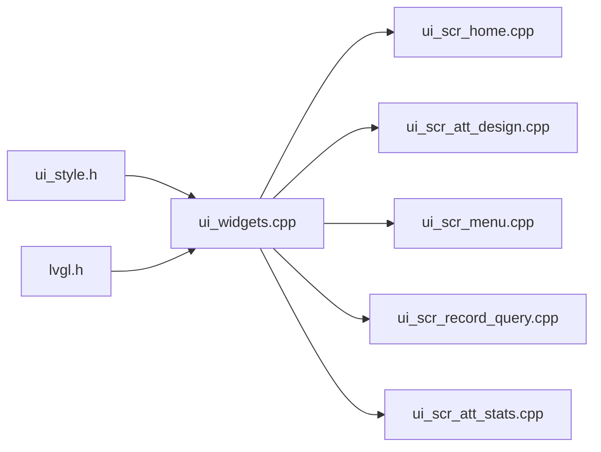

# 基础屏幕API

<cite>
**本文档引用的文件**
- [ui_widgets.h](file://src/ui/common/ui_widgets.h)
- [ui_widgets.cpp](file://src/ui/common/ui_widgets.cpp)
- [ui_scr_home.cpp](file://src/ui/screens/home/ui_scr_home.cpp)
- [ui_scr_att_design.cpp](file://src/ui/screens/att_design/ui_scr_att_design.cpp)
- [ui_scr_menu.cpp](file://src/ui/screens/menu/ui_scr_menu.cpp)
- [ui_scr_record_query.cpp](file://src/ui/screens/record_query/ui_scr_record_query.cpp)
- [ui_scr_att_stats.cpp](file://src/ui/screens/att_stats/ui_scr_att_stats.cpp)
- [ui_style.h](file://src/ui/common/ui_style.h)
</cite>

## 目录
1. [简介](#简介)
2. [项目结构](#项目结构)
3. [核心组件](#核心组件)
4. [架构总览](#架构总览)
5. [详细组件分析](#详细组件分析)
6. [依赖关系分析](#依赖关系分析)
7. [性能考量](#性能考量)
8. [故障排查指南](#故障排查指南)
9. [结论](#结论)
10. [附录](#附录)

## 简介
本文件系统性文档化SmartAttendance项目中的基础屏幕API，重点涵盖以下内容：
- create_base_screen函数的使用方法：参数说明（标题文字）、返回值（BaseScreenParts结构体）及典型应用场景
- BaseScreenParts结构体各成员的用途与职责
- set_base_footer_hint函数的完整使用示例：左右文本参数的含义与用法
- 提供在不同场景下使用这些API的完整代码示例路径，帮助开发者快速集成标准页面框架

## 项目结构
基础屏幕API位于UI通用模块中，提供统一的屏幕框架（头部、内容区、底部）与便捷的底部提示语设置能力，并被各业务屏幕广泛复用。

图表来源
- [ui_widgets.h:1-152](file://src/ui/common/ui_widgets.h#L1-L152)
- [ui_widgets.cpp:1-776](file://src/ui/common/ui_widgets.cpp#L1-L776)
- [ui_style.h:1-48](file://src/ui/common/ui_style.h#L1-L48)
- [ui_scr_home.cpp:126-224](file://src/ui/screens/home/ui_scr_home.cpp#L126-L224)
- [ui_scr_att_design.cpp:65-114](file://src/ui/screens/att_design/ui_scr_att_design.cpp#L65-L114)
- [ui_scr_menu.cpp:124-225](file://src/ui/screens/menu/ui_scr_menu.cpp#L124-L225)
- [ui_scr_record_query.cpp:192-227](file://src/ui/screens/record_query/ui_scr_record_query.cpp#L192-L227)
- [ui_scr_att_stats.cpp:192-245](file://src/ui/screens/att_stats/ui_scr_att_stats.cpp#L192-L245)

章节来源
- [ui_widgets.h:1-152](file://src/ui/common/ui_widgets.h#L1-L152)
- [ui_widgets.cpp:1-776](file://src/ui/common/ui_widgets.cpp#L1-L776)
- [ui_style.h:1-48](file://src/ui/common/ui_style.h#L1-L48)

## 核心组件
- BaseScreenParts结构体：封装标准屏幕框架的各个组成部分，便于统一管理和扩展
- create_base_screen函数：创建标准屏幕框架（Header + Content + Footer），返回BaseScreenParts
- set_base_footer_hint函数：便捷设置底部提示语（左右两个Label）

章节来源
- [ui_widgets.h:9-29](file://src/ui/common/ui_widgets.h#L9-L29)
- [ui_widgets.cpp:60-179](file://src/ui/common/ui_widgets.cpp#L60-L179)
- [ui_widgets.cpp:181-196](file://src/ui/common/ui_widgets.cpp#L181-L196)

## 架构总览
基础屏幕API通过统一的屏幕框架为各业务页面提供一致的外观与交互体验，同时保留足够的定制空间。

图表来源
- [ui_widgets.cpp:60-179](file://src/ui/common/ui_widgets.cpp#L60-L179)

## 详细组件分析

### BaseScreenParts结构体
BaseScreenParts用于承载标准屏幕框架的各个部分，便于在业务页面中统一访问与操作。

- 成员说明
  - screen：根屏幕对象，用于注册到UI管理器、挂载事件与销毁回调
  - content：中间内容区，用于放置业务控件（列表、表单、图片等）
  - header：顶部状态栏，可自定义布局与内容（如日期、标题、时间）
  - footer：底部状态栏，默认包含左右提示语（如“退出-ESC”、“确认-OK”）
  - lbl_title：标题标签，可在需要时动态修改
  - lbl_time：时间标签，自动订阅时间更新并同步显示

- 适用场景
  - 快速搭建统一风格的业务页面
  - 动态替换头部内容（如首页的日期+时间布局）
  - 统一底部提示语（如“电源-ESC”、“主页-ENTER”）

章节来源
- [ui_widgets.h:10-17](file://src/ui/common/ui_widgets.h#L10-L17)
- [ui_widgets.cpp:60-179](file://src/ui/common/ui_widgets.cpp#L60-L179)

### create_base_screen函数
- 函数签名与返回值
  - 函数：BaseScreenParts create_base_screen(const char* title)
  - 返回值：BaseScreenParts结构体，包含screen、content、header、footer、lbl_title、lbl_time
- 参数说明
  - title：页面标题文字，用于设置header中的标题标签
- 处理流程
  - 创建根屏幕并应用基础样式
  - 创建header并设置玻璃质感样式、Flex布局与内容（星期、标题、时间）
  - 创建footer并设置默认提示语（退出-ESC、确认-OK）
  - 创建content并自动计算高度，去除内边距，启用滚动
- 典型应用场景
  - 主菜单、考勤设计、记录查询、考勤统计等页面的基础框架
  - 首页自定义头部（日期+标题+时间）与底部提示语

章节来源
- [ui_widgets.h:19-24](file://src/ui/common/ui_widgets.h#L19-L24)
- [ui_widgets.cpp:60-179](file://src/ui/common/ui_widgets.cpp#L60-L179)
- [ui_scr_home.cpp:126-224](file://src/ui/screens/home/ui_scr_home.cpp#L126-L224)
- [ui_scr_att_design.cpp:65-114](file://src/ui/screens/att_design/ui_scr_att_design.cpp#L65-L114)
- [ui_scr_menu.cpp:124-225](file://src/ui/screens/menu/ui_scr_menu.cpp#L124-L225)
- [ui_scr_record_query.cpp:192-227](file://src/ui/screens/record_query/ui_scr_record_query.cpp#L192-L227)
- [ui_scr_att_stats.cpp:192-245](file://src/ui/screens/att_stats/ui_scr_att_stats.cpp#L192-L245)

### set_base_footer_hint函数
- 函数签名与参数
  - 函数：void set_base_footer_hint(lv_obj_t* footer, const char* left_text, const char* right_text = nullptr)
  - 参数：
    - footer：底部对象（通常来自BaseScreenParts.footer）
    - left_text：左侧提示语（如“电源-ESC”）
    - right_text：右侧提示语（如“主页-ENTER”），可为空则不更新
- 实现机制
  - 获取footer的第0个子对象作为左侧Label，设置其文本
  - 获取footer的第1个子对象作为右侧Label，设置其文本（若传入非空）
- 使用示例（路径）
  - 首页底部提示语设置：[ui_scr_home.cpp:206-217](file://src/ui/screens/home/ui_scr_home.cpp#L206-L217)
  - 其他页面可参考相同模式进行设置

章节来源
- [ui_widgets.h:26-29](file://src/ui/common/ui_widgets.h#L26-L29)
- [ui_widgets.cpp:181-196](file://src/ui/common/ui_widgets.cpp#L181-L196)
- [ui_scr_home.cpp:206-217](file://src/ui/screens/home/ui_scr_home.cpp#L206-L217)

### 标准页面创建与定制流程
- 创建标准页面
  - 调用create_base_screen(标题文字)获取BaseScreenParts
  - 将parts.screen注册到UI管理器并绑定销毁回调
  - 重置输入组，准备添加业务控件
- 定制头部
  - 清空默认标题与时间（如首页）
  - 自定义Flex布局与内容（如日期、标题、时间）
- 定制底部
  - 使用set_base_footer_hint设置左右提示语
  - 可选：调整字体、颜色等样式
- 绑定事件与焦点
  - 为屏幕绑定按键事件与销毁清理回调
  - 将业务控件加入输入组并设置默认焦点

图表来源
- [ui_widgets.cpp:60-179](file://src/ui/common/ui_widgets.cpp#L60-L179)
- [ui_scr_home.cpp:126-224](file://src/ui/screens/home/ui_scr_home.cpp#L126-L224)

## 依赖关系分析
- UI通用模块依赖
  - ui_style.h：提供屏幕尺寸、主题颜色与样式常量
  - lvgl.h：LVGL图形库接口
- 业务屏幕依赖
  - 各业务屏幕通过include ui_widgets.h使用create_base_screen与set_base_footer_hint
  - 通过UiManager进行屏幕注册与输入组管理

图表来源
- [ui_style.h:1-48](file://src/ui/common/ui_style.h#L1-L48)
- [ui_widgets.cpp:1-12](file://src/ui/common/ui_widgets.cpp#L1-L12)
- [ui_scr_home.cpp:1-10](file://src/ui/screens/home/ui_scr_home.cpp#L1-L10)
- [ui_scr_att_design.cpp:1-10](file://src/ui/screens/att_design/ui_scr_att_design.cpp#L1-L10)
- [ui_scr_menu.cpp:1-10](file://src/ui/screens/menu/ui_scr_menu.cpp#L1-L10)
- [ui_scr_record_query.cpp:1-10](file://src/ui/screens/record_query/ui_scr_record_query.cpp#L1-L10)
- [ui_scr_att_stats.cpp:1-10](file://src/ui/screens/att_stats/ui_scr_att_stats.cpp#L1-L10)

章节来源
- [ui_style.h:1-48](file://src/ui/common/ui_style.h#L1-L48)
- [ui_widgets.cpp:1-12](file://src/ui/common/ui_widgets.cpp#L1-L12)

## 性能考量
- 时间同步机制
  - create_base_screen内部为每个lbl_time创建定时器，周期性检查并更新时间；销毁时自动清理定时器，避免内存泄漏
- 滚动与布局
  - content默认禁用滚动条，内容溢出时自动滚动，减少不必要的渲染开销
- 输入组管理
  - 通过UiManager统一管理输入组，避免重复创建与焦点混乱

章节来源
- [ui_widgets.cpp:28-55](file://src/ui/common/ui_widgets.cpp#L28-L55)
- [ui_widgets.cpp:167-178](file://src/ui/common/ui_widgets.cpp#L167-L178)

## 故障排查指南
- 底部提示语未生效
  - 检查是否正确传入footer对象（来自BaseScreenParts.footer）
  - 确认left_text与right_text参数是否为空
  - 参考示例：[ui_scr_home.cpp:206-217](file://src/ui/screens/home/ui_scr_home.cpp#L206-L217)
- 头部内容异常
  - 若需自定义头部，请先清空默认标题与时间后再添加自定义内容
  - 参考示例：[ui_scr_home.cpp:142-144](file://src/ui/screens/home/ui_scr_home.cpp#L142-L144)
- 时间不更新
  - 确认EventBus已订阅时间更新事件，且lbl_time未被提前销毁
  - 参考实现：[ui_widgets.cpp:117-137](file://src/ui/common/ui_widgets.cpp#L117-L137)
- 内容区滚动问题
  - content默认禁用滚动条，若需显示滚动条请手动设置scrollbar_mode
  - 参考实现：[ui_widgets.cpp:174-177](file://src/ui/common/ui_widgets.cpp#L174-L177)

章节来源
- [ui_scr_home.cpp:142-144](file://src/ui/screens/home/ui_scr_home.cpp#L142-L144)
- [ui_scr_home.cpp:206-217](file://src/ui/screens/home/ui_scr_home.cpp#L206-L217)
- [ui_widgets.cpp:117-137](file://src/ui/common/ui_widgets.cpp#L117-L137)
- [ui_widgets.cpp:174-177](file://src/ui/common/ui_widgets.cpp#L174-L177)

## 结论
基础屏幕API为SmartAttendance提供了统一、可定制的页面框架，结合create_base_screen与set_base_footer_hint，开发者可以快速构建风格一致、交互友好的业务页面。通过合理的头部与底部定制、事件绑定与输入组管理，能够有效提升用户体验与开发效率。

## 附录

### 完整示例：创建标准基础页面
- 示例路径
  - 主菜单页面：[ui_scr_menu.cpp:124-225](file://src/ui/screens/menu/ui_scr_menu.cpp#L124-L225)
  - 考勤设计菜单：[ui_scr_att_design.cpp:65-114](file://src/ui/screens/att_design/ui_scr_att_design.cpp#L65-L114)
  - 记录查询菜单：[ui_scr_record_query.cpp:192-227](file://src/ui/screens/record_query/ui_scr_record_query.cpp#L192-L227)
  - 考勤统计菜单：[ui_scr_att_stats.cpp:192-245](file://src/ui/screens/att_stats/ui_scr_att_stats.cpp#L192-L245)

### 完整示例：设置底部提示语
- 示例路径
  - 首页底部提示语设置：[ui_scr_home.cpp:206-217](file://src/ui/screens/home/ui_scr_home.cpp#L206-L217)