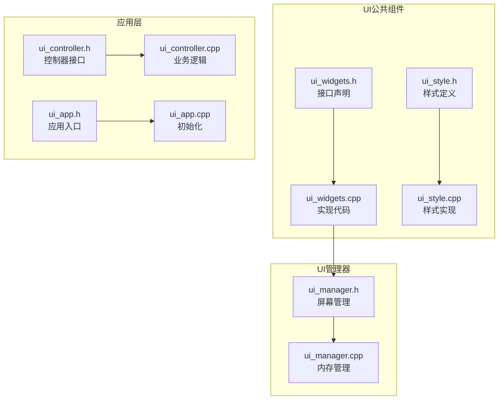
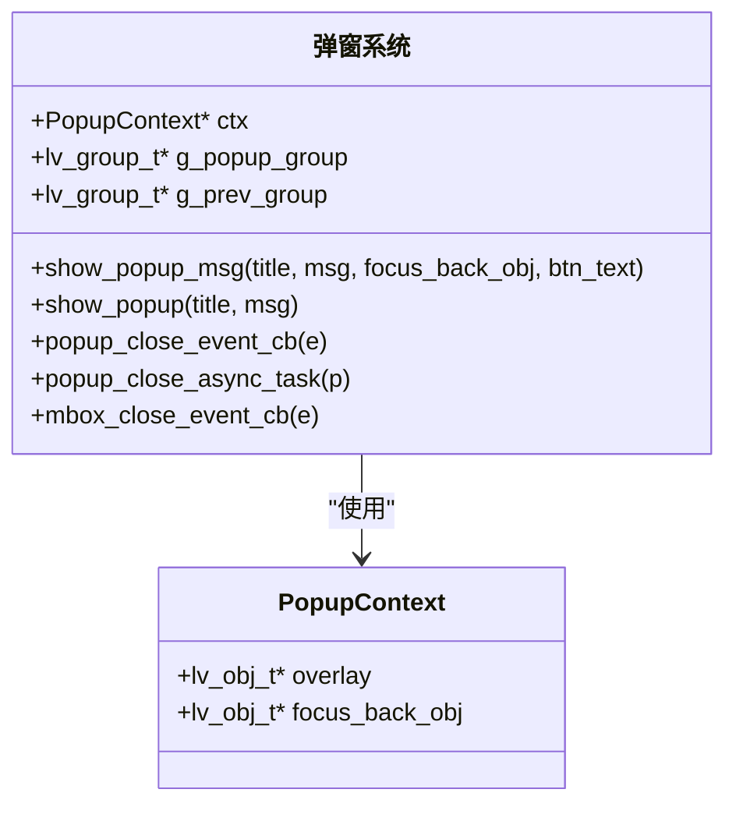
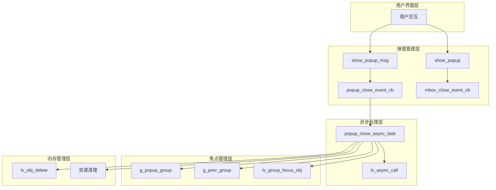
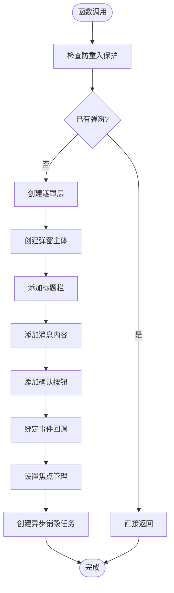
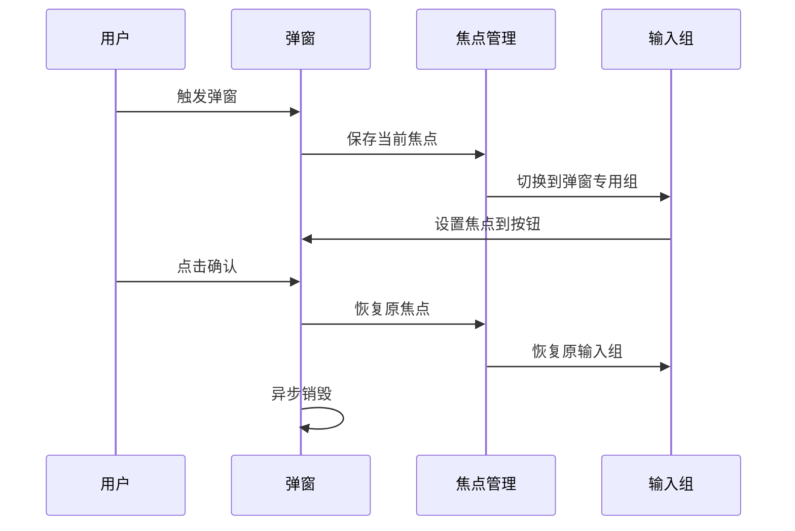
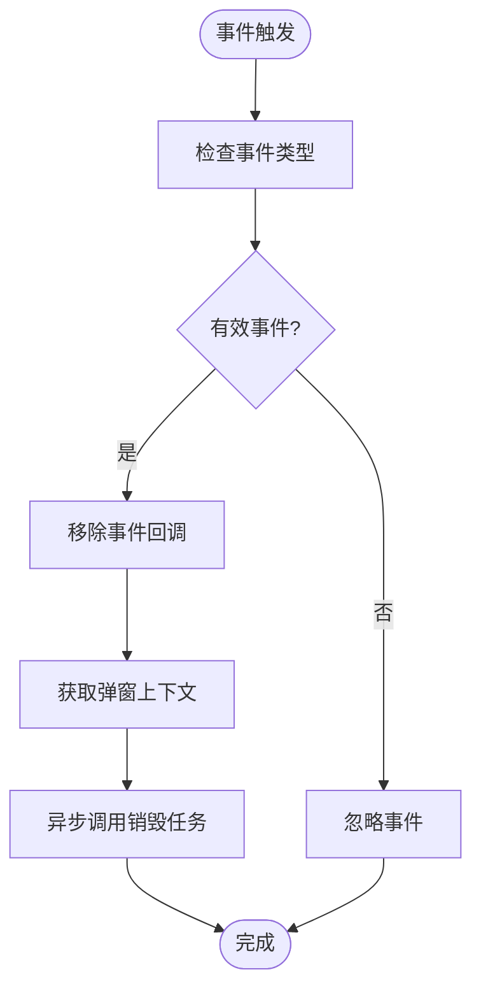
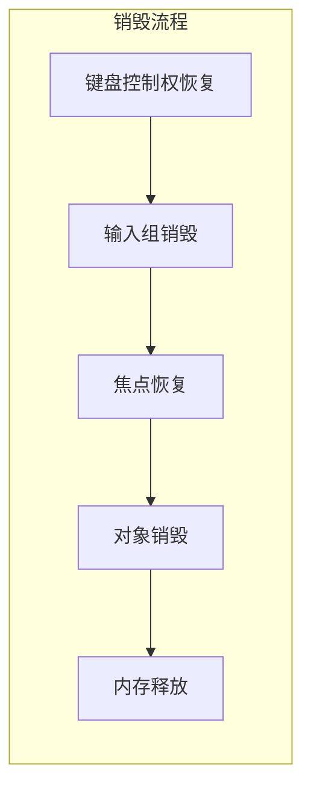
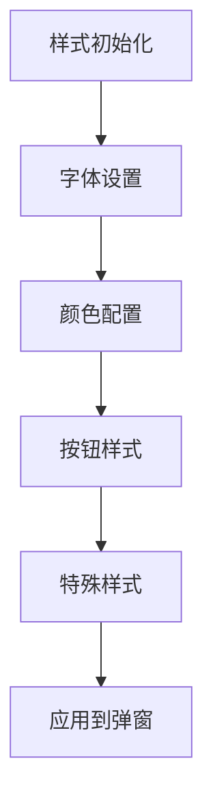
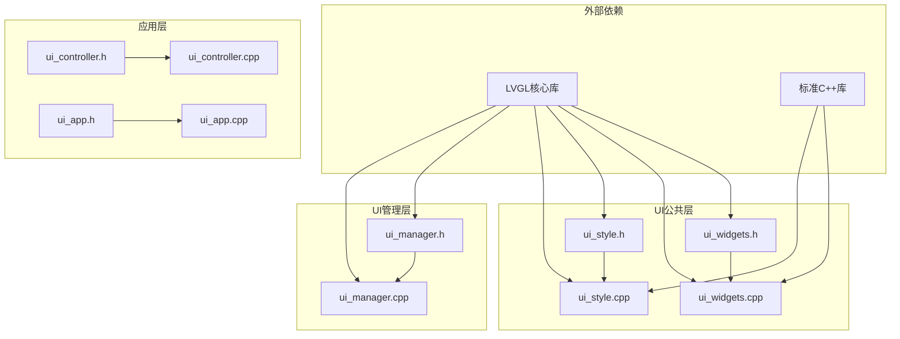

# 弹窗对话框API

<cite>
**本文档引用的文件**
- [ui_widgets.cpp](file://src/ui/common/ui_widgets.cpp)
- [ui_widgets.h](file://src/ui/common/ui_widgets.h)
- [ui_style.h](file://src/ui/common/ui_style.h)
- [ui_style.cpp](file://src/ui/common/ui_style.cpp)
- [ui_manager.h](file://src/ui/managers/ui_manager.h)
- [ui_manager.cpp](file://src/ui/managers/ui_manager.cpp)
- [ui_controller.cpp](file://src/ui/ui_controller.cpp)
- [ui_controller.h](file://src/ui/ui_controller.h)
- [ui_app.cpp](file://src/ui/ui_app.cpp)
- [ui_app.h](file://src/ui/ui_app.h)
</cite>

## 目录
1. [简介](#简介)
2. [项目结构](#项目结构)
3. [核心组件](#核心组件)
4. [架构概览](#架构概览)
5. [详细组件分析](#详细组件分析)
6. [依赖关系分析](#依赖关系分析)
7. [性能考虑](#性能考虑)
8. [故障排除指南](#故障排除指南)
9. [结论](#结论)
10. [附录](#附录)

## 简介

本文档详细介绍了SmartAttendance项目中的弹窗对话框API，重点涵盖以下核心功能：

- **show_popup_msg函数**：用于显示消息弹窗的接口，支持自定义标题、消息内容、焦点恢复对象和按钮文本参数
- **show_popup函数**：用于显示通用弹窗的接口
- **popup_close_async_task函数**：用于异步关闭弹窗的机制
- **popup_close_event_cb函数**：弹窗关闭事件回调函数
- **mbox_close_event_cb函数**：通用消息框关闭回调函数

该API提供了完整的弹窗管理系统，包括焦点管理、异步处理、内存管理和事件处理等关键特性。

## 项目结构

弹窗对话框功能主要分布在以下模块中：



**图表来源**
- [ui_widgets.cpp:1-775](file://src/ui/common/ui_widgets.cpp#L1-L775)
- [ui_widgets.h:1-152](file://src/ui/common/ui_widgets.h#L1-L152)
- [ui_manager.h:1-156](file://src/ui/managers/ui_manager.h#L1-L156)
- [ui_manager.cpp:1-125](file://src/ui/managers/ui_manager.cpp#L1-L125)

**章节来源**
- [ui_widgets.cpp:1-775](file://src/ui/common/ui_widgets.cpp#L1-L775)
- [ui_widgets.h:1-152](file://src/ui/common/ui_widgets.h#L1-L152)
- [ui_manager.h:1-156](file://src/ui/managers/ui_manager.h#L1-L156)
- [ui_manager.cpp:1-125](file://src/ui/managers/ui_manager.cpp#L1-L125)

## 核心组件

### 弹窗上下文结构体

弹窗系统的核心数据结构是一个简单的上下文结构体，用于在异步处理过程中传递必要的信息：



**图表来源**
- [ui_widgets.cpp:22-26](file://src/ui/common/ui_widgets.cpp#L22-L26)
- [ui_widgets.cpp:648-759](file://src/ui/common/ui_widgets.cpp#L648-L759)

### 弹窗显示函数

系统提供了两种主要的弹窗显示函数：

1. **show_popup_msg函数**：通用消息弹窗，支持自定义按钮文本
2. **show_popup函数**：基于LVGL内置消息框的通用弹窗

**章节来源**
- [ui_widgets.cpp:648-759](file://src/ui/common/ui_widgets.cpp#L648-L759)
- [ui_widgets.cpp:767-775](file://src/ui/common/ui_widgets.cpp#L767-L775)

## 架构概览

弹窗对话框系统采用分层架构设计，确保了良好的模块分离和功能完整性：



**图表来源**
- [ui_widgets.cpp:587-775](file://src/ui/common/ui_widgets.cpp#L587-L775)
- [ui_widgets.cpp:13-26](file://src/ui/common/ui_widgets.cpp#L13-L26)

## 详细组件分析

### show_popup_msg函数详解

`show_popup_msg`是系统中最复杂的弹窗函数，负责创建自定义消息弹窗并管理完整的生命周期：

#### 函数签名与参数
- **title**：弹窗标题，传入`nullptr`时不显示标题
- **msg**：弹窗内容消息
- **focus_back_obj**：弹窗关闭后需要恢复焦点的控件对象
- **btn_text**：按钮文本，默认为"确认"

#### 核心实现流程



**图表来源**
- [ui_widgets.cpp:648-759](file://src/ui/common/ui_widgets.cpp#L648-L759)

#### 焦点管理机制

弹窗系统实现了完整的焦点隔离和恢复机制：



**图表来源**
- [ui_widgets.cpp:743-758](file://src/ui/common/ui_widgets.cpp#L743-L758)

**章节来源**
- [ui_widgets.cpp:648-759](file://src/ui/common/ui_widgets.cpp#L648-L759)

### popup_close_event_cb事件回调

事件回调函数是弹窗系统的核心控制逻辑：

#### 事件处理策略
- **点击事件**：直接触发关闭流程
- **键盘事件**：仅响应回车键(ENTER)和返回键(ESC)
- **防抖机制**：立即移除事件回调，防止按键抖动导致的重复触发

#### 异步处理流程



**图表来源**
- [ui_widgets.cpp:623-640](file://src/ui/common/ui_widgets.cpp#L623-L640)

**章节来源**
- [ui_widgets.cpp:623-640](file://src/ui/common/ui_widgets.cpp#L623-L640)

### popup_close_async_task异步销毁

异步销毁任务确保了弹窗关闭过程的安全性和稳定性：

#### 销毁顺序保证
1. **键盘控制权恢复**：将输入设备控制权交还给背景界面
2. **临时组销毁**：删除弹窗专用的输入组
3. **焦点恢复**：将焦点恢复到原界面的指定控件
4. **资源清理**：销毁遮罩层和弹窗主体
5. **内存释放**：释放弹窗上下文结构体

#### 内存管理策略



**图表来源**
- [ui_widgets.cpp:587-620](file://src/ui/common/ui_widgets.cpp#L587-L620)

**章节来源**
- [ui_widgets.cpp:587-620](file://src/ui/common/ui_widgets.cpp#L587-L620)

### mbox_close_event_cb消息框回调

针对LVGL内置消息框的专用回调函数：

#### 功能特点
- **简单直接**：直接调用`lv_msgbox_close()`关闭消息框
- **用户数据绑定**：通过事件回调的用户数据参数获取消息框对象
- **事件驱动**：仅响应点击事件

**章节来源**
- [ui_widgets.cpp:761-765](file://src/ui/common/ui_widgets.cpp#L761-L765)

### 弹窗样式系统

弹窗系统集成了完整的样式管理机制：

#### 样式定义
- **主题色彩**：深蓝背景(0x0055FF)，白色文本
- **字体支持**：中文字体Noto 16号字
- **按钮样式**：半透明白色背景，圆角设计
- **特殊样式**：紧急操作使用正红色背景

#### 样式应用流程



**图表来源**
- [ui_style.cpp:16-78](file://src/ui/common/ui_style.cpp#L16-L78)

**章节来源**
- [ui_style.h:15-48](file://src/ui/common/ui_style.h#L15-L48)
- [ui_style.cpp:16-78](file://src/ui/common/ui_style.cpp#L16-L78)

## 依赖关系分析

弹窗对话框API的依赖关系体现了清晰的分层架构：



**图表来源**
- [ui_widgets.cpp:1-12](file://src/ui/common/ui_widgets.cpp#L1-L12)
- [ui_manager.h:1-11](file://src/ui/managers/ui_manager.h#L1-L11)

**章节来源**
- [ui_widgets.cpp:1-12](file://src/ui/common/ui_widgets.cpp#L1-L12)
- [ui_manager.h:1-11](file://src/ui/managers/ui_manager.h#L1-L11)

### 组件耦合度分析

弹窗系统的耦合度设计合理：

- **低耦合**：各组件职责明确，相互独立
- **高内聚**：相关功能集中在ui_widgets模块
- **接口清晰**：对外提供简洁的API接口
- **扩展性强**：易于添加新的弹窗类型和样式

## 性能考虑

### 异步处理优化

系统采用异步处理机制避免阻塞主线程：

- **lv_async_call**：确保事件处理完成后执行销毁逻辑
- **定时器清理**：使用10ms延迟确保内存安全释放
- **防重入保护**：防止多个弹窗同时激活导致的死锁

### 内存管理优化

- **RAII原则**：自动管理弹窗上下文内存
- **智能指针替代**：使用new/delete确保资源正确释放
- **延迟销毁**：避免立即销毁导致的引用失效

### 焦点管理优化

- **输入组隔离**：创建专用输入组避免焦点冲突
- **状态保存**：完整保存和恢复焦点状态
- **资源回收**：及时清理临时创建的输入组

## 故障排除指南

### 常见问题及解决方案

#### 弹窗无法显示
**可能原因**：
- 已有弹窗实例正在运行
- 参数传递错误

**解决方法**：
- 检查防重入保护逻辑
- 验证参数有效性

#### 焦点丢失问题
**可能原因**：
- focus_back_obj参数为空
- 弹窗关闭流程异常

**解决方法**：
- 确保传递有效的焦点对象
- 检查异步销毁任务执行

#### 内存泄漏问题
**可能原因**：
- 弹窗对象未正确销毁
- 上下文结构体内存未释放

**解决方法**：
- 确认popup_close_async_task执行
- 验证资源清理流程

**章节来源**
- [ui_widgets.cpp:650-653](file://src/ui/common/ui_widgets.cpp#L650-L653)
- [ui_widgets.cpp:619](file://src/ui/common/ui_widgets.cpp#L619)

## 结论

SmartAttendance项目的弹窗对话框API展现了优秀的软件工程实践：

### 设计优势
- **模块化设计**：清晰的功能分离和职责划分
- **安全性考虑**：完善的防重入、防抖和内存管理机制
- **用户体验**：流畅的焦点管理和异步处理
- **可维护性**：简洁的API接口和清晰的实现逻辑

### 技术亮点
- **异步销毁机制**：确保UI线程安全
- **焦点隔离技术**：避免输入冲突
- **样式系统集成**：统一的视觉设计
- **内存管理策略**：自动化的资源清理

该API为SmartAttendance项目提供了稳定可靠的弹窗功能，为用户提供了良好的交互体验，同时为未来的功能扩展奠定了坚实的基础。

## 附录

### 使用示例

#### 基本消息弹窗
```cpp
// 显示简单的提示消息
show_popup("提示", "操作已完成");
```

#### 自定义按钮文本
```cpp
// 显示带自定义按钮文本的消息
show_popup_msg("确认", "是否要删除该记录？", nullptr, "确定删除");
```

#### 错误提示弹窗
```cpp
// 显示错误消息并恢复焦点
show_popup_msg("错误", "网络连接失败，请检查设置", focused_obj);
```

#### 确认对话框
```cpp
// 显示确认对话框
show_popup_msg("警告", "此操作不可撤销，是否继续？", nullptr, "确认执行");
```

### 最佳实践

1. **参数验证**：始终验证传入参数的有效性
2. **资源管理**：确保弹窗对象正确销毁
3. **焦点处理**：合理设置焦点恢复对象
4. **异步处理**：避免在弹窗中执行长时间阻塞操作
5. **样式统一**：遵循项目统一的视觉设计规范