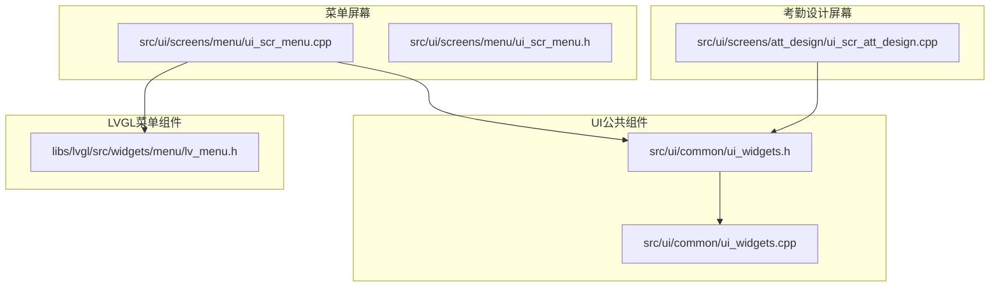
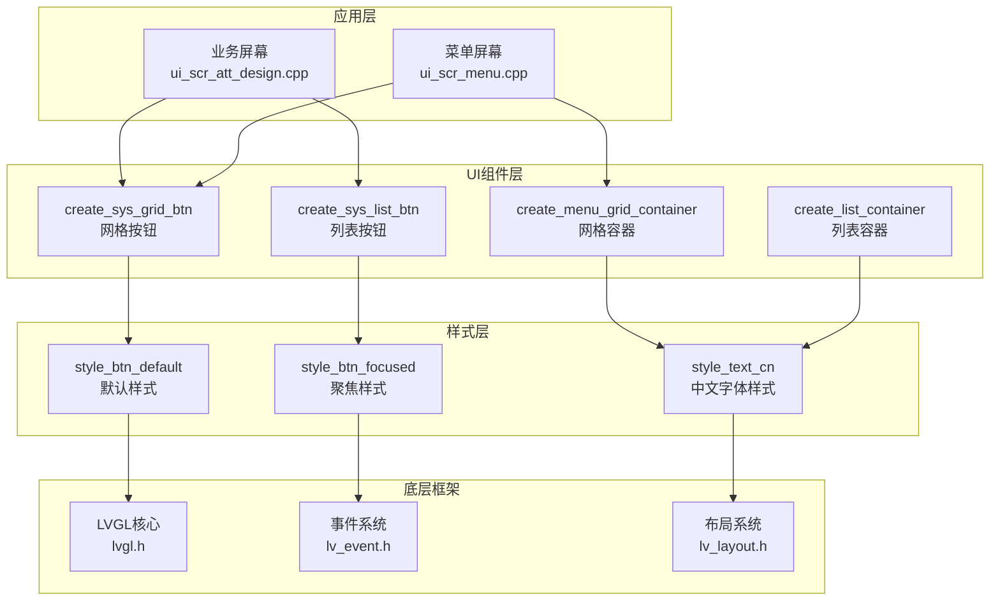
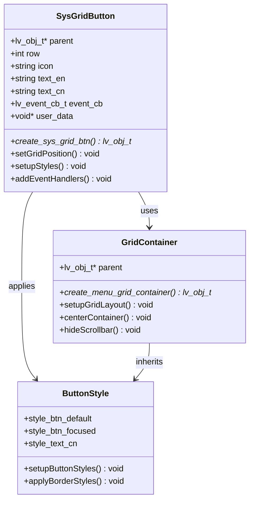
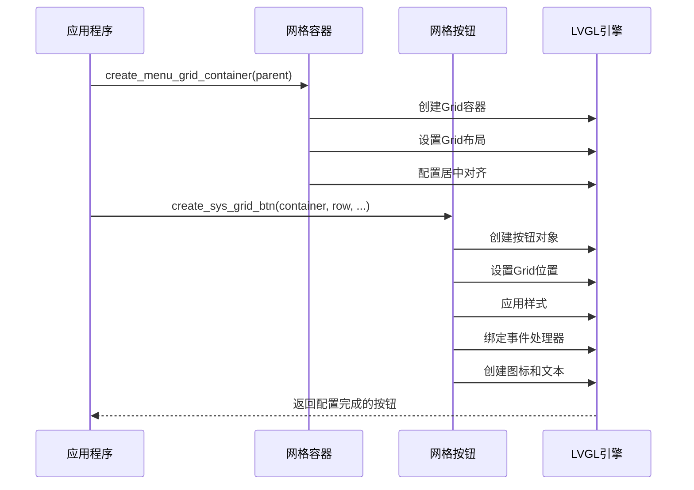
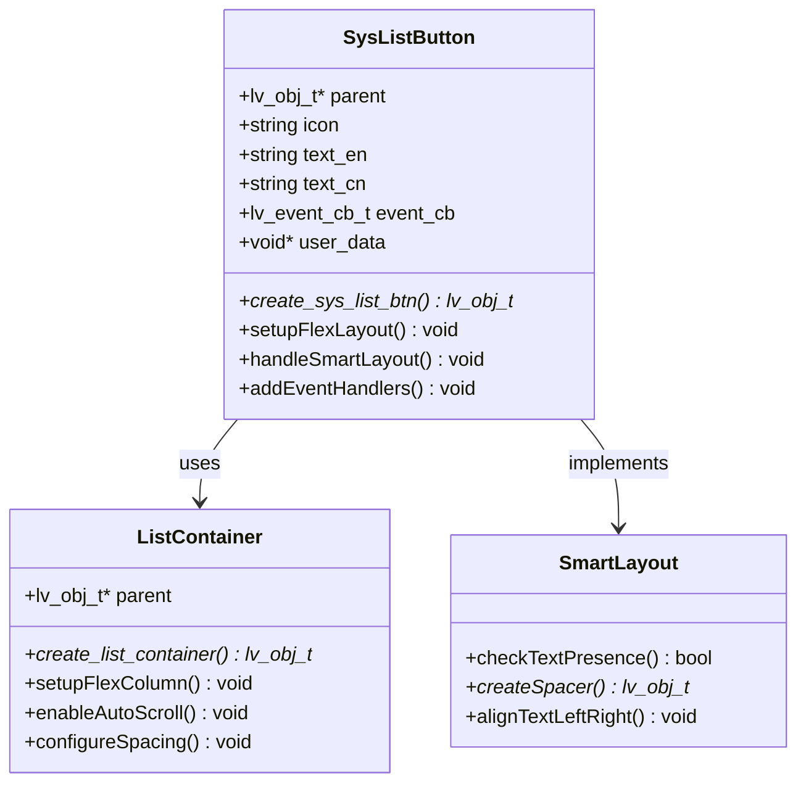
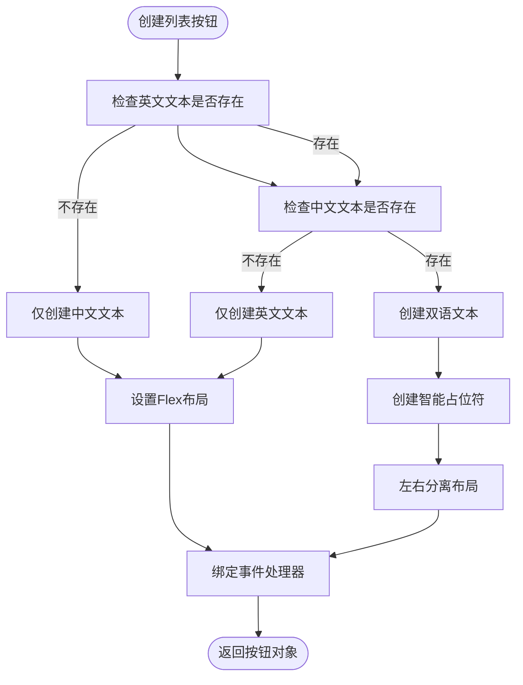
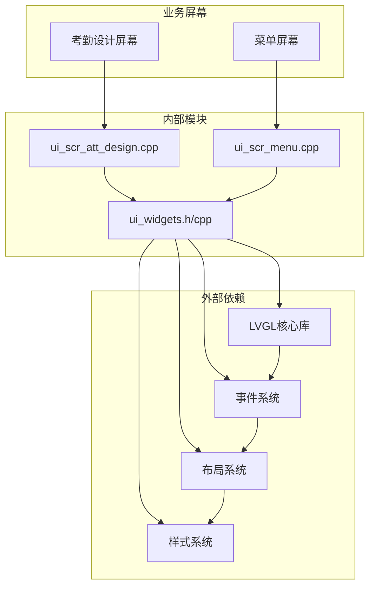

# 菜单按钮API

<cite>
**本文档引用的文件**
- [ui_widgets.h](file://src/ui/common/ui_widgets.h)
- [ui_widgets.cpp](file://src/ui/common/ui_widgets.cpp)
- [ui_scr_att_design.cpp](file://src/ui/screens/att_design/ui_scr_att_design.cpp)
- [ui_scr_menu.cpp](file://src/ui/screens/menu/ui_scr_menu.cpp)
- [lv_menu.h](file://libs/lvgl/src/widgets/menu/lv_menu.h)
</cite>

## 目录
1. [简介](#简介)
2. [项目结构](#项目结构)
3. [核心组件](#核心组件)
4. [架构概览](#架构概览)
5. [详细组件分析](#详细组件分析)
6. [依赖关系分析](#依赖关系分析)
7. [性能考虑](#性能考虑)
8. [故障排除指南](#故障排除指南)
9. [结论](#结论)

## 简介

本文档详细介绍了SmartAttendance项目中的菜单按钮API，重点涵盖以下核心功能：

- **create_sys_grid_btn函数**：用于创建系统菜单网格按钮的完整接口
- **create_sys_list_btn函数**：用于创建系统列表按钮的接口
- **create_menu_grid_container函数**：用于创建九宫格菜单容器
- **create_list_container函数**：用于创建垂直列表容器

这些API专为基于LVGL的嵌入式UI设计，提供了统一的菜单按钮创建规范，支持Flex布局和Grid布局两种不同的菜单组织方式。

## 项目结构

SmartAttendance项目的UI组件主要分布在以下目录结构中：



**图表来源**
- [ui_widgets.h:1-152](file://src/ui/common/ui_widgets.h#L1-L152)
- [ui_widgets.cpp:1-776](file://src/ui/common/ui_widgets.cpp#L1-L776)

**章节来源**
- [ui_widgets.h:1-152](file://src/ui/common/ui_widgets.h#L1-L152)
- [ui_widgets.cpp:1-776](file://src/ui/common/ui_widgets.cpp#L1-L776)

## 核心组件

### create_sys_grid_btn函数

create_sys_grid_btn函数用于创建九宫格菜单按钮，专为Grid布局设计：

**函数签名**
```c++
lv_obj_t* create_sys_grid_btn(
    lv_obj_t *parent, 
    int row,
    const char* icon, 
    const char* text_en, 
    const char* text_cn,
    lv_event_cb_t event_cb, 
    const char* user_data
);
```

**参数说明**
- `parent`: 父对象（Grid容器）
- `row`: Grid行索引
- `icon`: 图标符号（如LV_SYMBOL_DIRECTORY）
- `text_en`: 英文文本
- `text_cn`: 中文文本
- `event_cb`: 事件回调函数
- `user_data`: 用户数据指针

**功能特性**
- 支持Grid布局定位
- 自动设置按钮尺寸和样式
- 支持图标和双语文本显示
- 集成事件处理机制

**章节来源**
- [ui_widgets.h:31-45](file://src/ui/common/ui_widgets.h#L31-L45)
- [ui_widgets.cpp:278-331](file://src/ui/common/ui_widgets.cpp#L278-L331)

### create_sys_list_btn函数

create_sys_list_btn函数用于创建系统列表按钮，专为Flex布局设计：

**函数签名**
```c++
lv_obj_t* create_sys_list_btn(
    lv_obj_t *parent,
    const char* icon, 
    const char* text_en, 
    const char* text_cn,
    lv_event_cb_t event_cb, 
    const char* user_data
);
```

**参数说明**
- `parent`: 父对象（Flex列表容器）
- `icon`: 图标符号
- `text_en`: 英文文本
- `text_cn`: 中文文本
- `event_cb`: 事件回调函数
- `user_data`: 用户数据指针

**功能特性**
- 专为Flex列表设计，宽度100%
- 支持智能布局（图标+左右分离的文本）
- 自动处理内边距和间距
- 集成键盘导航支持

**章节来源**
- [ui_widgets.h:58-71](file://src/ui/common/ui_widgets.h#L58-L71)
- [ui_widgets.cpp:201-276](file://src/ui/common/ui_widgets.cpp#L201-L276)

### create_menu_grid_container函数

create_menu_grid_container函数用于创建九宫格菜单容器：

**函数签名**
```c++
lv_obj_t* create_menu_grid_container(lv_obj_t* parent);
```

**功能特性**
- 自动居中对齐
- 隐藏滚动条
- 预设Grid布局（2列）
- 适配240x320屏幕分辨率

**章节来源**
- [ui_widgets.h:47-56](file://src/ui/common/ui_widgets.h#L47-L56)
- [ui_widgets.cpp:366-397](file://src/ui/common/ui_widgets.cpp#L366-L397)

### create_list_container函数

create_list_container函数用于创建垂直列表容器：

**函数签名**
```c++
lv_obj_t* create_list_container(lv_obj_t* parent);
```

**功能特性**
- 支持自动滚动
- 顶部对齐
- Flex布局（垂直排列）
- 统一的间距控制

**章节来源**
- [ui_widgets.h:73-77](file://src/ui/common/ui_widgets.h#L73-L77)
- [ui_widgets.cpp:336-364](file://src/ui/common/ui_widgets.cpp#L336-L364)

## 架构概览

SmartAttendance的菜单系统采用分层架构设计：



**图表来源**
- [ui_widgets.cpp:1-776](file://src/ui/common/ui_widgets.cpp#L1-L776)
- [ui_scr_att_design.cpp:80-114](file://src/ui/screens/att_design/ui_scr_att_design.cpp#L80-L114)
- [ui_scr_menu.cpp:150-228](file://src/ui/screens/menu/ui_scr_menu.cpp#L150-L228)

## 详细组件分析

### 网格按钮组件分析

网格按钮组件是九宫格菜单的核心，具有以下特点：



**图表来源**
- [ui_widgets.cpp:278-331](file://src/ui/common/ui_widgets.cpp#L278-L331)
- [ui_widgets.cpp:366-397](file://src/ui/common/ui_widgets.cpp#L366-L397)

#### 网格按钮创建流程



**图表来源**
- [ui_widgets.cpp:366-397](file://src/ui/common/ui_widgets.cpp#L366-L397)
- [ui_widgets.cpp:278-331](file://src/ui/common/ui_widgets.cpp#L278-L331)

**章节来源**
- [ui_widgets.cpp:278-331](file://src/ui/common/ui_widgets.cpp#L278-L331)
- [ui_widgets.cpp:366-397](file://src/ui/common/ui_widgets.cpp#L366-L397)

### 列表按钮组件分析

列表按钮组件专为垂直菜单设计：



**图表来源**
- [ui_widgets.cpp:201-276](file://src/ui/common/ui_widgets.cpp#L201-L276)
- [ui_widgets.cpp:336-364](file://src/ui/common/ui_widgets.cpp#L336-L364)

#### 列表按钮智能布局算法



**图表来源**
- [ui_widgets.cpp:201-276](file://src/ui/common/ui_widgets.cpp#L201-L276)

**章节来源**
- [ui_widgets.cpp:201-276](file://src/ui/common/ui_widgets.cpp#L201-L276)

### 使用示例

#### 九宫格菜单创建示例

以下示例展示了如何创建九宫格菜单：

```cpp
// 创建九宫格容器
lv_obj_t* grid_container = create_menu_grid_container(parts.content);

// 定义菜单项数据
MenuEntry menu_items[] = {
    {"User Mgmt", "员工管理", "UserMgmt"}, 
    {"Records", "记录查询", "Records"},
    {"Att. Stats", "考勤统计", "STATS"},
    {"System", "系统设置", "System"}
};

// 创建网格按钮
for(int i = 0; i < 4; i++) {
    int row = i / 2;  // 计算行索引
    int col = i % 2;  // 计算列索引
    
    lv_obj_t* btn = create_sys_grid_btn(
        grid_container, 
        row,
        menu_items[i].icon,
        menu_items[i].text_en,
        menu_items[i].text_cn,
        menu_btn_event_cb,
        menu_items[i].event_tag
    );
}
```

#### 垂直列表菜单创建示例

以下示例展示了如何创建垂直列表菜单：

```cpp
// 创建列表容器
lv_obj_t* list_container = create_list_container(parts.content);

// 创建列表按钮
create_sys_list_btn(list_container, "1. ", "", "部门设置", design_event_cb, "DEPT");
create_sys_list_btn(list_container, "2. ", "", "班次设置", design_event_cb, "SHIFT");
create_sys_list_btn(list_container, "3. ", "", "考勤规则", design_event_cb, "RULE");
create_sys_list_btn(list_container, "4. ", "", "人员排班", design_event_cb, "SCH");

// 添加到输入组进行键盘导航
uint32_t child_cnt = lv_obj_get_child_cnt(list_container);
for(uint32_t i = 0; i < child_cnt; i++) {
    UiManager::getInstance()->addObjToGroup(lv_obj_get_child(list_container, i));
}
```

**章节来源**
- [ui_scr_menu.cpp:164-211](file://src/ui/screens/menu/ui_scr_menu.cpp#L164-L211)
- [ui_scr_att_design.cpp:84-99](file://src/ui/screens/att_design/ui_scr_att_design.cpp#L84-L99)

## 依赖关系分析

菜单按钮API的依赖关系如下：



**图表来源**
- [ui_widgets.h:1-152](file://src/ui/common/ui_widgets.h#L1-L152)
- [ui_widgets.cpp:1-776](file://src/ui/common/ui_widgets.cpp#L1-L776)

**章节来源**
- [ui_widgets.h:1-152](file://src/ui/common/ui_widgets.h#L1-L152)
- [ui_widgets.cpp:1-776](file://src/ui/common/ui_widgets.cpp#L1-L776)

## 性能考虑

### 内存管理

- **对象池化**: 建议对频繁创建的按钮对象使用对象池技术
- **样式共享**: 多个按钮共享相同的样式对象，减少内存占用
- **事件回调**: 合理管理事件回调的生命周期，避免内存泄漏

### 渲染优化

- **批量创建**: 对于大量按钮的场景，建议批量创建而非逐个创建
- **延迟加载**: 对于滚动列表，可以实现虚拟化渲染
- **样式缓存**: LVGL会自动缓存样式，但应避免重复创建相同样式的对象

### 事件处理

- **事件冒泡**: 合理利用LVGL的事件冒泡机制
- **回调函数**: 避免在回调函数中执行耗时操作
- **内存安全**: 确保user_data的生命周期安全

## 故障排除指南

### 常见问题及解决方案

#### 1. 按钮无法接收焦点

**问题症状**: 按钮无法通过键盘导航选中

**解决方案**:
- 确保按钮添加到输入组中
- 检查按钮是否设置了`LV_OBJ_FLAG_CLICKABLE`标志
- 验证事件回调函数是否正确绑定

#### 2. 文本显示异常

**问题症状**: 中文文本显示为乱码或不完整

**解决方案**:
- 确保使用`style_text_cn`样式
- 检查字体是否正确加载
- 验证字符串编码格式

#### 3. 布局错位

**问题症状**: 按钮位置不正确或尺寸异常

**解决方案**:
- 检查Grid布局的行列描述数组
- 验证Flex布局的对齐参数
- 确认容器的尺寸设置

**章节来源**
- [ui_widgets.cpp:201-276](file://src/ui/common/ui_widgets.cpp#L201-L276)
- [ui_widgets.cpp:278-331](file://src/ui/common/ui_widgets.cpp#L278-L331)

## 结论

SmartAttendance项目的菜单按钮API提供了完整的UI组件解决方案，具有以下优势：

1. **统一的API设计**: 所有菜单按钮都遵循相同的创建模式
2. **灵活的布局支持**: 同时支持Grid和Flex两种布局方式
3. **完善的事件处理**: 内置事件回调机制和键盘导航支持
4. **良好的扩展性**: 易于添加新的菜单类型和样式

通过合理使用这些API，开发者可以快速构建功能丰富、用户体验优秀的嵌入式应用程序界面。建议在实际开发中遵循本文档的最佳实践，确保代码的可维护性和性能表现。