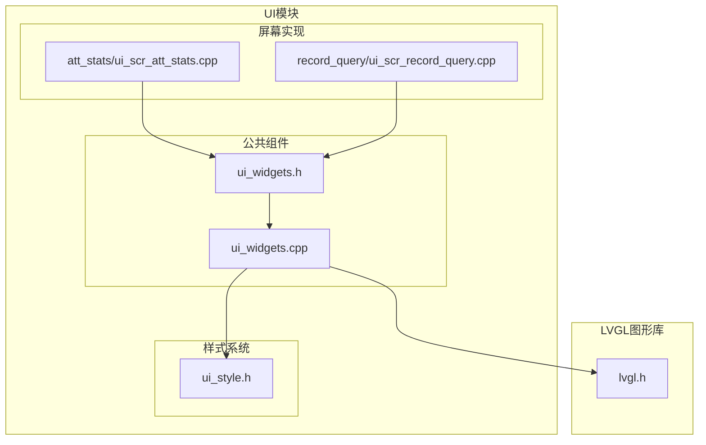
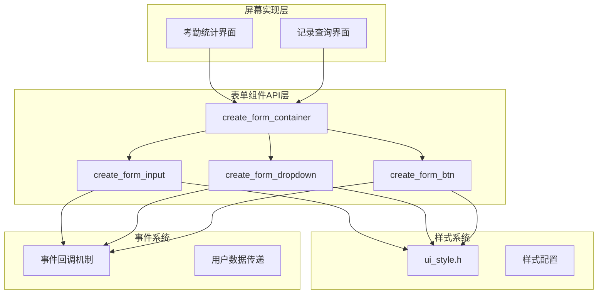
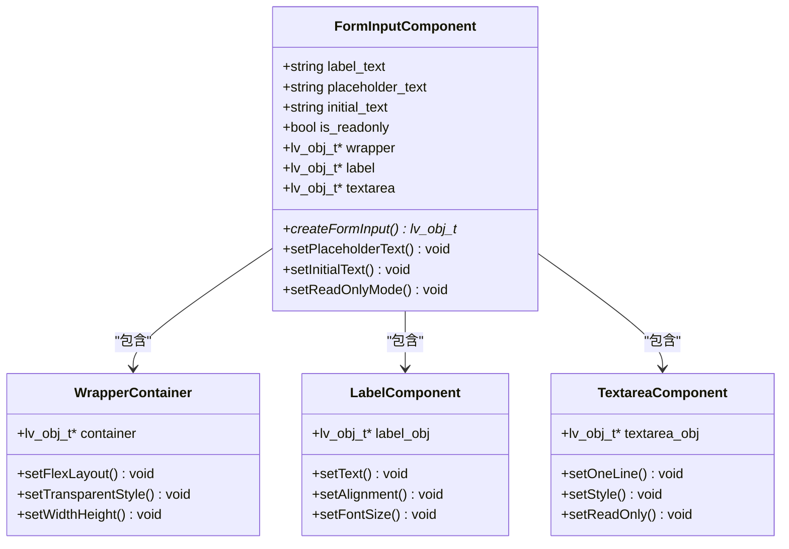
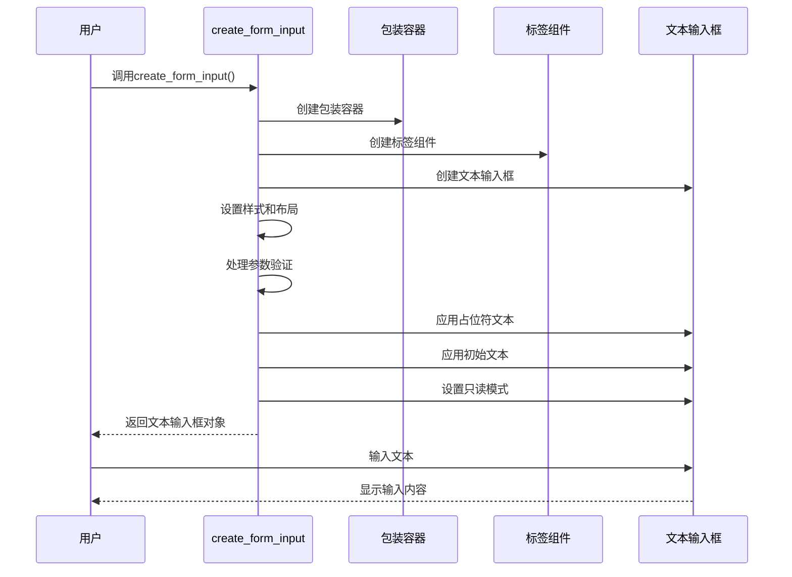
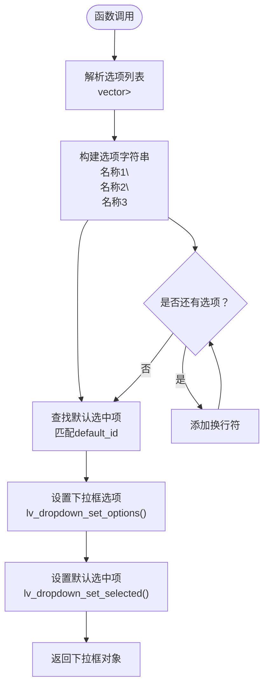
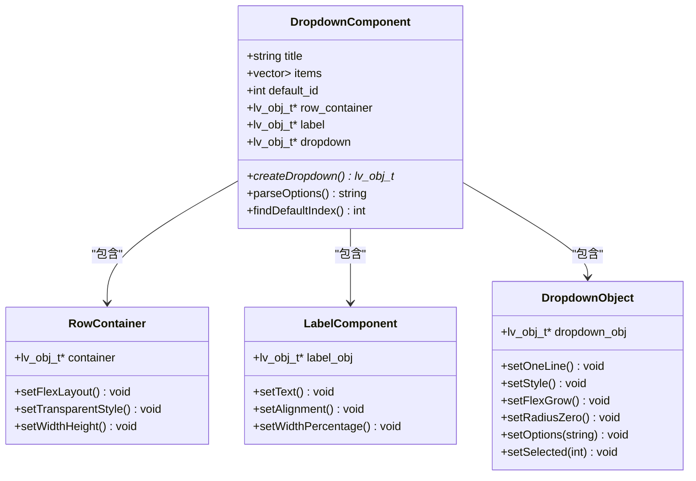
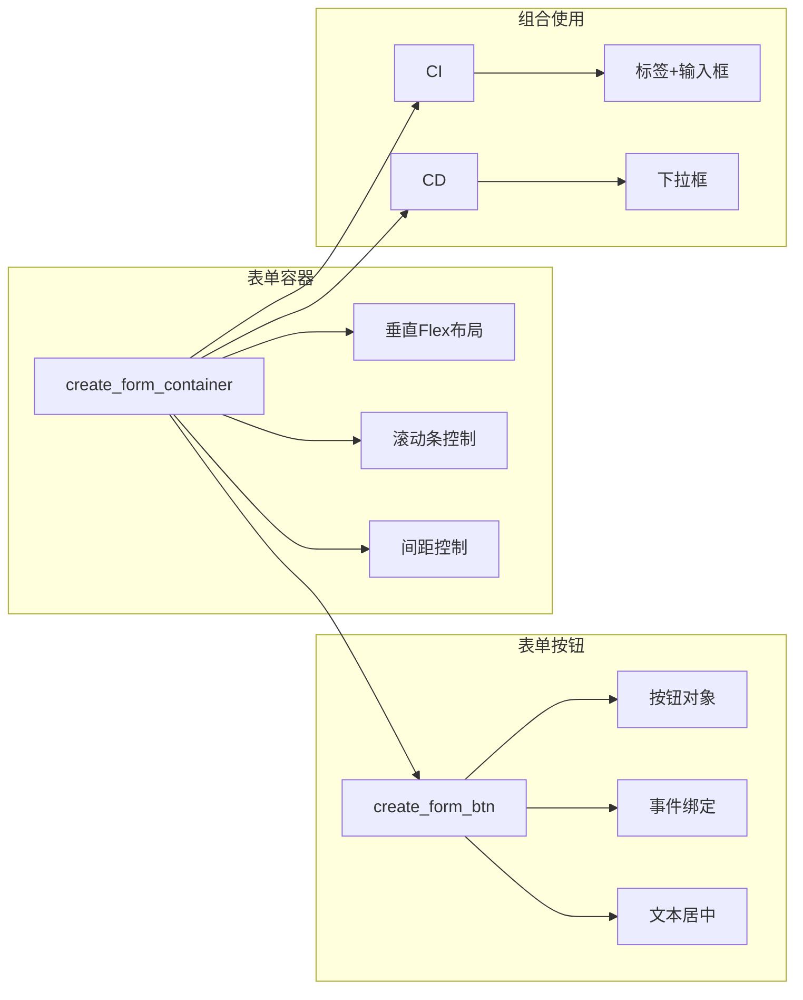
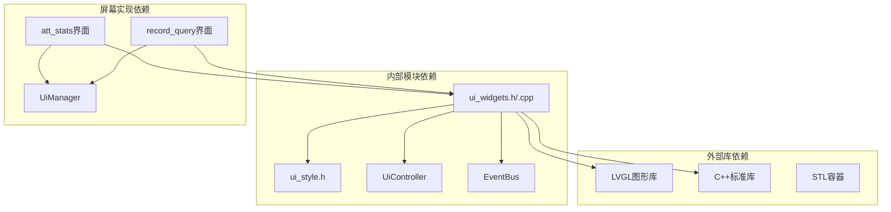

# 表单组件API

<cite>
**本文档引用的文件**
- [ui_widgets.h](file://src/ui/common/ui_widgets.h)
- [ui_widgets.cpp](file://src/ui/common/ui_widgets.cpp)
- [ui_scr_att_stats.cpp](file://src/ui/screens/att_stats/ui_scr_att_stats.cpp)
- [ui_scr_record_query.cpp](file://src/ui/screens/record_query/ui_scr_record_query.cpp)
</cite>

## 目录
1. [简介](#简介)
2. [项目结构](#项目结构)
3. [核心组件](#核心组件)
4. [架构概览](#架构概览)
5. [详细组件分析](#详细组件分析)
6. [依赖关系分析](#依赖关系分析)
7. [性能考虑](#性能考虑)
8. [故障排除指南](#故障排除指南)
9. [结论](#结论)

## 简介

本文档详细介绍了SmartAttendance项目中的表单组件API，重点涵盖以下四个核心函数：

- `create_form_input`: 创建表单输入组件
- `create_form_dropdown`: 创建下拉选择框
- `create_form_container`: 创建表单容器
- `create_form_btn`: 创建表单按钮

这些API为构建复杂的用户输入界面提供了统一的接口和一致的用户体验。文档不仅详细说明了每个函数的参数、行为和返回值，还提供了完整的使用示例和最佳实践指导。

## 项目结构

表单组件API位于SmartAttendance项目的UI模块中，采用分层架构设计：



**图表来源**
- [ui_widgets.h:1-152](file://src/ui/common/ui_widgets.h#L1-L152)
- [ui_widgets.cpp:1-776](file://src/ui/common/ui_widgets.cpp#L1-L776)

**章节来源**
- [ui_widgets.h:1-152](file://src/ui/common/ui_widgets.h#L1-L152)
- [ui_widgets.cpp:1-776](file://src/ui/common/ui_widgets.cpp#L1-L776)

## 核心组件

### create_form_input 函数

`create_form_input`函数用于创建表单输入组件，提供完整的文本输入功能。

**函数签名**
```cpp
lv_obj_t* create_form_input(
    lv_obj_t *parent, 
    const char *label_text, 
    const char *placeholder_text, 
    const char *initial_text, 
    bool is_readonly
);
```

**参数说明**
- `parent`: 父容器对象（通常是表单容器）
- `label_text`: 左侧标签文本（如"员工工号:"）
- `placeholder_text`: 占位符文本（如"请输入工号"）
- `initial_text`: 初始文本内容
- `is_readonly`: 是否为只读模式

**功能特性**
- 自动创建标签和文本输入框的组合布局
- 支持占位符文本显示
- 支持初始文本填充
- 支持只读模式切换
- 统一的视觉样式和间距

**返回值**
- 返回创建的文本输入框对象指针

**章节来源**
- [ui_widgets.h:88-94](file://src/ui/common/ui_widgets.h#L88-L94)
- [ui_widgets.cpp:402-463](file://src/ui/common/ui_widgets.cpp#L402-L463)

### create_form_dropdown 函数

`create_form_dropdown`函数用于创建下拉选择框组件。

**函数签名**
```cpp
lv_obj_t* create_form_dropdown(
    lv_obj_t* parent,
    const char* title,
    const std::vector<std::pair<int, std::string>>& items,
    int default_id
);
```

**参数说明**
- `parent`: 父容器对象
- `title`: 左侧标题文本
- `items`: 选项列表，格式为`vector<pair<int, string>>`
- `default_id`: 默认选中的数据ID

**选项列表格式**
选项列表采用`std::vector<std::pair<int, std::string>>`格式：
- `pair.first`: 数据ID（整数类型）
- `pair.second`: 显示名称（字符串类型）

**功能特性**
- 自动解析选项列表并转换为下拉框数据
- 支持默认选中项设置
- 统一的视觉样式和布局
- 自动处理选项分隔符

**返回值**
- 返回创建的下拉框对象指针

**章节来源**
- [ui_widgets.h:104-110](file://src/ui/common/ui_widgets.h#L104-L110)
- [ui_widgets.cpp:465-521](file://src/ui/common/ui_widgets.cpp#L465-L521)

### create_form_container 函数

`create_form_container`函数用于创建表单容器，作为其他表单组件的父容器。

**函数签名**
```cpp
lv_obj_t* create_form_container(lv_obj_t* parent);
```

**参数说明**
- `parent`: 父对象（通常是屏幕内容区域）

**功能特性**
- 支持自动滚动条显示
- 垂直Flex布局
- 统一的表单间距控制
- 透明背景和无边框样式

**返回值**
- 返回创建的表单容器对象指针

**章节来源**
- [ui_widgets.h:116](file://src/ui/common/ui_widgets.h#L116)
- [ui_widgets.cpp:526-550](file://src/ui/common/ui_widgets.cpp#L526-L550)

### create_form_btn 函数

`create_form_btn`函数用于创建表单按钮组件。

**函数签名**
```cpp
lv_obj_t* create_form_btn(
    lv_obj_t *parent, 
    const char *btn_text, 
    lv_event_cb_t event_cb, 
    void *user_data
);
```

**参数说明**
- `parent`: 父容器对象
- `btn_text`: 按钮文本内容
- `event_cb`: 事件回调函数
- `user_data`: 用户数据指针

**功能特性**
- 支持事件绑定
- 统一的视觉样式
- 居中对齐的文本显示
- 90%宽度的视觉对齐

**返回值**
- 返回创建的按钮对象指针

**章节来源**
- [ui_widgets.h:126](file://src/ui/common/ui_widgets.h#L126)
- [ui_widgets.cpp:555-582](file://src/ui/common/ui_widgets.cpp#L555-L582)

## 架构概览

表单组件API采用模块化设计，遵循单一职责原则：



**图表来源**
- [ui_widgets.h:88-126](file://src/ui/common/ui_widgets.h#L88-L126)
- [ui_widgets.cpp:526-582](file://src/ui/common/ui_widgets.cpp#L526-L582)

## 详细组件分析

### create_form_input 组件详细分析

#### 类关系图


**图表来源**
- [ui_widgets.cpp:402-463](file://src/ui/common/ui_widgets.cpp#L402-L463)

#### 输入流程序列图


**图表来源**
- [ui_widgets.cpp:402-463](file://src/ui/common/ui_widgets.cpp#L402-L463)

**章节来源**
- [ui_widgets.cpp:402-463](file://src/ui/common/ui_widgets.cpp#L402-L463)

### create_form_dropdown 组件详细分析

#### 下拉框数据流程图


**图表来源**
- [ui_widgets.cpp:505-518](file://src/ui/common/ui_widgets.cpp#L505-L518)

#### 下拉框组件类图


**图表来源**
- [ui_widgets.cpp:465-521](file://src/ui/common/ui_widgets.cpp#L465-L521)

**章节来源**
- [ui_widgets.cpp:465-521](file://src/ui/common/ui_widgets.cpp#L465-L521)

### 表单容器和按钮组件分析

#### 组件关系图


**图表来源**
- [ui_widgets.cpp:526-582](file://src/ui/common/ui_widgets.cpp#L526-L582)

**章节来源**
- [ui_widgets.cpp:526-582](file://src/ui/common/ui_widgets.cpp#L526-L582)

## 依赖关系分析

### 外部依赖关系


**图表来源**
- [ui_widgets.cpp:1-12](file://src/ui/common/ui_widgets.cpp#L1-L12)

### 内部耦合分析

表单组件API具有良好的内聚性和低耦合性：

- **高内聚**: 每个函数专注于单一职责
- **低耦合**: 通过标准接口与外部模块交互
- **可扩展性**: 支持新的表单组件类型
- **可维护性**: 清晰的函数边界和参数约定

**章节来源**
- [ui_widgets.cpp:1-12](file://src/ui/common/ui_widgets.cpp#L1-L12)

## 性能考虑

### 内存管理
- 所有组件对象都通过LVGL的内存管理系统创建和销毁
- 自动处理事件回调的内存分配和释放
- 避免内存泄漏的异步销毁机制

### 渲染性能
- 使用Flex布局减少重绘次数
- 统一样式配置提高渲染效率
- 滚动条按需显示避免不必要的开销

### 事件处理
- 事件回调采用异步处理机制
- 防抖动机制防止重复触发
- 键盘焦点管理优化用户体验

## 故障排除指南

### 常见问题及解决方案

#### 1. 文本显示异常
**问题**: 中文字符显示乱码
**解决方案**: 确保使用`style_text_cn`样式，该样式已配置中文字体

#### 2. 事件绑定失效
**问题**: 按钮点击无响应
**解决方案**: 检查事件回调函数是否正确传递，确保`event_cb`参数非空

#### 3. 下拉框选项不显示
**问题**: 下拉框没有显示任何选项
**解决方案**: 确保`items`参数中的字符串不为空，且`default_id`与选项ID匹配

#### 4. 布局错位
**问题**: 表单组件布局不正确
**解决方案**: 检查父容器的Flex布局设置，确保使用`create_form_container`

**章节来源**
- [ui_widgets.cpp:588-640](file://src/ui/common/ui_widgets.cpp#L588-L640)

## 结论

SmartAttendance项目的表单组件API设计精良，具有以下特点：

1. **接口简洁**: 四个核心函数提供了完整的表单创建能力
2. **功能完整**: 支持文本输入、下拉选择、容器管理和按钮操作
3. **易于使用**: 统一的参数约定和返回值设计
4. **可扩展性强**: 基于LVGL的模块化设计便于功能扩展
5. **性能优化**: 考虑了内存管理和渲染性能

这些API为构建复杂的企业级用户界面提供了坚实的基础，特别适合嵌入式设备和资源受限环境下的应用开发。通过合理的使用和扩展，可以快速构建功能丰富、用户体验优秀的界面系统。