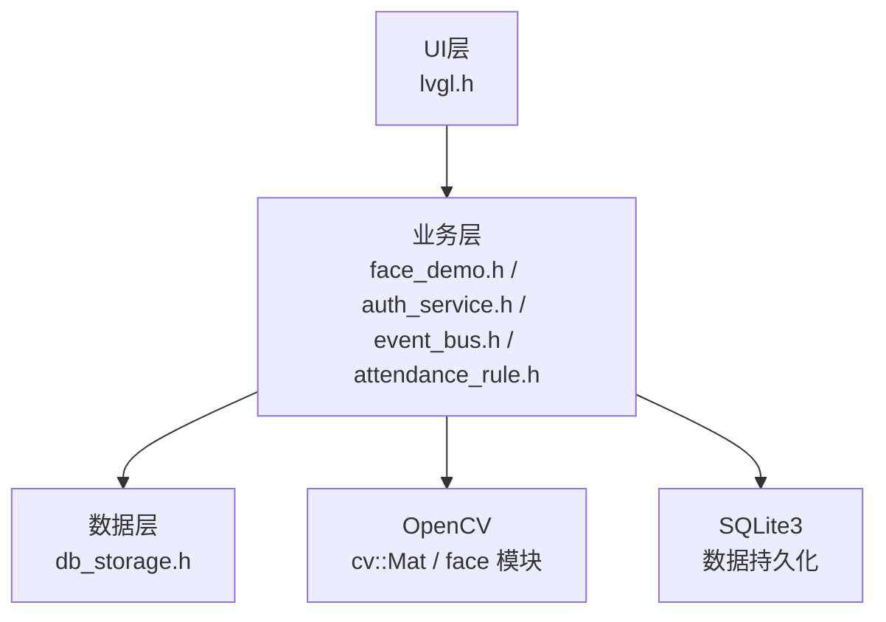
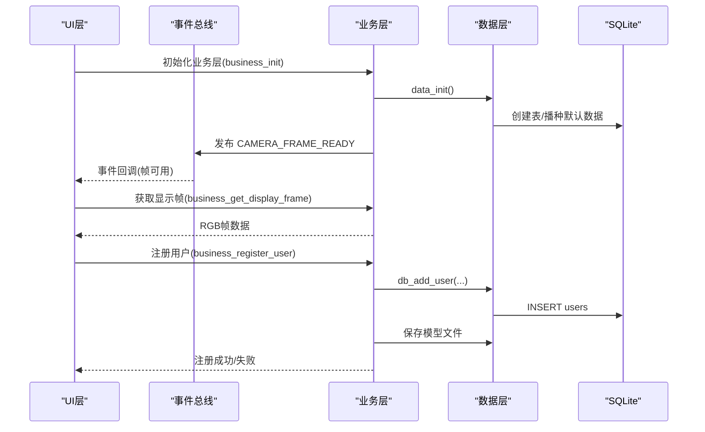
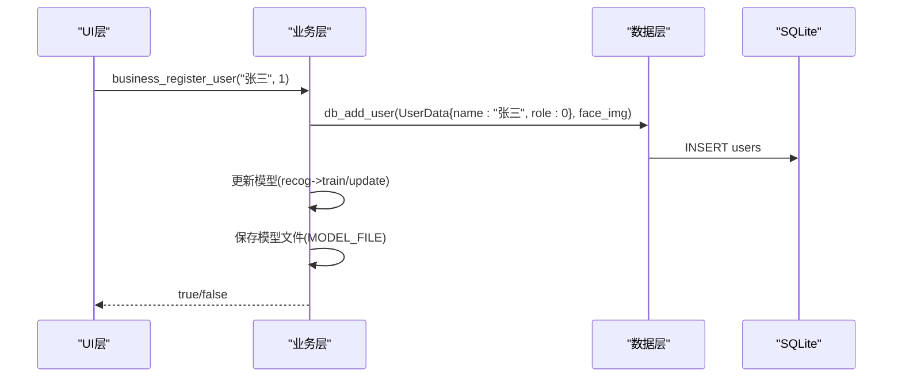
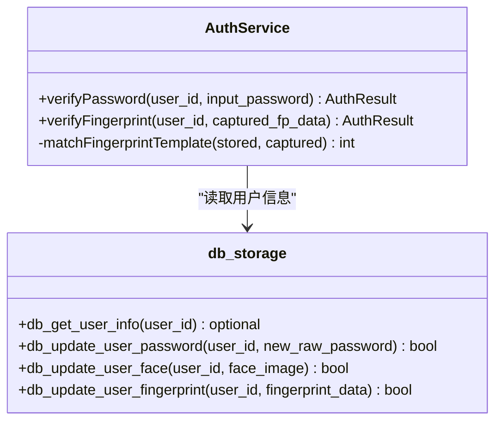
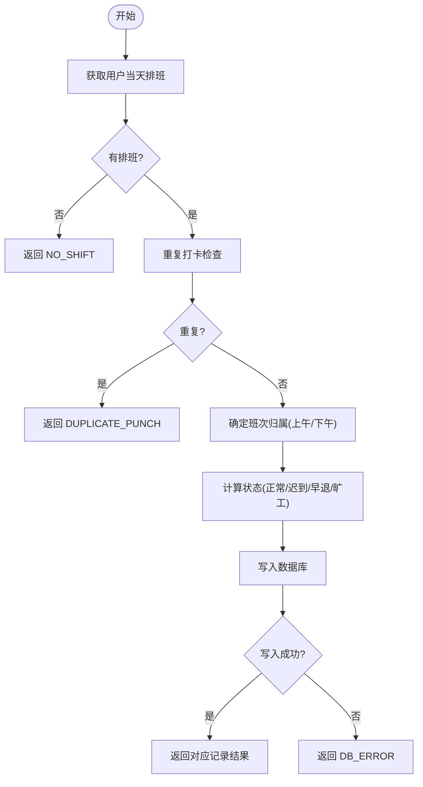
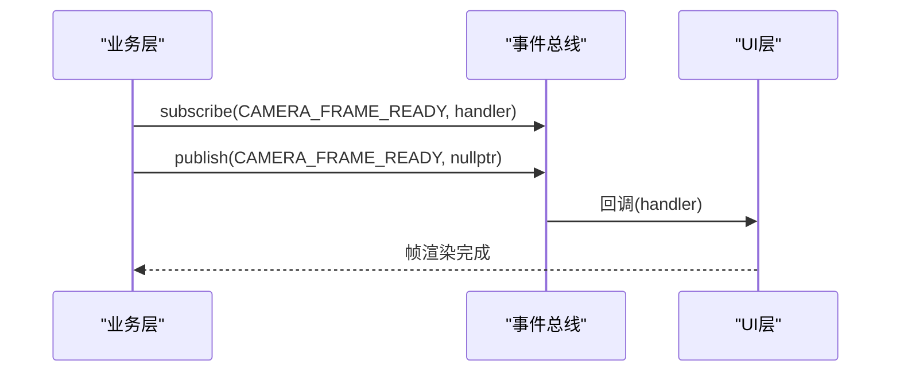
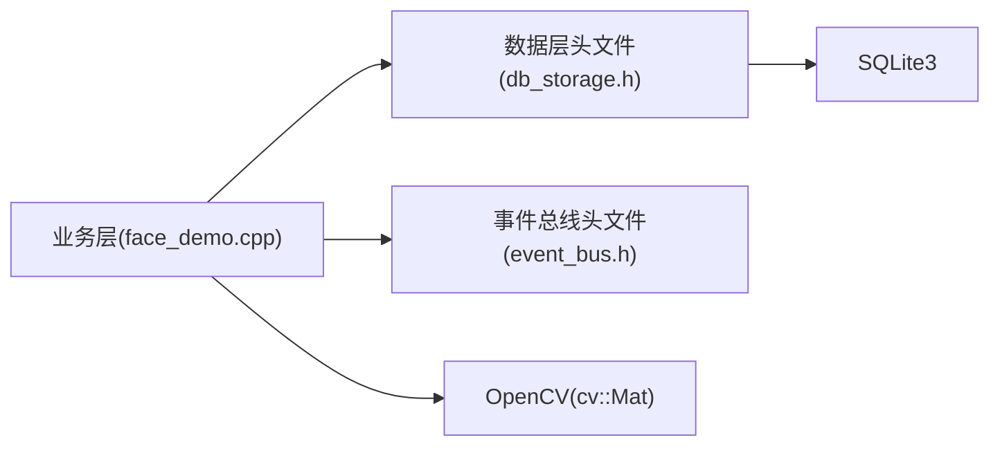

# 业务逻辑API

<cite>
**本文档引用的文件**
- [face_demo.h](file://src/business/face_demo.h)
- [face_demo.cpp](file://src/business/face_demo.cpp)
- [auth_service.h](file://src/business/auth_service.h)
- [auth_service.cpp](file://src/business/auth_service.cpp)
- [event_bus.h](file://src/business/event_bus.h)
- [event_bus.cpp](file://src/business/event_bus.cpp)
- [attendance_rule.h](file://src/business/attendance_rule.h)
- [attendance_rule.cpp](file://src/business/attendance_rule.cpp)
- [db_storage.h](file://src/data/db_storage.h)
- [db_storage.cpp](file://src/data/db_storage.cpp)
- [main.cpp](file://src/main.cpp)
</cite>

## 目录
1. [简介](#简介)
2. [项目结构](#项目结构)
3. [核心组件](#核心组件)
4. [架构总览](#架构总览)
5. [详细组件分析](#详细组件分析)
6. [依赖关系分析](#依赖关系分析)
7. [性能考量](#性能考量)
8. [故障排查指南](#故障排查指南)
9. [结论](#结论)
10. [附录](#附录)

## 简介
本文件面向SmartAttendance系统的业务逻辑API，围绕以下主题提供完整、可操作的技术文档：
- 人脸识别API：人脸检测、用户注册、实时识别等核心接口
- 用户管理API：认证、权限检查、用户信息获取
- 考勤规则API：考勤状态计算、迟到早退判定、班次管理
- 事件总线API：事件发布、订阅、取消订阅
- 每个API均给出参数说明、返回值定义、异常处理策略与实际使用示例

## 项目结构
系统采用清晰的分层架构：
- UI层：负责界面渲染与交互（LVGL）
- 业务层：人脸识别、注册、实时识别、考勤规则、事件总线
- 数据层：SQLite持久化、表结构、DAO接口

**图表来源**
- [main.cpp:213-224](file://src/main.cpp#L213-L224)
- [face_demo.h:1-196](file://src/business/face_demo.h#L1-L196)
- [db_storage.h:1-596](file://src/data/db_storage.h#L1-L596)

**章节来源**
- [main.cpp:187-246](file://src/main.cpp#L187-L246)

## 核心组件
- 人脸识别与注册：提供人脸检测、预处理、注册、更新人脸、实时识别、显示帧获取等接口
- 用户认证与权限：提供密码与指纹认证接口，返回标准化结果枚举
- 考勤规则引擎：提供班次归属判定、状态计算、记录落库、重复打卡防护
- 事件总线：提供线程安全的事件发布/订阅机制
- 数据访问层：提供部门、班次、用户、考勤记录、系统配置等DAO接口

**章节来源**
- [face_demo.h:34-196](file://src/business/face_demo.h#L34-L196)
- [auth_service.h:18-46](file://src/business/auth_service.h#L18-L46)
- [attendance_rule.h:43-92](file://src/business/attendance_rule.h#L43-L92)
- [event_bus.h:10-41](file://src/business/event_bus.h#L10-L41)
- [db_storage.h:187-596](file://src/data/db_storage.h#L187-L596)

## 架构总览
业务层通过数据层访问SQLite，使用OpenCV进行图像处理与人脸识别；UI层通过事件总线接收业务层的帧更新事件。

**图表来源**
- [face_demo.cpp:559-684](file://src/business/face_demo.cpp#L559-L684)
- [event_bus.cpp:3-28](file://src/business/event_bus.cpp#L3-L28)
- [db_storage.cpp:108-285](file://src/data/db_storage.cpp#L108-L285)

## 详细组件分析

### 人脸识别API
- 接口清单
  - 初始化业务模块：business_init()
  - 获取显示帧：business_get_display_frame(void*, int, int)
  - 用户注册：business_register_user(const char*, int)
  - 更新人脸：business_update_user_face(int)
  - 用户列表：business_get_user_count(), business_get_user_at(int, int*, char*, int)
  - 考勤记录：business_load_records(), business_get_record_count(), business_get_record_at(int, char*, int)
  - 预处理配置：business_set_preprocess_config(), business_get_preprocess_config()
  - 预处理参数：business_set_histogram_equalization(), business_set_clahe_parameters(), business_set_roi_enhance()
  - 切换识别：business_set_current_id(), business_start_training(), business_toggle_recognition()
  - 退出：business_quit()

- 参数与返回
  - business_get_display_frame(buffer, w, h)
    - 参数：buffer(输出缓冲区，RGB24)，w/h(目标宽高)
    - 返回：true/false
  - business_register_user(name, dept_id)
    - 参数：name(用户名，C字符串)，dept_id(部门ID)
    - 返回：true/false
  - business_update_user_face(user_id)
    - 参数：user_id
    - 返回：true/false
  - business_get_user_count()/business_get_user_at(index, id_out, name_buf, len)
    - 返回：用户总数；按索引获取用户信息
  - business_get_record_count()/business_get_record_at(index, buf, len)
    - 返回：记录总数；按索引获取格式化文本
  - 预处理配置接口
    - 设置/获取预处理配置，支持裁剪、尺寸归一化、直方图均衡化、ROI增强等

- 异常处理
  - 无可用帧：注册/更新人脸失败
  - 模型加载失败：回退全量训练并保存
  - 队列满：丢弃部分打卡任务，避免内存溢出
  - 线程安全：多处使用互斥锁保护共享数据

- 使用示例
  - 注册新用户：调用business_register_user(name, dept_id)，成功后自动刷新缓存
  - 获取显示帧：调用business_get_display_frame(ptr, 240, 260)，将RGB数据填入UI
  - 更新人脸：先确保有当前帧，再调用business_update_user_face(user_id)

**图表来源**
- [face_demo.cpp:1079-1155](file://src/business/face_demo.cpp#L1079-L1155)
- [db_storage.cpp:748-800](file://src/data/db_storage.cpp#L748-L800)

**章节来源**
- [face_demo.h:34-196](file://src/business/face_demo.h#L34-L196)
- [face_demo.cpp:559-684](file://src/business/face_demo.cpp#L559-L684)
- [face_demo.cpp:1079-1213](file://src/business/face_demo.cpp#L1079-L1213)
- [face_demo.cpp:1274-1380](file://src/business/face_demo.cpp#L1274-L1380)

### 用户管理API
- 接口清单
  - 认证服务：AuthService::verifyPassword(int, const std::string&)
  - 指纹认证：AuthService::verifyFingerprint(int, const std::vector<uint8_t>&)
  - 用户信息：db_get_user_info(int)
  - 用户列表：db_get_all_users_info(), db_get_all_users_light()
  - 用户更新：db_update_user_basic(), db_update_user_face(), db_update_user_password(), db_update_user_fingerprint()

- 参数与返回
  - verifyPassword(user_id, input_password)
    - 返回：AuthResult枚举(SUCCESS/USER_NOT_FOUND/WRONG_PASSWORD/NO_FEATURE_DATA/DB_ERROR)
  - verifyFingerprint(user_id, captured_fp_data)
    - 返回：AuthResult枚举(SUCCESS/USER_NOT_FOUND/WRONG_FINGERPRINT/NO_FEATURE_DATA/DB_ERROR)
  - db_get_user_info(user_id)
    - 返回：std::optional<UserData>

- 异常处理
  - 用户不存在：返回USER_NOT_FOUND
  - 未录入特征：返回NO_FEATURE_DATA
  - 指纹比对阈值：示例中使用80分阈值

- 使用示例
  - 密码认证：AuthService::verifyPassword(1001, "123456")，根据返回值决定是否允许登录
  - 指纹认证：AuthService::verifyFingerprint(1001, fp_bytes)，通过后可触发考勤记录

**图表来源**
- [auth_service.h:23-46](file://src/business/auth_service.h#L23-L46)
- [auth_service.cpp:9-69](file://src/business/auth_service.cpp#L9-L69)
- [db_storage.h:347-412](file://src/data/db_storage.h#L347-L412)

**章节来源**
- [auth_service.h:8-46](file://src/business/auth_service.h#L8-L46)
- [auth_service.cpp:9-90](file://src/business/auth_service.cpp#L9-L90)
- [db_storage.h:315-420](file://src/data/db_storage.h#L315-L420)

### 考勤规则API
- 接口清单
  - 班次归属：AttendanceRule::determineShiftOwner(time_t, const ShiftConfig&, const ShiftConfig&)
  - 状态计算：AttendanceRule::calculatePunchStatus(time_t, const ShiftConfig&, bool)
  - 记录落库：AttendanceRule::recordAttendance(int, const cv::Mat&)
  - 辅助工具：timeStringToMinutes(const std::string&)

- 参数与返回
  - determineShiftOwner(timestamp, shift_am, shift_pm)
    - 返回：1(上午)/2(下午)
  - calculatePunchStatus(timestamp, target_shift, is_check_in)
    - 返回：PunchResult(status, minutes_diff)
  - recordAttendance(user_id, image)
    - 返回：RecordResult(RECORDED_NORMAL/LATE/EARLY/ABSENT/NO_SHIFT/DUPLICATE_PUNCH/DB_ERROR)

- 异常处理
  - 无排班：返回NO_SHIFT
  - 重复打卡：基于规则配置的重复打卡窗口
  - 跨天处理：修正AM/PM时间与打卡时间的跨日逻辑
  - 写库失败：返回DB_ERROR

- 使用示例
  - 实时识别后调用：AttendanceRule::recordAttendance(user_id, snapshot)，根据返回值更新UI

**图表来源**
- [attendance_rule.cpp:198-277](file://src/business/attendance_rule.cpp#L198-L277)

**章节来源**
- [attendance_rule.h:43-92](file://src/business/attendance_rule.h#L43-L92)
- [attendance_rule.cpp:83-191](file://src/business/attendance_rule.cpp#L83-L191)
- [attendance_rule.cpp:198-277](file://src/business/attendance_rule.cpp#L198-L277)

### 事件总线API
- 接口清单
  - 获取实例：EventBus::getInstance()
  - 订阅事件：subscribe(EventType, EventCallback)
  - 发布事件：publish(EventType, void*)

- 事件类型
  - TIME_UPDATE：每秒时间更新
  - DISK_FULL/DISK_NORMAL：磁盘状态变化
  - CAMERA_FRAME_READY：摄像头新帧就绪

- 线程安全
  - 内部使用互斥锁保护订阅者列表
  - 发布时复制回调列表，避免迭代过程中的锁持有

- 使用示例
  - UI订阅帧事件：EventBus::getInstance().subscribe(CAMERA_FRAME_READY, handler)
  - 业务层发布帧事件：EventBus::getInstance().publish(CAMERA_FRAME_READY, nullptr)

**图表来源**
- [event_bus.h:21-41](file://src/business/event_bus.h#L21-L41)
- [event_bus.cpp:8-28](file://src/business/event_bus.cpp#L8-L28)

**章节来源**
- [event_bus.h:10-41](file://src/business/event_bus.h#L10-L41)
- [event_bus.cpp:3-28](file://src/business/event_bus.cpp#L3-L28)

## 依赖关系分析
- 业务层依赖数据层与OpenCV
- 业务层通过事件总线与UI层解耦
- 数据层依赖SQLite3与OpenCV图像编解码

**图表来源**
- [face_demo.cpp:20-26](file://src/business/face_demo.cpp#L20-L26)
- [db_storage.h:10-14](file://src/data/db_storage.h#L10-L14)

**章节来源**
- [face_demo.cpp:20-26](file://src/business/face_demo.cpp#L20-L26)
- [db_storage.cpp:7-22](file://src/data/db_storage.cpp#L7-L22)

## 性能考量
- 多线程与并发
  - 后台采集线程与数据库写入线程分离，使用条件变量与队列降低竞争
  - 数据层使用读写锁提升并发读性能
- 图像处理
  - 预处理配置可动态调整，支持裁剪、尺寸归一化、直方图均衡化与ROI增强
  - 跳帧检测与跟踪策略减少CPU占用
- I/O与存储
  - 预编译SQL语句、联合索引、WAL模式提升数据库性能
  - 定期清理过期抓拍图释放磁盘空间

[本节为通用指导，无需列出具体文件来源]

## 故障排查指南
- 无法加载人脸检测模型
  - 检查模型文件存在性与路径
  - 若加载失败，系统将回退全量训练
- 注册/更新人脸失败
  - 确认当前帧非空
  - 检查数据库写入权限
- 识别不准确
  - 调整预处理配置（裁剪、直方图均衡化、ROI增强）
  - 重新训练模型或增量更新
- 事件未到达UI
  - 确认UI已订阅相应事件类型
  - 检查事件发布时机与回调函数注册
- 考勤重复记录
  - 检查重复打卡窗口配置
  - 确认业务层防抖逻辑未被绕过

**章节来源**
- [face_demo.cpp:593-667](file://src/business/face_demo.cpp#L593-L667)
- [db_storage.cpp:108-285](file://src/data/db_storage.cpp#L108-L285)
- [event_bus.cpp:8-28](file://src/business/event_bus.cpp#L8-L28)

## 结论
本文档系统梳理了SmartAttendance的业务逻辑API，涵盖人脸识别、用户管理、考勤规则与事件总线四大领域。通过清晰的接口定义、参数说明、异常处理与使用示例，开发者可快速集成与扩展系统功能。建议在生产环境中：
- 严格遵循线程安全与资源管理规范
- 定期评估图像预处理参数与模型训练效果
- 健全监控与日志体系，便于问题定位与性能优化

[本节为总结性内容，无需列出具体文件来源]

## 附录
- 常用数据结构
  - UserData：用户信息（含密码、卡号、角色、部门、默认班次、人脸特征、指纹特征等）
  - ShiftInfo：班次信息（时段1/2/3、跨天标记）
  - RuleConfig：全局考勤规则（迟到阈值、重复打卡限制、周末工作规则等）
  - AttendanceRecord：考勤记录（用户、部门、时间戳、状态、抓拍图路径、分钟数）

**章节来源**
- [db_storage.h:18-176](file://src/data/db_storage.h#L18-L176)