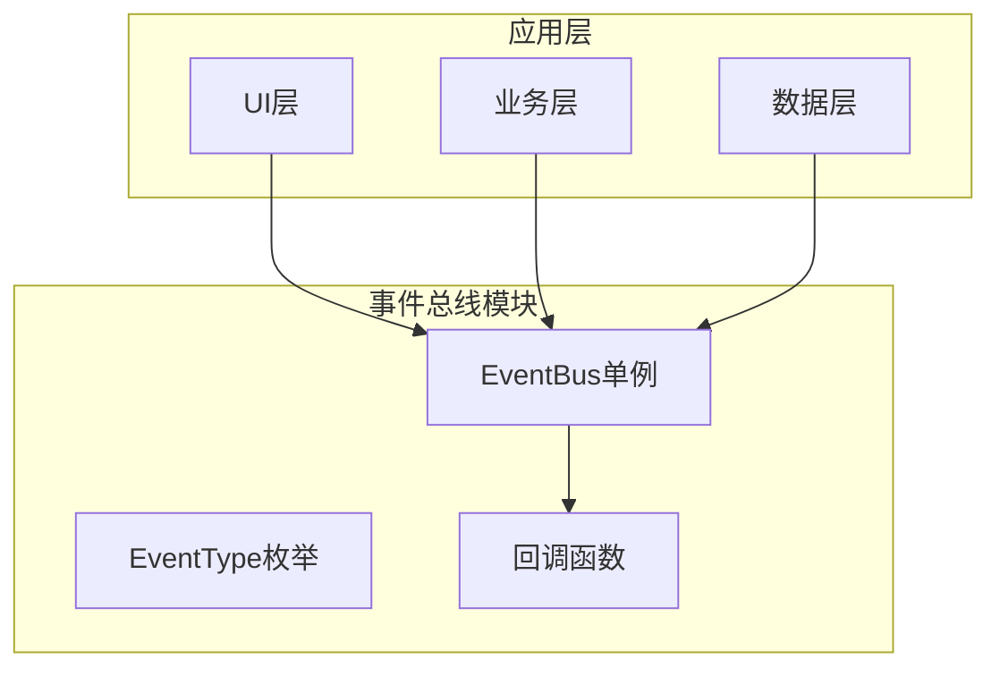
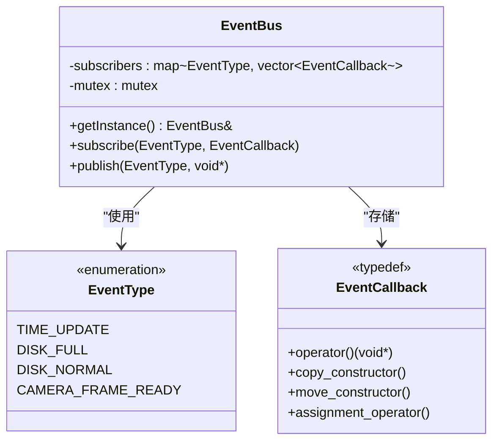
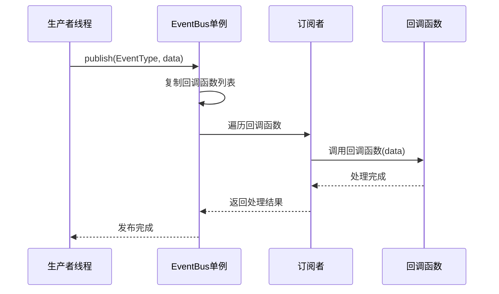
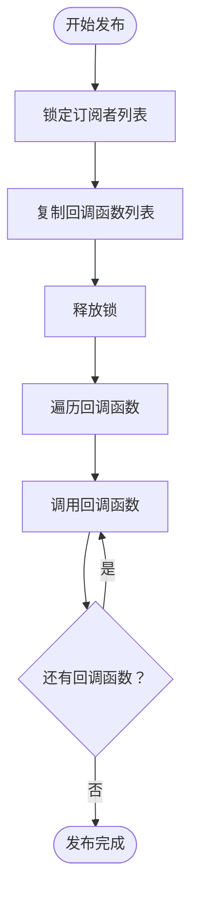
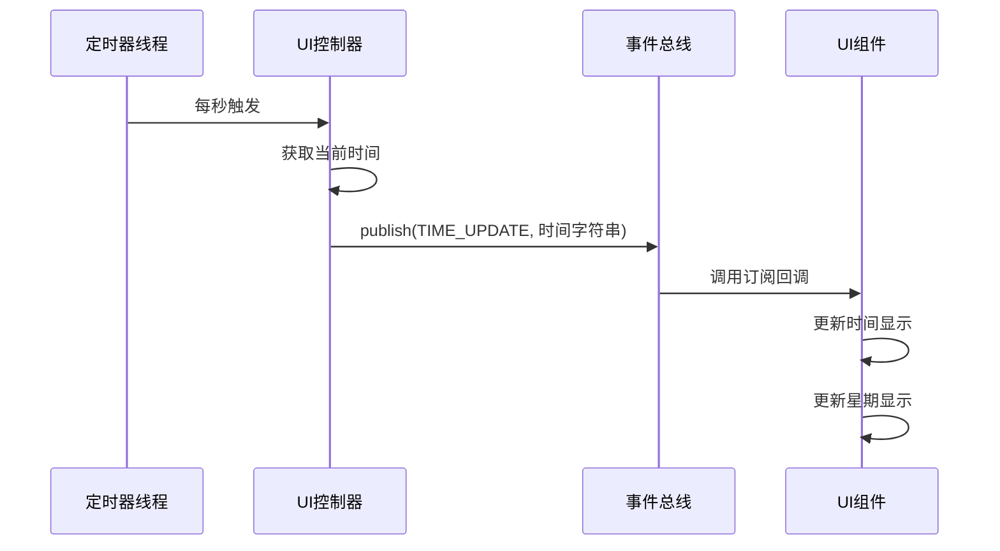
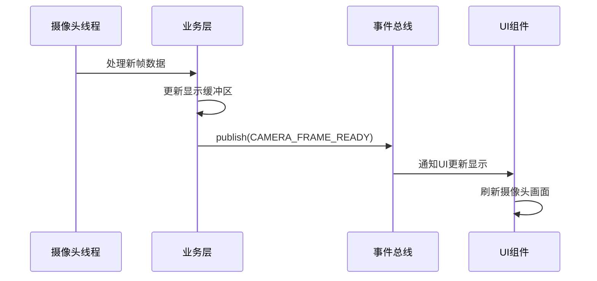
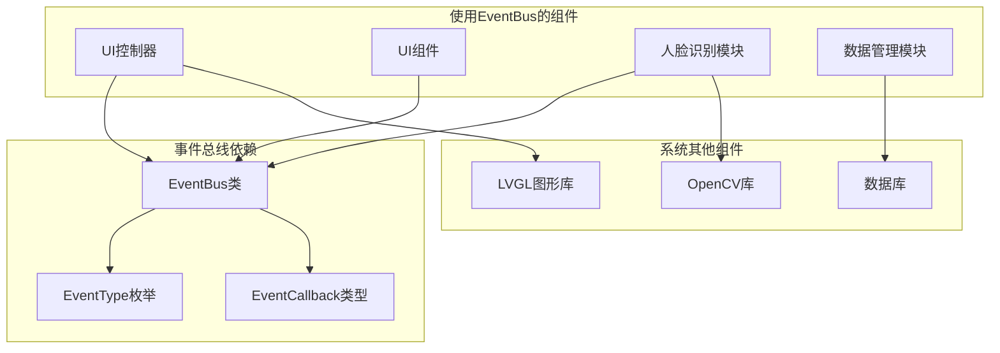

# 事件总线API

<cite>
**本文档引用的文件**
- [event_bus.h](file://src/business/event_bus.h)
- [event_bus.cpp](file://src/business/event_bus.cpp)
- [ui_controller.cpp](file://src/ui/ui_controller.cpp)
- [ui_widgets.cpp](file://src/ui/common/ui_widgets.cpp)
- [face_demo.cpp](file://src/business/face_demo.cpp)
</cite>

## 目录
1. [简介](#简介)
2. [项目结构](#项目结构)
3. [核心组件](#核心组件)
4. [架构概览](#架构概览)
5. [详细组件分析](#详细组件分析)
6. [依赖关系分析](#依赖关系分析)
7. [性能考虑](#性能考虑)
8. [故障排除指南](#故障排除指南)
9. [结论](#结论)

## 简介

事件总线模块是SmartAttendance系统中的核心通信机制，采用发布-订阅模式实现松耦合的组件间通信。该模块提供了线程安全的事件发布和订阅功能，支持多种事件类型和异步处理机制，为系统的各个模块提供了统一的消息传递接口。

事件总线模块的主要特点：
- **线程安全**：使用互斥锁保护共享资源
- **发布-订阅模式**：支持一对多的消息分发
- **类型安全**：通过枚举类型定义事件类型
- **异步处理**：支持非阻塞的事件处理
- **内存安全**：自动管理回调函数生命周期

## 项目结构

事件总线模块位于业务层，与UI层和数据层形成清晰的分层架构：



**图表来源**
- [event_bus.h:1-41](file://src/business/event_bus.h#L1-L41)
- [event_bus.cpp:1-28](file://src/business/event_bus.cpp#L1-L28)

**章节来源**
- [event_bus.h:1-41](file://src/business/event_bus.h#L1-L41)
- [event_bus.cpp:1-28](file://src/business/event_bus.cpp#L1-L28)

## 核心组件

### 事件类型定义

事件总线模块定义了四种核心事件类型：

| 事件类型 | 描述 | 数据负载 | 使用场景 |
|---------|------|----------|----------|
| TIME_UPDATE | 时间刷新事件 | std::string* (时间字符串指针) | UI时间显示更新 |
| DISK_FULL | 磁盘空间不足 | 无 | 磁盘监控告警 |
| DISK_NORMAL | 磁盘空间恢复正常 | 无 | 磁盘状态恢复通知 |
| CAMERA_FRAME_READY | 摄像头新帧就绪 | 无 | 视频流处理触发 |

### 回调函数定义

事件回调函数采用C++11标准的`std::function`模板，提供灵活的回调机制：



**图表来源**
- [event_bus.h:18-39](file://src/business/event_bus.h#L18-L39)

**章节来源**
- [event_bus.h:10-16](file://src/business/event_bus.h#L10-L16)
- [event_bus.h:18-19](file://src/business/event_bus.h#L18-L19)

## 架构概览

事件总线采用单例模式设计，确保全局唯一的事件分发中心：



**图表来源**
- [event_bus.cpp:14-28](file://src/business/event_bus.cpp#L14-L28)

## 详细组件分析

### EventBus类实现

EventBus类实现了完整的事件总线功能，采用单例模式确保线程安全：

#### 核心方法

| 方法名 | 参数 | 返回值 | 功能描述 |
|--------|------|--------|----------|
| getInstance | 无 | EventBus& | 获取事件总线单例实例 |
| subscribe | EventType, EventCallback | void | 订阅指定类型的事件 |
| publish | EventType, void* | void | 发布事件到所有订阅者 |

#### 线程安全机制

事件总线通过双重锁机制确保线程安全：
1. **订阅时锁定**：添加回调函数时使用互斥锁
2. **发布时锁定**：复制回调函数列表后立即解锁
3. **处理时无锁**：回调函数执行时不持有锁



**图表来源**
- [event_bus.cpp:14-28](file://src/business/event_bus.cpp#L14-L28)

**章节来源**
- [event_bus.cpp:3-6](file://src/business/event_bus.cpp#L3-L6)
- [event_bus.cpp:8-12](file://src/business/event_bus.cpp#L8-L12)
- [event_bus.cpp:14-28](file://src/business/event_bus.cpp#L14-L28)

### 事件使用示例

#### 时间事件处理示例

UI控制器定期发布时间更新事件，UI组件订阅并更新显示：



**图表来源**
- [ui_controller.cpp:377-393](file://src/ui/ui_controller.cpp#L377-L393)
- [ui_widgets.cpp:119-133](file://src/ui/common/ui_widgets.cpp#L119-L133)

#### 摄像头事件处理示例

业务层处理摄像头帧数据并发布就绪事件：



**图表来源**
- [face_demo.cpp:524-525](file://src/business/face_demo.cpp#L524-L525)

**章节来源**
- [ui_controller.cpp:377-393](file://src/ui/ui_controller.cpp#L377-L393)
- [ui_widgets.cpp:119-133](file://src/ui/common/ui_widgets.cpp#L119-L133)
- [face_demo.cpp:524-525](file://src/business/face_demo.cpp#L524-L525)

## 依赖关系分析

事件总线模块与系统其他组件的依赖关系：



**图表来源**
- [event_bus.h:1-41](file://src/business/event_bus.h#L1-L41)
- [ui_controller.cpp:1-14](file://src/ui/ui_controller.cpp#L1-L14)

**章节来源**
- [event_bus.h:1-41](file://src/business/event_bus.h#L1-L41)
- [ui_controller.cpp:1-14](file://src/ui/ui_controller.cpp#L1-L14)

## 性能考虑

### 线程安全优化

事件总线通过以下机制优化性能：
- **最小化锁持有时间**：只在复制回调列表时持有锁
- **无锁回调执行**：回调函数执行时不持有任何锁
- **批量处理**：同一事件的所有回调按顺序执行

### 内存管理

- **智能指针使用**：回调函数使用`std::function`自动管理生命周期
- **数据所有权**：事件数据的所有权由发布者保持
- **内存泄漏防护**：自动清理不再使用的回调函数

### 并发处理

- **高并发支持**：支持多个线程同时发布和订阅事件
- **死锁防护**：避免在回调函数中调用阻塞操作
- **性能监控**：可通过日志监控事件处理延迟

## 故障排除指南

### 常见问题及解决方案

#### 1. 事件未被接收

**症状**：订阅者没有收到预期的事件

**排查步骤**：
1. 检查事件类型是否正确
2. 确认订阅时机是否正确
3. 验证回调函数是否正确注册

**解决方案**：
```cpp
// 确保在正确的时机订阅事件
auto& bus = EventBus::getInstance();
bus.subscribe(EventType::TIME_UPDATE, [](void* data) {
    // 处理逻辑
});
```

#### 2. 线程安全问题

**症状**：多线程环境下出现数据竞争

**排查步骤**：
1. 检查是否在回调函数中进行长时间阻塞操作
2. 确认事件数据的生命周期管理

**解决方案**：
```cpp
// 在回调函数中避免阻塞操作
bus.subscribe(EventType::TIME_UPDATE, [](void* data) {
    // 使用异步处理或快速返回
    lv_async_call([](void* d) {
        // 长时间处理逻辑
    }, data);
});
```

#### 3. 内存泄漏问题

**症状**：应用程序运行时间越长内存占用越大

**排查步骤**：
1. 检查回调函数是否正确移除
2. 确认事件数据是否正确释放

**解决方案**：
```cpp
// 确保正确管理事件数据生命周期
std::string* timeStr = new std::string(getCurrentTimeStr());
EventBus::getInstance().publish(EventType::TIME_UPDATE, timeStr);
// 回调函数中记得释放内存
```

**章节来源**
- [event_bus.cpp:14-28](file://src/business/event_bus.cpp#L14-L28)
- [ui_widgets.cpp:123-131](file://src/ui/common/ui_widgets.cpp#L123-L131)

## 结论

事件总线模块为SmartAttendance系统提供了高效、可靠的组件间通信机制。通过采用发布-订阅模式和单例设计，该模块实现了松耦合的系统架构，支持多线程环境下的安全事件处理。

### 主要优势

1. **线程安全**：内置互斥锁保护，支持高并发场景
2. **类型安全**：通过枚举类型定义事件，避免字符串拼写错误
3. **易于扩展**：支持动态订阅和取消订阅
4. **性能优化**：最小化锁持有时间，提高并发性能

### 最佳实践

1. **及时清理**：在不需要时及时取消订阅
2. **避免阻塞**：回调函数中避免长时间阻塞操作
3. **数据管理**：正确管理事件数据的生命周期
4. **错误处理**：在回调函数中添加适当的错误处理机制

该事件总线模块为系统的可维护性和可扩展性奠定了坚实的基础，是现代C++应用程序架构的重要组成部分。