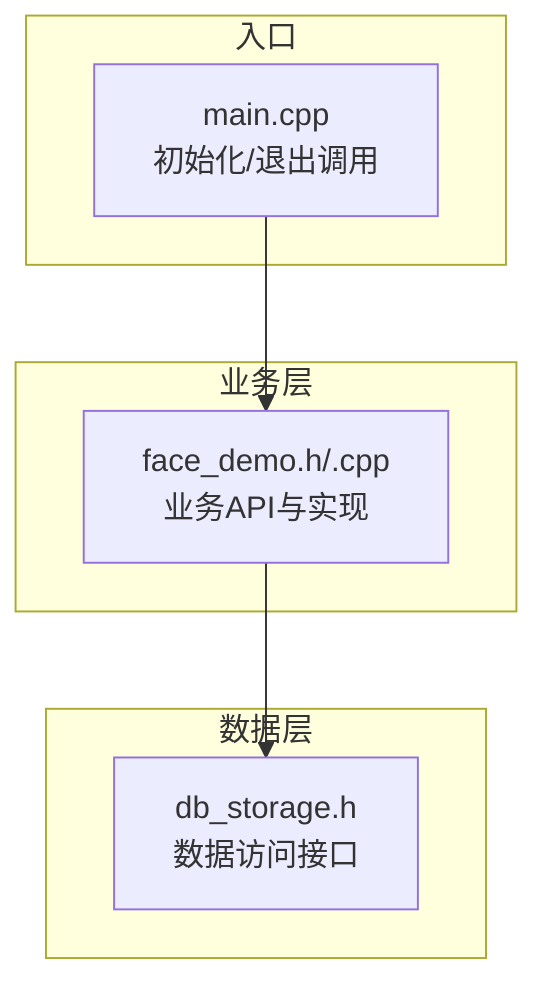
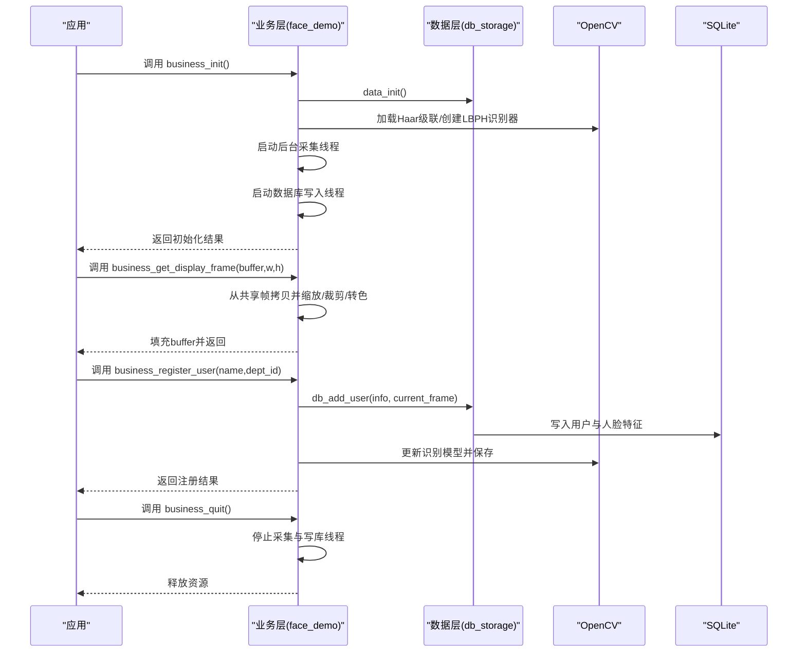
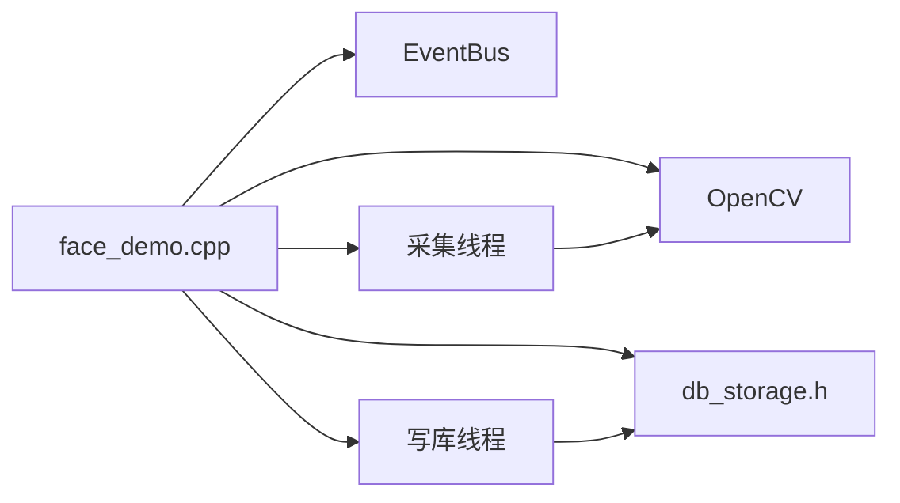

# 人脸识别API

<cite>
**本文档引用的文件**
- [face_demo.h](file://src/business/face_demo.h)
- [face_demo.cpp](file://src/business/face_demo.cpp)
- [db_storage.h](file://src/data/db_storage.h)
- [main.cpp](file://src/main.cpp)
</cite>

## 目录
1. [简介](#简介)
2. [项目结构](#项目结构)
3. [核心组件](#核心组件)
4. [架构总览](#架构总览)
5. [详细组件分析](#详细组件分析)
6. [依赖关系分析](#依赖关系分析)
7. [性能考量](#性能考量)
8. [故障排查指南](#故障排查指南)
9. [结论](#结论)

## 简介
本文件面向人脸识别业务模块的API使用与集成，涵盖以下关键能力：
- 业务初始化与资源管理：business_init()、business_quit()
- 实时视频帧获取：business_get_display_frame()
- 用户注册与人脸更新：business_register_user()、business_update_user_face()
- 用户数据查询：business_get_user_count()、business_get_user_at()
- 预处理配置：PreprocessConfig结构体、business_set_preprocess_config()等
- 考勤记录查询：business_load_records()、business_get_record_count()、business_get_record_at()

文档对每个API提供参数说明、返回值定义、典型使用场景与错误处理机制，帮助开发者快速集成与排障。

## 项目结构
人脸识别业务位于 src/business 目录，核心文件为 face_demo.h/.cpp；数据访问层位于 src/data/db_storage.h；入口在 src/main.cpp 中调用业务初始化与退出。

图表来源
- [face_demo.h:1-196](file://src/business/face_demo.h#L1-L196)
- [face_demo.cpp:1-80](file://src/business/face_demo.cpp#L1-L80)
- [db_storage.h:1-596](file://src/data/db_storage.h#L1-L596)
- [main.cpp:219](file://src/main.cpp#L219)

章节来源
- [face_demo.h:1-196](file://src/business/face_demo.h#L1-L196)
- [face_demo.cpp:1-80](file://src/business/face_demo.cpp#L1-L80)
- [db_storage.h:1-596](file://src/data/db_storage.h#L1-L596)
- [main.cpp:219](file://src/main.cpp#L219)

## 核心组件
- 业务初始化 business_init()
  - 功能：加载人脸检测模型、初始化识别器、打开视频源、启动后台采集与数据库写入线程、加载/训练识别模型。
  - 返回：true/false，成功/失败。
  - 典型调用：应用启动时调用。
- 视频帧获取 business_get_display_frame()
  - 功能：将最新视频帧缩放、裁剪、转色后填充到用户提供的缓冲区，供UI显示。
  - 参数：buffer(输出)、w(期望宽度)、h(期望高度)。
  - 返回：true/false。
  - 典型调用：UI循环中定期调用。
- 用户注册 business_register_user()
  - 功能：基于当前帧注册新用户，写入数据库并更新识别模型。
  - 参数：name(姓名)、dept_id(部门ID)。
  - 返回：true/false。
  - 典型调用：用户注册界面确认时调用。
- 人脸更新 business_update_user_face()
  - 功能：更新已有用户的面部特征，增量更新识别模型。
  - 参数：user_id(用户ID)。
  - 返回：true/false。
  - 典型调用：用户信息维护界面更新人脸时调用。
- 用户查询 business_get_user_count()/business_get_user_at()
  - 功能：刷新用户缓存并返回总数；按索引获取用户信息。
  - 返回：count或true/false。
  - 典型调用：用户列表页面进入时刷新缓存。
- 预处理配置 PreprocessConfig 与相关接口
  - 结构体：裁剪、尺寸归一化、直方图均衡化(HIST_EQ_NONE/GLOBAL/CLAHE)、CLAHE参数、ROI增强、调试选项等。
  - 接口：business_set_preprocess_config()、business_get_preprocess_config()、business_set_histogram_equalization()、business_set_clahe_parameters()、business_set_roi_enhance()、business_reload_config()。
- 考勤记录查询 business_load_records()/business_get_record_count()/business_get_record_at()
  - 功能：加载/统计/获取格式化记录文本。
  - 返回：count或true/false。
  - 典型调用：考勤记录页面进入时加载，列表渲染时逐条获取。
- 资源清理 business_quit()
  - 功能：停止采集线程与数据库写入线程，释放资源。
  - 返回：无。
  - 典型调用：应用退出时调用。

章节来源
- [face_demo.h:34-196](file://src/business/face_demo.h#L34-L196)
- [face_demo.cpp:559-684](file://src/business/face_demo.cpp#L559-L684)
- [face_demo.cpp:991-1036](file://src/business/face_demo.cpp#L991-L1036)
- [face_demo.cpp:1042-1213](file://src/business/face_demo.cpp#L1042-L1213)
- [face_demo.cpp:1219-1271](file://src/business/face_demo.cpp#L1219-L1271)
- [face_demo.cpp:1277-1380](file://src/business/face_demo.cpp#L1277-L1380)
- [face_demo.cpp:1385-1408](file://src/business/face_demo.cpp#L1385-L1408)

## 架构总览
业务层通过OpenCV进行视频采集、人脸检测与识别，同时通过数据层接口访问SQLite数据库，实现用户与考勤数据的持久化。后台线程负责持续采集与异步写库，主线程负责UI交互与业务调度。

图表来源
- [face_demo.cpp:559-684](file://src/business/face_demo.cpp#L559-L684)
- [face_demo.cpp:991-1036](file://src/business/face_demo.cpp#L991-L1036)
- [face_demo.cpp:1079-1155](file://src/business/face_demo.cpp#L1079-L1155)
- [face_demo.cpp:1385-1408](file://src/business/face_demo.cpp#L1385-L1408)
- [db_storage.h:317-324](file://src/data/db_storage.h#L317-L324)

## 详细组件分析

### 初始化与退出：business_init() / business_quit()
- 初始化流程要点
  - 加载Haar级联分类器文件，失败则返回false。
  - 初始化LBPH识别器。
  - data_init()连接数据库并自动建表。
  - 尝试加载本地模型文件，失败则全量训练并保存。
  - 启动后台采集线程与数据库写入线程。
- 退出流程要点
  - 停止采集线程并join。
  - 停止数据库写入线程并唤醒等待队列。
  - 释放资源。

章节来源
- [face_demo.cpp:559-684](file://src/business/face_demo.cpp#L559-L684)
- [face_demo.cpp:1385-1408](file://src/business/face_demo.cpp#L1385-L1408)
- [main.cpp:219](file://src/main.cpp#L219)

### 视频帧获取：business_get_display_frame()
- 功能
  - 从共享帧拷贝到本地，按目标宽高等比缩放后中心裁剪，再转RGB，填充到用户提供的buffer。
- 参数
  - buffer：输出缓冲区指针（由UI分配）。
  - w/h：期望的显示尺寸。
- 返回
  - true：成功；false：无可用帧或内部错误。
- 使用示例
  - UI每帧调用，将buffer传递给显示驱动。
- 错误处理
  - 无帧时返回false；内部异常被捕获并避免崩溃。

章节来源
- [face_demo.cpp:991-1036](file://src/business/face_demo.cpp#L991-L1036)
- [face_demo.h:91-99](file://src/business/face_demo.h#L91-L99)

### 用户注册与人脸更新
- 用户注册 business_register_user()
  - 依赖当前帧作为人脸样本，调用 db_add_user() 写入数据库。
  - 更新内存映射与识别模型，必要时保存模型文件。
  - 刷新用户缓存。
- 人脸更新 business_update_user_face()
  - 更新数据库中指定用户的面部特征。
  - 增量更新识别模型并保存。
- 参数与返回
  - name/dept_id：注册时使用。
  - user_id：更新时使用。
  - 返回true/false表示成功与否。
- 使用示例
  - 注册：在确认注册时调用，确保当前帧有效。
  - 更新：在用户信息维护界面点击“更新人脸”时调用。
- 错误处理
  - 无帧或DB写入失败均返回false；模型保存异常被捕获并记录。

章节来源
- [face_demo.cpp:1079-1155](file://src/business/face_demo.cpp#L1079-L1155)
- [face_demo.cpp:1162-1213](file://src/business/face_demo.cpp#L1162-L1213)
- [face_demo.h:120-135](file://src/business/face_demo.h#L120-L135)
- [db_storage.h:317-324](file://src/data/db_storage.h#L317-L324)
- [db_storage.h:389-395](file://src/data/db_storage.h#L389-L395)

### 用户数据查询
- 用户总数 business_get_user_count()
  - 从数据库刷新用户缓存并返回数量。
- 用户信息 business_get_user_at(index, id_out, name_buf, len)
  - 从缓存中按索引获取用户信息，安全拷贝到输出缓冲区。
- 参数与返回
  - index：0..count-1。
  - id_out/name_buf/len：可选输出参数。
  - 返回true/false表示索引是否有效。
- 使用示例
  - 列表页面进入时调用business_get_user_count()刷新缓存，随后逐条调用business_get_user_at()填充UI。

章节来源
- [face_demo.cpp:1042-1071](file://src/business/face_demo.cpp#L1042-L1071)
- [face_demo.h:105-118](file://src/business/face_demo.h#L105-L118)

### 预处理配置
- 结构体 PreprocessConfig
  - enable_crop/crop_margin_percent：裁剪边界与边距百分比。
  - enable_resize_eq/enablez_resize/resize_size：尺寸归一化与目标尺寸。
  - hist_eq_method：直方图均衡化方法（NONE/GLOBAL/CLAHE）。
  - clahe_clip_limit/clahe_tile_grid_size：CLAHE参数。
  - enable_roi_enhance/roi_contrast/roi_brightness：ROI增强参数。
  - debug_show_steps：调试选项。
- 配置接口
  - business_set_preprocess_config(config)：设置全局预处理配置。
  - business_get_preprocess_config()：获取当前配置。
  - business_set_histogram_equalization(enable, method)：动态启用/切换均衡化方法。
  - business_set_clahe_parameters(clip_limit, grid_width, grid_height)：设置CLAHE参数。
  - business_set_roi_enhance(enable, contrast, brightness)：设置ROI增强。
  - business_reload_config()：强制刷新考勤配置。
- 使用示例
  - UI设置界面调用上述接口动态调整预处理参数，实时影响识别效果。

章节来源
- [face_demo.h:42-84](file://src/business/face_demo.h#L42-L84)
- [face_demo.cpp:1277-1380](file://src/business/face_demo.cpp#L1277-L1380)

### 考勤记录查询
- 刷新缓存 business_load_records()
  - 从数据库查询最近记录并缓存，限制显示数量。
- 记录统计 business_get_record_count()
  - 返回缓存中的记录数量。
- 记录获取 business_get_record_at(index, buf, len)
  - 将记录格式化为“MM-dd HH:mm 姓名 [状态]”字符串。
- 参数与返回
  - index：0..count-1。
  - buf/len：输出缓冲区与大小。
  - 返回true/false表示索引有效性。
- 使用示例
  - 进入记录页面时调用business_load_records()，随后逐条调用business_get_record_at()渲染列表。

章节来源
- [face_demo.cpp:1219-1271](file://src/business/face_demo.cpp#L1219-L1271)
- [face_demo.h:141-166](file://src/business/face_demo.h#L141-L166)
- [db_storage.h:434-441](file://src/data/db_storage.h#L434-L441)

## 依赖关系分析
- 业务层依赖
  - OpenCV：视频采集、人脸检测、图像处理。
  - 数据层：用户与考勤数据的持久化。
  - 事件总线：相机帧准备事件通知UI刷新。
- 线程与同步
  - 后台采集线程：负责读取视频帧、检测/识别、更新共享帧与UI显示缓存。
  - 数据库写入线程：消费打卡任务队列，串行写库，避免多线程竞争。
  - 互斥锁与原子变量：保护共享数据，避免竞态。
- 外部依赖
  - OpenCV模型文件：haar级联分类器XML。
  - SQLite：用户与考勤数据存储。

图表来源
- [face_demo.cpp:1-80](file://src/business/face_demo.cpp#L1-L80)
- [face_demo.cpp:248-287](file://src/business/face_demo.cpp#L248-L287)
- [face_demo.cpp:293-551](file://src/business/face_demo.cpp#L293-L551)

章节来源
- [face_demo.cpp:1-80](file://src/business/face_demo.cpp#L1-L80)
- [face_demo.cpp:248-287](file://src/business/face_demo.cpp#L248-L287)
- [face_demo.cpp:293-551](file://src/business/face_demo.cpp#L293-L551)

## 性能考量
- 帧处理优化
  - 跳帧检测：每N帧进行一次检测，其余帧跟踪上一帧结果，降低CPU占用。
  - UI刷新限流：限制UI刷新频率，兼顾识别精度与显示流畅度。
- 线程模型
  - 采集线程与写库线程分离，避免IO阻塞影响识别。
  - 队列长度控制，防止内存占用过高。
- 预处理策略
  - 可按需启用裁剪、尺寸归一化与直方图均衡化，平衡识别精度与性能。
  - CLAHE参数合理设置，避免过度增强导致噪声放大。

[本节为通用指导，不直接分析具体文件]

## 故障排查指南
- 初始化失败
  - 现象：business_init()返回false。
  - 排查：确认haar级联分类器文件存在且可加载；检查data_init()返回值；查看日志输出。
- 无视频帧
  - 现象：business_get_display_frame()返回false。
  - 排查：确认采集线程已启动；检查视频源连接状态；关注重连逻辑与错误日志。
- 注册/更新失败
  - 现象：business_register_user()/business_update_user_face()返回false。
  - 排查：确认当前帧非空；检查db_add_user()/db_update_user_face()返回值；查看模型保存异常日志。
- 记录查询异常
  - 现象：business_get_record_at()越界或格式化失败。
  - 排查：确认business_get_record_count()返回值与索引范围；检查输出缓冲区大小。
- 线程退出
  - 现象：business_quit()后仍存在活动线程。
  - 排查：确认g_is_running与g_db_writer_running标志位正确设置；检查notify_all()是否调用。

章节来源
- [face_demo.cpp:559-684](file://src/business/face_demo.cpp#L559-L684)
- [face_demo.cpp:991-1036](file://src/business/face_demo.cpp#L991-L1036)
- [face_demo.cpp:1079-1155](file://src/business/face_demo.cpp#L1079-L1155)
- [face_demo.cpp:1162-1213](file://src/business/face_demo.cpp#L1162-L1213)
- [face_demo.cpp:1219-1271](file://src/business/face_demo.cpp#L1219-L1271)
- [face_demo.cpp:1385-1408](file://src/business/face_demo.cpp#L1385-L1408)

## 结论
本文档系统梳理了人脸识别业务模块的API，覆盖初始化、视频帧获取、用户管理、预处理配置与考勤记录查询等核心能力。通过合理的线程模型与预处理策略，可在嵌入式设备上实现稳定的人脸识别与考勤记录功能。建议在实际部署中结合硬件性能与业务需求，动态调整预处理参数与线程策略，确保识别精度与系统稳定性。