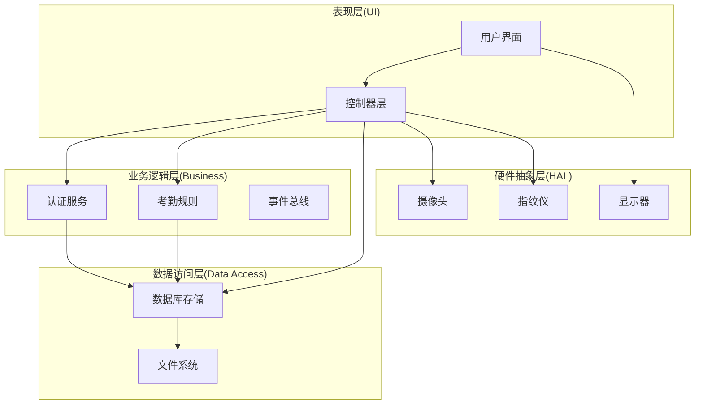
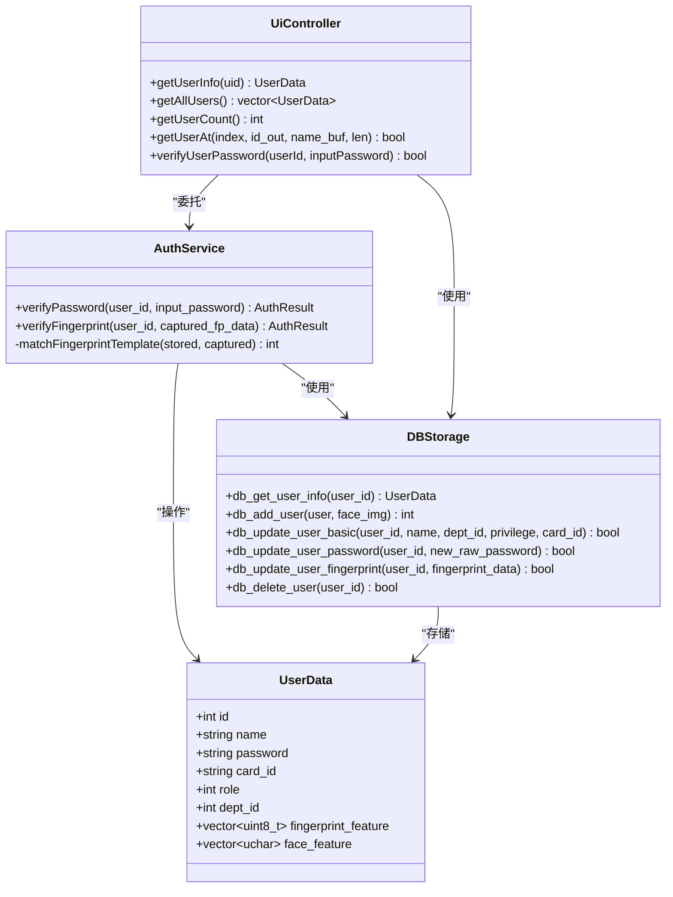
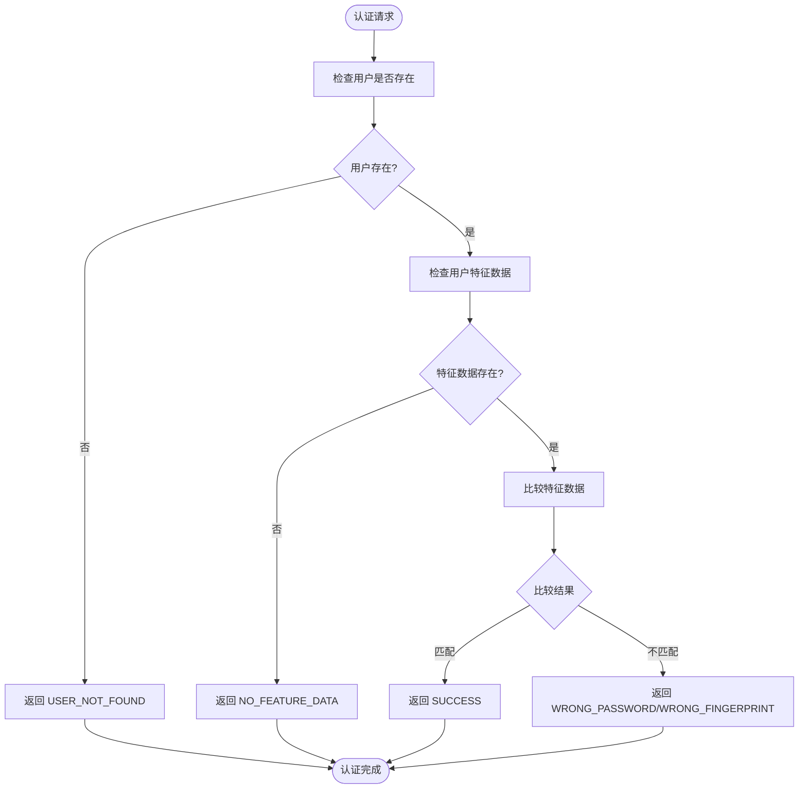
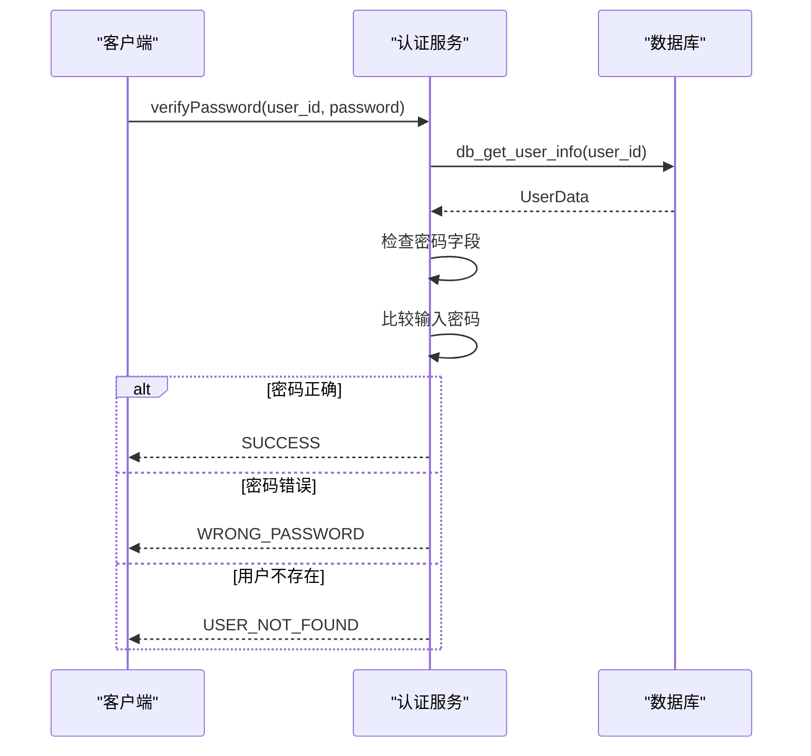
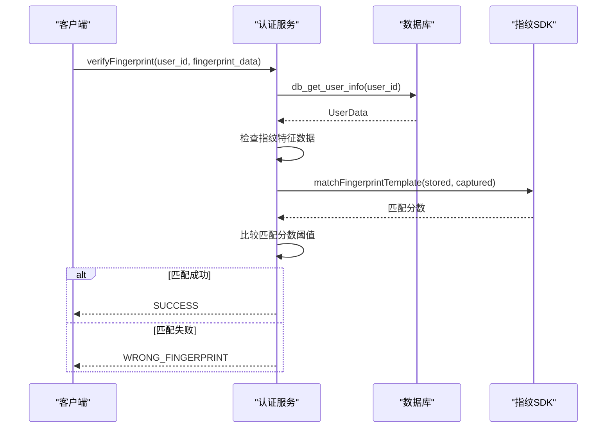
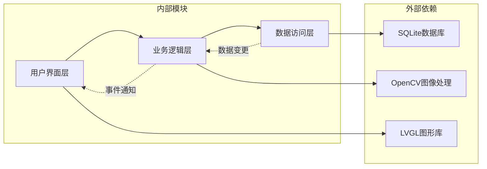

# 用户管理API

<cite>
**本文档引用的文件**
- [auth_service.h](file://src/business/auth_service.h)
- [auth_service.cpp](file://src/business/auth_service.cpp)
- [db_storage.h](file://src/data/db_storage.h)
- [db_storage.cpp](file://src/data/db_storage.cpp)
- [ui_controller.h](file://src/ui/ui_controller.h)
- [ui_controller.cpp](file://src/ui/ui_controller.cpp)
- [face_demo.cpp](file://src/business/face_demo.cpp)
</cite>

## 目录
1. [简介](#简介)
2. [项目结构](#项目结构)
3. [核心组件](#核心组件)
4. [架构概览](#架构概览)
5. [详细组件分析](#详细组件分析)
6. [依赖关系分析](#依赖关系分析)
7. [性能考虑](#性能考虑)
8. [故障排除指南](#故障排除指南)
9. [结论](#结论)

## 简介

SmartAttendance项目是一个基于嵌入式系统的智能考勤管理系统，专注于提供准确、可靠的人员考勤解决方案。该项目采用模块化设计，将业务逻辑、数据访问和用户界面分离，形成了清晰的三层架构。

本项目的核心优势在于其完整的生物特征识别能力，包括指纹识别、人脸识别和密码验证等多种认证方式。系统通过SQLite数据库提供持久化存储，支持实时考勤记录和历史数据分析。

用户管理模块是整个系统的核心组成部分，负责处理所有与用户相关的操作，包括身份认证、权限管理、信息维护等功能。该模块采用面向对象的设计原则，提供了清晰的接口定义和完善的错误处理机制。

## 项目结构

SmartAttendance项目采用标准的分层架构设计，主要分为以下几个层次：



**图表来源**
- [ui_controller.h:38-61](file://src/ui/ui_controller.h#L38-L61)
- [auth_service.h:23-46](file://src/business/auth_service.h#L23-L46)
- [db_storage.h:1-596](file://src/data/db_storage.h#L1-L596)

项目的主要模块包括：

- **用户界面层**: 提供直观的用户交互界面，支持触摸操作和多语言显示
- **业务逻辑层**: 处理核心业务逻辑，包括认证、考勤计算和权限管理
- **数据访问层**: 封装数据库操作，提供统一的数据访问接口
- **硬件集成层**: 与各种传感器和执行器进行通信

**章节来源**
- [ui_controller.h:38-61](file://src/ui/ui_controller.h#L38-L61)
- [auth_service.h:23-46](file://src/business/auth_service.h#L23-L46)
- [db_storage.h:1-596](file://src/data/db_storage.h#L1-L596)

## 核心组件

用户管理模块由三个核心组件构成，每个组件都有明确的职责分工：

### 认证服务组件
认证服务负责处理所有用户身份验证相关操作，支持多种认证方式：
- 密码验证 (1:1)
- 指纹验证 (1:1)
- 生物特征模板匹配

### 数据访问组件
数据访问层提供完整的用户数据管理功能：
- 用户信息的增删改查操作
- 权限和角色管理
- 考勤记录关联查询
- 批量数据同步

### 控制器组件
控制器层作为业务逻辑和数据访问之间的桥梁：
- 协调各组件间的交互
- 处理业务流程控制
- 提供统一的API接口

**章节来源**
- [auth_service.h:23-46](file://src/business/auth_service.h#L23-L46)
- [db_storage.h:315-420](file://src/data/db_storage.h#L315-L420)
- [ui_controller.h:38-61](file://src/ui/ui_controller.h#L38-L61)

## 架构概览

用户管理模块采用分层架构设计，确保了良好的可维护性和扩展性：



**图表来源**
- [auth_service.h:23-46](file://src/business/auth_service.h#L23-L46)
- [db_storage.h:104-142](file://src/data/db_storage.h#L104-L142)
- [ui_controller.h:38-61](file://src/ui/ui_controller.h#L38-L61)

该架构设计具有以下特点：
- **高内聚低耦合**: 每个组件职责明确，相互依赖程度适中
- **可扩展性**: 新增功能可通过继承或组合方式实现
- **可测试性**: 每个组件都可以独立进行单元测试
- **可维护性**: 清晰的层次结构便于代码维护和bug修复

## 详细组件分析

### 认证服务组件

认证服务是用户管理模块的核心，负责处理所有身份验证请求。该组件提供了灵活的多因素认证机制，支持密码、指纹和生物特征等多种验证方式。

#### 认证结果枚举

认证服务使用统一的结果枚举来标准化所有认证操作的返回状态：



**图表来源**
- [auth_service.cpp:9-69](file://src/business/auth_service.cpp#L9-L69)

#### 密码验证流程

密码验证是最基础的认证方式，适用于传统的密码登录场景：



**图表来源**
- [auth_service.cpp:9-37](file://src/business/auth_service.cpp#L9-L37)
- [db_storage.cpp:906-977](file://src/data/db_storage.cpp#L906-L977)

#### 指纹验证流程

指纹验证提供了更高级别的安全保障，适用于需要严格身份确认的场景：



**图表来源**
- [auth_service.cpp:42-69](file://src/business/auth_service.cpp#L42-L69)
- [db_storage.cpp:906-977](file://src/data/db_storage.cpp#L906-L977)

**章节来源**
- [auth_service.h:8-16](file://src/business/auth_service.h#L8-L16)
- [auth_service.cpp:9-90](file://src/business/auth_service.cpp#L9-L90)

### 数据访问组件

数据访问层提供了完整的用户数据管理功能，封装了所有数据库操作细节，为上层组件提供简洁的接口。

#### 用户数据结构

用户数据结构是整个用户管理模块的核心数据模型，包含了用户的所有基本信息和生物特征数据：

| 字段名 | 类型 | 描述 | 约束 |
|--------|------|------|------|
| id | int | 用户ID/工号 | 主键，自增 |
| name | string | 用户姓名 | 必填，非空 |
| password | string | 登录密码 | 可选，加密存储 |
| card_id | string | IC/ID卡号 | 可选，唯一 |
| role | int | 权限等级 | 0:普通员工, 1:管理员 |
| dept_id | int | 所属部门ID | 外键关联 |
| fingerprint_feature | vector<uint8_t> | 指纹特征数据 | BLOB存储 |
| face_feature | vector<uchar> | 人脸特征数据 | BLOB存储 |
| avatar_path | string | 人脸图片路径 | 可选 |

#### 用户管理接口

数据访问层提供了丰富的用户管理接口，涵盖了日常业务所需的所有操作：

**用户信息获取接口**
- `db_get_user_info(int user_id)`: 获取单个用户详细信息
- `db_get_all_users()`: 获取所有用户信息（包含人脸数据）
- `db_get_all_users_info()`: 获取所有用户基础信息（不包含人脸数据）
- `db_get_all_users_light()`: 轻量级用户列表（仅ID和姓名）

**用户信息操作接口**
- `db_add_user(const UserData& user, const cv::Mat& face_img)`: 新增用户
- `db_update_user_basic(...)`: 更新用户基本信息
- `db_update_user_password(...)`: 更新用户密码
- `db_update_user_fingerprint(...)`: 更新用户指纹特征
- `db_update_user_face(...)`: 更新用户人脸数据
- `db_delete_user(int user_id)`: 删除用户

**章节来源**
- [db_storage.h:104-142](file://src/data/db_storage.h#L104-L142)
- [db_storage.h:347-420](file://src/data/db_storage.h#L347-L420)

### 控制器组件

控制器层作为业务逻辑和数据访问之间的协调者，提供了统一的API接口，简化了上层组件的使用复杂度。

#### 用户信息管理接口

控制器层提供了简洁易用的用户信息管理接口：

**用户信息查询**
- `getUserInfo(int uid)`: 获取用户详细信息
- `getAllUsers()`: 获取所有用户列表
- `getUserCount()`: 获取用户总数
- `getUserAt(int index, int* id, char* name_buf, int buf_len)`: 获取指定索引的用户信息

**用户信息验证**
- `verifyUserPassword(int userId, const std::string& inputPassword)`: 验证用户密码
- `checkUserExists(int user_id)`: 检查用户是否存在

**章节来源**
- [ui_controller.h:38-61](file://src/ui/ui_controller.h#L38-L61)
- [ui_controller.cpp:122-175](file://src/ui/ui_controller.cpp#L122-L175)

## 依赖关系分析

用户管理模块的依赖关系体现了清晰的分层架构设计，确保了模块间的松耦合和高内聚。



**图表来源**
- [db_storage.cpp:7-22](file://src/data/db_storage.cpp#L7-L22)
- [face_demo.cpp:21-26](file://src/business/face_demo.cpp#L21-L26)

### 数据库依赖

数据访问层依赖SQLite数据库提供持久化存储功能。数据库设计遵循第三范式，确保了数据的一致性和完整性。

**核心表结构**:
- `users`: 用户基本信息表
- `departments`: 部门信息表  
- `shifts`: 班次信息表
- `attendance`: 考勤记录表

### 图像处理依赖

业务逻辑层依赖OpenCV库进行图像处理和分析，特别是人脸识别和指纹特征提取功能。

**主要功能**:
- 人脸检测和识别
- 指纹特征提取和匹配
- 图像预处理和增强

**章节来源**
- [db_storage.cpp:7-22](file://src/data/db_storage.cpp#L7-L22)
- [face_demo.cpp:1-30](file://src/business/face_demo.cpp#L1-L30)

## 性能考虑

用户管理模块在设计时充分考虑了性能优化，采用了多种技术和策略来确保系统的高效运行。

### 并发控制

系统采用读写锁机制来平衡并发读写操作的性能：
- **共享锁**: 允许多个读操作同时进行
- **排他锁**: 确保写操作的原子性和一致性

这种设计特别适用于用户管理场景，因为读操作（查询用户信息）远多于写操作（更新用户信息）。

### 预编译语句优化

为了提高数据库操作性能，系统使用预编译语句来避免SQL解析开销：

```cpp
// 预编译高频使用的插入语句
const char* sql_log = "INSERT INTO attendance (user_id, shift_id, image_path, timestamp, status) VALUES (?, ?, ?, ?, ?);";
sqlite3_prepare_v2(db, sql_log, -1, &g_stmt_log_attendance, nullptr);
```

### 缓存机制

系统实现了多级缓存来减少数据库访问频率：
- **用户列表缓存**: 缓存用户基础信息
- **配置缓存**: 缓存全局配置和班次信息
- **识别模型缓存**: 缓存训练好的人脸识别模型

### 内存管理

采用RAII（Resource Acquisition Is Initialization）模式来管理资源：
- 自动管理数据库连接
- 智能指针管理图像数据
- 异常安全的资源释放

## 故障排除指南

### 常见问题及解决方案

**认证失败问题**
- 检查用户是否存在：使用 `db_get_user_info()` 验证用户ID
- 验证密码格式：确保密码长度符合要求（1-6位）
- 指纹数据完整性：确认用户已录入指纹特征数据

**数据库连接问题**
- 检查数据库文件权限：确保应用程序有读写权限
- 验证数据库文件完整性：使用SQLite工具检查数据库状态
- 检查磁盘空间：确保有足够的空间进行数据写入

**图像处理异常**
- 验证OpenCV库版本：确保使用兼容的OpenCV版本
- 检查摄像头权限：确认应用程序有访问摄像头的权限
- 验证图像格式：确保输入的图像格式受支持

### 调试技巧

**日志分析**
- 启用详细日志输出：观察系统运行状态
- 监控数据库操作：跟踪SQL执行时间和错误
- 跟踪内存使用：监控内存泄漏和过度使用

**性能监控**
- 使用性能分析工具：识别性能瓶颈
- 监控数据库查询：优化慢查询语句
- 分析并发访问：调整锁策略

**章节来源**
- [auth_service.cpp:9-90](file://src/business/auth_service.cpp#L9-L90)
- [db_storage.cpp:108-285](file://src/data/db_storage.cpp#L108-L285)

## 结论

SmartAttendance项目的用户管理模块展现了优秀的软件工程实践，通过清晰的分层架构、完善的接口设计和高效的性能优化，为智能考勤系统提供了坚实的技术基础。

该模块的主要成就包括：

**技术创新**:
- 多因素认证机制，支持密码、指纹和人脸识别
- 实时生物特征匹配算法
- 智能缓存和预编译优化

**架构优势**:
- 清晰的分层设计，便于维护和扩展
- 完善的错误处理和异常管理
- 高效的并发控制机制

**实用性价值**:
- 简洁易用的API接口
- 完善的文档和示例代码
- 良好的跨平台兼容性

未来的发展方向包括：
- 集成更多生物特征识别技术
- 增强机器学习和AI功能
- 优化移动端用户体验
- 扩展云端同步和备份功能

通过持续的改进和创新，用户管理模块将继续为SmartAttendance项目提供强大的技术支持，推动智能考勤技术的发展和应用。