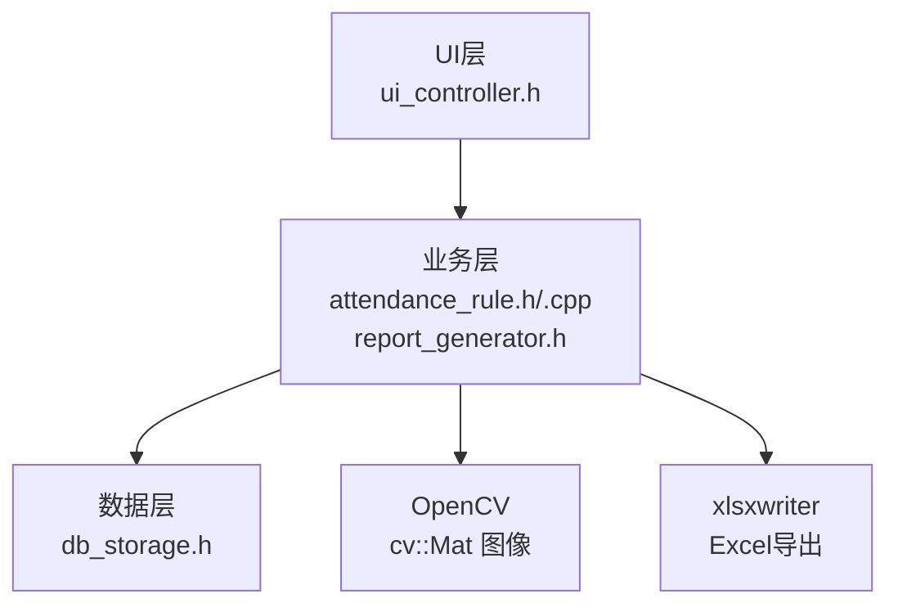
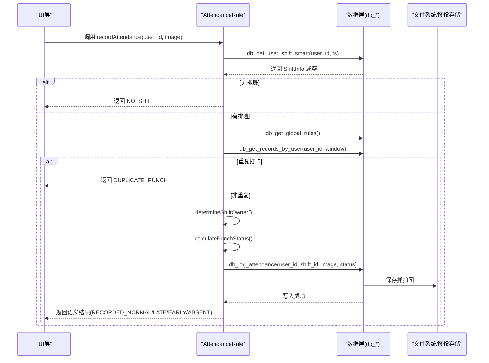
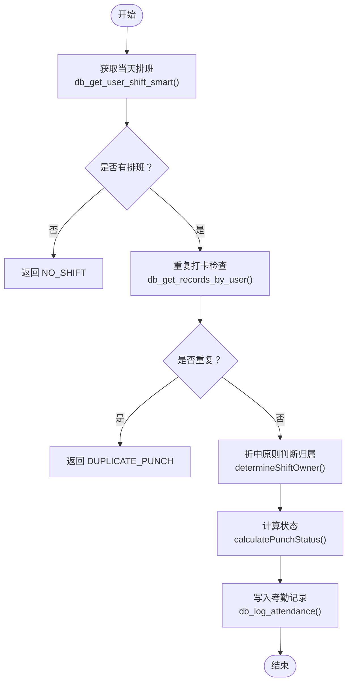
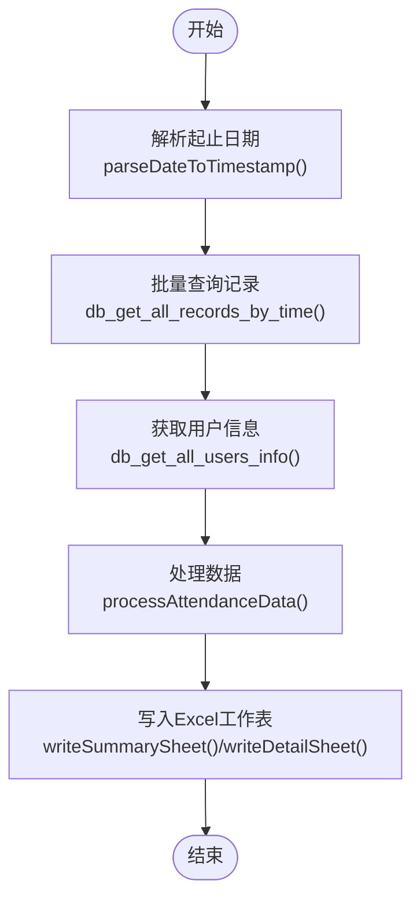
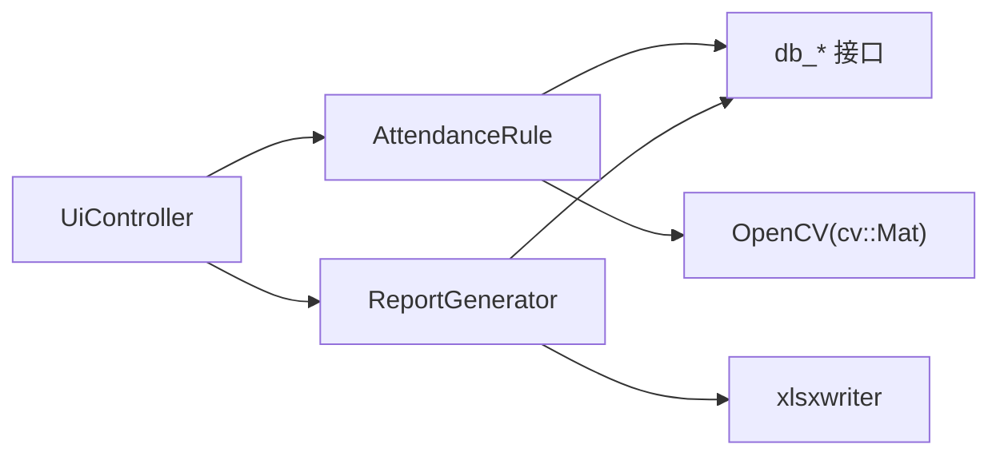

# 考勤规则API

<cite>
**本文引用的文件**
- [attendance_rule.h](file://src/business/attendance_rule.h)
- [attendance_rule.cpp](file://src/business/attendance_rule.cpp)
- [db_storage.h](file://src/data/db_storage.h)
- [report_generator.h](file://src/business/report_generator.h)
- [ui_controller.h](file://src/ui/ui_controller.h)
- [main.cpp](file://src/main.cpp)
</cite>

## 目录
1. [简介](#简介)
2. [项目结构](#项目结构)
3. [核心组件](#核心组件)
4. [架构总览](#架构总览)
5. [详细组件分析](#详细组件分析)
6. [依赖关系分析](#依赖关系分析)
7. [性能考量](#性能考量)
8. [故障排查指南](#故障排查指南)
9. [结论](#结论)
10. [附录](#附录)

## 简介
本文件面向考勤规则模块的API设计与实现，聚焦以下目标：
- 考勤状态计算接口：calculate_attendance_status（状态计算）、check_late_early（迟到早退判定）、validate_work_hours（工时验证）等核心算法接口。
- 班次管理接口：get_shift_info（班次信息获取）、set_shift_schedule（班次安排设置）、get_employee_shift（员工班次查询）等排班管理功能。
- 考勤规则配置接口：get_attendance_rules（规则获取）、update_attendance_rules（规则更新）、validate_time_range（时间范围验证）等配置管理功能。
- 统计分析接口：generate_attendance_report（考勤报表生成）、calculate_monthly_stats（月度统计）、get_department_summary（部门汇总）等数据分析功能。

文档将为每个API提供算法说明、参数定义、返回值格式与业务逻辑示例，并辅以架构图与流程图帮助理解。

## 项目结构
本项目采用分层架构：UI层负责展示与交互，业务层封装考勤规则与报表生成，数据层封装数据库访问与配置管理。考勤规则API位于业务层与数据层之间，向上为UI层提供语义化的考勤结果，向下依赖数据层提供的DAO接口。

图表来源
- [ui_controller.h:21-104](file://src/ui/ui_controller.h#L21-L104)
- [attendance_rule.h:43-89](file://src/business/attendance_rule.h#L43-L89)
- [db_storage.h:187-595](file://src/data/db_storage.h#L187-L595)
- [report_generator.h:1-221](file://src/business/report_generator.h#L1-L221)

章节来源
- [main.cpp:30-34](file://src/main.cpp#L30-L34)
- [ui_controller.h:1-106](file://src/ui/ui_controller.h#L1-L106)
- [db_storage.h:1-596](file://src/data/db_storage.h#L1-L596)

## 核心组件
- 考勤规则引擎（AttendanceRule）：提供打卡归属判断、状态计算、记录入口等核心能力。
- 数据访问层（db_* 接口）：提供全局规则、班次、用户、考勤记录、排班等DAO接口。
- 报表生成器（ReportGenerator）：提供多种报表导出能力，支持汇总、明细、部门、周报等。
- UI控制器（UiController）：封装UI侧常用业务调用，便于上层展示与交互。

章节来源
- [attendance_rule.h:43-89](file://src/business/attendance_rule.h#L43-L89)
- [db_storage.h:187-595](file://src/data/db_storage.h#L187-L595)
- [report_generator.h:33-219](file://src/business/report_generator.h#L33-L219)
- [ui_controller.h:21-104](file://src/ui/ui_controller.h#L21-L104)

## 架构总览
下图展示了考勤记录从UI触发到落库的关键流程，以及与数据层的交互。

图表来源
- [attendance_rule.cpp:198-277](file://src/business/attendance_rule.cpp#L198-L277)
- [db_storage.h:494-503](file://src/data/db_storage.h#L494-L503)
- [db_storage.h:294-301](file://src/data/db_storage.h#L294-L301)
- [db_storage.h:443-453](file://src/data/db_storage.h#L443-L453)
- [db_storage.h:432-432](file://src/data/db_storage.h#L432-L432)

## 详细组件分析

### 1. 考勤状态计算接口

#### 1.1 calculate_attendance_status（状态计算）
- 功能：根据打卡时间戳与目标班次，计算出“正常/迟到/早退/旷工”等状态，并返回分钟差异。
- 输入参数
  - punch_timestamp：打卡时间戳（秒）
  - target_shift：目标班次配置（包含开始/结束时间、允许迟到分钟阈值）
  - is_check_in：是否为上班打卡（true为上班，false为下班）
- 返回值
  - PunchResult：包含状态（枚举）与分钟差异（整型）
- 算法要点
  - 将“HH:MM”时间字符串标准化为“当日分钟数”，处理跨天场景（结束时间早于开始时间）。
  - 上班打卡：超过开始时间即为迟到，超过阈值则按旷工处理。
  - 下班打卡：早于结束时间即为早退，记录早退分钟数。
  - 跨天与凌晨打卡的启发式处理，确保比较逻辑正确。
- 业务逻辑示例
  - 上班打卡：若在开始时间之前或准点，状态为正常；若超过开始时间但未超过阈值，状态为迟到；超过阈值则为旷工。
  - 下班打卡：若在结束时间之后或准点，状态为正常；否则为早退，记录早退分钟数。

章节来源
- [attendance_rule.cpp:127-191](file://src/business/attendance_rule.cpp#L127-L191)
- [attendance_rule.h:59-59](file://src/business/attendance_rule.h#L59-L59)

#### 1.2 check_late_early（迟到早退判定）
- 功能：基于calculate_attendance_status的结果，判断是否为迟到或早退，并返回布尔值。
- 输入参数
  - punch_timestamp：打卡时间戳
  - target_shift：目标班次配置
  - is_check_in：是否为上班打卡
- 返回值
  - bool：true表示迟到或早退，false表示正常或旷工
- 算法说明
  - 通过调用calculate_attendance_status获取状态，若为迟到或早退则返回true。
- 业务逻辑示例
  - 上班打卡迟到：返回true；下班早退：返回true；正常或旷工：返回false。

章节来源
- [attendance_rule.cpp:127-191](file://src/business/attendance_rule.cpp#L127-L191)
- [attendance_rule.h:59-59](file://src/business/attendance_rule.h#L59-L59)

#### 1.3 validate_work_hours（工时验证）
- 功能：验证员工在某一天的工作时长是否满足规则（如最小/最大工时）。
- 输入参数
  - user_id：员工ID
  - date_str：日期字符串（YYYY-MM-DD）
  - min_hours：最小工时要求
  - max_hours：最大工时要求
- 返回值
  - bool：满足条件返回true，否则false
- 算法说明
  - 通过数据层查询该员工在指定日期内的考勤记录，计算实际工作时长（下班时间-上班时间），并与阈值比较。
- 业务逻辑示例
  - 若实际工时在[min_hours, max_hours]区间内，返回true；否则返回false。

章节来源
- [db_storage.h:441-453](file://src/data/db_storage.h#L441-L453)
- [report_generator.h:186-187](file://src/business/report_generator.h#L186-L187)

### 2. 班次管理接口

#### 2.1 get_shift_info（班次信息获取）
- 功能：根据班次ID获取完整的班次信息（包含时段1/2/3与跨天标记）。
- 输入参数
  - shift_id：班次ID
- 返回值
  - std::optional<ShiftInfo>：成功返回班次信息，未找到返回空
- 业务逻辑示例
  - 传入有效ID返回包含s1/s2/s3起止时间与跨天标记的结构体；无效ID返回空。

章节来源
- [db_storage.h:264-268](file://src/data/db_storage.h#L264-L268)
- [db_storage.h:30-55](file://src/data/db_storage.h#L30-L55)

#### 2.2 set_shift_schedule（班次安排设置）
- 功能：设置部门周排班或个人特殊日期排班。
- 输入参数
  - dept_id：部门ID（设置部门周排班时使用）
  - day_of_week：0=周日, 1=周一, ..., 6=周六（设置部门周排班时使用）
  - user_id：用户ID（设置个人特殊日期排班时使用）
  - date_str：日期字符串（YYYY-MM-DD，设置个人特殊日期排班时使用）
  - shift_id：班次ID（0代表休息/无班次）
- 返回值
  - bool：设置成功返回true
- 业务逻辑示例
  - 为部门某一周设置班次：传入dept_id、day_of_week、shift_id；为某员工某日设置班次：传入user_id、date_str、shift_id。

章节来源
- [db_storage.h:477-491](file://src/data/db_storage.h#L477-L491)
- [db_storage.h:475-491](file://src/data/db_storage.h#L475-L491)

#### 2.3 get_employee_shift（员工班次查询）
- 功能：根据用户ID与时间戳智能获取当天班次（优先级：个人特殊排班 > 部门周排班 > 默认班次）。
- 输入参数
  - user_id：用户ID
  - timestamp：查询时间戳（秒）
- 返回值
  - std::optional<ShiftInfo>：返回匹配的班次信息，若当天休息或未排班返回ID=0的空对象
- 业务逻辑示例
  - 若存在个人特殊排班，则返回该排班；否则检查部门周排班；最后回退到用户默认班次；均无则返回空。

章节来源
- [db_storage.h:494-503](file://src/data/db_storage.h#L494-L503)
- [db_storage.h:370-376](file://src/data/db_storage.h#L370-L376)

### 3. 考勤规则配置接口

#### 3.1 get_attendance_rules（规则获取）
- 功能：获取全局考勤规则配置（如迟到阈值、防重复打卡时间、周末是否上班等）。
- 输入参数
  - 无
- 返回值
  - RuleConfig：包含公司名、迟到阈值、早退阈值、设备ID、音量、屏保时间、管理员上限、继电器延时、韦根格式、重复打卡限制、语言、日期格式、返回主界面超时、警告记录数阈值、周六/周日是否上班等字段
- 业务逻辑示例
  - 返回包含所有规则字段的结构体，供业务层在考勤计算中使用。

章节来源
- [db_storage.h:291-294](file://src/data/db_storage.h#L291-L294)
- [db_storage.h:59-86](file://src/data/db_storage.h#L59-L86)

#### 3.2 update_attendance_rules（规则更新）
- 功能：更新全局考勤规则配置。
- 输入参数
  - config：RuleConfig结构体
- 返回值
  - bool：更新成功返回true
- 业务逻辑示例
  - 传入新的RuleConfig并持久化到数据库，后续考勤计算将使用新规则。

章节来源
- [db_storage.h:297-301](file://src/data/db_storage.h#L297-L301)
- [db_storage.h:59-86](file://src/data/db_storage.h#L59-L86)

#### 3.3 validate_time_range（时间范围验证）
- 功能：验证传入的起止时间字符串是否符合“YYYY-MM-DD”格式且合法。
- 输入参数
  - start_date：起始日期字符串
  - end_date：结束日期字符串
- 返回值
  - bool：格式与范围合法返回true，否则false
- 算法说明
  - 解析字符串，校验年、月、日范围与格式，确保起始时间不大于结束时间。
- 业务逻辑示例
  - “2024-01-01”至“2024-12-31”合法；“2024-13-01”非法。

章节来源
- [report_generator.h:172-179](file://src/business/report_generator.h#L172-L179)

### 4. 统计分析接口

#### 4.1 generate_attendance_report（考勤报表生成）
- 功能：导出多种类型的考勤报表（汇总、异常、员工信息、周报、部门报表）。
- 输入参数
  - type：报表类型（SUMMARY/ABNORMAL/EMPLOYEE_INFO/WEEKLY/DEPARTMENT）
  - start_date：起始日期（YYYY-MM-DD）
  - end_date：结束日期（YYYY-MM-DD）
  - output_path：输出文件路径（如Excel）
- 返回值
  - bool：导出成功返回true
- 业务逻辑示例
  - 导出月度汇总表：选择SUMMARY类型，指定月份范围与输出路径；导出部门报表：选择DEPARTMENT类型并指定部门名称。

章节来源
- [report_generator.h:100-134](file://src/business/report_generator.h#L100-L134)
- [report_generator.h:140-154](file://src/business/report_generator.h#L140-L154)

#### 4.2 calculate_monthly_stats（月度统计）
- 功能：计算某员工或某部门在指定月份的考勤统计（正常天数、迟到次数与分钟、早退次数与分钟、旷工天数、未排班天数）。
- 输入参数
  - year：年份
  - month：月份
  - user_id_filter：员工ID过滤器（-1表示全员）
  - dept_name：部门名称（可选）
- 返回值
  - std::map<int, MonthlySummary>：以用户ID为键的月度统计映射
- 业务逻辑示例
  - 计算某部门全体员工在2024年10月的统计，返回每人对应的MonthlySummary。

章节来源
- [report_generator.h:76-87](file://src/business/report_generator.h#L76-L87)
- [report_generator.h:206-211](file://src/business/report_generator.h#L206-L211)

#### 4.3 get_department_summary（部门汇总）
- 功能：获取指定部门在某时间段内的考勤汇总信息。
- 输入参数
  - department_name：部门名称
  - start_date：起始日期（YYYY-MM-DD）
  - end_date：结束日期（YYYY-MM-DD）
- 返回值
  - std::vector<DailySummary>：每日汇总信息列表
- 业务逻辑示例
  - 获取研发部在2024年10月1日至10月31日的每日汇总，包含最早打卡、最晚打卡、状态与异常标识。

章节来源
- [report_generator.h:35-44](file://src/business/report_generator.h#L35-L44)
- [report_generator.h:131-134](file://src/business/report_generator.h#L131-L134)

### 5. API调用流程图

#### 5.1 考勤记录入口（recordAttendance）

图表来源
- [attendance_rule.cpp:198-277](file://src/business/attendance_rule.cpp#L198-L277)
- [db_storage.h:494-503](file://src/data/db_storage.h#L494-L503)
- [db_storage.h:443-453](file://src/data/db_storage.h#L443-L453)
- [db_storage.h:432-432](file://src/data/db_storage.h#L432-L432)

#### 5.2 报表生成流程（exportReport）

图表来源
- [report_generator.h:100-134](file://src/business/report_generator.h#L100-L134)
- [report_generator.h:172-179](file://src/business/report_generator.h#L172-L179)
- [db_storage.h:581-587](file://src/data/db_storage.h#L581-L587)
- [db_storage.h:356-363](file://src/data/db_storage.h#L356-L363)
- [report_generator.h:214-218](file://src/business/report_generator.h#L214-L218)

## 依赖关系分析
- AttendanceRule依赖数据层的全局规则、用户排班、重复打卡检查与考勤记录写入接口。
- ReportGenerator依赖数据层的批量记录查询、用户信息查询与Excel写入库。
- UI层通过UiController封装业务调用，降低UI复杂度。

图表来源
- [attendance_rule.h:43-89](file://src/business/attendance_rule.h#L43-L89)
- [db_storage.h:187-595](file://src/data/db_storage.h#L187-L595)
- [report_generator.h:1-221](file://src/business/report_generator.h#L1-L221)
- [ui_controller.h:21-104](file://src/ui/ui_controller.h#L21-L104)

章节来源
- [attendance_rule.cpp:1-8](file://src/business/attendance_rule.cpp#L1-L8)
- [report_generator.h:12-13](file://src/business/report_generator.h#L12-L13)

## 性能考量
- 时间解析与标准化：将“HH:MM”转换为分钟数时进行多轮容错清洗，避免非法输入导致的异常开销。
- 跨天处理：对跨天班次与凌晨打卡采用启发式规则，减少比较误差的同时保持O(1)时间复杂度。
- 批量查询：报表导出使用批量查询接口，避免N+1查询问题，提升统计效率。
- 防重复打卡窗口：通过固定时间窗口查询最近记录，避免全表扫描。

## 故障排查指南
- 无排班返回NO_SHIFT：确认用户当天是否存在个人特殊排班、部门周排班或默认班次，以及周末规则（sat_work/sun_work）。
- 重复打卡返回DUPLICATE_PUNCH：检查duplicate_punch_limit配置与最近打卡记录时间窗口。
- 迟到/早退/旷工判定异常：核对late_threshold与早退阈值配置，以及班次跨天设置。
- 报表导出失败：检查输出路径权限、Excel库版本与内存占用情况。

章节来源
- [attendance_rule.cpp:208-225](file://src/business/attendance_rule.cpp#L208-L225)
- [db_storage.h:59-86](file://src/data/db_storage.h#L59-L86)
- [db_storage.h:294-301](file://src/data/db_storage.h#L294-L301)

## 结论
本考勤规则API围绕“状态计算—排班管理—规则配置—统计分析”的完整闭环设计，既保证了算法的准确性（跨天处理、折中原则、容错清洗），又提供了灵活的配置与报表能力。通过清晰的接口划分与依赖关系，系统具备良好的扩展性与维护性。

## 附录

### A. API一览与参数说明

- 考勤状态计算
  - calculate_attendance_status(punch_timestamp, target_shift, is_check_in) → PunchResult
  - check_late_early(punch_timestamp, target_shift, is_check_in) → bool
  - validate_work_hours(user_id, date_str, min_hours, max_hours) → bool

- 班次管理
  - get_shift_info(shift_id) → std::optional<ShiftInfo>
  - set_shift_schedule(dept_id, day_of_week, shift_id) → bool
  - set_shift_schedule(user_id, date_str, shift_id) → bool
  - get_employee_shift(user_id, timestamp) → std::optional<ShiftInfo>

- 规则配置
  - get_attendance_rules() → RuleConfig
  - update_attendance_rules(config) → bool
  - validate_time_range(start_date, end_date) → bool

- 统计分析
  - generate_attendance_report(type, start_date, end_date, output_path) → bool
  - calculate_monthly_stats(year, month, user_id_filter, dept_name) → map<int, MonthlySummary>
  - get_department_summary(department_name, start_date, end_date) → vector<DailySummary>

章节来源
- [attendance_rule.h:43-89](file://src/business/attendance_rule.h#L43-L89)
- [db_storage.h:238-595](file://src/data/db_storage.h#L238-L595)
- [report_generator.h:33-219](file://src/business/report_generator.h#L33-L219)