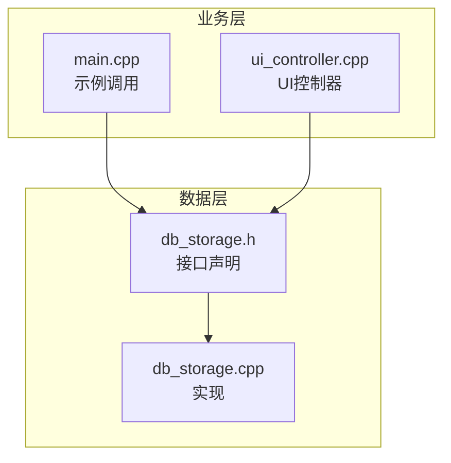
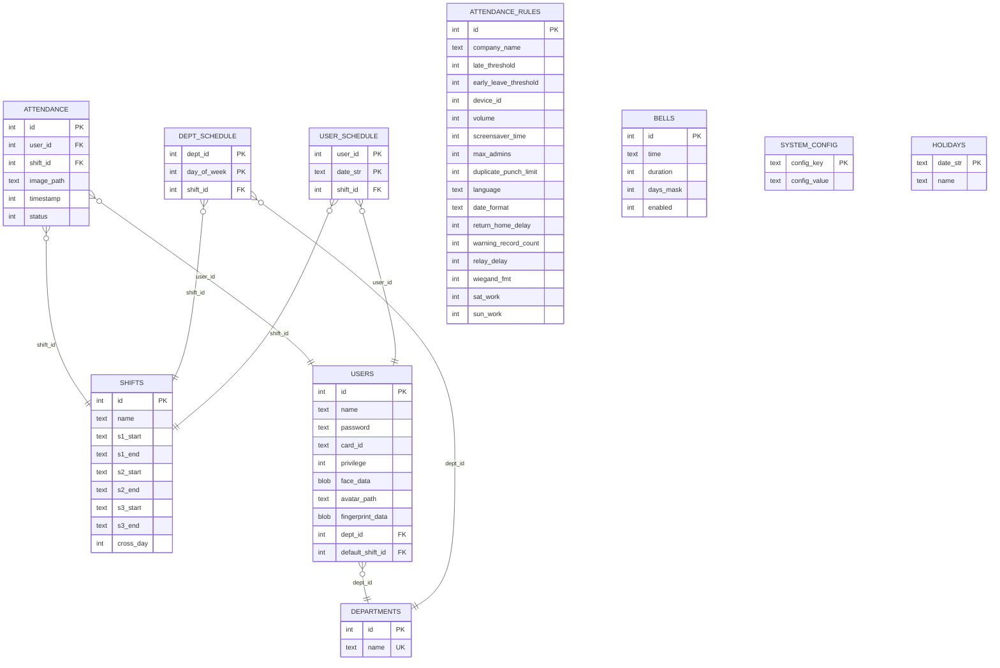
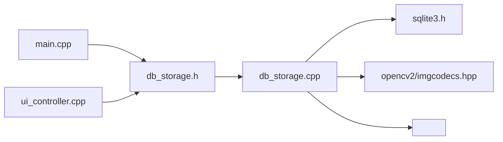

# 数据层API

<cite>
**本文引用的文件**
- [db_storage.h](file://src/data/db_storage.h)
- [db_storage.cpp](file://src/data/db_storage.cpp)
- [main.cpp](file://src/main.cpp)
- [ui_controller.cpp](file://src/ui/ui_controller.cpp)
</cite>

## 目录
1. [简介](#简介)
2. [项目结构](#项目结构)
3. [核心组件](#核心组件)
4. [架构总览](#架构总览)
5. [详细组件分析](#详细组件分析)
6. [依赖关系分析](#依赖关系分析)
7. [性能考量](#性能考量)
8. [故障排查指南](#故障排查指南)
9. [结论](#结论)
10. [附录](#附录)

## 简介
本文件系统性梳理 SmartAttendance 项目的“数据层API”，聚焦数据库操作接口与DAO模式实现，涵盖：
- 用户管理接口：注册、更新、删除、查询
- 考勤记录接口：记录、查询（按日期、按用户）
- 部门管理接口：新增、查询、删除
- 班次与排班接口：新增、查询、智能排班
- 事务管理接口：开启、提交、回滚
- 系统配置、节假日、报表辅助查询等扩展能力
- 并发安全、性能优化与错误处理实践

## 项目结构
数据层位于 src/data，核心文件为 db_storage.h（接口声明）与 db_storage.cpp（实现）。上层业务通过 db_storage.h 暴露的API完成数据持久化与查询。

图表来源
- [db_storage.h](file://src/data/db_storage.h)
- [db_storage.cpp](file://src/data/db_storage.cpp)
- [main.cpp](file://src/main.cpp)
- [ui_controller.cpp](file://src/ui/ui_controller.cpp)

章节来源
- [db_storage.h:1-596](file://src/data/db_storage.h#L1-L596)
- [db_storage.cpp:1-2171](file://src/data/db_storage.cpp#L1-L2171)

## 核心组件
- 数据库引擎：SQLite（通过 sqlite3.h）
- 并发控制：共享/独占读写锁（std::shared_mutex）
- 预编译语句缓存：提高高频插入性能
- RAII封装：ScopedSqliteStmt 管理 sqlite3_stmt 生命周期
- 文件系统：用于图片存储与清理

章节来源
- [db_storage.cpp:19-65](file://src/data/db_storage.cpp#L19-L65)
- [db_storage.cpp:42-65](file://src/data/db_storage.cpp#L42-L65)

## 架构总览
数据层采用“DAO模式”，围绕以下实体表进行CRUD：
- departments（部门）
- shifts（班次）
- users（用户）
- attendance（考勤记录）
- dept_schedule（部门周排班）
- user_schedule（个人特殊排班）
- attendance_rules（全局考勤规则）
- bells（定时响铃）
- system_config（系统配置）
- holidays（节假日）

图表来源
- [db_storage.cpp:140-251](file://src/data/db_storage.cpp#L140-L251)

## 详细组件分析

### 1. 初始化与生命周期
- data_init：连接数据库、创建/升级表结构、应用性能Pragmas、预编译高频语句、播种默认数据
- data_seed：空表时自动插入默认部门、班次、管理员、响铃槽位
- data_close：释放预编译语句与数据库连接

章节来源
- [db_storage.cpp:108-284](file://src/data/db_storage.cpp#L108-L284)
- [db_storage.cpp:318-387](file://src/data/db_storage.cpp#L318-L387)
- [db_storage.cpp:390-405](file://src/data/db_storage.cpp#L390-L405)

### 2. 部门管理接口（DAO）
- 新增部门：db_add_department
- 查询部门：db_get_departments
- 删除部门：db_delete_department

并发与安全：写操作加独占锁，读操作加共享锁；删除部门触发外键SET NULL（用户dept_id置空）。

章节来源
- [db_storage.h:217-236](file://src/data/db_storage.h#L217-L236)
- [db_storage.cpp:409-461](file://src/data/db_storage.cpp#L409-L461)

### 3. 班次管理接口（DAO）
- 新增班次：db_add_shift
- 更新班次：db_update_shift
- 查询班次：db_get_shifts
- 获取单个班次：db_get_shift_info
- 删除班次：db_delete_shift

并发与安全：写操作加独占锁；查询使用共享锁；支持跨天配置。

章节来源
- [db_storage.h:238-288](file://src/data/db_storage.h#L238-L288)
- [db_storage.cpp:465-695](file://src/data/db_storage.cpp#L465-L695)

### 4. 用户管理接口（DAO）
- 注册用户：db_add_user（含人脸图像持久化）
- 批量导入：db_batch_add_users（事务加速、OR REPLACE）
- 删除用户：db_delete_user（级联删除考勤记录）
- 查询用户：db_get_user_info（含人脸/指纹/BLOB按需加载）
- 查询全部用户：db_get_all_users、db_get_all_users_info、db_get_all_users_light
- 排班绑定：db_assign_user_shift、db_get_user_shift
- 更新用户信息：db_update_user_basic
- 更新人脸：db_update_user_face（含旧图清理）
- 更新密码：db_update_user_password（内部哈希）
- 更新指纹：db_update_user_fingerprint

并发与安全：写操作加独占锁；读操作加共享锁；人脸/指纹BLOB按需加载，避免影响性能。

章节来源
- [db_storage.h:315-420](file://src/data/db_storage.h#L315-L420)
- [db_storage.cpp:748-1262](file://src/data/db_storage.cpp#L748-L1262)

### 5. 考勤记录接口（DAO）
- 记录考勤：db_log_attendance（预编译语句、图片落盘、原子写入）
- 查询记录：db_get_records（按时间段，含姓名/部门）
- 查询个人记录：db_get_records_by_user（按用户+时间段，升序）
- 最后打卡时间：db_getLastPunchTime
- 清理过期图片：db_cleanup_old_attendance_images（事务批量更新）

并发与安全：写操作加独占锁；读操作加共享锁；预编译语句提升插入吞吐；索引 idx_att_user_time 加速查询。

章节来源
- [db_storage.h:421-460](file://src/data/db_storage.h#L421-L460)
- [db_storage.cpp:1296-1536](file://src/data/db_storage.cpp#L1296-L1536)

### 6. 事务管理接口（DAO）
- 开启事务：db_begin_transaction
- 提交事务：db_commit_transaction
- 回滚：在批量导入失败时自动回滚

并发与安全：事务期间持有独占锁，保证批量操作一致性。

章节来源
- [db_storage.h:463-473](file://src/data/db_storage.h#L463-L473)
- [db_storage.cpp:1540-1552](file://src/data/db_storage.cpp#L1540-L1552)
- [db_storage.cpp:806-904](file://src/data/db_storage.cpp#L806-L904)

### 7. 排班管理接口（DAO）
- 部门周排班：db_set_dept_schedule
- 个人特殊排班：db_set_user_special_schedule
- 智能排班查询：db_get_user_shift_smart（优先级：个人特殊 > 部门周排班 > 默认班次；周末规则节点K）

并发与安全：读写均加锁；智能排班内部多次查询，最终统一返回ShiftInfo。

章节来源
- [db_storage.h:475-503](file://src/data/db_storage.h#L475-L503)
- [db_storage.cpp:1597-1763](file://src/data/db_storage.cpp#L1597-L1763)

### 8. 系统配置与报表辅助接口
- 全局规则：db_get_global_rules、db_update_global_rules
- 响铃配置：db_get_all_bells、db_update_bell
- 系统配置KV：db_get_system_config、db_set_system_config
- 全局节假日：db_set_holiday、db_delete_holiday、db_get_holiday
- 报表辅助：db_get_all_records_by_time（全公司）、db_get_users_by_dept（按部门）

并发与安全：读写分别加锁；报表接口使用联表查询避免N+1问题。

章节来源
- [db_storage.h:291-594](file://src/data/db_storage.h#L291-L594)
- [db_storage.cpp:574-2171](file://src/data/db_storage.cpp#L574-L2171)

### 9. 数据维护与恢复
- 清空考勤：db_clear_attendance（清表+删除图片目录）
- 清空用户：db_clear_users（删除users表）
- 恢复出厂：db_factory_reset（删除DB与图片目录，重新初始化）

并发与安全：独占锁保护文件系统操作；数据层内部自动加锁。

章节来源
- [db_storage.h:514-529](file://src/data/db_storage.h#L514-L529)
- [db_storage.cpp:1807-1883](file://src/data/db_storage.cpp#L1807-L1883)

## 依赖关系分析

图表来源
- [db_storage.h:7-14](file://src/data/db_storage.h#L7-L14)
- [db_storage.cpp:7-22](file://src/data/db_storage.cpp#L7-L22)
- [main.cpp:105-135](file://src/main.cpp#L105-L135)
- [ui_controller.cpp:132-136](file://src/ui/ui_controller.cpp#L132-L136)

章节来源
- [db_storage.h:7-14](file://src/data/db_storage.h#L7-L14)
- [db_storage.cpp:7-22](file://src/data/db_storage.cpp#L7-L22)

## 性能考量
- SQLite性能优化Pragmas：WAL、NORMAL同步、内存临时表、缓存大小、外键约束
- 预编译语句：高频插入（考勤记录）使用预编译语句，减少解析开销
- 索引：联合索引 idx_att_user_time 加速按用户+时间的查询
- BLOB按需加载：用户查询默认不加载人脸/指纹BLOB，降低内存与IO压力
- 批量导入：事务包裹，OR REPLACE提升导入效率并保证幂等
- 文件系统：图片落盘与清理分离，避免阻塞数据库写入

章节来源
- [db_storage.cpp:123-135](file://src/data/db_storage.cpp#L123-L135)
- [db_storage.cpp:275-282](file://src/data/db_storage.cpp#L275-L282)
- [db_storage.cpp:1264-1292](file://src/data/db_storage.cpp#L1264-L1292)
- [db_storage.cpp:806-904](file://src/data/db_storage.cpp#L806-L904)
- [db_storage.cpp:1372-1436](file://src/data/db_storage.cpp#L1372-L1436)

## 故障排查指南
- SQL错误定位：exec_sql统一捕获sqlite3_exec错误并打印标签
- 事务失败：批量导入失败自动回滚，检查日志输出
- 锁竞争：读多写少场景使用共享锁；写操作务必在独占锁范围内
- BLOB异常：人脸/指纹为空时写入NULL；读取时判空避免崩溃
- 文件系统异常：图片保存/删除失败时捕获异常并记录告警
- 外键约束：删除部门/班次需谨慎，注意级联行为

章节来源
- [db_storage.cpp:96-104](file://src/data/db_storage.cpp#L96-L104)
- [db_storage.cpp:814-831](file://src/data/db_storage.cpp#L814-L831)
- [db_storage.cpp:1135-1148](file://src/data/db_storage.cpp#L1135-L1148)
- [db_storage.cpp:1406-1418](file://src/data/db_storage.cpp#L1406-L1418)

## 结论
SmartAttendance数据层以DAO为核心，结合SQLite与RAII封装，实现了高内聚、低耦合的数据访问层。通过共享/独占锁保障并发安全，通过预编译语句与索引优化查询性能，通过事务与文件系统分离提升批量导入与清理效率。接口设计清晰，覆盖用户、考勤、排班、配置等核心业务，适合在嵌入式与桌面端稳定运行。

## 附录

### A. 使用示例（基于现有代码）
- 初始化与播种
  - 调用 data_init，随后 data_seed 自动播种默认数据
  - 参考：[main.cpp:82-103](file://src/main.cpp#L82-L103)

- 用户注册与回读
  - db_add_user 注册用户，db_get_user_info 回读验证
  - 参考：[main.cpp:105-135](file://src/main.cpp#L105-L135)

- UI侧密码校验
  - db_hash_password 对输入密码进行哈希，与数据库存储比对
  - 参考：[ui_controller.cpp:132-136](file://src/ui/ui_controller.cpp#L132-L136)

- 批量导入用户
  - db_batch_add_users 使用事务加速导入
  - 参考：[db_storage.cpp:806-904](file://src/data/db_storage.cpp#L806-L904)

- 考勤记录查询
  - db_get_records 按时间段查询，db_get_records_by_user 按用户+时间段查询
  - 参考：[db_storage.cpp:1439-1536](file://src/data/db_storage.cpp#L1439-L1536)

- 事务控制
  - db_begin_transaction、db_commit_transaction
  - 参考：[db_storage.cpp:1540-1552](file://src/data/db_storage.cpp#L1540-L1552)

### B. 数据结构与接口一览（摘要）
- 数据结构：DeptInfo、ShiftInfo、RuleConfig、BellSchedule、UserData、AttendanceRecord、SystemStats
- 接口分类：
  - 初始化与生命周期：data_init、data_seed、data_close
  - 部门：db_add_department、db_get_departments、db_delete_department
  - 班次：db_add_shift、db_update_shift、db_get_shifts、db_get_shift_info、db_delete_shift
  - 用户：db_add_user、db_batch_add_users、db_delete_user、db_get_user_info、db_get_all_users、db_get_all_users_info、db_get_all_users_light、db_assign_user_shift、db_get_user_shift、db_update_user_basic、db_update_user_face、db_update_user_password、db_update_user_fingerprint
  - 考勤：db_log_attendance、db_get_records、db_get_records_by_user、db_getLastPunchTime、db_cleanup_old_attendance_images
  - 事务：db_begin_transaction、db_commit_transaction
  - 排班：db_set_dept_schedule、db_set_user_special_schedule、db_get_user_shift_smart
  - 配置与报表：db_get_global_rules、db_update_global_rules、db_get_all_bells、db_update_bell、db_get_system_config、db_set_system_config、db_get_all_records_by_time、db_get_users_by_dept、db_get_system_stats
  - 维护：db_clear_attendance、db_clear_users、db_factory_reset、db_set_holiday、db_delete_holiday、db_get_holiday

章节来源
- [db_storage.h:18-594](file://src/data/db_storage.h#L18-L594)