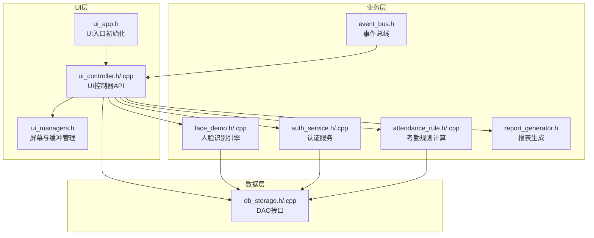
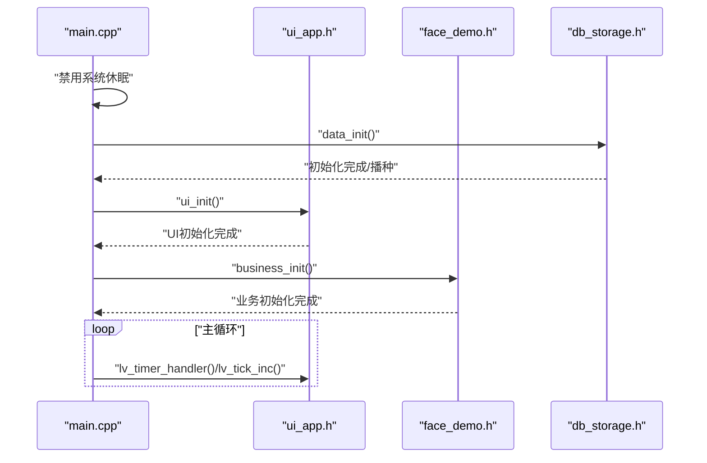
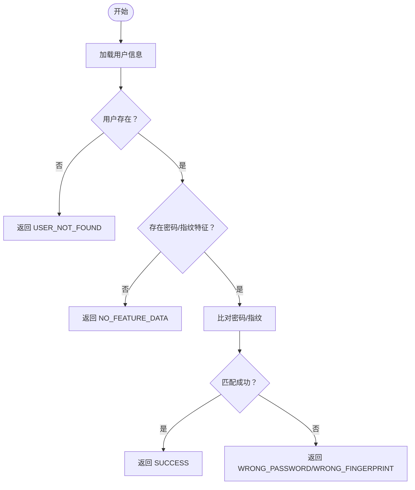
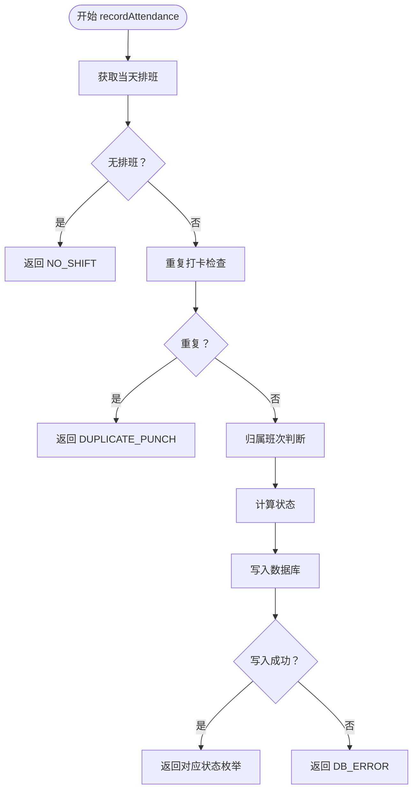
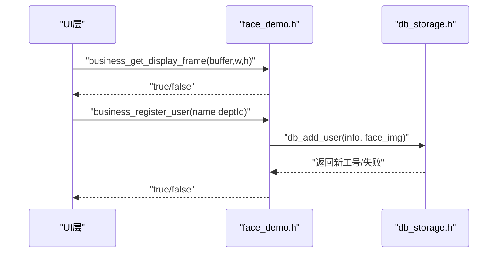
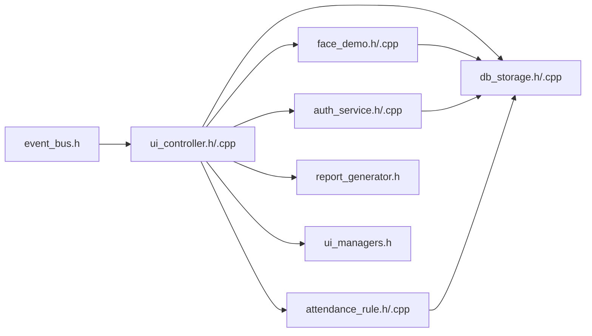
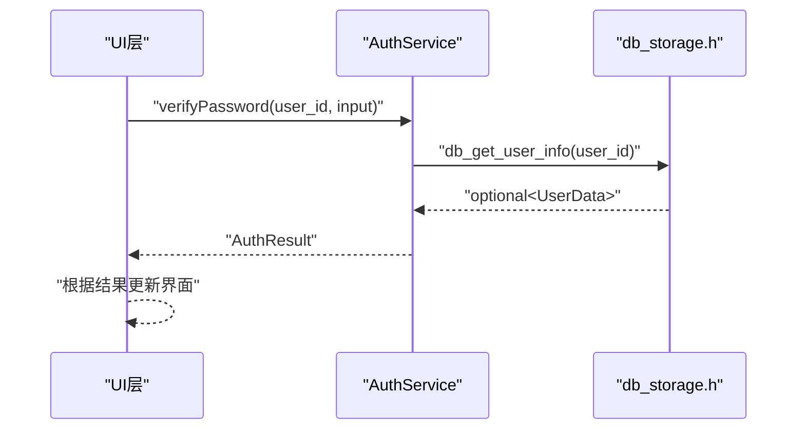
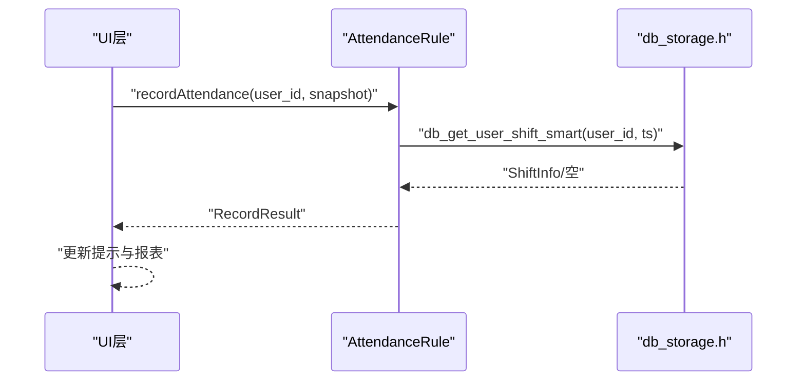
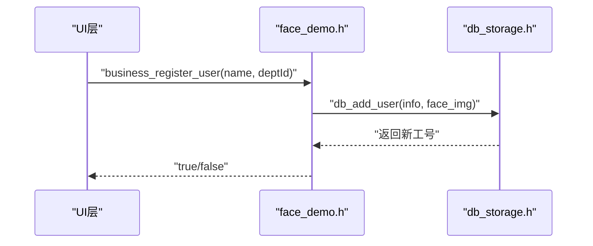

# API接口参考

<cite>
**本文档引用的文件**
- [src/main.cpp](file://src/main.cpp)
- [src/ui/ui_app.h](file://src/ui/ui_app.h)
- [src/ui/ui_controller.h](file://src/ui/ui_controller.h)
- [src/ui/ui_controller.cpp](file://src/ui/ui_controller.cpp)
- [src/ui/managers/ui_manager.h](file://src/ui/managers/ui_manager.h)
- [src/business/auth_service.h](file://src/business/auth_service.h)
- [src/business/auth_service.cpp](file://src/business/auth_service.cpp)
- [src/business/attendance_rule.h](file://src/business/attendance_rule.h)
- [src/business/attendance_rule.cpp](file://src/business/attendance_rule.cpp)
- [src/business/face_demo.h](file://src/business/face_demo.h)
- [src/business/face_demo.cpp](file://src/business/face_demo.cpp)
- [src/business/event_bus.h](file://src/business/event_bus.h)
- [src/business/report_generator.h](file://src/business/report_generator.h)
- [src/data/db_storage.h](file://src/data/db_storage.h)
- [src/data/db_storage.cpp](file://src/data/db_storage.cpp)
</cite>

## 目录
1. [简介](#简介)
2. [项目结构](#项目结构)
3. [核心组件](#核心组件)
4. [架构总览](#架构总览)
5. [详细组件分析](#详细组件分析)
6. [依赖关系分析](#依赖关系分析)
7. [性能考虑](#性能考虑)
8. [故障排查指南](#故障排查指南)
9. [结论](#结论)
10. [附录](#附录)

## 简介
本文件为智能考勤系统的API接口参考文档，覆盖UI层控制器API、业务层API（认证服务、考勤规则计算、人脸识别引擎）、数据层API（用户管理、考勤记录、部门管理）。文档为每个API提供参数说明、返回值定义、异常处理策略与使用示例，并给出API调用顺序图与集成示例，帮助开发者正确使用各接口。同时包含API版本兼容性与迁移指南。

## 项目结构
系统采用分层架构：
- UI层：负责屏幕管理、控件操作、事件处理与回调，通过UI控制器统一对外暴露API。
- 业务层：提供认证服务、考勤规则计算、人脸识别引擎、事件总线、报表生成等能力。
- 数据层：封装SQLite数据库访问，提供部门、班次、用户、考勤记录等DAO接口。

**图表来源**
- [src/ui/ui_app.h:1-18](file://src/ui/ui_app.h#L1-L18)
- [src/ui/ui_controller.h:1-122](file://src/ui/ui_controller.h#L1-L122)
- [src/ui/managers/ui_manager.h:1-169](file://src/ui/managers/ui_manager.h#L1-L169)
- [src/business/auth_service.h:1-46](file://src/business/auth_service.h#L1-L46)
- [src/business/attendance_rule.h:1-92](file://src/business/attendance_rule.h#L1-L92)
- [src/business/face_demo.h:1-212](file://src/business/face_demo.h#L1-L212)
- [src/business/event_bus.h:1-43](file://src/business/event_bus.h#L1-L43)
- [src/business/report_generator.h:1-192](file://src/business/report_generator.h#L1-L192)
- [src/data/db_storage.h:1-800](file://src/data/db_storage.h#L1-L800)

**章节来源**
- [src/main.cpp:187-246](file://src/main.cpp#L187-L246)
- [src/ui/ui_app.h:1-18](file://src/ui/ui_app.h#L1-L18)

## 核心组件
- UI控制器API：封装系统状态、员工管理、记录查询、维护与报表导出、摄像头图像获取与更新等接口，提供线程安全与缓存机制。
- 认证服务API：提供密码与指纹验证接口，返回标准化的认证结果枚举。
- 考勤规则API：提供班次归属判断、状态计算、重复打卡防抖、记录落库等核心逻辑。
- 人脸识别引擎API：提供业务初始化、预处理配置、视频帧获取、用户注册与人脸更新、识别开关控制等接口。
- 数据层API：提供部门、班次、用户、考勤记录、排班与节假日、系统配置等DAO接口，内置线程安全与事务支持。

**章节来源**
- [src/ui/ui_controller.h:21-122](file://src/ui/ui_controller.h#L21-L122)
- [src/business/auth_service.h:23-46](file://src/business/auth_service.h#L23-L46)
- [src/business/attendance_rule.h:43-92](file://src/business/attendance_rule.h#L43-L92)
- [src/business/face_demo.h:34-212](file://src/business/face_demo.h#L34-L212)
- [src/data/db_storage.h:213-800](file://src/data/db_storage.h#L213-L800)

## 架构总览
系统启动流程与模块交互如下：

**图表来源**
- [src/main.cpp:187-246](file://src/main.cpp#L187-L246)
- [src/ui/ui_app.h:8-12](file://src/ui/ui_app.h#L8-L12)
- [src/business/face_demo.h:34-40](file://src/business/face_demo.h#L34-L40)
- [src/data/db_storage.h:215-239](file://src/data/db_storage.h#L215-L239)

## 详细组件分析

### UI层控制器API
- 系统状态类
  - isDiskFull(): 检查剩余空间是否低于阈值，返回布尔值。
  - getCurrentTimeStr(): 返回当前时间字符串（HH:MM）。
  - getCurrentWeekdayStr(): 返回当前星期字符串（缩写）。
- 员工管理类
  - generateNextUserId(): 生成下一个可用工号。
  - getDepartmentList(): 获取部门列表。
  - getDeptNameById(int): 通过ID获取部门名称。
  - registerNewUser(string, int): 注册新用户（调用业务层）。
  - getUserRoleById(int): 获取用户角色（0普通，1管理员，-1未找到）。
  - verifyUserPassword(int, string): 验证用户密码（哈希比对）。
  - getAllUsers(): 获取所有用户（含人脸特征）。
  - getUserCount(): 获取用户总数。
  - getUserAt(int, out id/name_buf): 获取指定索引的用户信息。
- 记录与查询类
  - getUserInfo(int): 获取用户详情（optional包装）。
  - getRecords(int, time_t, time_t): 获取时间段内的考勤记录。
  - checkUserExists(int): 检查用户是否存在。
- 维护与报表
  - exportReportToUsb(): 导出报表至USB目录。
  - clearAllRecords(), clearAllEmployees(), factoryReset(), clearAllData(): 清理与恢复出厂设置。
  - exportEmployeeSettings(), importEmployeeSettings(out invalid_time_count): 导出/导入员工设置。
- 摄像头与系统信息
  - getDisplayFrame(uint8_t*, int, int): 获取用于UI显示的帧数据。
  - updateCameraFrame(const uint8_t*, int, int): 更新摄像头帧缓存。
  - getSystemStatistics(): 查询系统统计信息。
- 线程与后台服务
  - startBackgroundServices(): 启动监控与采集线程。
  - 用户信息更新：updateUserName(int, string)、updateUserDept(int, int)、updateUserFace(int)、updateUserPassword(int, string)、updateUserRole(int, int)、deleteUser(int)。
- 公司设置
  - saveCompanyName(const std::string&): 保存公司名称。
  - loadCompanyName(std::string&): 加载公司名称。
- 部门管理
  - addDepartment(const std::string&): 添加部门。
  - updateDepartment(int, const std::string&): 更新部门。
  - deleteDepartment(int): 删除部门。
  - getDepartmentEmployeeCount(int): 获取部门员工数量。
- 参数与返回
  - 所有接口均提供明确的参数类型与返回值定义；部分接口返回布尔值表示成功/失败，部分返回容器或结构体。
- 异常处理
  - 对optional类型的返回值进行has_value()检查，避免未命中时的空指针访问。
  - 磁盘空间检查阈值为100MB，低于阈值触发告警事件。
- 使用示例
  - UI层通过UiController::getInstance()获取单例，调用registerNewUser(name, deptId)完成注册；随后通过getDbtUserCount()与getUserAt()展示用户列表。

**章节来源**
- [src/ui/ui_controller.h:26-122](file://src/ui/ui_controller.h#L26-L122)
- [src/ui/ui_controller.cpp:37-141](file://src/ui/ui_controller.cpp#L37-L141)
- [src/ui/ui_controller.cpp:172-200](file://src/ui/ui_controller.cpp#L172-L200)

### 认证服务API
- verifyPassword(int, string): 密码验证（1:1），返回枚举值（成功/用户不存在/密码错误/未录入/数据库错误）。
- verifyFingerprint(int, vector<uint8_t>): 指纹验证（1:1），返回枚举值（成功/用户不存在/指纹不匹配/未录入/数据库错误）。
- 内部实现要点
  - 通过db_get_user_info()获取用户信息，检查是否存在与特征数据是否为空。
  - 指纹比对为占位实现，需替换为真实SDK算法。
- 参数与返回
  - user_id：用户工号；input_password：明文密码；captured_fp_data：采集到的指纹特征数据。
- 异常处理
  - 用户不存在或特征缺失时返回相应枚举值，调用方可据此提示或重试。
- 使用示例
  - UI层在登录界面调用verifyPassword()，成功后进入主页；失败则提示错误。

**图表来源**
- [src/business/auth_service.cpp:9-37](file://src/business/auth_service.cpp#L9-L37)
- [src/business/auth_service.cpp:42-69](file://src/business/auth_service.cpp#L42-L69)

**章节来源**
- [src/business/auth_service.h:8-46](file://src/business/auth_service.h#L8-L46)
- [src/business/auth_service.cpp:9-90](file://src/business/auth_service.cpp#L9-L90)

### 考勤规则计算API
- determineShiftOwner(time_t, ShiftConfig, ShiftConfig): 判断打卡归属上午/下午班次（含跨日与折中原则）。
- calculatePunchStatus(time_t, ShiftConfig, bool): 计算打卡状态（正常/迟到/早退/旷工），返回PunchResult。
- isStatusBetter(int, int): 判断新状态是否优于旧状态（正常优先）。
- timeStringToMinutes(string): 将"HH:MM"等格式容错清洗后转换为分钟数。
- recordAttendance(int, Mat): 核心记录函数，严格遵循流程图逻辑：获取当天排班、防重复打卡、归属班次、状态计算、写库。
- 参数与返回
  - punch_timestamp：打卡时间戳；target_shift：目标班次配置；is_check_in：是否为上班打卡。
  - 返回枚举值（记录成功/状态：正常/迟到/早退/旷工/无排班/重复打卡/数据库错误）。
- 异常处理
  - 无排班返回NO_SHIFT；重复打卡在阈值内返回DUPLICATE_PUNCH；数据库写入失败返回DB_ERROR。
- 使用示例
  - UI层在识别成功后调用recordAttendance(user_id, snapshot)，根据返回值更新界面提示。

**图表来源**
- [src/business/attendance_rule.cpp:148-187](file://src/business/attendance_rule.cpp#L148-L187)
- [src/business/attendance_rule.cpp:192-200](file://src/business/attendance_rule.cpp#L192-L200)
- [src/business/attendance_rule.h:86-88](file://src/business/attendance_rule.h#L86-L88)

**章节来源**
- [src/business/attendance_rule.h:8-92](file://src/business/attendance_rule.h#L8-L92)
- [src/business/attendance_rule.cpp:148-200](file://src/business/attendance_rule.cpp#L148-L200)

### 人脸识别引擎API
- business_init(): 初始化业务模块（加载模型、打开摄像头/视频流）。
- business_set_preprocess_config()/get()/set_histogram_equalization()/set_crop_settings()/set_clahe_parameters()/set_roi_enhance()/reload_config(): 配置预处理参数。
- business_get_display_frame(void*, int, int): 获取当前帧用于UI显示。
- business_get_user_count()/get_user_at(): 获取用户列表（C接口）。
- business_register_user(const char*, int)/business_update_user_face(int): 注册新用户/更新人脸。
- business_load_records()/get_record_count()/get_record_at(): 考勤记录缓存与查询。
- business_set_recognition_enabled()/get(): 控制识别开关。
- business_quit(): 退出并清理资源。
- 参数与返回
  - 所有接口提供明确参数类型与返回值；预处理配置结构体包含裁剪、尺寸归一化、直方图均衡化、ROI增强等选项。
- 异常处理
  - 初始化失败返回false；注册失败返回false；UI显示帧获取失败返回false。
- 使用示例
  - UI层在主页调用business_get_display_frame()获取帧，调用business_register_user()完成注册。

**图表来源**
- [src/business/face_demo.h:99-128](file://src/business/face_demo.h#L99-L128)
- [src/business/face_demo.cpp:31-78](file://src/business/face_demo.cpp#L31-L78)
- [src/data/db_storage.h:343-350](file://src/data/db_storage.h#L343-L350)

**章节来源**
- [src/business/face_demo.h:34-212](file://src/business/face_demo.h#L34-L212)
- [src/business/face_demo.cpp:88-165](file://src/business/face_demo.cpp#L88-L165)

### 数据层API
- 初始化与关闭
  - data_init(): 连接数据库并创建/升级表结构，执行播种。
  - data_seed(): 默认数据播种（部门、班次、管理员、响铃计划）。
  - data_close(): 释放数据库连接与预编译语句。
- 部门管理
  - db_add_department(string), db_get_departments(), db_delete_department(int)。
- 班次管理
  - db_update_shift(), db_get_shifts(), db_get_shift_info(int), db_add_shift(), db_delete_shift(int)。
- 用户管理
  - db_add_user(UserData, Mat), db_get_all_users(), db_get_all_users_info(), db_get_user_info(int), db_delete_user(int), db_assign_user_shift(int,int), db_get_user_shift(int), db_update_user_basic(), db_update_user_face(), db_update_user_password(), db_update_user_fingerprint(), db_get_all_users_light()。
- 考勤记录
  - db_log_attendance(int,int,Mat,int), db_get_records(long long,long long), db_get_records_by_user(int,long long,long long), db_getLastPunchTime(int), db_cleanup_old_attendance_images(int)。
- 排班与节假日
  - db_set_dept_schedule(int,int,int), db_set_user_special_schedule(int,string,int), db_get_user_shift_smart(int,long long), db_import_dept_schedules(vector), db_get_dept_schedule_view(int), db_get_all_shifts_limited()。
- 系统配置与全局规则
  - db_get_global_rules(), db_update_global_rules(const RuleConfig&), db_get_system_config(string,string), db_set_system_config(string,string), db_get_holiday(string), db_set_holiday(string,string), db_delete_holiday(string)。
- 事务与清理
  - db_begin_transaction(), db_commit_transaction(), db_clear_attendance(), db_clear_users(), db_factory_reset(), db_get_system_stats()。
- 参数与返回
  - 所有接口提供明确参数类型与返回值；Optional用于可空查询；联合索引加速查询。
- 异常处理
  - SQL执行失败返回false；读取失败返回空optional；事务失败自动回滚。
- 使用示例
  - UI层通过db_get_all_users_info()获取轻量用户列表；业务层通过db_add_user()注册用户并保存人脸图像。

**章节来源**
- [src/data/db_storage.h:215-800](file://src/data/db_storage.h#L215-L800)
- [src/data/db_storage.cpp:133-310](file://src/data/db_storage.cpp#L133-L310)
- [src/data/db_storage.cpp:434-486](file://src/data/db_storage.cpp#L434-L486)
- [src/data/db_storage.cpp:773-820](file://src/data/db_storage.cpp#L773-L820)

### 事件总线与报表生成
- 事件总线
  - EventType：TIME_UPDATE、DISK_FULL、DISK_NORMAL、CAMERA_FRAME_READY、ENTER_HOME_SCREEN、LEAVE_HOME_SCREEN。
  - EventBus：subscribe()/publish()，线程安全回调分发。
- 报表生成
  - ReportGenerator：导出全员/个人考勤报表、员工设置表，包含多Sheet写入与样式设置。

**章节来源**
- [src/business/event_bus.h:10-43](file://src/business/event_bus.h#L10-L43)
- [src/business/report_generator.h:31-192](file://src/business/report_generator.h#L31-L192)

### UI管理层API
- 屏幕管理
  - registerScreen(ScreenType, lv_obj_t**): 注册屏幕对象到管理器。
  - destroyAllScreensExcept(lv_obj_t*): 异步销毁除指定屏幕外的所有屏幕。
  - freeScreenResources(lv_obj_t**): 清理特定屏幕资源。
- 输入设备管理
  - getKeypadGroup(): 获取键盘组。
  - resetKeypadGroup(): 清空并重置组。
  - addObjToGroup(lv_obj_t*): 添加对象到组。
- 摄像头缓冲区管理
  - getCameraDisplayBuffer(): 获取显示缓冲区指针。
  - getCameraDisplayBufferSize(): 获取显示缓冲区大小。
  - trySetFramePending(): 标记有一帧待更新。
  - updateCameraFrame(const uint8_t*, size_t): 更新摄像头帧数据。
  - clearFramePending(): 清除帧待更新标记。

**章节来源**
- [src/ui/managers/ui_manager.h:84-169](file://src/ui/managers/ui_manager.h#L84-L169)

## 依赖关系分析

**图表来源**
- [src/ui/ui_controller.h:17-20](file://src/ui/ui_controller.h#L17-L20)
- [src/ui/ui_controller.cpp:8-14](file://src/ui/ui_controller.cpp#L8-L14)
- [src/business/face_demo.cpp:20-26](file://src/business/face_demo.cpp#L20-L26)
- [src/business/auth_service.cpp:1-5](file://src/business/auth_service.cpp#L1-L5)
- [src/business/attendance_rule.cpp:1-8](file://src/business/attendance_rule.cpp#L1-L8)
- [src/business/event_bus.h:23-41](file://src/business/event_bus.h#L23-L41)

**章节来源**
- [src/ui/ui_controller.cpp:1-35](file://src/ui/ui_controller.cpp#L1-L35)
- [src/business/face_demo.cpp:1-30](file://src/business/face_demo.cpp#L1-L30)

## 性能考虑
- 数据层
  - 使用WAL模式、NORMAL同步、内存临时表与缓存提升并发读写性能。
  - 预编译高频SQL语句（如考勤记录插入）降低开销。
  - 联合索引idx_att_user_time加速按用户与时间的查询。
- 人脸识别
  - 预处理配置支持直方图均衡化与ROI增强，提高识别鲁棒性。
  - 用户列表与考勤记录缓存减少频繁查询。
- UI与业务
  - 后台线程与条件变量协调识别与数据库写入，避免阻塞主线程。
  - UI管理层提供线程安全的缓冲区管理，支持异步屏幕清理。

## 故障排查指南
- UI层
  - isDiskFull()返回true：检查存储空间，清理历史图片或扩大分区。
  - getDisplayFrame()失败：确认business_init()已成功，摄像头可用。
- 认证服务
  - verifyPassword()返回WRONG_PASSWORD：检查输入密码与哈希一致性。
  - verifyFingerprint()返回WRONG_FINGERPRINT：确认指纹SDK配置正确。
- 考勤规则
  - recordAttendance()返回DUPLICATE_PUNCH：检查duplicate_punch_limit配置。
  - 返回NO_SHIFT：确认用户当天排班或周末规则设置。
- 数据层
  - data_init()失败：检查数据库文件权限与SQLite版本。
  - db_add_user()失败：检查人脸图像编码与存储目录权限。
- UI管理层
  - updateCameraFrame()失败：检查缓冲区大小与指针有效性。
  - destroyAllScreensExcept()导致崩溃：确保传入的屏幕指针有效。

**章节来源**
- [src/ui/ui_controller.cpp:37-44](file://src/ui/ui_controller.cpp#L37-L44)
- [src/business/auth_service.cpp:9-37](file://src/business/auth_service.cpp#L9-L37)
- [src/business/attendance_rule.cpp:148-187](file://src/business/attendance_rule.cpp#L148-L187)
- [src/data/db_storage.cpp:133-160](file://src/data/db_storage.cpp#L133-L160)
- [src/ui/managers/ui_manager.h:108-116](file://src/ui/managers/ui_manager.h#L108-L116)

## 结论
本API参考文档梳理了智能考勤系统三层架构的接口边界与调用关系，明确了UI控制器、认证服务、考勤规则、人脸识别与数据层的职责划分与协作方式。通过参数、返回值、异常处理与使用示例，开发者可快速集成与扩展系统功能。建议在生产环境中替换指纹比对与人脸识别SDK占位实现，并根据部署环境调整数据库性能参数与存储策略。

## 附录

### API调用顺序图与集成示例

- 登录认证流程

**图表来源**
- [src/business/auth_service.cpp:9-37](file://src/business/auth_service.cpp#L9-L37)
- [src/data/db_storage.h:368-374](file://src/data/db_storage.h#L368-L374)

- 考勤打卡流程

**图表来源**
- [src/business/attendance_rule.h:86-88](file://src/business/attendance_rule.h#L86-L88)
- [src/business/attendance_rule.cpp:148-187](file://src/business/attendance_rule.cpp#L148-L187)
- [src/data/db_storage.h:529-529](file://src/data/db_storage.h#L529-L529)

- 人脸识别注册流程

**图表来源**
- [src/business/face_demo.h:128-128](file://src/business/face_demo.h#L128-L128)
- [src/data/db_storage.h:343-350](file://src/data/db_storage.h#L343-L350)

### API版本兼容性与迁移指南
- 版本标识
  - 主程序版本注释包含版本号（如v1.2），建议在发布时固定版本号并记录变更。
- 数据层迁移
  - 新增列（如attendance_rules中的sat_work/sun_work）通过ALTER TABLE自动迁移；建议在升级前备份数据库。
  - 预编译语句与索引在data_init()中统一创建，升级时保持兼容。
- UI层迁移
  - UiController接口保持稳定，新增接口（如exportCustomReport、exportUserReport）不影响既有调用。
  - 新增公司设置与部门管理接口，向后兼容。
- 业务层迁移
  - 认证与考勤规则接口保持向后兼容；指纹SDK替换不影响调用签名。
- 建议
  - 升级前执行data_seed()以确保默认数据一致；升级后验证关键接口（如db_get_user_info、recordAttendance）行为。

**章节来源**
- [src/main.cpp:5-6](file://src/main.cpp#L5-L6)
- [src/data/db_storage.cpp:202-204](file://src/data/db_storage.cpp#L202-L204)
- [src/ui/ui_controller.h:81-85](file://src/ui/ui_controller.h#L81-L85)