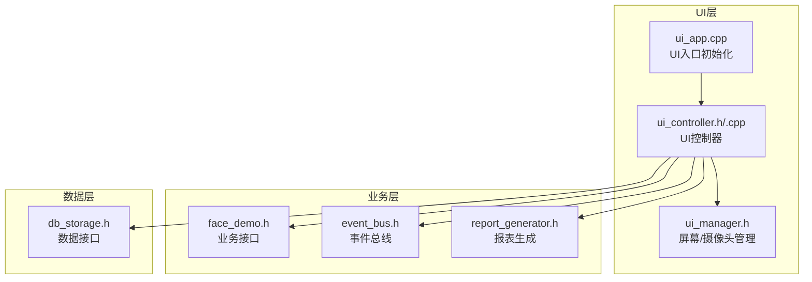
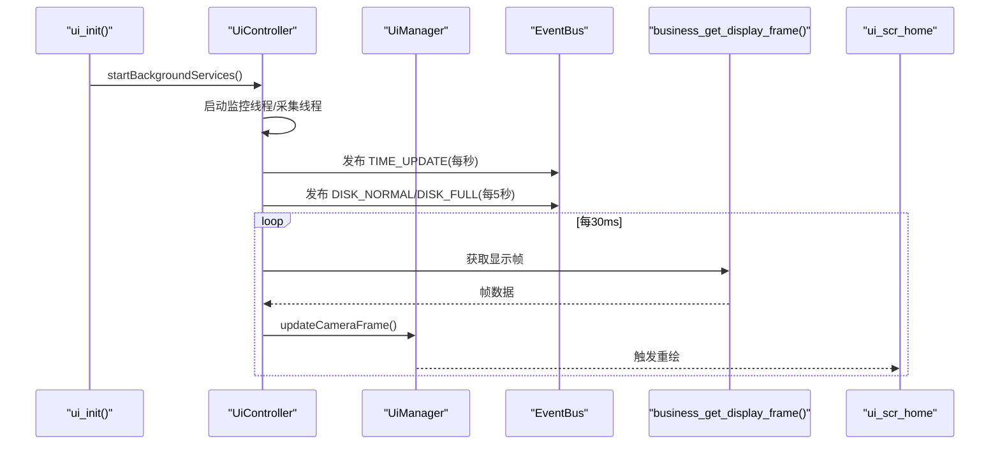
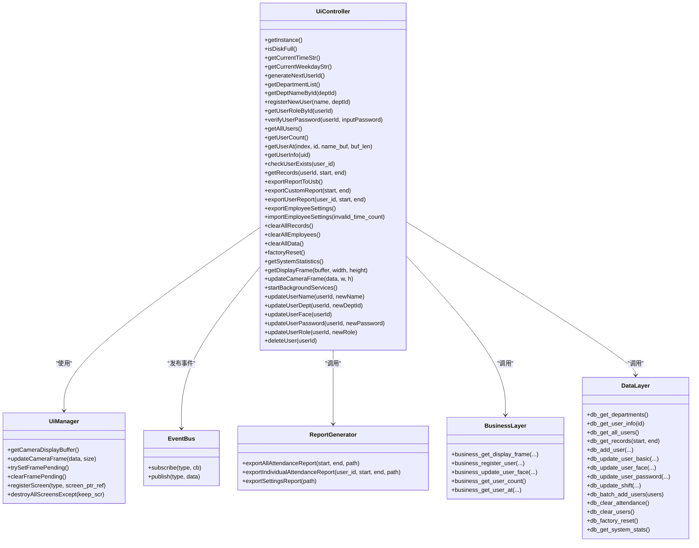

# UI层API接口

<cite>
**本文档引用的文件**
- [src/ui/ui_controller.h](file://src/ui/ui_controller.h)
- [src/ui/ui_controller.cpp](file://src/ui/ui_controller.cpp)
- [src/ui/ui_app.h](file://src/ui/ui_app.h)
- [src/ui/ui_app.cpp](file://src/ui/ui_app.cpp)
- [src/ui/managers/ui_manager.h](file://src/ui/managers/ui_manager.h)
- [src/business/event_bus.h](file://src/business/event_bus.h)
- [src/business/face_demo.h](file://src/business/face_demo.h)
- [src/business/report_generator.h](file://src/business/report_generator.h)
- [src/data/db_storage.h](file://src/data/db_storage.h)
- [src/main.cpp](file://src/main.cpp)
- [src/ui/screens/home/ui_scr_home.h](file://src/ui/screens/home/ui_scr_home.h)
- [src/ui/screens/home/ui_scr_home.cpp](file://src/ui/screens/home/ui_scr_home.cpp)
</cite>

## 目录
1. [简介](#简介)
2. [项目结构](#项目结构)
3. [核心组件](#核心组件)
4. [架构总览](#架构总览)
5. [详细组件分析](#详细组件分析)
6. [依赖关系分析](#依赖关系分析)
7. [性能考虑](#性能考虑)
8. [故障排查指南](#故障排查指南)
9. [结论](#结论)
10. [附录](#附录)

## 简介
本文件面向智能考勤系统的UI层，聚焦UiController类提供的全部公共接口，涵盖系统状态管理、用户管理、记录查询、维护功能、UI线程管理、摄像头帧获取与后台服务启动等能力。文档为每个接口提供参数说明、返回值定义、异常处理机制与最佳实践，并给出调用序列与时序图，帮助开发者快速理解并正确使用UI层API。

## 项目结构
UI层位于src/ui目录，围绕UiController为中心，向上对接LVGL界面与事件总线，向下封装数据层与业务层接口，形成清晰的分层职责：
- UiController：UI层与业务/数据层的适配器，提供统一的API集合
- UiManager：屏幕与摄像头缓冲区管理，负责线程安全的数据共享
- EventBus：系统事件总线，驱动UI状态更新
- 业务层与数据层：提供底层能力（人脸采集、报表生成、数据库访问等）

**图表来源**
- [src/ui/ui_app.cpp:34-94](file://src/ui/ui_app.cpp#L34-L94)
- [src/ui/ui_controller.cpp:380-410](file://src/ui/ui_controller.cpp#L380-L410)
- [src/ui/managers/ui_manager.h:71-156](file://src/ui/managers/ui_manager.h#L71-L156)
- [src/business/event_bus.h:10-43](file://src/business/event_bus.h#L10-L43)
- [src/business/face_demo.h:34-100](file://src/business/face_demo.h#L34-L100)
- [src/business/report_generator.h:31-98](file://src/business/report_generator.h#L31-L98)
- [src/data/db_storage.h:213-683](file://src/data/db_storage.h#L213-L683)

**章节来源**
- [src/ui/ui_app.cpp:34-94](file://src/ui/ui_app.cpp#L34-L94)
- [src/ui/ui_controller.cpp:380-410](file://src/ui/ui_controller.cpp#L380-L410)
- [src/ui/managers/ui_manager.h:71-156](file://src/ui/managers/ui_manager.h#L71-L156)
- [src/business/event_bus.h:10-43](file://src/business/event_bus.h#L10-L43)
- [src/business/face_demo.h:34-100](file://src/business/face_demo.h#L34-L100)
- [src/business/report_generator.h:31-98](file://src/business/report_generator.h#L31-L98)
- [src/data/db_storage.h:213-683](file://src/data/db_storage.h#L213-L683)

## 核心组件
- UiController：单例，封装系统状态、用户管理、记录查询、维护与报表、摄像头帧获取、后台服务启动等接口
- UiManager：管理屏幕生命周期、输入组、摄像头显示缓冲区与帧同步
- EventBus：发布/订阅系统事件（时间更新、磁盘状态、摄像头帧就绪等）
- 业务层与数据层：提供底层能力（用户注册、记录查询、报表导出、数据库事务等）

**章节来源**
- [src/ui/ui_controller.h:21-110](file://src/ui/ui_controller.h#L21-L110)
- [src/ui/managers/ui_manager.h:71-156](file://src/ui/managers/ui_manager.h#L71-L156)
- [src/business/event_bus.h:10-43](file://src/business/event_bus.h#L10-L43)

## 架构总览
UiController作为UI层的统一适配器，向上通过事件总线驱动UI更新，向下封装业务层与数据层接口，同时负责后台线程的启动与管理。摄像头帧通过UiManager的共享缓冲区在UI线程与采集线程之间安全传递。

**图表来源**
- [src/ui/ui_app.cpp:86-92](file://src/ui/ui_app.cpp#L86-L92)
- [src/ui/ui_controller.cpp:380-410](file://src/ui/ui_controller.cpp#L380-L410)
- [src/ui/ui_controller.cpp:658-680](file://src/ui/ui_controller.cpp#L658-L680)
- [src/ui/managers/ui_manager.h:94-103](file://src/ui/managers/ui_manager.h#L94-L103)
- [src/business/face_demo.h:92-100](file://src/business/face_demo.h#L92-L100)
- [src/ui/screens/home/ui_scr_home.cpp:110-121](file://src/ui/screens/home/ui_scr_home.cpp#L110-L121)

## 详细组件分析

### 系统状态管理接口
- isDiskFull()
  - 功能：检查系统剩余空间是否低于阈值（100MB）
  - 参数：无
  - 返回：true表示空间不足，false表示正常
  - 异常：statvfs失败时返回false
  - 使用场景：UI磁盘状态提示
  - 示例：在主页定时器中周期性调用，通过EventBus发布DISK_FULL或DISK_NORMAL事件
  - 性能：O(1)，建议每5秒检查一次

- getCurrentTimeStr()
  - 功能：获取当前时间字符串（HH:MM）
  - 参数：无
  - 返回：形如"14:30"的字符串
  - 异常：本地时间获取失败时行为未定义
  - 使用场景：主页顶部时间显示
  - 示例：监控线程每秒发布TIME_UPDATE事件

- getCurrentWeekdayStr()
  - 功能：获取当前星期字符串（缩写）
  - 参数：无
  - 返回：形如"Mon"的字符串
  - 异常：时间格式化失败时行为未定义
  - 使用场景：主页日期显示
  - 示例：主页Header动态更新

**章节来源**
- [src/ui/ui_controller.cpp:38-67](file://src/ui/ui_controller.cpp#L38-L67)
- [src/ui/ui_controller.cpp:394-410](file://src/ui/ui_controller.cpp#L394-L410)
- [src/ui/screens/home/ui_scr_home.h:16-23](file://src/ui/screens/home/ui_scr_home.h#L16-L23)

### 用户管理接口
- generateNextUserId()
  - 功能：生成下一个可用的用户ID（基于现有最大ID+1）
  - 参数：无
  - 返回：整数ID
  - 异常：无用户时返回1
  - 使用场景：注册新用户时分配ID
  - 示例：注册流程前调用

- getDepartmentList()
  - 功能：获取所有部门列表
  - 参数：无
  - 返回：DeptInfo向量
  - 异常：数据库访问失败时行为未定义
  - 使用场景：注册/编辑用户时选择部门

- getDeptNameById(int deptId)
  - 功能：根据部门ID获取部门名称
  - 参数：deptId
  - 返回：字符串名称
  - 异常：未找到时返回"未知部门"
  - 使用场景：UI显示与报表

- registerNewUser(const std::string& name, int deptId)
  - 功能：注册新用户（调用业务层）
  - 参数：name, deptId
  - 返回：布尔值
  - 异常：业务层失败返回false
  - 使用场景：注册流程

- getUserRoleById(int userId)
  - 功能：获取用户权限（0普通，1管理员，-1未找到）
  - 参数：userId
  - 返回：整数值
  - 异常：用户不存在返回-1
  - 使用场景：菜单权限控制

- verifyUserPassword(int userId, const std::string& inputPassword)
  - 功能：验证用户密码（哈希比对）
  - 参数：userId, inputPassword
  - 返回：布尔值
  - 异常：用户不存在或密码为空返回false
  - 使用场景：登录/权限验证

- getAllUsers()
  - 功能：获取所有用户（不含人脸特征）
  - 参数：无
  - 返回：UserData向量
  - 异常：数据库访问失败时行为未定义
  - 使用场景：用户列表展示

- getUserCount()
  - 功能：获取用户总数
  - 参数：无
  - 返回：整数
  - 异常：业务层失败返回0
  - 使用场景：统计/分页

- getUserAt(int index, int* id, char* name_buf, int buf_len)
  - 功能：按索引获取用户信息
  - 参数：index, id输出指针, name_buf输出缓冲区, buf_len
  - 返回：布尔值
  - 异常：索引越界或缓冲区不足返回false
  - 使用场景：轻量列表渲染

- updateUserName(int userId, const std::string& newName)
  - 功能：更新用户姓名（保留其他字段不变）
  - 参数：userId, newName
  - 返回：布尔值
  - 异常：用户不存在返回false
  - 使用场景：用户信息编辑

- updateUserDept(int userId, int newDeptId)
  - 功能：更新用户部门
  - 参数：userId, newDeptId
  - 返回：布尔值
  - 异常：用户不存在返回false
  - 使用场景：组织架构调整

- updateUserFace(int userId)
  - 功能：更新用户人脸（调用业务层）
  - 参数：userId
  - 返回：布尔值
  - 异常：业务层失败返回false
  - 使用场景：人脸重新录入

- updateUserPassword(int userId, const std::string& newPassword)
  - 功能：更新用户密码（底层接口）
  - 参数：userId, newPassword
  - 返回：布尔值
  - 异常：数据库失败返回false
  - 使用场景：密码修改

- updateUserRole(int userId, int newRole)
  - 功能：更新用户权限
  - 参数：userId, newRole
  - 返回：布尔值
  - 异常：用户不存在返回false
  - 使用场景：权限变更

- deleteUser(int userId)
  - 功能：删除用户（级联删除记录与图片）
  - 参数：userId
  - 返回：布尔值
  - 异常：数据库失败返回false
  - 使用场景：用户注销/清理

- getUserInfo(int uid)
  - 功能：获取用户信息（不存在时返回空对象）
  - 参数：uid
  - 返回：UserData
  - 异常：数据库失败时行为未定义
  - 使用场景：详情展示

- checkUserExists(int user_id)
  - 功能：检查用户是否存在
  - 参数：user_id
  - 返回：布尔值
  - 异常：数据库失败时行为未定义
  - 使用场景：报表导出前校验

**章节来源**
- [src/ui/ui_controller.cpp:69-179](file://src/ui/ui_controller.cpp#L69-L179)
- [src/ui/ui_controller.cpp:233-290](file://src/ui/ui_controller.cpp#L233-L290)
- [src/ui/ui_controller.cpp:155-170](file://src/ui/ui_controller.cpp#L155-L170)
- [src/data/db_storage.h:341-446](file://src/data/db_storage.h#L341-L446)

### 记录查询接口
- getRecords(int userId, time_t start, time_t end)
  - 功能：按时间段查询考勤记录，支持按用户过滤
  - 参数：userId（小于0表示不限制），start/end时间戳
  - 返回：AttendanceRecord向量
  - 异常：数据库失败时行为未定义
  - 使用场景：记录查询/报表导出

- exportCustomReport(const std::string& start, const std::string& end)
  - 功能：导出全员考勤报表至USB模拟目录
  - 参数：start/end日期字符串
  - 返回：布尔值
  - 异常：文件系统异常返回false
  - 使用场景：管理员导出

- exportUserReport(int user_id, const std::string& start, const std::string& end)
  - 功能：导出个人考勤报表
  - 参数：user_id, start/end
  - 返回：布尔值
  - 异常：同上
  - 使用场景：个人/部门导出

- exportReportToUsb()
  - 功能：导出当月全员报表（内部计算起止日期）
  - 参数：无
  - 返回：布尔值
  - 异常：同上
  - 使用场景：一键导出

**章节来源**
- [src/ui/ui_controller.cpp:181-210](file://src/ui/ui_controller.cpp#L181-L210)
- [src/ui/ui_controller.cpp:292-318](file://src/ui/ui_controller.cpp#L292-L318)
- [src/business/report_generator.h:90-98](file://src/business/report_generator.h#L90-L98)

### 维护与报表接口
- exportEmployeeSettings()
  - 功能：导出员工设置表（包含员工与考勤设置两个Sheet）
  - 参数：无
  - 返回：布尔值
  - 异常：文件系统异常返回false
  - 使用场景：备份/迁移

- importEmployeeSettings(int* invalid_time_count)
  - 功能：从U盘xlsx导入员工与班次设置
  - 参数：invalid_time_count（可选，统计时间格式非法字段数）
  - 返回：布尔值（员工表为空时可能返回false但班次写入成功）
  - 异常：文件不存在/解析失败/写入失败时返回false
  - 使用场景：批量导入
  - 处理流程要点：
    - 解压xlsx至临时目录
    - 解析sharedStrings.xml建立索引
    - 解析sheet1.xml提取员工数据（工号/姓名/部门/权限）
    - 解析sheet2.xml提取班次时间并校验合法性
    - 写入数据库（INSERT OR REPLACE）
    - 清理临时目录
  - 性能：涉及文件I/O与正则解析，建议在后台线程执行

- clearAllRecords()
  - 功能：清空所有考勤记录
  - 参数：无
  - 返回：无
  - 使用场景：数据清理

- clearAllEmployees()
  - 功能：清空所有员工
  - 参数：无
  - 返回：无
  - 使用场景：数据清理

- clearAllData()
  - 功能：清空员工与记录（可扩展删除特征文件）
  - 参数：无
  - 返回：无
  - 使用场景：彻底清理

- factoryReset()
  - 功能：恢复出厂设置（清空所有数据）
  - 参数：无
  - 返回：无
  - 使用场景：系统重置

- getSystemStatistics()
  - 功能：查询系统统计信息（员工数、管理员数、人脸/指纹/卡数）
  - 参数：无
  - 返回：SystemStats结构体
  - 使用场景：系统信息展示

**章节来源**
- [src/ui/ui_controller.cpp:363-377](file://src/ui/ui_controller.cpp#L363-L377)
- [src/ui/ui_controller.cpp:419-656](file://src/ui/ui_controller.cpp#L419-L656)
- [src/ui/ui_controller.cpp:340-361](file://src/ui/ui_controller.cpp#L340-L361)
- [src/ui/ui_controller.cpp:334-338](file://src/ui/ui_controller.cpp#L334-L338)
- [src/data/db_storage.h:557-561](file://src/data/db_storage.h#L557-L561)

### UI线程管理与摄像头帧获取
- startBackgroundServices()
  - 功能：启动监控线程与采集线程
  - 参数：无
  - 返回：无
  - 线程行为：
    - 监控线程：每秒发布TIME_UPDATE；每5秒检查磁盘状态并发布DISK_NORMAL/DISK_FULL
    - 采集线程：每30ms从业务层获取帧，更新UiManager显示缓冲区
  - 使用场景：UI启动时调用

- getDisplayFrame(uint8_t* buffer, int width, int height)
  - 功能：从缓存帧拷贝到UI显示缓冲区
  - 参数：目标buffer指针、宽高
  - 返回：布尔值（成功/失败）
  - 异常：无数据或尺寸不匹配返回false
  - 使用场景：主页定时器中拉取最新帧

- updateCameraFrame(const uint8_t* data, int w, int h)
  - 功能：将采集到的帧写入UiManager显示缓冲区
  - 参数：帧数据指针、宽、高
  - 返回：无
  - 使用场景：采集线程回调

- 主页定时器流程（简述）
  - 每帧尝试设置帧待更新标记
  - 从UiController获取最新帧到共享缓冲区
  - 触发lv_obj_invalidate触发重绘
  - 清除帧待更新标记

**章节来源**
- [src/ui/ui_controller.cpp:380-410](file://src/ui/ui_controller.cpp#L380-L410)
- [src/ui/ui_controller.cpp:212-231](file://src/ui/ui_controller.cpp#L212-L231)
- [src/ui/ui_controller.cpp:320-332](file://src/ui/ui_controller.cpp#L320-L332)
- [src/ui/ui_controller.cpp:658-680](file://src/ui/ui_controller.cpp#L658-L680)
- [src/ui/screens/home/ui_scr_home.cpp:110-121](file://src/ui/screens/home/ui_scr_home.cpp#L110-L121)

### API调用最佳实践与性能优化建议
- 事件驱动更新
  - 使用EventBus发布/订阅时间与磁盘状态，避免轮询
  - 监控线程频率：时间1Hz，磁盘5Hz，摄像头30ms
- 线程安全
  - 帧数据通过UiManager的原子标记与互斥锁保护
  - UI线程仅读取共享缓冲区，业务线程写入
- I/O与CPU分离
  - 报表导出与U盘导入在后台线程执行
  - 采集线程与UI线程分离，避免阻塞
- 缓存与懒加载
  - 用户列表与记录查询使用数据库分页与缓存策略
  - 人脸特征按需加载，避免大对象频繁传输
- 错误处理
  - 文件系统异常返回false，UI层据此弹窗提示
  - 磁盘检查失败返回false，避免误报

**章节来源**
- [src/ui/ui_controller.cpp:394-410](file://src/ui/ui_controller.cpp#L394-L410)
- [src/ui/managers/ui_manager.h:88-103](file://src/ui/managers/ui_manager.h#L88-L103)
- [src/business/report_generator.h:90-98](file://src/business/report_generator.h#L90-L98)

## 依赖关系分析
UiController与各模块的依赖关系如下：

**图表来源**
- [src/ui/ui_controller.h:21-110](file://src/ui/ui_controller.h#L21-L110)
- [src/ui/managers/ui_manager.h:71-156](file://src/ui/managers/ui_manager.h#L71-L156)
- [src/business/event_bus.h:23-42](file://src/business/event_bus.h#L23-L42)
- [src/business/report_generator.h:31-98](file://src/business/report_generator.h#L31-L98)
- [src/business/face_demo.h:34-136](file://src/business/face_demo.h#L34-L136)
- [src/data/db_storage.h:213-683](file://src/data/db_storage.h#L213-L683)

**章节来源**
- [src/ui/ui_controller.h:21-110](file://src/ui/ui_controller.h#L21-L110)
- [src/ui/managers/ui_manager.h:71-156](file://src/ui/managers/ui_manager.h#L71-L156)
- [src/business/event_bus.h:23-42](file://src/business/event_bus.h#L23-L42)
- [src/business/report_generator.h:31-98](file://src/business/report_generator.h#L31-L98)
- [src/business/face_demo.h:34-136](file://src/business/face_demo.h#L34-L136)
- [src/data/db_storage.h:213-683](file://src/data/db_storage.h#L213-L683)

## 性能考虑
- 帧率控制：采集线程30ms一帧，UI定时器配合原子标记避免重复绘制
- 数据库访问：查询使用共享锁，批量导入使用事务
- 文件I/O：报表导出与U盘导入在后台线程执行，避免阻塞UI
- 内存拷贝：帧数据采用memcpy，避免额外格式转换
- 事件频率：时间1Hz，磁盘5Hz，摄像头30ms，兼顾实时性与CPU占用

[本节为通用指导，无需列出具体文件来源]

## 故障排查指南
- 磁盘空间不足
  - 现象：UI发布DISK_FULL事件
  - 处理：清理存储或扩容
  - 触发条件：剩余空间<100MB
- 报表导出失败
  - 现象：exportReportToUsb()/exportCustomReport()/exportUserReport()返回false
  - 处理：检查USB模拟目录权限与磁盘空间
- U盘导入失败
  - 现象：importEmployeeSettings返回false
  - 处理：确认xlsx文件存在、格式正确；检查时间格式合法性
- 摄像头无画面
  - 现象：getDisplayFrame返回false或画面空白
  - 处理：确认采集线程已启动、业务层摄像头可用、缓冲区尺寸匹配
- 用户信息异常
  - 现象：getUserInfo返回空对象或checkUserExists返回false
  - 处理：确认用户ID正确、数据库连接正常

**章节来源**
- [src/ui/ui_controller.cpp:394-410](file://src/ui/ui_controller.cpp#L394-L410)
- [src/ui/ui_controller.cpp:212-231](file://src/ui/ui_controller.cpp#L212-L231)
- [src/ui/ui_controller.cpp:419-656](file://src/ui/ui_controller.cpp#L419-L656)

## 结论
UiController提供了完备的UI层API，覆盖系统状态、用户管理、记录查询、维护与报表、摄像头帧获取与后台服务启动等核心能力。通过事件总线与UiManager的协作，实现了UI线程与业务线程的解耦与高效交互。遵循本文档的最佳实践与性能建议，可确保UI层在资源受限环境下稳定运行并提供流畅体验。

[本节为总结性内容，无需列出具体文件来源]

## 附录
- UI入口初始化流程
  - ui_init()负责LVGL/HAL初始化、键盘绑定、管理器初始化与主页加载
  - 启动UiController后台服务，确保事件与帧流正常
- 主页屏幕与定时器
  - 主页定时器每帧尝试获取最新帧并触发重绘
  - 屏幕销毁时清理资源并通知业务层停止识别

**章节来源**
- [src/ui/ui_app.cpp:34-94](file://src/ui/ui_app.cpp#L34-L94)
- [src/ui/screens/home/ui_scr_home.cpp:110-121](file://src/ui/screens/home/ui_scr_home.cpp#L110-L121)
- [src/main.cpp:213-245](file://src/main.cpp#L213-L245)