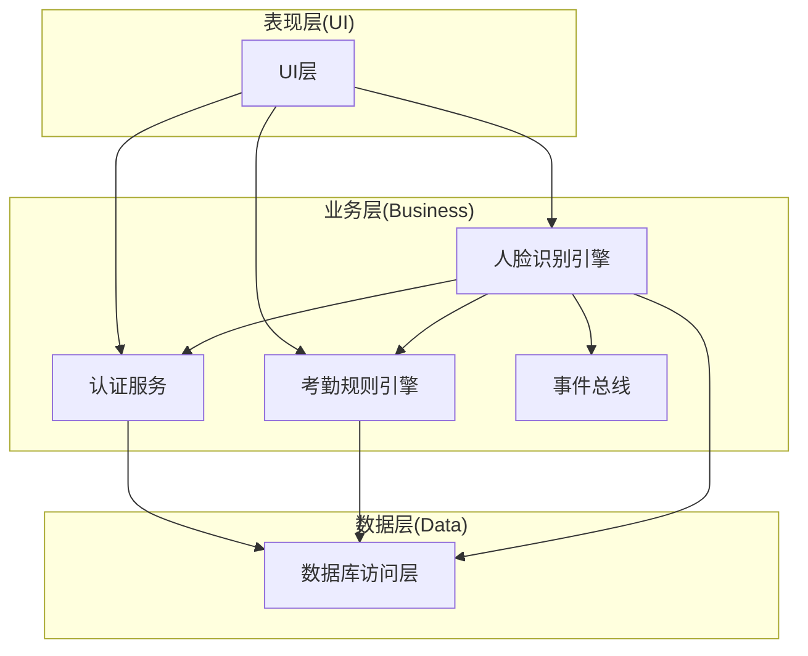
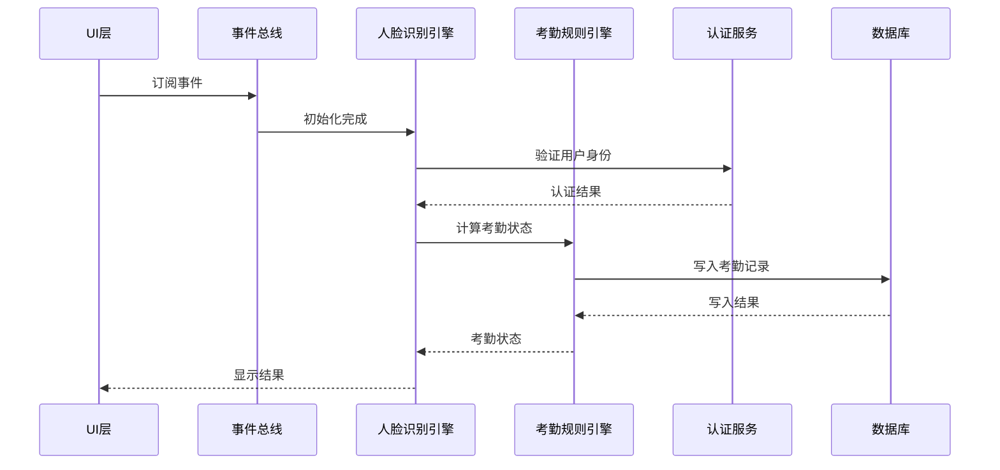
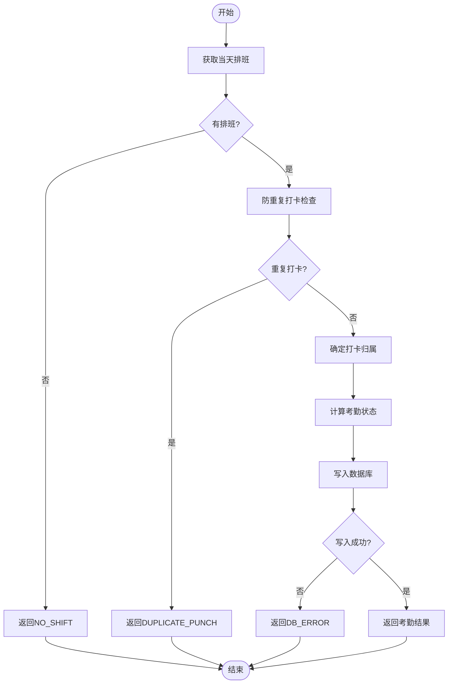
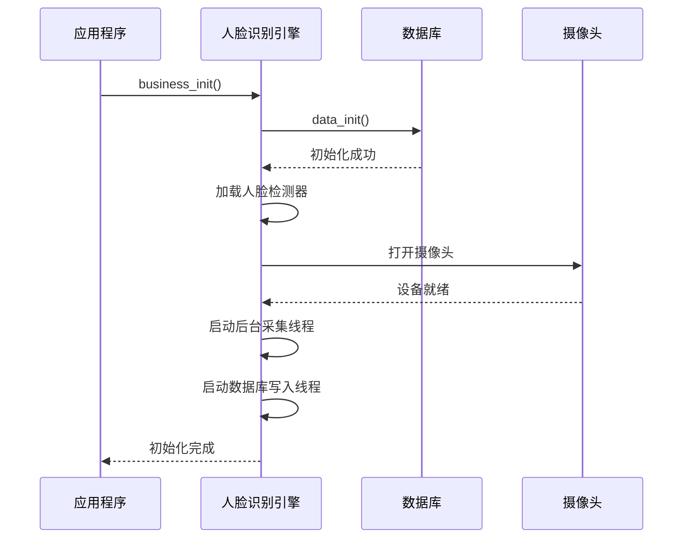
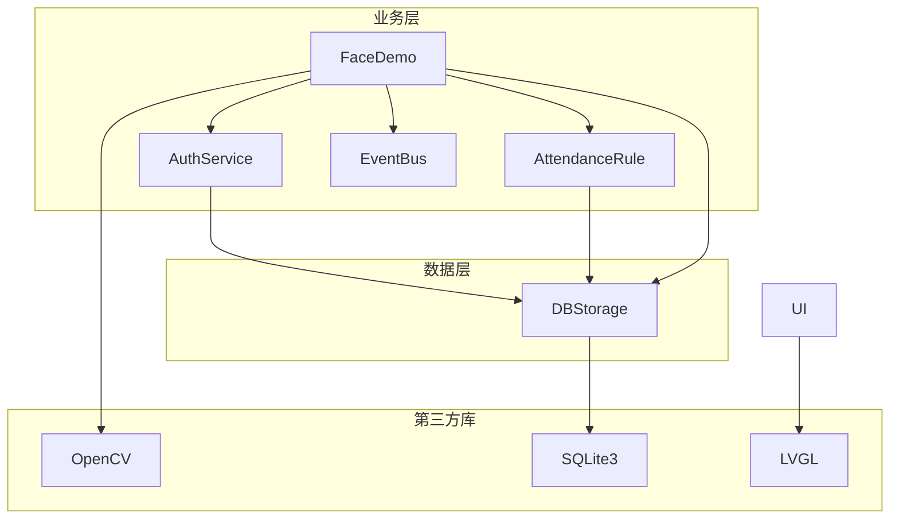
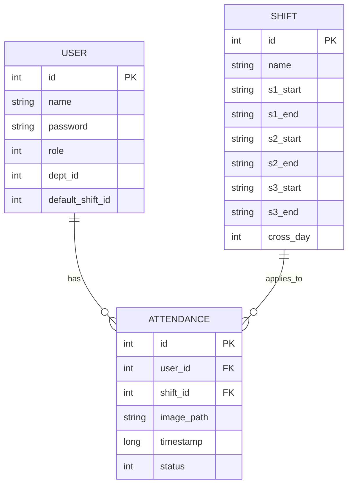

# 业务层API接口

<cite>
**本文档引用的文件**
- [auth_service.h](file://src/business/auth_service.h)
- [auth_service.cpp](file://src/business/auth_service.cpp)
- [attendance_rule.h](file://src/business/attendance_rule.h)
- [attendance_rule.cpp](file://src/business/attendance_rule.cpp)
- [face_demo.h](file://src/business/face_demo.h)
- [face_demo.cpp](file://src/business/face_demo.cpp)
- [event_bus.h](file://src/business/event_bus.h)
- [event_bus.cpp](file://src/business/event_bus.cpp)
- [db_storage.h](file://src/data/db_storage.h)
- [db_storage.cpp](file://src/data/db_storage.cpp)
- [main.cpp](file://src/main.cpp)
</cite>

## 目录
1. [简介](#简介)
2. [项目结构](#项目结构)
3. [核心组件](#核心组件)
4. [架构概览](#架构概览)
5. [详细组件分析](#详细组件分析)
6. [依赖关系分析](#依赖关系分析)
7. [性能考虑](#性能考虑)
8. [故障排除指南](#故障排除指南)
9. [结论](#结论)
10. [附录](#附录)

## 简介
本文件为智能考勤系统的业务层API接口文档，涵盖认证服务、考勤规则计算、人脸识别引擎三大核心业务模块。文档详细说明各API的功能、参数、返回值、算法原理、性能指标、使用示例以及错误处理策略，帮助开发者快速集成和扩展系统功能。

## 项目结构
智能考勤系统采用分层架构设计，业务层位于数据层之上，UI层之下，通过清晰的接口边界实现松耦合设计。



**图表来源**
- [main.cpp:187-246](file://src/main.cpp#L187-L246)
- [face_demo.h:1-212](file://src/business/face_demo.h#L1-L212)
- [auth_service.h:23-44](file://src/business/auth_service.h#L23-L44)
- [attendance_rule.h:43-92](file://src/business/attendance_rule.h#L43-L92)

**章节来源**
- [main.cpp:187-246](file://src/main.cpp#L187-L246)

## 核心组件
本系统包含三个核心业务组件：

### 认证服务模块
- 负责用户身份验证，支持密码验证和指纹验证
- 提供统一的认证结果枚举和错误处理机制
- 与数据层交互获取用户信息和生物特征数据

### 考勤规则引擎
- 实现完整的考勤计算逻辑，包括迟到早退判定、重复打卡防抖
- 支持多时段班次、跨天班次、周末规则等复杂场景
- 提供标准化的考勤状态计算和记录入库

### 人脸识别引擎
- 集成人脸检测、特征提取、身份识别的完整流程
- 支持LBPH人脸识别算法，具备实时处理能力
- 提供预处理配置、训练管理、注册更新等功能

**章节来源**
- [auth_service.h:23-44](file://src/business/auth_service.h#L23-L44)
- [attendance_rule.h:43-92](file://src/business/attendance_rule.h#L43-L92)
- [face_demo.h:8-212](file://src/business/face_demo.h#L8-L212)

## 架构概览
系统采用事件驱动的异步架构，业务层通过事件总线实现模块间的解耦通信。



**图表来源**
- [event_bus.cpp:3-28](file://src/business/event_bus.cpp#L3-L28)
- [face_demo.cpp:557-694](file://src/business/face_demo.cpp#L557-L694)
- [auth_service.cpp:9-37](file://src/business/auth_service.cpp#L9-L37)
- [attendance_rule.cpp:263-342](file://src/business/attendance_rule.cpp#L263-L342)

## 详细组件分析

### 认证服务API

#### 密码验证接口
**函数签名**: `AuthResult verifyPassword(int user_id, const std::string& input_password)`

**功能描述**: 验证用户输入的密码是否正确，支持1:1密码匹配验证。

**参数说明**:
- `user_id`: 用户工号/ID
- `input_password`: 用户输入的密码字符串

**返回值**:
- `SUCCESS`: 验证成功
- `USER_NOT_FOUND`: 用户不存在
- `WRONG_PASSWORD`: 密码错误
- `NO_FEATURE_DATA`: 用户未录入密码
- `DB_ERROR`: 数据库错误

**算法原理**:
1. 从数据库获取用户信息
2. 检查用户是否存在
3. 验证用户是否设置密码
4. 比对输入密码与存储密码

**使用示例**:
```cpp
AuthResult result = AuthService::verifyPassword(1001, "password123");
if (result == AuthResult::SUCCESS) {
    // 处理认证成功逻辑
}
```

**错误处理**:
- 用户不存在时返回`USER_NOT_FOUND`
- 密码不匹配时返回`WRONG_PASSWORD`
- 数据库访问失败时返回`DB_ERROR`

**章节来源**
- [auth_service.h:31](file://src/business/auth_service.h#L31)
- [auth_service.cpp:9-37](file://src/business/auth_service.cpp#L9-L37)

#### 指纹验证接口
**函数签名**: `AuthResult verifyFingerprint(int user_id, const std::vector<uint8_t>& captured_fp_data)`

**功能描述**: 验证用户指纹特征数据，支持1:1指纹匹配验证。

**参数说明**:
- `user_id`: 用户工号/ID
- `captured_fp_data`: 采集到的指纹特征数据

**返回值**:
- `SUCCESS`: 验证成功
- `USER_NOT_FOUND`: 用户不存在
- `WRONG_FINGERPRINT`: 指纹不匹配
- `NO_FEATURE_DATA`: 用户未录入指纹
- `DB_ERROR`: 数据库错误

**算法原理**:
1. 从数据库获取用户指纹特征
2. 执行指纹模板匹配算法
3. 通过阈值判断匹配结果

**注意**: 指纹算法为占位符实现，实际部署需替换为厂商SDK。

**章节来源**
- [auth_service.h:39](file://src/business/auth_service.h#L39)
- [auth_service.cpp:42-69](file://src/business/auth_service.cpp#L42-L69)

### 考勤规则计算API

#### 考勤状态计算接口
**函数签名**: `RecordResult recordAttendance(int user_id, const cv::Mat& image = cv::Mat())`

**功能描述**: 核心考勤记录函数，执行完整的考勤计算流程。

**参数说明**:
- `user_id`: 已验证成功的用户ID
- `image`: 现场抓拍图（可为空）

**返回值**:
- `RECORDED_NORMAL`: 记录成功，状态：正常
- `RECORDED_LATE`: 记录成功，状态：迟到
- `RECORDED_EARLY`: 记录成功，状态：早退
- `RECORDED_ABSENT`: 记录成功，状态：旷工
- `NO_SHIFT`: 当天无排班
- `DUPLICATE_PUNCH`: 防重复打卡
- `DB_ERROR`: 写入数据库失败

**算法流程**:


**图表来源**
- [attendance_rule.cpp:263-342](file://src/business/attendance_rule.cpp#L263-L342)

**章节来源**
- [attendance_rule.h:87](file://src/business/attendance_rule.h#L87)
- [attendance_rule.cpp:263-342](file://src/business/attendance_rule.cpp#L263-L342)

#### 打卡归属判断接口
**函数签名**: `static int determineShiftOwner(time_t punch_timestamp, const ShiftConfig& shift_am, const ShiftConfig& shift_pm)`

**功能描述**: 判断打卡记录归属上午班次还是下午班次，处理12:00-13:00的折中原则。

**算法原理**:
1. 将打卡时间转换为当天分钟数
2. 标准化班次时间（处理跨天情况）
3. 应用折中原则：在模糊时间段内根据距离判断归属

**章节来源**
- [attendance_rule.h:54](file://src/business/attendance_rule.h#L54)
- [attendance_rule.cpp:148-187](file://src/business/attendance_rule.cpp#L148-L187)

#### 时间字符串解析接口
**函数签名**: `static int timeStringToMinutes(const std::string& time_str)`

**功能描述**: 将"HH:MM"格式的时间字符串转换为当天的第N分钟，具备强大的容错能力。

**容错特性**:
- 去除首尾空格（含全角空格）
- 替换全角字符（冒号、句号、中文点）
- 处理无分隔符的纯数字格式
- 校验时间范围合法性

**章节来源**
- [attendance_rule.h:70](file://src/business/attendance_rule.h#L70)
- [attendance_rule.cpp:24-139](file://src/business/attendance_rule.cpp#L24-L139)

### 人脸识别引擎API

#### 初始化接口
**函数签名**: `bool business_init()`

**功能描述**: 初始化人脸识别业务模块，包括加载模型、打开摄像头、启动后台线程。

**初始化流程**:


**图表来源**
- [face_demo.cpp:557-694](file://src/business/face_demo.cpp#L557-L694)

**章节来源**
- [face_demo.h:40](file://src/business/face_demo.h#L40)
- [face_demo.cpp:557-694](file://src/business/face_demo.cpp#L557-L694)

#### 人脸预处理接口
**函数签名**: `cv::Mat preprocess_face_complete(const cv::Mat& input_face, const cv::Rect& face_roi, const PreprocessConfig& config)`

**功能描述**: 完整的人脸预处理流程，包括裁剪、尺寸归一化、直方图均衡化、ROI增强。

**预处理步骤**:
1. **裁剪边界**: 根据裁剪百分比去除边缘噪声
2. **尺寸归一化**: 调整到标准尺寸
3. **直方图均衡化**: 提高对比度
4. **ROI增强**: 增强人脸区域对比度和亮度

**章节来源**
- [face_demo.h:138](file://src/business/face_demo.h#L138)
- [face_demo.cpp:138-165](file://src/business/face_demo.cpp#L138-L165)

#### 用户注册接口
**函数签名**: `bool business_register_user(const char* name, int dept_id)`

**功能描述**: 注册新用户，将当前摄像头画面作为人脸特征数据保存。

**注册流程**:
1. 检查是否有可用摄像头帧
2. 构造用户数据结构
3. 调用数据层接口保存用户信息
4. 更新人脸识别模型
5. 保存模型到磁盘文件

**章节来源**
- [face_demo.h:128](file://src/business/face_demo.h#L128)
- [face_demo.cpp:1111-1187](file://src/business/face_demo.cpp#L1111-L1187)

#### 实时识别接口
**函数签名**: `cv::Mat business_get_frame()`

**功能描述**: 获取处理后的实时视频帧，包含人脸检测、识别和状态显示。

**识别流程**:
1. **人脸检测**: 使用Haar级联分类器检测人脸
2. **特征提取**: 预处理人脸图像
3. **身份识别**: 使用LBPH算法进行身份匹配
4. **状态判断**: 检查重复打卡和计算考勤状态
5. **异步写库**: 将考勤记录推送到写库队列

**章节来源**
- [face_demo.h:803](file://src/business/face_demo.h#L803)
- [face_demo.cpp:803-1014](file://src/business/face_demo.cpp#L803-L1014)

## 依赖关系分析

### 模块依赖图


**图表来源**
- [face_demo.cpp:21-25](file://src/business/face_demo.cpp#L21-L25)
- [db_storage.cpp:7-22](file://src/data/db_storage.cpp#L7-L22)

### 数据结构依赖
系统使用标准化的数据结构进行模块间通信：



**图表来源**
- [db_storage.h:130-202](file://src/data/db_storage.h#L130-L202)

**章节来源**
- [db_storage.h:16-683](file://src/data/db_storage.h#L16-L683)

## 性能考虑

### 并发处理机制
系统采用多线程架构确保高性能处理：

1. **后台采集线程**: 持续采集和处理视频帧
2. **数据库写入线程**: 异步写入考勤记录，避免阻塞主线程
3. **读写锁机制**: SQLite数据库采用共享锁和排他锁分离

### 性能优化策略
- **跳帧处理**: 每5帧检测一次，提高处理效率
- **预编译SQL**: 缓存高频使用的SQL语句
- **内存池管理**: 避免频繁内存分配
- **异步队列**: 使用条件变量实现高效的线程间通信

### 资源管理
- **RAII封装**: 使用智能指针管理数据库连接
- **自动清理**: 定期清理过期的打卡图片
- **线程安全**: 所有共享资源使用互斥锁保护

## 故障排除指南

### 常见错误类型

#### 认证相关错误
- **USER_NOT_FOUND**: 检查用户ID是否正确，确认用户已在数据库中注册
- **WRONG_PASSWORD**: 验证密码长度和格式，确认数据库中存储的密码
- **WRONG_FINGERPRINT**: 检查指纹采集质量，确认指纹模板完整性

#### 考勤计算错误
- **NO_SHIFT**: 检查用户的排班设置，确认当天是否有排班
- **DUPLICATE_PUNCH**: 调整防重复打卡时间阈值
- **DB_ERROR**: 检查数据库连接状态和磁盘空间

#### 人脸识别错误
- **模型加载失败**: 确认模型文件存在且格式正确
- **摄像头无法打开**: 检查设备权限和驱动程序
- **识别准确率低**: 调整预处理参数和识别阈值

### 调试方法
1. **启用调试日志**: 查看控制台输出的详细状态信息
2. **监控线程状态**: 确认所有后台线程正常运行
3. **检查数据库状态**: 验证表结构和索引完整性
4. **性能分析**: 使用性能分析工具识别瓶颈

**章节来源**
- [face_demo.cpp:537-548](file://src/business/face_demo.cpp#L537-L548)
- [db_storage.cpp:121-129](file://src/data/db_storage.cpp#L121-L129)

## 结论
智能考勤系统的业务层API设计合理，实现了认证、考勤计算、人脸识别的完整功能链。通过模块化的架构设计和完善的错误处理机制，系统具备良好的可扩展性和维护性。开发者可以根据具体需求定制认证方式、调整考勤规则、优化人脸识别参数，以满足不同场景的应用需求。

## 附录

### API扩展指南

#### 自定义认证方式集成
1. **实现认证接口**: 在AuthService中添加新的认证方法
2. **更新认证结果枚举**: 添加新的认证结果类型
3. **集成生物特征**: 支持指纹、人脸、虹膜等多模态认证
4. **配置管理**: 通过配置文件控制认证方式的选择

#### 考勤规则扩展
1. **新增状态类型**: 在PunchStatus中添加新的考勤状态
2. **自定义阈值**: 支持灵活的迟到早退阈值配置
3. **加班计算**: 实现加班时长的自动计算
4. **统计报表**: 提供丰富的考勤统计和报表功能

#### 人脸识别优化
1. **算法替换**: 支持更先进的人脸识别算法
2. **预处理优化**: 调整图像预处理参数提升识别准确率
3. **模型训练**: 支持在线模型训练和增量学习
4. **多相机支持**: 实现多摄像头协同识别

### 配置参数参考

#### 认证服务配置
- **密码长度**: 1-6位字符
- **指纹阈值**: 默认80分（可根据设备调整）
- **认证超时**: 30秒

#### 考勤规则配置
- **迟到阈值**: 默认15分钟
- **防重复打卡**: 默认3分钟
- **跨天班次**: 支持22:00-06:00等跨天班次

#### 人脸识别配置
- **检测阈值**: 默认100分
- **预处理参数**: 可调节的直方图均衡化参数
- **训练样本**: 至少2张高质量人脸图像