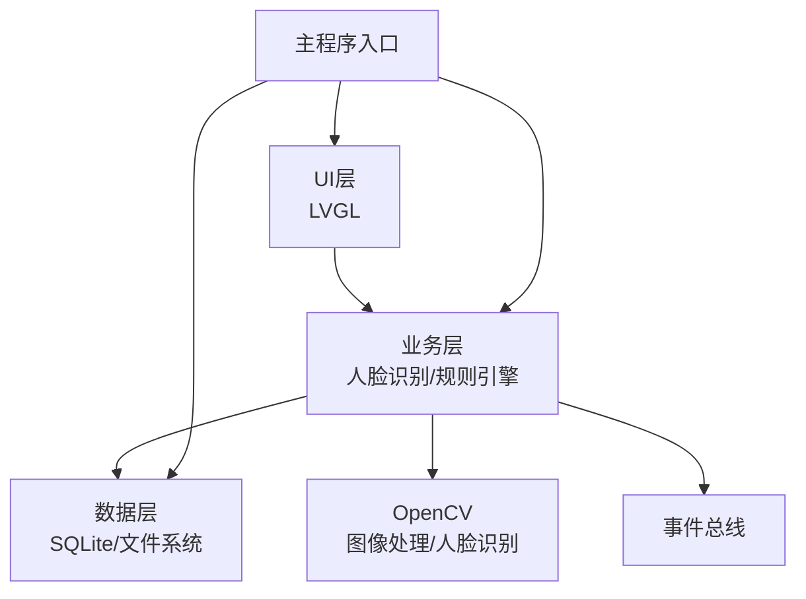
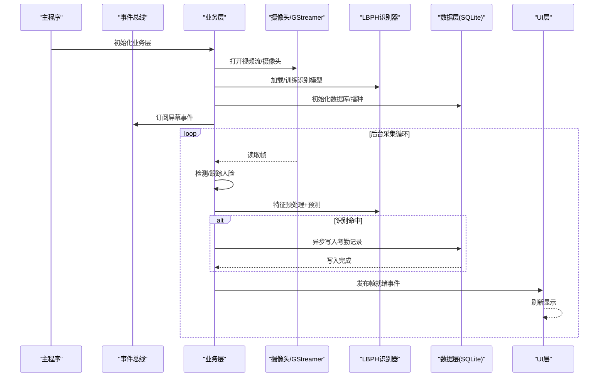
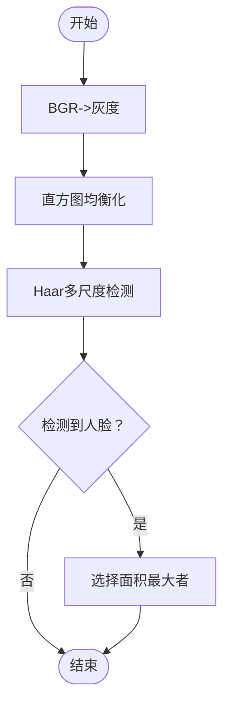
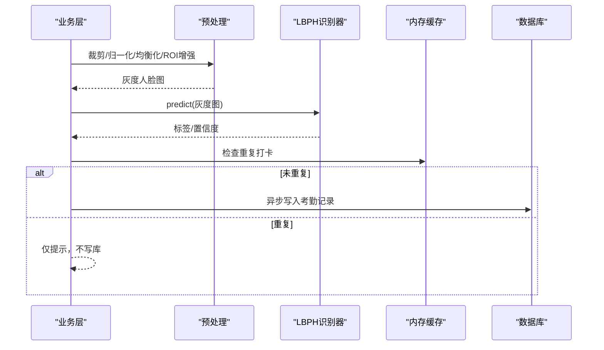
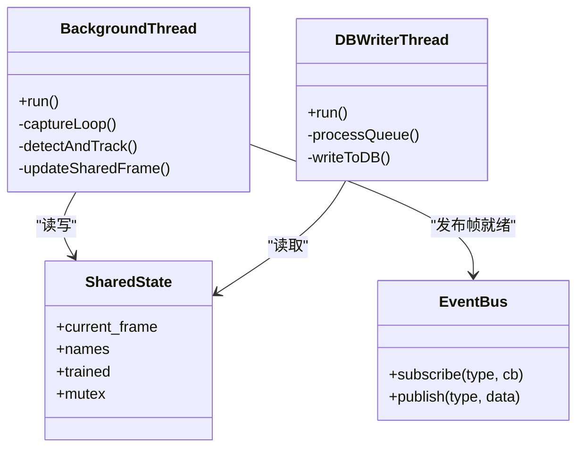
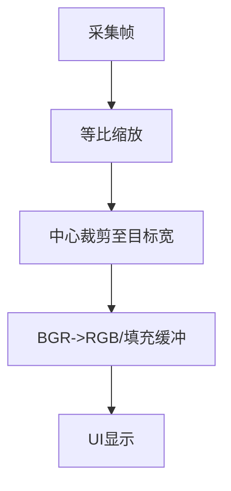
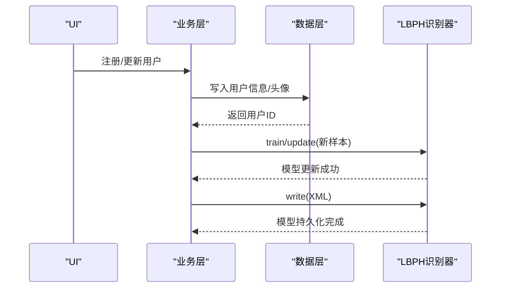
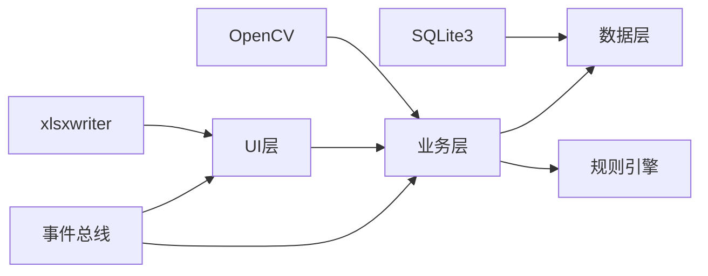

# 人脸识别引擎API

<cite>
**本文档引用的文件**
- [CMakeLists.txt](file://CMakeLists.txt)
- [face_demo.h](file://src/business/face_demo.h)
- [face_demo.cpp](file://src/business/face_demo.cpp)
- [db_storage.h](file://src/data/db_storage.h)
- [db_storage.cpp](file://src/data/db_storage.cpp)
- [attendance_rule.h](file://src/business/attendance_rule.h)
- [ui_controller.h](file://src/ui/ui_controller.h)
- [event_bus.h](file://src/business/event_bus.h)
- [main.cpp](file://src/main.cpp)
- [lv_conf.h](file://lv_conf.h)
</cite>

## 目录
1. [简介](#简介)
2. [项目结构](#项目结构)
3. [核心组件](#核心组件)
4. [架构总览](#架构总览)
5. [详细组件分析](#详细组件分析)
6. [依赖关系分析](#依赖关系分析)
7. [性能考量](#性能考量)
8. [故障排查指南](#故障排查指南)
9. [结论](#结论)
10. [附录](#附录)

## 简介
本文件面向人脸识别引擎API的专业接口文档，基于仓库中的SmartAttendance项目，系统性梳理人脸检测、特征提取与匹配、多线程并发处理、摄像头采集与图像质量优化、人脸库管理与模板更新、批量导入、错误处理与调试方法，以及算法性能调优与硬件兼容性最佳实践。文档旨在帮助开发者快速理解并正确集成与扩展人脸识别能力。

## 项目结构
项目采用分层架构：UI层（LVGL）、业务层（人脸识别与考勤规则）、数据层（SQLite + OpenCV）。CMake负责依赖发现与链接，OpenCV提供图像处理与人脸识别算法，SQLite负责结构化数据持久化。

图表来源
- [main.cpp:187-246](file://src/main.cpp#L187-L246)
- [face_demo.cpp:557-694](file://src/business/face_demo.cpp#L557-L694)
- [db_storage.cpp:133-161](file://src/data/db_storage.cpp#L133-L161)

章节来源
- [CMakeLists.txt:28-31](file://CMakeLists.txt#L28-L31)
- [main.cpp:202-225](file://src/main.cpp#L202-L225)

## 核心组件
- 业务层接口（face_demo.*）：提供人脸检测、预处理、识别、注册/更新用户、获取显示帧、配置管理等接口。
- 数据层接口（db_storage.*）：提供用户、班次、部门、考勤记录的CRUD与批量导入、事务、统计等接口。
- 规则引擎（attendance_rule.h）：提供考勤状态计算、折中归属判断等。
- UI控制器（ui_controller.h）：封装UI侧调用业务层与数据层的便捷接口。
- 事件总线（event_bus.h）：用于跨模块解耦的事件发布/订阅。
- 主程序（main.cpp）：系统初始化、线程启动、主循环与资源回收。

章节来源
- [face_demo.h:34-212](file://src/business/face_demo.h#L34-L212)
- [db_storage.h:213-683](file://src/data/db_storage.h#L213-L683)
- [attendance_rule.h:43-92](file://src/business/attendance_rule.h#L43-L92)
- [ui_controller.h:21-110](file://src/ui/ui_controller.h#L21-L110)
- [event_bus.h:23-43](file://src/business/event_bus.h#L23-L43)

## 架构总览
人脸识别引擎API围绕“采集-检测-预处理-识别-落库-展示”的闭环设计，采用多线程分离采集与识别、数据库写入异步化，保障实时性与稳定性。

图表来源
- [face_demo.cpp:291-549](file://src/business/face_demo.cpp#L291-L549)
- [face_demo.cpp:246-285](file://src/business/face_demo.cpp#L246-L285)
- [db_storage.cpp:133-161](file://src/data/db_storage.cpp#L133-L161)
- [event_bus.h:23-43](file://src/business/event_bus.h#L23-L43)

## 详细组件分析

### 人脸检测接口
- 接口职责
  - 使用Haar级联分类器在灰度图上检测人脸，返回最大人脸矩形。
  - 支持跳帧检测与跟踪，降低CPU负载。
- 算法原理
  - 输入：BGR帧；内部转灰度并直方图均衡化；使用detectMultiScale进行多尺度检测；选择面积最大的候选作为最终结果。
- 性能与精度
  - 通过跳帧（每5帧检测1次）与跟踪（丢失时沿用上一帧结果）平衡精度与性能。
  - 检测参数（缩放因子、最小邻居、最小尺寸）在实现中固定，便于稳定运行。
- 并发与资源
  - 采集线程负责读取帧与检测，识别与落库在独立线程完成，避免UI阻塞。

图表来源
- [face_demo.cpp:193-202](file://src/business/face_demo.cpp#L193-L202)

章节来源
- [face_demo.cpp:193-202](file://src/business/face_demo.cpp#L193-L202)
- [face_demo.cpp:291-378](file://src/business/face_demo.cpp#L291-L378)

### 特征提取与匹配接口
- 接口职责
  - 预处理人脸ROI：裁剪边界、尺寸归一化、直方图均衡化、ROI对比度/亮度增强。
  - 使用LBPH识别器进行预测，返回标签与置信度。
- 数据格式
  - 预处理输出：灰度图（适配LBPH）。
  - 模型：XML文件（训练后持久化）。
- 相似度阈值与误检控制
  - 置信度阈值：实现中使用固定阈值（例如100.0）进行识别有效性判断。
  - 重复打卡防抖：内存缓存+数据库查询双重去重，设定最小间隔（例如60秒）。
- 多线程与并发
  - 识别线程与数据库写线程分离，识别结果通过队列异步写库，避免阻塞。

图表来源
- [face_demo.cpp:390-499](file://src/business/face_demo.cpp#L390-L499)
- [face_demo.cpp:468-478](file://src/business/face_demo.cpp#L468-L478)

章节来源
- [face_demo.cpp:138-165](file://src/business/face_demo.cpp#L138-L165)
- [face_demo.cpp:390-499](file://src/business/face_demo.cpp#L390-L499)
- [face_demo.cpp:468-478](file://src/business/face_demo.cpp#L468-L478)

### 多线程人脸识别并发机制与资源管理
- 线程分工
  - 后台采集线程：持续读取帧、检测/跟踪、绘制标注、更新共享帧缓存。
  - 数据库写线程：从队列取出任务，串行写库，异常捕获不中断。
- 同步与锁
  - 采集线程与UI线程共享帧：使用互斥锁保护，缩短临界区，UI侧仅拷贝读取。
  - 名称映射与模型更新：使用互斥锁保护全局结构。
- 资源管理
  - 线程生命周期：原子标志控制，优雅退出并通过条件变量唤醒。
  - 队列容量限制：防止内存暴涨，必要时丢弃新任务。
  - 模型持久化：训练完成后保存XML，启动时优先加载。

图表来源
- [face_demo.cpp:291-549](file://src/business/face_demo.cpp#L291-L549)
- [face_demo.cpp:246-285](file://src/business/face_demo.cpp#L246-L285)
- [event_bus.h:23-43](file://src/business/event_bus.h#L23-L43)

章节来源
- [face_demo.cpp:291-549](file://src/business/face_demo.cpp#L291-L549)
- [face_demo.cpp:246-285](file://src/business/face_demo.cpp#L246-L285)

### 摄像头采集接口与图像质量优化
- 采集源
  - 支持GStreamer SDP管道（硬编码参数），兼容YCbCr-4:2:2格式，自动转换为BGR。
  - 读取失败时具备重连与强制释放逻辑，避免卡死。
- 帧率控制
  - 采集线程睡眠15ms，配合跳帧策略（每5帧检测1次）与UI刷新限流（约60FPS），兼顾识别精度与UI流畅度。
- 图像质量优化
  - 预处理配置：裁剪边界、尺寸归一化、直方图均衡化（全局/CLAHE）、ROI增强（对比度/亮度）。
  - UI显示帧：等比缩放+中心裁剪，保证240x260显示比例与清晰度。

图表来源
- [face_demo.cpp:1024-1068](file://src/business/face_demo.cpp#L1024-L1068)

章节来源
- [face_demo.cpp:223-240](file://src/business/face_demo.cpp#L223-L240)
- [face_demo.cpp:314-344](file://src/business/face_demo.cpp#L314-L344)
- [face_demo.cpp:1024-1068](file://src/business/face_demo.cpp#L1024-L1068)

### 人脸库管理、模板更新与批量导入
- 人脸库管理
  - 注册新用户：使用当前帧作为特征，写入数据库并增量更新识别模型，保存XML。
  - 更新用户人脸：替换用户头像特征，增量更新模型并持久化。
  - 用户列表与缓存：启动时加载用户基础信息，供UI列表使用。
- 模板更新
  - 首次启动：尝试加载本地XML模型；失败则全量训练并保存。
  - 增量更新：对已有用户追加新样本，无需重新训练整库。
- 批量导入
  - 提供批量导入接口，使用事务加速，支持覆盖更新与新增。

图表来源
- [face_demo.cpp:1111-1187](file://src/business/face_demo.cpp#L1111-L1187)
- [face_demo.cpp:1194-1245](file://src/business/face_demo.cpp#L1194-L1245)
- [db_storage.h:341-446](file://src/data/db_storage.h#L341-L446)

章节来源
- [face_demo.cpp:597-694](file://src/business/face_demo.cpp#L597-L694)
- [face_demo.cpp:1111-1187](file://src/business/face_demo.cpp#L1111-L1187)
- [face_demo.cpp:1194-1245](file://src/business/face_demo.cpp#L1194-L1245)
- [db_storage.h:341-446](file://src/data/db_storage.h#L341-L446)

### 考勤规则与状态计算
- 规则引擎
  - 根据用户绑定班次或智能匹配（AM/PM）确定归属，计算迟到/早退/正常/缺卡。
  - 支持跨天班次与周末规则（节点K）。
- 与识别联动
  - 识别成功后，按规则计算状态并异步写库，UI即时反馈。

章节来源
- [attendance_rule.h:43-92](file://src/business/attendance_rule.h#L43-L92)
- [face_demo.cpp:845-990](file://src/business/face_demo.cpp#L845-L990)

## 依赖关系分析
- 外部依赖
  - OpenCV：图像处理、人脸检测（objdetect/face）、视频采集（videoio）。
  - SQLite3：结构化数据存储。
  - xlsxwriter：报表导出（用于UI侧）。
- 内部依赖
  - 业务层依赖数据层与规则引擎；UI通过控制器间接调用业务层；事件总线贯穿各模块。

图表来源
- [CMakeLists.txt:28-37](file://CMakeLists.txt#L28-L37)
- [face_demo.cpp:557-694](file://src/business/face_demo.cpp#L557-L694)
- [db_storage.cpp:133-161](file://src/data/db_storage.cpp#L133-L161)

章节来源
- [CMakeLists.txt:28-37](file://CMakeLists.txt#L28-L37)

## 性能考量
- 识别性能
  - 跳帧检测与跟踪：每5帧检测1次，显著降低CPU占用。
  - UI刷新限流：约60FPS，避免过度绘制。
  - 预处理优化：CLAHE与ROI增强在保证识别效果的同时控制计算成本。
- 数据库性能
  - WAL模式、NORMAL同步、内存临时表、缓存大小调整，提升并发读写效率。
  - 写库异步化：队列+消费者线程，避免主线程阻塞。
- 线程与锁
  - 缩短临界区，UI侧仅拷贝共享帧；识别与写库分离，提高吞吐。
- 硬件兼容性
  - GStreamer SDP硬编码参数适配常见设备；支持YCbCr-4:2:2到BGR转换。
  - LVGL配置可按平台调整，满足嵌入式显示需求。

章节来源
- [face_demo.cpp:291-378](file://src/business/face_demo.cpp#L291-L378)
- [face_demo.cpp:246-285](file://src/business/face_demo.cpp#L246-L285)
- [db_storage.cpp:148-160](file://src/data/db_storage.cpp#L148-L160)
- [lv_conf.h:90-96](file://lv_conf.h#L90-L96)

## 故障排查指南
- 无法加载模型/训练失败
  - 现象：启动时模型加载失败，回退全量训练。
  - 处理：检查模型文件完整性与权限；确认训练样本路径有效。
- 识别命中但未写库
  - 现象：识别成功但无考勤记录。
  - 处理：检查重复打卡防抖（内存缓存+数据库）；确认队列未满；查看数据库写线程日志。
- UI无画面/卡顿
  - 现象：UI无预览或掉帧。
  - 处理：检查采集线程是否存活；确认UI刷新限流参数；检查GStreamer管道参数与设备连接。
- 数据库写入异常
  - 现象：写库线程抛异常但进程不崩溃。
  - 处理：查看异常捕获日志；检查磁盘空间与权限；确认WAL模式配置。
- 模型更新后识别失效
  - 现象：新增用户后无法识别。
  - 处理：确认增量更新成功；检查模型保存与加载流程；核对标签映射。

章节来源
- [face_demo.cpp:610-629](file://src/business/face_demo.cpp#L610-L629)
- [face_demo.cpp:468-478](file://src/business/face_demo.cpp#L468-L478)
- [face_demo.cpp:246-285](file://src/business/face_demo.cpp#L246-L285)
- [db_storage.cpp:148-160](file://src/data/db_storage.cpp#L148-L160)

## 结论
本项目的人脸识别引擎API以OpenCV与SQLite为核心，结合多线程与异步写库策略，在保证识别精度的同时实现了良好的实时性与稳定性。通过可配置的预处理链路、完善的重复打卡防抖与规则引擎，满足企业级考勤场景的需求。建议在部署时关注GStreamer参数、模型持久化与数据库性能调优，并结合硬件能力合理设置跳帧与UI刷新策略。

## 附录

### API清单与说明
- 业务层初始化与退出
  - 初始化：加载Haar模型、打开视频源、初始化LBPH、加载/训练模型、启动后台线程。
  - 退出：停止采集与写库线程，释放资源。
- 摄像头与显示
  - 获取显示帧：将最新帧缩放并转换为RGB24/32，供UI渲染。
  - 事件：屏幕进入/离开时控制识别开关。
- 识别控制
  - 开关控制：动态开启/关闭识别。
  - 预处理配置：裁剪、尺寸归一化、直方图均衡化（全局/CLAHE）、ROI增强。
- 用户管理
  - 注册/更新用户：使用当前帧作为特征，写入数据库并更新模型。
  - 用户列表：加载基础信息，供UI列表使用。
- 考勤记录
  - 查询与格式化：加载最近记录，格式化输出。
  - 异步写库：识别成功后推送到队列，消费者线程串行写库。

章节来源
- [face_demo.h:34-212](file://src/business/face_demo.h#L34-L212)
- [face_demo.cpp:557-694](file://src/business/face_demo.cpp#L557-L694)
- [face_demo.cpp:1024-1068](file://src/business/face_demo.cpp#L1024-L1068)
- [face_demo.cpp:1111-1187](file://src/business/face_demo.cpp#L1111-L1187)
- [face_demo.cpp:1194-1245](file://src/business/face_demo.cpp#L1194-L1245)
- [face_demo.cpp:1256-1303](file://src/business/face_demo.cpp#L1256-L1303)