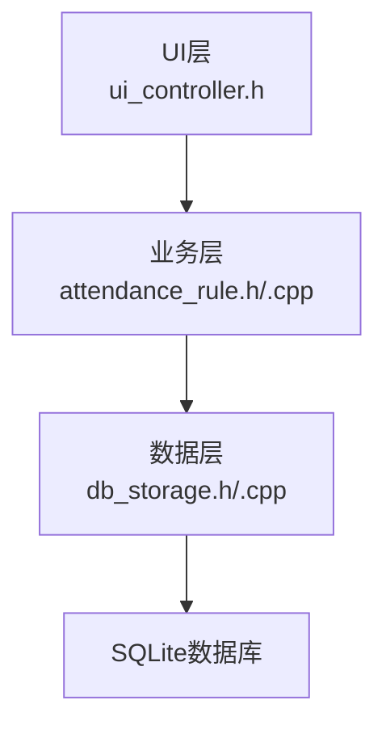
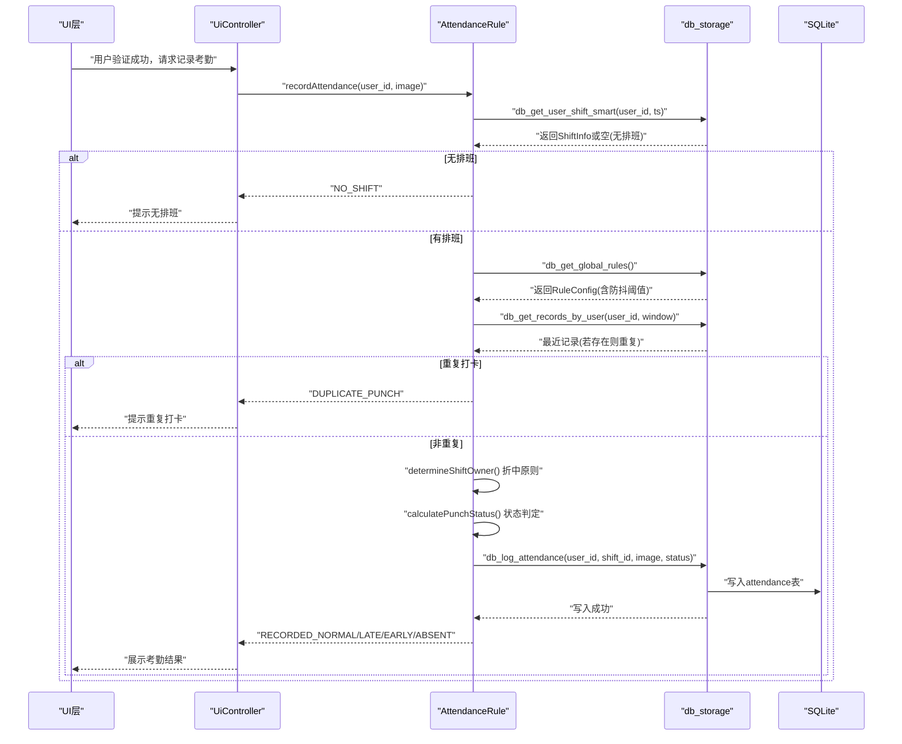
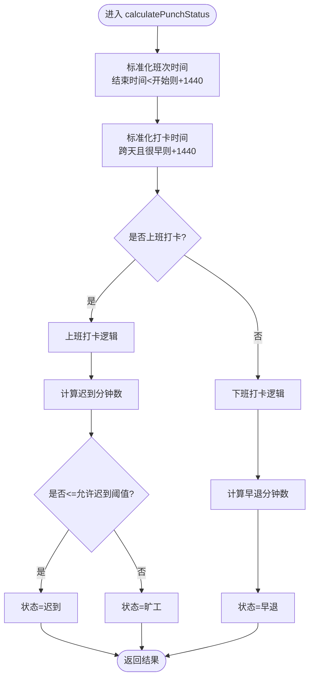
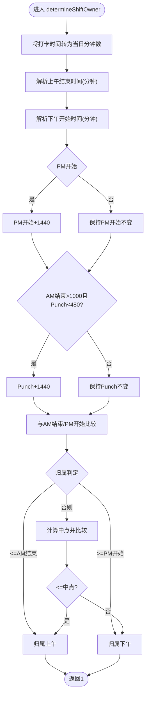
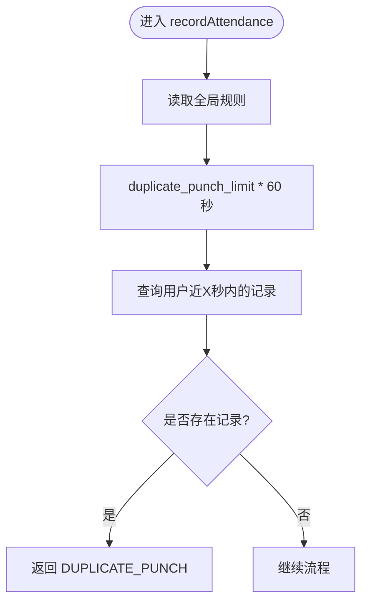
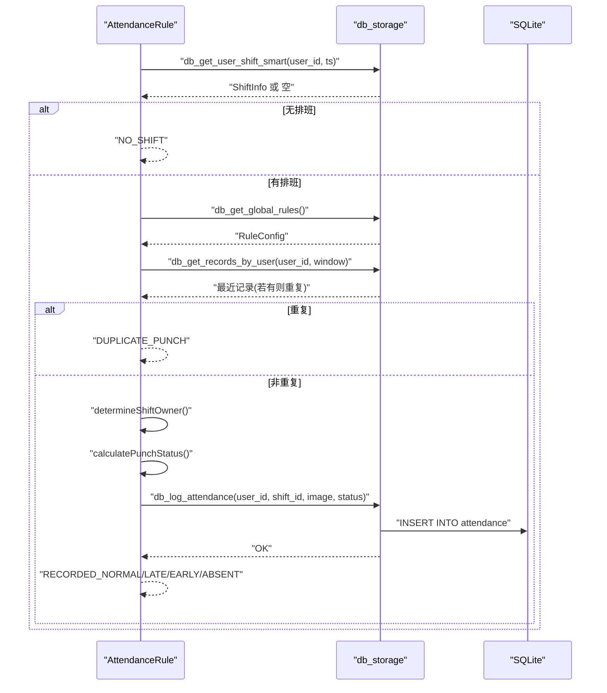
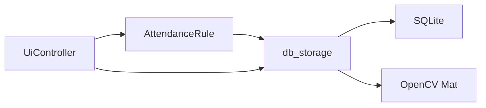

# 考勤规则API

<cite>
**本文引用的文件**
- [attendance_rule.cpp](file://src/business/attendance_rule.cpp)
- [attendance_rule.h](file://src/business/attendance_rule.h)
- [db_storage.cpp](file://src/data/db_storage.cpp)
- [db_storage.h](file://src/data/db_storage.h)
- [ui_controller.h](file://src/ui/ui_controller.h)
</cite>

## 目录
1. [简介](#简介)
2. [项目结构](#项目结构)
3. [核心组件](#核心组件)
4. [架构总览](#架构总览)
5. [详细组件分析](#详细组件分析)
6. [依赖关系分析](#依赖关系分析)
7. [性能考量](#性能考量)
8. [故障排查指南](#故障排查指南)
9. [结论](#结论)
10. [附录](#附录)

## 简介
本文件面向“考勤规则计算API”的使用者与维护者，系统性梳理考勤状态计算的核心算法、重复打卡防抖机制、考勤记录生成接口、班次配置与时间窗口、节假日处理、以及可扩展的自定义规则与业务适配方法。文档以循序渐进的方式呈现，既适合初学者理解，也为高级用户提供深入的技术细节与优化建议。

## 项目结构
本项目采用分层架构：UI层通过控制器封装调用业务层，业务层调用数据层完成数据库操作与规则计算；核心考勤规则位于业务层，数据层提供完整的DAO接口与SQLite性能优化。

图表来源
- [ui_controller.h:21-110](file://src/ui/ui_controller.h#L21-L110)
- [attendance_rule.h:43-92](file://src/business/attendance_rule.h#L43-L92)
- [db_storage.h:213-683](file://src/data/db_storage.h#L213-L683)

章节来源
- [ui_controller.h:21-110](file://src/ui/ui_controller.h#L21-L110)
- [db_storage.h:213-683](file://src/data/db_storage.h#L213-L683)

## 核心组件
- 考勤规则引擎：负责将打卡时间映射到班次、计算迟到/早退/旷工状态、执行重复打卡防抖、生成考勤记录。
- 数据访问层：提供班次、用户、规则、节假日、排班等DAO接口，内置SQLite性能优化与并发控制。
- UI控制器：封装业务调用，为界面提供统一的API入口。

章节来源
- [attendance_rule.h:43-92](file://src/business/attendance_rule.h#L43-L92)
- [db_storage.h:213-683](file://src/data/db_storage.h#L213-L683)

## 架构总览
考勤规则API的调用链路如下：UI层触发验证与识别后，业务层调用数据层获取排班与规则，执行规则计算，最终写入数据库并返回语义化结果。

图表来源
- [attendance_rule.cpp:263-342](file://src/business/attendance_rule.cpp#L263-L342)
- [db_storage.cpp:599-657](file://src/data/db_storage.cpp#L599-L657)
- [db_storage.cpp:458-458](file://src/data/db_storage.cpp#L458-L458)

章节来源
- [attendance_rule.cpp:263-342](file://src/business/attendance_rule.cpp#L263-L342)
- [db_storage.cpp:599-657](file://src/data/db_storage.cpp#L599-L657)

## 详细组件分析

### 考勤状态计算核心算法
- 输入：打卡时间戳、目标班次配置、是否上班打卡。
- 输出：状态（正常/迟到/早退/旷工）与差异分钟数。
- 关键逻辑：
  - 标准化班次时间：若结束时间小于开始时间，视为跨天，结束时间+1440分钟。
  - 标准化打卡时间：若班次跨天且打卡时间很早，则将打卡时间+1440分钟，保证正确比较。
  - 上班打卡：在开始时间之前或准点为正常；否则计算迟到分钟数并与“允许迟到阈值”比较，超过阈值为旷工，否则为迟到。
  - 下班打卡：在结束时间之后或准点为正常；否则为早退，记录早退分钟数。
  - 状态优先级：正常优先于迟到，迟到优先于早退，早退优先于旷工。

图表来源
- [attendance_rule.cpp:192-256](file://src/business/attendance_rule.cpp#L192-L256)

章节来源
- [attendance_rule.cpp:192-256](file://src/business/attendance_rule.cpp#L192-L256)

### 打卡归属判定（折中原则）
当打卡时间处于上午下班与下午上班之间的时间窗时，采用“折中原则”决定归属上午还是下午：
- 计算上午结束时间与下午开始时间的中点，若打卡时间落在中点左侧归上午，右侧归下午。
- 跨天场景：若下午开始时间早于上午结束时间，下午开始时间+1440；若打卡时间很早且上午结束时间很大，打卡时间也+1440，确保正确比较。

图表来源
- [attendance_rule.cpp:148-187](file://src/business/attendance_rule.cpp#L148-L187)

章节来源
- [attendance_rule.cpp:148-187](file://src/business/attendance_rule.cpp#L148-L187)

### 重复打卡防抖机制
- 规则来源：全局规则表中的“重复打卡限制时间（分钟）”，转换为秒参与窗口计算。
- 窗口策略：在当前时间向前推“限制分钟数×60秒”的时间窗口内，查询该用户是否有记录。
- 命中即阻断：若窗口内存在记录，直接返回“重复打卡”语义结果，不再继续计算与入库。

图表来源
- [attendance_rule.cpp:283-290](file://src/business/attendance_rule.cpp#L283-L290)
- [db_storage.cpp:599-657](file://src/data/db_storage.cpp#L599-L657)

章节来源
- [attendance_rule.cpp:283-290](file://src/business/attendance_rule.cpp#L283-L290)
- [db_storage.cpp:599-657](file://src/data/db_storage.cpp#L599-L657)

### 考勤记录生成接口
- 接口签名：由业务层统一入口调用，返回语义化结果枚举。
- 流程要点：
  - 获取当天排班（优先级：个人特殊排班 > 部门周排班 > 默认班次；含节点K周末规则）。
  - 无排班则不入库，返回“无排班”。
  - 防重复检查命中则返回“重复打卡”。
  - 折中原则确定打卡归属（上班/下班）。
  - 计算状态并映射为数据库状态码。
  - 写入数据库，返回语义化结果供UI展示。

图表来源
- [attendance_rule.cpp:263-342](file://src/business/attendance_rule.cpp#L263-L342)
- [db_storage.cpp:458-458](file://src/data/db_storage.cpp#L458-L458)

章节来源
- [attendance_rule.cpp:263-342](file://src/business/attendance_rule.cpp#L263-L342)
- [db_storage.cpp:458-458](file://src/data/db_storage.cpp#L458-L458)

### 班次配置、时间窗口与节假日处理
- 班次配置（ShiftInfo）：支持三个时段（s1/s2/s3），跨天标志，时间字段支持空值表示无考勤要求。
- 时间解析容错：支持多种输入格式（含全角冒号、点号、横杠、空格、纯数字等），并进行范围校验。
- 节假日与周末规则（节点K）：全局规则表包含周六/周日是否上班的开关，影响“无排班”的判定。
- 排班优先级：个人特殊日期排班 > 部门周排班 > 默认班次；节假日可用0或空值表示。

章节来源
- [db_storage.h:39-60](file://src/data/db_storage.h#L39-L60)
- [db_storage.h:87-112](file://src/data/db_storage.h#L87-L112)
- [db_storage.cpp:599-657](file://src/data/db_storage.cpp#L599-L657)
- [db_storage.cpp:519-529](file://src/data/db_storage.cpp#L519-L529)

### API参数与数据格式
- recordAttendance
  - 参数：user_id（整型）、image（OpenCV Mat，可为空）。
  - 返回：RecordResult（正常/迟到/早退/旷工/无排班/重复打卡/数据库错误）。
- calculatePunchStatus
  - 参数：punch_timestamp（秒级时间戳）、target_shift（ShiftConfig）、is_check_in（布尔）。
  - 返回：PunchResult（状态+分钟差）。
- determineShiftOwner
  - 参数：punch_timestamp、shift_am、shift_pm。
  - 返回：1（上午）或 2（下午）。
- db_log_attendance
  - 参数：user_id、shift_id、image、status（整型状态码）。
  - 返回：布尔（写入成功与否）。

章节来源
- [attendance_rule.h:43-92](file://src/business/attendance_rule.h#L43-L92)
- [db_storage.h:447-486](file://src/data/db_storage.h#L447-L486)

### 自定义扩展与业务适配指南
- 允许迟到阈值：通过全局规则表的“late_threshold”字段配置，影响迟到与旷工的判定边界。
- 重复打卡限制：通过“duplicate_punch_limit”字段配置，单位为分钟。
- 节假日与周末规则：通过“sat_work/sun_work”控制周末是否上班，影响“无排班”判定。
- 班次扩展：ShiftInfo支持三个时段，满足多班制与加班场景；跨天标志用于夜间班次。
- UI适配：UiController封装常用查询与报表导出，便于前端快速对接。

章节来源
- [db_storage.h:87-112](file://src/data/db_storage.h#L87-L112)
- [db_storage.h:39-60](file://src/data/db_storage.h#L39-L60)
- [ui_controller.h:21-110](file://src/ui/ui_controller.h#L21-L110)

## 依赖关系分析
- AttendanceRule 依赖 db_storage 的全局规则与考勤记录接口。
- db_storage 依赖 SQLite 与 OpenCV（图像编码/解码）。
- UI层通过 UiController 统一封装对业务与数据层的调用。

图表来源
- [attendance_rule.h:43-92](file://src/business/attendance_rule.h#L43-L92)
- [db_storage.h:213-683](file://src/data/db_storage.h#L213-L683)
- [ui_controller.h:21-110](file://src/ui/ui_controller.h#L21-L110)

章节来源
- [attendance_rule.h:43-92](file://src/business/attendance_rule.h#L43-L92)
- [db_storage.h:213-683](file://src/data/db_storage.h#L213-L683)
- [ui_controller.h:21-110](file://src/ui/ui_controller.h#L21-L110)

## 性能考量
- SQLite性能优化
  - WAL模式：提升读写并发性能，读写不互斥。
  - 同步模式：WAL模式下使用NORMAL，兼顾安全与性能。
  - 临时表与索引：内存存储，减少磁盘IO。
  - 缓存大小：设置较大的缓存以提升查询吞吐。
  - 外键约束：开启外键，确保数据一致性。
- 并发控制
  - 读写锁：共享锁用于读操作，排他锁用于写操作，避免竞态。
  - 预编译语句：高频插入语句预编译，降低SQL解析开销。
- 索引设计
  - 联合索引 idx_att_user_time(user_id, timestamp DESC)，加速按用户与时间范围的查询。
- 图像处理
  - 图像编码为JPG以节省空间，灰度图利于识别模型兼容。

章节来源
- [db_storage.cpp:148-160](file://src/data/db_storage.cpp#L148-L160)
- [db_storage.cpp:278-282](file://src/data/db_storage.cpp#L278-L282)
- [db_storage.cpp:300-307](file://src/data/db_storage.cpp#L300-L307)
- [db_storage.cpp:69-89](file://src/data/db_storage.cpp#L69-L89)

## 故障排查指南
- 重复打卡被拦截
  - 现象：返回“重复打卡”。
  - 排查：确认“duplicate_punch_limit”配置是否过小；检查窗口内是否已有记录。
- 无排班不入库
  - 现象：返回“无排班”。
  - 排查：检查节点K周末规则（sat_work/sun_work）；确认个人/部门/默认班次是否配置。
- 状态判定异常
  - 现象：迟到/早退/旷工与预期不符。
  - 排查：核对班次跨天配置；检查允许迟到阈值；确认打卡时间是否跨天。
- 数据库写入失败
  - 现象：返回“数据库错误”。
  - 排查：检查磁盘空间、权限；查看SQLite错误日志；确认预编译语句是否成功。

章节来源
- [attendance_rule.cpp:273-276](file://src/business/attendance_rule.cpp#L273-L276)
- [attendance_rule.cpp:283-290](file://src/business/attendance_rule.cpp#L283-L290)
- [attendance_rule.cpp:329-332](file://src/business/attendance_rule.cpp#L329-L332)

## 结论
本考勤规则API以清晰的分层架构与严谨的数据模型为基础，实现了对迟到、早退、旷工等状态的稳定判定，并通过防抖与跨天处理保障边界条件的正确性。配合SQLite的性能优化与并发控制，可在实际部署中获得良好的吞吐与稳定性。通过全局规则与班次配置，系统具备较强的可扩展性与业务适配能力。

## 附录
- 常见场景示例（概念性说明）
  - 上午8:00打卡，班次09:00-12:00，状态：迟到（分钟差为90）。
  - 上午8:30打卡，班次09:00-12:00，状态：正常。
  - 下午17:30打卡，班次14:00-18:00，状态：早退（分钟差为30）。
  - 下午18:30打卡，班次14:00-18:00，状态：正常。
  - 上午11:00打卡，下午13:00打卡，上午/下午均在时间窗内，采用折中原则决定归属。
- 边界条件
  - 跨天班次：结束时间早于开始时间，系统自动+1440分钟处理。
  - 时间解析：支持多种输入格式，异常格式会被清洗或拒绝。
  - 节假日与周末：节点K规则决定是否视为“无排班”。