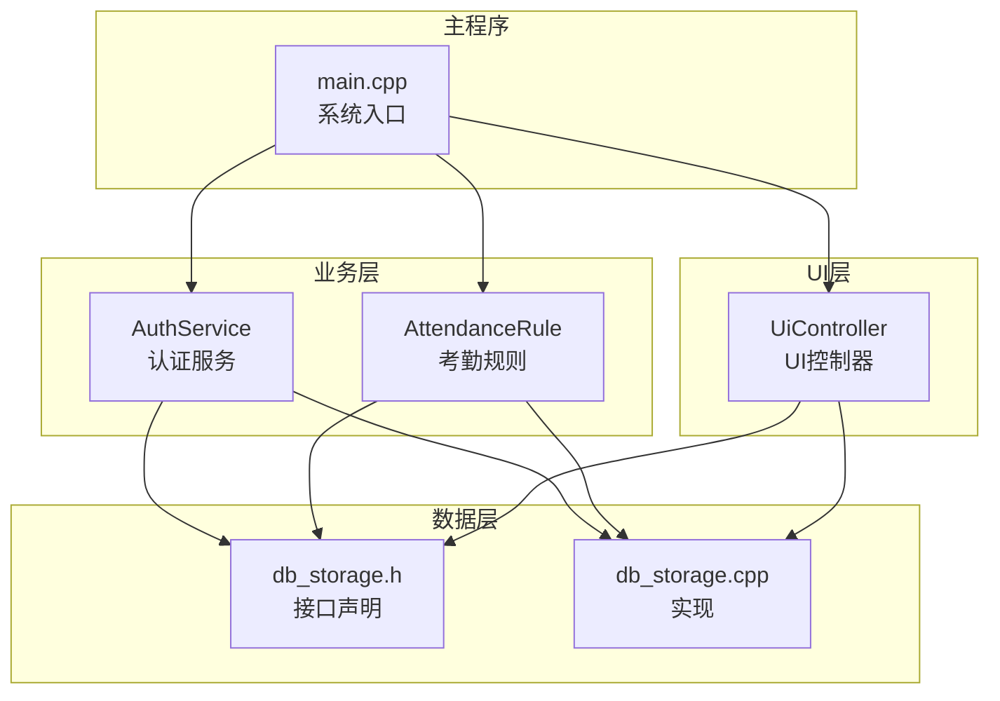
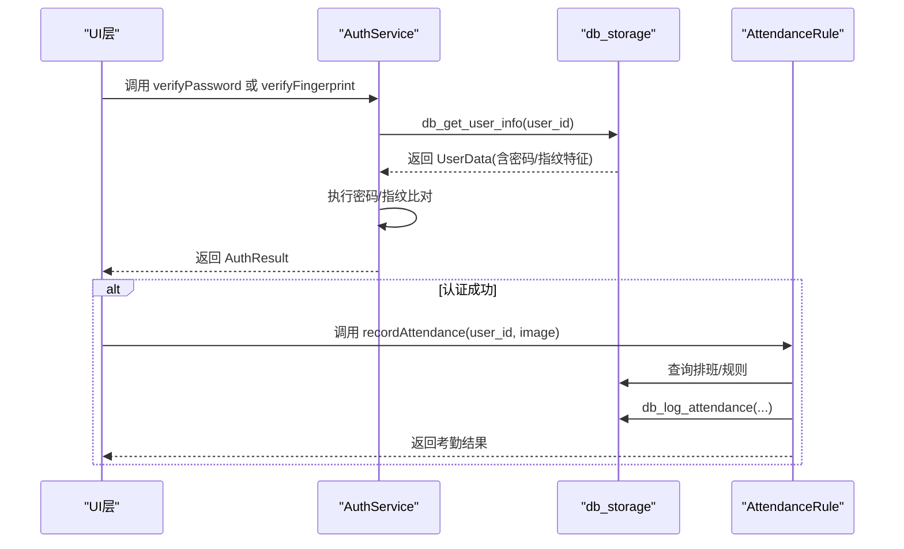
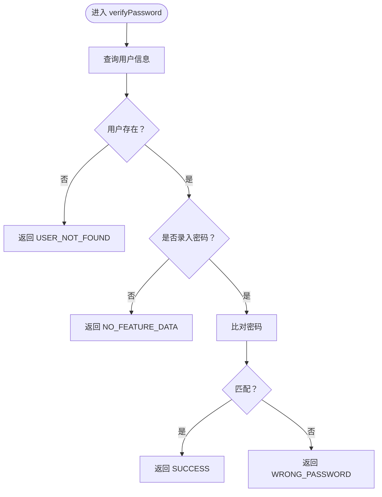
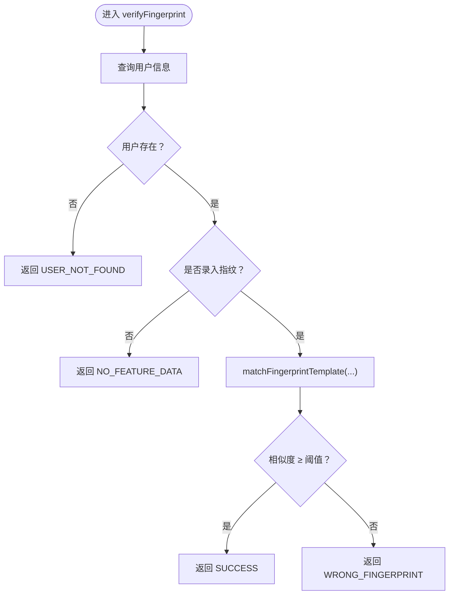
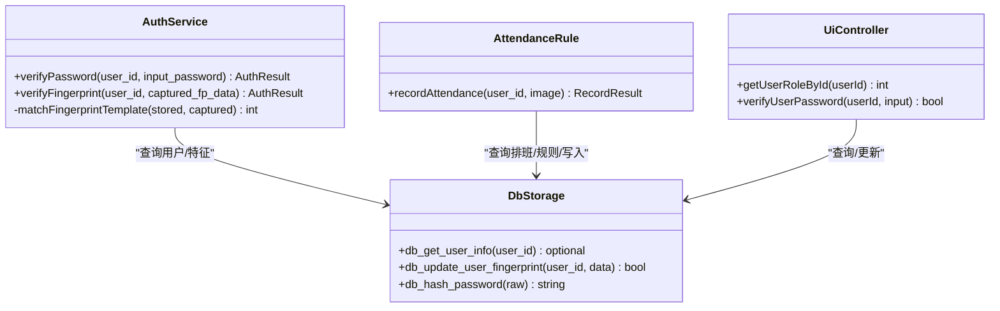
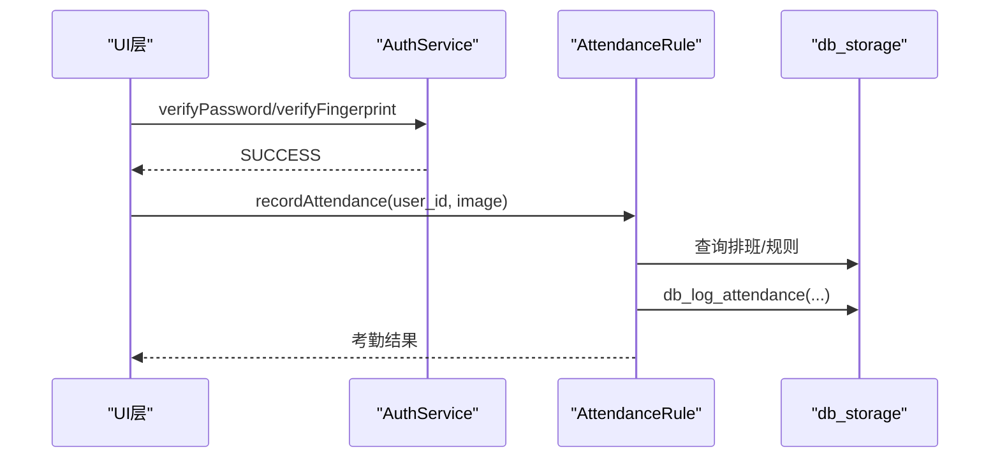

# 认证服务API

<cite>
**本文引用的文件**
- [auth_service.h](file://src/business/auth_service.h)
- [auth_service.cpp](file://src/business/auth_service.cpp)
- [db_storage.h](file://src/data/db_storage.h)
- [db_storage.cpp](file://src/data/db_storage.cpp)
- [attendance_rule.cpp](file://src/business/attendance_rule.cpp)
- [ui_controller.cpp](file://src/ui/ui_controller.cpp)
- [main.cpp](file://src/main.cpp)
</cite>

## 目录
1. [简介](#简介)
2. [项目结构](#项目结构)
3. [核心组件](#核心组件)
4. [架构总览](#架构总览)
5. [详细组件分析](#详细组件分析)
6. [依赖关系分析](#依赖关系分析)
7. [性能考量](#性能考量)
8. [故障排查指南](#故障排查指南)
9. [结论](#结论)
10. [附录](#附录)

## 简介
本文件面向认证服务API，聚焦以下目标：
- 详述密码验证接口 verifyPassword 的参数、返回值与调用示例
- 阐明指纹验证接口 verifyFingerprint 的特征数据格式、比对算法与性能考虑
- 解释 AuthResult 枚举的全部状态及其业务含义
- 提供用户权限检查、多模态认证集成与错误处理的最佳实践
- 给出认证服务扩展指南，包括新增认证方式的集成方法与安全注意事项

## 项目结构
认证服务位于业务层，围绕用户数据访问与验证展开，与数据层、UI层、业务规则层协同工作。

图表来源
- [auth_service.h:1-46](file://src/business/auth_service.h#L1-L46)
- [auth_service.cpp:1-90](file://src/business/auth_service.cpp#L1-L90)
- [db_storage.h:1-683](file://src/data/db_storage.h#L1-L683)
- [db_storage.cpp:1-800](file://src/data/db_storage.cpp#L1-L800)
- [attendance_rule.cpp:1-342](file://src/business/attendance_rule.cpp#L1-L342)
- [ui_controller.cpp:90-141](file://src/ui/ui_controller.cpp#L90-L141)
- [main.cpp:187-246](file://src/main.cpp#L187-L246)

章节来源
- [auth_service.h:1-46](file://src/business/auth_service.h#L1-L46)
- [auth_service.cpp:1-90](file://src/business/auth_service.cpp#L1-L90)
- [db_storage.h:1-683](file://src/data/db_storage.h#L1-L683)
- [db_storage.cpp:1-800](file://src/data/db_storage.cpp#L1-L800)
- [attendance_rule.cpp:1-342](file://src/business/attendance_rule.cpp#L1-L342)
- [ui_controller.cpp:90-141](file://src/ui/ui_controller.cpp#L90-L141)
- [main.cpp:187-246](file://src/main.cpp#L187-L246)

## 核心组件
- 认证服务类 AuthService：提供 verifyPassword 与 verifyFingerprint 两大验证入口，返回统一的 AuthResult 枚举。
- 数据层接口 db_storage：提供用户信息查询、指纹特征读取、密码哈希等能力。
- 考勤规则类 AttendanceRule：在认证成功后进行排班、状态计算与记录入库。
- UI 控制器 UiController：封装 UI 层对数据层的调用，包含权限查询与密码哈希验证。

章节来源
- [auth_service.h:18-44](file://src/business/auth_service.h#L18-L44)
- [db_storage.h:130-168](file://src/data/db_storage.h#L130-L168)
- [attendance_rule.cpp:263-342](file://src/business/attendance_rule.cpp#L263-L342)
- [ui_controller.cpp:113-141](file://src/ui/ui_controller.cpp#L113-L141)

## 架构总览
认证服务的调用链路如下：
- UI 层触发认证请求
- AuthService 通过 db_storage 获取用户信息
- AuthService 执行密码/指纹比对
- 成功后由 AttendanceRule 进行排班与状态计算并记录考勤

图表来源
- [auth_service.cpp:9-37](file://src/business/auth_service.cpp#L9-L37)
- [auth_service.cpp:42-69](file://src/business/auth_service.cpp#L42-L69)
- [db_storage.cpp:773-820](file://src/data/db_storage.cpp#L773-L820)
- [attendance_rule.cpp:263-342](file://src/business/attendance_rule.cpp#L263-L342)

## 详细组件分析

### 密码验证接口 verifyPassword
- 功能：基于用户ID与输入密码进行1:1验证
- 参数
  - user_id：整型用户工号
  - input_password：字符串类型的用户输入密码
- 返回值：AuthResult 枚举
  - SUCCESS：验证通过
  - USER_NOT_FOUND：用户不存在
  - WRONG_PASSWORD：密码错误
  - NO_FEATURE_DATA：用户未录入密码
  - DB_ERROR：数据库错误（预留）
- 处理流程
  - 从数据层查询用户信息
  - 若用户不存在，返回 USER_NOT_FOUND
  - 若用户存在但未录入密码，返回 NO_FEATURE_DATA
  - 比对用户密码与输入密码（演示版本直接字符串比较，生产建议比对哈希）
  - 成功返回 SUCCESS，失败返回 WRONG_PASSWORD

图表来源
- [auth_service.cpp:9-37](file://src/business/auth_service.cpp#L9-L37)
- [db_storage.h:368-374](file://src/data/db_storage.h#L368-L374)

章节来源
- [auth_service.h:25-31](file://src/business/auth_service.h#L25-L31)
- [auth_service.cpp:9-37](file://src/business/auth_service.cpp#L9-L37)
- [db_storage.h:368-374](file://src/data/db_storage.h#L368-L374)

调用示例（步骤化）
- UI 层获取用户输入的 user_id 与 input_password
- 调用 AuthService::verifyPassword(user_id, input_password)
- 根据返回值分支处理：成功则继续记录考勤，失败则提示错误

章节来源
- [ui_controller.cpp:126-141](file://src/ui/ui_controller.cpp#L126-L141)
- [auth_service.cpp:9-37](file://src/business/auth_service.cpp#L9-L37)

### 指纹验证接口 verifyFingerprint
- 功能：基于用户ID与采集到的指纹特征数据进行1:1验证
- 参数
  - user_id：整型用户工号
  - captured_fp_data：字节向量，表示采集到的指纹特征数据
- 返回值：AuthResult 枚举
  - SUCCESS：验证通过
  - USER_NOT_FOUND：用户不存在
  - WRONG_FINGERPRINT：指纹不匹配
  - NO_FEATURE_DATA：用户未录入指纹
  - DB_ERROR：数据库错误（预留）
- 特征数据格式
  - 由数据层读取 UserData::fingerprint_feature，类型为 std::vector<uint8_t>
  - 该字段在数据库 users 表中以 BLOB 存储
- 比对算法
  - 调用 AuthService::matchFingerprintTemplate(stored_feature, captured_feature)
  - 演示版本：比较前若干字节，长度相等且前10字节相同即视为高分
  - 生产版本：应替换为厂商SDK的模板匹配算法，返回相似度分数
- 性能考虑
  - 比对阈值建议在 70–90 分之间，结合误识率与拒识率权衡
  - 指纹特征数据体积较大，注意内存占用与IO开销
  - 可在数据层按需加载特征，避免频繁读取大BLOB

图表来源
- [auth_service.cpp:42-69](file://src/business/auth_service.cpp#L42-L69)
- [auth_service.cpp:74-90](file://src/business/auth_service.cpp#L74-L90)
- [db_storage.h:163-165](file://src/data/db_storage.h#L163-L165)

章节来源
- [auth_service.h:33-39](file://src/business/auth_service.h#L33-L39)
- [auth_service.cpp:42-69](file://src/business/auth_service.cpp#L42-L69)
- [auth_service.cpp:74-90](file://src/business/auth_service.cpp#L74-L90)
- [db_storage.h:163-165](file://src/data/db_storage.h#L163-L165)

调用示例（步骤化）
- UI 层采集指纹并得到 captured_fp_data
- 调用 AuthService::verifyFingerprint(user_id, captured_fp_data)
- 根据返回值分支处理：成功则继续记录考勤，失败则提示错误

章节来源
- [auth_service.cpp:42-69](file://src/business/auth_service.cpp#L42-L69)

### AuthResult 枚举与业务含义
- SUCCESS：验证成功，后续可进行考勤记录
- USER_NOT_FOUND：用户不存在，需引导用户注册或检查ID
- WRONG_PASSWORD：密码错误，提示重新输入
- WRONG_FINGERPRINT：指纹不匹配，提示重新按压或更换位置
- NO_FEATURE_DATA：用户未录入对应特征，需先完成特征采集
- DB_ERROR：数据库访问异常，需重试或检查连接

章节来源
- [auth_service.h:9-16](file://src/business/auth_service.h#L9-L16)

### 用户权限检查与UI集成
- 权限字段：UserData::role（0 普通用户，1 管理员）
- UI 层通过 UiController 查询用户角色与密码状态
- UI 层在需要管理员权限的操作前，先进行密码验证与权限检查

章节来源
- [db_storage.h:143-146](file://src/data/db_storage.h#L143-L146)
- [ui_controller.cpp:113-124](file://src/ui/ui_controller.cpp#L113-L124)
- [ui_controller.cpp:126-141](file://src/ui/ui_controller.cpp#L126-L141)

### 多模态认证集成
- 现状：支持密码与指纹双因子
- 扩展思路：在 AuthService 中增加新的 verifyXxx 接口，返回统一 AuthResult
- 集成要点
  - 统一返回值类型，便于UI与业务层一致处理
  - 在数据层为新特征建立字段与读取逻辑
  - 在 AttendanceRule 中根据策略决定是否需要多模态通过

章节来源
- [auth_service.h:23-44](file://src/business/auth_service.h#L23-L44)
- [db_storage.h:163-165](file://src/data/db_storage.h#L163-L165)

## 依赖关系分析
- AuthService 依赖 db_storage 的用户信息查询与指纹特征读取
- AttendanceRule 依赖 db_storage 的排班与规则查询，并最终写入考勤记录
- UI 层通过 UiController 封装对 db_storage 的调用，间接参与认证流程

图表来源
- [auth_service.h:23-44](file://src/business/auth_service.h#L23-L44)
- [db_storage.h:368-439](file://src/data/db_storage.h#L368-L439)
- [attendance_rule.cpp:263-342](file://src/business/attendance_rule.cpp#L263-L342)
- [ui_controller.cpp:113-141](file://src/ui/ui_controller.cpp#L113-L141)

章节来源
- [auth_service.h:1-46](file://src/business/auth_service.h#L1-L46)
- [db_storage.h:1-683](file://src/data/db_storage.h#L1-L683)
- [attendance_rule.cpp:1-342](file://src/business/attendance_rule.cpp#L1-L342)
- [ui_controller.cpp:90-141](file://src/ui/ui_controller.cpp#L90-L141)

## 性能考量
- 数据库并发与锁
  - 数据层使用共享/排他锁保护读写，避免竞态
  - WAL 模式与预编译语句提升并发与吞吐
- 特征数据加载
  - 指纹特征为大BLOB，建议按需加载，避免每次查询均携带
- 比对算法
  - 演示版本为简化比较，生产需使用厂商SDK，关注延迟与准确率平衡
- UI 响应
  - 主循环中 LVGL 定时器驱动，避免阻塞

章节来源
- [db_storage.cpp:35-65](file://src/data/db_storage.cpp#L35-L65)
- [db_storage.cpp:148-161](file://src/data/db_storage.cpp#L148-L161)
- [db_storage.cpp:300-310](file://src/data/db_storage.cpp#L300-L310)
- [auth_service.cpp:74-90](file://src/business/auth_service.cpp#L74-L90)
- [main.cpp:229-238](file://src/main.cpp#L229-L238)

## 故障排查指南
- 常见问题与定位
  - USER_NOT_FOUND：确认 user_id 是否正确，数据库中是否存在该用户
  - NO_FEATURE_DATA：确认用户是否已完成密码/指纹录入
  - WRONG_PASSWORD/WRONG_FINGERPRINT：检查输入是否正确，指纹采集质量是否达标
  - DB_ERROR：检查数据库连接、权限与磁盘空间
- 建议流程
  - 先检查数据层初始化与表结构
  - 再验证用户信息与特征数据
  - 最后核对比对阈值与SDK集成

章节来源
- [auth_service.h:9-16](file://src/business/auth_service.h#L9-L16)
- [db_storage.cpp:133-161](file://src/data/db_storage.cpp#L133-L161)

## 结论
- AuthService 提供统一的认证入口，返回标准化结果，便于UI与业务层处理
- 指纹验证接口具备清晰的特征数据格式与可替换的比对算法
- 建议在生产环境中采用密码哈希比对与厂商SDK指纹匹配，并完善阈值与错误处理
- 多模态扩展可通过新增接口与数据层字段实现，保持统一返回值与一致用户体验

## 附录

### API定义与参数说明
- verifyPassword
  - 输入：user_id（整型）、input_password（字符串）
  - 输出：AuthResult
- verifyFingerprint
  - 输入：user_id（整型）、captured_fp_data（字节向量）
  - 输出：AuthResult

章节来源
- [auth_service.h:25-39](file://src/business/auth_service.h#L25-L39)

### 数据模型要点
- 用户信息结构体 UserData
  - 包含 id、name、password、role、fingerprint_feature 等字段
- 指纹特征字段
  - 类型：std::vector<uint8_t>
  - 存储：users 表 BLOB 字段

章节来源
- [db_storage.h:130-168](file://src/data/db_storage.h#L130-L168)

### 调用时序（认证成功后记录考勤）

图表来源
- [auth_service.cpp:9-37](file://src/business/auth_service.cpp#L9-L37)
- [auth_service.cpp:42-69](file://src/business/auth_service.cpp#L42-L69)
- [attendance_rule.cpp:263-342](file://src/business/attendance_rule.cpp#L263-L342)