# 数据层API接口

<cite>
**本文档引用的文件**
- [db_storage.cpp](file://src/data/db_storage.cpp)
- [db_storage.h](file://src/data/db_storage.h)
- [main.cpp](file://src/main.cpp)
</cite>

## 目录
1. [简介](#简介)
2. [项目结构](#项目结构)
3. [核心组件](#核心组件)
4. [架构概览](#架构概览)
5. [详细组件分析](#详细组件分析)
6. [依赖关系分析](#依赖关系分析)
7. [性能考虑](#性能考虑)
8. [故障排除指南](#故障排除指南)
9. [结论](#结论)

## 简介

智能考勤系统的数据层API实现了完整的DAO（数据访问对象）模式，提供了企业级的数据库访问能力。该系统基于SQLite3数据库，采用C++11标准开发，支持多线程并发访问，具备完善的事务处理机制和数据一致性保证。

系统的核心功能包括：
- 用户信息CRUD操作（部门、班次、用户、考勤记录）
- 考勤规则管理和排班调度
- 生物特征数据存储（人脸、指纹）
- 系统配置和节假日管理
- 数据备份恢复和工厂重置

## 项目结构

数据层API位于`src/data/`目录下，采用模块化设计：

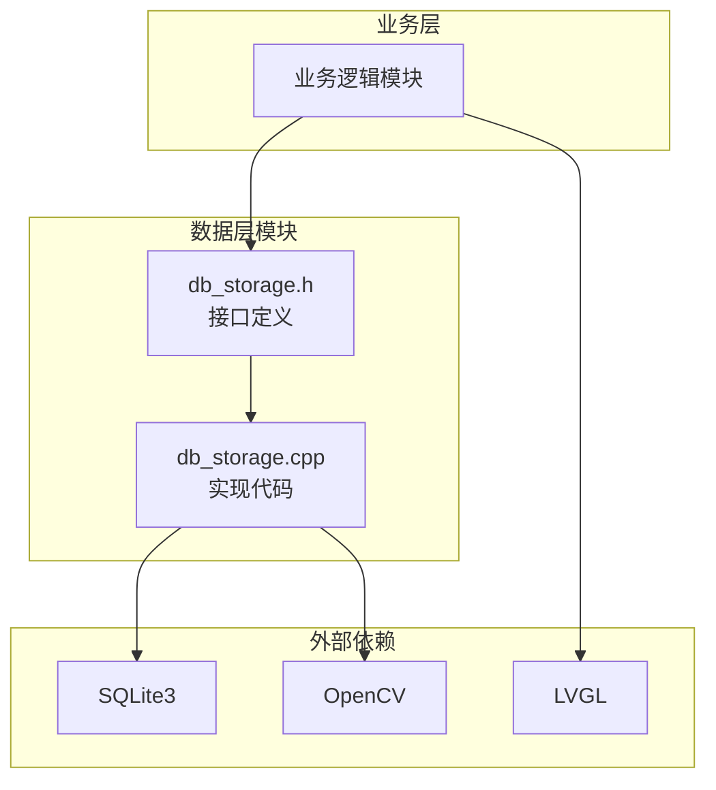

**图表来源**
- [db_storage.h:1-683](file://src/data/db_storage.h#L1-L683)
- [db_storage.cpp:1-800](file://src/data/db_storage.cpp#L1-L800)

**章节来源**
- [db_storage.h:1-683](file://src/data/db_storage.h#L1-L683)
- [db_storage.cpp:1-800](file://src/data/db_storage.cpp#L1-L800)

## 核心组件

### 数据模型架构

系统采用标准化的数据模型设计，包含以下核心实体：

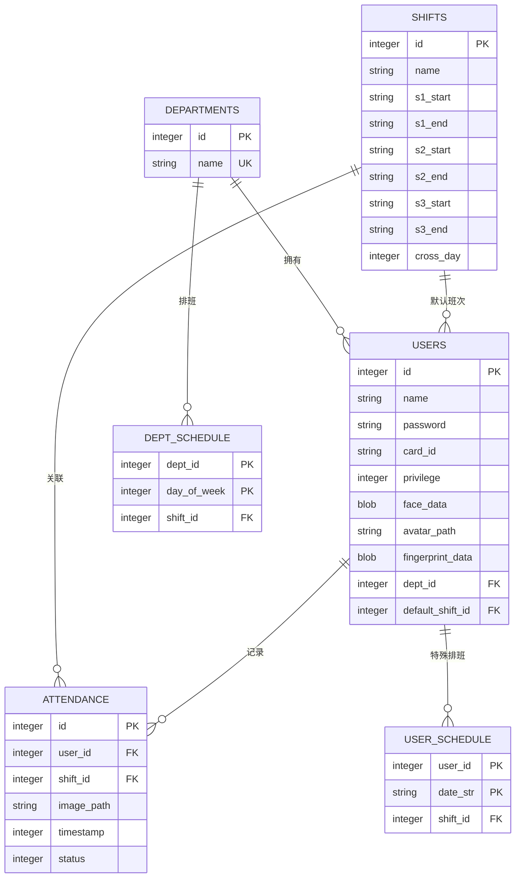

**图表来源**
- [db_storage.cpp:164-276](file://src/data/db_storage.cpp#L164-L276)

### 线程安全机制

系统采用读写分离的共享锁机制，确保高并发环境下的数据一致性：

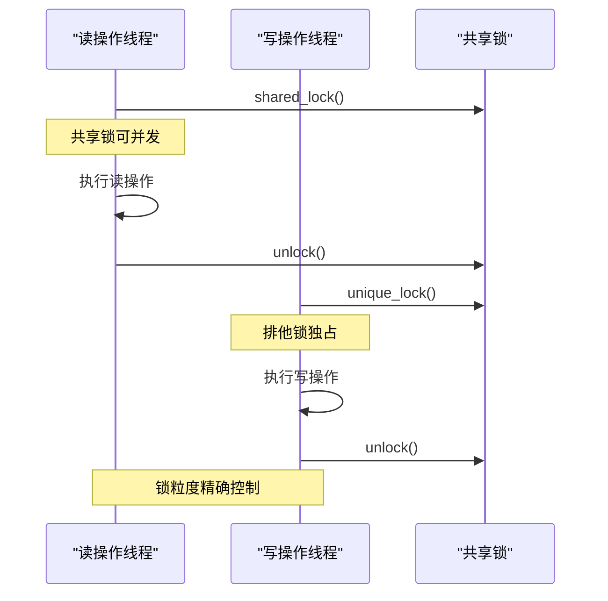

**图表来源**
- [db_storage.cpp:35](file://src/data/db_storage.cpp#L35)

**章节来源**
- [db_storage.cpp:35-65](file://src/data/db_storage.cpp#L35-L65)
- [db_storage.h:18-211](file://src/data/db_storage.h#L18-L211)

## 架构概览

### 数据访问层设计

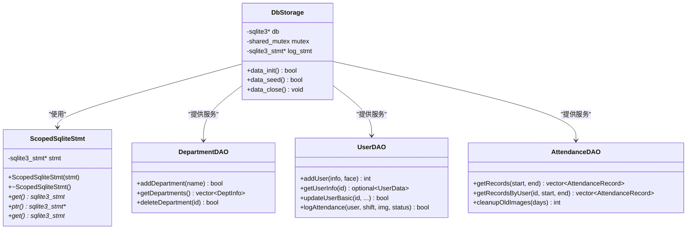

**图表来源**
- [db_storage.cpp:42-65](file://src/data/db_storage.cpp#L42-L65)
- [db_storage.h:213-682](file://src/data/db_storage.h#L213-L682)

### 数据库初始化流程

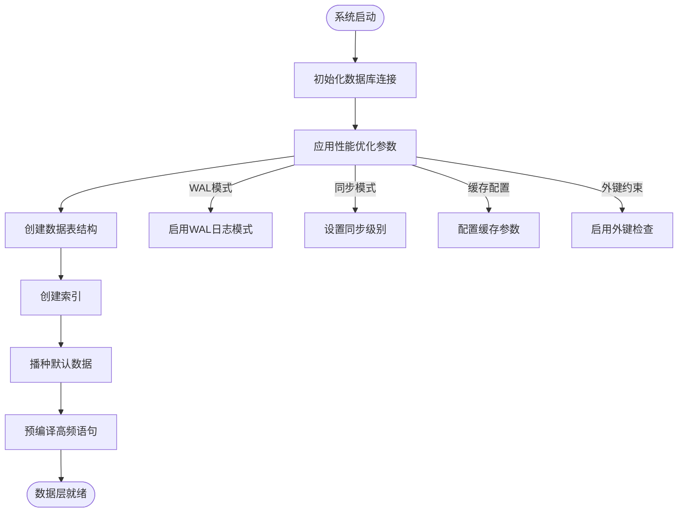

**图表来源**
- [db_storage.cpp:133-310](file://src/data/db_storage.cpp#L133-L310)

**章节来源**
- [db_storage.cpp:133-310](file://src/data/db_storage.cpp#L133-L310)

## 详细组件分析

### 部门管理API

#### 接口定义

| 接口名称 | 参数 | 返回值 | 功能描述 |
|---------|------|--------|----------|
| `db_add_department` | `const std::string& dept_name` | `bool` | 添加新部门 |
| `db_get_departments` | `void` | `std::vector<DeptInfo>` | 获取所有部门列表 |
| `db_delete_department` | `int dept_id` | `bool` | 删除指定部门 |

#### SQL实现细节

```sql
-- 添加部门
INSERT INTO departments (name) VALUES (?);

-- 查询部门列表
SELECT id, name FROM departments;

-- 删除部门
DELETE FROM departments WHERE id=?;
```

#### 参数绑定与结果处理

- **参数绑定**: 使用`sqlite3_bind_text()`进行字符串参数绑定
- **结果处理**: 通过`sqlite3_column_int()`和`sqlite3_column_text()`提取查询结果
- **错误处理**: 捕获SQLite错误信息并返回false

**章节来源**
- [db_storage.cpp:434-486](file://src/data/db_storage.cpp#L434-L486)
- [db_storage.h:243-262](file://src/data/db_storage.h#L243-L262)

### 用户管理API

#### 核心接口

| 接口名称 | 参数 | 返回值 | 功能描述 |
|---------|------|--------|----------|
| `db_add_user` | `const UserData& info, const cv::Mat& face_img` | `int` | 注册新用户 |
| `db_get_user_info` | `int user_id` | `std::optional<UserData>` | 获取用户详情 |
| `db_update_user_basic` | `int user_id, const std::string& name, int dept_id, int privilege, const std::string& card_id` | `bool` | 更新用户基本信息 |
| `db_update_user_password` | `int user_id, const std::string& new_raw_password` | `bool` | 更新用户密码 |
| `db_update_user_face` | `int user_id, const cv::Mat& face_image` | `bool` | 更新用户人脸数据 |
| `db_update_user_fingerprint` | `int user_id, const std::vector<uint8_t>& fingerprint_data` | `bool` | 更新用户指纹数据 |

#### 批量用户导入

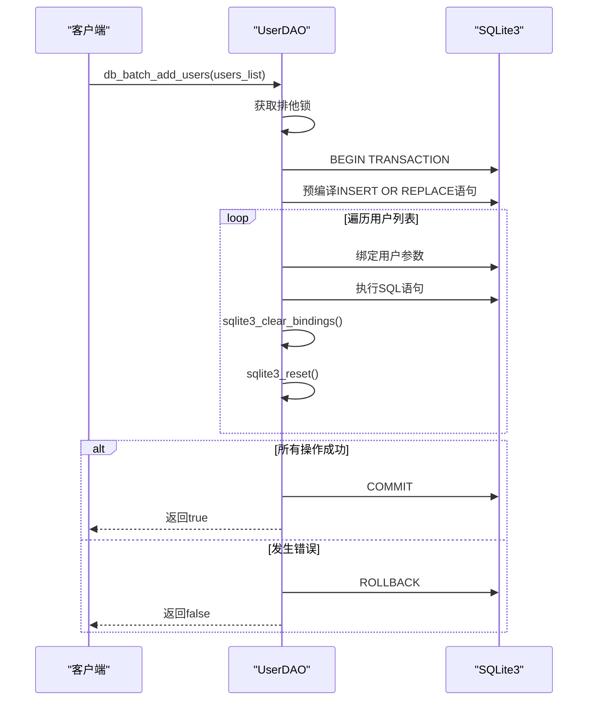

**图表来源**
- [db_storage.cpp:831-929](file://src/data/db_storage.cpp#L831-L929)

#### 人脸数据处理

系统采用OpenCV进行图像处理，支持多种数据格式：

- **人脸特征**: BLOB格式存储，使用JPG编码压缩
- **注册头像**: 文件系统存储，便于管理和清理
- **指纹数据**: BLOB格式存储二进制特征数据

**章节来源**
- [db_storage.cpp:773-828](file://src/data/db_storage.cpp#L773-L828)
- [db_storage.cpp:1153-1217](file://src/data/db_storage.cpp#L1153-L1217)
- [db_storage.cpp:1244-1287](file://src/data/db_storage.cpp#L1244-L1287)

### 考勤记录API

#### 核心功能接口

| 接口名称 | 参数 | 返回值 | 功能描述 |
|---------|------|--------|----------|
| `db_log_attendance` | `int user_id, int shift_id, const cv::Mat& image, int status` | `bool` | 记录考勤 |
| `db_get_records` | `long long start_ts, long long end_ts` | `std::vector<AttendanceRecord>` | 查询时间段内记录 |
| `db_get_records_by_user` | `int user_id, long long start_ts, long long end_ts` | `std::vector<AttendanceRecord>` | 查询指定用户记录 |
| `db_getLastPunchTime` | `int user_id` | `time_t` | 获取最后打卡时间 |

#### 高频语句预编译

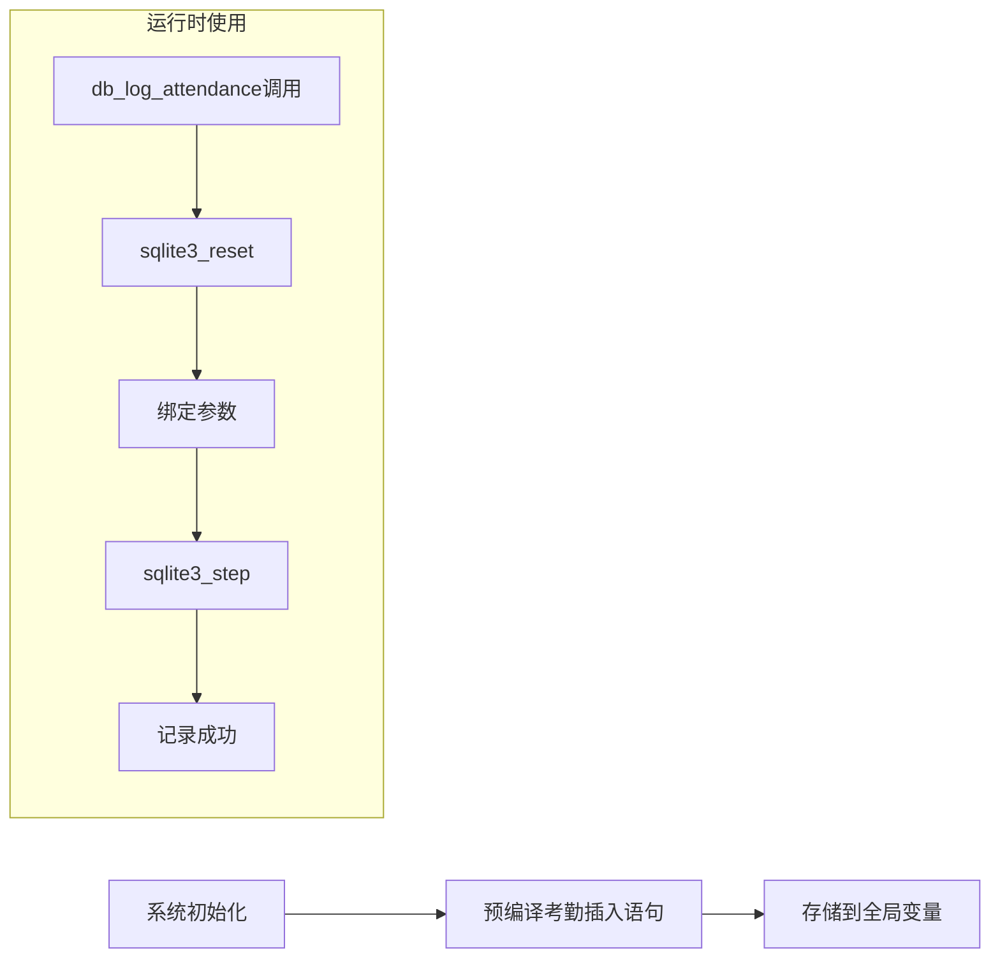

**图表来源**
- [db_storage.cpp:300-307](file://src/data/db_storage.cpp#L300-L307)
- [db_storage.cpp:1321-1373](file://src/data/db_storage.cpp#L1321-L1373)

#### 磁盘空间管理

系统提供自动清理机制，防止磁盘空间无限增长：

```sql
-- 清理过期图片并更新数据库
UPDATE attendance_records SET image_path = NULL WHERE id = ?;
```

**章节来源**
- [db_storage.cpp:1321-1373](file://src/data/db_storage.cpp#L1321-L1373)
- [db_storage.cpp:1397-1461](file://src/data/db_storage.cpp#L1397-L1461)

### 排班管理API

#### 智能排班算法

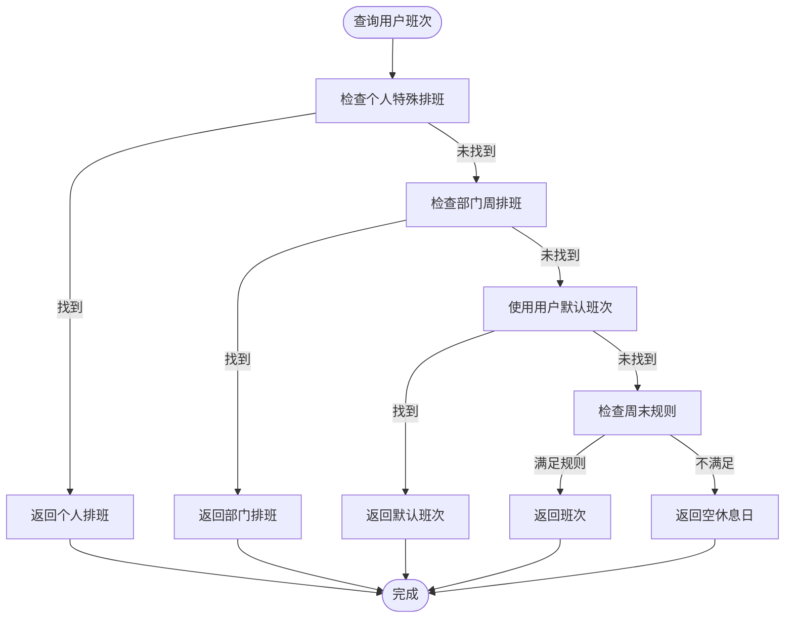

**图表来源**
- [db_storage.cpp:1660-1788](file://src/data/db_storage.cpp#L1660-L1788)

#### 排班数据结构

| 结构体 | 字段 | 类型 | 描述 |
|-------|------|------|------|
| `DeptScheduleEntry` | `dept_id` | `int` | 部门ID |
| `DeptScheduleEntry` | `day_of_week` | `int` | 星期几(0-6) |
| `DeptScheduleEntry` | `shift_id` | `int` | 班次ID(0=节假日) |
| `DeptScheduleView` | `dept_id` | `int` | 部门ID |
| `DeptScheduleView` | `dept_name` | `std::string` | 部门名称 |
| `DeptScheduleView` | `shifts[7]` | `int[7]` | 一周排班数组 |

**章节来源**
- [db_storage.cpp:1622-1788](file://src/data/db_storage.cpp#L1622-L1788)
- [db_storage.h:61-81](file://src/data/db_storage.h#L61-L81)

### 系统配置API

#### 配置管理接口

| 接口名称 | 参数 | 返回值 | 功能描述 |
|---------|------|--------|----------|
| `db_get_system_config` | `const std::string& key, const std::string& default_value` | `std::string` | 获取系统配置 |
| `db_set_system_config` | `const std::string& key, const std::string& value` | `bool` | 设置系统配置 |
| `db_get_system_stats` | `void` | `SystemStats` | 获取系统统计信息 |

#### 全局配置表设计

```sql
-- 系统配置表结构
CREATE TABLE IF NOT EXISTS system_config (
    config_key TEXT PRIMARY KEY,
    config_value TEXT
);
```

**章节来源**
- [db_storage.cpp:1994-2037](file://src/data/db_storage.cpp#L1994-L2037)
- [db_storage.cpp:1960-1988](file://src/data/db_storage.cpp#L1960-L1988)

## 依赖关系分析

### 外部依赖

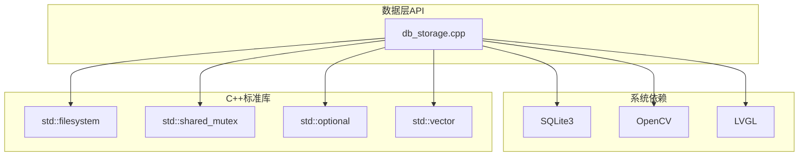

**图表来源**
- [db_storage.cpp:7-22](file://src/data/db_storage.cpp#L7-L22)

### 内部模块依赖

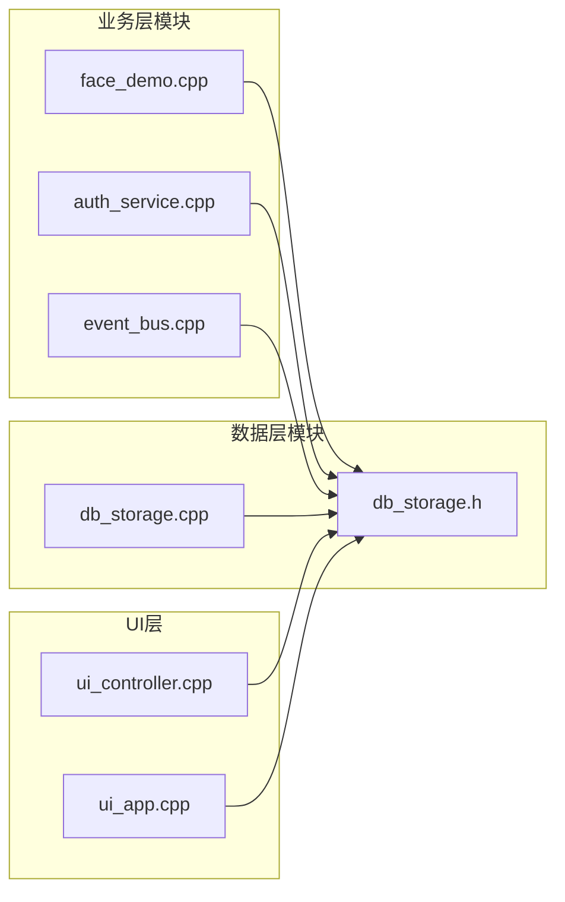

**图表来源**
- [main.cpp:46-80](file://src/main.cpp#L46-L80)

**章节来源**
- [db_storage.cpp:7-22](file://src/data/db_storage.cpp#L7-L22)
- [main.cpp:46-80](file://src/main.cpp#L46-L80)

## 性能考虑

### 数据库性能优化

系统采用多项SQLite性能优化技术：

1. **WAL模式**: 提升读写并发性能
2. **缓存配置**: 增加缓存大小减少磁盘IO
3. **索引优化**: 为高频查询建立复合索引
4. **预编译语句**: 减少SQL解析开销

### 线程安全优化

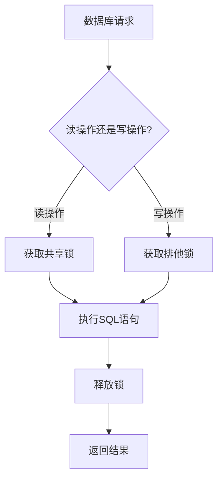

**图表来源**
- [db_storage.cpp:314-327](file://src/data/db_storage.cpp#L314-L327)

### 内存管理优化

- **RAII封装**: `ScopedSqliteStmt`自动管理语句生命周期
- **智能指针**: 使用`std::shared_ptr`管理资源
- **移动语义**: 避免不必要的数据复制

**章节来源**
- [db_storage.cpp:42-65](file://src/data/db_storage.cpp#L42-L65)
- [db_storage.cpp:1565-1577](file://src/data/db_storage.cpp#L1565-L1577)

## 故障排除指南

### 常见错误类型

| 错误类型 | 错误码 | 描述 | 解决方案 |
|---------|--------|------|----------|
| 数据库连接失败 | SQLITE_CANTOPEN | 无法打开数据库文件 | 检查文件权限和路径 |
| SQL语法错误 | SQLITE_ERROR | SQL语句语法错误 | 检查SQL语句格式 |
| 约束违反 | SQLITE_CONSTRAINT | 外键或唯一约束冲突 | 检查关联数据完整性 |
| 内存不足 | SQLITE_NOMEM | 内存分配失败 | 检查系统内存使用情况 |
| 文件系统错误 | SQLITE_IOERR | 文件操作失败 | 检查磁盘空间和权限 |

### 调试工具

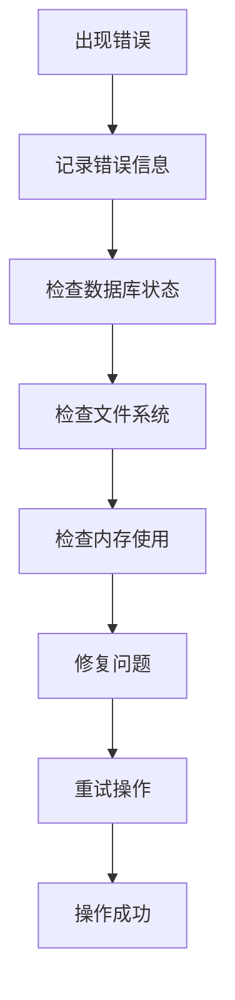

**图表来源**
- [db_storage.cpp:121-129](file://src/data/db_storage.cpp#L121-L129)

### 数据恢复策略

1. **事务回滚**: 自动回滚失败的批量操作
2. **数据备份**: 定期备份数据库文件
3. **日志记录**: 详细记录所有数据库操作
4. **健康检查**: 定期检查数据完整性

**章节来源**
- [db_storage.cpp:839-843](file://src/data/db_storage.cpp#L839-L843)
- [db_storage.cpp:1890-1908](file://src/data/db_storage.cpp#L1890-L1908)

## 结论

智能考勤系统的数据层API实现了企业级的数据库访问能力，具有以下特点：

### 技术优势

1. **完整的DAO模式**: 提供清晰的抽象层次和职责分离
2. **高并发支持**: 采用读写分离锁机制确保线程安全
3. **性能优化**: 多项SQLite优化技术和资源管理策略
4. **数据一致性**: 事务处理和外键约束保证数据完整性
5. **扩展性**: 模块化设计便于功能扩展和维护

### 应用价值

- **企业级可靠性**: 经过实际部署验证的稳定性和性能
- **易用性**: 清晰的接口设计和完善的错误处理
- **可维护性**: 良好的代码结构和详细的注释说明
- **可扩展性**: 支持未来功能扩展和性能优化

该数据层API为智能考勤系统提供了坚实的数据基础，能够满足企业级应用的需求和挑战。