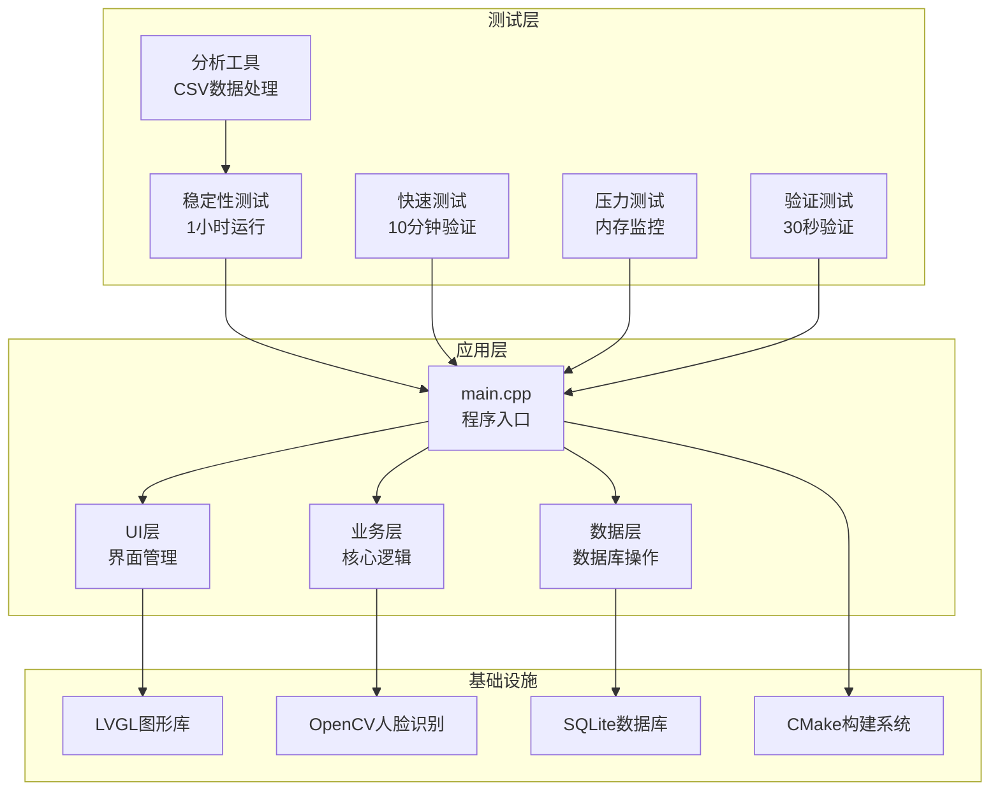
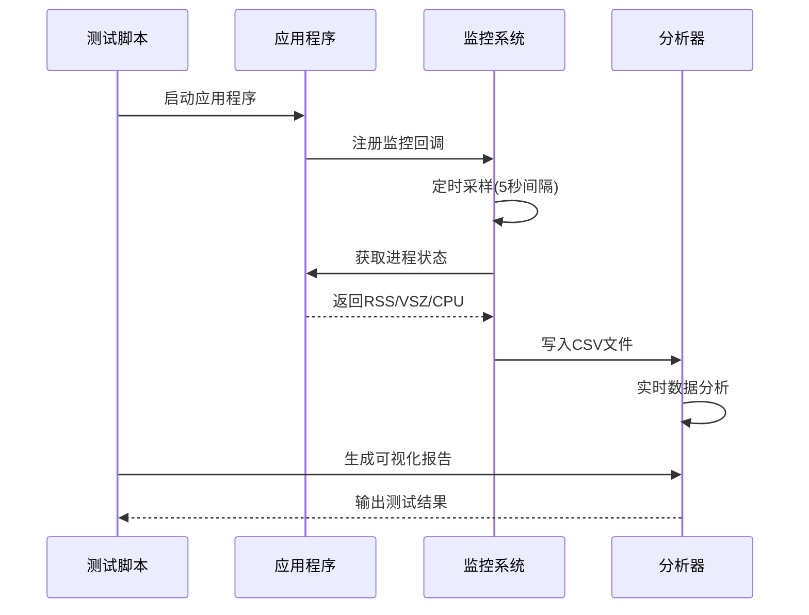
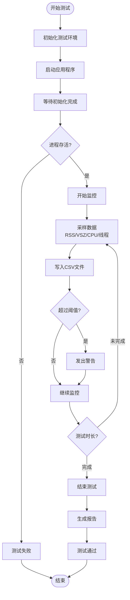
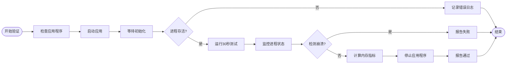
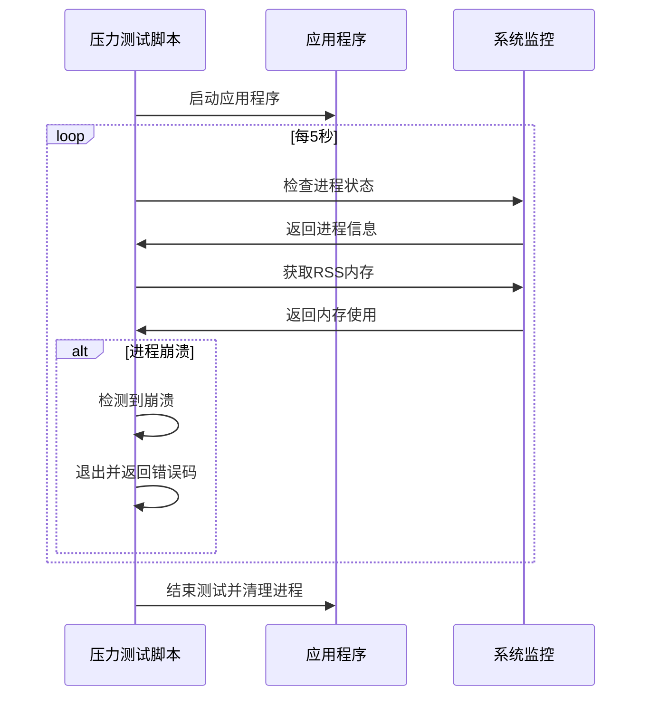
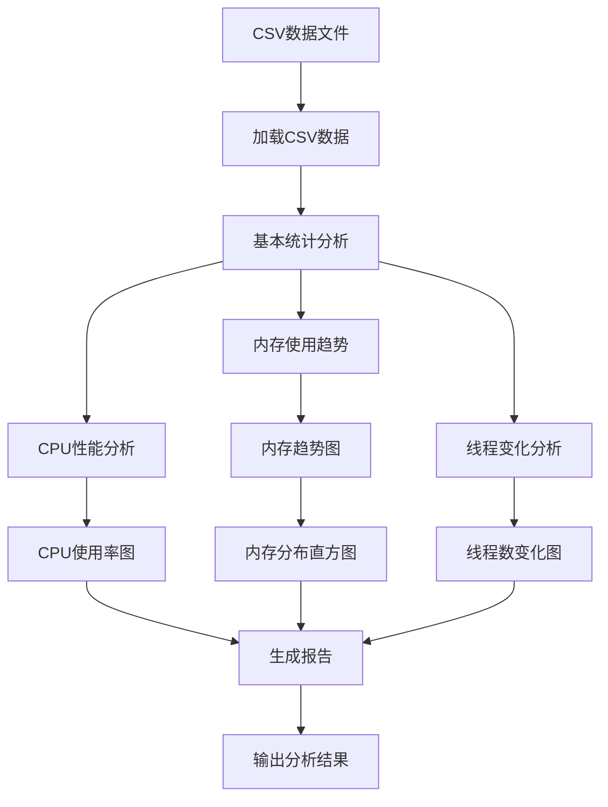
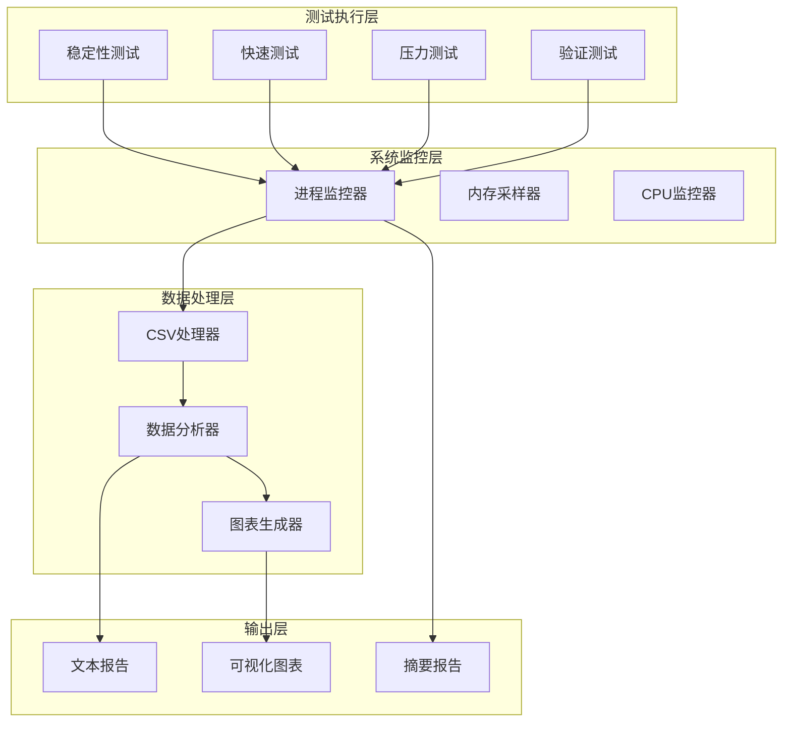

# 测试策略

<cite>
**本文档引用的文件**
- [README.md](file://README.md)
- [CMakeLists.txt](file://CMakeLists.txt)
- [tools/stability_test.sh](file://tools/stability_test.sh)
- [tools/quick_stability_test.sh](file://tools/quick_stability_test.sh)
- [tools/analyze_stability.py](file://tools/analyze_stability.py)
- [tools/stress_test.sh](file://tools/stress_test.sh)
- [tools/verify_test.sh](file://tools/verify_test.sh)
- [src/main.cpp](file://src/main.cpp)
- [src/business/attendance_rule.h](file://src/business/attendance_rule.h)
- [src/business/event_bus.h](file://src/business/event_bus.h)
- [src/data/db_storage.h](file://src/data/db_storage.h)
- [src/ui/ui_app.h](file://src/ui/ui_app.h)
</cite>

## 目录
1. [引言](#引言)
2. [项目结构](#项目结构)
3. [核心组件](#核心组件)
4. [架构概览](#架构概览)
5. [详细组件分析](#详细组件分析)
6. [依赖分析](#依赖分析)
7. [性能考虑](#性能考虑)
8. [故障排除指南](#故障排除指南)
9. [结论](#结论)

## 引言

SmartAttendance是一个基于嵌入式GUI的智能人脸考勤系统原型，采用LVGL图形框架构建嵌入式界面，集成了人脸识别、考勤规则引擎、数据持久化与报表导出功能。该项目采用了全面的测试策略，包括稳定性测试、压力测试、验证测试等多种测试方法，确保系统在真实硬件环境中的可靠性和稳定性。

## 项目结构

项目采用模块化架构设计，主要分为四个层次：

**图表来源**
- [CMakeLists.txt:1-207](file://CMakeLists.txt#L1-L207)
- [src/main.cpp:1-246](file://src/main.cpp#L1-L246)

**章节来源**
- [README.md:42-82](file://README.md#L42-L82)
- [CMakeLists.txt:1-207](file://CMakeLists.txt#L1-L207)

## 核心组件

### 测试框架组件

项目实现了多层次的测试框架，每个组件都有明确的职责和测试目标：

#### 稳定性测试组件
- **1小时稳定性测试**: 监控内存使用、CPU占用、进程状态
- **10分钟快速测试**: 开发阶段的快速验证
- **压力测试**: 持续内存监控和崩溃检测
- **验证测试**: 30秒基本功能验证

#### 分析工具组件
- **CSV数据处理**: 内存使用趋势分析
- **可视化图表生成**: 内存、CPU、线程数趋势图
- **统计报告生成**: 自动化的测试结果报告

**章节来源**
- [tools/stability_test.sh:1-197](file://tools/stability_test.sh#L1-L197)
- [tools/quick_stability_test.sh:1-106](file://tools/quick_stability_test.sh#L1-L106)
- [tools/analyze_stability.py:1-205](file://tools/analyze_stability.py#L1-L205)

## 架构概览

系统采用事件驱动架构，测试策略与主系统架构紧密集成：

**图表来源**
- [tools/stability_test.sh:85-132](file://tools/stability_test.sh#L85-L132)
- [tools/analyze_stability.py:16-31](file://tools/analyze_stability.py#L16-L31)

## 详细组件分析

### 稳定性测试系统

稳定性测试系统是整个测试策略的核心，实现了完整的自动化监控流程：

#### 测试执行流程

**图表来源**
- [tools/stability_test.sh:85-132](file://tools/stability_test.sh#L85-L132)
- [tools/stability_test.sh:149-164](file://tools/stability_test.sh#L149-L164)

#### 内存监控机制

稳定性测试实现了精确的内存使用监控：

| 监控指标 | 阈值 | 描述 |
|---------|------|------|
| RSS内存增长 | ≤20% | 物理内存使用增长率 |
| VSZ内存增长 | ≤20% | 虚拟内存使用增长率 |
| CPU使用率 | ≤80% | 处理器使用率阈值 |
| 测试时长 | ≥3500秒 | 1小时测试的最低要求 |

**章节来源**
- [tools/stability_test.sh:10-16](file://tools/stability_test.sh#L10-L16)
- [tools/analyze_stability.py:83-99](file://tools/analyze_stability.py#L83-L99)

### 快速验证测试

快速验证测试专为开发阶段设计，提供即时反馈：

#### 验证流程

**图表来源**
- [tools/verify_test.sh:74-101](file://tools/verify_test.sh#L74-L101)
- [tools/verify_test.sh:134-153](file://tools/verify_test.sh#L134-L153)

**章节来源**
- [tools/verify_test.sh:1-162](file://tools/verify_test.sh#L1-L162)

### 压力测试组件

压力测试专注于长期运行稳定性：

#### 压力测试执行

**图表来源**
- [tools/stress_test.sh:8-17](file://tools/stress_test.sh#L8-L17)

**章节来源**
- [tools/stress_test.sh:1-20](file://tools/stress_test.sh#L1-L20)

### 分析工具系统

分析工具提供了完整的数据处理和可视化能力：

#### 数据分析流程

**图表来源**
- [tools/analyze_stability.py:33-112](file://tools/analyze_stability.py#L33-L112)
- [tools/analyze_stability.py:114-171](file://tools/analyze_stability.py#L114-L171)

**章节来源**
- [tools/analyze_stability.py:1-205](file://tools/analyze_stability.py#L1-L205)

## 依赖分析

测试系统的依赖关系清晰明确，各组件协同工作：

**图表来源**
- [CMakeLists.txt:158-201](file://CMakeLists.txt#L158-L201)
- [tools/analyze_stability.py:16-31](file://tools/analyze_stability.py#L16-L31)

**章节来源**
- [CMakeLists.txt:158-201](file://CMakeLists.txt#L158-L201)

## 性能考虑

测试策略充分考虑了性能影响和资源消耗：

### 内存使用优化
- **采样间隔**: 5秒间隔平衡精度与性能
- **数据缓冲**: CSV文件轮询写入，避免内存溢出
- **进程监控**: 轻量级ps命令调用，减少系统开销

### CPU效率
- **非阻塞监控**: 使用sleep进行时间控制
- **条件检查**: 只在必要时进行数据采样
- **阈值优化**: 合理的内存增长阈值避免误报

### 存储管理
- **临时文件**: 自动清理测试产生的中间文件
- **CSV格式**: 结构化数据便于后续分析
- **报告生成**: 自动生成多种格式的测试报告

## 故障排除指南

### 常见问题诊断

#### 测试失败排查
1. **应用程序启动失败**
   - 检查构建是否成功
   - 验证依赖库是否正确安装
   - 查看应用程序日志文件

2. **内存泄漏检测**
   - 分析内存增长趋势图
   - 检查RSS vs VSZ差异
   - 审查长时间运行的内存分配

3. **进程崩溃处理**
   - 检查崩溃时的系统状态
   - 分析最近的系统调用
   - 验证资源清理完整性

#### 性能问题解决
- **CPU使用率过高**: 检查监控频率设置
- **内存增长异常**: 审查内存分配模式
- **测试时间不足**: 调整测试时长配置

**章节来源**
- [tools/stability_test.sh:150-164](file://tools/stability_test.sh#L150-L164)
- [tools/verify_test.sh:83-89](file://tools/verify_test.sh#L83-L89)

## 结论

SmartAttendance项目的测试策略体现了全面性和实用性的特点：

### 测试策略优势
1. **多层次覆盖**: 从快速验证到长期稳定性测试的完整体系
2. **自动化程度高**: CMake集成的测试目标，简化测试流程
3. **数据驱动分析**: CSV数据和可视化图表提供客观评估
4. **实时监控**: 进程状态和资源使用的持续跟踪

### 技术创新点
- **集成式测试框架**: 将测试工具与构建系统深度集成
- **多维度监控**: 同时监控内存、CPU、线程等多个指标
- **智能化分析**: Python脚本自动分析测试结果并生成报告
- **灵活的阈值配置**: 可根据硬件环境调整测试参数

### 改进建议
1. **增加单元测试**: 为关键业务逻辑添加单元测试
2. **扩展测试场景**: 增加更多边界条件和异常场景测试
3. **性能基准测试**: 建立性能基线用于回归测试
4. **持续集成**: 集成到CI/CD流程中实现自动化测试

该测试策略为嵌入式GUI应用提供了可靠的质量保障，确保系统在真实硬件环境中的稳定运行。