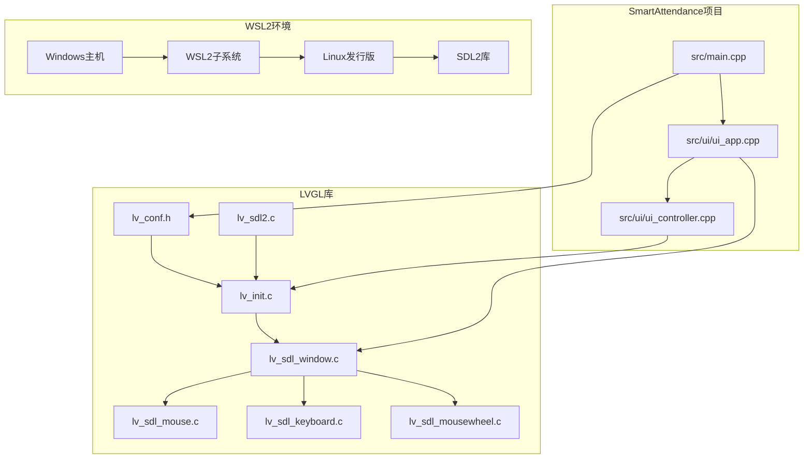
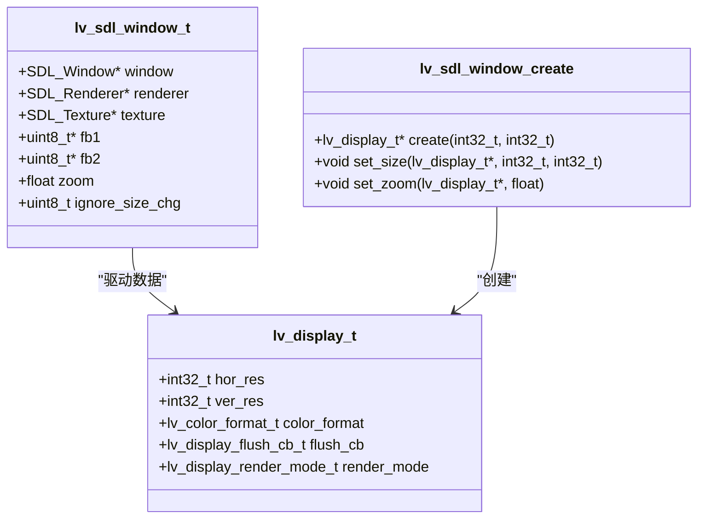
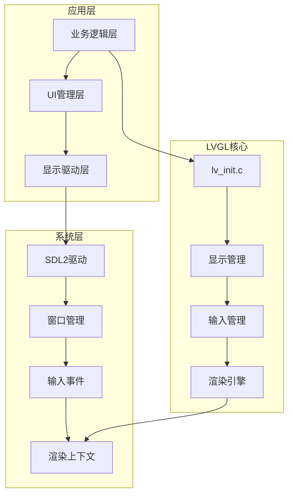
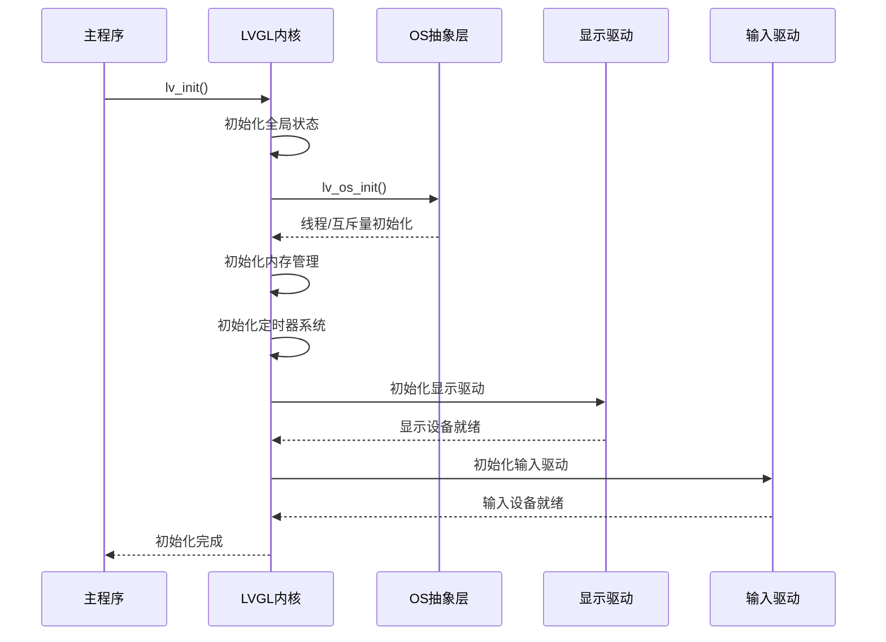
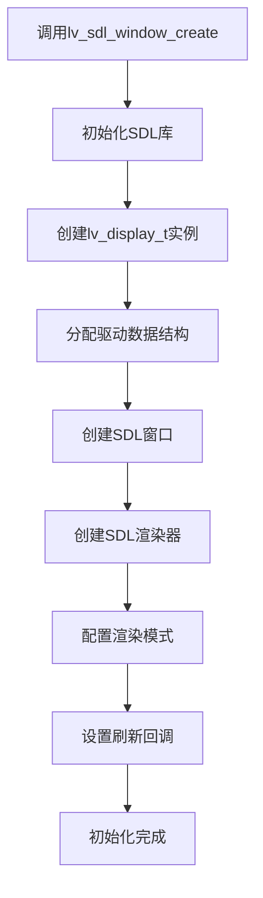
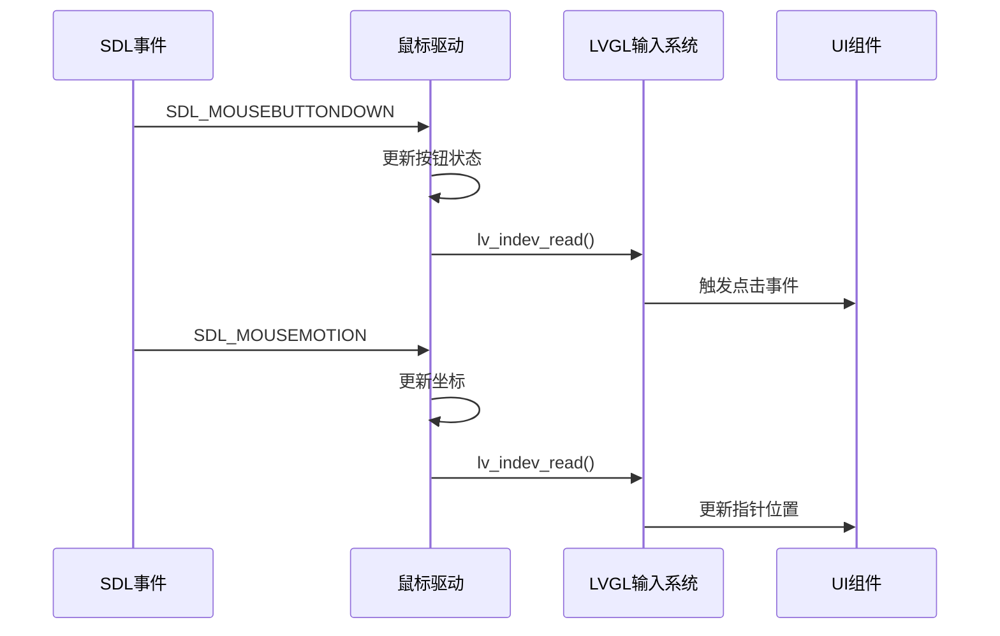
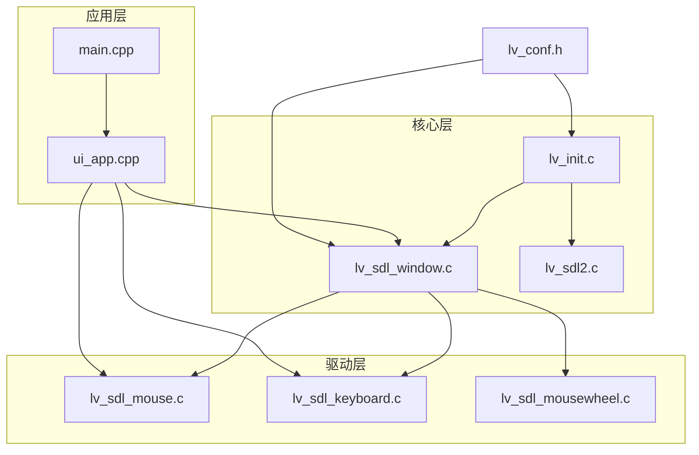

# LVGL图形库集成

<cite>
**本文档引用的文件**
- [lv_conf.h](file://lv_conf.h)
- [lv_sdl2.c](file://libs/lvgl/src/osal/lv_sdl2.c)
- [lv_sdl_window.c](file://libs/lvgl/src/drivers/sdl/lv_sdl_window.c)
- [lv_sdl_mouse.c](file://libs/lvgl/src/drivers/sdl/lv_sdl_mouse.c)
- [lv_sdl_keyboard.c](file://libs/lvgl/src/drivers/sdl/lv_sdl_keyboard.c)
- [lv_sdl_mousewheel.c](file://libs/lvgl/src/drivers/sdl/lv_sdl_mousewheel.c)
- [lv_init.c](file://libs/lvgl/src/lv_init.c)
- [sdl.rst](file://libs/lvgl/docs/src/details/integration/pc/sdl.rst)
- [main.cpp](file://src/main.cpp)
- [ui_app.cpp](file://src/ui/ui_app.cpp)
- [ui_controller.cpp](file://src/ui/ui_controller.cpp)
</cite>

## 目录
1. [简介](#简介)
2. [项目结构](#项目结构)
3. [核心组件](#核心组件)
4. [架构概览](#架构概览)
5. [详细组件分析](#详细组件分析)
6. [依赖关系分析](#依赖关系分析)
7. [性能考虑](#性能考虑)
8. [故障排除指南](#故障排除指南)
9. [结论](#结论)
10. [附录](#附录)

## 简介

SmartAttendance项目集成了LVGL图形库，通过SDL2驱动在WSL2环境下提供完整的图形用户界面。本文档详细说明了LVGL在项目中的集成方案，包括初始化流程、显示驱动配置和输入设备绑定。

LVGL是一个轻量级的嵌入式图形库，支持多种渲染后端和操作系统。在SmartAttendance项目中，LVGL被配置为使用SDL2作为显示和输入驱动，在WSL2环境中提供桌面级的图形界面体验。

## 项目结构

SmartAttendance项目的LVGL集成主要涉及以下关键文件：



**图表来源**
- [main.cpp:187-246](file://src/main.cpp#L187-L246)
- [ui_app.cpp:34-94](file://src/ui/ui_app.cpp#L34-L94)
- [lv_conf.h:1-800](file://lv_conf.h#L1-L800)

**章节来源**
- [main.cpp:187-246](file://src/main.cpp#L187-L246)
- [ui_app.cpp:34-94](file://src/ui/ui_app.cpp#L34-L94)
- [lv_conf.h:1-800](file://lv_conf.h#L1-L800)

## 核心组件

### LVGL配置管理

项目使用集中式的配置文件`lv_conf.h`来管理LVGL的所有配置选项。该文件包含了颜色深度、内存分配、渲染配置等关键参数。

关键配置要点：
- **颜色深度设置**：`LV_COLOR_DEPTH 24`支持RGB888颜色格式
- **内存管理**：使用LVGL内置内存分配器，配置内存池大小
- **操作系统支持**：配置为`LV_OS_NONE`，使用SDL2作为OS抽象层
- **渲染配置**：启用软件渲染支持，配置绘制缓冲区参数

### 显示驱动组件

LVGL的SDL2显示驱动提供了完整的窗口管理和渲染功能：



**图表来源**
- [lv_sdl_window.c:48-63](file://libs/lvgl/src/drivers/sdl/lv_sdl_window.c#L48-L63)
- [lv_sdl_window.c:95-153](file://libs/lvgl/src/drivers/sdl/lv_sdl_window.c#L95-L153)

### 输入设备组件

项目集成了三种类型的输入设备：

1. **鼠标输入设备** (`lv_sdl_mouse.c`)
2. **键盘输入设备** (`lv_sdl_keyboard.c`)
3. **滚轮输入设备** (`lv_sdl_mousewheel.c`)

每个输入设备都实现了标准的LVGL输入设备接口，支持事件驱动的输入处理。

**章节来源**
- [lv_conf.h:29-31](file://lv_conf.h#L29-L31)
- [lv_conf.h:100-110](file://lv_conf.h#L100-L110)
- [lv_sdl_window.c:95-153](file://libs/lvgl/src/drivers/sdl/lv_sdl_window.c#L95-L153)

## 架构概览

SmartAttendance项目采用分层架构设计，LVGL集成位于UI层和业务层之间：



**图表来源**
- [lv_init.c:178-420](file://libs/lvgl/src/lv_init.c#L178-L420)
- [ui_app.cpp:34-94](file://src/ui/ui_app.cpp#L34-L94)

## 详细组件分析

### LVGL初始化流程

LVGL的初始化过程遵循严格的顺序，确保所有组件正确初始化：



**图表来源**
- [lv_init.c:178-420](file://libs/lvgl/src/lv_init.c#L178-L420)
- [lv_sdl2.c:45-82](file://libs/lvgl/src/osal/lv_sdl2.c#L45-L82)

### 显示驱动配置

SDL2显示驱动提供了灵活的配置选项：

#### 窗口创建流程



**图表来源**
- [lv_sdl_window.c:95-153](file://libs/lvgl/src/drivers/sdl/lv_sdl_window.c#L95-L153)

#### 缓冲区管理

显示驱动支持多种渲染模式：

| 渲染模式 | 描述 | 用途 |
|---------|------|------|
| DIRECT | 直接渲染到纹理 | 高性能，适合静态内容 |
| PARTIAL | 部分刷新缓冲区 | 内存敏感，适合小尺寸显示 |
| FULL | 完整帧缓冲 | 兼容性最佳，适合复杂场景 |

**章节来源**
- [lv_sdl_window.c:122-148](file://libs/lvgl/src/drivers/sdl/lv_sdl_window.c#L122-L148)
- [lv_sdl_window.c:440-482](file://libs/lvgl/src/drivers/sdl/lv_sdl_window.c#L440-L482)

### 输入设备绑定

项目实现了完整的输入设备绑定机制：

#### 鼠标输入处理



**图表来源**
- [lv_sdl_mouse.c:100-202](file://libs/lvgl/src/drivers/sdl/lv_sdl_mouse.c#L100-L202)

#### 键盘输入处理

键盘驱动支持两种模式：

1. **按键模式**：处理单个按键事件
2. **文本输入模式**：处理UTF-8字符流

**章节来源**
- [lv_sdl_mouse.c:47-68](file://libs/lvgl/src/drivers/sdl/lv_sdl_mouse.c#L47-L68)
- [lv_sdl_keyboard.c:44-64](file://libs/lvgl/src/drivers/sdl/lv_sdl_keyboard.c#L44-L64)

### WSL2环境配置

WSL2环境下的特殊配置要求：

#### 环境变量设置

```cpp
// 禁用屏幕保护
setenv("SDL_VIDEO_ALLOW_SCREENSAVER", "0", 1);

// 配置WSLg显示
setenv("DISPLAY", ":0", 1);
setenv("SDL_VIDEODRIVER", "wayland", 1);
```

#### 常见问题解决方案

| 问题 | 解决方案 | 配置项 |
|------|----------|--------|
| 窗口无响应 | 检查DISPLAY环境变量 | DISPLAY=:0 |
| 图形闪烁 | 启用硬件加速 | SDL_VIDEODRIVER=wayland |
| 输入延迟 | 调整刷新频率 | LV_DEF_REFR_PERIOD=16ms |
| 内存不足 | 降低缓冲区大小 | LV_MEM_SIZE=512KB |

**章节来源**
- [ui_app.cpp:37-40](file://src/ui/ui_app.cpp#L37-L40)
- [lv_conf.h:90-95](file://lv_conf.h#L90-L95)

## 依赖关系分析

### 组件耦合度



**图表来源**
- [lv_init.c:178-420](file://libs/lvgl/src/lv_init.c#L178-L420)
- [lv_sdl_window.c:95-153](file://libs/lvgl/src/drivers/sdl/lv_sdl_window.c#L95-L153)

### 外部依赖

LVGL集成的主要外部依赖：

1. **SDL2库**：提供跨平台的图形和输入支持
2. **CMake构建系统**：管理编译和链接过程
3. **OpenCV**：用于图像处理和人脸识别
4. **SQLite3**：用于数据持久化存储

**章节来源**
- [main.cpp:17-34](file://src/main.cpp#L17-L34)
- [lv_conf.h:14-18](file://lv_conf.h#L14-L18)

## 性能考虑

### 渲染优化

1. **缓冲区策略**
   - 使用双缓冲减少撕裂现象
   - 部分刷新提高更新效率
   - 合理的缓冲区对齐提升内存访问性能

2. **内存管理**
   - 配置适当的内存池大小
   - 启用内存压缩减少占用
   - 及时释放不再使用的资源

3. **刷新频率**
   - 根据硬件能力调整刷新周期
   - 实现动态刷新频率调节
   - 优化事件处理循环

### 调试技巧

1. **日志配置**
   ```cpp
   #define LV_USE_LOG 1
   #define LV_LOG_LEVEL LV_LOG_LEVEL_INFO
   ```

2. **性能监控**
   - 使用LVGL内置的性能计数器
   - 监控内存使用情况
   - 分析渲染时间分布

3. **可视化调试**
   - 启用重绘区域高亮显示
   - 使用调试渲染模式
   - 检查图层叠加效果

## 故障排除指南

### 常见问题及解决方案

#### 1. 初始化失败

**症状**：`lv_sdl_window_create`返回NULL

**诊断步骤**：
1. 检查SDL库是否正确安装
2. 验证DISPLAY环境变量设置
3. 确认权限足够访问显示设备

**解决方案**：
```bash
# 检查SDL安装
pkg-config --modversion SDL2

# 设置环境变量
export DISPLAY=:0
export SDL_VIDEODRIVER=wayland
```

#### 2. 输入无响应

**症状**：鼠标和键盘事件不被识别

**诊断步骤**：
1. 验证输入设备驱动创建成功
2. 检查事件循环是否正常运行
3. 确认输入设备与显示设备关联

**解决方案**：
```cpp
// 确保正确绑定输入设备
lv_indev_set_display(mouse, disp);
lv_indev_set_display(kbd, disp);
```

#### 3. 性能问题

**症状**：界面卡顿或刷新缓慢

**诊断步骤**：
1. 监控CPU使用率
2. 检查内存占用情况
3. 分析渲染时间

**解决方案**：
```cpp
// 调整刷新频率
#define LV_DEF_REFR_PERIOD 16

// 优化缓冲区配置
#define LV_MEM_SIZE (512 * 1024)
```

**章节来源**
- [ui_app.cpp:50-53](file://src/ui/ui_app.cpp#L50-L53)
- [lv_sdl_window.c:375-383](file://libs/lvgl/src/drivers/sdl/lv_sdl_window.c#L375-L383)

## 结论

SmartAttendance项目成功集成了LVGL图形库，通过SDL2驱动在WSL2环境中提供了完整的桌面级图形界面。该集成方案具有以下特点：

1. **模块化设计**：清晰的层次结构便于维护和扩展
2. **跨平台兼容**：基于SDL2的抽象层支持多平台部署
3. **性能优化**：合理的缓冲区管理和刷新策略
4. **易于调试**：完善的日志和监控机制

通过本文档的详细说明，开发者可以理解LVGL在SmartAttendance项目中的完整集成方案，并能够根据具体需求进行定制和优化。

## 附录

### 配置参考表

| 配置项 | 默认值 | 说明 |
|--------|--------|------|
| LV_COLOR_DEPTH | 24 | 颜色深度（8/16/24/32） |
| LV_MEM_SIZE | 1024KB | 内存池大小 |
| LV_DEF_REFR_PERIOD | 16ms | 默认刷新周期 |
| LV_USE_LOG | 0 | 是否启用日志 |
| LV_USE_OS | LV_OS_NONE | 操作系统抽象层 |

### 快速开始指南

1. **安装依赖**：
   ```bash
   sudo apt-get install libsdl2-dev
   ```

2. **配置LVGL**：
   ```cpp
   #define LV_USE_SDL 1
   #define LV_COLOR_DEPTH 24
   ```

3. **初始化LVGL**：
   ```cpp
   lv_init();
   lv_display_t *disp = lv_sdl_window_create(800, 600);
   ```