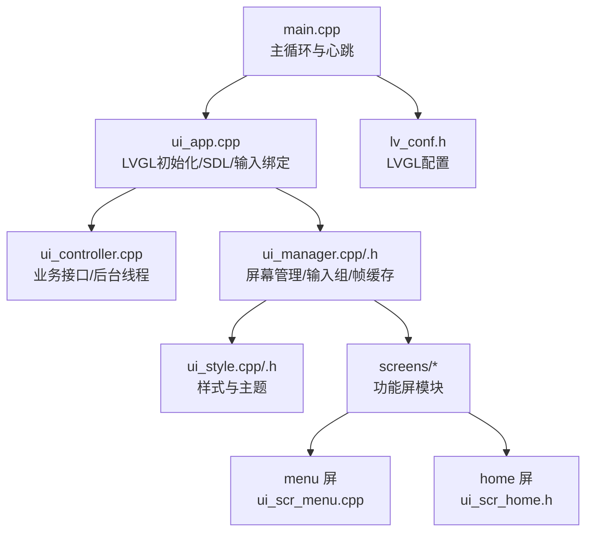
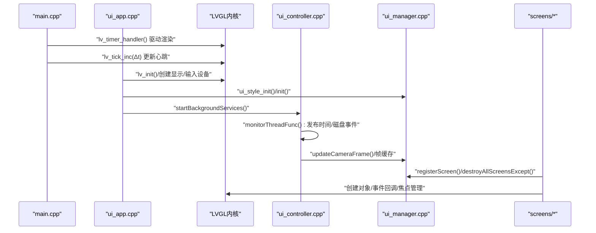
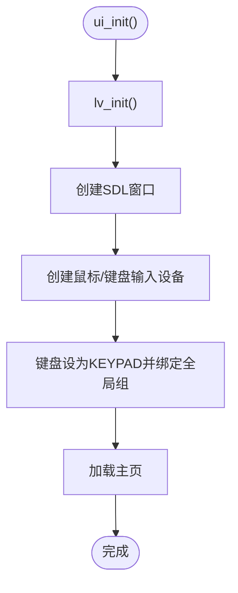
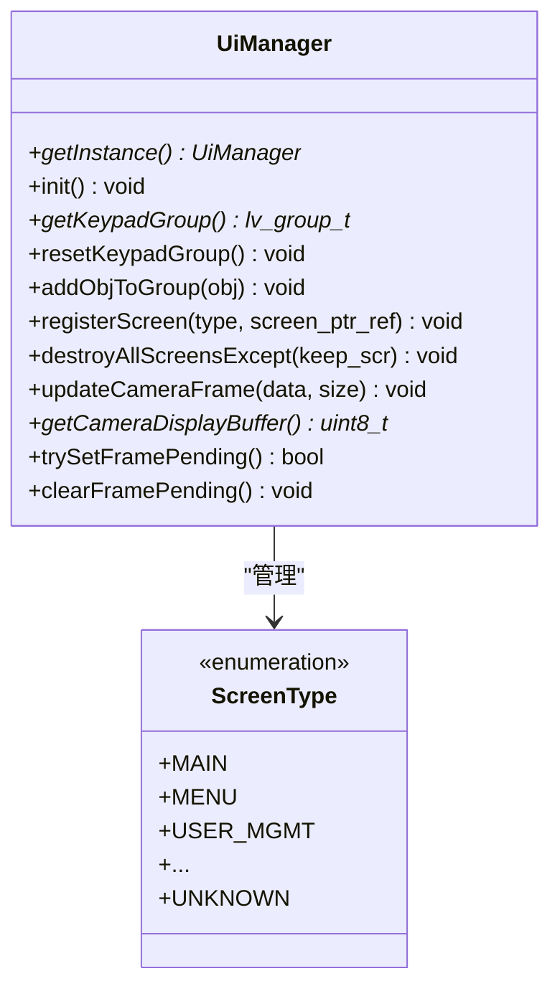
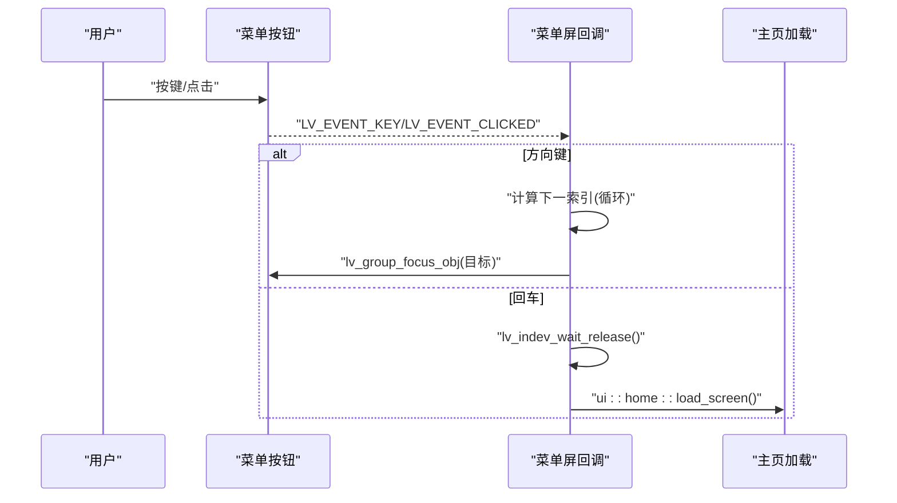
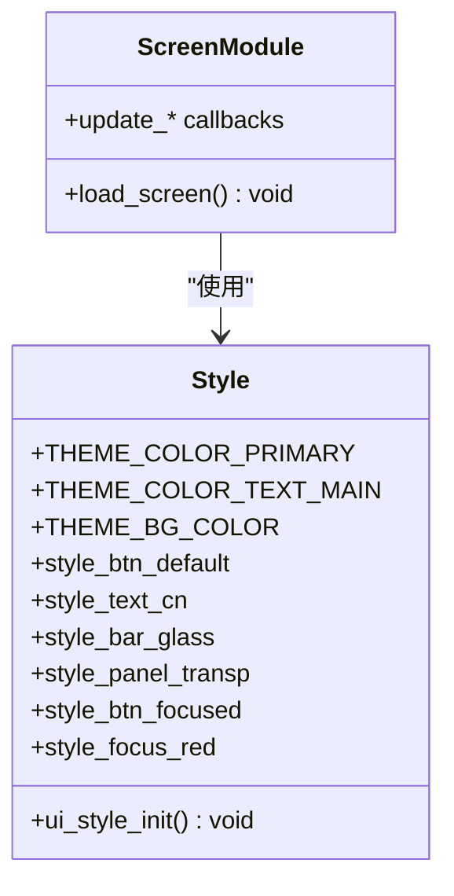
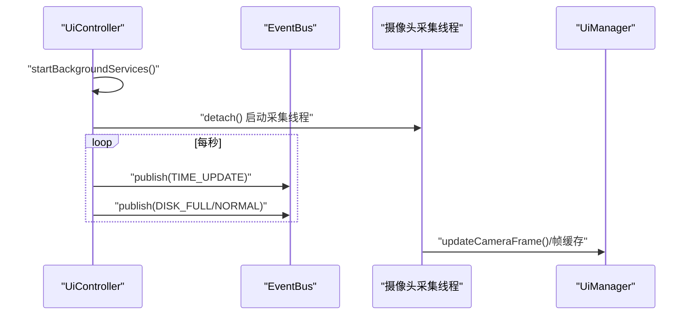
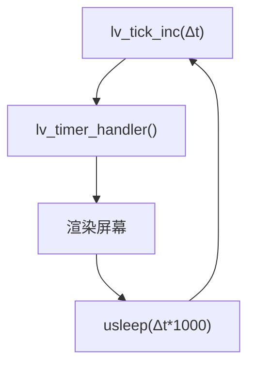
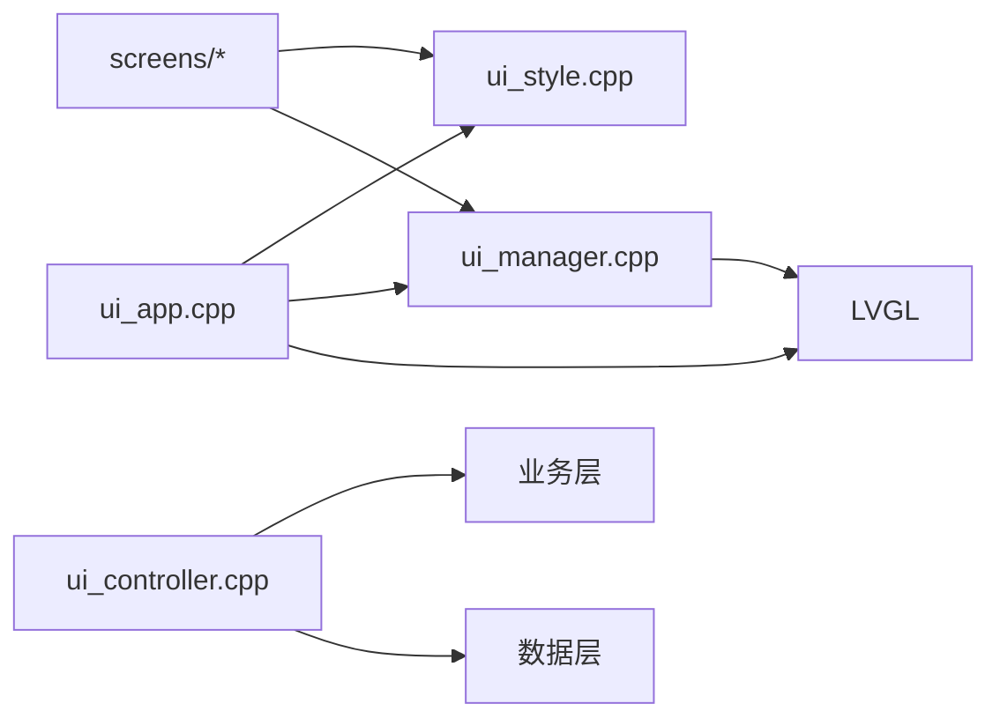

# UI框架设计

<cite>
**本文引用的文件**
- [src/main.cpp](file://src/main.cpp)
- [src/ui/ui_app.cpp](file://src/ui/ui_app.cpp)
- [src/ui/ui_controller.cpp](file://src/ui/ui_controller.cpp)
- [src/ui/managers/ui_manager.h](file://src/ui/managers/ui_manager.h)
- [src/ui/managers/ui_manager.cpp](file://src/ui/managers/ui_manager.cpp)
- [src/ui/common/ui_style.h](file://src/ui/common/ui_style.h)
- [src/ui/common/ui_style.cpp](file://src/ui/common/ui_style.cpp)
- [src/ui/screens/menu/ui_scr_menu.cpp](file://src/ui/screens/menu/ui_scr_menu.cpp)
- [src/ui/screens/home/ui_scr_home.h](file://src/ui/screens/home/ui_scr_home.h)
- [lv_conf.h](file://lv_conf.h)
- [libs/lvgl/env_support/pikascript/pika_lvgl.c](file://libs/lvgl/env_support/pikascript/pika_lvgl.c)
</cite>

## 目录
1. [简介](#简介)
2. [项目结构](#项目结构)
3. [核心组件](#核心组件)
4. [架构总览](#架构总览)
5. [详细组件分析](#详细组件分析)
6. [依赖关系分析](#依赖关系分析)
7. [性能考量](#性能考量)
8. [故障排查指南](#故障排查指南)
9. [结论](#结论)
10. [附录](#附录)

## 简介
本文件系统化梳理 SmartAttendance 项目的 UI 框架设计，重点覆盖以下方面：
- LVGL 图形库的集成方案与配置要点
- 屏幕管理机制与内存安全策略
- 事件处理系统与导航机制
- UI 组件库设计：基础组件封装、自定义控件与样式体系
- UI 控制器职责、后台服务与事件总线
- UI 线程管理、渲染优化与响应式设计
- 调试技巧、性能优化策略与跨平台兼容性

## 项目结构
UI 框架采用分层与模块化组织：
- 入口与主循环：main.cpp 驱动 LVGL 心跳与全局事件
- UI 层入口：ui_app.cpp 完成 LVGL 初始化、SDL 显示与输入设备绑定
- 控制器层：ui_controller.cpp 提供业务接口与后台线程
- 管理器层：ui_manager.h/.cpp 提供屏幕生命周期管理、输入组与摄像头帧缓存
- 样式与主题：ui_style.h/.cpp 定义全局主题与通用样式
- 屏幕模块：screens 下按功能域划分，如 home、menu、user_mgmt、sys_info 等
- LVGL 配置：lv_conf.h 控制渲染、字体、操作系统抽象等

**图表来源**
- [src/main.cpp:227-238](file://src/main.cpp#L227-L238)
- [src/ui/ui_app.cpp:34-94](file://src/ui/ui_app.cpp#L34-L94)
- [src/ui/ui_controller.cpp:362-417](file://src/ui/ui_controller.cpp#L362-L417)
- [src/ui/managers/ui_manager.cpp:118-125](file://src/ui/managers/ui_manager.cpp#L118-L125)
- [src/ui/common/ui_style.cpp:16-78](file://src/ui/common/ui_style.cpp#L16-L78)
- [src/ui/screens/menu/ui_scr_menu.cpp:124-225](file://src/ui/screens/menu/ui_scr_menu.cpp#L124-L225)
- [lv_conf.h:15-120](file://lv_conf.h#L15-L120)

**章节来源**
- [src/main.cpp:187-246](file://src/main.cpp#L187-L246)
- [src/ui/ui_app.cpp:34-94](file://src/ui/ui_app.cpp#L34-L94)
- [lv_conf.h:15-120](file://lv_conf.h#L15-L120)

## 核心组件
- UI 入口与初始化：负责 LVGL 初始化、SDL 窗口与输入设备创建、键盘绑定至全局输入组、加载主页
- UI 控制器：封装业务接口、启动后台监控与摄像头采集线程、发布系统事件
- UI 管理器：单例，负责屏幕注册与异步销毁、输入组管理、摄像头帧缓存与同步
- 样式系统：集中定义主题色、字体、通用样式，提供 ui_style_init 初始化
- 屏幕模块：按功能域划分，每个模块提供 load_screen 与事件回调，遵循统一的 BaseScreenParts 创建规范

**章节来源**
- [src/ui/ui_app.cpp:34-94](file://src/ui/ui_app.cpp#L34-L94)
- [src/ui/ui_controller.cpp:26-31](file://src/ui/ui_controller.cpp#L26-L31)
- [src/ui/managers/ui_manager.h:71-156](file://src/ui/managers/ui_manager.h#L71-L156)
- [src/ui/common/ui_style.h:15-48](file://src/ui/common/ui_style.h#L15-L48)
- [src/ui/screens/menu/ui_scr_menu.cpp:124-225](file://src/ui/screens/menu/ui_scr_menu.cpp#L124-L225)

## 架构总览
UI 框架采用“入口驱动 + 控制器桥接 + 管理器调度 + 屏幕模块”的分层结构。主循环通过 LVGL 的定时器驱动渲染；控制器负责后台服务与事件发布；管理器负责屏幕生命周期与输入焦点；屏幕模块负责具体 UI 组件与交互。

**图表来源**
- [src/main.cpp:227-238](file://src/main.cpp#L227-L238)
- [src/ui/ui_app.cpp:34-94](file://src/ui/ui_app.cpp#L34-L94)
- [src/ui/ui_controller.cpp:362-417](file://src/ui/ui_controller.cpp#L362-L417)
- [src/ui/managers/ui_manager.cpp:60-125](file://src/ui/managers/ui_manager.cpp#L60-L125)
- [src/ui/screens/menu/ui_scr_menu.cpp:124-225](file://src/ui/screens/menu/ui_scr_menu.cpp#L124-L225)

## 详细组件分析

### LVGL 集成与配置
- 初始化与显示：ui_app.cpp 调用 lv_init()，创建 SDL 窗口与鼠标/键盘输入设备，设置键盘为 KEYPAD 模式并绑定至全局输入组
- 配置要点：lv_conf.h 控制颜色深度、默认刷新周期、操作系统抽象、软件渲染开关、图层与阴影缓存、字体与文本编码等
- 事件常量：通过 pika_lvgl.c 暴露 LVGL 事件常量，便于脚本层使用

**图表来源**
- [src/ui/ui_app.cpp:34-94](file://src/ui/ui_app.cpp#L34-L94)
- [lv_conf.h:25-120](file://lv_conf.h#L25-L120)
- [libs/lvgl/env_support/pikascript/pika_lvgl.c:71-95](file://libs/lvgl/env_support/pikascript/pika_lvgl.c#L71-L95)

**章节来源**
- [src/ui/ui_app.cpp:34-94](file://src/ui/ui_app.cpp#L34-L94)
- [lv_conf.h:25-120](file://lv_conf.h#L25-L120)
- [libs/lvgl/env_support/pikascript/pika_lvgl.c:71-95](file://libs/lvgl/env_support/pikascript/pika_lvgl.c#L71-L95)

### 屏幕管理与内存安全
- 屏幕注册：UiManager::registerScreen 将屏幕指针引用登记，便于统一管理
- 异步销毁：UiManager::destroyAllScreensExcept 通过 10ms 单次定时器在事件回调完成后安全销毁旧屏幕，避免竞态与崩溃
- 输入组：UiManager::init 创建全局输入组，将所有键盘/编码器输入绑定，支持循环导航
- 摄像头帧缓存：提供线程安全的帧缓存与原子标志，避免渲染与采集线程竞争

**图表来源**
- [src/ui/managers/ui_manager.h:71-156](file://src/ui/managers/ui_manager.h#L71-L156)
- [src/ui/managers/ui_manager.cpp:60-125](file://src/ui/managers/ui_manager.cpp#L60-L125)

**章节来源**
- [src/ui/managers/ui_manager.h:71-156](file://src/ui/managers/ui_manager.h#L71-L156)
- [src/ui/managers/ui_manager.cpp:60-125](file://src/ui/managers/ui_manager.cpp#L60-L125)

### 事件处理系统与导航机制
- 事件回调：屏幕模块通过 lv_obj_add_event_cb 绑定事件，菜单屏对按键事件进行方向键导航与回车确认
- 导航逻辑：根据网格布局行列索引，结合方向键实现循环跳转；聚焦目标按钮并等待释放避免连跳
- ESC 返回：菜单屏与各模块均提供 ESC 返回主页的兜底逻辑

**图表来源**
- [src/ui/screens/menu/ui_scr_menu.cpp:32-121](file://src/ui/screens/menu/ui_scr_menu.cpp#L32-L121)
- [src/ui/screens/menu/ui_scr_menu.cpp:218-221](file://src/ui/screens/menu/ui_scr_menu.cpp#L218-L221)

**章节来源**
- [src/ui/screens/menu/ui_scr_menu.cpp:32-121](file://src/ui/screens/menu/ui_scr_menu.cpp#L32-L121)
- [src/ui/screens/menu/ui_scr_menu.cpp:218-221](file://src/ui/screens/menu/ui_scr_menu.cpp#L218-L221)

### UI 组件库与样式系统
- 样式定义：ui_style.h/.cpp 定义主题色、字体、基础样式与聚焦样式，提供 ui_style_init 初始化
- 组件封装：屏幕模块普遍采用 Flex/Grid 布局，按钮组合图标与多行文本，统一应用 style_btn_default 与 style_text_cn
- 输入焦点：通过 lv_group_focus_obj 与 LV_STATE_FOCUSED 实现视觉反馈与键盘导航

**图表来源**
- [src/ui/common/ui_style.h:15-48](file://src/ui/common/ui_style.h#L15-L48)
- [src/ui/common/ui_style.cpp:16-78](file://src/ui/common/ui_style.cpp#L16-L78)
- [src/ui/screens/menu/ui_scr_menu.cpp:174-211](file://src/ui/screens/menu/ui_scr_menu.cpp#L174-L211)

**章节来源**
- [src/ui/common/ui_style.h:15-48](file://src/ui/common/ui_style.h#L15-L48)
- [src/ui/common/ui_style.cpp:16-78](file://src/ui/common/ui_style.cpp#L16-L78)
- [src/ui/screens/menu/ui_scr_menu.cpp:174-211](file://src/ui/screens/menu/ui_scr_menu.cpp#L174-L211)

### UI 控制器与后台服务
- 单例模式：UiController::getInstance 提供全局访问点
- 后台服务：启动监控线程与摄像头采集线程，分别发布时间/磁盘事件与更新帧缓存
- 业务接口：封装用户、部门、报表、系统统计等业务调用，屏蔽底层细节

**图表来源**
- [src/ui/ui_controller.cpp:26-31](file://src/ui/ui_controller.cpp#L26-L31)
- [src/ui/ui_controller.cpp:362-417](file://src/ui/ui_controller.cpp#L362-L417)
- [src/ui/managers/ui_manager.cpp:48-56](file://src/ui/managers/ui_manager.cpp#L48-L56)

**章节来源**
- [src/ui/ui_controller.cpp:26-31](file://src/ui/ui_controller.cpp#L26-L31)
- [src/ui/ui_controller.cpp:362-417](file://src/ui/ui_controller.cpp#L362-L417)
- [src/ui/managers/ui_manager.cpp:48-56](file://src/ui/managers/ui_manager.cpp#L48-L56)

### 主循环与渲染驱动
- 主循环：main.cpp 中通过 lv_timer_handler 驱动 LVGL 渲染，使用 usleep 控制节拍，调用 lv_tick_inc 通知时间推进
- 心跳节拍：限制最小/最大休眠，保证渲染响应与 CPU 占用平衡

**图表来源**
- [src/main.cpp:227-238](file://src/main.cpp#L227-L238)

**章节来源**
- [src/main.cpp:227-238](file://src/main.cpp#L227-L238)

## 依赖关系分析
- UI 入口依赖 LVGL 与 SDL 驱动，依赖 UI 管理器与样式系统
- 控制器依赖数据层与业务层，同时向 UI 层提供接口
- 管理器依赖 LVGL 对象树与输入组，提供线程安全的数据通道
- 屏幕模块依赖样式系统与管理器，实现具体交互

**图表来源**
- [src/ui/ui_app.cpp:34-94](file://src/ui/ui_app.cpp#L34-L94)
- [src/ui/ui_controller.cpp:8-21](file://src/ui/ui_controller.cpp#L8-L21)
- [src/ui/managers/ui_manager.cpp:118-125](file://src/ui/managers/ui_manager.cpp#L118-L125)
- [src/ui/common/ui_style.cpp:16-78](file://src/ui/common/ui_style.cpp#L16-L78)
- [src/ui/screens/menu/ui_scr_menu.cpp:124-225](file://src/ui/screens/menu/ui_scr_menu.cpp#L124-L225)

**章节来源**
- [src/ui/ui_app.cpp:34-94](file://src/ui/ui_app.cpp#L34-L94)
- [src/ui/ui_controller.cpp:8-21](file://src/ui/ui_controller.cpp#L8-L21)
- [src/ui/managers/ui_manager.cpp:118-125](file://src/ui/managers/ui_manager.cpp#L118-L125)
- [src/ui/common/ui_style.cpp:16-78](file://src/ui/common/ui_style.cpp#L16-L78)
- [src/ui/screens/menu/ui_scr_menu.cpp:124-225](file://src/ui/screens/menu/ui_scr_menu.cpp#L124-L225)

## 性能考量
- 渲染节拍：主循环限制最小/最大休眠，避免过快轮询与卡顿
- 软件渲染：lv_conf.h 中启用软件渲染与复杂渲染能力，可根据目标平台选择硬件加速
- 图层与阴影：合理设置简单层缓存与阴影缓存大小，避免内存峰值过高
- 字体与文本：启用所需字体范围，减少内存占用
- 线程与锁：摄像头帧缓存使用互斥锁与原子标志，避免频繁上下文切换与死锁风险

[本节为通用指导，无需列出具体文件来源]

## 故障排查指南
- SDL 窗口创建失败：检查 lv_conf.h 中 LV_USE_SDL 与 SDL 环境配置
- 键盘无响应：确认键盘已设为 KEYPAD 模式并绑定至全局输入组
- 屏幕闪烁或崩溃：使用 UiManager 的异步销毁机制，确保事件回调结束后再销毁旧屏幕
- 帧更新不同步：检查 trySetFramePending 与 clearFramePending 的使用，避免竞态
- 事件未触发：确认事件回调绑定的 LV_EVENT 类型与目标对象层级

**章节来源**
- [src/ui/ui_app.cpp:45-81](file://src/ui/ui_app.cpp#L45-L81)
- [src/ui/managers/ui_manager.cpp:89-115](file://src/ui/managers/ui_manager.cpp#L89-L115)
- [src/ui/managers/ui_manager.cpp:88-102](file://src/ui/managers/ui_manager.cpp#L88-L102)

## 结论
SmartAttendance 的 UI 框架以 LVGL 为核心，通过清晰的分层与管理器模式实现了稳定的屏幕生命周期管理、可靠的事件处理与良好的内存安全。配合统一的样式系统与后台服务，整体具备良好的可维护性与扩展性。后续可在硬件加速、字体裁剪与事件日志等方面进一步优化。

[本节为总结性内容，无需列出具体文件来源]

## 附录

### 代码示例路径（不含代码内容）
- 组件创建与事件绑定（菜单按钮）：[src/ui/screens/menu/ui_scr_menu.cpp:174-211](file://src/ui/screens/menu/ui_scr_menu.cpp#L174-L211)
- 导航与回车确认逻辑：[src/ui/screens/menu/ui_scr_menu.cpp:32-121](file://src/ui/screens/menu/ui_scr_menu.cpp#L32-L121)
- ESC 返回主页：[src/ui/screens/menu/ui_scr_menu.cpp:218-221](file://src/ui/screens/menu/ui_scr_menu.cpp#L218-L221)
- 样式初始化与应用：[src/ui/common/ui_style.cpp:16-78](file://src/ui/common/ui_style.cpp#L16-L78)
- 屏幕注册与异步销毁：[src/ui/managers/ui_manager.cpp:60-125](file://src/ui/managers/ui_manager.cpp#L60-L125)
- UI 控制器后台服务：[src/ui/ui_controller.cpp:362-417](file://src/ui/ui_controller.cpp#L362-L417)
- 主循环渲染驱动：[src/main.cpp:227-238](file://src/main.cpp#L227-L238)
- LVGL 配置要点：[lv_conf.h:25-120](file://lv_conf.h#L25-L120)