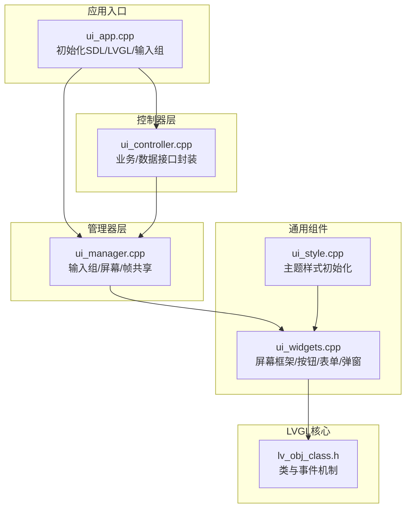
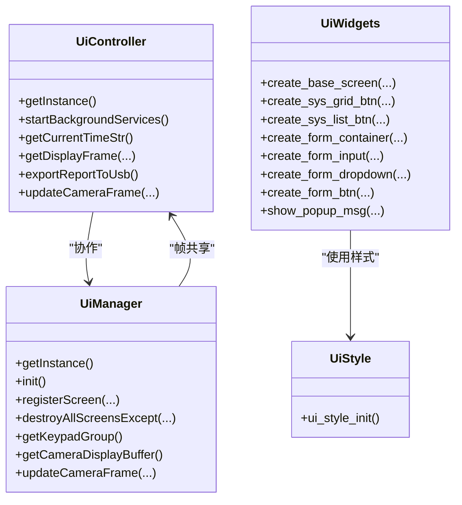
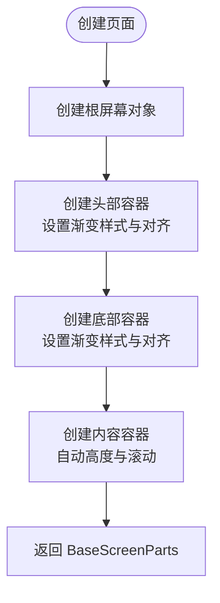
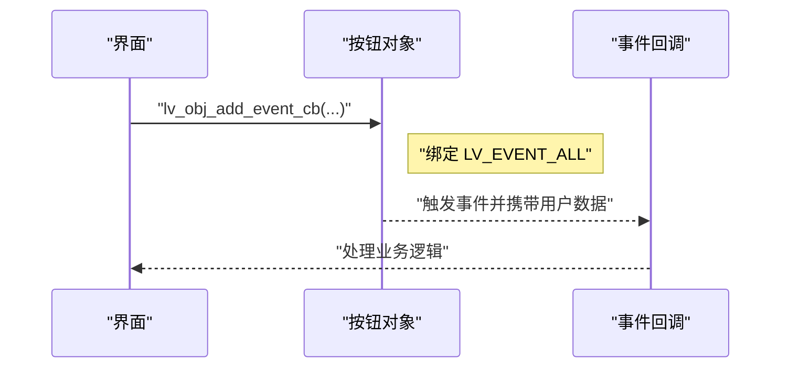
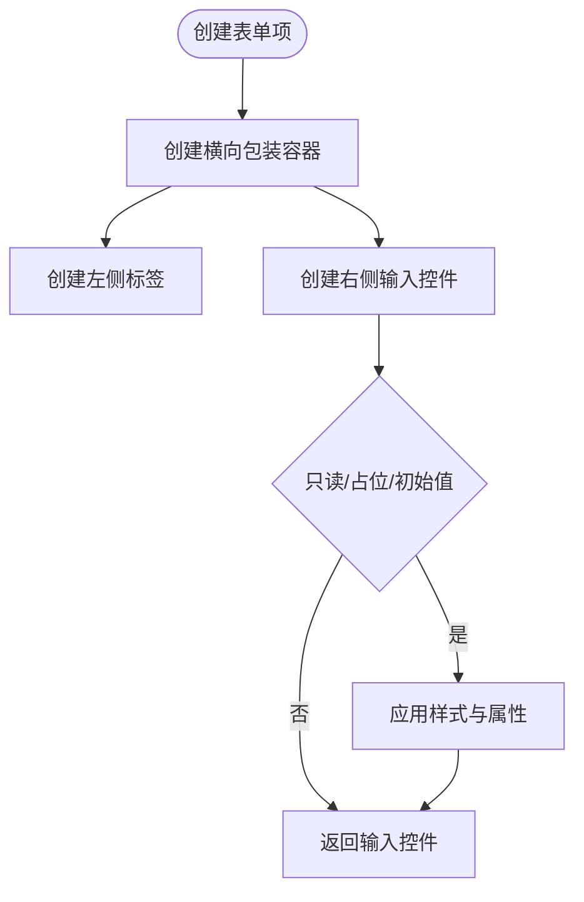
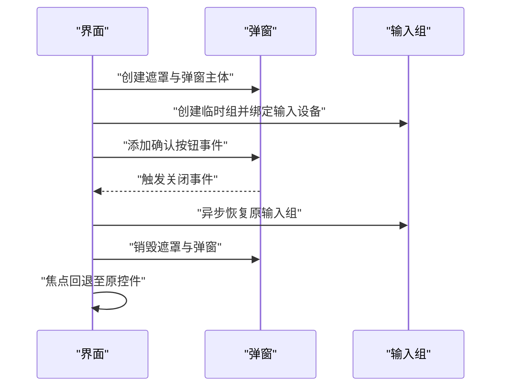
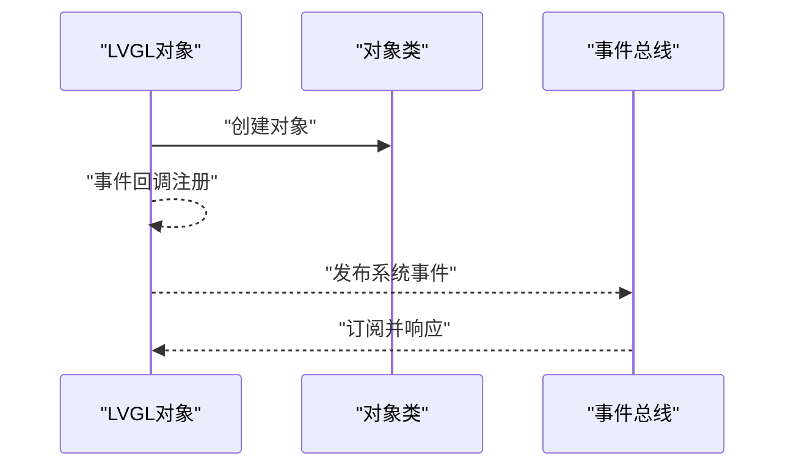

# UI组件库设计

<cite>
**本文引用的文件**
- [ui_app.cpp](file://src/ui/ui_app.cpp)
- [ui_app.h](file://src/ui/ui_app.h)
- [ui_controller.cpp](file://src/ui/ui_controller.cpp)
- [ui_controller.h](file://src/ui/ui_controller.h)
- [ui_manager.h](file://src/ui/managers/ui_manager.h)
- [ui_manager.cpp](file://src/ui/managers/ui_manager.cpp)
- [ui_style.h](file://src/ui/common/ui_style.h)
- [ui_style.cpp](file://src/ui/common/ui_style.cpp)
- [ui_widgets.h](file://src/ui/common/ui_widgets.h)
- [ui_widgets.cpp](file://src/ui/common/ui_widgets.cpp)
- [lv_obj_class.h](file://libs/lvgl/src/core/lv_obj_class.h)
</cite>

## 目录
1. [简介](#简介)
2. [项目结构](#项目结构)
3. [核心组件](#核心组件)
4. [架构总览](#架构总览)
5. [组件详解](#组件详解)
6. [依赖关系分析](#依赖关系分析)
7. [性能与内存优化](#性能与内存优化)
8. [测试与调试指南](#测试与调试指南)
9. [结论](#结论)

## 简介
本文件系统性梳理 SmartAttendance 项目中的 UI 组件库设计，围绕以下目标展开：
- 自定义 UI 组件的封装策略：基础控件扩展、复合组件组合模式、组件生命周期管理
- 组件库架构：组件基类定义、属性系统、事件传播机制
- 常用 UI 组件实现：按钮、标签、输入框等定制化版本
- 组件复用策略、性能优化技巧与内存管理最佳实践
- 组件测试方法与调试工具使用指南

## 项目结构
UI 子系统采用分层组织方式：
- 应用入口与平台适配：ui_app.cpp 负责 LVGL 初始化、SDL 驱动与输入设备绑定
- 控制器层：ui_controller.* 提供业务/数据接口封装，统一对外 API
- 管理器层：ui_manager.* 负责输入组、屏幕注册与异步销毁、摄像头帧共享
- 样式与通用组件：ui_style.* 定义主题与通用样式；ui_widgets.* 提供屏幕框架、按钮、表单、弹窗等复用组件
- LVGL 基类与事件：基于 libs/lvgl/src/core/lv_obj_class.h 的类与事件机制



**图表来源**
- [ui_app.cpp:34-94](file://src/ui/ui_app.cpp#L34-L94)
- [ui_controller.cpp:1-417](file://src/ui/ui_controller.cpp#L1-L417)
- [ui_manager.cpp:1-125](file://src/ui/managers/ui_manager.cpp#L1-L125)
- [ui_widgets.cpp:1-776](file://src/ui/common/ui_widgets.cpp#L1-L776)
- [ui_style.cpp:1-78](file://src/ui/common/ui_style.cpp#L1-L78)
- [lv_obj_class.h:1-73](file://libs/lvgl/src/core/lv_obj_class.h#L1-L73)

**章节来源**
- [ui_app.cpp:34-94](file://src/ui/ui_app.cpp#L34-L94)
- [ui_controller.cpp:1-417](file://src/ui/ui_controller.cpp#L1-L417)
- [ui_manager.cpp:1-125](file://src/ui/managers/ui_manager.cpp#L1-L125)
- [ui_widgets.cpp:1-776](file://src/ui/common/ui_widgets.cpp#L1-L776)
- [ui_style.cpp:1-78](file://src/ui/common/ui_style.cpp#L1-L78)
- [lv_obj_class.h:1-73](file://libs/lvgl/src/core/lv_obj_class.h#L1-L73)

## 核心组件
- 应用入口与平台适配：负责 LVGL 初始化、SDL 窗口与输入设备创建、键盘与 UI 组绑定、业务服务启动与首页加载
- 控制器：封装业务/数据接口，提供时间、磁盘、用户、报表、摄像头帧等统一访问能力，内置后台线程与事件发布
- 管理器：输入组管理、屏幕注册与异步销毁、摄像头帧共享缓冲区与原子帧标记
- 样式系统：集中定义主题颜色、字体、通用样式对象，提供 ui_style_init 初始化
- 通用组件：屏幕框架（头部/内容/底部）、系统菜单按钮（列表/网格）、表单容器与输入控件、通用弹窗与关闭回调

**章节来源**
- [ui_app.cpp:34-94](file://src/ui/ui_app.cpp#L34-L94)
- [ui_controller.cpp:1-417](file://src/ui/ui_controller.cpp#L1-L417)
- [ui_manager.cpp:1-125](file://src/ui/managers/ui_manager.cpp#L1-L125)
- [ui_style.cpp:1-78](file://src/ui/common/ui_style.cpp#L1-L78)
- [ui_widgets.cpp:1-776](file://src/ui/common/ui_widgets.cpp#L1-L776)

## 架构总览
UI 组件库采用“入口-控制器-管理器-通用组件”的分层架构，结合 LVGL 的类与事件机制，形成清晰的职责边界与可复用的组件体系。



**图表来源**
- [ui_controller.h:21-104](file://src/ui/ui_controller.h#L21-L104)
- [ui_manager.h:71-154](file://src/ui/managers/ui_manager.h#L71-L154)
- [ui_widgets.h:10-151](file://src/ui/common/ui_widgets.h#L10-L151)
- [ui_style.h:46-47](file://src/ui/common/ui_style.h#L46-L47)

## 组件详解

### 屏幕框架与布局
- create_base_screen：创建标准页面（头部渐变栏、中部内容区、底部渐变栏），自动计算高度并设置 Flex/网格布局
- set_base_footer_hint：动态设置底部提示文本（左右两侧）
- 适用场景：主菜单、设置页、列表页、详情页等



**图表来源**
- [ui_widgets.cpp:61-179](file://src/ui/common/ui_widgets.cpp#L61-L179)

**章节来源**
- [ui_widgets.cpp:61-179](file://src/ui/common/ui_widgets.cpp#L61-L179)

### 按钮与菜单组件
- create_sys_grid_btn：九宫格菜单按钮，支持图标+双语文本，网格定位与边框分割线
- create_sys_list_btn：列表菜单按钮，Flex 布局，左右数据分离展示
- create_form_btn：表单确认按钮，宽度与表单输入对齐，居中文字
- 事件绑定：统一通过 LV_EVENT_ALL 传递用户数据，便于回调中解耦



**图表来源**
- [ui_widgets.cpp:202-276](file://src/ui/common/ui_widgets.cpp#L202-L276)
- [ui_widgets.cpp:279-331](file://src/ui/common/ui_widgets.cpp#L279-L331)
- [ui_widgets.cpp:556-582](file://src/ui/common/ui_widgets.cpp#L556-L582)

**章节来源**
- [ui_widgets.cpp:202-276](file://src/ui/common/ui_widgets.cpp#L202-L276)
- [ui_widgets.cpp:279-331](file://src/ui/common/ui_widgets.cpp#L279-L331)
- [ui_widgets.cpp:556-582](file://src/ui/common/ui_widgets.cpp#L556-L582)

### 表单与输入控件
- create_form_input：标签+单行文本输入，支持只读、占位符与初始文本
- create_form_dropdown：标签+下拉框，支持选项列表与默认选中
- create_form_container：表单容器，Flex 垂直布局，自动滚动与统一间距
- 适用场景：用户编辑、设置修改、注册流程等



**图表来源**
- [ui_widgets.cpp:403-463](file://src/ui/common/ui_widgets.cpp#L403-L463)
- [ui_widgets.cpp:466-521](file://src/ui/common/ui_widgets.cpp#L466-L521)
- [ui_widgets.cpp:527-550](file://src/ui/common/ui_widgets.cpp#L527-L550)

**章节来源**
- [ui_widgets.cpp:403-463](file://src/ui/common/ui_widgets.cpp#L403-L463)
- [ui_widgets.cpp:466-521](file://src/ui/common/ui_widgets.cpp#L466-L521)
- [ui_widgets.cpp:527-550](file://src/ui/common/ui_widgets.cpp#L527-L550)

### 弹窗与交互
- show_popup_msg：通用单按钮弹窗，支持标题、消息、按钮文本；具备异步关闭与焦点回退
- 弹窗关闭回调：处理点击与键盘事件，防抖并异步销毁，恢复输入组与焦点
- 适用场景：确认提示、错误提示、二次确认等



**图表来源**
- [ui_widgets.cpp:648-775](file://src/ui/common/ui_widgets.cpp#L648-L775)
- [ui_widgets.cpp:588-640](file://src/ui/common/ui_widgets.cpp#L588-L640)

**章节来源**
- [ui_widgets.cpp:648-775](file://src/ui/common/ui_widgets.cpp#L648-L775)
- [ui_widgets.cpp:588-640](file://src/ui/common/ui_widgets.cpp#L588-L640)

### 样式系统与主题
- ui_style_init：集中初始化按钮聚焦、中文字体、基础全屏、玻璃质感栏、透明面板、默认按钮、特殊聚焦样式
- 主题色彩：主蓝、文本白、面板蓝灰、深蓝背景、渐变蓝、边框蓝、透明度与间距常量
- 适用场景：统一视觉风格、快速切换主题

**章节来源**
- [ui_style.cpp:16-78](file://src/ui/common/ui_style.cpp#L16-L78)
- [ui_style.h:15-47](file://src/ui/common/ui_style.h#L15-L47)

### 组件基类与事件传播机制
- LVGL 类与事件：通过 lv_obj_class_create_obj 创建对象，使用事件回调函数处理交互
- 事件传播：控件触发事件，回调中可读取事件类型与数据，实现跨组件通信
- 与 UI 组件库结合：通用组件内部使用 LVGL 事件机制，控制器与管理器通过 EventBus 发布系统事件



**图表来源**
- [lv_obj_class.h:50-63](file://libs/lvgl/src/core/lv_obj_class.h#L50-L63)
- [ui_widgets.cpp:119-133](file://src/ui/common/ui_widgets.cpp#L119-L133)
- [ui_controller.cpp:377-393](file://src/ui/ui_controller.cpp#L377-L393)

**章节来源**
- [lv_obj_class.h:1-73](file://libs/lvgl/src/core/lv_obj_class.h#L1-L73)
- [ui_widgets.cpp:119-133](file://src/ui/common/ui_widgets.cpp#L119-L133)
- [ui_controller.cpp:377-393](file://src/ui/ui_controller.cpp#L377-L393)

## 依赖关系分析
- ui_app.cpp 依赖 LVGL、SDL 驱动与 UI 管理器、控制器、样式模块
- ui_controller.cpp 依赖数据层接口、线程与互斥量、事件总线
- ui_manager.cpp 依赖 LVGL 对象树与定时器，提供屏幕注册与异步销毁
- ui_widgets.cpp 依赖样式系统、控制器与事件总线，提供通用组件
- ui_style.cpp 依赖 LVGL 样式 API，集中初始化样式对象
- lv_obj_class.h 提供 LVGL 对象类与事件回调原型

```mermaid
graph LR
app["ui_app.cpp"] --> ctrl["ui_controller.cpp"]
app --> mgr["ui_manager.cpp"]
ctrl --> mgr
mgr --> widgets["ui_widgets.cpp"]
widgets --> style["ui_style.cpp"]
widgets --> lvclass["lv_obj_class.h"]
```

**图表来源**
- [ui_app.cpp:34-94](file://src/ui/ui_app.cpp#L34-L94)
- [ui_controller.cpp:1-417](file://src/ui/ui_controller.cpp#L1-L417)
- [ui_manager.cpp:1-125](file://src/ui/managers/ui_manager.cpp#L1-L125)
- [ui_widgets.cpp:1-776](file://src/ui/common/ui_widgets.cpp#L1-L776)
- [ui_style.cpp:1-78](file://src/ui/common/ui_style.cpp#L1-L78)
- [lv_obj_class.h:1-73](file://libs/lvgl/src/core/lv_obj_class.h#L1-L73)

**章节来源**
- [ui_app.cpp:34-94](file://src/ui/ui_app.cpp#L34-L94)
- [ui_controller.cpp:1-417](file://src/ui/ui_controller.cpp#L1-L417)
- [ui_manager.cpp:1-125](file://src/ui/managers/ui_manager.cpp#L1-L125)
- [ui_widgets.cpp:1-776](file://src/ui/common/ui_widgets.cpp#L1-L776)
- [ui_style.cpp:1-78](file://src/ui/common/ui_style.cpp#L1-L78)
- [lv_obj_class.h:1-73](file://libs/lvgl/src/core/lv_obj_class.h#L1-L73)

## 性能与内存优化
- 帧共享与原子标记
  - 使用原子布尔标志标记帧待更新，避免频繁拷贝与竞争条件
  - 管理器提供线程安全的帧更新接口，最小化锁粒度
- 异步销毁与内存安全
  - 通过 LVGL 定时器在事件回调完成后执行销毁，避免回调中销毁导致的悬挂指针
  - 屏幕注册表与空指针置零，防止重复释放
- 样式与渲染
  - 集中初始化样式，减少重复分配
  - 使用半透明与渐变提升视觉体验的同时，注意渲染开销
- 线程与事件
  - 控制器后台线程定期发布时间与磁盘事件，避免阻塞主线程
  - 事件订阅仅初始化一次，防止重复订阅造成内存泄漏

**章节来源**
- [ui_manager.cpp:49-56](file://src/ui/managers/ui_manager.cpp#L49-L56)
- [ui_manager.cpp:89-115](file://src/ui/managers/ui_manager.cpp#L89-L115)
- [ui_controller.cpp:363-393](file://src/ui/ui_controller.cpp#L363-L393)
- [ui_style.cpp:16-78](file://src/ui/common/ui_style.cpp#L16-L78)

## 测试与调试指南
- 单元测试与集成测试
  - 对控制器接口进行单元测试，覆盖用户管理、报表导出、系统统计等
  - 对通用组件进行 UI 集成测试，验证布局、事件与样式
- 调试工具
  - 使用 LVGL 提供的调试接口与日志输出，定位事件回调与对象树问题
  - 通过异步销毁与定时器回调，验证内存释放与焦点恢复
- 性能分析
  - 使用帧率与内存占用工具评估渲染与线程开销
  - 关注摄像头帧更新频率与缓存命中情况

[本节为通用指导，无需列出具体文件来源]

## 结论
本 UI 组件库通过清晰的分层设计与 LVGL 事件机制，实现了可复用、可维护的组件体系。基础控件扩展、复合组件组合与生命周期管理共同构成了稳定高效的 UI 基础设施。配合样式系统与后台服务，能够支撑复杂的业务场景并满足性能与内存优化要求。