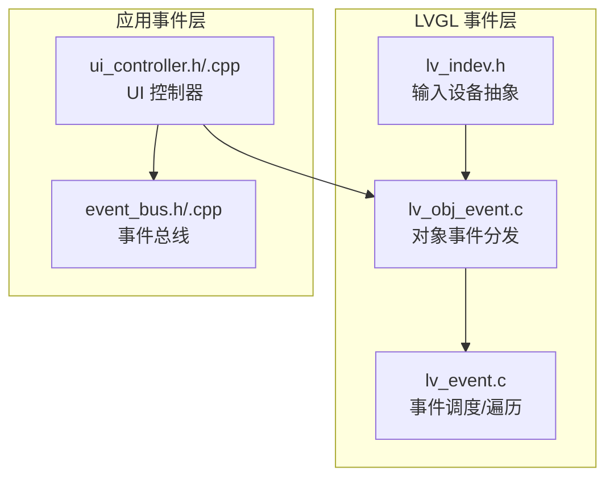
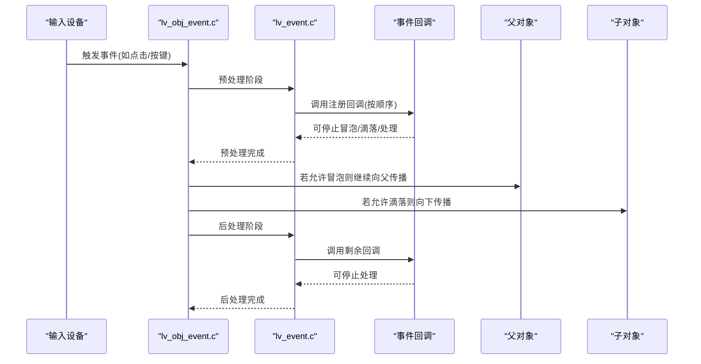
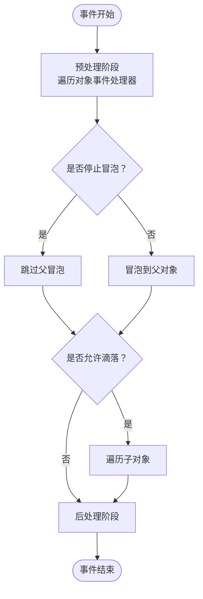
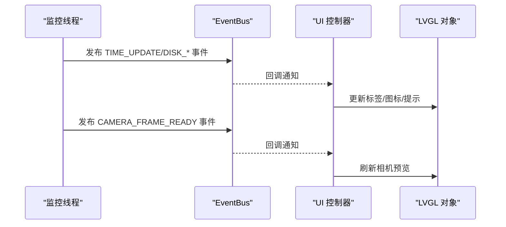
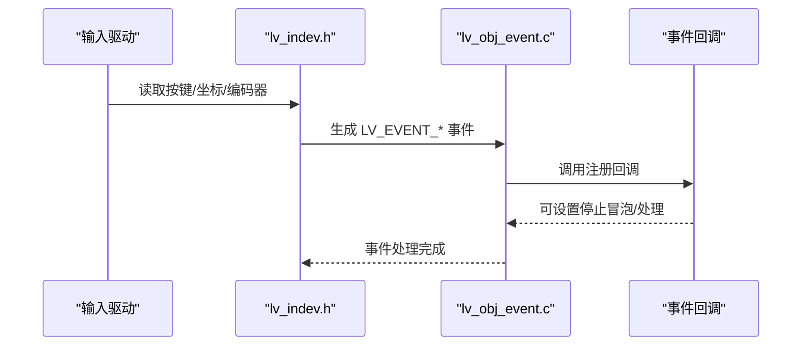
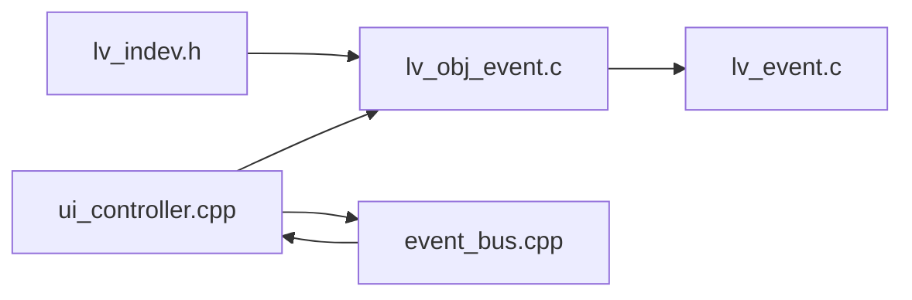

# 事件处理系统

<cite>
**本文引用的文件**
- [libs/lvgl/src/misc/lv_event.c](file://libs/lvgl/src/misc/lv_event.c)
- [libs/lvgl/src/misc/lv_event.h](file://libs/lvgl/src/misc/lv_event.h)
- [libs/lvgl/src/core/lv_obj_event.c](file://libs/lvgl/src/core/lv_obj_event.c)
- [libs/lvgl/src/core/lv_obj_event.h](file://libs/lvgl/src/core/lv_obj_event.h)
- [libs/lvgl/src/indev/lv_indev.h](file://libs/lvgl/src/indev/lv_indev.h)
- [src/business/event_bus.h](file://src/business/event_bus.h)
- [src/business/event_bus.cpp](file://src/business/event_bus.cpp)
- [src/ui/ui_controller.h](file://src/ui/ui_controller.h)
- [src/ui/ui_controller.cpp](file://src/ui/ui_controller.cpp)
- [libs/lvgl/examples/event/lv_example_event_button.c](file://libs/lvgl/examples/event/lv_example_event_button.c)
- [libs/lvgl/examples/event/lv_example_event_click.c](file://libs/lvgl/examples/event/lv_example_event_click.c)
- [libs/lvgl/examples/event/lv_example_event_bubble.c](file://libs/lvgl/examples/event/lv_example_event_bubble.c)
- [libs/lvgl/examples/event/lv_example_event_draw.c](file://libs/lvgl/examples/event/lv_example_event_draw.c)
- [libs/lvgl/examples/event/lv_example_event_streak.c](file://libs/lvgl/examples/event/lv_example_event_streak.c)
</cite>

## 目录
1. [简介](#简介)
2. [项目结构](#项目结构)
3. [核心组件](#核心组件)
4. [架构总览](#架构总览)
5. [详细组件分析](#详细组件分析)
6. [依赖关系分析](#依赖关系分析)
7. [性能考量](#性能考量)
8. [故障排查指南](#故障排查指南)
9. [结论](#结论)
10. [附录](#附录)

## 简介
本文件系统性地阐述 SmartAttendance 项目中的事件处理体系，涵盖 LVGL 事件模型、UI 控制器事件分发、异步事件与后台服务集成、用户交互事件（触摸、键盘、手势）处理流程、事件性能优化策略以及调试与排障方法。文档面向不同技术背景的读者，既提供高层架构说明，也给出可直接定位到源码的参考路径。

## 项目结构
本项目在 LVGL 之上构建了 UI 控制器与业务事件总线，形成“LVGL 事件”与“应用事件”的双层事件处理通道：
- LVGL 事件层：负责 UI 组件生命周期、输入设备事件、绘制事件等，由对象事件分发器驱动冒泡与滴落。
- 应用事件层：通过 EventBus 提供跨线程、跨模块的业务事件发布/订阅，典型场景包括时间刷新、磁盘状态、摄像头帧到达等。

图示来源
- [libs/lvgl/src/core/lv_obj_event.c](file://libs/lvgl/src/core/lv_obj_event.c)
- [libs/lvgl/src/misc/lv_event.c](file://libs/lvgl/src/misc/lv_event.c)
- [libs/lvgl/src/indev/lv_indev.h](file://libs/lvgl/src/indev/lv_indev.h)
- [src/business/event_bus.h](file://src/business/event_bus.h)
- [src/business/event_bus.cpp](file://src/business/event_bus.cpp)
- [src/ui/ui_controller.h](file://src/ui/ui_controller.h)
- [src/ui/ui_controller.cpp](file://src/ui/ui_controller.cpp)

章节来源
- [libs/lvgl/src/core/lv_obj_event.c](file://libs/lvgl/src/core/lv_obj_event.c)
- [libs/lvgl/src/misc/lv_event.c](file://libs/lvgl/src/misc/lv_event.c)
- [libs/lvgl/src/indev/lv_indev.h](file://libs/lvgl/src/indev/lv_indev.h)
- [src/business/event_bus.h](file://src/business/event_bus.h)
- [src/business/event_bus.cpp](file://src/business/event_bus.cpp)
- [src/ui/ui_controller.h](file://src/ui/ui_controller.h)
- [src/ui/ui_controller.cpp](file://src/ui/ui_controller.cpp)

## 核心组件
- LVGL 事件内核
  - 事件描述与调度：事件发送、预处理/后处理两阶段、事件处理器数组、删除标记与清理。
  - 事件代码枚举：输入设备事件、绘制事件、特殊事件、通用事件等。
- 对象事件分发
  - 事件发送链路：预处理 → 类默认事件 → 后处理；支持冒泡到父对象、滴落到子对象。
  - 冒泡/滴落规则：根据事件类型与对象标志位控制传播方向。
- 输入设备事件
  - 输入设备类型、读回调、长按/滚动/手势参数、按键与编码器支持。
- 应用事件总线
  - 线程安全的发布/订阅，支持时间、磁盘、摄像头帧等系统事件。
- UI 控制器
  - 启动后台线程，定时发布系统事件；与 EventBus 协同驱动 UI 更新。

章节来源
- [libs/lvgl/src/misc/lv_event.h](file://libs/lvgl/src/misc/lv_event.h)
- [libs/lvgl/src/misc/lv_event.c](file://libs/lvgl/src/misc/lv_event.c)
- [libs/lvgl/src/core/lv_obj_event.h](file://libs/lvgl/src/core/lv_obj_event.h)
- [libs/lvgl/src/core/lv_obj_event.c](file://libs/lvgl/src/core/lv_obj_event.c)
- [libs/lvgl/src/indev/lv_indev.h](file://libs/lvgl/src/indev/lv_indev.h)
- [src/business/event_bus.h](file://src/business/event_bus.h)
- [src/business/event_bus.cpp](file://src/business/event_bus.cpp)
- [src/ui/ui_controller.h](file://src/ui/ui_controller.h)
- [src/ui/ui_controller.cpp](file://src/ui/ui_controller.cpp)

## 架构总览
LVGL 事件处理采用“对象树 + 事件处理器数组”的设计，事件在对象上注册，按预处理/后处理两阶段遍历执行。输入设备事件首先作用于当前活动对象，随后根据标志位决定是否冒泡至父节点或滴落至子节点。应用层通过 EventBus 在后台线程中发布系统事件，UI 控制器订阅这些事件并驱动界面更新。

图示来源
- [libs/lvgl/src/core/lv_obj_event.c](file://libs/lvgl/src/core/lv_obj_event.c)
- [libs/lvgl/src/misc/lv_event.c](file://libs/lvgl/src/misc/lv_event.c)

章节来源
- [libs/lvgl/src/core/lv_obj_event.c](file://libs/lvgl/src/core/lv_obj_event.c)
- [libs/lvgl/src/misc/lv_event.c](file://libs/lvgl/src/misc/lv_event.c)

## 详细组件分析

### LVGL 事件模型与事件处理器
- 事件类型分类
  - 输入设备事件：按下、持续、释放、短/单/双/三击、长按、滚动、手势、焦点变化、悬停等。
  - 绘制事件：主绘/后绘开始/结束、任务添加、额外绘制区域等。
  - 特殊事件：值变更、插入文本、刷新、就绪/取消等。
  - 其他事件：创建/删除、子对象变更、屏幕切换、尺寸/样式/布局变化等。
- 事件处理器注册
  - 对象级注册：为特定对象注册回调，按过滤条件（事件代码或全部）触发。
  - 输入设备级注册：为输入设备注册回调，常用于设备层面的事件拦截与处理。
- 事件冒泡与滴落
  - 冒泡：事件向上传递至父对象，受对象标志位与事件类型共同约束。
  - 滴落：事件向下传递至子对象，同样受标志位与事件类型约束。
- 事件停止控制
  - 停止冒泡、停止滴落、停止当前事件处理，用于精确控制事件流。

图示来源
- [libs/lvgl/src/core/lv_obj_event.c](file://libs/lvgl/src/core/lv_obj_event.c)
- [libs/lvgl/src/misc/lv_event.c](file://libs/lvgl/src/misc/lv_event.c)

章节来源
- [libs/lvgl/src/misc/lv_event.h](file://libs/lvgl/src/misc/lv_event.h)
- [libs/lvgl/src/misc/lv_event.c](file://libs/lvgl/src/misc/lv_event.c)
- [libs/lvgl/src/core/lv_obj_event.h](file://libs/lvgl/src/core/lv_obj_event.h)
- [libs/lvgl/src/core/lv_obj_event.c](file://libs/lvgl/src/core/lv_obj_event.c)

### UI 控制器的事件处理架构
- 事件分发
  - 后台线程定时发布系统事件（时间刷新、磁盘状态、摄像头帧到达）。
  - UI 控制器订阅事件，更新界面状态或触发业务逻辑。
- 优先级管理
  - LVGL 事件处理器按注册顺序依次执行；可通过停止控制改变处理顺序的影响范围。
  - 应用事件总线采用队列式回调，避免并发竞争。
- 异步事件处理
  - 使用独立线程执行监控与采集，降低对 UI 主循环的影响。
  - 通过互斥量保护共享资源，确保线程安全。

图示来源
- [src/ui/ui_controller.cpp](file://src/ui/ui_controller.cpp)
- [src/business/event_bus.cpp](file://src/business/event_bus.cpp)
- [src/business/event_bus.h](file://src/business/event_bus.h)

章节来源
- [src/ui/ui_controller.h](file://src/ui/ui_controller.h)
- [src/ui/ui_controller.cpp](file://src/ui/ui_controller.cpp)
- [src/business/event_bus.h](file://src/business/event_bus.h)
- [src/business/event_bus.cpp](file://src/business/event_bus.cpp)

### 用户交互事件处理流程
- 触摸事件
  - 输入设备读取当前坐标与状态，生成按下/移动/释放事件。
  - LVGL 根据命中测试选择最顶层对象，触发事件回调。
  - 支持长按、滚动、手势识别（滑动/旋转/捏合等）。
- 键盘事件
  - 键盘/编码器输入通过输入设备事件传递，回调中读取键值或旋转差值。
- 手势识别
  - 输入设备维护手势状态机，输出手势事件供 UI 使用。

图示来源
- [libs/lvgl/src/indev/lv_indev.h](file://libs/lvgl/src/indev/lv_indev.h)
- [libs/lvgl/src/core/lv_obj_event.c](file://libs/lvgl/src/core/lv_obj_event.c)

章节来源
- [libs/lvgl/src/indev/lv_indev.h](file://libs/lvgl/src/indev/lv_indev.h)
- [libs/lvgl/src/core/lv_obj_event.c](file://libs/lvgl/src/core/lv_obj_event.c)

### 具体代码示例与实践路径
- 事件绑定与监听
  - 为按钮绑定多种事件，实时显示最近一次事件类型。
    - 示例路径：[事件绑定示例](file://libs/lvgl/examples/event/lv_example_event_button.c)
  - 仅监听点击事件，统计点击次数。
    - 示例路径：[点击事件示例](file://libs/lvgl/examples/event/lv_example_event_click.c)
- 事件冒泡演示
  - 为容器注册事件回调，观察点击从子按钮冒泡到容器的效果。
    - 示例路径：[事件冒泡示例](file://libs/lvgl/examples/event/lv_example_event_bubble.c)
- 自定义事件创建
  - 注册自定义事件 ID 并发送，作为扩展事件机制的参考。
    - 参考路径：[自定义事件注册接口](file://libs/lvgl/src/misc/lv_event.h)
- 绘制事件处理
  - 订阅绘制任务添加事件，在回调中绘制自定义图形。
    - 示例路径：[绘制事件示例](file://libs/lvgl/examples/event/lv_example_event_draw.c)
- 连续点击计数
  - 使用输入设备提供的连击计数功能，显示单击/双击/三击效果。
    - 示例路径：[连击计数示例](file://libs/lvgl/examples/event/lv_example_event_streak.c)

章节来源
- [libs/lvgl/examples/event/lv_example_event_button.c](file://libs/lvgl/examples/event/lv_example_event_button.c)
- [libs/lvgl/examples/event/lv_example_event_click.c](file://libs/lvgl/examples/event/lv_example_event_click.c)
- [libs/lvgl/examples/event/lv_example_event_bubble.c](file://libs/lvgl/examples/event/lv_example_event_bubble.c)
- [libs/lvgl/examples/event/lv_example_event_draw.c](file://libs/lvgl/examples/event/lv_example_event_draw.c)
- [libs/lvgl/examples/event/lv_example_event_streak.c](file://libs/lvgl/examples/event/lv_example_event_streak.c)
- [libs/lvgl/src/misc/lv_event.h](file://libs/lvgl/src/misc/lv_event.h)

## 依赖关系分析
- 组件耦合
  - UI 控制器依赖 EventBus 实现跨线程事件通信，耦合度低，便于扩展。
  - LVGL 对象事件与输入设备解耦，事件回调通过过滤器精确匹配。
- 直接与间接依赖
  - 对象事件分发依赖事件内核的遍历与清理机制。
  - 输入设备事件最终进入对象事件分发器，再由事件内核统一调度。
- 循环依赖
  - 未发现循环依赖；事件总线为单向发布/订阅。
- 外部依赖与集成点
  - 输入驱动与 HAL 层对接，提供按键、触摸、编码器等输入。
  - 绘制事件与渲染管线对接，用于自定义绘制。

图示来源
- [libs/lvgl/src/indev/lv_indev.h](file://libs/lvgl/src/indev/lv_indev.h)
- [libs/lvgl/src/core/lv_obj_event.c](file://libs/lvgl/src/core/lv_obj_event.c)
- [libs/lvgl/src/misc/lv_event.c](file://libs/lvgl/src/misc/lv_event.c)
- [src/ui/ui_controller.cpp](file://src/ui/ui_controller.cpp)
- [src/business/event_bus.cpp](file://src/business/event_bus.cpp)

章节来源
- [libs/lvgl/src/indev/lv_indev.h](file://libs/lvgl/src/indev/lv_indev.h)
- [libs/lvgl/src/core/lv_obj_event.c](file://libs/lvgl/src/core/lv_obj_event.c)
- [libs/lvgl/src/misc/lv_event.c](file://libs/lvgl/src/misc/lv_event.c)
- [src/ui/ui_controller.cpp](file://src/ui/ui_controller.cpp)
- [src/business/event_bus.cpp](file://src/business/event_bus.cpp)

## 性能考量
- 事件去抖与节流
  - 对高频输入事件（如滚动/拖拽）可在回调中引入去抖/节流策略，减少无效处理。
- 批量处理
  - 将多个小事件合并为批次处理，降低回调频率与上下文切换开销。
- 内存与生命周期
  - 使用事件删除标记与清理机制，避免对象删除导致的悬挂指针与内存泄漏。
  - 在事件回调中及时释放 user_data，必要时使用辅助释放函数。
- 事件停止控制
  - 合理使用停止冒泡/滴落/处理，避免无关对象参与昂贵操作。
- 线程与锁
  - EventBus 发布采用复制回调列表的方式，避免在持有锁的情况下执行回调；UI 控制器使用互斥量保护共享数据。

章节来源
- [libs/lvgl/src/misc/lv_event.c](file://libs/lvgl/src/misc/lv_event.c)
- [libs/lvgl/src/core/lv_obj_event.c](file://libs/lvgl/src/core/lv_obj_event.c)
- [src/business/event_bus.cpp](file://src/business/event_bus.cpp)
- [src/ui/ui_controller.cpp](file://src/ui/ui_controller.cpp)

## 故障排查指南
- 事件未触发
  - 检查对象是否启用相应事件标志位（冒泡/滴落）。
  - 确认事件过滤器与事件代码一致。
- 事件被意外截断
  - 检查回调中是否调用了停止冒泡/滴落/处理。
- 对象已被删除但仍被访问
  - 确保在事件回调中检测对象删除状态，避免使用已删除对象。
- 性能异常
  - 关注高频事件的处理成本，考虑去抖/节流与批处理。
- 线程安全问题
  - EventBus 发布时避免在临界区内执行耗时操作；UI 控制器对共享资源加锁访问。

章节来源
- [libs/lvgl/src/core/lv_obj_event.c](file://libs/lvgl/src/core/lv_obj_event.c)
- [libs/lvgl/src/misc/lv_event.c](file://libs/lvgl/src/misc/lv_event.c)
- [src/business/event_bus.cpp](file://src/business/event_bus.cpp)
- [src/ui/ui_controller.cpp](file://src/ui/ui_controller.cpp)

## 结论
本项目通过 LVGL 事件内核与 UI 控制器、EventBus 的协同，实现了清晰、可扩展、高性能的事件处理体系。LVGL 提供了强大的 UI 事件模型与冒泡/滴落机制，应用层通过 EventBus 实现后台异步事件的可靠分发。结合合理的性能优化与严格的故障排查流程，能够满足复杂嵌入式 UI 场景下的事件处理需求。

## 附录
- 常用事件代码速览
  - 输入设备：按下、持续、释放、短/单/双/三击、长按、滚动、手势、焦点变化、悬停等。
  - 绘制：主绘/后绘开始/结束、任务添加、额外绘制区域等。
  - 特殊：值变更、插入文本、刷新、就绪/取消等。
  - 其他：创建/删除、子对象变更、屏幕切换、尺寸/样式/布局变化等。
- 接口参考路径
  - 事件内核与事件代码：[事件头文件](file://libs/lvgl/src/misc/lv_event.h)
  - 对象事件分发与冒泡/滴落：[对象事件实现](file://libs/lvgl/src/core/lv_obj_event.c)
  - 输入设备抽象与事件：[输入设备头文件](file://libs/lvgl/src/indev/lv_indev.h)
  - 应用事件总线：[事件总线头文件](file://src/business/event_bus.h)、[事件总线实现](file://src/business/event_bus.cpp)
  - UI 控制器：[UI 控制器头文件](file://src/ui/ui_controller.h)、[UI 控制器实现](file://src/ui/ui_controller.cpp)