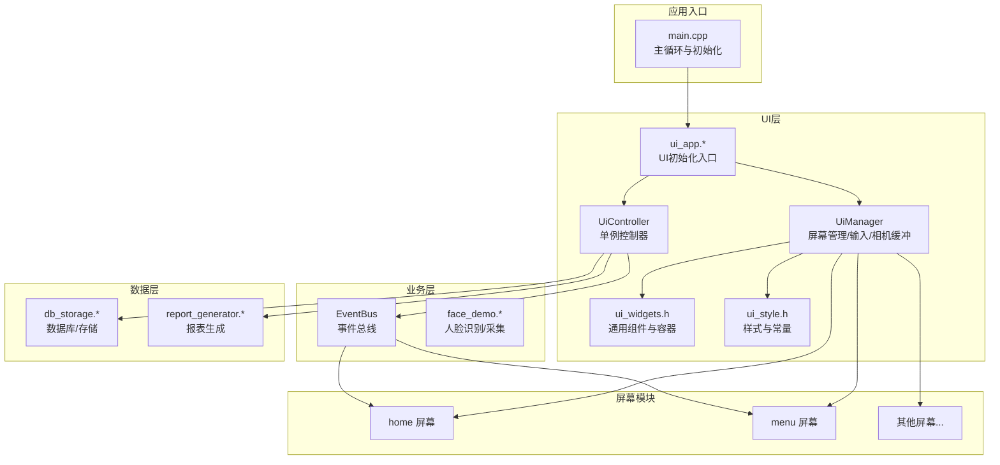
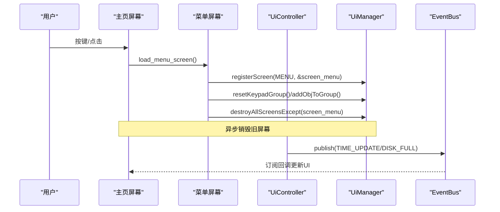
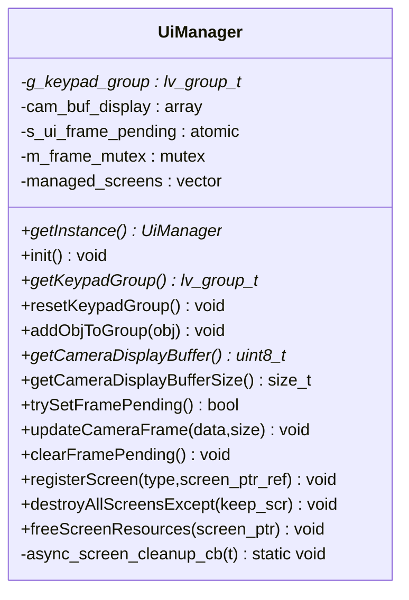
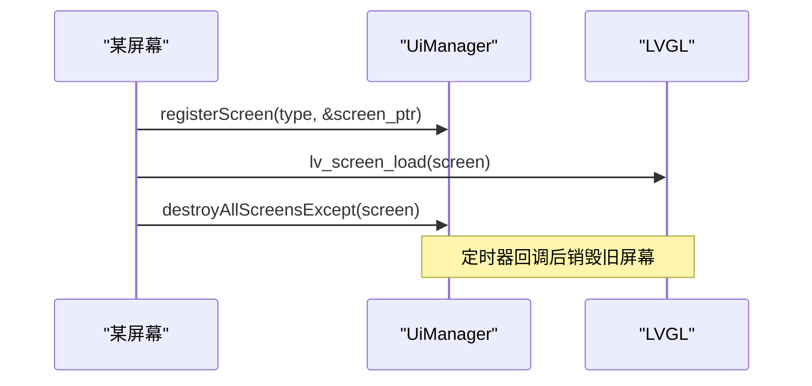
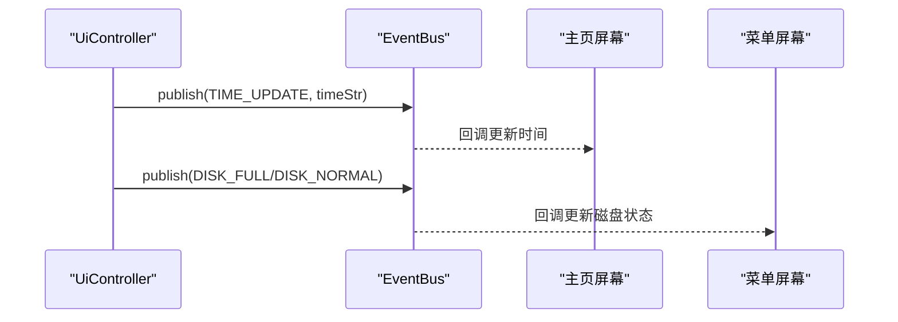
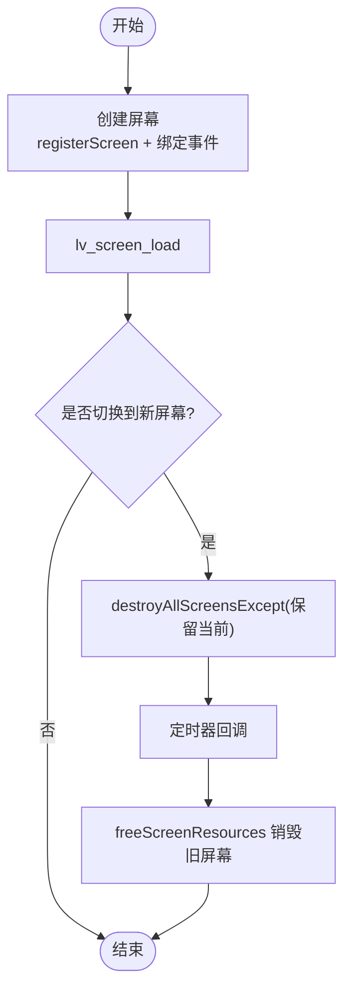
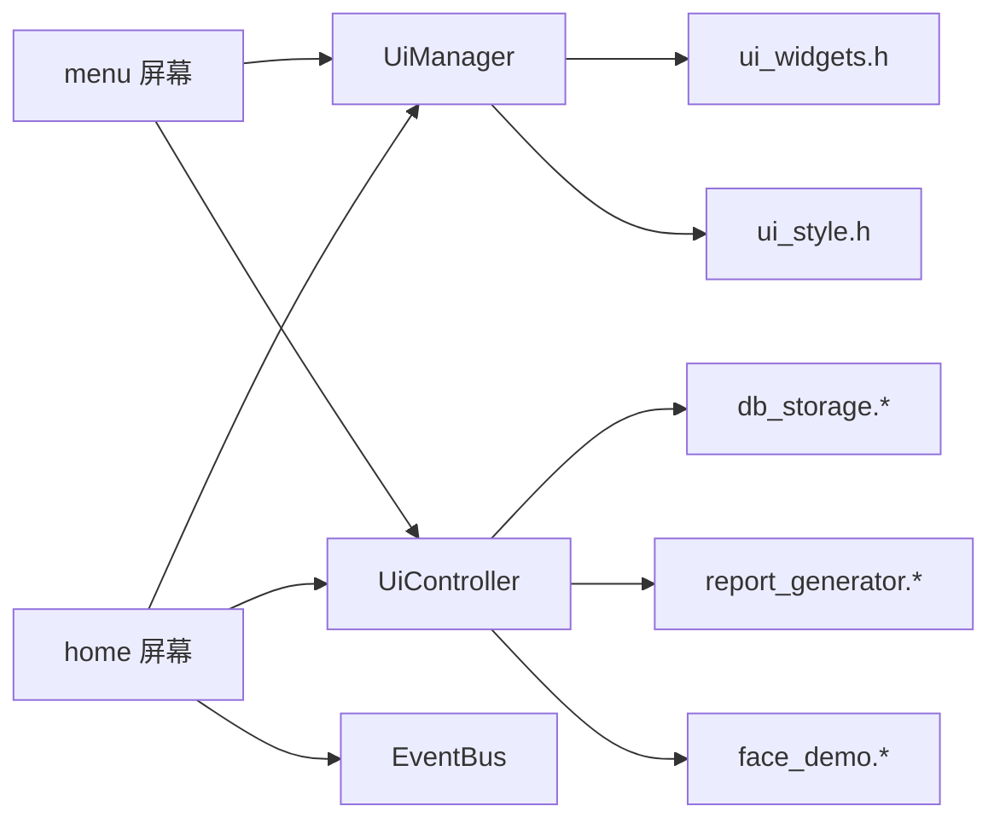

# 屏幕管理机制

<cite>
**本文引用的文件**
- [src/ui/managers/ui_manager.h](file://src/ui/managers/ui_manager.h)
- [src/ui/managers/ui_manager.cpp](file://src/ui/managers/ui_manager.cpp)
- [src/ui/ui_controller.h](file://src/ui/ui_controller.h)
- [src/ui/ui_controller.cpp](file://src/ui/ui_controller.cpp)
- [src/business/event_bus.h](file://src/business/event_bus.h)
- [src/ui/screens/home/ui_scr_home.h](file://src/ui/screens/home/ui_scr_home.h)
- [src/ui/screens/home/ui_scr_home.cpp](file://src/ui/screens/home/ui_scr_home.cpp)
- [src/ui/screens/menu/ui_scr_menu.h](file://src/ui/screens/menu/ui_scr_menu.h)
- [src/ui/screens/menu/ui_scr_menu.cpp](file://src/ui/screens/menu/ui_scr_menu.cpp)
- [src/ui/common/ui_style.h](file://src/ui/common/ui_style.h)
- [src/ui/common/ui_widgets.h](file://src/ui/common/ui_widgets.h)
- [src/main.cpp](file://src/main.cpp)
</cite>

## 目录
1. [简介](#简介)
2. [项目结构](#项目结构)
3. [核心组件](#核心组件)
4. [架构总览](#架构总览)
5. [详细组件分析](#详细组件分析)
6. [依赖关系分析](#依赖关系分析)
7. [性能考量](#性能考量)
8. [故障排查指南](#故障排查指南)
9. [结论](#结论)
10. [附录](#附录)

## 简介
本文件系统化阐述 SmartAttendance 项目中的屏幕管理机制，重点覆盖以下方面：
- 屏幕生命周期管理：屏幕创建、加载、事件绑定、资源清理与销毁。
- 导航栈与切换：基于屏幕类型枚举与注册表的屏幕切换流程，以及异步销毁策略。
- 状态保存与恢复：通过事件总线与控制器层的数据桥接，实现跨屏幕的状态同步。
- UiManager 设计模式：单例模式、屏幕注册机制、输入组与摄像头帧共享缓冲区。
- 屏幕间通信：参数传递、回调函数与事件通知（EventBus）。
- 动画与渲染：基于 LVGL 的图像显示与定时刷新。
- 内存优化与性能监控：异步销毁、互斥锁保护、原子标志与定时器驱动。
- 最佳实践与常见陷阱：避免野指针、重复释放、竞态条件与内存泄漏。

## 项目结构
项目采用分层架构，UI 层通过控制器层与业务/数据层交互；屏幕管理集中在 UiManager，事件通过 EventBus 解耦。

图表来源
- [src/main.cpp:187-246](file://src/main.cpp#L187-L246)
- [src/ui/managers/ui_manager.h:71-156](file://src/ui/managers/ui_manager.h#L71-L156)
- [src/ui/managers/ui_manager.cpp:1-125](file://src/ui/managers/ui_manager.cpp#L1-125)
- [src/ui/ui_controller.h:21-106](file://src/ui/ui_controller.h#L21-L106)
- [src/ui/ui_controller.cpp:1-417](file://src/ui/ui_controller.cpp#L1-L417)
- [src/business/event_bus.h:21-41](file://src/business/event_bus.h#L21-L41)
- [src/ui/common/ui_widgets.h:10-152](file://src/ui/common/ui_widgets.h#L10-L152)
- [src/ui/common/ui_style.h:7-48](file://src/ui/common/ui_style.h#L7-L48)

章节来源
- [src/main.cpp:187-246](file://src/main.cpp#L187-L246)
- [src/ui/managers/ui_manager.h:12-69](file://src/ui/managers/ui_manager.h#L12-L69)
- [src/ui/managers/ui_manager.cpp:15-32](file://src/ui/managers/ui_manager.cpp#L15-L32)
- [src/ui/ui_controller.h:21-106](file://src/ui/ui_controller.h#L21-L106)
- [src/ui/ui_controller.cpp:363-393](file://src/ui/ui_controller.cpp#L363-L393)
- [src/business/event_bus.h:10-16](file://src/business/event_bus.h#L10-L16)

## 核心组件
- UiManager：单例屏幕管理器，负责屏幕注册、输入组、摄像头帧缓冲与异步销毁。
- UiController：单例控制器，封装业务/数据层调用，提供系统状态、用户管理、记录查询、报表导出、摄像头帧更新等能力，并通过 EventBus 发布系统事件。
- EventBus：轻量事件总线，支持订阅/发布，线程安全。
- 屏幕模块：每个屏幕独立实现 load_* 接口，负责自身创建、事件绑定与切换调用。
- 通用组件与样式：ui_widgets.h 提供基础容器与控件创建工具；ui_style.h 定义主题与尺寸常量。

章节来源
- [src/ui/managers/ui_manager.h:71-156](file://src/ui/managers/ui_manager.h#L71-L156)
- [src/ui/managers/ui_manager.cpp:60-83](file://src/ui/managers/ui_manager.cpp#L60-L83)
- [src/ui/ui_controller.h:21-106](file://src/ui/ui_controller.h#L21-L106)
- [src/ui/ui_controller.cpp:363-417](file://src/ui/ui_controller.cpp#L363-L417)
- [src/business/event_bus.h:21-41](file://src/business/event_bus.h#L21-L41)
- [src/ui/common/ui_style.h:7-48](file://src/ui/common/ui_style.h#L7-L48)
- [src/ui/common/ui_widgets.h:10-152](file://src/ui/common/ui_widgets.h#L10-L152)

## 架构总览
屏幕管理遵循“控制器-管理器-屏幕”的分层解耦：
- 控制器负责业务与系统事件，向管理器提供数据与触发刷新。
- 管理器集中管理屏幕生命周期、输入焦点与共享资源。
- 屏幕各自负责 UI 布局、事件回调与导航调用。

图表来源
- [src/ui/screens/home/ui_scr_home.cpp:226-258](file://src/ui/screens/home/ui_scr_home.cpp#L226-L258)
- [src/ui/screens/menu/ui_scr_menu.cpp:124-225](file://src/ui/screens/menu/ui_scr_menu.cpp#L124-L225)
- [src/ui/managers/ui_manager.cpp:118-125](file://src/ui/managers/ui_manager.cpp#L118-L125)
- [src/ui/ui_controller.cpp:363-393](file://src/ui/ui_controller.cpp#L363-L393)
- [src/business/event_bus.h:25-29](file://src/business/event_bus.h#L25-L29)

## 详细组件分析

### UiManager 类与单例模式
- 单例：通过静态实例与静态获取方法提供全局唯一访问点。
- 屏幕注册：registerScreen 将屏幕指针引用登记到管理列表，便于统一销毁。
- 输入组：init/resetKeypadGroup/addObjToGroup 管理键盘/编码器输入焦点。
- 摄像头缓冲：提供共享 RGB888 缓冲区与原子帧待更新标志，配合互斥锁保护。
- 异步销毁：destroyAllScreensExcept 启动一次性定时器，在事件回调完成后安全销毁非当前屏幕。

图表来源
- [src/ui/managers/ui_manager.h:71-156](file://src/ui/managers/ui_manager.h#L71-L156)
- [src/ui/managers/ui_manager.cpp:6-13](file://src/ui/managers/ui_manager.cpp#L6-L13)

章节来源
- [src/ui/managers/ui_manager.h:71-156](file://src/ui/managers/ui_manager.h#L71-L156)
- [src/ui/managers/ui_manager.cpp:60-125](file://src/ui/managers/ui_manager.cpp#L60-L125)

### 屏幕注册机制与生命周期
- 注册：屏幕在创建时调用 registerScreen，传入屏幕类型与全局屏幕指针引用，确保管理器可追踪。
- 加载：load_* 函数负责创建 UI、绑定事件、加入输入组、加载屏幕并调用 destroyAllScreensExcept 保留当前屏幕。
- 清理：屏幕事件回调中置空关键控件指针，避免后台事件访问野指针；UiManager 在异步定时器中统一销毁非当前屏幕。

图表来源
- [src/ui/screens/home/ui_scr_home.cpp:146-151](file://src/ui/screens/home/ui_scr_home.cpp#L146-L151)
- [src/ui/screens/home/ui_scr_home.cpp:256-257](file://src/ui/screens/home/ui_scr_home.cpp#L256-L257)
- [src/ui/managers/ui_manager.cpp:118-125](file://src/ui/managers/ui_manager.cpp#L118-L125)

章节来源
- [src/ui/screens/home/ui_scr_home.cpp:127-224](file://src/ui/screens/home/ui_scr_home.cpp#L127-L224)
- [src/ui/screens/menu/ui_scr_menu.cpp:124-225](file://src/ui/screens/menu/ui_scr_menu.cpp#L124-L225)
- [src/ui/managers/ui_manager.cpp:60-83](file://src/ui/managers/ui_manager.cpp#L60-L83)

### 事件路由系统（EventBus）
- 事件类型：时间更新、磁盘状态、摄像头帧就绪等。
- 订阅/发布：屏幕通过 EventBus 订阅事件，控制器在后台线程周期性发布事件，屏幕使用异步调用更新 UI。
- 线程安全：内部使用互斥锁保护订阅者列表。

图表来源
- [src/business/event_bus.h:10-16](file://src/business/event_bus.h#L10-L16)
- [src/ui/ui_controller.cpp:377-393](file://src/ui/ui_controller.cpp#L377-L393)
- [src/ui/screens/home/ui_scr_home.cpp:235-250](file://src/ui/screens/home/ui_scr_home.cpp#L235-L250)
- [src/ui/screens/menu/ui_scr_menu.cpp:31-121](file://src/ui/screens/menu/ui_scr_menu.cpp#L31-L121)

章节来源
- [src/business/event_bus.h:21-41](file://src/business/event_bus.h#L21-L41)
- [src/ui/ui_controller.cpp:363-393](file://src/ui/ui_controller.cpp#L363-L393)
- [src/ui/screens/home/ui_scr_home.cpp:235-250](file://src/ui/screens/home/ui_scr_home.cpp#L235-L250)
- [src/ui/screens/menu/ui_scr_menu.cpp:31-121](file://src/ui/screens/menu/ui_scr_menu.cpp#L31-L121)

### 屏幕间通信方式
- 参数传递：通过屏幕 load_* 接口传入用户 ID、筛选条件等；控制器层提供查询与导出接口。
- 回调函数：屏幕事件回调处理按键/点击；异步回调用于 UI 更新。
- 事件通知：控制器通过 EventBus 发布系统事件，屏幕订阅并更新显示。

章节来源
- [src/ui/screens/menu/ui_scr_menu.cpp:95-121](file://src/ui/screens/menu/ui_scr_menu.cpp#L95-L121)
- [src/ui/screens/home/ui_scr_home.cpp:235-250](file://src/ui/screens/home/ui_scr_home.cpp#L235-L250)
- [src/ui/ui_controller.h:48-84](file://src/ui/ui_controller.h#L48-L84)

### 屏幕创建、切换与销毁完整流程
- 创建：屏幕 load_* 函数内部调用 create_base_screen 构建基础布局，注册屏幕类型，绑定事件与输入组。
- 切换：调用 UiManager::destroyAllScreensExcept 保留当前屏幕，确保切换安全。
- 销毁：异步定时器回调遍历注册表，销毁非当前屏幕对象，置空指针防止野指针。

图表来源
- [src/ui/screens/home/ui_scr_home.cpp:146-151](file://src/ui/screens/home/ui_scr_home.cpp#L146-L151)
- [src/ui/screens/home/ui_scr_home.cpp:256-257](file://src/ui/screens/home/ui_scr_home.cpp#L256-L257)
- [src/ui/managers/ui_manager.cpp:118-125](file://src/ui/managers/ui_manager.cpp#L118-L125)

章节来源
- [src/ui/screens/home/ui_scr_home.cpp:127-224](file://src/ui/screens/home/ui_scr_home.cpp#L127-L224)
- [src/ui/managers/ui_manager.cpp:89-115](file://src/ui/managers/ui_manager.cpp#L89-L115)

### 摄像头帧显示与动画效果
- 帧缓冲：UiManager 提供 RGB888 缓冲区，UiController 通过 getDisplayFrame 与 updateCameraFrame 更新帧数据。
- 刷新机制：主页屏幕定时器周期性触发 trySetFramePending/clearFramePending，配合 lv_obj_invalidate 触发重绘。
- 动画：LVGL 支持多种动画与过渡效果，可在屏幕中结合布局与样式实现平滑切换与视觉反馈。

章节来源
- [src/ui/managers/ui_manager.h:84-103](file://src/ui/managers/ui_manager.h#L84-L103)
- [src/ui/managers/ui_manager.cpp:49-56](file://src/ui/managers/ui_manager.cpp#L49-L56)
- [src/ui/ui_controller.cpp:211-230](file://src/ui/ui_controller.cpp#L211-L230)
- [src/ui/screens/home/ui_scr_home.cpp:105-116](file://src/ui/screens/home/ui_scr_home.cpp#L105-L116)

### 内存优化策略
- 异步销毁：通过一次性定时器在事件回调结束后销毁旧屏幕，避免竞态与崩溃。
- 指针置空：屏幕事件回调中将控件指针置空，防止后台访问。
- 原子标志：s_ui_frame_pending 使用 compare-and-swap 保证帧更新的原子性。
- 互斥锁：m_frame_mutex 保护共享缓冲区，避免并发写入。

章节来源
- [src/ui/managers/ui_manager.cpp:89-115](file://src/ui/managers/ui_manager.cpp#L89-L115)
- [src/ui/screens/home/ui_scr_home.cpp:62-80](file://src/ui/screens/home/ui_scr_home.cpp#L62-L80)
- [src/ui/managers/ui_manager.h:137-141](file://src/ui/managers/ui_manager.h#L137-L141)
- [src/ui/ui_controller.cpp:211-230](file://src/ui/ui_controller.cpp#L211-L230)

### 性能监控方法
- 主循环节拍：main.cpp 中通过 lv_timer_handler 与 usleep 控制主循环频率，保证 LVGL 心跳与 CPU 占用平衡。
- 事件频率：UiController 的监控线程以 1 秒为粒度发布时间事件，磁盘检测每 5 秒一次，避免高频 IO。
- 帧率控制：主页定时器约 16ms 触发一次摄像头刷新，兼顾流畅度与 CPU 占用。

章节来源
- [src/main.cpp:229-238](file://src/main.cpp#L229-L238)
- [src/ui/ui_controller.cpp:377-416](file://src/ui/ui_controller.cpp#L377-L416)

## 依赖关系分析
- 屏幕模块依赖 UiManager（注册、输入组、销毁）、UiController（系统状态、数据查询、摄像头帧）、EventBus（事件订阅）。
- UiController 依赖数据层与业务层，向上提供统一接口。
- 通用组件与样式为所有屏幕提供一致的 UI 基础。

图表来源
- [src/ui/screens/home/ui_scr_home.cpp:13-18](file://src/ui/screens/home/ui_scr_home.cpp#L13-L18)
- [src/ui/screens/menu/ui_scr_menu.cpp:7-15](file://src/ui/screens/menu/ui_scr_menu.cpp#L7-L15)
- [src/ui/ui_controller.cpp:9-13](file://src/ui/ui_controller.cpp#L9-L13)
- [src/ui/managers/ui_manager.cpp:1-5](file://src/ui/managers/ui_manager.cpp#L1-L5)
- [src/ui/common/ui_widgets.h:10-17](file://src/ui/common/ui_widgets.h#L10-L17)
- [src/ui/common/ui_style.h:7-10](file://src/ui/common/ui_style.h#L7-L10)

章节来源
- [src/ui/screens/home/ui_scr_home.cpp:13-18](file://src/ui/screens/home/ui_scr_home.cpp#L13-L18)
- [src/ui/screens/menu/ui_scr_menu.cpp:7-15](file://src/ui/screens/menu/ui_scr_menu.cpp#L7-L15)
- [src/ui/ui_controller.cpp:9-13](file://src/ui/ui_controller.cpp#L9-L13)
- [src/ui/managers/ui_manager.cpp:1-5](file://src/ui/managers/ui_manager.cpp#L1-L5)

## 性能考量
- 主循环节流：限制最小/最大休眠时间，避免过快轮询或卡顿。
- 事件频率控制：时间与磁盘事件按秒/5秒粒度发布，降低开销。
- 帧刷新策略：定时器驱动刷新，避免阻塞 UI 线程。
- 内存回收：异步销毁与指针置空减少主线程压力，提升稳定性。

[本节为通用性能讨论，无需列出章节来源]

## 故障排查指南
- 野指针与崩溃：确保屏幕销毁回调中置空控件指针；避免在后台线程直接操作 LVGL 对象。
- 重复释放：UiManager 在异步定时器中统一销毁，避免多次 delete。
- 竞态条件：共享帧缓冲使用互斥锁与原子标志；输入组需在加载前 reset 并重新 add。
- 事件未更新：确认订阅回调使用异步调用更新 UI；检查 EventBus 订阅与发布顺序。

章节来源
- [src/ui/screens/home/ui_scr_home.cpp:62-80](file://src/ui/screens/home/ui_scr_home.cpp#L62-L80)
- [src/ui/managers/ui_manager.cpp:89-115](file://src/ui/managers/ui_manager.cpp#L89-L115)
- [src/ui/screens/home/ui_scr_home.cpp:235-250](file://src/ui/screens/home/ui_scr_home.cpp#L235-L250)

## 结论
本项目通过 UiManager 的单例管理、屏幕注册与异步销毁机制，结合 EventBus 的事件路由与 UiController 的业务封装，实现了稳定、可扩展的屏幕管理方案。配合摄像头帧缓冲与定时刷新，满足实时显示需求；通过内存优化与性能监控，保障系统长期稳定运行。

[本节为总结性内容，无需列出章节来源]

## 附录
- 最佳实践
  - 屏幕创建后立即 registerScreen，并在事件回调中置空指针。
  - 切换屏幕时调用 destroyAllScreensExcept 保留当前屏幕。
  - 使用原子标志与互斥锁保护共享资源。
  - 事件回调中使用异步调用更新 UI，避免阻塞。
- 常见陷阱
  - 忘记置空指针导致后台访问野指针。
  - 在后台线程直接操作 LVGL 对象引发竞态。
  - 未注册屏幕导致无法统一销毁，造成内存泄漏。
  - 事件订阅顺序不当导致 UI 不更新。

[本节为通用指导，无需列出章节来源]