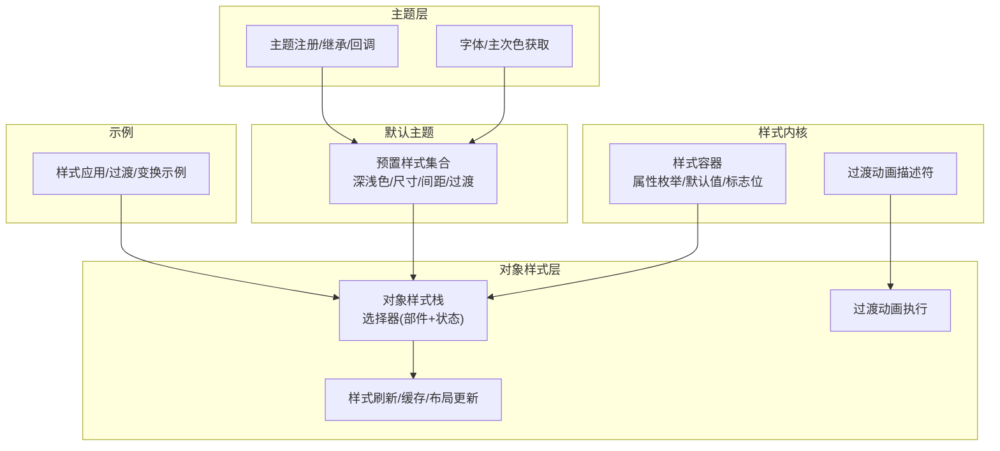
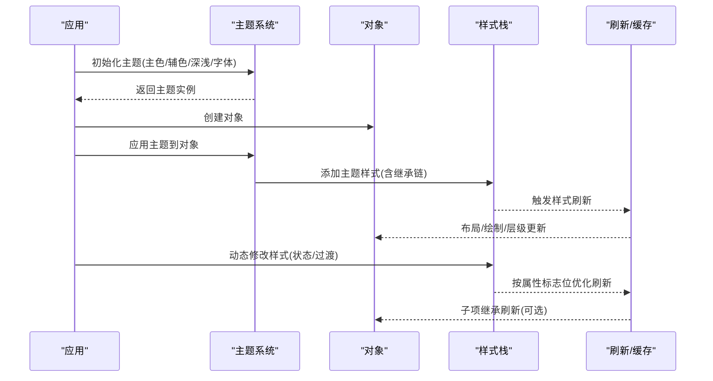
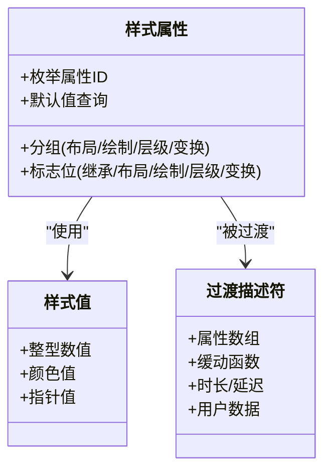
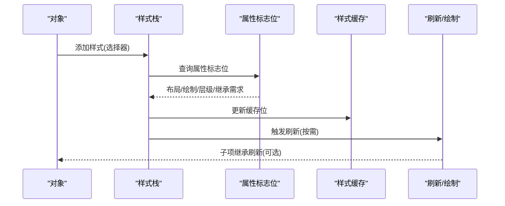
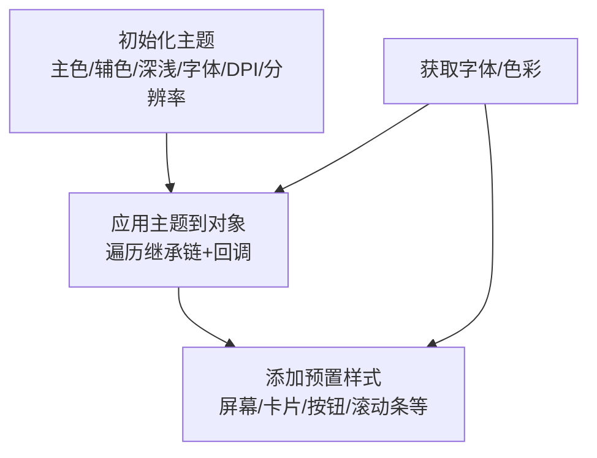
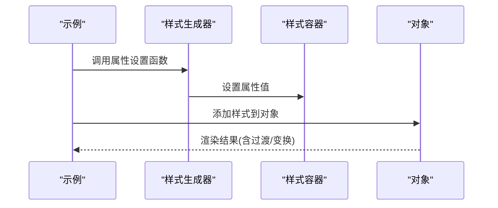
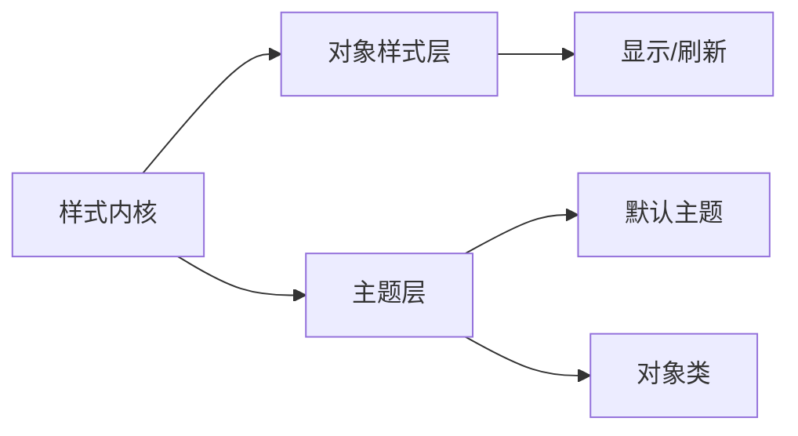

# 样式系统设计

<cite>
**本文档引用的文件**
- [lv_style.c](file://libs/lvgl/src/misc/lv_style.c)
- [lv_style.h](file://libs/lvgl/src/misc/lv_style.h)
- [lv_style_gen.c](file://libs/lvgl/src/misc/lv_style_gen.c)
- [lv_obj_style.c](file://libs/lvgl/src/core/lv_obj_style.c)
- [lv_obj_style.h](file://libs/lvgl/src/core/lv_obj_style.h)
- [lv_theme.c](file://libs/lvgl/src/themes/lv_theme.c)
- [lv_theme.h](file://libs/lvgl/src/themes/lv_theme.h)
- [lv_theme_default.c](file://libs/lvgl/src/themes/default/lv_theme_default.c)
- [lv_theme_default.h](file://libs/lvgl/src/themes/default/lv_theme_default.h)
- [lv_example_style_1.c](file://libs/lvgl/examples/styles/lv_example_style_1.c)
- [lv_example_style_10.c](file://libs/lvgl/examples/styles/lv_example_style_10.c)
- [lv_example_style_15.c](file://libs/lvgl/examples/styles/lv_example_style_15.c)
</cite>

## 目录
1. [简介](#简介)
2. [项目结构](#项目结构)
3. [核心组件](#核心组件)
4. [架构总览](#架构总览)
5. [详细组件分析](#详细组件分析)
6. [依赖关系分析](#依赖关系分析)
7. [性能考虑](#性能考虑)
8. [故障排查指南](#故障排查指南)
9. [结论](#结论)
10. [附录](#附录)

## 简介
本文件系统性阐述 SmartAttendance 项目中基于 LVGL 的样式系统设计与实现，覆盖主题系统、样式继承与动态切换、样式定义规范（颜色、字体、尺寸、间距）、自定义样式创建流程（属性设置、过渡动画、响应式适配）、性能优化策略（缓存、重绘、内存管理），以及调试工具与跨平台一致性保障方法。文档面向不同技术背景读者，既提供高层概览也包含代码级细节与图示。

## 项目结构
样式系统主要由以下层次构成：
- 样式内核：样式容器、属性枚举与默认值、属性标志位、过渡动画描述符
- 对象样式层：对象样式栈、选择器（部件+状态）、样式刷新与缓存、过渡动画执行
- 主题层：主题注册与继承、主题回调、字体与色彩主次色获取
- 默认主题：预置样式集合、深浅色模式、尺寸与间距适配、过渡与动画配置
- 示例与用法：官方示例展示样式应用、主题切换与动态样式修改

**图表来源**
- [lv_style.h:143-302](file://libs/lvgl/src/misc/lv_style.h#L143-L302)
- [lv_obj_style.h:28-86](file://libs/lvgl/src/core/lv_obj_style.h#L28-L86)
- [lv_theme.h:26-94](file://libs/lvgl/src/themes/lv_theme.h#L26-L94)
- [lv_theme_default.h:32-59](file://libs/lvgl/src/themes/default/lv_theme_default.h#L32-L59)

**章节来源**
- [lv_style.h:143-302](file://libs/lvgl/src/misc/lv_style.h#L143-L302)
- [lv_obj_style.h:28-86](file://libs/lvgl/src/core/lv_obj_style.h#L28-L86)
- [lv_theme.h:26-94](file://libs/lvgl/src/themes/lv_theme.h#L26-L94)
- [lv_theme_default.h:32-59](file://libs/lvgl/src/themes/default/lv_theme_default.h#L32-L59)

## 核心组件
- 样式容器与属性系统
  - 属性枚举与分组：按功能分组（尺寸、内边距、外边距、背景、边框、阴影、文本、透明度、混合模式、变换等）
  - 属性标志位：继承性、布局更新、外部绘制更新、父布局更新、层级更新、变换影响
  - 默认值查询：针对各属性提供默认值，确保未显式设置时有合理表现
- 对象样式栈与选择器
  - 选择器：部件（如主区域、滚动条）与状态（默认、按下、聚焦、禁用等）组合
  - 样式栈：支持本地样式、过渡样式与普通样式叠加；支持替换与移除
  - 刷新机制：根据属性标志位决定是否触发布局、外部绘制、层级更新与子项继承刷新
- 主题系统
  - 主题继承链：通过父主题叠加当前主题样式
  - 主题回调：为不同对象类型应用相应样式
  - 字体与色彩：提供小/正常/大字体与主次色彩获取接口
- 默认主题
  - 预置样式集合：屏幕、卡片、按钮、滚动条、输入控件、菜单、表格、日历等
  - 深浅色模式：根据模式切换背景、文字、卡片与灰色系
  - 尺寸与间距：按屏幕 DPI 与分辨率自动计算内边距与间距
  - 过渡与动画：统一过渡时间与动画时长配置

**章节来源**
- [lv_style.c:37-165](file://libs/lvgl/src/misc/lv_style.c#L37-L165)
- [lv_style.h:36-43](file://libs/lvgl/src/misc/lv_style.h#L36-L43)
- [lv_style.h:143-302](file://libs/lvgl/src/misc/lv_style.h#L143-L302)
- [lv_obj_style.c:90-147](file://libs/lvgl/src/core/lv_obj_style.c#L90-L147)
- [lv_obj_style.h:91-138](file://libs/lvgl/src/core/lv_obj_style.h#L91-L138)
- [lv_theme.c:46-54](file://libs/lvgl/src/themes/lv_theme.c#L46-L54)
- [lv_theme.c:100-122](file://libs/lvgl/src/themes/lv_theme.c#L100-L122)
- [lv_theme_default.c:198-619](file://libs/lvgl/src/themes/default/lv_theme_default.c#L198-L619)

## 架构总览
样式系统采用“主题驱动 + 对象样式栈”的双层架构：
- 主题层负责全局风格与品牌色系，提供预置样式集合与字体资源
- 对象层负责具体控件的样式叠加、状态切换与过渡动画
- 样式内核提供属性系统、默认值与过渡描述符，贯穿整个流程

**图表来源**
- [lv_theme.c:46-54](file://libs/lvgl/src/themes/lv_theme.c#L46-L54)
- [lv_theme.c:100-122](file://libs/lvgl/src/themes/lv_theme.c#L100-L122)
- [lv_obj_style.c:267-313](file://libs/lvgl/src/core/lv_obj_style.c#L267-L313)

## 详细组件分析

### 组件A：样式容器与属性系统
- 设计要点
  - 属性分组与标志位：通过标志位快速判断属性对布局、绘制、层级与变换的影响，用于刷新路径优化
  - 默认值表：集中管理各属性默认值，避免重复初始化与不一致
  - 自定义属性注册：支持扩展业务属性并绑定行为标志
- 关键数据结构
  - 属性枚举与分组：见属性列表与分组范围
  - 样式值联合体：统一承载整型、指针与颜色三类值
  - 过渡描述符：包含属性数组、缓动函数、时长与延迟
- 复杂度与性能
  - 属性查找与默认值获取为 O(1)，适合高频调用
  - 标志位分组用于早期剪枝，减少不必要的刷新

**图表来源**
- [lv_style.h:143-302](file://libs/lvgl/src/misc/lv_style.h#L143-L302)
- [lv_style.h:132-136](file://libs/lvgl/src/misc/lv_style.h#L132-L136)
- [lv_style.h:312-318](file://libs/lvgl/src/misc/lv_style.h#L312-L318)

**章节来源**
- [lv_style.c:37-165](file://libs/lvgl/src/misc/lv_style.c#L37-L165)
- [lv_style.c:400-409](file://libs/lvgl/src/misc/lv_style.c#L400-L409)
- [lv_style.c:411-487](file://libs/lvgl/src/misc/lv_style.c#L411-L487)
- [lv_style.h:143-302](file://libs/lvgl/src/misc/lv_style.h#L143-L302)

### 组件B：对象样式栈与选择器
- 设计要点
  - 选择器：部件与状态的组合，支持任意部件与状态匹配
  - 样式栈：普通样式、本地样式、过渡样式有序叠加，支持替换与移除
  - 刷新优化：根据属性标志位决定是否触发布局、外部绘制、层级更新与子项继承刷新
- 关键流程
  - 添加样式：插入到合适位置，更新缓存，触发刷新
  - 替换样式：保持顺序不变，批量替换匹配项
  - 移除样式：支持按样式或按选择器移除，必要时全缓存刷新
  - 过渡动画：记录起止值，启动动画，更新过渡样式

**图表来源**
- [lv_obj_style.c:90-147](file://libs/lvgl/src/core/lv_obj_style.c#L90-L147)
- [lv_obj_style.c:267-313](file://libs/lvgl/src/core/lv_obj_style.c#L267-L313)
- [lv_obj_style.h:91-138](file://libs/lvgl/src/core/lv_obj_style.h#L91-L138)

**章节来源**
- [lv_obj_style.c:90-147](file://libs/lvgl/src/core/lv_obj_style.c#L90-L147)
- [lv_obj_style.c:149-193](file://libs/lvgl/src/core/lv_obj_style.c#L149-L193)
- [lv_obj_style.c:195-246](file://libs/lvgl/src/core/lv_obj_style.c#L195-L246)
- [lv_obj_style.c:267-313](file://libs/lvgl/src/core/lv_obj_style.c#L267-L313)
- [lv_obj_style.c:446-499](file://libs/lvgl/src/core/lv_obj_style.c#L446-L499)
- [lv_obj_style.h:91-138](file://libs/lvgl/src/core/lv_obj_style.h#L91-L138)

### 组件C：主题系统与默认主题
- 设计要点
  - 主题继承：父主题优先于子主题，形成可叠加的主题链
  - 主题回调：按对象类型应用样式，支持递归应用基类主题
  - 默认主题：提供屏幕、卡片、按钮、滚动条、输入控件等预置样式，按 DPI 与分辨率自适应
  - 字体与色彩：提供小/正常/大字体与主次色彩获取接口
- 关键流程
  - 初始化主题：设置主次色、字体、深浅模式、分辨率事件回调
  - 应用主题：遍历继承链并调用回调，为对象添加对应样式
  - 获取资源：从主题获取字体与色彩，作为全局风格入口

**图表来源**
- [lv_theme_default.c:625-684](file://libs/lvgl/src/themes/default/lv_theme_default.c#L625-L684)
- [lv_theme.c:46-54](file://libs/lvgl/src/themes/lv_theme.c#L46-L54)
- [lv_theme.c:100-122](file://libs/lvgl/src/themes/lv_theme.c#L100-L122)
- [lv_theme.h:66-94](file://libs/lvgl/src/themes/lv_theme.h#L66-L94)

**章节来源**
- [lv_theme.c:46-54](file://libs/lvgl/src/themes/lv_theme.c#L46-L54)
- [lv_theme.c:100-122](file://libs/lvgl/src/themes/lv_theme.c#L100-L122)
- [lv_theme_default.c:625-684](file://libs/lvgl/src/themes/default/lv_theme_default.c#L625-L684)
- [lv_theme_default.c:723-800](file://libs/lvgl/src/themes/default/lv_theme_default.c#L723-L800)
- [lv_theme.h:66-94](file://libs/lvgl/src/themes/lv_theme.h#L66-L94)

### 组件D：样式生成器与示例
- 样式生成器
  - 自动生成属性设置函数，统一调用底层设置接口，简化使用
- 示例
  - 样式1：尺寸、位置与内边距示例
  - 样式10：过渡动画示例（默认与按下状态）
  - 样式15：透明度与变换示例（旋转、缩放、层合成）

**图表来源**
- [lv_example_style_1.c:7-29](file://libs/lvgl/examples/styles/lv_example_style_1.c#L7-L29)
- [lv_example_style_10.c:7-38](file://libs/lvgl/examples/styles/lv_example_style_10.c#L7-L38)
- [lv_example_style_15.c:7-46](file://libs/lvgl/examples/styles/lv_example_style_15.c#L7-L46)
- [lv_style_gen.c:13-19](file://libs/lvgl/src/misc/lv_style_gen.c#L13-L19)

**章节来源**
- [lv_style_gen.c:13-19](file://libs/lvgl/src/misc/lv_style_gen.c#L13-L19)
- [lv_example_style_1.c:7-29](file://libs/lvgl/examples/styles/lv_example_style_1.c#L7-L29)
- [lv_example_style_10.c:7-38](file://libs/lvgl/examples/styles/lv_example_style_10.c#L7-L38)
- [lv_example_style_15.c:7-46](file://libs/lvgl/examples/styles/lv_example_style_15.c#L7-L46)

## 依赖关系分析
- 样式内核依赖颜色、字体、动画、布局等基础模块
- 对象样式层依赖样式内核与显示/刷新模块
- 主题层依赖对象类与显示设备
- 默认主题依赖主题接口与全局配置

**图表来源**
- [lv_style.h:16-25](file://libs/lvgl/src/misc/lv_style.h#L16-L25)
- [lv_obj_style.c:9-17](file://libs/lvgl/src/core/lv_obj_style.c#L9-L17)
- [lv_theme.c:9-12](file://libs/lvgl/src/themes/lv_theme.c#L9-L12)
- [lv_theme_default.c:9-11](file://libs/lvgl/src/themes/default/lv_theme_default.c#L9-L11)

**章节来源**
- [lv_style.h:16-25](file://libs/lvgl/src/misc/lv_style.h#L16-L25)
- [lv_obj_style.c:9-17](file://libs/lvgl/src/core/lv_obj_style.c#L9-L17)
- [lv_theme.c:9-12](file://libs/lvgl/src/themes/lv_theme.c#L9-L12)
- [lv_theme_default.c:9-11](file://libs/lvgl/src/themes/default/lv_theme_default.c#L9-L11)

## 性能考虑
- 样式缓存
  - 属性分组位标记：通过属性组位快速判断是否需要处理某属性，减少遍历开销
  - 对象样式缓存：按部件记录已设置属性，避免重复计算
- 刷新优化
  - 根据属性标志位仅触发必要的布局、外部绘制与层级更新
  - 子项继承刷新按需进行，避免全量重绘
- 内存管理
  - 样式与对象样式栈动态分配与释放，支持替换与移除
  - 主题样式集中管理，避免重复分配
- 过渡与动画
  - 过渡描述符统一管理，避免频繁创建
  - 动画参数（时长、延迟、缓动）集中配置，便于统一优化

[本节为通用性能指导，无需特定文件引用]

## 故障排查指南
- 样式未生效
  - 检查选择器是否正确（部件+状态）
  - 确认样式栈中是否存在更高优先级样式覆盖
  - 使用样式刷新接口验证属性是否被正确设置
- 过渡动画异常
  - 检查过渡描述符中的属性数组是否包含目标属性
  - 确认动画时长与延迟设置是否合理
- 主题切换后样式错乱
  - 确认主题继承链是否正确设置
  - 检查分辨率变化事件回调是否触发样式重算
- 性能问题
  - 关注频繁刷新的属性（布局/绘制/层级）
  - 合理使用样式缓存与批量刷新

**章节来源**
- [lv_obj_style.c:267-313](file://libs/lvgl/src/core/lv_obj_style.c#L267-L313)
- [lv_theme.c:56-64](file://libs/lvgl/src/themes/lv_theme.c#L56-L64)
- [lv_theme_default.c:679-682](file://libs/lvgl/src/themes/default/lv_theme_default.c#L679-L682)

## 结论
该样式系统以清晰的分层架构实现了主题驱动与对象样式叠加，结合属性标志位与缓存机制在保证灵活性的同时兼顾性能。通过默认主题提供的预置样式与深浅色适配，开发者可以快速构建一致且美观的界面。建议在实际项目中遵循统一的颜色、字体、尺寸与间距规范，并充分利用过渡动画与响应式适配提升用户体验。

[本节为总结性内容，无需特定文件引用]

## 附录

### 样式定义标准规范
- 颜色系统
  - 主色与辅色：通过主题接口获取，确保全局一致性
  - 灰色系：用于卡片、边框与占位元素
  - 深浅模式：根据模式切换背景与文字颜色
- 字体配置
  - 小/正常/大三种字号：通过主题接口获取
  - 文本装饰与对齐：支持下划线、删除线与居中对齐
- 尺寸规范
  - 圆角半径：卡片与按钮按 DPI 自适应
  - 尺寸与最大/最小尺寸：统一使用宏与函数计算
- 间距标准
  - 内边距与行列间距：按屏幕尺寸与 DPI 计算
  - 边距：统一使用水平/垂直/全部快捷设置

**章节来源**
- [lv_theme_default.c:200-227](file://libs/lvgl/src/themes/default/lv_theme_default.c#L200-L227)
- [lv_theme_default.c:245-267](file://libs/lvgl/src/themes/default/lv_theme_default.c#L245-L267)
- [lv_theme_default.c:311-334](file://libs/lvgl/src/themes/default/lv_theme_default.c#L311-L334)
- [lv_theme.h:66-94](file://libs/lvgl/src/themes/lv_theme.h#L66-L94)

### 自定义样式创建流程
- 属性设置
  - 使用样式生成器提供的属性设置函数
  - 通过样式容器设置属性值
- 过渡动画配置
  - 定义过渡描述符，指定属性数组与缓动函数
  - 在样式中设置过渡描述符
- 响应式适配
  - 根据分辨率与 DPI 计算尺寸与间距
  - 使用主题接口获取字体与色彩

**章节来源**
- [lv_style_gen.c:13-19](file://libs/lvgl/src/misc/lv_style_gen.c#L13-L19)
- [lv_style.c:400-409](file://libs/lvgl/src/misc/lv_style.c#L400-L409)
- [lv_theme_default.c:625-684](file://libs/lvgl/src/themes/default/lv_theme_default.c#L625-L684)

### 具体代码示例路径
- 样式应用示例：[示例1:7-29](file://libs/lvgl/examples/styles/lv_example_style_1.c#L7-L29)
- 主题切换与样式叠加：[主题应用:46-54](file://libs/lvgl/src/themes/lv_theme.c#L46-L54)
- 动态样式修改与过渡：[示例10:7-38](file://libs/lvgl/examples/styles/lv_example_style_10.c#L7-L38)
- 透明度与变换：[示例15:7-46](file://libs/lvgl/examples/styles/lv_example_style_15.c#L7-L46)

**章节来源**
- [lv_example_style_1.c:7-29](file://libs/lvgl/examples/styles/lv_example_style_1.c#L7-L29)
- [lv_theme.c:46-54](file://libs/lvgl/src/themes/lv_theme.c#L46-L54)
- [lv_example_style_10.c:7-38](file://libs/lvgl/examples/styles/lv_example_style_10.c#L7-L38)
- [lv_example_style_15.c:7-46](file://libs/lvgl/examples/styles/lv_example_style_15.c#L7-L46)