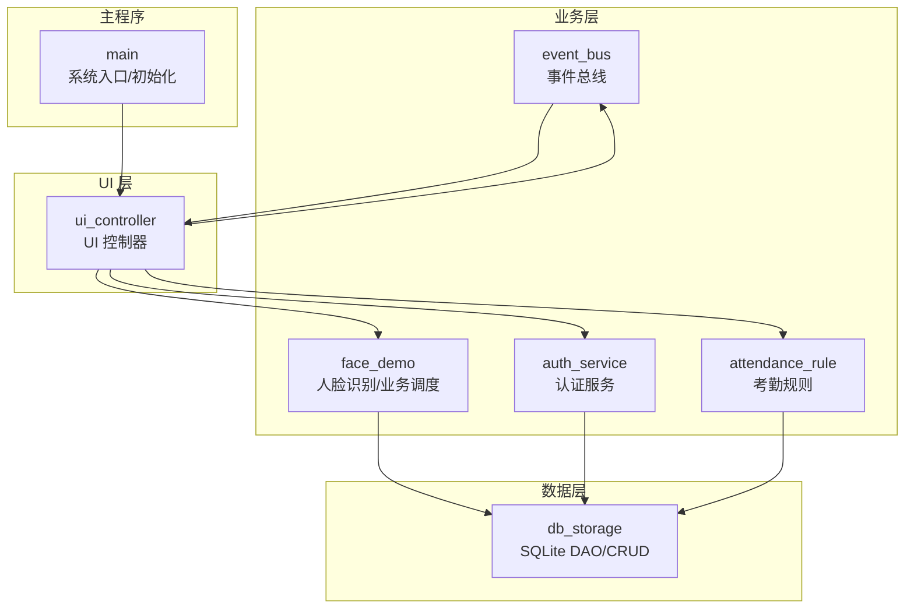
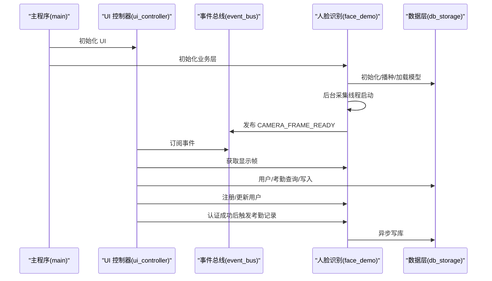
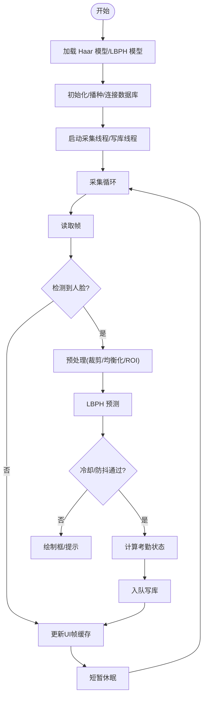
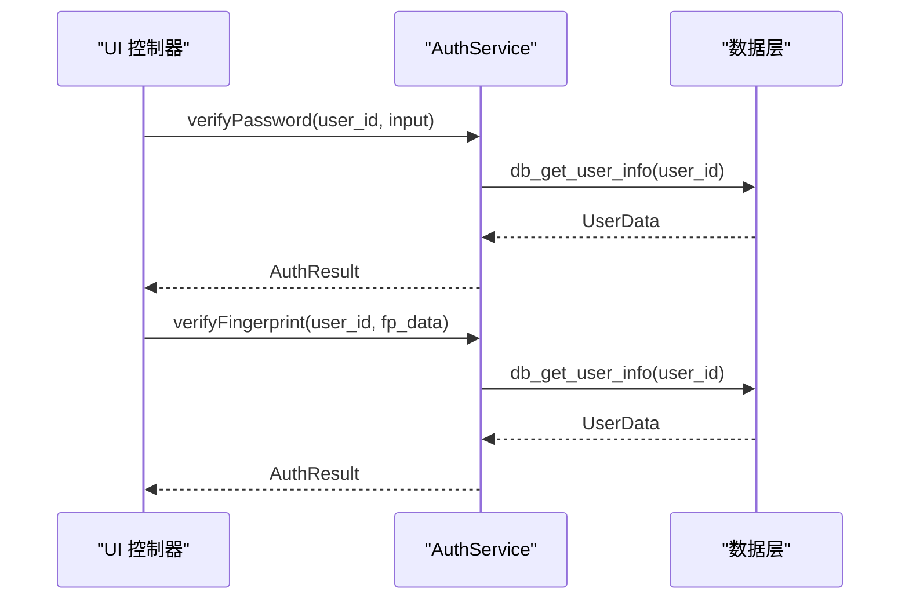
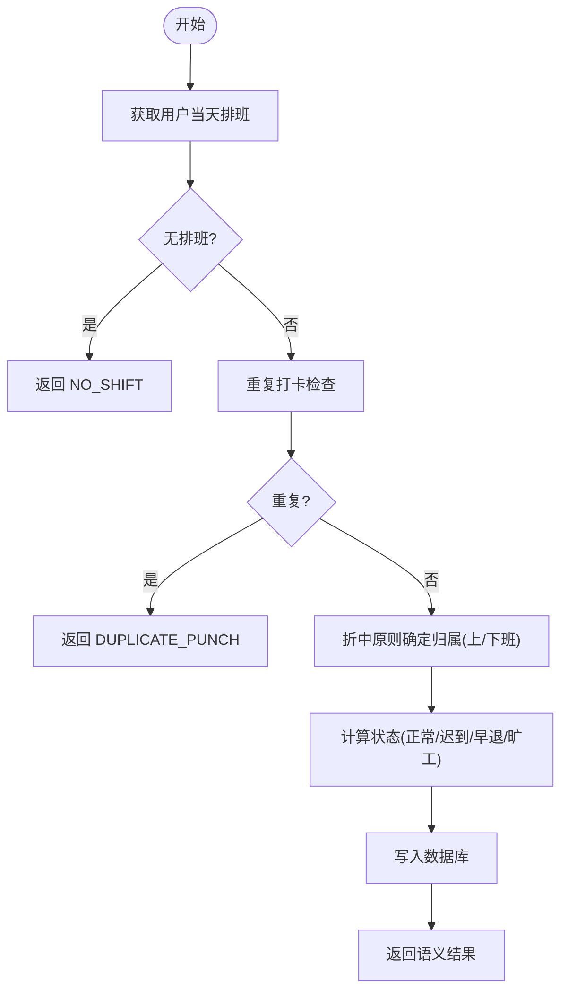
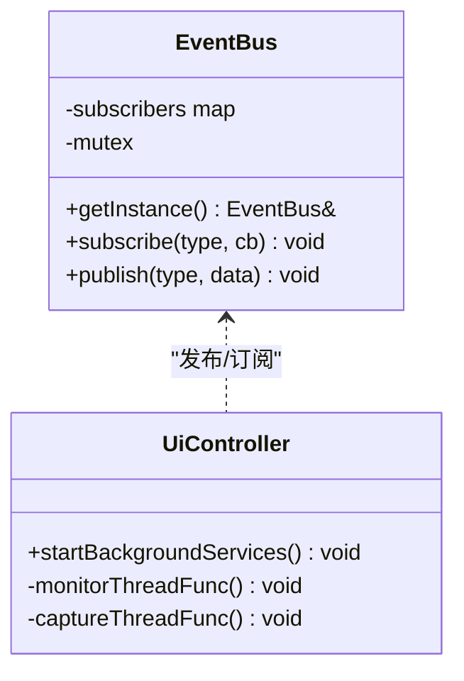
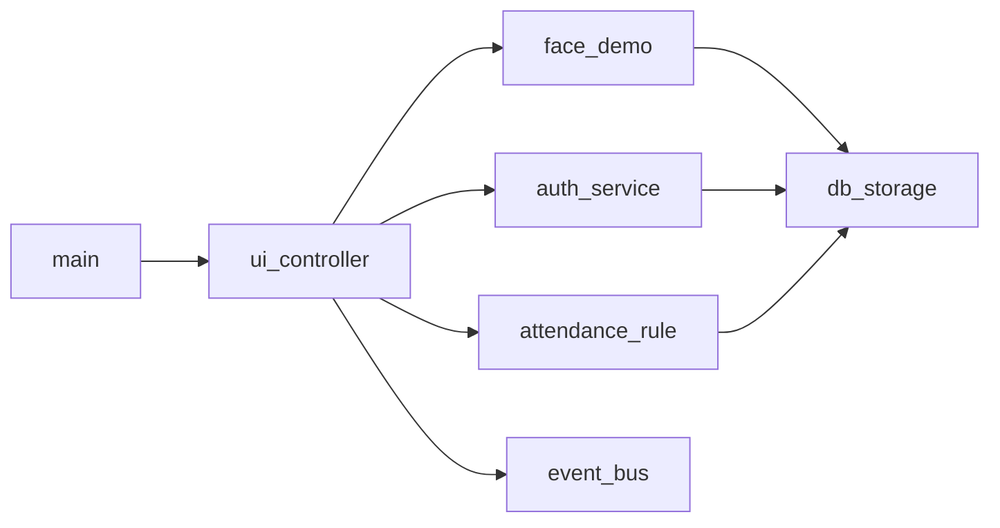

# 业务逻辑模块

<cite>
**本文引用的文件**
- [face_demo.h](file://src/business/face_demo.h)
- [face_demo.cpp](file://src/business/face_demo.cpp)
- [auth_service.h](file://src/business/auth_service.h)
- [auth_service.cpp](file://src/business/auth_service.cpp)
- [attendance_rule.h](file://src/business/attendance_rule.h)
- [attendance_rule.cpp](file://src/business/attendance_rule.cpp)
- [event_bus.h](file://src/business/event_bus.h)
- [event_bus.cpp](file://src/business/event_bus.cpp)
- [db_storage.h](file://src/data/db_storage.h)
- [db_storage.cpp](file://src/data/db_storage.cpp)
- [ui_controller.h](file://src/ui/ui_controller.h)
- [ui_controller.cpp](file://src/ui/ui_controller.cpp)
- [main.cpp](file://src/main.cpp)
</cite>

## 目录
1. [简介](#简介)
2. [项目结构](#项目结构)
3. [核心组件](#核心组件)
4. [架构总览](#架构总览)
5. [详细组件分析](#详细组件分析)
6. [依赖关系分析](#依赖关系分析)
7. [性能考量](#性能考量)
8. [故障排查指南](#故障排查指南)
9. [结论](#结论)
10. [附录](#附录)

## 简介
本文件面向 SmartAttendance 业务逻辑模块，聚焦以下能力：
- 人脸识别模块：OpenCV DNN 模型使用、人脸检测算法、特征匹配机制
- 认证服务：用户管理流程、权限控制、会话处理
- 考勤规则模块：状态计算逻辑、迟到早退判定、班次管理
- 事件总线：事件驱动架构、消息传递机制、模块解耦设计
- API 接口文档：参数说明、返回值定义
- 业务流程图、状态转换图、错误处理策略

## 项目结构
业务逻辑模块位于 src/business，围绕“业务层”组织，与数据层、UI 层通过清晰接口交互。核心文件如下：
- 人脸识别与业务：face_demo.h/.cpp
- 认证服务：auth_service.h/.cpp
- 考勤规则：attendance_rule.h/.cpp
- 事件总线：event_bus.h/.cpp
- 数据层接口：db_storage.h/.cpp
- UI 控制器：ui_controller.h/.cpp
- 主程序入口：main.cpp

图表来源
- [face_demo.cpp:559-684](file://src/business/face_demo.cpp#L559-L684)
- [auth_service.cpp:9-37](file://src/business/auth_service.cpp#L9-L37)
- [attendance_rule.cpp:198-277](file://src/business/attendance_rule.cpp#L198-L277)
- [event_bus.cpp:3-28](file://src/business/event_bus.cpp#L3-L28)
- [db_storage.cpp:108-285](file://src/data/db_storage.cpp#L108-L285)
- [ui_controller.cpp:363-417](file://src/ui/ui_controller.cpp#L363-L417)
- [main.cpp:213-225](file://src/main.cpp#L213-L225)

章节来源
- [face_demo.h:1-196](file://src/business/face_demo.h#L1-L196)
- [face_demo.cpp:559-684](file://src/business/face_demo.cpp#L559-L684)
- [auth_service.h:1-46](file://src/business/auth_service.h#L1-L46)
- [auth_service.cpp:9-90](file://src/business/auth_service.cpp#L9-L90)
- [attendance_rule.h:1-92](file://src/business/attendance_rule.h#L1-L92)
- [attendance_rule.cpp:127-191](file://src/business/attendance_rule.cpp#L127-L191)
- [event_bus.h:1-41](file://src/business/event_bus.h#L1-L41)
- [event_bus.cpp:1-28](file://src/business/event_bus.cpp#L1-L28)
- [db_storage.h:1-596](file://src/data/db_storage.h#L1-L596)
- [db_storage.cpp:108-285](file://src/data/db_storage.cpp#L108-L285)
- [ui_controller.h:1-106](file://src/ui/ui_controller.h#L1-L106)
- [ui_controller.cpp:363-417](file://src/ui/ui_controller.cpp#L363-L417)
- [main.cpp:213-225](file://src/main.cpp#L213-L225)

## 核心组件
- 人脸识别与业务调度：负责摄像头接入、人脸检测、预处理、特征提取与识别、异步写库、UI 帧缓存与事件发布。
- 认证服务：提供密码与指纹验证，返回标准化结果枚举。
- 考勤规则：基于班次与时间计算打卡状态（正常/迟到/早退/旷工），并写入数据库。
- 事件总线：提供线程安全的发布/订阅机制，支撑 UI 与业务层解耦。
- 数据层：封装 SQLite 操作，提供部门/班次/用户/考勤等 DAO 接口。
- UI 控制器：封装业务层与数据层调用，提供 UI 所需的便捷接口，并启动后台监控与采集线程。

章节来源
- [face_demo.cpp:293-551](file://src/business/face_demo.cpp#L293-L551)
- [auth_service.cpp:9-90](file://src/business/auth_service.cpp#L9-L90)
- [attendance_rule.cpp:198-277](file://src/business/attendance_rule.cpp#L198-L277)
- [event_bus.cpp:3-28](file://src/business/event_bus.cpp#L3-L28)
- [db_storage.cpp:108-285](file://src/data/db_storage.cpp#L108-L285)
- [ui_controller.cpp:363-417](file://src/ui/ui_controller.cpp#L363-L417)

## 架构总览
业务层通过事件总线与 UI 层解耦，数据层提供统一的持久化接口。主程序负责初始化顺序与主循环。

图表来源
- [main.cpp:213-225](file://src/main.cpp#L213-L225)
- [ui_controller.cpp:363-417](file://src/ui/ui_controller.cpp#L363-L417)
- [event_bus.cpp:3-28](file://src/business/event_bus.cpp#L3-L28)
- [face_demo.cpp:248-287](file://src/business/face_demo.cpp#L248-L287)
- [face_demo.cpp:559-684](file://src/business/face_demo.cpp#L559-L684)
- [db_storage.cpp:108-285](file://src/data/db_storage.cpp#L108-L285)

## 详细组件分析

### 人脸识别模块（OpenCV + LBPH）
- 模型与检测
  - 使用 Haar 级联分类器进行人脸检测，支持多尺度检测与最大人脸选择。
  - 使用 LBPH 人脸识别器进行特征匹配，支持训练与模型保存/加载。
- 预处理管线
  - 支持裁剪边界、尺寸归一化、直方图均衡化（全局/CLAHE）、ROI 增强（对比度/亮度）。
  - 配置通过 PreprocessConfig 控制，支持 UI 动态调整。
- 视频流与线程
  - 后台采集线程持续读取摄像头/SDP 流，跳帧检测（降低 CPU 占用），绘制人脸框与识别结果。
  - 识别冷却时间与业务防抖（重复打卡限制）避免误触发。
  - 异步写库线程通过队列与条件变量实现生产者-消费者模型，避免 SQLite 多线程竞争。
- UI 帧缓存与事件
  - 通过 g_display_frame_buffer 与 g_display_mutex 保护共享帧，周期性发布 CAMERA_FRAME_READY 事件。
- C++/C 接口
  - 提供 C++ 独立函数 convertToGrayscale 与 C 语言兼容接口（business_get_display_frame、business_register_user 等）。

图表来源
- [face_demo.cpp:293-551](file://src/business/face_demo.cpp#L293-L551)
- [face_demo.cpp:559-684](file://src/business/face_demo.cpp#L559-L684)
- [face_demo.cpp:248-287](file://src/business/face_demo.cpp#L248-L287)

章节来源
- [face_demo.h:42-196](file://src/business/face_demo.h#L42-L196)
- [face_demo.cpp:83-167](file://src/business/face_demo.cpp#L83-L167)
- [face_demo.cpp:174-204](file://src/business/face_demo.cpp#L174-L204)
- [face_demo.cpp:293-551](file://src/business/face_demo.cpp#L293-L551)
- [face_demo.cpp:248-287](file://src/business/face_demo.cpp#L248-L287)

### 认证服务（密码/指纹）
- 密码验证
  - 从数据库获取用户信息，检查是否存在与密码字段是否为空，直接比对输入与存储值（演示阶段）。
- 指纹验证
  - 从数据库获取用户指纹特征，模拟比对算法（阈值 80），返回标准化结果枚举。
- 权限与会话
  - 认证成功后由 UI 层调用考勤记录接口，业务层不维护会话状态。

图表来源
- [auth_service.cpp:9-37](file://src/business/auth_service.cpp#L9-L37)
- [auth_service.cpp:42-69](file://src/business/auth_service.cpp#L42-L69)
- [db_storage.cpp:748-800](file://src/data/db_storage.cpp#L748-L800)

章节来源
- [auth_service.h:1-46](file://src/business/auth_service.h#L1-L46)
- [auth_service.cpp:9-90](file://src/business/auth_service.cpp#L9-L90)
- [db_storage.h:315-420](file://src/data/db_storage.h#L315-L420)

### 考勤规则模块（状态计算与班次管理）
- 班次结构
  - ShiftConfig 包含 s1/s2/s3 时段与跨天标记，RuleConfig 包含全局规则（迟到阈值、重复打卡限制、周末工作开关等）。
- 状态计算
  - 上班打卡：以开始时间为准，超过阈值为迟到或旷工；下班打卡：以结束时间为准，早于结束时间为早退。
  - 跨天时间标准化与“折中原则”：在 AM 结束与 PM 开始之间的模糊区间，依据中点归属。
- 防重复打卡
  - 基于全局规则的重复打卡限制窗口，查询最近记录。
- 写库与返回
  - 将 PunchStatus 映射为数据库状态码，写入 attendance 表，返回语义化结果枚举供 UI 展示。

图表来源
- [attendance_rule.cpp:198-277](file://src/business/attendance_rule.cpp#L198-L277)
- [attendance_rule.cpp:83-122](file://src/business/attendance_rule.cpp#L83-L122)
- [attendance_rule.cpp:127-191](file://src/business/attendance_rule.cpp#L127-L191)

章节来源
- [attendance_rule.h:16-92](file://src/business/attendance_rule.h#L16-L92)
- [attendance_rule.cpp:127-191](file://src/business/attendance_rule.cpp#L127-L191)
- [db_storage.h:574-632](file://src/data/db_storage.h#L574-L632)

### 事件总线（事件驱动与解耦）
- 设计
  - 单例 EventBus，线程安全发布/订阅，支持 TIME_UPDATE、DISK_FULL、DISK_NORMAL、CAMERA_FRAME_READY。
- 使用
  - UI 控制器启动监控线程，周期发布时间与磁盘事件；业务层在 UI 帧可用时发布 CAMERA_FRAME_READY，UI 订阅后更新显示。

图表来源
- [event_bus.h:21-41](file://src/business/event_bus.h#L21-L41)
- [event_bus.cpp:3-28](file://src/business/event_bus.cpp#L3-L28)
- [ui_controller.cpp:363-417](file://src/ui/ui_controller.cpp#L363-L417)

章节来源
- [event_bus.h:1-41](file://src/business/event_bus.h#L1-L41)
- [event_bus.cpp:1-28](file://src/business/event_bus.cpp#L1-L28)
- [ui_controller.cpp:363-417](file://src/ui/ui_controller.cpp#L363-L417)

### 数据层接口（DAO/CRUD）
- 表结构与种子数据
  - departments、shifts、users、attendance、dept_schedule、user_schedule、bells、system_config、holidays。
  - 自动播种默认部门、班次、规则与管理员。
- 高频接口
  - 用户/部门/班次/考勤 CRUD；智能排班查询（个人/部门/默认）；规则读取/更新；图片存取与清理。
- 并发与性能
  - 使用 WAL 模式、读写锁分离、预编译语句、联合索引，保障并发与查询效率。

章节来源
- [db_storage.h:16-186](file://src/data/db_storage.h#L16-L186)
- [db_storage.cpp:108-285](file://src/data/db_storage.cpp#L108-L285)
- [db_storage.cpp:408-461](file://src/data/db_storage.cpp#L408-L461)

### UI 控制器（业务封装与后台服务）
- 封装
  - 对数据层与业务层接口进行二次封装，提供 UI 所需的便捷方法（注册、查询、报表导出、系统统计等）。
- 后台服务
  - 启动监控线程（时间/磁盘）与采集线程（摄像头帧缓存），通过事件总线与业务层解耦。
- 线程安全
  - 使用互斥锁保护帧缓存，避免 UI 与采集线程竞态。

章节来源
- [ui_controller.h:21-106](file://src/ui/ui_controller.h#L21-L106)
- [ui_controller.cpp:363-417](file://src/ui/ui_controller.cpp#L363-L417)

## 依赖关系分析
- 业务层依赖
  - face_demo 依赖 OpenCV、SQLite、event_bus、db_storage；提供 C/C++ 双接口。
  - auth_service 依赖 db_storage。
  - attendance_rule 依赖 db_storage。
- UI 层依赖
  - ui_controller 依赖 db_storage、face_demo、event_bus、report_generator。
- 主程序依赖
  - main 负责初始化顺序：UI → 业务 → 主循环。

图表来源
- [main.cpp:213-225](file://src/main.cpp#L213-L225)
- [ui_controller.cpp:363-417](file://src/ui/ui_controller.cpp#L363-L417)
- [face_demo.cpp:559-684](file://src/business/face_demo.cpp#L559-L684)
- [auth_service.cpp:9-37](file://src/business/auth_service.cpp#L9-L37)
- [attendance_rule.cpp:198-277](file://src/business/attendance_rule.cpp#L198-L277)
- [event_bus.cpp:3-28](file://src/business/event_bus.cpp#L3-L28)
- [db_storage.cpp:108-285](file://src/data/db_storage.cpp#L108-L285)

章节来源
- [main.cpp:213-225](file://src/main.cpp#L213-L225)
- [ui_controller.cpp:363-417](file://src/ui/ui_controller.cpp#L363-L417)
- [face_demo.cpp:559-684](file://src/business/face_demo.cpp#L559-L684)
- [auth_service.cpp:9-37](file://src/business/auth_service.cpp#L9-L37)
- [attendance_rule.cpp:198-277](file://src/business/attendance_rule.cpp#L198-L277)
- [event_bus.cpp:3-28](file://src/business/event_bus.cpp#L3-L28)
- [db_storage.cpp:108-285](file://src/data/db_storage.cpp#L108-L285)

## 性能考量
- 识别与预处理
  - 跳帧检测（SKIP_FRAMES）降低 CPU 占用；预处理管线在后台线程执行，UI 线程仅读取共享帧。
- 写库并发
  - 异步写库线程使用队列与条件变量，避免 SQLite 多线程竞争；预编译语句减少 SQL 解析开销。
- 数据库优化
  - WAL 模式、读写锁分离、联合索引、缓存参数调优，提升并发与查询性能。
- UI 帧缓存
  - 限制 UI 刷新频率（约 60 FPS），避免 UI 队列爆炸。

章节来源
- [face_demo.cpp:293-551](file://src/business/face_demo.cpp#L293-L551)
- [face_demo.cpp:248-287](file://src/business/face_demo.cpp#L248-L287)
- [db_storage.cpp:124-135](file://src/data/db_storage.cpp#L124-L135)
- [db_storage.cpp:275-282](file://src/data/db_storage.cpp#L275-L282)

## 故障排查指南
- 摄像头/流异常
  - 业务层具备重连逻辑与强制重启能力；若连续多帧读取失败，会释放并重建连接。
- 识别失败
  - 检查预处理配置（裁剪、均衡化、ROI 增强）；确认模型加载与训练状态；查看识别冷却与防抖限制。
- 写库失败
  - 异步写库线程捕获异常并继续运行；检查数据库连接、磁盘空间与权限。
- 认证失败
  - 确认用户存在、密码/指纹已录入；检查指纹比对阈值。
- 事件未触发
  - 确认 UI 已订阅事件；检查事件总线单例与发布时机。

章节来源
- [face_demo.cpp:314-346](file://src/business/face_demo.cpp#L314-L346)
- [face_demo.cpp:268-287](file://src/business/face_demo.cpp#L268-L287)
- [auth_service.cpp:9-37](file://src/business/auth_service.cpp#L9-L37)
- [event_bus.cpp:14-28](file://src/business/event_bus.cpp#L14-L28)

## 结论
SmartAttendance 业务逻辑模块通过清晰的分层与事件驱动架构，实现了稳定的人脸识别、认证与考勤规则计算。模块间通过事件总线解耦，数据层提供高性能的 SQLite DAO 接口，UI 控制器封装业务调用，整体具备良好的扩展性与可维护性。

## 附录

### API 接口文档（业务层）

- 人脸识别与业务调度
  - business_init()
    - 功能：初始化业务层（加载模型、打开视频源、启动线程、播种数据）
    - 返回：true/false
  - business_get_display_frame(buffer, w, h)
    - 功能：获取当前帧用于 UI 显示（RGB24/32）
    - 参数：buffer（输出）、w/h（期望尺寸）
    - 返回：true/false
  - business_register_user(name, dept_id)
    - 功能：注册新用户（采集当前帧作为人脸特征）
    - 返回：true/false
  - business_update_user_face(user_id)
    - 功能：更新老用户的人脸特征
    - 返回：true/false
  - business_get_user_count()/business_get_user_at(index, ...)
    - 功能：获取用户总数与指定索引用户信息（供 C UI 列表）
  - business_load_records()/business_get_record_count()/business_get_record_at(...)
    - 功能：加载/获取考勤记录（格式化文本）

- 认证服务
  - AuthService::verifyPassword(user_id, input_password)
    - 返回：AuthResult（SUCCESS/USER_NOT_FOUND/WRONG_PASSWORD/NO_FEATURE_DATA/DB_ERROR）
  - AuthService::verifyFingerprint(user_id, captured_fp_data)
    - 返回：AuthResult（SUCCESS/USER_NOT_FOUND/WRONG_FINGERPRINT/NO_FEATURE_DATA/DB_ERROR）

- 考勤规则
  - AttendanceRule::recordAttendance(user_id, image)
    - 返回：RecordResult（RECORDED_NORMAL/LATE/EARLY/ABSENT/NO_SHIFT/DUPLICATE_PUNCH/DB_ERROR）
  - AttendanceRule::calculatePunchStatus(timestamp, target_shift, is_check_in)
    - 返回：PunchResult（status, minutes_diff）
  - AttendanceRule::determineShiftOwner(timestamp, shift_am, shift_pm)
    - 返回：1/2（归属上午/下午）

- 事件总线
  - EventBus::getInstance()
  - EventBus::subscribe(type, callback)
  - EventBus::publish(type, data)

章节来源
- [face_demo.h:34-196](file://src/business/face_demo.h#L34-L196)
- [auth_service.h:23-44](file://src/business/auth_service.h#L23-L44)
- [attendance_rule.h:43-92](file://src/business/attendance_rule.h#L43-L92)
- [event_bus.h:21-41](file://src/business/event_bus.h#L21-L41)