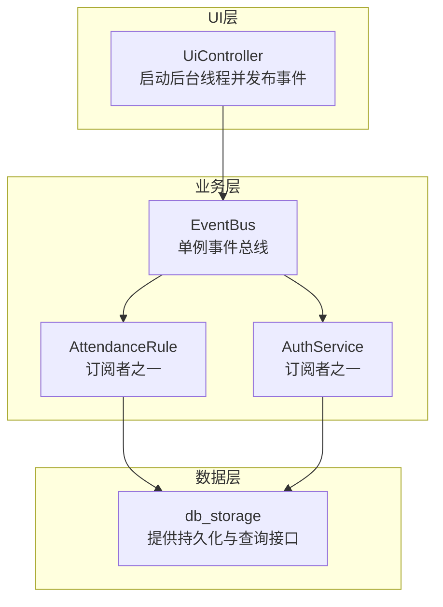
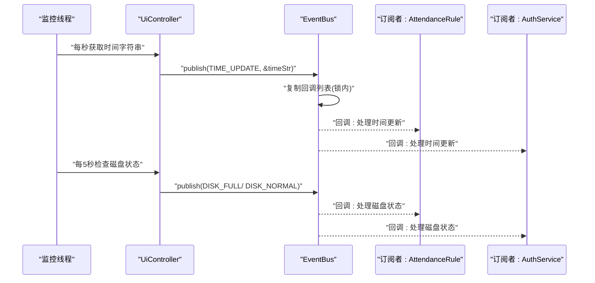
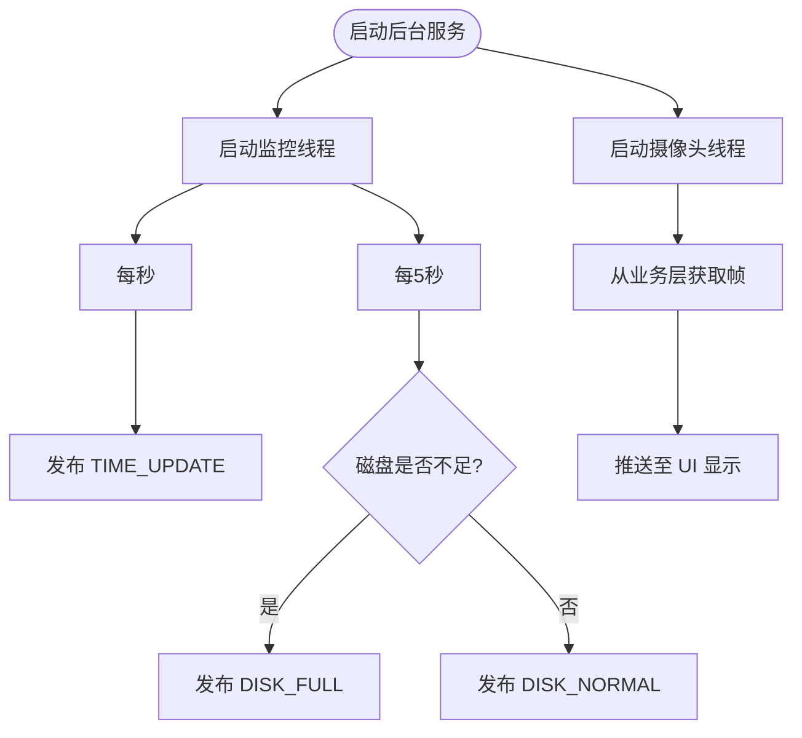
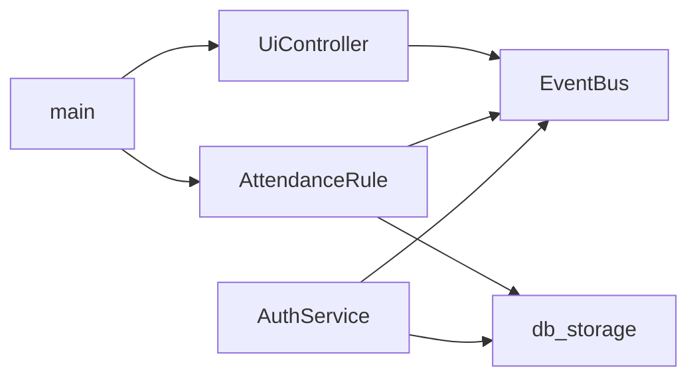

# 事件总线系统

<cite>
**本文引用的文件**
- [event_bus.h](file://src/business/event_bus.h)
- [event_bus.cpp](file://src/business/event_bus.cpp)
- [ui_controller.h](file://src/ui/ui_controller.h)
- [ui_controller.cpp](file://src/ui/ui_controller.cpp)
- [main.cpp](file://src/main.cpp)
- [db_storage.h](file://src/data/db_storage.h)
- [db_storage.cpp](file://src/data/db_storage.cpp)
- [attendance_rule.h](file://src/business/attendance_rule.h)
- [attendance_rule.cpp](file://src/business/attendance_rule.cpp)
- [auth_service.h](file://src/business/auth_service.h)
- [auth_service.cpp](file://src/business/auth_service.cpp)
</cite>

## 目录
1. [简介](#简介)
2. [项目结构](#项目结构)
3. [核心组件](#核心组件)
4. [架构总览](#架构总览)
5. [详细组件分析](#详细组件分析)
6. [依赖关系分析](#依赖关系分析)
7. [性能考量](#性能考量)
8. [故障排除指南](#故障排除指南)
9. [结论](#结论)
10. [附录](#附录)

## 简介
本文件为 SmartAttendance 事件总线系统的全面技术文档。系统采用事件驱动架构，通过 EventBus 实现模块间的松耦合通信，支持时间更新、磁盘状态、摄像头帧等事件的发布与订阅。文档涵盖事件类型定义、订阅者管理、消息路由、线程安全与并发策略、处理器注册/注销、事件传播机制（同步/异步）、序列化与跨模块通信最佳实践，并提供使用示例与故障排除指南。

## 项目结构
事件总线位于业务层，UI 控制器作为事件发布方，负责在后台线程中周期性发布系统事件；数据层提供持久化能力；业务层（如考勤规则）可作为订阅者接收事件并触发相应处理。



图表来源
- [ui_controller.cpp:362-417](file://src/ui/ui_controller.cpp#L362-L417)
- [event_bus.h:21-39](file://src/business/event_bus.h#L21-L39)
- [attendance_rule.cpp:198-277](file://src/business/attendance_rule.cpp#L198-L277)
- [auth_service.cpp:9-69](file://src/business/auth_service.cpp#L9-L69)
- [db_storage.h:421-461](file://src/data/db_storage.h#L421-L461)

章节来源
- [ui_controller.cpp:362-417](file://src/ui/ui_controller.cpp#L362-L417)
- [event_bus.h:10-39](file://src/business/event_bus.h#L10-L39)
- [db_storage.h:421-461](file://src/data/db_storage.h#L421-L461)

## 核心组件
- 事件总线 EventBus
  - 单例模式，提供 subscribe 与 publish 接口
  - 事件类型枚举 EventType，包含 TIME_UPDATE、DISK_FULL、DISK_NORMAL、CAMERA_FRAME_READY
  - 回调函数类型 EventCallback 为 std::function<void(void*)>
  - 内部使用互斥锁保护订阅者列表与发布过程
- UI 控制器 UiController
  - 启动监控线程与摄像头采集线程
  - 监控线程每秒发布 TIME_UPDATE，周期性发布磁盘状态事件
  - 摄像头线程负责采集帧并推送至 UI 显示
- 业务层订阅者
  - AttendanceRule：订阅考勤相关事件，参与考勤计算与记录
  - AuthService：订阅认证相关事件，参与认证流程
- 数据层 db_storage：提供持久化与查询接口，供订阅者使用

章节来源
- [event_bus.h:10-39](file://src/business/event_bus.h#L10-L39)
- [event_bus.cpp:8-28](file://src/business/event_bus.cpp#L8-L28)
- [ui_controller.h:21-104](file://src/ui/ui_controller.h#L21-L104)
- [ui_controller.cpp:362-417](file://src/ui/ui_controller.cpp#L362-L417)
- [db_storage.h:421-461](file://src/data/db_storage.h#L421-L461)

## 架构总览
事件总线采用发布/订阅模式，UI 控制器作为发布者，EventBus 作为消息中枢，业务层订阅者按需接收事件并处理。系统通过互斥锁保证线程安全，发布时复制回调列表，避免在持有锁的情况下执行回调导致死锁或竞态。



图表来源
- [ui_controller.cpp:377-393](file://src/ui/ui_controller.cpp#L377-L393)
- [event_bus.cpp:14-28](file://src/business/event_bus.cpp#L14-L28)

章节来源
- [ui_controller.cpp:377-393](file://src/ui/ui_controller.cpp#L377-L393)
- [event_bus.cpp:14-28](file://src/business/event_bus.cpp#L14-L28)

## 详细组件分析

### 事件总线 EventBus 设计
- 单例获取：getInstance 返回静态实例，避免多实例导致的消息不一致
- 订阅管理：subscribe 在锁保护下将回调追加到对应事件类型的向量中
- 发布流程：publish 先在锁内复制回调列表，然后在锁外逐个调用回调，避免锁持有期间执行用户代码
- 线程安全：使用 std::mutex 保护订阅者映射；发布时复制列表降低锁粒度

```mermaid
classDiagram
class EventBus {
+getInstance() EventBus&
+subscribe(type, cb) void
+publish(type, data) void
-subscribers map<EventType, vector<EventCallback>>
-mutex mutex
}
class EventType {
<<enumeration>>
TIME_UPDATE
DISK_FULL
DISK_NORMAL
CAMERA_FRAME_READY
}
class EventCallback {
<<typedef>>
function<void(void*)>
}
EventBus --> EventType : "使用"
EventBus --> EventCallback : "存储回调"
```

图表来源
- [event_bus.h:21-39](file://src/business/event_bus.h#L21-L39)

章节来源
- [event_bus.h:21-39](file://src/business/event_bus.h#L21-L39)
- [event_bus.cpp:8-28](file://src/business/event_bus.cpp#L8-L28)

### UI 控制器事件发布
- 启动后台服务：startBackgroundServices 启动监控线程与摄像头线程
- 监控线程：每秒发布 TIME_UPDATE；每5秒检查磁盘状态并发布 DISK_FULL 或 DISK_NORMAL
- 摄像头线程：定期从业务层获取帧并推送至 UI 显示（注：CAMERA_FRAME_READY 未在此处直接发布）



图表来源
- [ui_controller.cpp:363-417](file://src/ui/ui_controller.cpp#L363-L417)

章节来源
- [ui_controller.cpp:363-417](file://src/ui/ui_controller.cpp#L363-L417)

### 事件类型与订阅者管理
- 事件类型定义：在 EventType 中集中管理，便于扩展与维护
- 订阅者管理：EventBus 内部以 map<EventType, vector<EventCallback>> 维护订阅关系
- 回调函数：EventCallback 为通用函数包装，支持任意数据指针传递

章节来源
- [event_bus.h:10-19](file://src/business/event_bus.h#L10-L19)
- [event_bus.cpp:9-12](file://src/business/event_bus.cpp#L9-L12)

### 线程安全与并发策略
- 发布时复制回调列表：publish 在锁内复制回调向量，锁外顺序调用，避免回调中再次订阅/退订导致的迭代器失效与死锁
- 互斥锁保护：subscribe/publish 均在临界区内访问共享数据结构
- 并发读写：数据层 db_storage 使用 shared_mutex 提供读写分离，提升并发性能

章节来源
- [event_bus.cpp:14-28](file://src/business/event_bus.cpp#L14-L28)
- [db_storage.cpp:35-37](file://src/data/db_storage.cpp#L35-L37)

### 事件处理器注册与注销
- 注册：通过 subscribe(EventType, EventCallback) 将回调加入对应事件类型
- 注销：当前实现未提供显式的 unsubscribe 接口；可通过移除回调或在回调内部逻辑中忽略特定事件实现“注销”效果
- 生命周期：回调对象需在事件生命周期内保持有效；建议使用 lambda 捕获智能指针或弱引用避免悬空引用

章节来源
- [event_bus.h:25-29](file://src/business/event_bus.h#L25-L29)
- [event_bus.cpp:9-12](file://src/business/event_bus.cpp#L9-L12)

### 事件传播机制（同步/异步）
- 同步传播：publish 在锁外顺序调用回调，回调执行阻塞后续回调，适合需要串行处理的场景
- 异步传播：当前实现未提供异步发布接口；如需异步，可在回调内部启动线程或使用任务队列

章节来源
- [event_bus.cpp:14-28](file://src/business/event_bus.cpp#L14-L28)

### 事件序列化与跨模块通信
- 数据传递：publish 支持 void* 指针，订阅者需约定数据格式；例如 TIME_UPDATE 传递 std::string* 指针
- 跨模块通信：UI 控制器与业务层通过 EventBus 解耦，数据层通过 db_storage 提供统一接口
- 序列化建议：对于复杂数据结构，建议在订阅者内部进行序列化/反序列化，避免在 EventBus 层引入额外依赖

章节来源
- [event_bus.h:18-19](file://src/business/event_bus.h#L18-L19)
- [ui_controller.cpp:377-393](file://src/ui/ui_controller.cpp#L377-L393)
- [db_storage.h:104-142](file://src/data/db_storage.h#L104-L142)

### 使用示例
- 订阅时间更新事件
  - 在业务模块中调用 EventBus::getInstance().subscribe(EventType::TIME_UPDATE, callback)
  - 回调函数签名：void callback(void* data)；data 为 std::string* 指针
- 订阅磁盘状态事件
  - 调用 subscribe(EventType::DISK_FULL, fullCb) 与 subscribe(EventType::DISK_NORMAL, normalCb)
- 发布事件
  - UI 控制器在监控线程中调用 EventBus::getInstance().publish(EventType::TIME_UPDATE, &timeStr)

章节来源
- [ui_controller.cpp:377-393](file://src/ui/ui_controller.cpp#L377-L393)
- [event_bus.h:25-29](file://src/business/event_bus.h#L25-L29)

## 依赖关系分析
- UiController 依赖 EventBus 进行事件发布
- 订阅者（AttendanceRule、AuthService）依赖 EventBus 接收事件
- 订阅者依赖 db_storage 进行数据持久化与查询
- 主程序 main 负责初始化 UI 与业务层，确保事件订阅在事件发布前完成



图表来源
- [ui_controller.cpp:362-417](file://src/ui/ui_controller.cpp#L362-L417)
- [event_bus.h:21-39](file://src/business/event_bus.h#L21-L39)
- [attendance_rule.cpp:198-277](file://src/business/attendance_rule.cpp#L198-L277)
- [auth_service.cpp:9-69](file://src/business/auth_service.cpp#L9-L69)
- [main.cpp:213-224](file://src/main.cpp#L213-L224)

章节来源
- [ui_controller.cpp:362-417](file://src/ui/ui_controller.cpp#L362-L417)
- [event_bus.h:21-39](file://src/business/event_bus.h#L21-L39)
- [attendance_rule.cpp:198-277](file://src/business/attendance_rule.cpp#L198-L277)
- [auth_service.cpp:9-69](file://src/business/auth_service.cpp#L9-L69)
- [main.cpp:213-224](file://src/main.cpp#L213-L224)

## 性能考量
- 发布性能：publish 复制回调列表，锁粒度小，回调在锁外执行，避免长时间持锁
- 并发读写：数据层使用 shared_mutex，读多写少场景下提升吞吐
- 事件频率：监控线程每秒发布 TIME_UPDATE，磁盘检查每5秒一次，避免高频事件造成回调压力
- 建议：对高成本回调（如数据库写入）考虑异步化或批处理

章节来源
- [event_bus.cpp:14-28](file://src/business/event_bus.cpp#L14-L28)
- [db_storage.cpp:35-37](file://src/data/db_storage.cpp#L35-L37)
- [ui_controller.cpp:377-393](file://src/ui/ui_controller.cpp#L377-L393)

## 故障排除指南
- 事件未到达订阅者
  - 确认订阅发生在发布之前；主程序中 UI 初始化应在业务层初始化之前完成
  - 检查回调对象生命周期，确保回调在事件生命周期内有效
- 回调执行异常
  - 发布时 data 指针类型需与订阅者约定一致；例如 TIME_UPDATE 传递 std::string* 指针
  - 避免在回调中修改订阅者列表导致迭代器失效
- 线程安全问题
  - 发布/订阅均在锁内访问共享数据；避免在回调中再次进行订阅/退订
  - 如需异步处理，建议在回调内部启动线程或使用任务队列
- 磁盘事件误判
  - 检查磁盘空间检测逻辑与阈值设置；确认发布频率与订阅者处理逻辑匹配

章节来源
- [main.cpp:213-224](file://src/main.cpp#L213-L224)
- [ui_controller.cpp:377-393](file://src/ui/ui_controller.cpp#L377-L393)
- [event_bus.cpp:14-28](file://src/business/event_bus.cpp#L14-L28)

## 结论
SmartAttendance 事件总线系统通过 EventBus 实现 UI 与业务层的解耦，采用发布/订阅模式与互斥锁保障线程安全。UI 控制器负责周期性事件发布，业务层订阅者按需处理事件并调用数据层接口。系统具备良好的扩展性与可维护性，建议在高成本回调场景引入异步化与批处理以进一步提升性能。

## 附录
- 事件类型定义参考：[event_bus.h:10-19](file://src/business/event_bus.h#L10-L19)
- 订阅/发布接口参考：[event_bus.h:25-29](file://src/business/event_bus.h#L25-L29)
- UI 事件发布实现参考：[ui_controller.cpp:377-393](file://src/ui/ui_controller.cpp#L377-L393)
- 数据层持久化接口参考：[db_storage.h:421-461](file://src/data/db_storage.h#L421-L461)