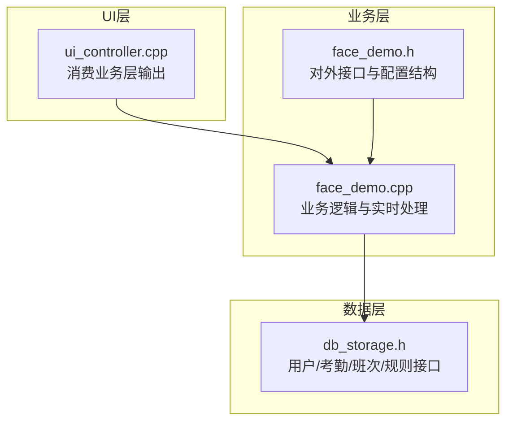
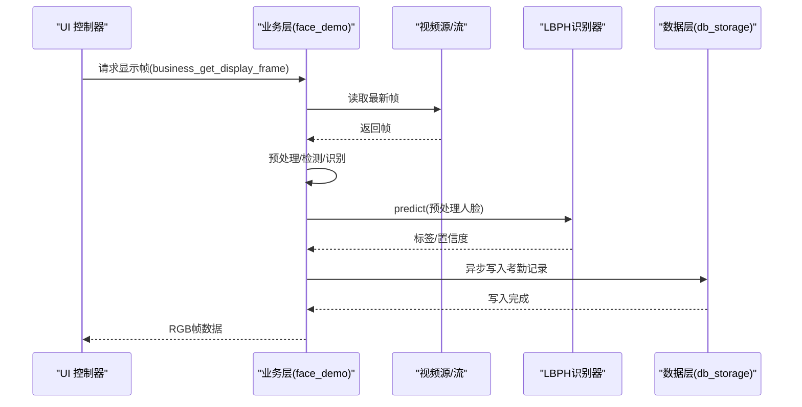
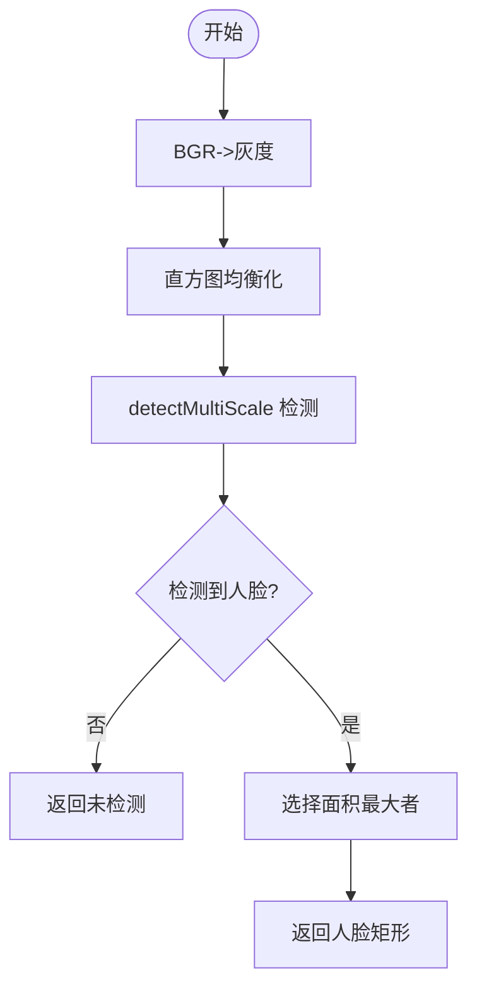
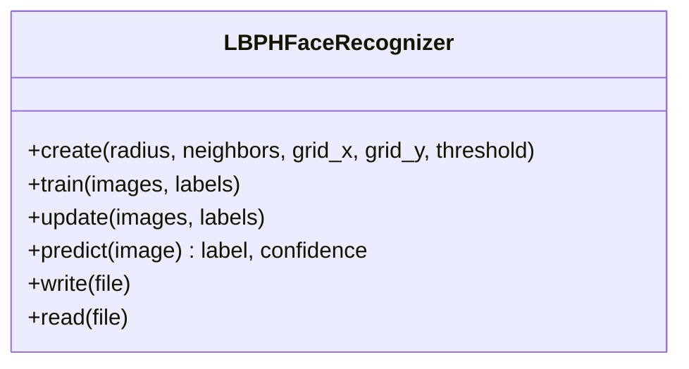
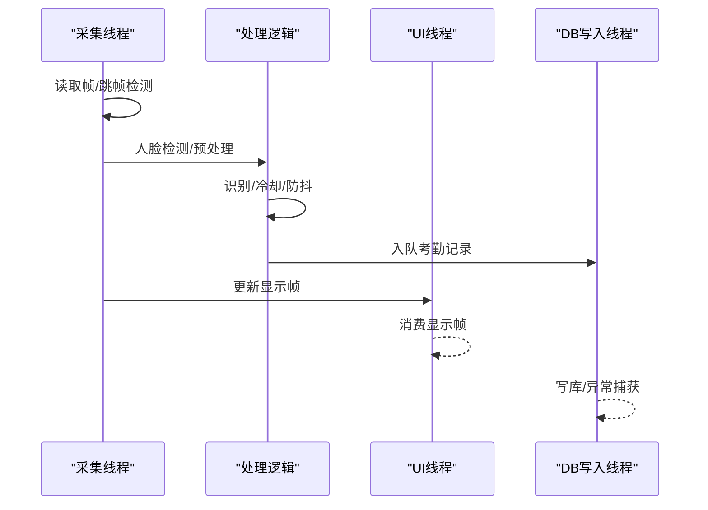
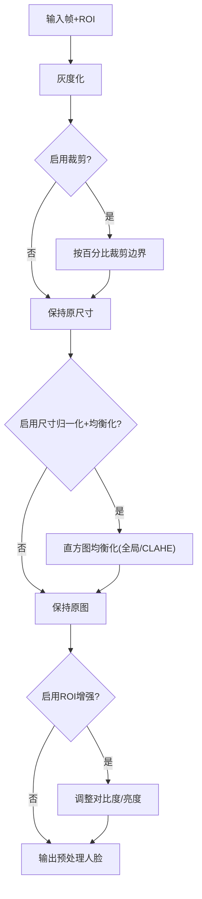
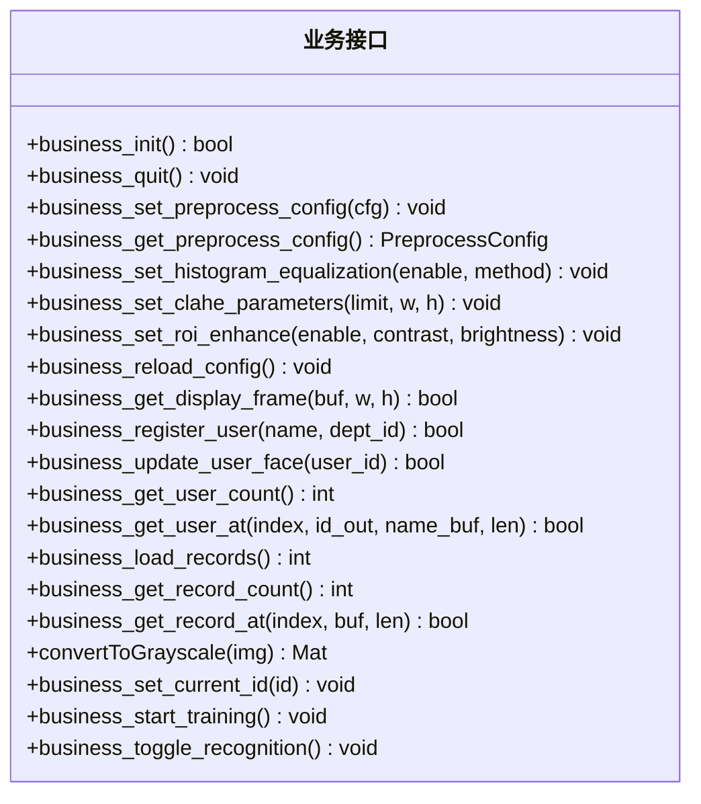
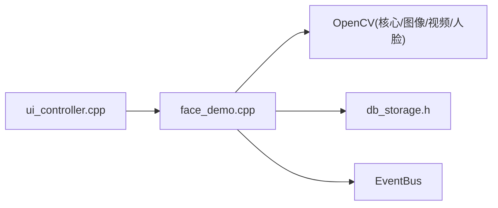

# 人脸识别模块

<cite>
**本文档引用的文件**
- [face_demo.h](file://src/business/face_demo.h)
- [face_demo.cpp](file://src/business/face_demo.cpp)
- [db_storage.h](file://src/data/db_storage.h)
- [ui_controller.cpp](file://src/ui/ui_controller.cpp)
</cite>

## 目录
1. [简介](#简介)
2. [项目结构](#项目结构)
3. [核心组件](#核心组件)
4. [架构总览](#架构总览)
5. [详细组件分析](#详细组件分析)
6. [依赖关系分析](#依赖关系分析)
7. [性能考量](#性能考量)
8. [故障排查指南](#故障排查指南)
9. [结论](#结论)
10. [附录](#附录)

## 简介
本文件为 SmartAttendance 人脸识别模块的技术文档，聚焦于 OpenCV DNN 模型加载与使用、人脸检测算法实现原理与参数配置、特征提取与匹配机制（LBPH）、实时视频流处理流程、预处理配置接口、API 接口定义与错误处理策略，以及性能优化建议与常见问题解决方案。文档面向工程实践，兼顾非专业读者的理解需求。

## 项目结构
人脸识别模块位于业务层，围绕以下关键文件组织：
- 业务层接口与实现：src/business/face_demo.{h,cpp}
- 数据层接口：src/data/db_storage.h
- UI 控制器：src/ui/ui_controller.cpp（负责消费业务层输出）

**图表来源**
- [face_demo.cpp:1-1408](file://src/business/face_demo.cpp#L1-L1408)
- [face_demo.h:1-196](file://src/business/face_demo.h#L1-L196)
- [db_storage.h:1-596](file://src/data/db_storage.h#L1-L596)
- [ui_controller.cpp:400-417](file://src/ui/ui_controller.cpp#L400-L417)

**章节来源**
- [face_demo.h:1-196](file://src/business/face_demo.h#L1-L196)
- [face_demo.cpp:1-1408](file://src/business/face_demo.cpp#L1-L1408)
- [db_storage.h:1-596](file://src/data/db_storage.h#L1-L596)
- [ui_controller.cpp:400-417](file://src/ui/ui_controller.cpp#L400-L417)

## 核心组件
- 人脸检测器：基于 OpenCV Haar 级联分类器，负责在帧中定位人脸区域。
- 特征提取与识别器：基于 OpenCV LBPH（Local Binary Pattern Histogram）人脸识别器，支持训练、增量更新与持久化。
- 实时处理线程：后台采集与处理线程，负责视频流读取、人脸检测、预处理、识别、考勤记录异步落库与 UI 缓冲更新。
- 预处理管线：直方图均衡化（全局/CLAHE）、裁剪、尺寸归一化、ROI 增强等。
- 数据与配置：SQLite 数据访问接口、考勤规则与班次配置、用户与记录缓存。

**章节来源**
- [face_demo.cpp:35-80](file://src/business/face_demo.cpp#L35-L80)
- [face_demo.cpp:559-684](file://src/business/face_demo.cpp#L559-L684)
- [face_demo.cpp:1273-1368](file://src/business/face_demo.cpp#L1273-L1368)
- [db_storage.h:315-461](file://src/data/db_storage.h#L315-L461)

## 架构总览
人脸识别模块采用“后台采集线程 + 数据库写入线程 + UI 消费”的多线程架构，业务层负责实时处理与模型管理，数据层负责持久化与配置查询，UI 层负责显示与交互。

**图表来源**
- [face_demo.cpp:293-551](file://src/business/face_demo.cpp#L293-L551)
- [face_demo.cpp:991-1036](file://src/business/face_demo.cpp#L991-L1036)
- [db_storage.h:421-461](file://src/data/db_storage.h#L421-L461)
- [ui_controller.cpp:400-417](file://src/ui/ui_controller.cpp#L400-L417)

## 详细组件分析

### 1) OpenCV Haar 人脸检测与参数配置
- 检测器加载：在初始化阶段查找并加载 Haar 级联分类器文件，若缺失则初始化失败。
- 检测流程：将输入帧转灰度、直方图均衡化后调用 detectMultiScale，返回最大人脸矩形区域。
- 关键参数：缩放因子、最小邻居数、最小人脸尺寸等，用于平衡召回与误检。

**图表来源**
- [face_demo.cpp:175-204](file://src/business/face_demo.cpp#L175-L204)

**章节来源**
- [face_demo.cpp:175-204](file://src/business/face_demo.cpp#L175-L204)

### 2) LBPH 特征提取与匹配机制
- 初始化：创建 LBPHFaceRecognizer，参数包含半径、邻域像素、网格大小与阈值。
- 训练与持久化：支持全量训练（读取本地头像）与增量更新；训练完成后保存模型至 XML 文件。
- 识别：对预处理后的人脸进行预测，返回标签与置信度；置信度低于阈值视为匹配。

**图表来源**
- [face_demo.cpp:569-684](file://src/business/face_demo.cpp#L569-L684)

**章节来源**
- [face_demo.cpp:569-684](file://src/business/face_demo.cpp#L569-L684)

### 3) 实时视频流处理流程
- 后台采集线程：周期性读取视频帧，进行人脸检测与识别，维护冷却时间与重复打卡防抖，异步写入数据库。
- UI 显示：将处理后的帧转换为 RGB 并缩放裁剪，提供给 UI 层消费。
- 流中断恢复：检测到流断开时自动重连，避免卡死。

**图表来源**
- [face_demo.cpp:293-551](file://src/business/face_demo.cpp#L293-L551)
- [face_demo.cpp:991-1036](file://src/business/face_demo.cpp#L991-L1036)
- [face_demo.cpp:245-287](file://src/business/face_demo.cpp#L245-L287)

**章节来源**
- [face_demo.cpp:293-551](file://src/business/face_demo.cpp#L293-L551)
- [face_demo.cpp:991-1036](file://src/business/face_demo.cpp#L991-L1036)
- [face_demo.cpp:245-287](file://src/business/face_demo.cpp#L245-L287)

### 4) 预处理配置接口与参数
- 配置结构体：包含裁剪、尺寸归一化、直方图均衡化（全局/CLAHE）、ROI 增强、调试选项等。
- 动态配置：支持运行时设置直方图均衡化方法、CLAHE 参数、ROI 对比度/亮度、裁剪边界等。
- 预处理管线：灰度化、可选裁剪、尺寸归一化、直方图均衡化、ROI 增强。

**图表来源**
- [face_demo.cpp:140-167](file://src/business/face_demo.cpp#L140-L167)
- [face_demo.cpp:84-108](file://src/business/face_demo.cpp#L84-L108)
- [face_demo.cpp:117-129](file://src/business/face_demo.cpp#L117-L129)

**章节来源**
- [face_demo.h:42-73](file://src/business/face_demo.h#L42-L73)
- [face_demo.cpp:1273-1368](file://src/business/face_demo.cpp#L1273-L1368)
- [face_demo.cpp:140-167](file://src/business/face_demo.cpp#L140-L167)
- [face_demo.cpp:84-108](file://src/business/face_demo.cpp#L84-L108)
- [face_demo.cpp:117-129](file://src/business/face_demo.cpp#L117-L129)

### 5) API 接口文档
- 初始化与退出
  - 初始化：加载检测器、打开视频源、初始化识别器、加载/训练模型、启动后台线程。
  - 退出：停止采集与写库线程，释放资源。
- 预处理配置
  - 设置/获取预处理配置、直方图均衡化、CLAHE 参数、ROI 增强、裁剪设置。
- 视频帧与 UI
  - 获取用于 UI 显示的帧（RGB、缩放、裁剪）。
- 用户与注册
  - 注册新用户（基于当前帧）、更新用户人脸、获取用户列表与数量。
- 考勤记录
  - 加载/获取考勤记录、格式化输出。
- 辅助
  - 灰度转换、切换识别开关、切换当前用户 ID。

**图表来源**
- [face_demo.h:34-196](file://src/business/face_demo.h#L34-L196)

**章节来源**
- [face_demo.h:34-196](file://src/business/face_demo.h#L34-L196)
- [face_demo.cpp:559-684](file://src/business/face_demo.cpp#L559-L684)
- [face_demo.cpp:991-1036](file://src/business/face_demo.cpp#L991-L1036)
- [face_demo.cpp:1038-1213](file://src/business/face_demo.cpp#L1038-L1213)
- [face_demo.cpp:1273-1368](file://src/business/face_demo.cpp#L1273-L1368)

### 6) 错误处理策略
- 异常捕获：后台采集线程与数据库写入线程均包裹 try-catch，避免崩溃；捕获 OpenCV/标准异常与未知异常。
- 流中断恢复：检测到视频流长时间无数据时主动释放并重连，防止线程卡死。
- 队列防护：数据库写入队列长度限制，超过阈值丢弃新任务，保护内存。
- 日志与状态：输出调试状态、识别开关、模型训练状态、冷却时间等，便于定位问题。

**章节来源**
- [face_demo.cpp:314-551](file://src/business/face_demo.cpp#L314-L551)
- [face_demo.cpp:245-287](file://src/business/face_demo.cpp#L245-L287)
- [face_demo.cpp:940-951](file://src/business/face_demo.cpp#L940-L951)

## 依赖关系分析
- 业务层依赖 OpenCV（核心/图像/视频/人脸模块）、SQLite 数据层接口、事件总线与 UI 控制器。
- 数据层提供用户、班次、规则、考勤记录的 CRUD 与查询接口。
- UI 控制器通过业务层提供的显示帧接口消费数据。

**图表来源**
- [face_demo.cpp:1-30](file://src/business/face_demo.cpp#L1-L30)
- [db_storage.h:1-50](file://src/data/db_storage.h#L1-L50)
- [ui_controller.cpp:400-417](file://src/ui/ui_controller.cpp#L400-L417)

**章节来源**
- [face_demo.cpp:1-30](file://src/business/face_demo.cpp#L1-L30)
- [db_storage.h:1-50](file://src/data/db_storage.h#L1-L50)
- [ui_controller.cpp:400-417](file://src/ui/ui_controller.cpp#L400-L417)

## 性能考量
- 跳帧检测：每 5 帧检测一次，降低 CPU 占用，同时维持跟踪稳定性。
- 线程解耦：采集线程与 UI/数据库线程分离，UI 刷新频率限制（约 60 FPS），避免阻塞。
- 队列异步：考勤记录通过队列异步写库，防止 UI 卡顿。
- 预处理优化：仅在检测到人脸时进行耗时预处理与识别，减少不必要的计算。
- 模型持久化：训练完成后保存模型，启动时快速加载，避免重复训练。

**章节来源**
- [face_demo.cpp:293-310](file://src/business/face_demo.cpp#L293-L310)
- [face_demo.cpp:510-536](file://src/business/face_demo.cpp#L510-L536)
- [face_demo.cpp:670-681](file://src/business/face_demo.cpp#L670-L681)
- [face_demo.cpp:595-667](file://src/business/face_demo.cpp#L595-L667)

## 故障排查指南
- 无法加载 Haar 模型
  - 现象：初始化失败，提示找不到/加载失败。
  - 处理：确认模型文件路径存在，或安装系统 OpenCV 模型包。
  - 参考：[face_demo.cpp:560-565](file://src/business/face_demo.cpp#L560-L565)
- 无法打开视频流
  - 现象：采集线程持续重连。
  - 处理：检查 SDP 管道参数、网络与设备状态；必要时更换视频源。
  - 参考：[face_demo.cpp:317-327](file://src/business/face_demo.cpp#L317-L327)
- 识别准确率低
  - 现象：置信度高、误识多。
  - 处理：调整 LBPH 阈值、优化预处理（直方图均衡化、裁剪、尺寸归一化）。
  - 参考：[face_demo.cpp:396-400](file://src/business/face_demo.cpp#L396-L400)
- UI 卡顿或掉帧
  - 现象：UI 刷新不流畅。
  - 处理：适当提高 UI 刷新间隔、减少预处理复杂度、避免在 UI 线程做耗时操作。
  - 参考：[face_demo.cpp:517-529](file://src/business/face_demo.cpp#L517-L529)
- 数据库写入失败
  - 现象：日志出现写入异常。
  - 处理：检查磁盘空间、权限与 SQLite 线程安全；关注队列溢出告警。
  - 参考：[face_demo.cpp:268-283](file://src/business/face_demo.cpp#L268-L283), [face_demo.cpp:940-951](file://src/business/face_demo.cpp#L940-L951)

**章节来源**
- [face_demo.cpp:560-565](file://src/business/face_demo.cpp#L560-L565)
- [face_demo.cpp:317-327](file://src/business/face_demo.cpp#L317-L327)
- [face_demo.cpp:396-400](file://src/business/face_demo.cpp#L396-L400)
- [face_demo.cpp:517-529](file://src/business/face_demo.cpp#L517-L529)
- [face_demo.cpp:268-283](file://src/business/face_demo.cpp#L268-L283)
- [face_demo.cpp:940-951](file://src/business/face_demo.cpp#L940-L951)

## 结论
人脸识别模块通过 Haar 检测与 LBPH 识别相结合，配合完善的预处理与多线程异步架构，在保证实时性的前提下实现了稳定的人脸识别与考勤记录落库。通过动态配置接口与清晰的 API 设计，模块具备良好的可扩展性与可维护性。建议在部署时根据硬件能力调整跳帧策略与预处理参数，并定期清理过期图片以维持系统性能。

## 附录
- 预处理配置字段说明
  - enable_crop：是否裁剪边界
  - crop_margin_percent：裁剪百分比
  - enable_resize_eq：是否尺寸归一化 + 直方图均衡化
  - enablez_resize：是否调整尺寸
  - resize_size：目标尺寸
  - hist_eq_method：直方图均衡化方法（0=无, 1=全局, 2=CLAHE）
  - clahe_clip_limit：CLAHE 剪切限制
  - clahe_tile_grid_size：CLAHE 网格大小
  - enable_roi_enhance：是否增强 ROI 对比度
  - roi_contrast：ROI 对比度增强因子
  - roi_brightness：ROI 亮度增强偏移量
  - debug_show_steps：是否显示调试中间步骤

**章节来源**
- [face_demo.h:42-73](file://src/business/face_demo.h#L42-L73)