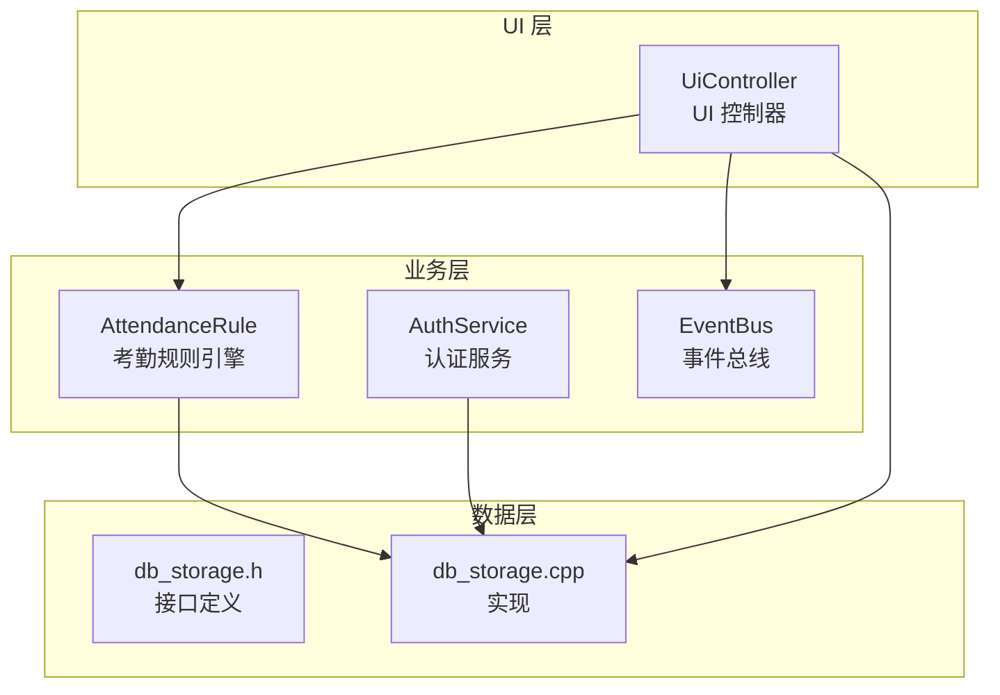
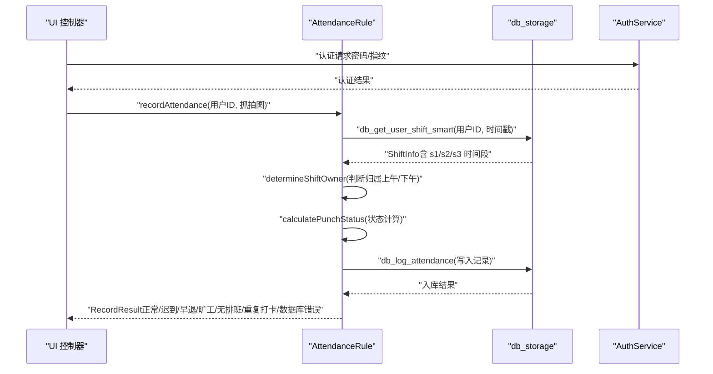
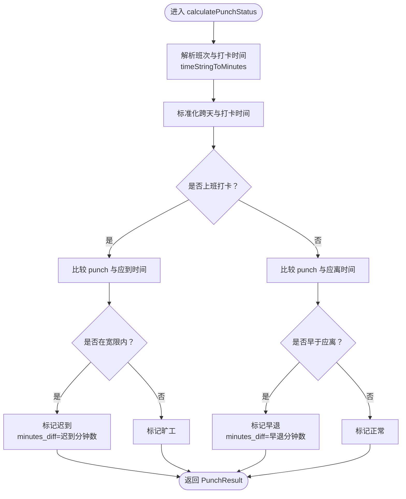
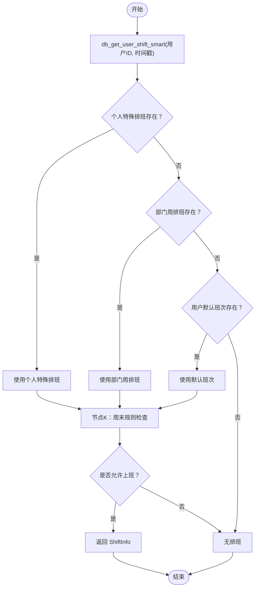
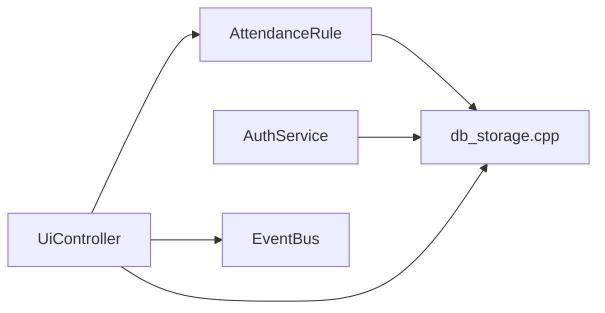

# 考勤规则引擎

<cite>
**本文引用的文件**
- [attendance_rule.h](file://src/business/attendance_rule.h)
- [attendance_rule.cpp](file://src/business/attendance_rule.cpp)
- [db_storage.h](file://src/data/db_storage.h)
- [db_storage.cpp](file://src/data/db_storage.cpp)
- [auth_service.h](file://src/business/auth_service.h)
- [auth_service.cpp](file://src/business/auth_service.cpp)
- [ui_controller.h](file://src/ui/ui_controller.h)
- [ui_controller.cpp](file://src/ui/ui_controller.cpp)
- [event_bus.h](file://src/business/event_bus.h)
- [event_bus.cpp](file://src/business/event_bus.cpp)
</cite>

## 目录
1. [简介](#简介)
2. [项目结构](#项目结构)
3. [核心组件](#核心组件)
4. [架构总览](#架构总览)
5. [详细组件分析](#详细组件分析)
6. [依赖关系分析](#依赖关系分析)
7. [性能考量](#性能考量)
8. [故障排查指南](#故障排查指南)
9. [结论](#结论)
10. [附录](#附录)

## 简介
本技术文档围绕 SmartAttendance 考勤规则引擎展开，系统性阐述考勤状态计算算法、班次管理系统、迟到/早退阈值与宽限机制、动态规则配置接口、规则冲突处理与优先级排序，并结合业务场景给出配置示例。文档面向开发者与实施人员，兼顾可读性与工程落地。

## 项目结构
项目采用分层架构：业务层负责考勤规则与认证、UI 层负责交互与报表、数据层负责持久化与规则配置。核心文件分布如下：
- 业务层：考勤规则、认证服务、事件总线、人脸识别流程
- 数据层：SQLite 封装、DAO 接口、全局规则、排班与报表
- UI 层：控制器封装、后台线程与事件发布

图表来源
- [attendance_rule.h:43-89](file://src/business/attendance_rule.h#L43-L89)
- [db_storage.h:187-596](file://src/data/db_storage.h#L187-L596)
- [ui_controller.h:21-106](file://src/ui/ui_controller.h#L21-L106)

章节来源
- [attendance_rule.h:1-92](file://src/business/attendance_rule.h#L1-L92)
- [db_storage.h:1-596](file://src/data/db_storage.h#L1-L596)
- [ui_controller.h:1-106](file://src/ui/ui_controller.h#L1-L106)

## 核心组件
- 考勤规则引擎（AttendanceRule）
  - 负责：班次归属判定、打卡状态计算、重复打卡检查、记录入库与语义返回
  - 关键接口：determineShiftOwner、calculatePunchStatus、recordAttendance、isStatusBetter、timeStringToMinutes
- 数据层（db_storage）
  - 负责：全局规则、班次、用户、排班、考勤记录的 CRUD 与查询
  - 关键接口：db_get_user_shift_smart（智能排班）、db_log_attendance（记录入库）、db_get_global_rules（规则读取）
- 认证服务（AuthService）
  - 负责：密码与指纹认证，认证成功后由业务层触发考勤记录
- UI 控制器（UiController）
  - 负责：系统状态、用户管理、报表导出、后台线程与事件订阅
- 事件总线（EventBus）
  - 负责：时间、磁盘状态、摄像头帧等事件的发布与订阅

章节来源
- [attendance_rule.h:43-89](file://src/business/attendance_rule.h#L43-L89)
- [db_storage.h:187-596](file://src/data/db_storage.h#L187-L596)
- [auth_service.h:23-45](file://src/business/auth_service.h#L23-L45)
- [ui_controller.h:21-106](file://src/ui/ui_controller.h#L21-L106)
- [event_bus.h:21-41](file://src/business/event_bus.h#L21-L41)

## 架构总览
考勤规则引擎贯穿“认证→排班→状态计算→入库→UI 展示”的主流程。认证通过后，业务层调用数据层获取当日排班，经节点 K（周末规则）判定后，依据班次与规则计算打卡状态，最终入库并返回语义结果供 UI 展示。

图表来源
- [attendance_rule.cpp:198-277](file://src/business/attendance_rule.cpp#L198-L277)
- [db_storage.cpp:1634-1763](file://src/data/db_storage.cpp#L1634-L1763)
- [auth_service.cpp:9-37](file://src/business/auth_service.cpp#L9-L37)

章节来源
- [attendance_rule.cpp:198-277](file://src/business/attendance_rule.cpp#L198-L277)
- [db_storage.cpp:1634-1763](file://src/data/db_storage.cpp#L1634-L1763)
- [auth_service.cpp:9-37](file://src/business/auth_service.cpp#L9-L37)

## 详细组件分析

### 考勤状态计算与算法
- 状态枚举与语义
  - 正常、迟到、早退、旷工；并提供“状态优劣比较”用于覆盖规则
- 上下班打卡分支
  - 上班打卡：以“应到时间”为基准，超过即为迟到或旷工；允许范围由全局规则 late_threshold 控制
  - 下班打卡：以“应离时间”为基准，早于应离即为早退
- 宽限与惩罚机制
  - 宽限：late_threshold（分钟）内记为“迟到”
  - 惩罚：超出宽限时长记为“旷工”
- 跨天与折中原则
  - 班次跨天：结束时间标准化为“次日分钟数”，打卡时间相应平移后再比较
  - 折中原则：上午/下午时间重叠区间采用中点划分，避免 12:00-13:00 的模糊归属

图表来源
- [attendance_rule.cpp:127-191](file://src/business/attendance_rule.cpp#L127-L191)
- [attendance_rule.cpp:24-74](file://src/business/attendance_rule.cpp#L24-L74)

章节来源
- [attendance_rule.cpp:11-13](file://src/business/attendance_rule.cpp#L11-L13)
- [attendance_rule.cpp:127-191](file://src/business/attendance_rule.cpp#L127-L191)
- [attendance_rule.cpp:24-74](file://src/business/attendance_rule.cpp#L24-L74)

### 班次管理系统与优先级
- 班次结构
  - 支持 s1/s2/s3 三个时段，cross_day 标识是否跨天
- 智能排班优先级
  - 个人特殊排班（最高）→ 部门周排班 → 默认班次
  - 节点 K：周六/周日是否上班由全局规则控制；个人特殊排班不受周末开关影响
- 动态配置接口
  - 班次更新：支持 s1/s2/s3 时间段与跨天标志
  - 全局规则：迟到/早退阈值、重复打卡限制、周末开关等

图表来源
- [db_storage.cpp:1634-1763](file://src/data/db_storage.cpp#L1634-L1763)
- [db_storage.h:34-55](file://src/data/db_storage.h#L34-L55)
- [db_storage.h:61-86](file://src/data/db_storage.h#L61-L86)

章节来源
- [db_storage.cpp:1634-1763](file://src/data/db_storage.cpp#L1634-L1763)
- [db_storage.h:34-55](file://src/data/db_storage.h#L34-L55)
- [db_storage.h:61-86](file://src/data/db_storage.h#L61-L86)

### 迟到/早退判定公式与阈值
- 上班打卡（迟到/旷工）
  - 迟到分钟数 = 打卡时刻 - 应到时刻
  - 若 minutes_diff ≤ late_threshold → 迟到
  - 否则 → 旷工
- 下班打卡（早退）
  - 早退分钟数 = 应离时刻 - 打卡时刻
  - 若 minutes_diff > 0 → 早退
  - 否则 → 正常
- 宽限与惩罚
  - 宽限：全局规则 late_threshold（分钟）
  - 惩罚：超过宽限即记为旷工

章节来源
- [attendance_rule.cpp:154-191](file://src/business/attendance_rule.cpp#L154-L191)
- [db_storage.h:61-86](file://src/data/db_storage.h#L61-L86)

### 动态规则配置接口
- 全局规则读取与更新
  - 读取：db_get_global_rules（包含迟到阈值、重复打卡限制、周末开关等）
  - 更新：db_update_global_rules（原子更新）
- 班次配置
  - db_update_shift：更新 s1/s2/s3 时间段与跨天标志
  - db_add_shift / db_delete_shift：新增/删除班次
- 个人/部门排班
  - db_set_user_special_schedule：个人特殊日期排班
  - db_set_dept_schedule：部门周排班

章节来源
- [db_storage.h:291-301](file://src/data/db_storage.h#L291-L301)
- [db_storage.h:475-491](file://src/data/db_storage.h#L475-L491)
- [db_storage.h:238-288](file://src/data/db_storage.h#L238-L288)
- [db_storage.cpp:697-744](file://src/data/db_storage.cpp#L697-L744)
- [db_storage.cpp:1597-1632](file://src/data/db_storage.cpp#L1597-L1632)

### 规则冲突处理与优先级排序
- 优先级链
  - 个人特殊排班 > 部门周排班 > 默认班次
- 节点 K（周末规则）
  - 仅对非个人特殊排班生效；管理员明确安排的日期不因周末开关而改变
- 状态覆盖
  - isStatusBetter：状态值越小优先级越高（正常优于迟到，早退优于旷工）

章节来源
- [db_storage.cpp:1634-1763](file://src/data/db_storage.cpp#L1634-L1763)
- [attendance_rule.cpp:11-13](file://src/business/attendance_rule.cpp#L11-L13)

### 业务场景与配置示例
- 场景一：标准白班（08:00-12:00, 14:00-18:00）
  - 配置：s1_start="08:00", s1_end="12:00", s2_start="14:00", s2_end="18:00"
  - 规则：late_threshold=15（允许15分钟内迟到）
- 场景二：夜班跨天（22:00-06:00）
  - 配置：s1_start="22:00", s1_end="06:00", cross_day=1
  - 规则：late_threshold=30（夜班可放宽至30分钟）
- 场景三：周末弹性
  - 全局规则：sat_work=1, sun_work=0（周六上班，周日休息）
  - 个人特例：管理员为某员工设置周日排班，不受全局周末开关影响
- 场景四：防重复打卡
  - 全局规则：duplicate_punch_limit=3（3分钟内重复打卡视为无效）

章节来源
- [db_storage.cpp:1634-1763](file://src/data/db_storage.cpp#L1634-L1763)
- [db_storage.h:61-86](file://src/data/db_storage.h#L61-L86)

## 依赖关系分析
- AttendanceRule 依赖 db_storage 的智能排班与规则读取
- UiController 依赖 db_storage 的用户、记录与报表查询接口
- EventBus 为 UI 控制器提供时间与磁盘状态事件
- AuthService 与 AttendanceRule 解耦，认证通过后由业务层触发考勤

图表来源
- [attendance_rule.cpp:1-10](file://src/business/attendance_rule.cpp#L1-L10)
- [db_storage.cpp:1-30](file://src/data/db_storage.cpp#L1-L30)
- [ui_controller.cpp:1-25](file://src/ui/ui_controller.cpp#L1-L25)
- [event_bus.cpp:1-28](file://src/business/event_bus.cpp#L1-L28)

章节来源
- [attendance_rule.cpp:1-10](file://src/business/attendance_rule.cpp#L1-L10)
- [db_storage.cpp:1-30](file://src/data/db_storage.cpp#L1-L30)
- [ui_controller.cpp:1-25](file://src/ui/ui_controller.cpp#L1-L25)
- [event_bus.cpp:1-28](file://src/business/event_bus.cpp#L1-L28)

## 性能考量
- 数据库并发
  - 读写分离：读操作使用共享锁，写操作使用排他锁，降低锁竞争
  - 预编译语句：考勤记录写入使用预编译语句，减少 SQL 解析开销
- 索引优化
  - 联合索引 idx_att_user_time 加速按用户与时间的查询
- I/O 优化
  - 抓拍图落盘与数据库写入分离，避免阻塞数据库写入
- 线程安全
  - EventBus 与 UI 控制器的后台线程独立运行，避免阻塞主线程

## 故障排查指南
- 常见错误与定位
  - 无排班（NO_SHIFT）：检查智能排班优先级与节点 K 规则
  - 重复打卡（DUPLICATE_PUNCH）：核对 duplicate_punch_limit 配置
  - 数据库错误（DB_ERROR）：检查 db_log_attendance 返回值与 SQLite 日志
- 排查步骤
  - 确认用户当日排班：db_get_user_shift_smart
  - 检查全局规则：db_get_global_rules
  - 核对时间格式：timeStringToMinutes 的容错处理
  - 验证跨天与折中：determineShiftOwner 的分钟换算逻辑

章节来源
- [attendance_rule.cpp:198-277](file://src/business/attendance_rule.cpp#L198-L277)
- [db_storage.cpp:1296-1348](file://src/data/db_storage.cpp#L1296-L1348)
- [db_storage.cpp:24-74](file://src/data/db_storage.cpp#L24-L74)

## 结论
本考勤规则引擎以清晰的优先级链与严格的跨天/折中处理为基础，结合可配置的全局规则与灵活的班次体系，实现了稳定可靠的考勤状态计算。通过防重复打卡、节点 K 周末规则与状态覆盖策略，满足多组织、多岗位的差异化需求。建议在部署时结合业务场景合理设置宽限与重复打卡阈值，并利用个人特殊排班与部门周排班实现精细化管理。

## 附录
- 关键接口清单
  - 考勤：recordAttendance、calculatePunchStatus、determineShiftOwner
  - 规则：db_get_global_rules、db_update_global_rules
  - 班次：db_update_shift、db_add_shift、db_delete_shift
  - 排班：db_set_user_special_schedule、db_set_dept_schedule、db_get_user_shift_smart
  - 认证：AuthService::verifyPassword、AuthService::verifyFingerprint
  - UI：UiController 的用户、记录、报表与后台线程接口

章节来源
- [attendance_rule.h:43-89](file://src/business/attendance_rule.h#L43-L89)
- [db_storage.h:291-301](file://src/data/db_storage.h#L291-L301)
- [db_storage.h:475-491](file://src/data/db_storage.h#L475-L491)
- [auth_service.h:23-45](file://src/business/auth_service.h#L23-L45)
- [ui_controller.h:21-106](file://src/ui/ui_controller.h#L21-L106)