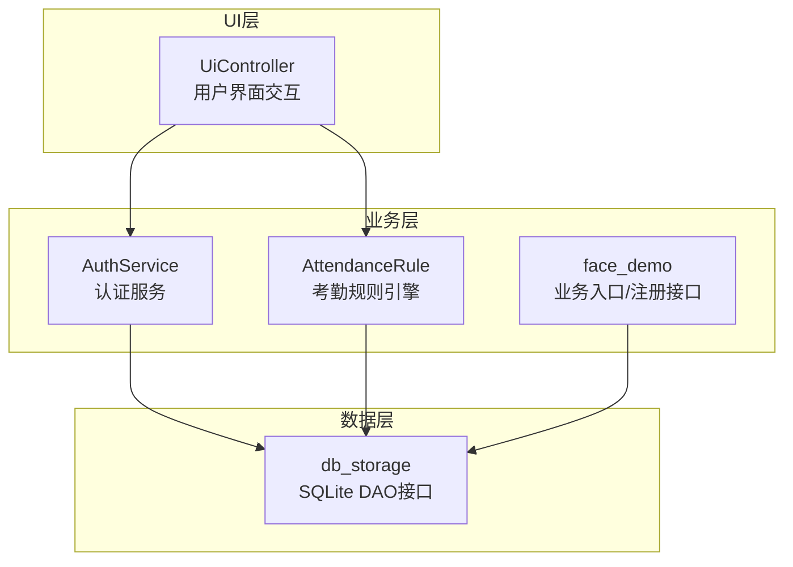
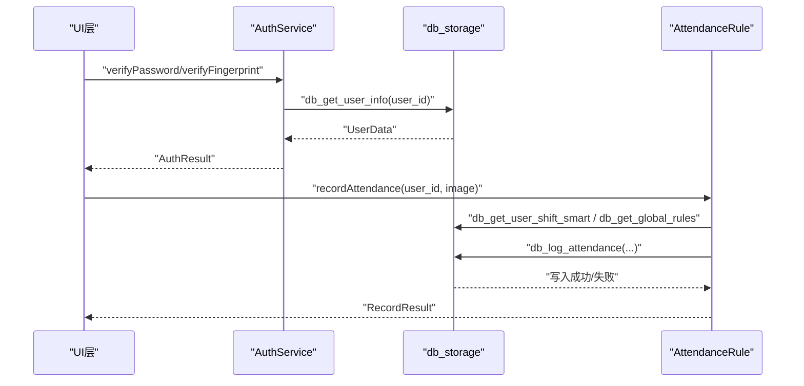
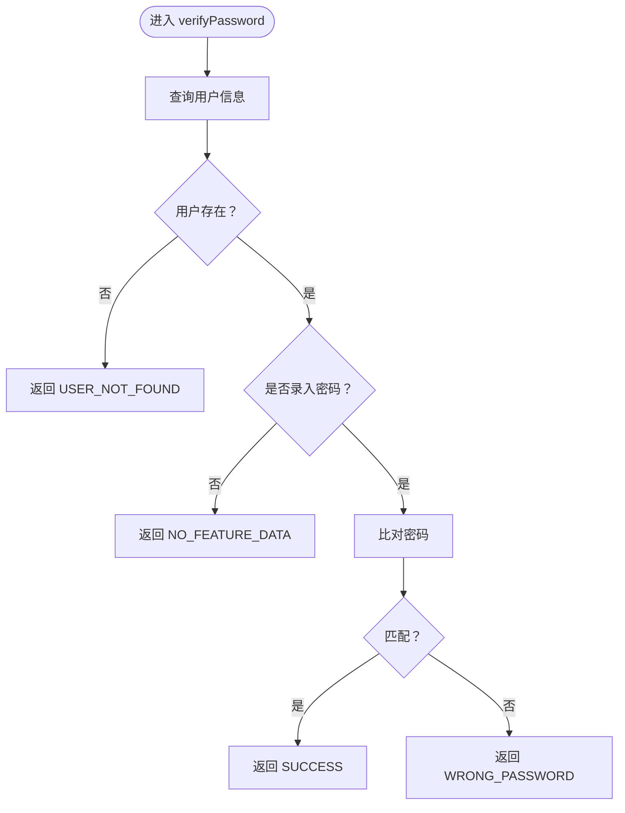
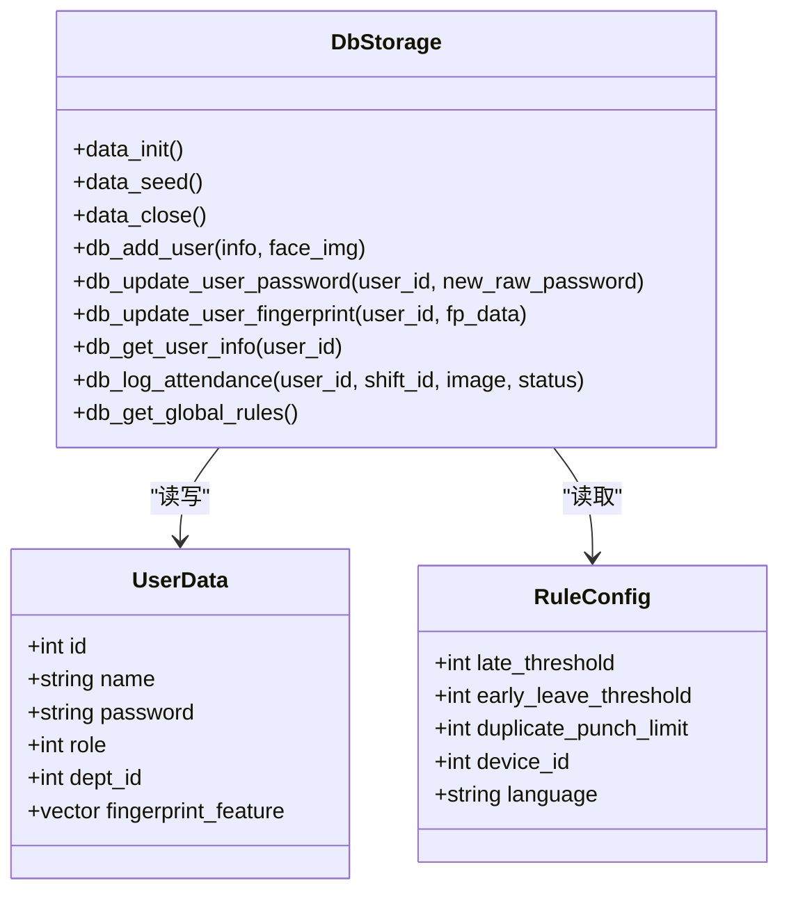
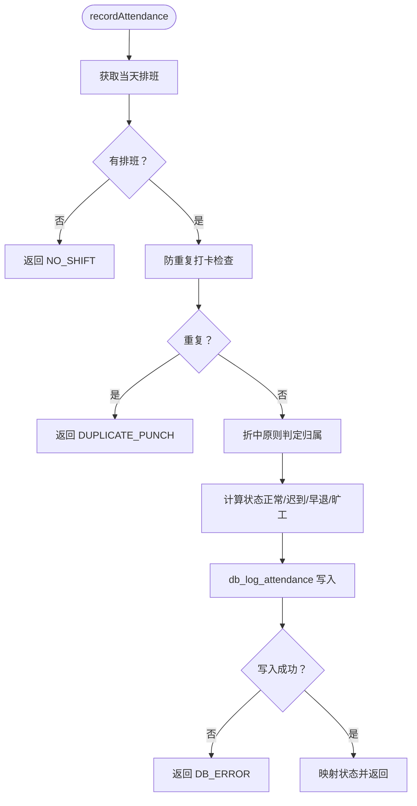
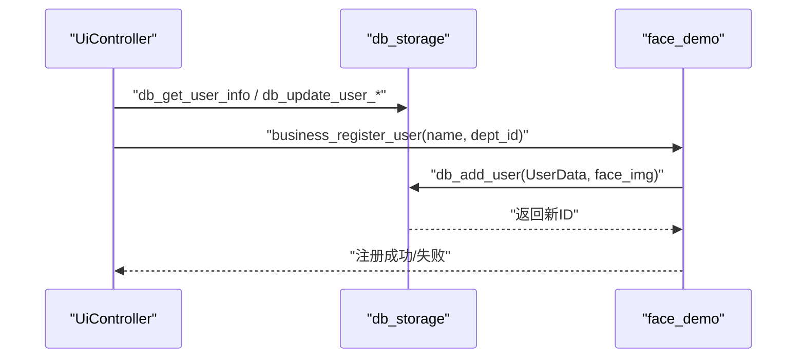
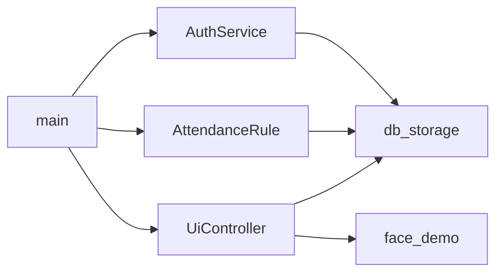

# 认证服务模块

<cite>
**本文引用的文件列表**
- [auth_service.h](file://src/business/auth_service.h)
- [auth_service.cpp](file://src/business/auth_service.cpp)
- [db_storage.h](file://src/data/db_storage.h)
- [db_storage.cpp](file://src/data/db_storage.cpp)
- [attendance_rule.h](file://src/business/attendance_rule.h)
- [attendance_rule.cpp](file://src/business/attendance_rule.cpp)
- [face_demo.cpp](file://src/business/face_demo.cpp)
- [ui_controller.h](file://src/ui/ui_controller.h)
- [ui_controller.cpp](file://src/ui/ui_controller.cpp)
- [main.cpp](file://src/main.cpp)
</cite>

## 目录
1. [简介](#简介)
2. [项目结构](#项目结构)
3. [核心组件](#核心组件)
4. [架构总览](#架构总览)
5. [详细组件分析](#详细组件分析)
6. [依赖关系分析](#依赖关系分析)
7. [性能考量](#性能考量)
8. [故障排查指南](#故障排查指南)
9. [结论](#结论)
10. [附录](#附录)

## 简介
本文件面向SmartAttendance认证服务模块，系统性阐述用户认证流程（密码与指纹）、权限控制模型、会话生命周期管理、用户管理接口与安全最佳实践。文档基于仓库现有实现进行技术解读，并提供可操作的集成与使用指南。

## 项目结构
认证服务位于业务层与数据层之间，围绕AuthService提供密码与指纹验证能力，结合AttendanceRule在认证成功后触发考勤记录流程。数据层通过db_storage提供用户、部门、班次、考勤等持久化能力，并内置SQLite WAL模式与读写锁保障并发安全。

图表来源
- [auth_service.h:23-44](file://src/business/auth_service.h#L23-L44)
- [db_storage.h:187-596](file://src/data/db_storage.h#L187-L596)
- [attendance_rule.h:43-89](file://src/business/attendance_rule.h#L43-L89)
- [face_demo.cpp:1078-1155](file://src/business/face_demo.cpp#L1078-L1155)
- [ui_controller.h:21-106](file://src/ui/ui_controller.h#L21-L106)

章节来源
- [main.cpp:187-246](file://src/main.cpp#L187-L246)
- [ui_controller.h:21-106](file://src/ui/ui_controller.h#L21-L106)

## 核心组件
- 认证服务AuthService：提供密码与指纹验证，返回标准化结果枚举。
- 数据层db_storage：提供用户、部门、班次、考勤等DAO接口，内置SQLite WAL与读写锁。
- 考勤规则引擎AttendanceRule：在认证成功后计算打卡归属与状态，写入数据库。
- UI控制器UiController：封装UI侧调用，暴露用户管理与权限查询接口。
- 业务入口face_demo：提供用户注册等业务入口。

章节来源
- [auth_service.h:8-44](file://src/business/auth_service.h#L8-L44)
- [db_storage.h:187-596](file://src/data/db_storage.h#L187-L596)
- [attendance_rule.h:8-89](file://src/business/attendance_rule.h#L8-L89)
- [ui_controller.h:21-106](file://src/ui/ui_controller.h#L21-L106)
- [face_demo.cpp:1078-1155](file://src/business/face_demo.cpp#L1078-L1155)

## 架构总览
认证服务采用分层架构：UI层负责交互与调用；业务层负责认证与考勤规则；数据层负责持久化与并发控制。认证成功后，AttendanceRule根据排班与规则计算状态并落库。

图表来源
- [auth_service.cpp:9-69](file://src/business/auth_service.cpp#L9-L69)
- [db_storage.h:348-432](file://src/data/db_storage.h#L348-L432)
- [attendance_rule.cpp:198-277](file://src/business/attendance_rule.cpp#L198-L277)

## 详细组件分析

### 认证服务AuthService
- 功能职责
  - 密码验证：从数据库读取用户信息，校验是否存在与是否录入密码，直接比对字符串（演示用途）。
  - 指纹验证：读取用户指纹特征，调用匹配算法（当前为占位模拟），返回匹配分数并判定结果。
- 关键流程
  - 用户查询与存在性检查
  - 特征数据存在性检查
  - 比对与阈值判定
- 安全要点
  - 密码比对建议改为哈希值比对（当前演示为明文比对）
  - 指纹算法需替换为厂商SDK，模拟逻辑仅用于流程演示

图表来源
- [auth_service.cpp:9-37](file://src/business/auth_service.cpp#L9-L37)

章节来源
- [auth_service.h:23-44](file://src/business/auth_service.h#L23-L44)
- [auth_service.cpp:9-69](file://src/business/auth_service.cpp#L9-L69)

### 数据层db_storage
- 数据结构
  - UserData：包含用户基本信息、角色、部门、默认班次、人脸与指纹特征等。
  - RuleConfig：系统全局规则（迟到阈值、设备ID、音量、重复打卡限制等）。
  - ShiftInfo：班次时间规则（支持多时段与跨天）。
- 并发与性能
  - 使用共享读写锁保护数据库操作，读多写少场景下提升吞吐。
  - WAL模式、内存临时表、外键约束等SQLite优化。
- 关键接口
  - 用户管理：注册、更新、查询、删除、密码与指纹更新。
  - 考勤记录：写入、查询、清理过期图片。
  - 全局配置：读取/设置系统配置与节假日。

图表来源
- [db_storage.h:104-142](file://src/data/db_storage.h#L104-L142)
- [db_storage.h:61-86](file://src/data/db_storage.h#L61-L86)
- [db_storage.cpp:108-285](file://src/data/db_storage.cpp#L108-L285)

章节来源
- [db_storage.h:104-142](file://src/data/db_storage.h#L104-L142)
- [db_storage.h:61-86](file://src/data/db_storage.h#L61-L86)
- [db_storage.cpp:108-285](file://src/data/db_storage.cpp#L108-L285)

### 考勤规则引擎AttendanceRule
- 功能职责
  - 根据用户当天排班与规则计算打卡归属（上下班）与状态（正常/迟到/早退/旷工）。
  - 防重复打卡检查（基于全局规则与最近记录）。
  - 调用数据层写入考勤记录。
- 关键流程
  - 获取排班（个人特殊排班 > 部门周排班 > 默认班次）
  - 防重复检查
  - 折中原则判定归属
  - 状态计算与入库

图表来源
- [attendance_rule.cpp:198-277](file://src/business/attendance_rule.cpp#L198-L277)
- [db_storage.h:432-444](file://src/data/db_storage.h#L432-L444)

章节来源
- [attendance_rule.h:43-89](file://src/business/attendance_rule.h#L43-L89)
- [attendance_rule.cpp:198-277](file://src/business/attendance_rule.cpp#L198-L277)

### UI控制器UiController与业务入口
- UiController
  - 提供用户角色查询、密码验证、用户列表、更新用户信息等接口。
  - 封装UI侧调用，简化业务层与数据层交互。
- 业务入口face_demo
  - 提供用户注册接口，注册成功后更新人脸识别模型并持久化。

图表来源
- [ui_controller.h:31-76](file://src/ui/ui_controller.h#L31-L76)
- [face_demo.cpp:1078-1155](file://src/business/face_demo.cpp#L1078-L1155)
- [db_storage.h:317-420](file://src/data/db_storage.h#L317-L420)

章节来源
- [ui_controller.h:21-106](file://src/ui/ui_controller.h#L21-L106)
- [face_demo.cpp:1078-1155](file://src/business/face_demo.cpp#L1078-L1155)

## 依赖关系分析
- AuthService依赖db_storage进行用户信息查询与指纹特征读取。
- AttendanceRule依赖db_storage进行排班查询、全局规则读取与考勤写入。
- UiController依赖db_storage与face_demo进行用户管理与业务操作。
- main负责系统初始化顺序与生命周期管理。

图表来源
- [auth_service.cpp:1-5](file://src/business/auth_service.cpp#L1-L5)
- [attendance_rule.cpp:1-9](file://src/business/attendance_rule.cpp#L1-L9)
- [ui_controller.cpp:1-10](file://src/ui/ui_controller.cpp#L1-L10)
- [main.cpp:30-34](file://src/main.cpp#L30-L34)

章节来源
- [auth_service.cpp:1-5](file://src/business/auth_service.cpp#L1-L5)
- [attendance_rule.cpp:1-9](file://src/business/attendance_rule.cpp#L1-L9)
- [ui_controller.cpp:1-10](file://src/ui/ui_controller.cpp#L1-L10)
- [main.cpp:30-34](file://src/main.cpp#L30-L34)

## 性能考量
- 数据层
  - WAL模式与读写锁提升并发读写性能，适合UI与业务线程并行场景。
  - 预编译高频SQL语句，降低执行开销。
  - 联合索引加速按用户与时间的查询。
- 认证与考勤
  - 用户查询与特征读取尽量在一次事务内完成，减少锁竞争。
  - AttendanceRule的防重复检查基于最近记录，避免频繁扫描全表。

章节来源
- [db_storage.cpp:123-135](file://src/data/db_storage.cpp#L123-L135)
- [db_storage.cpp:275-282](file://src/data/db_storage.cpp#L275-L282)
- [db_storage.cpp:253-257](file://src/data/db_storage.cpp#L253-L257)
- [attendance_rule.cpp:218-225](file://src/business/attendance_rule.cpp#L218-L225)

## 故障排查指南
- 认证失败
  - USER_NOT_FOUND：用户ID不存在或数据库未播种。
  - NO_FEATURE_DATA：用户未录入密码或指纹。
  - WRONG_PASSWORD/WRONG_FINGERPRINT：输入错误或指纹阈值未达标。
- 考勤记录异常
  - DB_ERROR：写入数据库失败，检查磁盘空间与权限。
  - DUPLICATE_PUNCH：重复打卡被限制，检查duplicate_punch_limit配置。
- 并发问题
  - 若出现读写冲突，确认是否使用共享读写锁保护关键路径。
- 密码安全
  - 当前演示为明文比对，生产环境务必改为哈希比对与安全存储。

章节来源
- [auth_service.cpp:14-36](file://src/business/auth_service.cpp#L14-L36)
- [attendance_rule.cpp:208-225](file://src/business/attendance_rule.cpp#L208-L225)
- [db_storage.cpp:304-314](file://src/data/db_storage.cpp#L304-L314)

## 结论
认证服务模块以AuthService为核心，结合db_storage的数据持久化与并发控制，配合AttendanceRule完成从认证到考勤的闭环。UI层通过UiController与业务入口facade简化调用。建议在生产环境中强化密码哈希、指纹算法替换与防暴力破解策略，以满足安全合规要求。

## 附录

### 用户管理接口说明
- 注册用户
  - 调用business_register_user，内部通过db_add_user写入用户与人脸数据。
- 登录状态检查
  - 通过UiController.getUserRoleById与verifyUserPassword进行角色与密码校验。
- 权限验证
  - 角色字段role为0（普通员工）或1（管理员），UI层据此控制菜单与功能可见性。

章节来源
- [face_demo.cpp:1078-1155](file://src/business/face_demo.cpp#L1078-L1155)
- [ui_controller.h:31-76](file://src/ui/ui_controller.h#L31-L76)
- [db_storage.h:104-142](file://src/data/db_storage.h#L104-L142)

### 安全考虑与最佳实践
- 密码加密存储
  - 使用db_hash_password进行简单哈希（演示用途），生产建议采用强哈希算法与盐值。
- 会话安全
  - 本模块未实现传统Web会话，建议在上层UI或网关层引入令牌机制与超时控制。
- 防暴力破解
  - 建议在UI层增加输入限制与尝试次数计数，结合数据库规则限制重复打卡窗口。

章节来源
- [db_storage.cpp:304-314](file://src/data/db_storage.cpp#L304-L314)
- [attendance_rule.cpp:218-225](file://src/business/attendance_rule.cpp#L218-L225)

### 使用示例与集成指南
- 初始化
  - main中依次调用data_init、ui_init、business_init，确保数据层可用后再启动业务与UI。
- 认证流程
  - UI层调用AuthService进行密码/指纹验证，成功后调用AttendanceRule.recordAttendance写入考勤。
- 用户管理
  - 通过UiController封装的接口进行用户增删改查与权限变更。

章节来源
- [main.cpp:187-246](file://src/main.cpp#L187-L246)
- [auth_service.cpp:9-69](file://src/business/auth_service.cpp#L9-L69)
- [attendance_rule.cpp:198-277](file://src/business/attendance_rule.cpp#L198-L277)
- [ui_controller.h:31-76](file://src/ui/ui_controller.h#L31-L76)