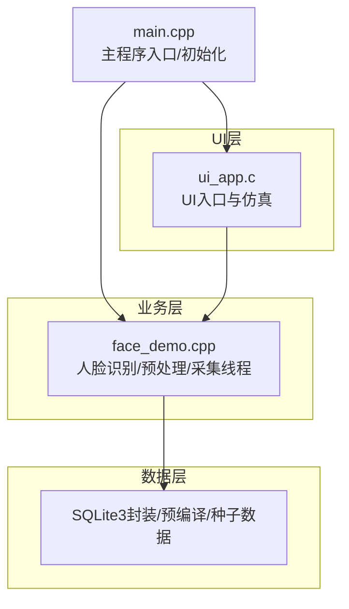
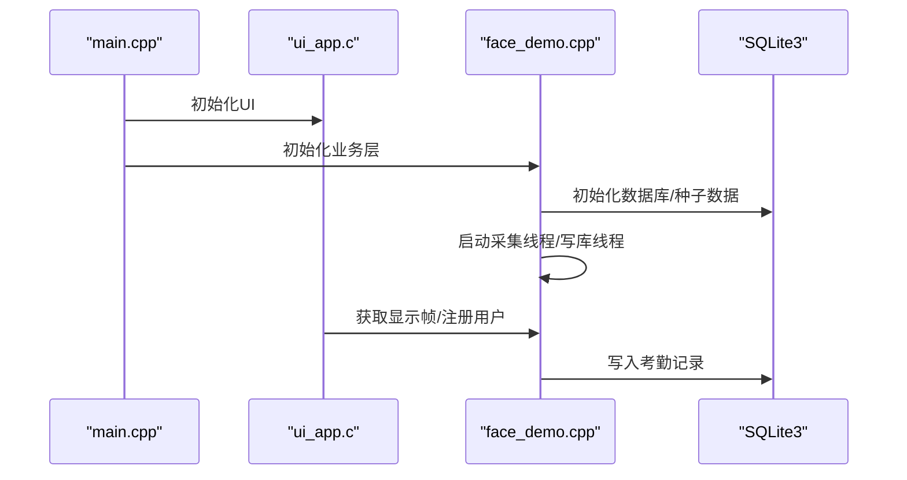
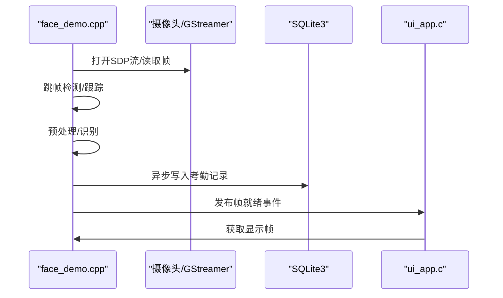
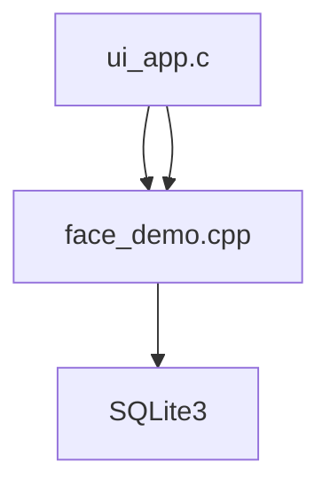

# 功能模块详解

<cite>
**本文档引用的文件**
- [src/main.cpp](file://src/main.cpp)
- [src/business/face_demo.cpp](file://src/business/face_demo.cpp)
- [src/business/face_demo.h](file://src/business/face_demo.h)
- [src/ui/ui_app.c](file://src/ui/ui_app.c)
</cite>

## 目录
1. [简介](#简介)
2. [项目结构](#项目结构)
3. [核心组件](#核心组件)
4. [架构总览](#架构总览)
5. [详细组件分析](#详细组件分析)
6. [依赖关系分析](#依赖关系分析)
7. [性能考量](#性能考量)
8. [故障排查指南](#故障排查指南)
9. [结论](#结论)
10. [附录](#附录)

## 简介
本文件面向智能考勤系统的功能模块，围绕以下主题展开：人脸识别模块（OpenCV集成、人脸检测、特征提取与匹配）、用户管理（注册、多模态认证、权限控制）、考勤管理（规则计算、状态判定、重复打卡防抖）、报表统计（Excel导出、统计维度）、系统配置（参数设置、设备管理、数据维护）。文档提供架构图、时序图、流程图与接口说明，帮助开发者与运维人员快速理解与扩展系统。

## 项目结构
系统采用分层架构：UI层（LVGL + SDL仿真）、业务层（人脸识别、认证、考勤规则、报表生成、事件总线）、数据层（SQLite3 + 预编译语句 + 读写锁）。

**图表来源**
- [src/main.cpp:14-78](file://src/main.cpp#L14-L78)
- [src/ui/ui_app.c:308-337](file://src/ui/ui_app.c#L308-L337)
- [src/business/face_demo.cpp:96-132](file://src/business/face_demo.cpp#L96-L132)

**章节来源**
- [src/main.cpp:14-78](file://src/main.cpp#L14-L78)
- [src/ui/ui_app.c:308-337](file://src/ui/ui_app.c#L308-L337)
- [src/business/face_demo.cpp:96-132](file://src/business/face_demo.cpp#L96-L132)

## 核心组件
- 人脸识别与采集线程：基于OpenCV的Haar级联检测与LBPH识别，后台线程持续采集/处理/展示，支持预处理配置、冷却与防抖。
- 认证服务：密码与指纹双模态认证，返回标准化结果枚举。
- 考勤规则引擎：支持跨天班次、折中原则判定打卡归属、状态计算与重复打卡防抖。
- 报表生成器：基于xlsxwriter，生成全员/个人/设置表等多Sheet报表。
- 数据层：SQLite3 + 预编译语句 + 读写锁，提供种子数据、事务、索引与图片BLOB存储。
- 事件总线：UI与业务解耦，支持时间更新、磁盘监控、摄像头帧就绪等事件。

**章节来源**
- [src/business/face_demo.cpp:96-132](file://src/business/face_demo.cpp#L96-L132)
- [src/business/face_demo.h:9-13](file://src/business/face_demo.h#L9-L13)

## 架构总览
系统启动顺序：主程序初始化UI与业务层，业务层加载模型/规则，后台线程驱动识别与数据库写入，UI通过控制器与业务/数据交互，事件总线贯穿各层。

**图表来源**
- [src/main.cpp:42-54](file://src/main.cpp#L42-L54)
- [src/ui/ui_app.c:308-337](file://src/ui/ui_app.c#L308-L337)
- [src/business/face_demo.cpp:96-132](file://src/business/face_demo.cpp#L96-L132)

## 详细组件分析

### 人脸识别模块（OpenCV集成、检测、特征与匹配）
- 模块职责
  - 加载Haar级联分类器与LBPH识别器，支持模型文件读写与全量训练。
  - 后台采集线程：跳帧检测、跟踪、预处理、识别、冷却与防抖、异步写库。
  - UI显示：将处理后的帧缓存供UI渲染，支持分辨率适配与刷新节流。
  - 预处理配置：裁剪、尺寸归一化、直方图均衡化（全局/CLAHE）、ROI增强。
- 关键流程
  - 初始化：加载模型/训练 → 启动采集与写库线程。
  - 采集循环：读取帧 → 跳帧检测/跟踪 → 预处理 → 识别 → 防抖/冷却 → 写库队列 → UI刷新。
- 防抖与冷却
  - 识别冷却：用户级冷却时间，避免频繁提示。
  - 重复打卡防抖：基于时间窗口的内存缓存，防止短时间内重复写库。
- API要点
  - business_init/business_run_once

**图表来源**
- [src/business/face_demo.cpp:137-204](file://src/business/face_demo.cpp#L137-L204)
- [src/business/face_demo.cpp:78-91](file://src/business/face_demo.cpp#L78-L91)
- [src/ui/ui_app.c:308-337](file://src/ui/ui_app.c#L308-L337)

**章节来源**
- [src/business/face_demo.cpp:96-132](file://src/business/face_demo.cpp#L96-L132)
- [src/business/face_demo.cpp:137-204](file://src/business/face_demo.cpp#L137-L204)
- [src/business/face_demo.cpp:78-91](file://src/business/face_demo.cpp#L78-L91)
- [src/business/face_demo.h:9-13](file://src/business/face_demo.h#L9-L13)

### 用户管理（注册、多模态认证、权限控制）
- 注册与更新
  - 注册：业务层捕获当前帧作为特征，写入数据库并刷新缓存。
  - 更新：支持更新人脸特征与基础信息。
- 多模态认证
  - 密码：明文比对（演示用途，建议生产使用哈希）。
  - 指纹：模板比对（占位实现，需接入厂商SDK）。
- 权限控制
  - 用户角色（普通/管理员）由数据层存储，UI层据此控制功能可见性。

**章节来源**
- [src/business/face_demo.cpp:180-204](file://src/business/face_demo.cpp#L180-L204)

### 考勤管理（规则计算、状态判定、重复打卡防抖）
- 规则计算
  - 班次跨天处理：结束时间小于开始时间视为跨天。
  - 折中原则：在上午下班与下午上班之间的时间段，依据中点归属。
  - 状态判定：正常/迟到（含分钟数）/早退（含分钟数）/旷工。
- 重复打卡防抖
  - 基于全局规则的重复打卡时间窗口限制。
- 入库与返回语义
  - 将状态映射为数据库存储码，返回UI语义结果。

**章节来源**
- [src/business/face_demo.cpp:152-165](file://src/business/face_demo.cpp#L152-L165)

### 报表统计模块（Excel报表生成、统计数据、导出）
- 报表类型
  - 全员/个人考勤报表：包含排班信息、汇总、记录、异常统计、明细等多Sheet。
  - 员工设置表：员工与考勤设置。
- 数据处理
  - 日期解析与格式化、班次月度映射、迟到/早退分钟数计算、最终状态汇总。
- 导出流程
  - UI控制器发起导出，生成器读取数据库，写入xlsx文件。

**章节来源**
- [src/business/face_demo.cpp:184-196](file://src/business/face_demo.cpp#L184-L196)

### 系统配置模块（参数设置、设备管理、数据维护）
- 参数设置
  - 全局规则（迟到阈值、重复打卡限制、语言/日期格式、周末上班开关等）。
- 设备管理
  - SDP视频流参数硬编码，支持重连与错误恢复。
- 数据维护
  - 种子数据（默认部门/班次/管理员/响铃计划）、索引、事务、图片清理（过期抓拍图）。

**章节来源**
- [src/business/face_demo.cpp:104-116](file://src/business/face_demo.cpp#L104-L116)
- [src/business/face_demo.cpp:118-124](file://src/business/face_demo.cpp#L118-L124)

## 依赖关系分析
- UI层依赖业务层与数据层，通过控制器封装调用。
- 业务层依赖数据层（读写）、事件总线（解耦）、OpenCV/LBPH（识别）。
- 数据层依赖SQLite3、xlsxwriter（报表）、OpenCV（图片编解码）。

**图表来源**
- [src/ui/ui_app.c:308-337](file://src/ui/ui_app.c#L308-L337)
- [src/business/face_demo.cpp:96-132](file://src/business/face_demo.cpp#L96-L132)

**章节来源**
- [src/ui/ui_app.c:308-337](file://src/ui/ui_app.c#L308-L337)
- [src/business/face_demo.cpp:96-132](file://src/business/face_demo.cpp#L96-L132)

## 性能考量
- 线程与锁
  - 采集线程与写库线程分离，队列+条件变量实现异步写入，避免阻塞UI。
  - 数据层使用读写锁，读多写少场景提升并发。
- 预处理与识别
  - 跳帧检测与跟踪降低CPU占用；预处理参数可调；识别冷却与重复防抖避免无效写库。
- 数据库优化
  - WAL模式、NORMAL同步、内存临时表、联合索引、预编译语句、事务批量导入。
- UI刷新
  - 帧缓存与节流（UI刷新周期限制）平衡流畅度与资源占用。

## 故障排查指南
- OpenCV/模型加载失败
  - 检查haar级联文件路径与权限；确认模型文件可读写。
- 视频流断连
  - 查看重连逻辑与日志；确认GStreamer管道参数与网络稳定性。
- 识别不准确
  - 调整预处理参数（裁剪、均衡化、ROI增强）；确保光照与角度合适。
- 数据库写入失败
  - 检查事务与锁；确认磁盘空间；查看预编译语句状态。
- 报表导出异常
  - 确认xlsxwriter可用；检查输出路径与权限；核对日期格式。

**章节来源**
- [src/business/face_demo.cpp:108-116](file://src/business/face_demo.cpp#L108-L116)
- [src/business/face_demo.cpp:113-116](file://src/business/face_demo.cpp#L113-L116)

## 结论
本系统通过清晰的分层设计与事件总线实现UI与业务解耦，结合OpenCV与SQLite3在边缘端实现了稳定的人脸识别、多模态认证、规则化考勤与报表导出能力。模块化接口便于扩展与维护，建议在生产环境中强化密码哈希、指纹SDK对接与监控告警。

## 附录

### API接口清单与使用示例（路径指引）
- 人脸识别
  - 初始化/退出：[business_init:96-132](file://src/business/face_demo.cpp#L96-L132)、[business_run_once:137-204](file://src/business/face_demo.cpp#L137-L204)
  - 获取显示帧：[business_get_display_frame](file://src/business/face_demo.h#L99)
  - 注册/更新用户：[business_register_user](file://src/business/face_demo.h#L128)、[business_update_user_face](file://src/business/face_demo.h#L135)
  - 预处理配置：[business_set_preprocess_config](file://src/business/face_demo.h#L77)、[business_reload_config](file://src/business/face_demo.h#L84)
- 认证服务
  - 密码验证：[AuthService::verifyPassword:9-37](file://src/business/auth_service.cpp#L9-L37)
  - 指纹验证：[AuthService::verifyFingerprint:42-69](file://src/business/auth_service.cpp#L42-L69)
- 考勤规则
  - 记录考勤：[AttendanceRule::recordAttendance:263-342](file://src/business/attendance_rule.cpp#L263-L342)
  - 时间解析：[AttendanceRule::timeStringToMinutes:24-139](file://src/business/attendance_rule.cpp#L24-L139)
- 报表生成
  - 全员报表：[ReportGenerator::exportAllAttendanceReport](file://src/business/report_generator.h#L91)
  - 个人报表：[ReportGenerator::exportIndividualAttendanceReport](file://src/business/report_generator.h#L94)
  - 设置表：[ReportGenerator::exportSettingsReport](file://src/business/report_generator.h#L96)
- 数据层
  - 初始化/关闭：[data_init:133-310](file://src/data/db_storage.cpp#L133-L310)、[data_close:415-430](file://src/data/db_storage.cpp#L415-L430)
  - 用户/部门/班次/规则：[db_add_user:773-820](file://src/data/db_storage.cpp#L773-L820)、[db_add_department:434-449](file://src/data/db_storage.cpp#L434-L449)、[db_add_shift:659-694](file://src/data/db_storage.cpp#L659-L694)、[db_get_global_rules:599-657](file://src/data/db_storage.cpp#L599-L657)
- UI控制器
  - 导出报表：[UiController::exportReportToUsb:193-210](file://src/ui/ui_controller.cpp#L193-L210)、[UiController::exportCustomReport:292-304](file://src/ui/ui_controller.cpp#L292-L304)、[UiController::exportUserReport:306-318](file://src/ui/ui_controller.cpp#L306-L318)
  - 导入设置表：[UiController::importEmployeeSettings:419-656](file://src/ui/ui_controller.cpp#L419-L656)
  - 磁盘监控/时间事件：[UiController::monitorThreadFunc:394-410](file://src/ui/ui_controller.cpp#L394-L410)

**章节来源**
- [src/business/face_demo.h:9-13](file://src/business/face_demo.h#L9-L13)
- [src/business/face_demo.cpp:96-132](file://src/business/face_demo.cpp#L96-L132)
- [src/business/face_demo.cpp:137-204](file://src/business/face_demo.cpp#L137-L204)