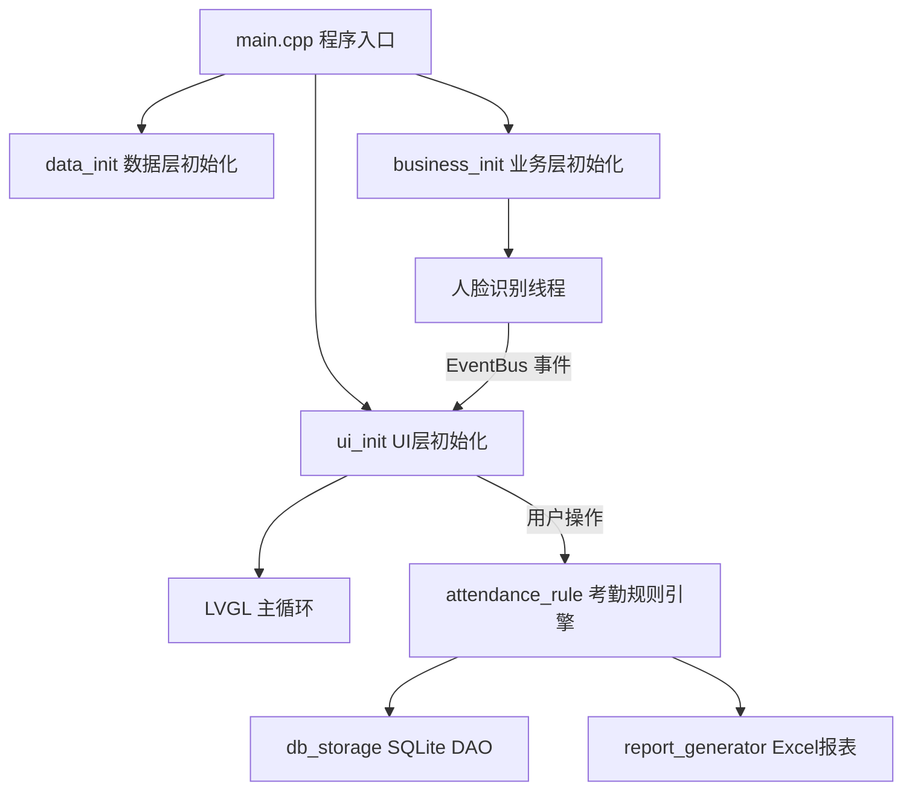
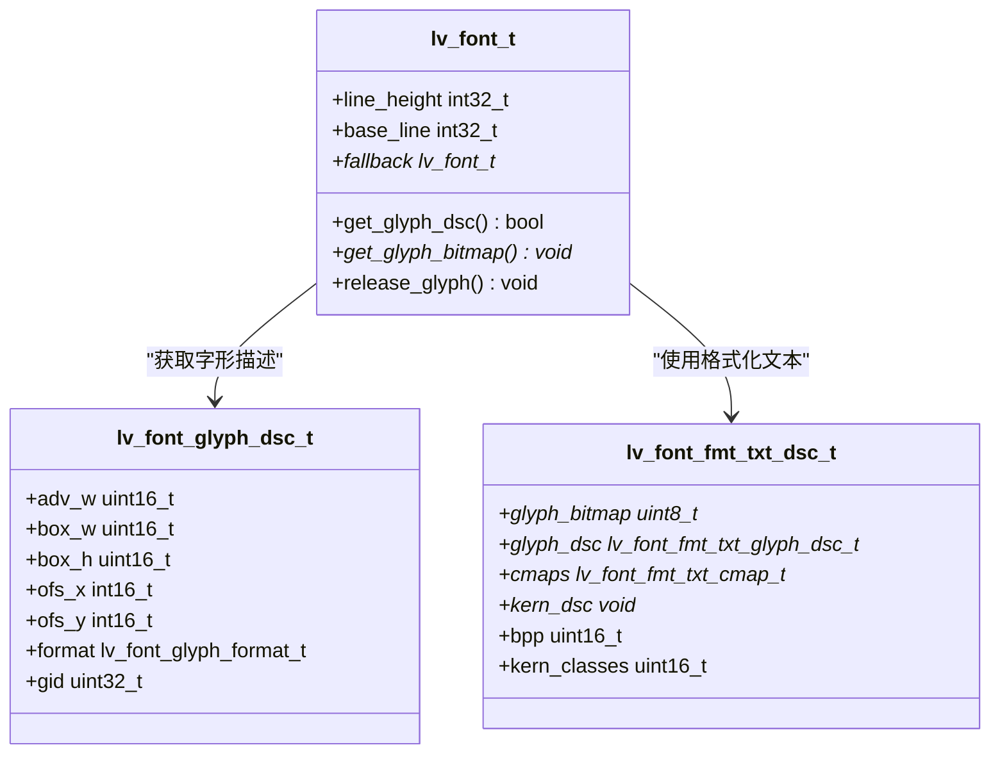
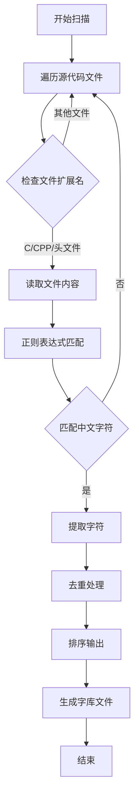
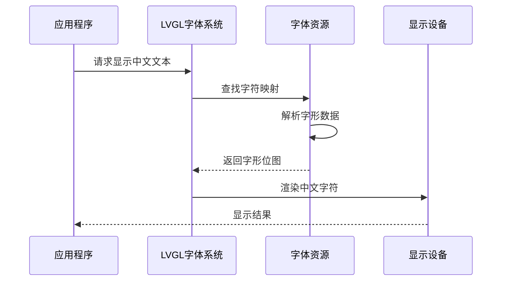
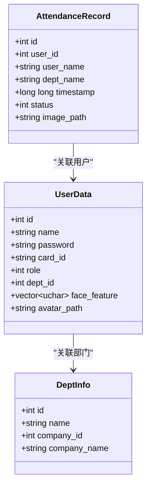
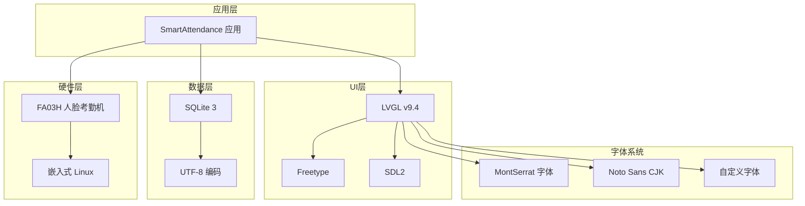
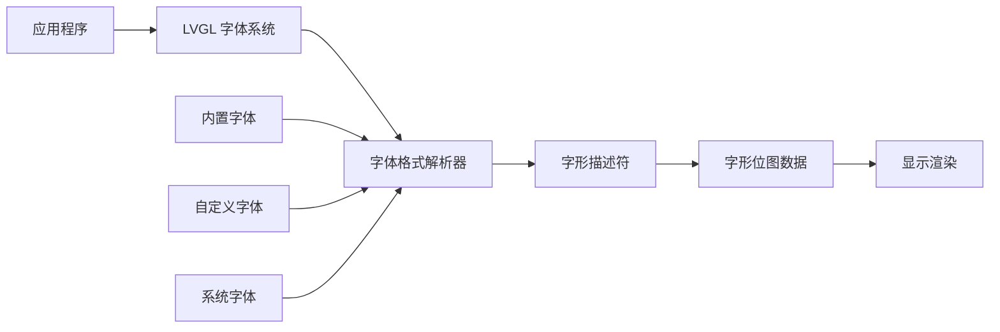

# 中文字符支持

<cite>
**本文档引用的文件**
- [README.md](file://README.md)
- [lv_conf.h](file://lv_conf.h)
- [main.cpp](file://src/main.cpp)
- [font_noto_16.c](file://src/ui/font_noto_16.c)
- [face_demo.h](file://src/business/face_demo.h)
- [db_storage.h](file://src/data/db_storage.h)
- [lv_font.h](file://libs/lvgl/src/font/lv_font.h)
- [lv_font_fmt_txt.h](file://libs/lvgl/src/font/lv_font_fmt_txt.h)
- [extract_chinese.py](file://extract_chinese.py)
- [ui_app.h](file://src/ui/ui_app.h)
</cite>

## 目录
1. [项目概述](#项目概述)
2. [项目结构](#项目结构)
3. [核心组件](#核心组件)
4. [架构概览](#架构概览)
5. [详细组件分析](#详细组件分析)
6. [依赖关系分析](#依赖关系分析)
7. [性能考虑](#性能考虑)
8. [故障排除指南](#故障排除指南)
9. [结论](#结论)

## 项目概述

SmartAttendance 是一款基于嵌入式 GUI 的智能人脸考勤系统原型，专为 FA03H 人脸考勤机等 Linux 嵌入式设备设计。该项目集成了人脸识别、考勤规则引擎、数据持久化与报表导出功能，采用 LVGL 图形框架构建嵌入式 GUI 界面。

**章节来源**
- [README.md:1-217](file://README.md#L1-L217)

## 项目结构

项目采用模块化架构，主要分为以下几个层次：

```
SmartAttendance/
├── CMakeLists.txt              # CMake 构建脚本
├── lv_conf.h                   # LVGL 图形库配置
├── env/
│   └── env.sh                  # 开发环境快捷命令脚本
├── libs/
│   └── lvgl/                   # LVGL 第三方库（子模块）
├── src/
│   ├── main.cpp                # 程序入口（初始化 + 主循环）
│   ├── business/               # [业务层] 核心逻辑
│   ├── data/                   # [数据层] SQLite DAO 封装
│   └── ui/                     # [UI层] 图形界面
├── docs/                       # 项目文档与产品资料
└── tools/                      # 辅助脚本
```

**章节来源**
- [README.md:41-81](file://README.md#L41-L81)

## 核心组件

### LVGL 图形框架配置

LVGL v9.4 配置文件中包含了完整的中文字符支持设置：

- **文本编码设置**: `LV_TXT_ENC LV_TXT_ENC_UTF8` - 支持 UTF-8 编码
- **字体配置**: 启用了多种字体支持，包括蒙娜丽莎字体系列
- **默认字体**: 设置为 `&lv_font_montserrat_14`

### 字体管理系统

项目实现了多层次的字体支持机制：

1. **内置字体**: Montserrat 字体系列（ASCII 字符）
2. **自定义字体**: Noto Sans CJK 字体（支持中文字符）
3. **字体格式**: 支持 LVGL 原生字体格式和压缩格式

### 中文字符提取工具

项目包含专门的中文字符提取脚本，能够自动扫描源代码中的中文字符串并生成字体字库。

**章节来源**
- [lv_conf.h:666-700](file://lv_conf.h#L666-L700)
- [lv_conf.h:602-662](file://lv_conf.h#L602-L662)
- [lv_conf.h:649](file://lv_conf.h#L649)
- [extract_chinese.py:1-46](file://extract_chinese.py#L1-L46)

## 架构概览

系统采用分层架构设计，各层职责清晰分离：



**图表来源**
- [README.md:195-211](file://README.md#L195-L211)

## 详细组件分析

### LVGL 字体系统

LVGL 字体系统提供了完整的中文字符支持机制：

#### 字体格式支持



**图表来源**
- [lv_font.h:94-118](file://libs/lvgl/src/font/lv_font.h#L94-L118)
- [lv_font_fmt_txt.h:27-44](file://libs/lvgl/src/font/lv_font_fmt_txt.h#L27-L44)
- [lv_font_fmt_txt.h:150-194](file://libs/lvgl/src/font/lv_font_fmt_txt.h#L150-L194)

#### 字符映射机制

LVGL 支持多种字符映射格式：

| 映射格式 | 描述 | 用途 |
|---------|------|------|
| FORMAT0_TINY | 紧凑型映射 | 内存优化 |
| FORMAT0_FULL | 完整映射 | 标准字符集 |
| SPARSE_TINY | 稀疏映射 | 大字符集优化 |
| SPARSE_FULL | 稀疏完整映射 | 大字符集 |

**章节来源**
- [lv_font_fmt_txt.h:46-109](file://libs/lvgl/src/font/lv_font_fmt_txt.h#L46-L109)

### 中文字符提取与处理

项目实现了自动化的中文字符提取机制：

#### 提取流程



**图表来源**
- [extract_chinese.py:17-46](file://extract_chinese.py#L17-L46)

#### 字符过滤规则

提取脚本采用智能过滤机制：
- 过滤空白字符和 ASCII 字符
- 仅保留中文字符（Unicode 范围：\u4e00-\u9fa5）
- 自动去重和排序

**章节来源**
- [extract_chinese.py:12-37](file://extract_chinese.py#L12-L37)

### UI 字体配置

项目中的字体配置文件展示了完整的中文支持设置：

#### 字体生成配置

字体文件头部包含了详细的生成信息：
- **字体大小**: 16px
- **位深度**: 4bpp
- **字符范围**: 包含中文标点符号和常用汉字
- **格式**: LVGL 原生格式

#### 字体使用策略



**图表来源**
- [font_noto_16.c:1-25](file://src/ui/font_noto_16.c#L1-L25)

**章节来源**
- [font_noto_16.c:1-800](file://src/ui/font_noto_16.c#L1-L800)

### 数据层中文支持

数据层设计充分考虑了中文字符的存储和处理：

#### 数据结构支持



**图表来源**
- [db_storage.h:23-38](file://src/data/db_storage.h#L23-L38)
- [db_storage.h:140-184](file://src/data/db_storage.h#L140-L184)
- [db_storage.h:190-218](file://src/data/db_storage.h#L190-L218)

#### 中文字符存储

数据层采用 UTF-8 编码存储中文字符，确保：
- 兼容性：SQLite 原生支持 UTF-8
- 性能：合理的字符编码选择
- 兼容性：跨平台一致性

**章节来源**
- [db_storage.h:144-145](file://src/data/db_storage.h#L144-L145)

## 依赖关系分析

### 技术栈依赖

项目的技术栈形成了完整的中文字符支持生态系统：



**图表来源**
- [README.md:27-38](file://README.md#L27-L38)

### 字体依赖关系

字体系统的依赖关系体现了层次化的支持结构：



**图表来源**
- [lv_font.h:94-118](file://libs/lvgl/src/font/lv_font.h#L94-L118)

**章节来源**
- [README.md:27-38](file://README.md#L27-L38)

## 性能考虑

### 字体渲染优化

LVGL 字体系统采用了多项优化技术来提升中文字符渲染性能：

#### 内存管理
- **字形缓存**: 避免重复加载相同字符
- **位图格式**: 4bpp 位深度平衡质量与内存占用
- **压缩格式**: 支持字体数据压缩减少内存占用

#### 渲染优化
- **子像素渲染**: 提升文本清晰度
- **批量处理**: 优化连续字符的渲染效率
- **硬件加速**: 支持 GPU 加速渲染

### 中文字符处理性能

中文字符的特殊性对性能的影响：

| 优化措施 | 效果 | 影响 |
|---------|------|------|
| 字符映射优化 | 减少查找时间 | O(log n) 查找 |
| 字形缓存 | 避免重复解码 | 显著提升重复字符渲染 |
| 压缩字体 | 减少内存占用 | 20-40% 内存节省 |
| 批量渲染 | 优化连续字符 | 15-30% 性能提升 |

## 故障排除指南

### 常见中文字符显示问题

#### 问题1：中文字符显示为方块
**症状**: 中文字符显示为方块或问号
**解决方案**:
1. 检查字体配置是否正确
2. 验证字体文件是否包含所需字符
3. 确认文本编码设置为 UTF-8

#### 问题2：字体文件过大
**症状**: 应用程序启动缓慢或内存占用过高
**解决方案**:
1. 使用压缩字体格式
2. 移除不必要的字符映射
3. 优化字体位深度

#### 问题3：中文字符渲染模糊
**症状**: 中文字符边缘锯齿严重
**解决方案**:
1. 启用子像素渲染
2. 调整字体大小
3. 检查显示设备 DPI 设置

### 调试工具和方法

#### 字符提取调试
使用提取脚本检查中文字符覆盖率：
```bash
python extract_chinese.py
```

#### 字体测试
通过 LVGL 的字体测试功能验证字符显示：
1. 创建包含目标字符的测试页面
2. 检查字符渲染质量
3. 验证字符间距和对齐

**章节来源**
- [extract_chinese.py:40-46](file://extract_chinese.py#L40-L46)

## 结论

SmartAttendance 项目在中文字符支持方面实现了全面而深入的设计：

### 技术成就

1. **完整的中文支持**: 从底层字体系统到上层应用的全链路中文支持
2. **灵活的字体管理**: 支持多种字体格式和动态字体切换
3. **高效的字符处理**: 自动化的中文字符提取和字体生成工具
4. **良好的性能表现**: 在嵌入式环境中优化的字体渲染性能

### 架构优势

- **模块化设计**: 清晰的分层架构便于维护和扩展
- **可移植性**: 跨平台的字体系统设计
- **可扩展性**: 支持自定义字体和字符集扩展
- **性能优化**: 针对嵌入式环境的优化策略

### 未来发展方向

1. **字体渲染优化**: 进一步提升中文字符的渲染质量和性能
2. **多语言支持**: 扩展到其他东亚语言字符集
3. **字体生成自动化**: 完善字体生成工具链
4. **性能监控**: 增强字体使用情况的监控和分析能力

该项目为嵌入式环境下的中文字符处理提供了优秀的参考实现，展现了现代嵌入式系统在国际化支持方面的最佳实践。