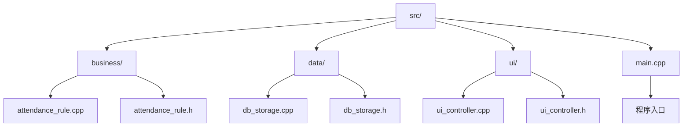
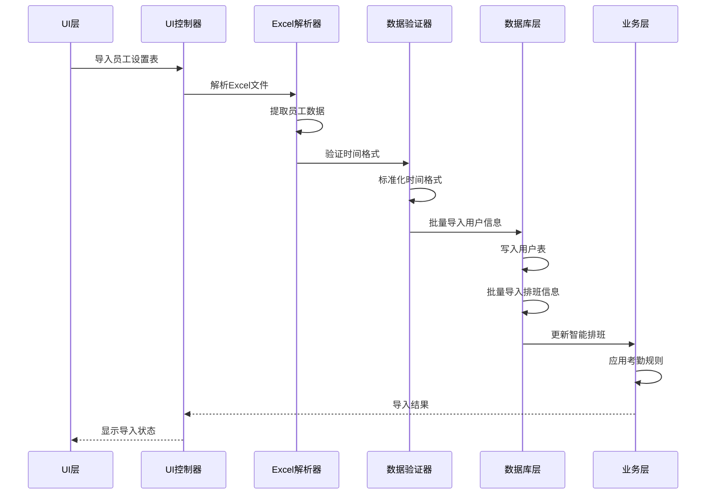
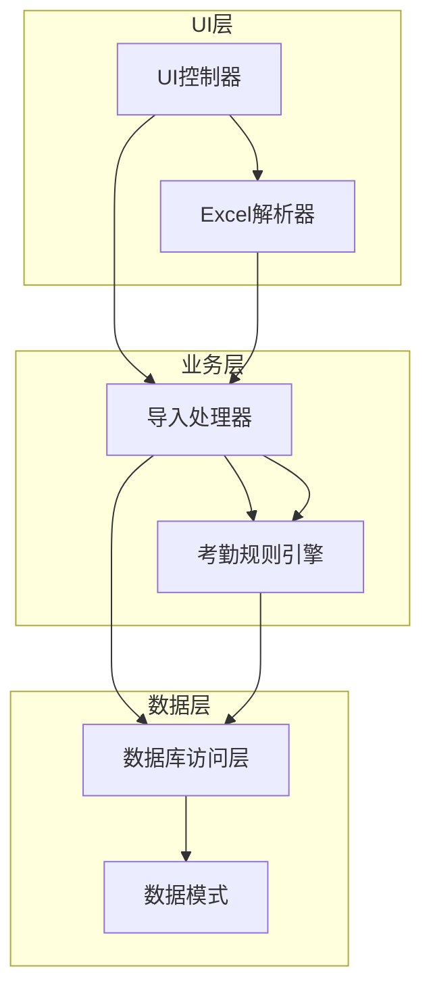

# 批量排班导入

<cite>
**本文档引用的文件**
- [README.md](file://README.md)
- [src/main.cpp](file://src/main.cpp)
- [src/business/attendance_rule.cpp](file://src/business/attendance_rule.cpp)
- [src/business/attendance_rule.h](file://src/business/attendance_rule.h)
- [src/data/db_storage.cpp](file://src/data/db_storage.cpp)
- [src/data/db_storage.h](file://src/data/db_storage.h)
- [src/ui/ui_controller.cpp](file://src/ui/ui_controller.cpp)
- [src/ui/ui_controller.h](file://src/ui/ui_controller.h)
</cite>

## 目录
1. [简介](#简介)
2. [项目结构](#项目结构)
3. [核心组件](#核心组件)
4. [架构概览](#架构概览)
5. [详细组件分析](#详细组件分析)
6. [依赖关系分析](#依赖关系分析)
7. [性能考虑](#性能考虑)
8. [故障排除指南](#故障排除指南)
9. [结论](#结论)

## 简介

批量排班导入是SmartAttendance智能考勤系统中的核心功能之一，允许管理员通过U盘导入员工排班信息，实现大规模的排班数据管理。该功能基于Excel电子表格格式，支持员工基本信息和月度排班计划的批量导入。

系统采用三层架构设计：UI层负责用户界面交互，业务层处理考勤规则和数据逻辑，数据层负责数据库操作。批量导入功能通过UI控制器协调各个层次，实现从Excel文件解析到数据库存储的完整流程。

## 项目结构

SmartAttendance项目采用模块化设计，主要包含以下核心目录：

**图表来源**
- [src/main.cpp:1-246](file://src/main.cpp#L1-L246)
- [src/business/attendance_rule.cpp:1-342](file://src/business/attendance_rule.cpp#L1-L342)
- [src/data/db_storage.cpp:1-800](file://src/data/db_storage.cpp#L1-L800)
- [src/ui/ui_controller.cpp:600-876](file://src/ui/ui_controller.cpp#L600-L876)

**章节来源**
- [README.md:41-81](file://README.md#L41-L81)
- [src/main.cpp:187-246](file://src/main.cpp#L187-L246)

## 核心组件

批量排班导入功能涉及以下关键组件：

### 1. UI控制器 (UiController)
负责处理用户界面交互和业务逻辑协调，提供导入员工设置表的功能接口。

### 2. 数据访问层 (DbStorage)
提供数据库操作接口，包括批量添加用户、批量更新用户排班等功能。

### 3. 考勤规则引擎 (AttendanceRule)
处理时间格式验证和转换，确保导入的排班数据符合系统要求。

### 4. Excel解析器
解析Excel文件格式，提取员工信息和排班数据。

**章节来源**
- [src/ui/ui_controller.h:61-62](file://src/ui/ui_controller.h#L61-L62)
- [src/data/db_storage.h:424-442](file://src/data/db_storage.h#L424-L442)
- [src/business/attendance_rule.h:43-88](file://src/business/attendance_rule.h#L43-L88)

## 架构概览

批量排班导入采用分层架构设计，各层职责清晰分离：

**图表来源**
- [src/ui/ui_controller.cpp:600-876](file://src/ui/ui_controller.cpp#L600-L876)
- [src/data/db_storage.cpp:1076-1105](file://src/data/db_storage.cpp#L1076-L1105)
- [src/business/attendance_rule.cpp:24-139](file://src/business/attendance_rule.cpp#L24-L139)

## 详细组件分析

### Excel文件解析组件

系统支持特定格式的Excel文件导入，包含两个工作表：

#### 员工设置表 (Sheet1)
- **表头行**: 第1行为标题，包含年份和月份信息
- **数据行**: 从第6行开始，包含员工基本信息
- **列定义**:
  - A列: 工号 (数字)
  - B列: 姓名 (字符串)
  - C列: 部门ID (数字)
  - D列: 权限 (数字, 0=普通 1=管理员)
  - E列到AF列: 1-31号的排班信息

#### 考勤设置表 (Sheet2)
- **行定义**: 第5行到第14行，对应班次1-10
- **列定义**:
  - A列: 班次号 (1-10)
  - B列: s1_start (时段1开始时间)
  - C列: s1_end (时段1结束时间)
  - D列: s2_start (时段2开始时间)
  - E列: s2_end (时段2结束时间)
  - F列: s3_start (时段3开始时间)
  - G列: s3_end (时段3结束时间)

**章节来源**
- [src/ui/ui_controller.cpp:612-723](file://src/ui/ui_controller.cpp#L612-L723)
- [src/ui/ui_controller.cpp:725-826](file://src/ui/ui_controller.cpp#L725-L826)

### 数据验证和转换组件

系统实现了严格的数据验证机制：

#### 时间格式验证
- 支持多种时间格式输入
- 自动检测和转换Excel浮点数时间格式
- 标准化为"HH:MM"格式
- 验证时间范围的有效性

#### 排班数据验证
- 检查班次ID的有效范围 (1-10)
- 验证员工ID的正整数性
- 处理休息日标记 ("-" 或 "休")

**章节来源**
- [src/ui/ui_controller.cpp:735-773](file://src/ui/ui_controller.cpp#L735-L773)
- [src/business/attendance_rule.cpp:24-139](file://src/business/attendance_rule.cpp#L24-L139)

### 数据库操作组件

批量导入功能通过以下数据库操作实现：

#### 用户信息批量导入
- 使用INSERT OR REPLACE语句
- 支持用户信息的更新和新增
- 自动处理重复用户ID

#### 排班信息批量导入
- 按月度维度存储排班数据
- 使用日期字符串作为复合主键的一部分
- 支持灵活的排班查询和检索

**章节来源**
- [src/data/db_storage.cpp:1076-1105](file://src/data/db_storage.cpp#L1076-L1105)
- [src/data/db_storage.h:442-442](file://src/data/db_storage.h#L442-L442)

### 考勤规则集成

导入的排班数据与系统考勤规则紧密结合：

#### 智能排班获取
- 优先级: 个人特殊排班 > 部门周排班 > 默认班次
- 支持周末上班规则 (节点K)
- 跨天班次的特殊处理

#### 时间标准化
- 统一处理跨天时间
- 标准化打卡时间计算
- 支持复杂的班次组合

**章节来源**
- [src/business/attendance_rule.cpp:263-342](file://src/business/attendance_rule.cpp#L263-L342)
- [src/data/db_storage.h:608-608](file://src/data/db_storage.h#L608-L608)

## 依赖关系分析

批量排班导入功能涉及多个组件间的复杂依赖关系：

**图表来源**
- [src/ui/ui_controller.cpp:600-876](file://src/ui/ui_controller.cpp#L600-L876)
- [src/business/attendance_rule.cpp:1-342](file://src/business/attendance_rule.cpp#L1-L342)
- [src/data/db_storage.cpp:1-800](file://src/data/db_storage.cpp#L1-L800)

### 组件耦合度分析

- **UI层与业务层**: 通过接口解耦，降低直接依赖
- **业务层与数据层**: 通过DAO模式实现松耦合
- **数据层内部**: 表结构设计支持高效的查询和更新操作

**章节来源**
- [src/ui/ui_controller.h:21-132](file://src/ui/ui_controller.h#L21-L132)
- [src/data/db_storage.h:1-800](file://src/data/db_storage.h#L1-L800)

## 性能考虑

批量排班导入功能在性能方面采取了多项优化措施：

### 数据库性能优化
- 使用事务批量操作，减少数据库往返次数
- 预编译SQL语句，提高执行效率
- 合理的索引设计，优化查询性能

### 内存管理
- 流式解析Excel文件，避免大文件占用过多内存
- 及时清理临时数据和资源
- 使用RAII模式管理数据库连接

### 并发处理
- 线程安全的数据库访问
- 读写锁分离，提高并发性能
- 异步处理大量数据导入

## 故障排除指南

### 常见问题及解决方案

#### Excel文件格式问题
- **问题**: Excel文件无法解析
- **原因**: 文件格式不符合要求
- **解决**: 确保使用系统提供的模板文件

#### 时间格式验证失败
- **问题**: 导入过程中出现时间格式错误
- **原因**: Excel中的时间格式不规范
- **解决**: 检查并修正Excel中的时间格式

#### 数据库操作失败
- **问题**: 用户信息或排班数据导入失败
- **原因**: 数据库连接问题或权限不足
- **解决**: 检查数据库状态和文件权限

**章节来源**
- [src/ui/ui_controller.cpp:828-851](file://src/ui/ui_controller.cpp#L828-L851)
- [src/data/db_storage.cpp:1076-1105](file://src/data/db_storage.cpp#L1076-L1105)

### 调试和监控

系统提供了完善的调试和监控机制：

- 导入过程的日志输出
- 错误计数和统计信息
- 数据完整性验证
- 性能指标监控

## 结论

批量排班导入功能是SmartAttendance系统的重要组成部分，通过精心设计的架构和严格的实现，实现了高效、可靠的批量数据处理能力。该功能不仅满足了实际业务需求，还为系统的扩展性和维护性奠定了坚实基础。

系统的主要优势包括：
- 清晰的分层架构设计
- 完善的数据验证机制
- 高效的数据库操作
- 良好的用户体验
- 强大的扩展能力

未来可以进一步优化的方向包括：
- 支持更多文件格式
- 增强错误恢复能力
- 提供更详细的导入报告
- 优化大数据量处理性能