# 班次管理界面

<cite>
**本文档引用的文件**
- [ui_scr_att_design.cpp](file://src/ui/screens/att_design/ui_scr_att_design.cpp)
- [ui_scr_att_design.h](file://src/ui/screens/att_design/ui_scr_att_design.h)
- [db_storage.cpp](file://src/data/db_storage.cpp)
- [db_storage.h](file://src/data/db_storage.h)
- [ui_controller.cpp](file://src/ui/ui_controller.cpp)
- [ui_controller.h](file://src/ui/ui_controller.h)
- [README.md](file://README.md)
</cite>

## 更新摘要
**变更内容**
- 新增完整的部门管理功能，包括部门配置菜单、详细部门信息视图和部门管理导航功能
- 扩展了原有的班次、规则、公司和排班屏幕管理功能
- 新增DeptScheduleView数据结构和数据库表支持
- 完善了考勤设计菜单的导航结构，新增部门设置子界面

## 目录
1. [项目概述](#项目概述)
2. [班次管理界面架构](#班次管理界面架构)
3. [核心组件分析](#核心组件分析)
4. [界面交互流程](#界面交互流程)
5. [数据模型设计](#数据模型设计)
6. [输入验证机制](#输入验证机制)
7. [界面导航结构](#界面导航结构)
8. [性能优化考虑](#性能优化考虑)
9. [故障排除指南](#故障排除指南)
10. [总结](#总结)

## 项目概述

SmartAttendance 是一款基于嵌入式 GUI 的智能人脸考勤系统，专为 FA03H 人脸考勤机设计。该系统集成了人脸识别、考勤规则引擎、数据持久化与报表导出功能，采用 LVGL 图形框架构建嵌入式 GUI 界面。

班次管理界面是系统的核心功能模块之一，负责管理员工的班次设置、排班管理和考勤规则配置。该界面提供了完整的班次生命周期管理功能，包括班次创建、编辑、删除和查询等操作。**更新** 新增了完整的部门管理功能，支持部门配置菜单、详细部门信息视图和部门管理导航功能。

## 班次管理界面架构

班次管理界面采用模块化设计，基于 LVGL 图形库构建，实现了完整的用户交互体验。整个架构分为以下几个层次：

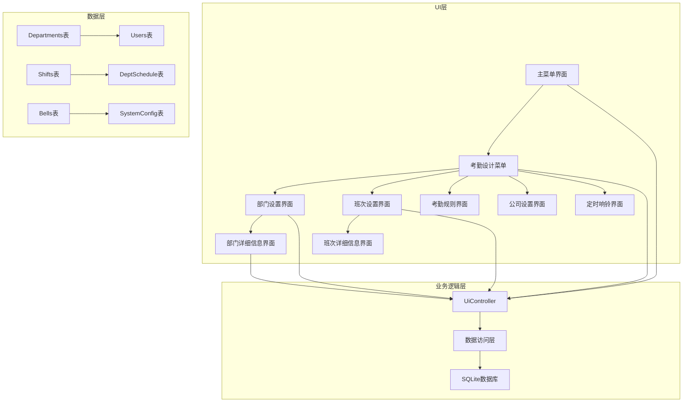

**图表来源**
- [ui_scr_att_design.cpp:183-233](file://src/ui/screens/att_design/ui_scr_att_design.cpp#L183-L233)
- [ui_scr_att_design.cpp:271-326](file://src/ui/screens/att_design/ui_scr_att_design.cpp#L271-L326)
- [ui_scr_att_design.cpp:400-571](file://src/ui/screens/att_design/ui_scr_att_design.cpp#L400-L571)

## 核心组件分析

### 部门设置界面

**更新** 部门设置界面是新增的部门管理核心入口，提供了部门列表的展示和管理功能。该界面采用列表形式展示所有可用的部门，每个部门项包含部门ID、名称和员工人数信息。

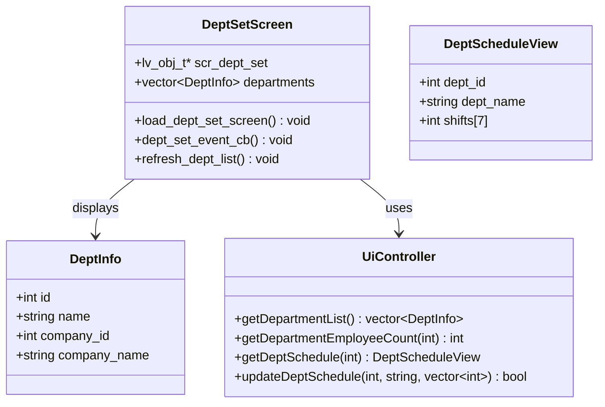

**图表来源**
- [ui_scr_att_design.cpp:271-326](file://src/ui/screens/att_design/ui_scr_att_design.cpp#L271-L326)
- [db_storage.h:23-38](file://src/data/db_storage.h#L23-L38)
- [ui_controller.cpp:141-143](file://src/ui/ui_controller.cpp#L141-L143)

### 部门详细信息界面

**更新** 部门详细信息界面提供了部门的详细配置功能，支持部门名称修改和一周七天的排班设置。该界面采用了网格布局和严格的输入验证机制，确保数据的准确性和完整性。

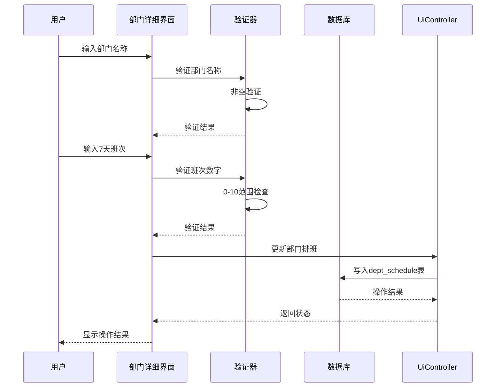

**图表来源**
- [ui_scr_att_design.cpp:400-571](file://src/ui/screens/att_design/ui_scr_att_design.cpp#L400-L571)
- [ui_scr_att_design.cpp:328-398](file://src/ui/screens/att_design/ui_scr_att_design.cpp#L328-L398)

### 班次设置界面

班次设置界面是班次管理的核心入口，提供了班次列表的展示和管理功能。该界面采用列表形式展示所有可用的班次，每个班次项包含班次ID、名称和排班状态信息。

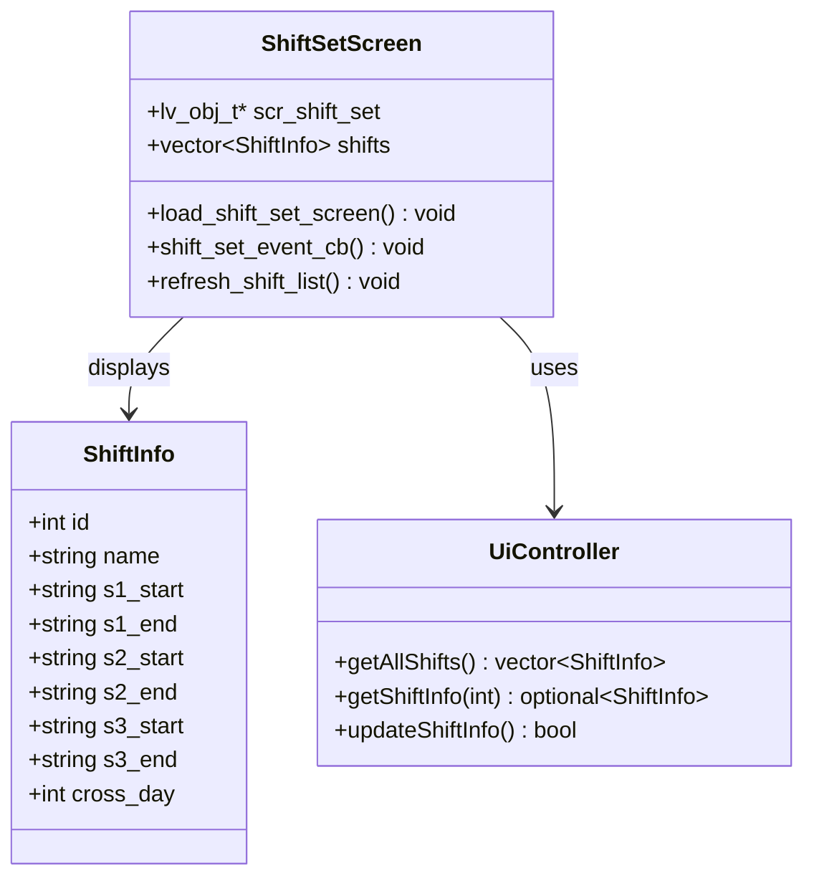

**图表来源**
- [ui_scr_att_design.cpp:635-702](file://src/ui/screens/att_design/ui_scr_att_design.cpp#L635-L702)
- [db_storage.cpp:2707-2751](file://src/data/db_storage.cpp#L2707-L2751)

### 班次详细信息界面

班次详细信息界面提供了班次的详细配置功能，支持三个工作时间段的设置和加班时间的配置。该界面采用了严格的输入验证机制，确保数据的准确性和完整性。

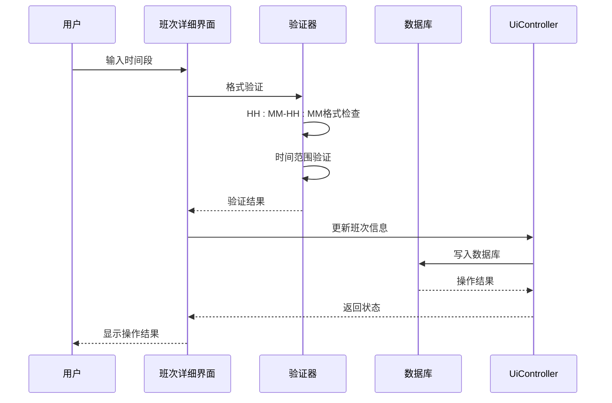

**图表来源**
- [ui_scr_att_design.cpp:821-901](file://src/ui/screens/att_design/ui_scr_att_design.cpp#L821-L901)
- [ui_scr_att_design.cpp:704-819](file://src/ui/screens/att_design/ui_scr_att_design.cpp#L704-L819)

### 定时响铃界面

**新增** 定时响铃界面是考勤设计菜单的重要组成部分，支持周期性报警系统的配置管理。该界面提供了响铃计划的创建、编辑和删除功能。

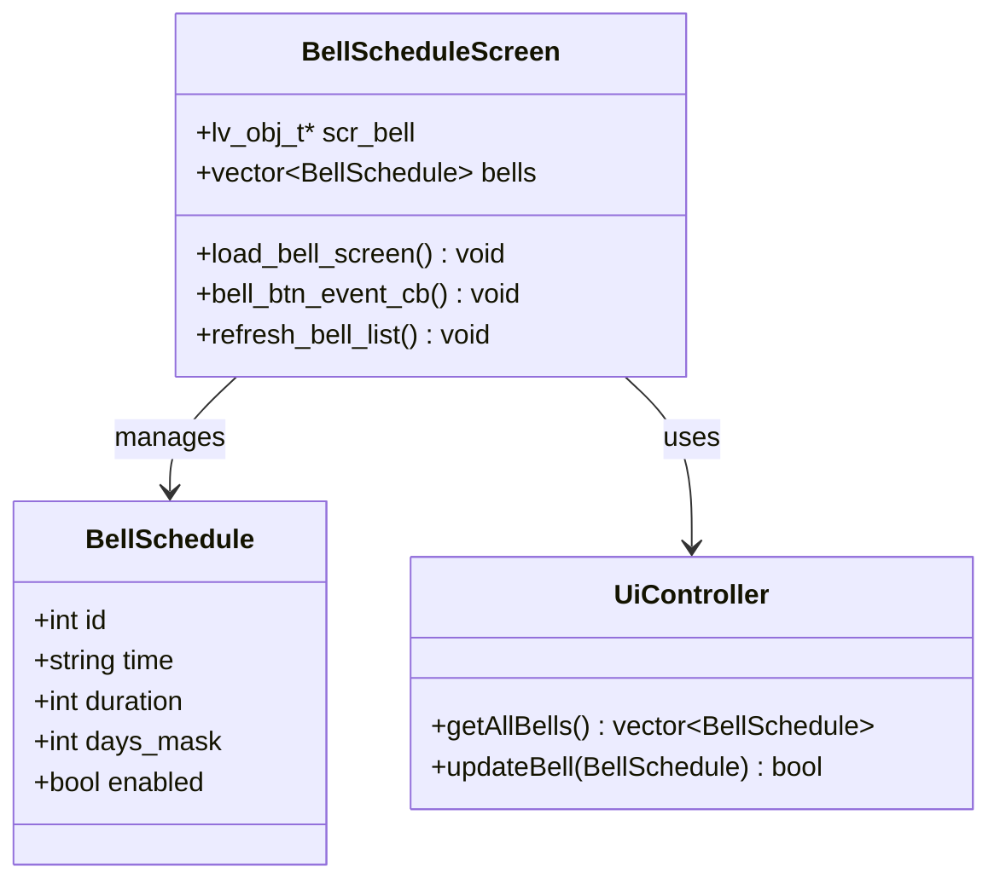

**图表来源**
- [ui_scr_att_design.cpp:1154-1205](file://src/ui/screens/att_design/ui_scr_att_design.cpp#L1154-L1205)
- [db_storage.h:125-134](file://src/data/db_storage.h#L125-L134)

**章节来源**
- [ui_scr_att_design.cpp:271-571](file://src/ui/screens/att_design/ui_scr_att_design.cpp#L271-L571)
- [ui_scr_att_design.cpp:635-901](file://src/ui/screens/att_design/ui_scr_att_design.cpp#L635-L901)
- [ui_scr_att_design.cpp:1154-1205](file://src/ui/screens/att_design/ui_scr_att_design.cpp#L1154-L1205)

## 界面交互流程

### 部门列表导航

**更新** 部门列表界面实现了完整的键盘导航功能，支持上下方向键切换、回车键确认选择和ESC键返回等操作。

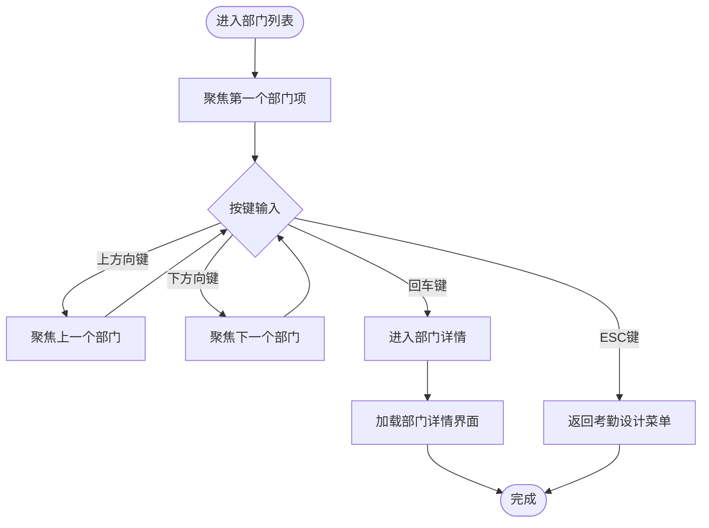

**图表来源**
- [ui_scr_att_design.cpp:236-269](file://src/ui/screens/att_design/ui_scr_att_design.cpp#L236-L269)

### 部门详细信息处理

**更新** 部门详细信息界面实现了智能的部门信息处理，包括部门名称验证和7天排班输入处理。

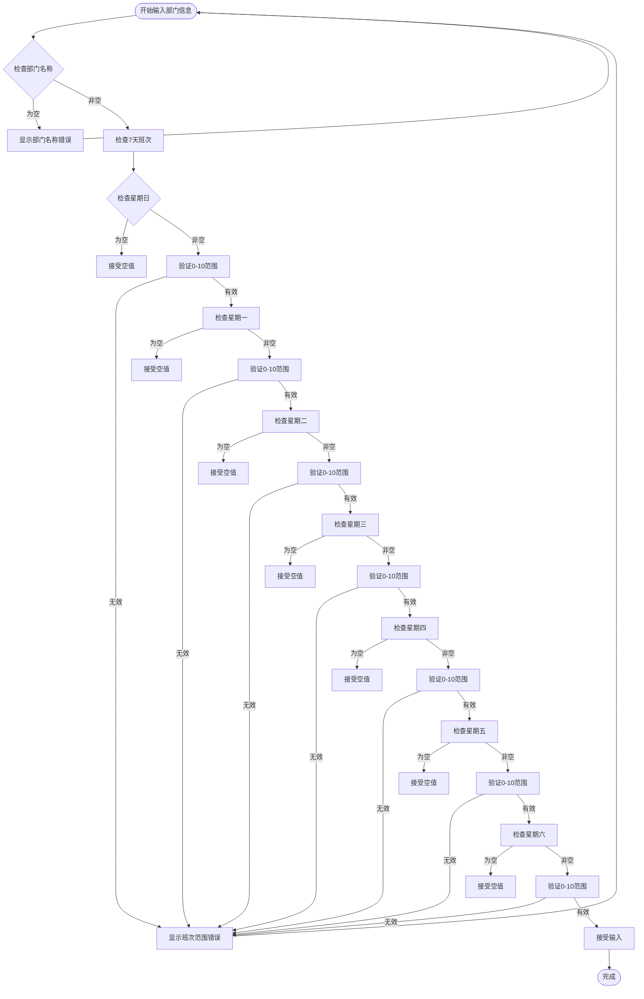

**图表来源**
- [ui_scr_att_design.cpp:328-398](file://src/ui/screens/att_design/ui_scr_att_design.cpp#L328-L398)

### 班次列表导航

班次列表界面实现了完整的键盘导航功能，支持上下方向键切换、回车键确认选择和ESC键返回等操作。

**图表来源**
- [ui_scr_att_design.cpp:576-633](file://src/ui/screens/att_design/ui_scr_att_design.cpp#L576-L633)

### 时间输入处理

班次详细信息界面实现了智能的时间输入处理，包括自动补全和格式验证功能。

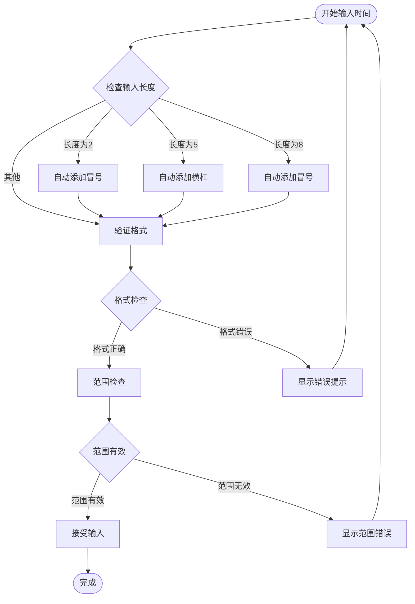

**图表来源**
- [ui_scr_att_design.cpp:43-93](file://src/ui/screens/att_design/ui_scr_att_design.cpp#L43-L93)

### 定时响铃功能流程

**新增** 定时响铃界面实现了响铃计划的完整管理流程，包括新增、修改、删除等操作。

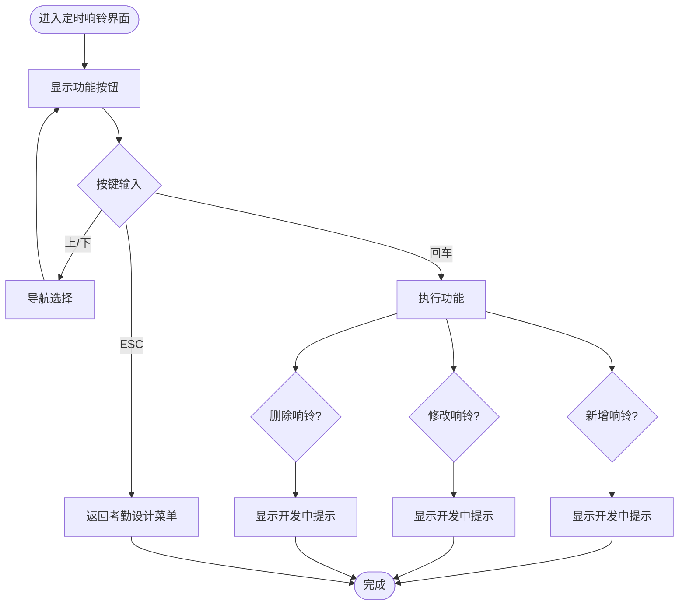

**图表来源**
- [ui_scr_att_design.cpp:1114-1152](file://src/ui/screens/att_design/ui_scr_att_design.cpp#L1114-L1152)

**章节来源**
- [ui_scr_att_design.cpp:236-269](file://src/ui/screens/att_design/ui_scr_att_design.cpp#L236-L269)
- [ui_scr_att_design.cpp:328-398](file://src/ui/screens/att_design/ui_scr_att_design.cpp#L328-L398)
- [ui_scr_att_design.cpp:43-93](file://src/ui/screens/att_design/ui_scr_att_design.cpp#L43-L93)
- [ui_scr_att_design.cpp:1114-1152](file://src/ui/screens/att_design/ui_scr_att_design.cpp#L1114-L1152)

## 数据模型设计

### DeptInfo 结构体

**更新** 部门信息结构体定义了部门的基本属性，支持公司关联和员工统计功能。

| 字段名 | 数据类型 | 描述 | 默认值 |
|--------|----------|------|--------|
| id | int | 部门唯一标识符 | 0 |
| name | string | 部门名称 | "" |
| company_id | int | 所属公司ID | 0 |
| company_name | string | 公司名称（查询时关联获取） | "" |

### DeptScheduleView 结构体

**更新** 部门排班视图结构体定义了部门的完整排班信息，包括部门基本信息和一周七天的排班安排。

| 字段名 | 数据类型 | 描述 | 默认值 |
|--------|----------|------|--------|
| dept_id | int | 部门ID | 0 |
| dept_name | string | 部门名称 | "" |
| shifts[7] | int[] | 7天的班次安排，索引对应星期几 | [0,0,0,0,0,0,0] |

### ShiftInfo 结构体

班次信息结构体定义了班次的基本属性和时间段配置，支持三个主要的工作时间段和一个加班时间段。

| 字段名 | 数据类型 | 描述 | 默认值 |
|--------|----------|------|--------|
| id | int | 班次唯一标识符 | 0 |
| name | string | 班次名称 | "" |
| s1_start | string | 第一时段开始时间 | "" |
| s1_end | string | 第一时段结束时间 | "" |
| s2_start | string | 第二时段开始时间 | "" |
| s2_end | string | 第二时段结束时间 | "" |
| s3_start | string | 第三时段开始时间 | "" |
| s3_end | string | 第三时段结束时间 | "" |
| cross_day | int | 是否跨日 | 0 |

### BellSchedule 结构体

**新增** 响铃配置结构体定义了定时响铃的基本属性和周期配置。

| 字段名 | 数据类型 | 描述 | 默认值 |
|--------|----------|------|--------|
| id | int | 响铃计划唯一标识符 (1-16) | 0 |
| time | string | 响铃时间 "HH:MM" | "" |
| duration | int | 响铃持续时间 (秒) | 0 |
| days_mask | int | 周期掩码 (位操作) | 0 |
| enabled | bool | 是否启用 | false |

### 数据库表结构

部门管理功能涉及多个数据库表的协作，包括部门表、用户表、班次表和部门排班表。**更新** 新增了部门排班表来存储部门的周排班信息。

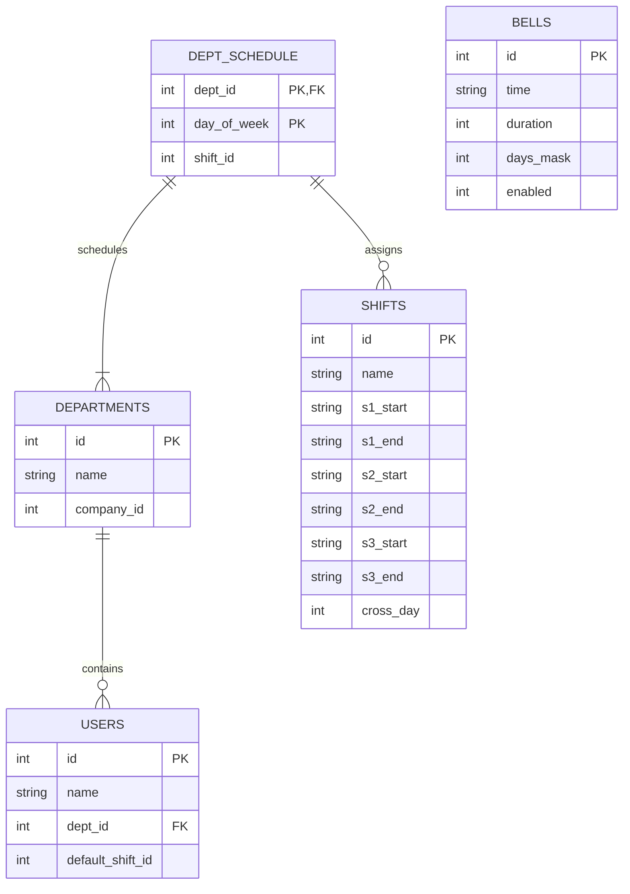

**图表来源**
- [db_storage.cpp:2659-2705](file://src/data/db_storage.cpp#L2659-L2705)
- [db_storage.cpp:2598-2657](file://src/data/db_storage.cpp#L2598-L2657)
- [db_storage.h:77-91](file://src/data/db_storage.h#L77-L91)

**章节来源**
- [db_storage.h:23-38](file://src/data/db_storage.h#L23-L38)
- [db_storage.h:87-91](file://src/data/db_storage.h#L87-L91)
- [db_storage.h:125-134](file://src/data/db_storage.h#L125-L134)
- [db_storage.cpp:2659-2705](file://src/data/db_storage.cpp#L2659-L2705)

## 输入验证机制

### 部门信息验证

**更新** 部门详细信息界面实现了多层次的输入验证机制：

1. **部门名称验证**：确保部门名称非空，防止空部门名称的创建
2. **班次数字验证**：验证7天的班次输入，班次数字必须在0-10之间
3. **空值处理**：允许某些天的班次为空，表示该天为节假日
4. **范围验证**：确保班次ID在有效范围内（0表示节假日，1-10表示具体班次）

### 格式验证规则

班次管理界面实现了多层次的输入验证机制，确保数据的准确性和一致性：

1. **格式验证**：严格检查 "HH:MM-HH:MM" 格式，确保时间格式的正确性
2. **范围验证**：验证小时范围 00-23，分钟范围 00-59
3. **逻辑验证**：确保上班时间早于下班时间
4. **完整性验证**：检查必填字段的完整性

### 验证流程

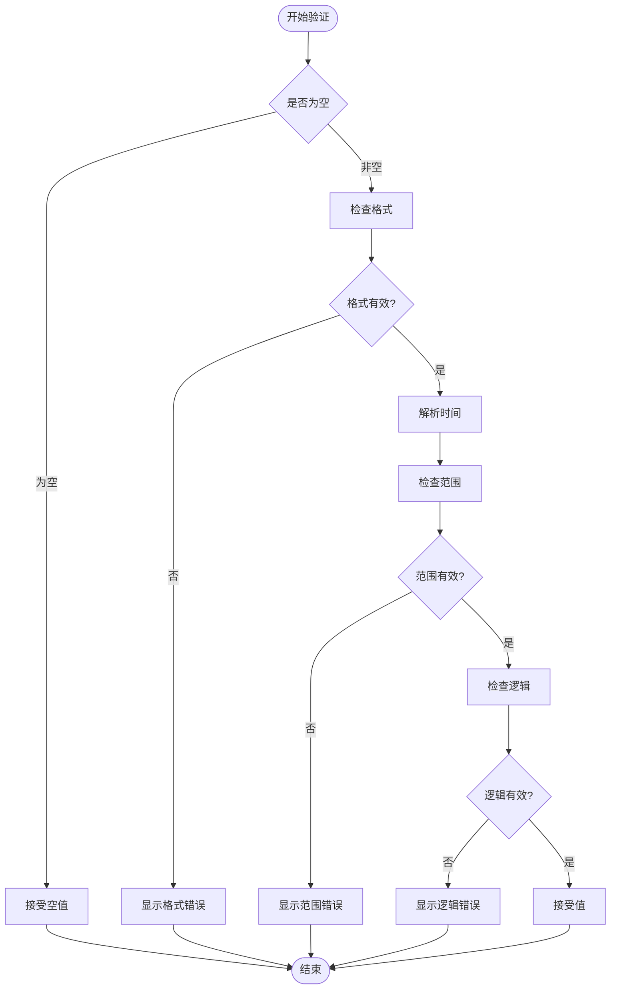

**图表来源**
- [ui_scr_att_design.cpp:65-132](file://src/ui/screens/att_design/ui_scr_att_design.cpp#L65-L132)

### 响铃配置验证

**新增** 定时响铃功能的输入验证机制：

1. **时间格式验证**：检查 "HH:MM" 格式的正确性
2. **持续时间验证**：确保响铃持续时间在合理范围内
3. **周期掩码验证**：验证7天周期的位掩码设置
4. **启用状态验证**：确保布尔值的有效性

**章节来源**
- [ui_scr_att_design.cpp:328-398](file://src/ui/screens/att_design/ui_scr_att_design.cpp#L328-L398)
- [ui_scr_att_design.cpp:65-132](file://src/ui/screens/att_design/ui_scr_att_design.cpp#L65-L132)

## 界面导航结构

### 考勤设计菜单导航

**更新** 考勤设计菜单提供了完整的导航路径，支持部门、班次、规则、公司和定时响铃的管理。

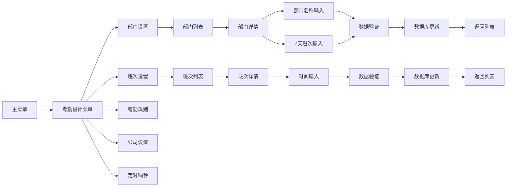

**图表来源**
- [ui_scr_att_design.cpp:183-233](file://src/ui/screens/att_design/ui_scr_att_design.cpp#L183-L233)
- [ui_scr_att_design.cpp:271-326](file://src/ui/screens/att_design/ui_scr_att_design.cpp#L271-L326)
- [ui_scr_att_design.cpp:400-571](file://src/ui/screens/att_design/ui_scr_att_design.cpp#L400-L571)

### 键盘导航支持

**更新** 班次管理界面完全支持键盘导航，提供了完整的键盘交互体验：

- **方向键导航**：上下方向键在列表项之间切换
- **确认键**：回车键确认选择和操作
- **返回键**：ESC键返回上一级界面
- **Tab键导航**：在表单控件之间切换

**章节来源**
- [ui_scr_att_design.cpp:136-180](file://src/ui/screens/att_design/ui_scr_att_design.cpp#L136-L180)

## 性能优化考虑

### 内存管理优化

**更新** 部门管理界面采用了高效的内存管理策略：

1. **对象生命周期管理**：所有动态创建的对象都设置了适当的销毁回调
2. **资源清理机制**：界面切换时自动清理不需要的资源
3. **输入框状态管理**：合理管理输入框的焦点状态，避免内存泄漏
4. **网格布局优化**：部门详情界面使用网格布局，减少嵌套层级

### 数据加载优化

**更新** 部门管理界面采用了多种性能优化策略：

1. **延迟加载**：部门列表采用延迟加载策略，只在需要时从数据库获取数据
2. **缓存机制**：对常用数据进行缓存，减少数据库访问频率
3. **批量操作**：支持批量更新部门排班信息，提高数据处理效率
4. **线程安全**：部门管理操作使用共享锁和排他锁，确保多线程环境下的数据一致性

### 数据库优化

**更新** 部门管理功能的数据库操作进行了专门优化：

1. **预编译SQL语句**：部门排班的数据库操作使用预编译语句，提高执行效率
2. **批量导入**：支持批量导入部门排班数据，避免逐条插入的性能问题
3. **事务处理**：部门排班更新使用事务，确保数据一致性和操作原子性
4. **索引优化**：dept_schedule表建立了合适的索引，提高查询性能

## 故障排除指南

### 部门管理常见问题

**更新** 部门管理功能的常见问题及解决方案：

| 问题类型 | 症状描述 | 可能原因 | 解决方案 |
|----------|----------|----------|----------|
| 部门列表为空 | 部门列表显示为空 | 数据库中没有部门数据 | 检查数据库连接，确认departments表数据 |
| 部门名称为空 | 保存部门信息时报错 | 部门名称为空 | 确保输入非空的部门名称 |
| 班次数字超出范围 | 保存班次时显示范围错误 | 班次数字不在0-10范围内 | 检查输入的班次数字，确保在有效范围内 |
| 部门删除失败 | 删除部门时报错 | 部门下有员工 | 先删除或转移部门内的员工 |
| 数据库写入失败 | 保存部门排班时失败 | 数据库权限或连接问题 | 检查数据库权限，重启应用进程 |
| 界面导航异常 | 键盘导航失效 | 输入组配置错误 | 重新初始化输入组，检查事件绑定 |

### 班次管理常见问题

| 问题类型 | 症状描述 | 可能原因 | 解决方案 |
|----------|----------|----------|----------|
| 班次列表为空 | 班次列表显示为空 | 数据库中没有班次数据 | 检查数据库连接，确认班次表数据 |
| 时间格式错误 | 输入时间后显示格式错误 | 时间格式不符合 HH:MM-HH:MM | 检查时间输入格式，确保使用英文冒号 |
| 数据库写入失败 | 保存班次信息时失败 | 数据库权限或连接问题 | 检查数据库权限，重启应用进程 |
| 界面导航异常 | 键盘导航失效 | 输入组配置错误 | 重新初始化输入组，检查事件绑定 |
| 响铃功能不可用 | 定时响铃界面显示开发中 | 功能尚未完全实现 | 等待后续版本更新 |

### 调试建议

**更新** 部门管理功能的调试建议：

1. **启用调试模式**：在开发环境中启用详细的日志输出
2. **检查事件回调**：验证所有事件回调函数的正确性
3. **监控内存使用**：定期检查内存使用情况，避免内存泄漏
4. **验证数据一致性**：确保数据库操作的原子性和一致性
5. **部门管理测试**：验证部门创建、修改、删除和排班更新的完整流程
6. **批量操作测试**：验证批量导入部门排班数据的功能

**章节来源**
- [ui_scr_att_design.cpp:328-398](file://src/ui/screens/att_design/ui_scr_att_design.cpp#L328-L398)
- [ui_scr_att_design.cpp:576-633](file://src/ui/screens/att_design/ui_scr_att_design.cpp#L576-L633)

## 总结

班次管理界面作为 SmartAttendance 系统的核心功能模块，展现了优秀的软件架构设计和用户体验设计。**更新** 新增的部门管理功能进一步完善了系统的管理能力，该界面具有以下特点：

1. **模块化设计**：采用清晰的模块划分，便于维护和扩展
2. **用户友好**：提供直观的界面和完整的键盘导航支持
3. **数据安全**：实现了多层次的数据验证和错误处理机制
4. **性能优化**：采用了多种性能优化策略，确保流畅的用户体验
5. **可扩展性**：设计考虑了未来的功能扩展需求
6. **功能完善**：**更新** 新增了完整的部门管理功能，支持部门配置菜单、详细部门信息视图和部门管理导航功能
7. **数据完整性**：**更新** 新增了部门排班视图和批量导入功能，确保数据的完整性和一致性

通过合理的架构设计和严格的实现标准，班次管理界面为整个智能考勤系统提供了坚实的基础，为后续的功能扩展和维护奠定了良好的基础。**更新** 新增的部门管理功能进一步增强了系统的实用性和智能化水平，为用户提供更加完善的考勤管理解决方案。