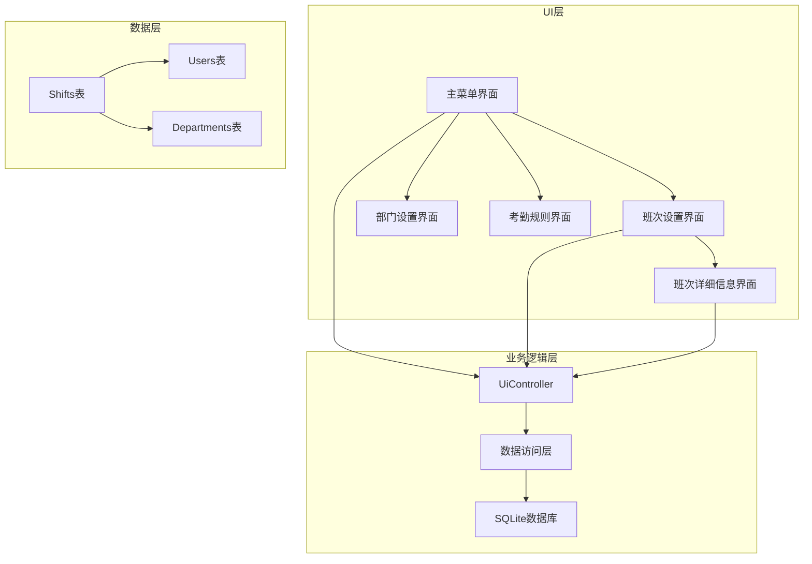
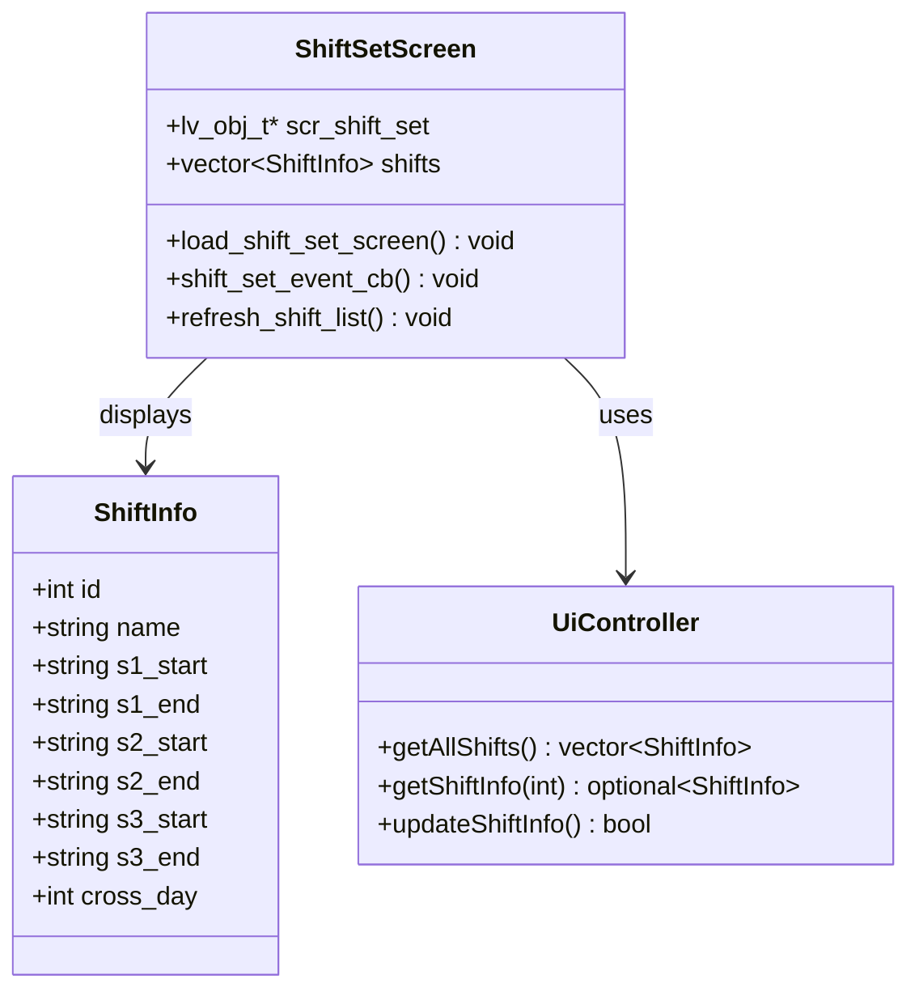
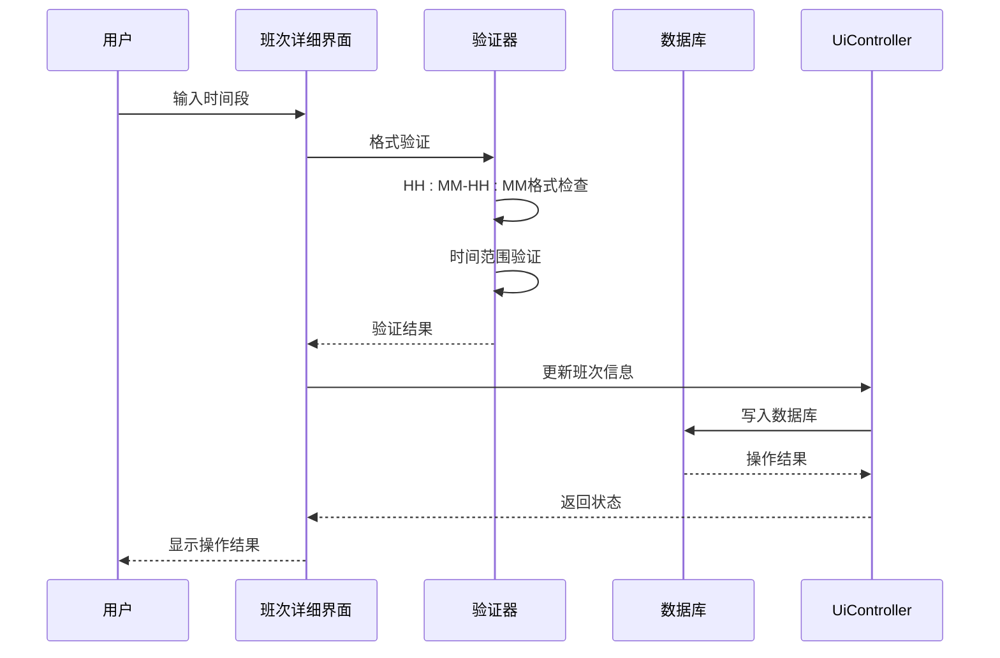
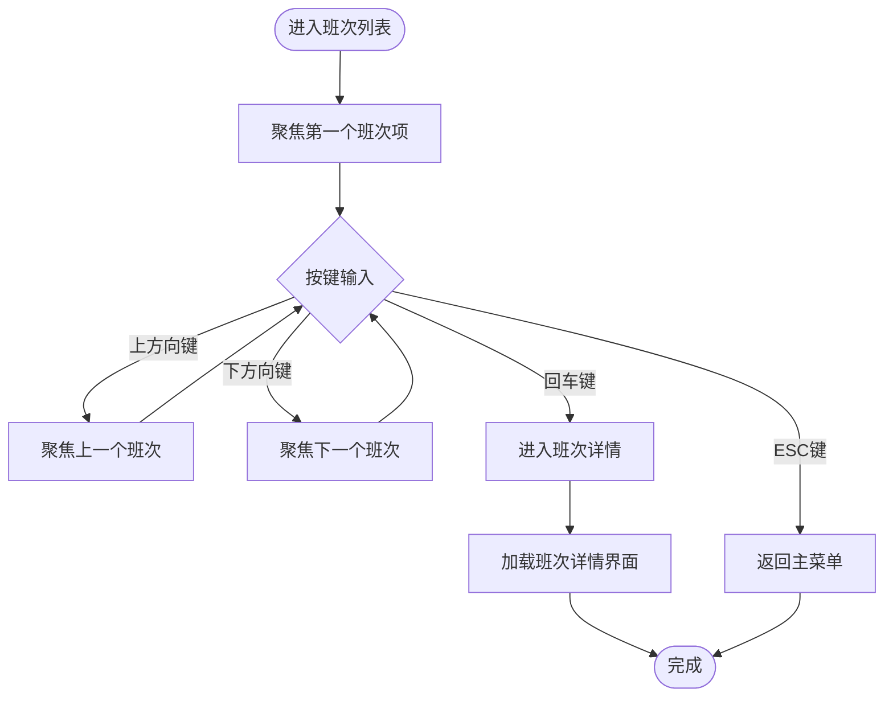
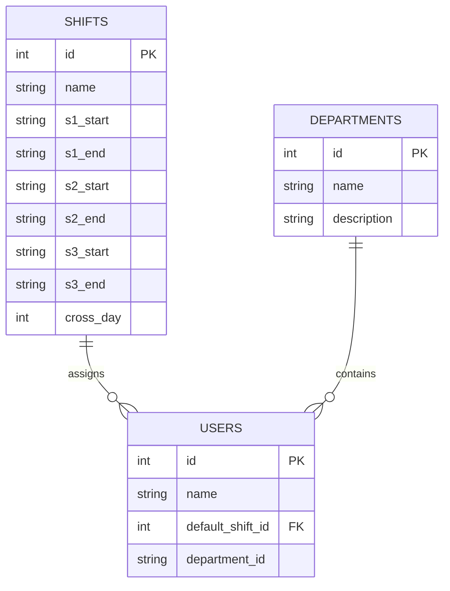
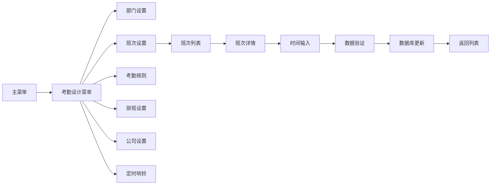

# 班次管理界面

<cite>
**本文档引用的文件**
- [ui_scr_att_design.cpp](file://src/ui/screens/att_design/ui_scr_att_design.cpp)
- [ui_scr_att_design.h](file://src/ui/screens/att_design/ui_scr_att_design.h)
- [db_storage.cpp](file://src/data/db_storage.cpp)
- [README.md](file://README.md)
</cite>

## 目录
1. [项目概述](#项目概述)
2. [班次管理界面架构](#班次管理界面架构)
3. [核心组件分析](#核心组件分析)
4. [界面交互流程](#界面交互流程)
5. [数据模型设计](#数据模型设计)
6. [输入验证机制](#输入验证机制)
7. [界面导航结构](#界面导航结构)
8. [性能优化考虑](#性能优化考虑)
9. [故障排除指南](#故障排除指南)
10. [总结](#总结)

## 项目概述

SmartAttendance 是一款基于嵌入式 GUI 的智能人脸考勤系统，专为 FA03H 人脸考勤机设计。该系统集成了人脸识别、考勤规则引擎、数据持久化与报表导出功能，采用 LVGL 图形框架构建嵌入式 GUI 界面。

班次管理界面是系统的核心功能模块之一，负责管理员工的班次设置、排班管理和考勤规则配置。该界面提供了完整的班次生命周期管理功能，包括班次创建、编辑、删除和查询等操作。

## 班次管理界面架构

班次管理界面采用模块化设计，基于 LVGL 图形库构建，实现了完整的用户交互体验。整个架构分为以下几个层次：

**图表来源**
- [ui_scr_att_design.cpp:183-233](file://src/ui/screens/att_design/ui_scr_att_design.cpp#L183-L233)
- [ui_scr_att_design.cpp:592-659](file://src/ui/screens/att_design/ui_scr_att_design.cpp#L592-L659)

## 核心组件分析

### 班次设置界面

班次设置界面是班次管理的核心入口，提供了班次列表的展示和管理功能。该界面采用列表形式展示所有可用的班次，每个班次项包含班次ID、名称和排班状态信息。

**图表来源**
- [ui_scr_att_design.cpp:592-659](file://src/ui/screens/att_design/ui_scr_att_design.cpp#L592-L659)
- [db_storage.cpp:642-673](file://src/data/db_storage.cpp#L642-L673)

### 班次详细信息界面

班次详细信息界面提供了班次的详细配置功能，支持三个工作时间段的设置和加班时间的配置。该界面采用了严格的输入验证机制，确保数据的准确性和完整性。

**图表来源**
- [ui_scr_att_design.cpp:778-858](file://src/ui/screens/att_design/ui_scr_att_design.cpp#L778-L858)
- [ui_scr_att_design.cpp:722-775](file://src/ui/screens/att_design/ui_scr_att_design.cpp#L722-L775)

**章节来源**
- [ui_scr_att_design.cpp:592-858](file://src/ui/screens/att_design/ui_scr_att_design.cpp#L592-L858)

## 界面交互流程

### 班次列表导航

班次列表界面实现了完整的键盘导航功能，支持上下方向键切换、回车键确认选择和ESC键返回等操作。

**图表来源**
- [ui_scr_att_design.cpp:534-590](file://src/ui/screens/att_design/ui_scr_att_design.cpp#L534-L590)

### 时间输入处理

班次详细信息界面实现了智能的时间输入处理，包括自动补全和格式验证功能。

**图表来源**
- [ui_scr_att_design.cpp:41-91](file://src/ui/screens/att_design/ui_scr_att_design.cpp#L41-L91)

**章节来源**
- [ui_scr_att_design.cpp:41-91](file://src/ui/screens/att_design/ui_scr_att_design.cpp#L41-L91)

## 数据模型设计

### ShiftInfo 结构体

班次信息结构体定义了班次的基本属性和时间段配置，支持三个主要的工作时间段和一个加班时间段。

| 字段名 | 数据类型 | 描述 | 默认值 |
|--------|----------|------|--------|
| id | int | 班次唯一标识符 | 0 |
| name | string | 班次名称 | "" |
| s1_start | string | 第一时段开始时间 | "" |
| s1_end | string | 第一时段结束时间 | "" |
| s2_start | string | 第二时段开始时间 | "" |
| s2_end | string | 第二时段结束时间 | "" |
| s3_start | string | 第三时段开始时间 | "" |
| s3_end | string | 第三时段结束时间 | "" |
| cross_day | int | 是否跨日 | 0 |

### 数据库表结构

班次信息存储在 SQLite 数据库的 `shifts` 表中，表结构设计支持灵活的班次配置和扩展性。

**图表来源**
- [db_storage.cpp:604-640](file://src/data/db_storage.cpp#L604-L640)
- [db_storage.cpp:1273-1305](file://src/data/db_storage.cpp#L1273-L1305)

**章节来源**
- [db_storage.cpp:604-640](file://src/data/db_storage.cpp#L604-L640)

## 输入验证机制

### 格式验证规则

班次管理界面实现了多层次的输入验证机制，确保数据的准确性和一致性：

1. **格式验证**：严格检查 "HH:MM-HH:MM" 格式，确保时间格式的正确性
2. **范围验证**：验证小时范围 00-23，分钟范围 00-59
3. **逻辑验证**：确保上班时间早于下班时间
4. **完整性验证**：检查必填字段的完整性

### 验证流程

**图表来源**
- [ui_scr_att_design.cpp:63-130](file://src/ui/screens/att_design/ui_scr_att_design.cpp#L63-L130)

**章节来源**
- [ui_scr_att_design.cpp:63-130](file://src/ui/screens/att_design/ui_scr_att_design.cpp#L63-L130)

## 界面导航结构

### 主菜单到班次管理的导航路径

**图表来源**
- [ui_scr_att_design.cpp:183-233](file://src/ui/screens/att_design/ui_scr_att_design.cpp#L183-L233)
- [ui_scr_att_design.cpp:592-659](file://src/ui/screens/att_design/ui_scr_att_design.cpp#L592-L659)

### 键盘导航支持

班次管理界面完全支持键盘导航，提供了完整的键盘交互体验：

- **方向键导航**：上下方向键在列表项之间切换
- **确认键**：回车键确认选择和操作
- **返回键**：ESC键返回上一级界面
- **Tab键导航**：在表单控件之间切换

**章节来源**
- [ui_scr_att_design.cpp:133-180](file://src/ui/screens/att_design/ui_scr_att_design.cpp#L133-L180)

## 性能优化考虑

### 内存管理优化

班次管理界面采用了高效的内存管理策略：

1. **对象生命周期管理**：所有动态创建的对象都设置了适当的销毁回调
2. **资源清理机制**：界面切换时自动清理不需要的资源
3. **输入框状态管理**：合理管理输入框的焦点状态，避免内存泄漏

### 数据加载优化

1. **延迟加载**：班次列表采用延迟加载策略，只在需要时从数据库获取数据
2. **缓存机制**：对常用数据进行缓存，减少数据库访问频率
3. **批量操作**：支持批量更新操作，提高数据处理效率

## 故障排除指南

### 常见问题及解决方案

| 问题类型 | 症状描述 | 可能原因 | 解决方案 |
|----------|----------|----------|----------|
| 班次列表为空 | 班次列表显示为空 | 数据库中没有班次数据 | 检查数据库连接，确认班次表数据 |
| 时间格式错误 | 输入时间后显示格式错误 | 时间格式不符合 HH:MM-HH:MM | 检查时间输入格式，确保使用英文冒号 |
| 数据库写入失败 | 保存班次信息时失败 | 数据库权限或连接问题 | 检查数据库权限，重启应用进程 |
| 界面导航异常 | 键盘导航失效 | 输入组配置错误 | 重新初始化输入组，检查事件绑定 |

### 调试建议

1. **启用调试模式**：在开发环境中启用详细的日志输出
2. **检查事件回调**：验证所有事件回调函数的正确性
3. **监控内存使用**：定期检查内存使用情况，避免内存泄漏
4. **验证数据一致性**：确保数据库操作的原子性和一致性

**章节来源**
- [ui_scr_att_design.cpp:586-588](file://src/ui/screens/att_design/ui_scr_att_design.cpp#L586-L588)

## 总结

班次管理界面作为 SmartAttendance 系统的核心功能模块，展现了优秀的软件架构设计和用户体验设计。该界面具有以下特点：

1. **模块化设计**：采用清晰的模块划分，便于维护和扩展
2. **用户友好**：提供直观的界面和完整的键盘导航支持
3. **数据安全**：实现了多层次的数据验证和错误处理机制
4. **性能优化**：采用了多种性能优化策略，确保流畅的用户体验
5. **可扩展性**：设计考虑了未来的功能扩展需求

通过合理的架构设计和严格的实现标准，班次管理界面为整个智能考勤系统提供了坚实的基础，为后续的功能扩展和维护奠定了良好的基础。