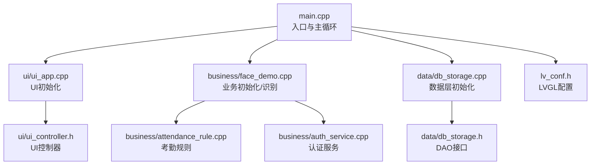
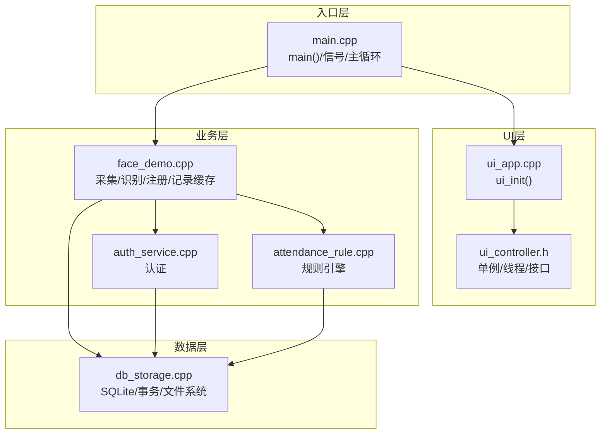
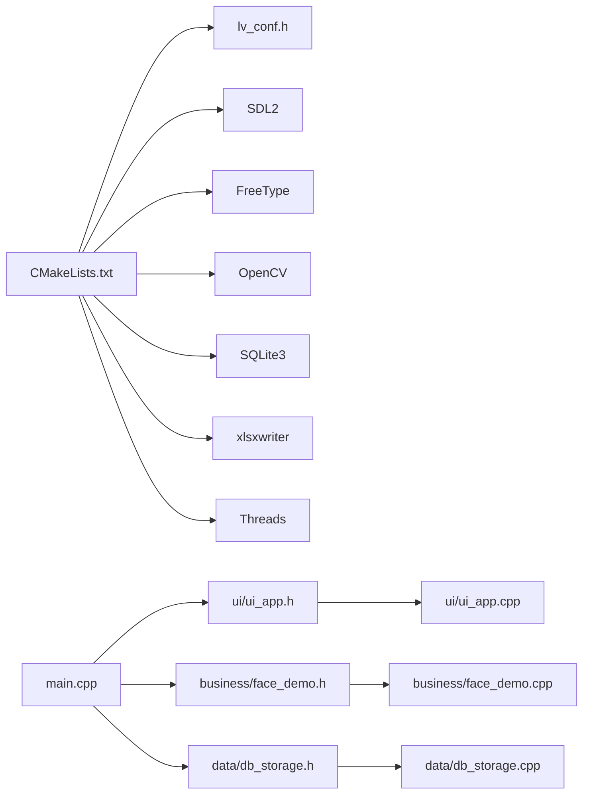

# 代码审查清单与质量保证

<cite>
**本文引用的文件**
- [main.cpp](file://src/main.cpp)
- [CMakeLists.txt](file://CMakeLists.txt)
- [ui_app.h](file://src/ui/ui_app.h)
- [ui_app.cpp](file://src/ui/ui_app.cpp)
- [ui_controller.h](file://src/ui/ui_controller.h)
- [face_demo.h](file://src/business/face_demo.h)
- [face_demo.cpp](file://src/business/face_demo.cpp)
- [attendance_rule.h](file://src/business/attendance_rule.h)
- [attendance_rule.cpp](file://src/business/attendance_rule.cpp)
- [auth_service.h](file://src/business/auth_service.h)
- [auth_service.cpp](file://src/business/auth_service.cpp)
- [db_storage.h](file://src/data/db_storage.h)
- [db_storage.cpp](file://src/data/db_storage.cpp)
- [lv_conf.h](file://lv_conf.h)
</cite>

## 目录
1. [简介](#简介)
2. [项目结构](#项目结构)
3. [核心组件](#核心组件)
4. [架构总览](#架构总览)
5. [详细组件分析](#详细组件分析)
6. [依赖关系分析](#依赖关系分析)
7. [性能考量](#性能考量)
8. [故障排查指南](#故障排查指南)
9. [结论](#结论)
10. [附录](#附录)

## 简介
本文件面向智能考勤系统，提供一套完整的代码审查清单与质量保证方案，覆盖代码结构、命名规范、注释完整性、错误处理、性能与安全等维度。同时给出质量保障流程（静态分析、覆盖率、基准测试）、重构指导原则（消除重复、控制复杂度、优化接口设计）、审查流程规范（申请、执行、跟踪、复查）以及典型问题与解决方案，帮助团队建立高质量的工程标准。

## 项目结构
系统采用分层架构：UI 层（LVGL + SDL 仿真）、业务层（人脸检测/识别、考勤规则、认证服务）、数据层（SQLite + OpenCV）。顶层入口负责初始化与主循环驱动，CMake 负责依赖与编译配置。

**图表来源**
- [main.cpp:187-246](file://src/main.cpp#L187-L246)
- [ui_app.cpp:34-94](file://src/ui/ui_app.cpp#L34-L94)
- [face_demo.cpp:1-200](file://src/business/face_demo.cpp#L1-L200)
- [db_storage.cpp:133-200](file://src/data/db_storage.cpp#L133-L200)
- [lv_conf.h:1-120](file://lv_conf.h#L1-L120)

**章节来源**
- [main.cpp:187-246](file://src/main.cpp#L187-L246)
- [CMakeLists.txt:1-155](file://CMakeLists.txt#L1-L155)

## 核心组件
- 入口与主循环：负责系统初始化、信号处理、UI/业务初始化、主循环与资源回收。
- UI 子系统：基于 LVGL + SDL 仿真，负责窗口、输入、样式与屏幕加载。
- 业务子系统：人脸检测/识别、预处理、注册/更新用户、识别开关、记录缓存与查询。
- 认证服务：密码与指纹验证，返回标准化结果枚举。
- 考勤规则引擎：时间解析与容错、班次归属判定、状态计算、重复打卡防护、记录落库。
- 数据层：SQLite 管理、表结构、事务、种子数据、用户/班次/部门/考勤 CRUD、报表辅助查询。

**章节来源**
- [main.cpp:41-246](file://src/main.cpp#L41-L246)
- [ui_app.h:8-12](file://src/ui/ui_app.h#L8-L12)
- [ui_app.cpp:34-94](file://src/ui/ui_app.cpp#L34-L94)
- [face_demo.h:34-212](file://src/business/face_demo.h#L34-L212)
- [face_demo.cpp:1-200](file://src/business/face_demo.cpp#L1-L200)
- [auth_service.h:18-46](file://src/business/auth_service.h#L18-L46)
- [auth_service.cpp:9-90](file://src/business/auth_service.cpp#L9-L90)
- [attendance_rule.h:43-92](file://src/business/attendance_rule.h#L43-L92)
- [attendance_rule.cpp:1-200](file://src/business/attendance_rule.cpp#L1-L200)
- [db_storage.h:213-683](file://src/data/db_storage.h#L213-L683)
- [db_storage.cpp:133-200](file://src/data/db_storage.cpp#L133-L200)

## 架构总览
系统采用“入口驱动 + 分层职责 + 线程协作”的结构。入口负责顺序初始化与心跳循环；UI 层通过 LVGL 驱动显示与输入；业务层负责摄像头采集、人脸预处理、识别与考勤记录；数据层封装 SQLite 访问与文件系统；认证与规则引擎贯穿业务层。

**图表来源**
- [main.cpp:187-246](file://src/main.cpp#L187-L246)
- [ui_app.cpp:34-94](file://src/ui/ui_app.cpp#L34-L94)
- [ui_controller.h:21-110](file://src/ui/ui_controller.h#L21-L110)
- [face_demo.cpp:1-200](file://src/business/face_demo.cpp#L1-L200)
- [auth_service.cpp:9-90](file://src/business/auth_service.cpp#L9-L90)
- [attendance_rule.cpp:1-200](file://src/business/attendance_rule.cpp#L1-L200)
- [db_storage.cpp:133-200](file://src/data/db_storage.cpp#L133-L200)

## 详细组件分析

### 入口与主循环（main.cpp）
- 初始化顺序与依赖：系统休眠禁用 → 框架自检 → 数据层初始化 → UI 初始化 → 业务初始化 → 主循环。
- 信号处理：捕获 SIGINT，设置退出标志，保证优雅退出。
- 主循环：驱动 LVGL 心跳、tick 更新、睡眠控制，限制最小/最大休眠时间。
- 资源回收：退出前清理业务与数据层。

审查要点
- 初始化顺序是否满足依赖链（UI 依赖业务，业务依赖数据）。
- 信号处理是否覆盖所有退出路径。
- 主循环休眠时间是否合理，避免过快或过慢。
- 退出清理是否完整，避免资源泄漏。

**章节来源**
- [main.cpp:41-246](file://src/main.cpp#L41-L246)

### UI 子系统（ui_app.cpp / ui_app.h）
- 初始化：LVGL 初始化、SDL 窗口与输入设备创建、样式与管理器初始化、键盘绑定到组。
- 生命周期：启动后台服务、加载主页、启动 UI 控制器后台线程。
- 仿真环境：WSL2/PC 仿真，使用 SDL2 驱动。

审查要点
- SDL 窗口创建失败的降级处理与日志提示。
- 键盘/组绑定是否正确，避免无法操作。
- 后台服务启动时机与 UI 控制器线程协调。

**章节来源**
- [ui_app.h:8-12](file://src/ui/ui_app.h#L8-L12)
- [ui_app.cpp:34-94](file://src/ui/ui_app.cpp#L34-L94)

### UI 控制器（ui_controller.h）
- 单例模式提供全局访问。
- 功能覆盖：系统状态、用户管理、记录查询、报表导出、摄像头帧获取、后台线程管理。
- 线程安全：图像缓存与互斥锁保护。

审查要点
- 单例访问点是否线程安全。
- 线程启动/停止是否幂等，避免重复启动。
- 图像缓存与互斥锁使用是否正确，避免竞态。

**章节来源**
- [ui_controller.h:21-110](file://src/ui/ui_controller.h#L21-L110)

### 业务子系统（face_demo.cpp / face_demo.h）
- 采集与识别：摄像头采集、人脸检测、预处理（裁剪、尺寸归一化、直方图均衡化、ROI 增强）、LBPH 训练与识别。
- 注册与更新：注册新用户、更新人脸、用户列表缓存。
- 记录缓存：加载/获取考勤记录，供 UI 列表展示。
- 配置接口：预处理参数设置、识别开关、配置刷新。
- 线程与同步：采集线程、数据库写入线程、条件变量与原子标志。

审查要点
- 预处理流程是否可配置且健壮（裁剪、均衡化、ROI 增强）。
- 识别开关与缓存一致性。
- 线程安全与死锁风险（互斥锁/条件变量）。
- 模型文件查找与容错。

**章节来源**
- [face_demo.h:34-212](file://src/business/face_demo.h#L34-L212)
- [face_demo.cpp:1-200](file://src/business/face_demo.cpp#L1-L200)

### 认证服务（auth_service.cpp / auth_service.h）
- 密码验证：从数据库获取用户信息，检查是否存在与密码是否匹配。
- 指纹验证：读取指纹特征，调用匹配函数，返回结果枚举。
- 结果枚举：统一抽象认证结果，便于 UI 与业务层处理。

审查要点
- 用户存在性与特征存在性检查。
- 指纹匹配阈值与模拟实现的合理性。
- 错误分支的返回值是否覆盖所有场景。

**章节来源**
- [auth_service.h:18-46](file://src/business/auth_service.h#L18-L46)
- [auth_service.cpp:9-90](file://src/business/auth_service.cpp#L9-L90)

### 考勤规则引擎（attendance_rule.cpp / attendance_rule.h）
- 时间解析与容错：支持多种输入格式，清洗与校验。
- 班次归属：上午/下午折中原则，跨天处理。
- 状态计算：正常/迟到/早退/旷工，分钟差异。
- 重复打卡防护：基于时间窗口限制。
- 结果枚举：记录成功/失败/无排班/重复打卡/数据库错误。

审查要点
- 时间解析的健壮性与边界处理。
- 跨天与折中原则的逻辑正确性。
- 重复打卡窗口与状态覆盖策略。

**章节来源**
- [attendance_rule.h:43-92](file://src/business/attendance_rule.h#L43-L92)
- [attendance_rule.cpp:1-200](file://src/business/attendance_rule.cpp#L1-L200)

### 数据层（db_storage.cpp / db_storage.h）
- 初始化：创建目录、连接数据库、性能 PRAGMAS、建表/升级。
- 事务：BEGIN/COMMIT 封装，批量导入加速。
- 种子数据：默认部门/班次/管理员。
- DAO：部门/班次/用户/考勤 CRUD，排班与规则配置。
- 文件系统：抓拍图与头像目录管理，清理过期图片。

审查要点
- SQLite PRAGMAS 的性能影响与一致性。
- 事务边界与异常回滚。
- BLOB 存储与解码的健壮性。
- 文件系统权限与路径容错。

**章节来源**
- [db_storage.h:213-683](file://src/data/db_storage.h#L213-L683)
- [db_storage.cpp:133-200](file://src/data/db_storage.cpp#L133-L200)

## 依赖关系分析
- 编译依赖：CMake 查找 SDL2、FreeType、OpenCV、SQLite3、xlsxwriter、线程库。
- 运行时依赖：UI 层依赖 LVGL + SDL；业务层依赖 OpenCV + SQLite；数据层依赖 SQLite + 文件系统。
- 头文件组织：src 目录下按层划分，include 路径明确，避免头文件污染。

**图表来源**
- [CMakeLists.txt:18-72](file://CMakeLists.txt#L18-L72)
- [lv_conf.h:1-120](file://lv_conf.h#L1-L120)
- [main.cpp:30-34](file://src/main.cpp#L30-L34)

**章节来源**
- [CMakeLists.txt:1-155](file://CMakeLists.txt#L1-L155)

## 性能考量
- 主循环休眠：限制最小/最大休眠，平衡响应与 CPU 占用。
- SQLite 性能：WAL 模式、NORMAL 同步、内存临时存储、缓存大小、外键启用。
- OpenCV 预处理：直方图均衡化与 ROI 增强的开销评估。
- 线程与锁：读写锁、条件变量、原子标志，避免热点竞争。
- 图像存储：JPG 编码压缩 BLOB，定期清理过期图片。

优化建议
- 预处理参数可配置化，按设备能力动态调整。
- 识别线程与数据库写线程分离，减少阻塞。
- 使用共享锁提升并发读性能。

**章节来源**
- [main.cpp:229-238](file://src/main.cpp#L229-L238)
- [db_storage.cpp:148-160](file://src/data/db_storage.cpp#L148-L160)
- [face_demo.cpp:88-106](file://src/business/face_demo.cpp#L88-L106)

## 故障排查指南
常见问题与定位
- SDL 窗口创建失败：检查 lv_conf.h 中 SDL 驱动启用与依赖安装。
- OpenCV 模型文件缺失：确认级联分类器路径存在或安装 OpenCV 数据集。
- SQLite 初始化失败：检查数据库文件权限与目录创建。
- 识别无输出：检查摄像头权限、预处理配置与训练样本。
- 退出异常：确认信号处理与资源回收路径。

排查流程
- 日志分级：区分 Info/Warn/Error，便于定位。
- 逐步初始化：逐层检查 UI/业务/数据初始化返回值。
- 线程状态：确认采集/写库线程运行标志与互斥锁状态。

**章节来源**
- [ui_app.cpp:46-53](file://src/ui/ui_app.cpp#L46-L53)
- [face_demo.cpp:173-182](file://src/business/face_demo.cpp#L173-L182)
- [db_storage.cpp:143-146](file://src/data/db_storage.cpp#L143-L146)

## 结论
本系统在分层架构、线程协作与 SQLite/OpenCV 集成方面具备良好基础。建议在后续迭代中强化静态分析与覆盖率、完善错误处理与日志、优化预处理与识别性能、加强安全与权限控制，持续提升稳定性与可维护性。

## 附录

### 代码审查清单（检查项）
- 代码结构
  - 分层职责清晰，接口边界明确。
  - 头文件组织与 include 路径合理。
- 命名规范
  - 类/函数/变量命名语义明确，避免缩写歧义。
  - 常量与枚举使用一致风格。
- 注释完整性
  - 关键函数/类/流程图节点具备说明。
  - TODO/FIXME 标记清晰并有计划。
- 错误处理
  - 所有返回值检查与错误分支覆盖。
  - 异常/失败路径具备日志与降级。
- 性能考虑
  - 主循环休眠、SQLite PRAGMAS、线程与锁使用合理。
  - 图像处理与 BLOB 存储的开销评估。
- 安全性检查
  - 输入校验与容错（时间解析、路径、权限）。
  - 密码/指纹特征的安全存储与传输。
- 可测试性
  - 接口可注入/可替换，便于单元测试。
  - 关键流程具备测试用例与断言。

### 质量保证措施
- 静态代码分析
  - 使用 Cppcheck/Clang Static Analyzer，规则与 CI 集成。
- 代码覆盖率
  - 覆盖率目标：核心模块 ≥ 80%，关键路径 ≥ 90%。
- 性能基准测试
  - 识别延迟、数据库写入吞吐、UI 响应时间基线。

### 代码重构指导原则
- 消除重复
  - 提取公共预处理/校验逻辑，避免多处重复。
- 控制复杂度
  - 单函数/类职责单一，长函数拆分。
- 接口设计优化
  - 参数最小化、返回值明确、异常与错误码统一。

### 代码审查流程规范
- 审查申请
  - 提交 PR 时附需求说明与变更摘要。
- 审查执行
  - 按清单逐项检查，记录问题与建议。
- 问题跟踪
  - 使用 Issue/任务卡跟踪问题，明确负责人与截止。
- 复查验证
  - 问题修复后复查，回归测试通过方可合并。

### 审查案例与常见问题
- 案例1：时间解析容错
  - 问题：输入格式多样导致解析失败。
  - 方案：统一清洗与校验，支持多种分隔符与全角字符。
- 案例2：跨天班次归属
  - 问题：凌晨打卡归属错误。
  - 方案：跨天时间修正与折中原则结合。
- 案例3：重复打卡防护
  - 问题：短时间内重复打卡。
  - 方案：基于时间窗口的防重复策略。