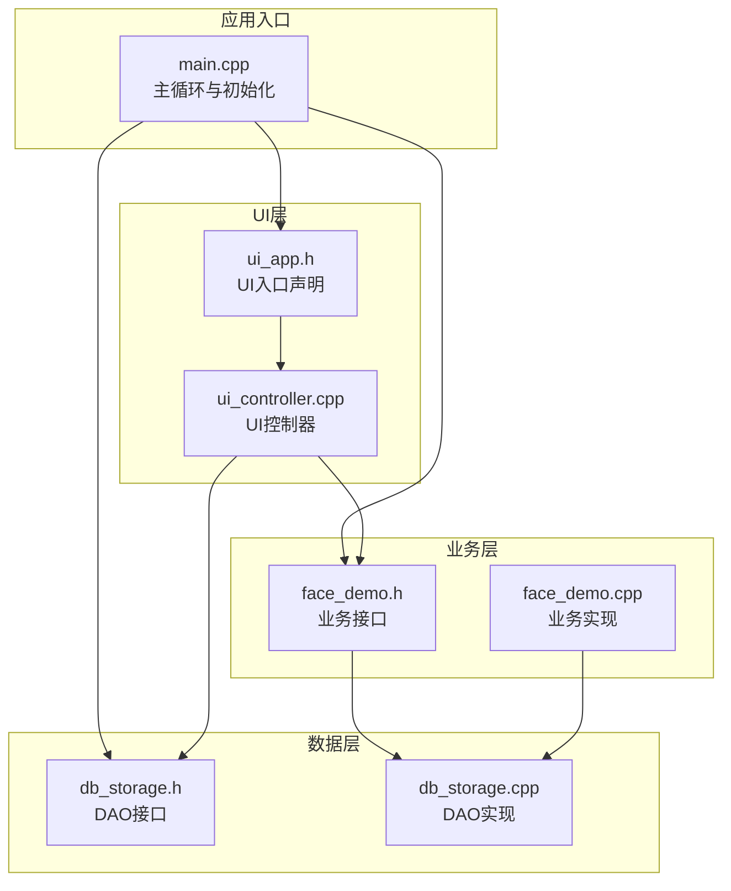
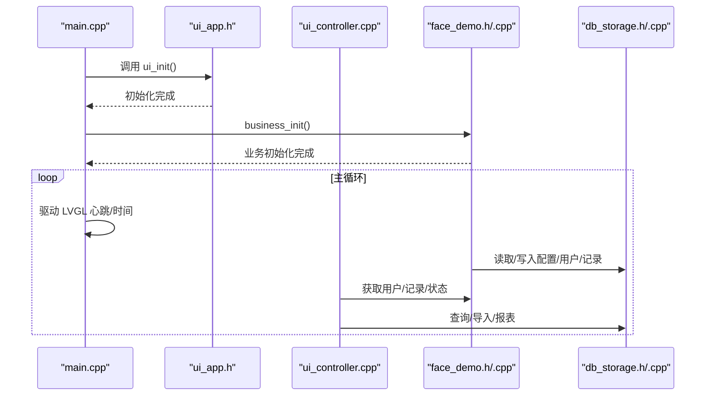
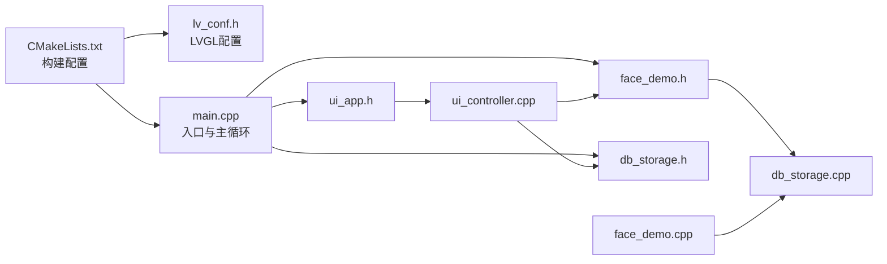

# 代码规范与最佳实践

<cite>
**本文引用的文件**
- [CMakeLists.txt](file://CMakeLists.txt)
- [main.cpp](file://src/main.cpp)
- [lv_conf.h](file://lv_conf.h)
- [ui_app.h](file://src/ui/ui_app.h)
- [face_demo.h](file://src/business/face_demo.h)
- [db_storage.h](file://src/data/db_storage.h)
- [face_demo.cpp](file://src/business/face_demo.cpp)
- [ui_controller.cpp](file://src/ui/ui_controller.cpp)
- [db_storage.cpp](file://src/data/db_storage.cpp)
</cite>

## 目录
1. [简介](#简介)
2. [项目结构](#项目结构)
3. [核心组件](#核心组件)
4. [架构总览](#架构总览)
5. [详细组件分析](#详细组件分析)
6. [依赖关系分析](#依赖关系分析)
7. [性能考量](#性能考量)
8. [故障排查指南](#故障排查指南)
9. [结论](#结论)
10. [附录](#附录)

## 简介
本文件面向智能考勤系统的开发团队，提供一套统一的代码规范与最佳实践指南，涵盖 C++ 编码标准、LVGL 集成最佳实践、注释规范、代码组织原则、异常处理与内存管理策略，并结合项目现有实现给出可操作的示例与常见错误规避建议。目标是提升代码一致性、可维护性与可扩展性。

## 项目结构
项目采用分层架构：
- UI 层：负责界面与交互，通过控制器与业务层/数据层解耦
- 业务层：封装人脸识别、考勤规则、用户与记录管理等核心业务
- 数据层：基于 SQLite 的 DAO 接口，提供统一的数据访问能力
- 外围依赖：OpenCV（图像处理）、SQLite3（本地存储）、LVGL（图形界面）

图表来源
- [main.cpp:187-246](file://src/main.cpp#L187-L246)
- [ui_app.h:8-12](file://src/ui/ui_app.h#L8-L12)
- [face_demo.h:34-212](file://src/business/face_demo.h#L34-L212)
- [db_storage.h:215-683](file://src/data/db_storage.h#L215-L683)

章节来源
- [CMakeLists.txt:83-114](file://CMakeLists.txt#L83-L114)
- [main.cpp:187-246](file://src/main.cpp#L187-L246)

## 核心组件
- 应用入口与主循环：负责系统初始化、依赖自检、UI 初始化、业务初始化与主循环驱动
- UI 控制器：封装 UI 与业务/数据层交互，提供便捷接口与数据转换
- 业务模块：人脸识别、预处理、训练、注册、识别与考勤记录落库
- 数据模块：SQLite 访问、事务、并发控制、表结构与种子数据

章节来源
- [main.cpp:41-246](file://src/main.cpp#L41-L246)
- [ui_controller.cpp:1-200](file://src/ui/ui_controller.cpp#L1-L200)
- [face_demo.cpp:1-200](file://src/business/face_demo.cpp#L1-L200)
- [db_storage.cpp:1-200](file://src/data/db_storage.cpp#L1-L200)

## 架构总览
系统遵循“入口驱动 + 分层解耦 + 事件/回调”的设计思路：
- 入口驱动：主循环定期调用 LVGL 心跳与时间推进
- 分层解耦：UI 通过控制器访问业务/数据层，业务层通过 DAO 访问数据库
- 事件/回调：业务层与 UI 层通过事件总线/回调进行松耦合通信

图表来源
- [main.cpp:213-238](file://src/main.cpp#L213-L238)
- [ui_app.h:8-12](file://src/ui/ui_app.h#L8-L12)
- [face_demo.h:40-212](file://src/business/face_demo.h#L40-L212)
- [db_storage.h:215-683](file://src/data/db_storage.h#L215-L683)

## 详细组件分析

### C++ 编码标准与命名约定
- 类名：使用 PascalCase（如类名示例：参见数据层 RAII 封装）
- 函数名：使用 camelCase（如业务函数、UI 控制器方法）
- 常量：使用 UPPER_CASE（如数据层常量）
- 变量与成员：使用 camelCase（如业务层全局变量、静态变量）
- 命名空间：统一使用小写（如业务层命名空间）
- 头文件保护：使用宏保护（如 DB_STORAGE_H）
- 文件命名：功能相关文件采用小写与下划线组合（如 ui_controller.cpp）

章节来源
- [db_storage.cpp:42-65](file://src/data/db_storage.cpp#L42-L65)
- [ui_controller.cpp:30-35](file://src/ui/ui_controller.cpp#L30-L35)
- [face_demo.h:42-84](file://src/business/face_demo.h#L42-L84)
- [db_storage.h:7-8](file://src/data/db_storage.h#L7-L8)

### 缩进与格式规范
- 缩进：统一使用 4 空格缩进
- 大括号：控制结构与函数体的大括号另起一行
- 空行：逻辑分组之间使用空行分隔
- 行宽：建议不超过 120 列
- 头文件包含顺序：标准库 → 第三方库 → 项目内头文件（参考 main.cpp 的包含顺序）

章节来源
- [main.cpp:17-34](file://src/main.cpp#L17-L34)
- [face_demo.cpp:1-30](file://src/business/face_demo.cpp#L1-L30)

### 注释规范
- 文件级注释：文件开头提供简要说明与作者信息
- 函数注释：使用 doxygen 风格，包含参数、返回值、异常与注意事项
- 类注释：描述职责、依赖与生命周期
- 复杂逻辑注释：对算法分支、并发控制、性能关键路径进行标注
- 示例参考：见 db_storage.h、face_demo.h、ui_controller.cpp 中的注释风格

章节来源
- [db_storage.h:1-683](file://src/data/db_storage.h#L1-L683)
- [face_demo.h:1-212](file://src/business/face_demo.h#L1-L212)
- [ui_controller.cpp:1-200](file://src/ui/ui_controller.cpp#L1-L200)

### 代码组织原则
- 头文件包含顺序：标准库 → 第三方库 → 项目内头文件
- 命名空间：按功能域划分，避免全局污染
- 异常处理：业务层与数据层使用返回值与错误码，必要时抛出受控异常
- 头文件声明与实现分离：接口在头文件，实现与私有细节在源文件
- 静态/全局变量：尽量避免，使用单例或局部静态替代；若必须使用，提供清晰的生命周期与并发保护

章节来源
- [main.cpp:17-34](file://src/main.cpp#L17-L34)
- [face_demo.cpp:31-77](file://src/business/face_demo.cpp#L31-L77)
- [db_storage.cpp:31-38](file://src/data/db_storage.cpp#L31-L38)

### LVGL 集成最佳实践
- 配置文件：通过 LV_CONF_PATH 指定配置文件路径，确保构建系统正确传递
- 初始化顺序：先 UI 初始化，再业务初始化，保证事件订阅与资源可用
- 主循环：在主循环中调用 LVGL 心跳与时间推进，控制刷新频率与响应性
- 事件处理：使用事件回调与事件总线解耦 UI 与业务逻辑
- 内存管理：合理设置绘图缓冲与内存池，避免频繁分配；在退出时释放资源

章节来源
- [CMakeLists.txt:54-61](file://CMakeLists.txt#L54-L61)
- [main.cpp:213-238](file://src/main.cpp#L213-L238)
- [lv_conf.h:17-84](file://lv_conf.h#L17-L84)

### 业务层与数据层接口规范
- 业务层接口：以 C 风格对外暴露，内部使用 C++ 实现；提供配置、注册、识别、记录查询等接口
- 数据层接口：以 DAO 形式提供 CRUD 与报表查询；使用事务提升批量操作性能；提供并发控制与错误处理
- 数据结构：使用结构体承载业务实体，配合可选值与辅助函数处理空值与标准化

章节来源
- [face_demo.h:34-212](file://src/business/face_demo.h#L34-L212)
- [db_storage.h:215-683](file://src/data/db_storage.h#L215-L683)

### 并发与内存管理
- 并发控制：数据层使用读写锁分离读写；业务层使用互斥锁保护共享状态
- 内存管理：优先使用 RAII（如 ScopedSqliteStmt）；避免裸指针与裸 new/delete
- 线程模型：业务层使用后台线程处理耗时任务，主线程负责 UI 与事件循环

章节来源
- [db_storage.cpp:42-65](file://src/data/db_storage.cpp#L42-L65)
- [face_demo.cpp:31-77](file://src/business/face_demo.cpp#L31-L77)

### 错误处理与健壮性
- 返回值与错误码：统一使用布尔返回值与错误日志
- 异常处理：在必要处使用 try/catch，避免异常穿透到 UI 线程
- 资源回收：确保数据库连接、图像缓冲、线程与互斥锁在退出时正确释放

章节来源
- [db_storage.cpp:121-129](file://src/data/db_storage.cpp#L121-L129)
- [main.cpp:242-245](file://src/main.cpp#L242-L245)

## 依赖关系分析
- 构建系统：CMakeLists.txt 统一管理编译选项、依赖查找与链接顺序
- 运行时依赖：OpenCV、SQLite3、SDL2、FreeType
- 代码依赖：UI 通过控制器访问业务/数据层；业务层通过 DAO 访问数据库

图表来源
- [CMakeLists.txt:18-71](file://CMakeLists.txt#L18-L71)
- [main.cpp:17-34](file://src/main.cpp#L17-L34)
- [ui_app.h:8-12](file://src/ui/ui_app.h#L8-L12)
- [face_demo.h:34-212](file://src/business/face_demo.h#L34-L212)
- [db_storage.h:215-683](file://src/data/db_storage.h#L215-L683)

章节来源
- [CMakeLists.txt:18-71](file://CMakeLists.txt#L18-L71)

## 性能考量
- SQLite 性能优化：启用 WAL 模式、调整同步级别、内存缓存与外键约束
- 图像处理：预处理管线（裁剪、直方图均衡化、尺寸归一化）减少识别误差
- 并发优化：读写锁分离、后台线程处理耗时任务、队列与条件变量协调
- UI 响应：控制 LVGL 刷新周期与心跳间隔，避免过高的 CPU 占用

章节来源
- [db_storage.cpp:148-160](file://src/data/db_storage.cpp#L148-L160)
- [face_demo.cpp:88-165](file://src/business/face_demo.cpp#L88-L165)
- [main.cpp:229-238](file://src/main.cpp#L229-L238)

## 故障排查指南
- 依赖缺失：确认 OpenCV、SQLite3、SDL2、FreeType 是否正确安装与发现
- LVGL 配置：检查 LV_CONF_PATH 是否正确传递至构建系统与目标定义
- 数据库初始化：核对数据库文件权限与目录创建逻辑
- 业务初始化：摄像头/视频流是否可用，模型文件是否存在
- UI 无响应：检查主循环中 LVGL 心跳与时间推进调用

章节来源
- [CMakeLists.txt:24-37](file://CMakeLists.txt#L24-L37)
- [CMakeLists.txt:54-61](file://CMakeLists.txt#L54-L61)
- [db_storage.cpp:133-146](file://src/data/db_storage.cpp#L133-L146)
- [face_demo.cpp:173-182](file://src/business/face_demo.cpp#L173-L182)
- [main.cpp:229-238](file://src/main.cpp#L229-L238)

## 结论
本规范以项目现有实现为基础，总结了 C++ 编码风格、LVGL 集成要点、注释与组织原则，并提供了性能与故障排查建议。建议在后续迭代中持续完善注释与测试，强化并发与异常处理，确保系统稳定性与可维护性。

## 附录
- 示例参考路径（不展示具体代码内容）：
  - [main.cpp:41-151](file://src/main.cpp#L41-L151) 依赖自检与测试路由
  - [face_demo.cpp:88-165](file://src/business/face_demo.cpp#L88-L165) 预处理流程
  - [db_storage.cpp:42-65](file://src/data/db_storage.cpp#L42-L65) RAII 封装
  - [ui_controller.cpp:108-170](file://src/ui/ui_controller.cpp#L108-L170) 用户注册与查询
  - [lv_conf.h:17-84](file://lv_conf.h#L17-L84) LVGL 配置片段