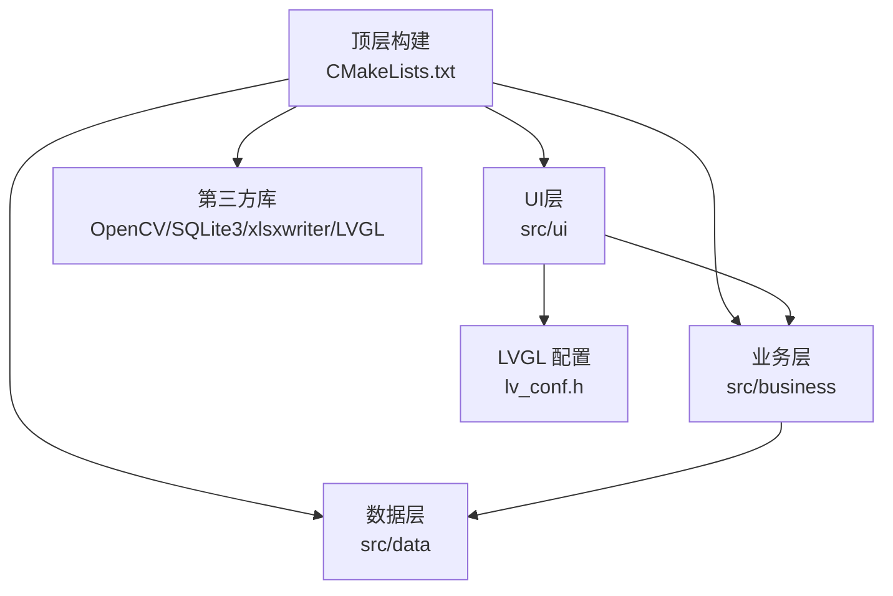
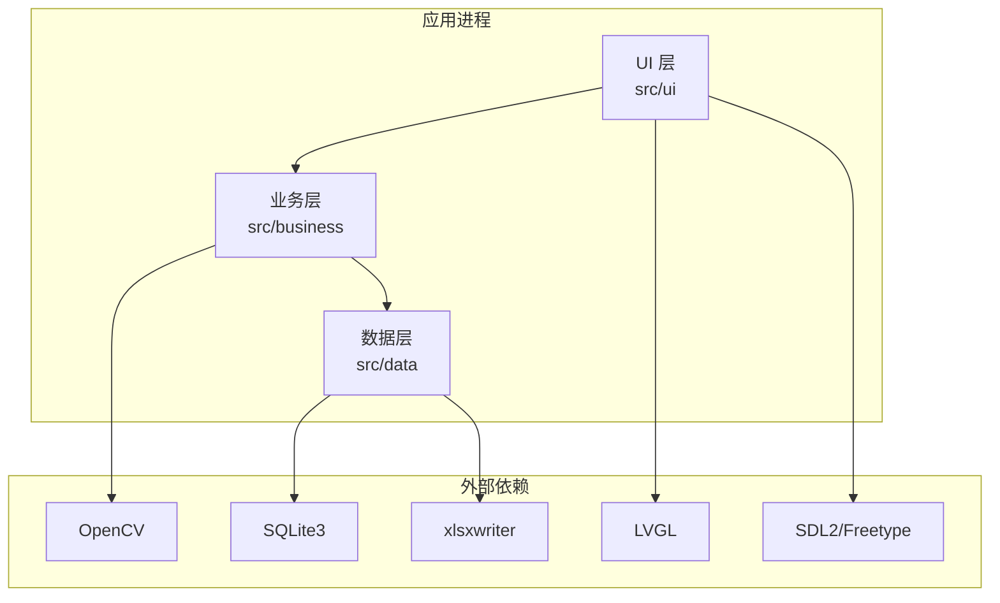
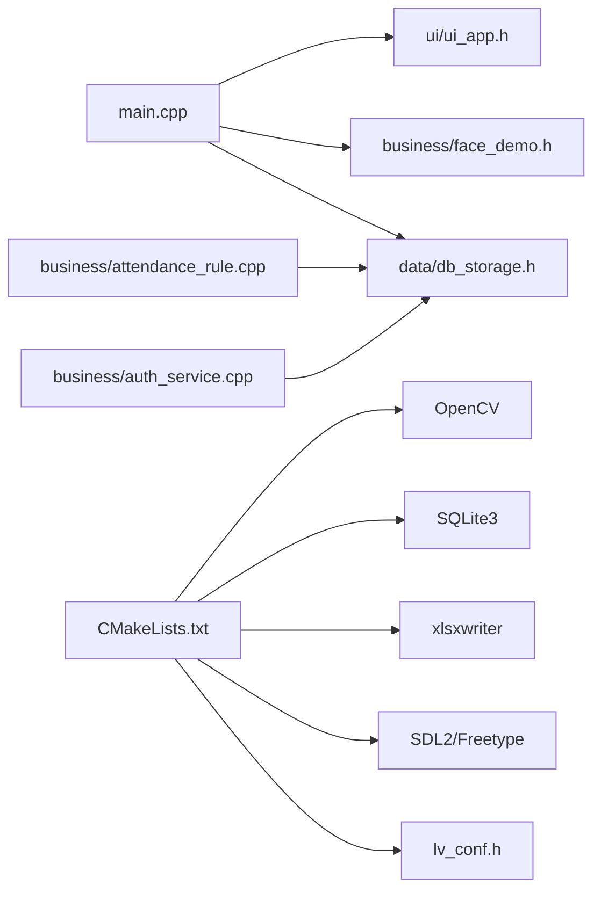

# 代码规范与风格

<cite>
**本文引用的文件**   
- [CMakeLists.txt](file://CMakeLists.txt)
- [lv_conf.h](file://lv_conf.h)
- [code-format.cfg](file://libs/lvgl/scripts/code-format.cfg)
- [code-format.py](file://libs/lvgl/scripts/code-format.py)
- [main.cpp](file://src/main.cpp)
- [attendance_rule.h](file://src/business/attendance_rule.h)
- [attendance_rule.cpp](file://src/business/attendance_rule.cpp)
- [auth_service.h](file://src/business/auth_service.h)
- [auth_service.cpp](file://src/business/auth_service.cpp)
- [.gitignore](file://.gitignore)
</cite>

## 目录
1. [引言](#引言)
2. [项目结构](#项目结构)
3. [核心组件](#核心组件)
4. [架构总览](#架构总览)
5. [详细组件分析](#详细组件分析)
6. [依赖分析](#依赖分析)
7. [性能考虑](#性能考虑)
8. [故障排查指南](#故障排查指南)
9. [结论](#结论)
10. [附录](#附录)

## 引言
本指南面向 SmartAttendance 项目，制定统一的 C++17 编码规范与编程风格，覆盖命名约定、缩进与格式化、注释规范、文件组织、头文件包含顺序、模块化设计原则、代码审查清单、静态分析与自动化格式化流程，并提供最佳实践与反面案例的对比说明，帮助团队提升代码一致性、可读性与可维护性。

## 项目结构
SmartAttendance 采用分层模块化组织：
- 顶层构建与依赖：CMakeLists.txt 统一管理 C++17 标准、导出编译命令、查找第三方库（OpenCV、SQLite3、xlsxwriter、SDL2/Freetype）并集成 LVGL。
- 业务层：src/business 提供认证与考勤规则等核心业务逻辑。
- 数据层：src/data 提供数据库访问与存储封装。
- UI 层：src/ui 提供界面应用与控制器，依赖 LVGL。
- 示例与入口：src/main.cpp 作为主程序入口，负责系统初始化、测试与主循环。

**图表来源**
- [CMakeLists.txt:1-153](file://CMakeLists.txt#L1-L153)
- [lv_conf.h:1-1476](file://lv_conf.h#L1-L1476)

**章节来源**
- [CMakeLists.txt:1-153](file://CMakeLists.txt#L1-L153)
- [.gitignore:1-24](file://.gitignore#L1-L24)

## 核心组件
- 构建与标准
  - C++17 标准启用，导出 compile_commands.json 便于编辑器索引头文件。
  - 自动扫描 src 下多处子目录源文件，包含 UI、业务、数据层。
- LVGL 集成
  - 通过 LV_CONF_PATH 指向根目录配置文件，设置 include 与 link 依赖。
- 依赖管理
  - OpenCV（含 face 模块）、SQLite3、xlsxwriter、SDL2、Freetype。
- 主程序入口
  - main.cpp 负责系统初始化、依赖自检、UI 与业务初始化、主循环与资源清理。

**章节来源**
- [CMakeLists.txt:7-153](file://CMakeLists.txt#L7-L153)
- [lv_conf.h:1-1476](file://lv_conf.h#L1-L1476)
- [main.cpp:1-246](file://src/main.cpp#L1-L246)

## 架构总览
系统采用“UI 驱动 + 业务规则 + 数据持久化”的分层架构。UI 层通过 LVGL 渲染，业务层提供认证与考勤规则，数据层负责数据库访问与报表生成。

**图表来源**
- [CMakeLists.txt:24-146](file://CMakeLists.txt#L24-L146)
- [main.cpp:17-34](file://src/main.cpp#L17-L34)

## 详细组件分析

### 命名约定
- 类名：采用驼峰命名（CamelCase），如 AttendanceRule、AuthService。
- 函数名：采用 snake_case，如 record_attendance、verify_password、time_string_to_minutes。
- 常量：采用全大写与下划线分隔，如 DUPLICATE_PUNCH_LIMIT、MAX_RETRY。
- 枚举与枚举值：枚举名使用名词（PunchStatus、AuthResult），枚举值使用全大写（NORMAL、SUCCESS）。
- 文件与目录：头文件以 .h 结尾，实现以 .cpp 结尾；目录按功能分层（business、data、ui）。

**章节来源**
- [attendance_rule.h:43-89](file://src/business/attendance_rule.h#L43-L89)
- [auth_service.h:23-44](file://src/business/auth_service.h#L23-L44)
- [attendance_rule.cpp:10-13](file://src/business/attendance_rule.cpp#L10-L13)

### 缩进与格式化规则
- 缩进：统一使用 4 空格缩进。
- 大括号：K&R 风格（与 LVGL 代码风格一致），函数体与控制块大括号另起一行。
- 行宽：建议不超过 120 列。
- 操作符：二元操作符两侧留空格，逗号后留空格。
- 空行：逻辑段落之间使用空行分隔，增强可读性。
- 语句分行：长表达式按逻辑分行，保持对齐。

（本节为通用格式化规则说明，不直接分析特定文件）

### 注释规范
- 文件头注释：简述文件用途、主要职责与版本信息。
- 函数注释：使用 API 文档注释风格，说明参数、返回值、异常与注意事项。
- 复杂逻辑注释：对关键算法、边界条件与易错点进行逐行或分段说明。
- TODO 标记：使用 TODO 注释标注待完善或待确认的事项，附带简短描述与优先级。

（本节为通用注释规范说明，不直接分析特定文件）

### 头文件包含顺序与模块化设计
- 顺序建议：
  1) 标准库头文件（<iostream>、<vector>、<string> 等）
  2) 第三方库头文件（OpenCV、SQLite3、xlsxwriter、SDL2/Freetype）
  3) 项目内头文件（UI、业务、数据层）
- 模块化设计：
  - UI 层仅依赖业务层提供的接口，不直接耦合数据层细节。
  - 业务层通过数据层接口访问数据库，保持清晰职责边界。
  - 数据层集中处理数据库初始化、迁移与访问封装。

**章节来源**
- [main.cpp:8-34](file://src/main.cpp#L8-L34)
- [CMakeLists.txt:114-146](file://CMakeLists.txt#L114-L146)

### 代码审查检查清单
- 代码风格：缩进、空格、换行、行宽是否符合规范。
- 命名一致性：类名、函数名、常量、枚举是否遵循约定。
- 注释完整性：函数、复杂逻辑、TODO 是否有清晰注释。
- 头文件包含：顺序是否合理，是否避免重复包含。
- 错误处理：返回值检查、异常路径、资源释放。
- 性能与内存：避免不必要的拷贝、及时释放资源、合理使用智能指针。
- 平台兼容：条件编译与平台差异处理。

（本节为通用审查清单说明，不直接分析特定文件）

### 静态分析与自动化格式化
- 静态分析工具
  - cppcheck：用于检测潜在问题（悬空指针、数组越界、未使用变量等）。
  - astyler：基于 LVGL 提供的配置与脚本，统一代码风格。
- 配置与脚本
  - code-format.cfg：定义 astyle 的风格参数（缩进、对齐、行宽、排除列表等）。
  - code-format.py：按目录批量执行 astyle 格式化（支持 demos、examples、src、tests）。
- 自动化流程
  - 在 CI 或本地提交前运行 astyle 格式化与 cppcheck 检测，确保提交代码风格一致、质量达标。

**章节来源**
- [code-format.cfg:1-66](file://libs/lvgl/scripts/code-format.cfg#L1-L66)
- [code-format.py:1-66](file://libs/lvgl/scripts/code-format.py#L1-L66)

### 最佳实践与反面案例对比

- 命名一致性
  - 最佳实践：类名使用驼峰（AttendanceRule），函数名使用 snake_case（record_attendance），常量全大写（DUPLICATE_PUNCH_LIMIT）。
  - 反面案例：混用命名风格导致可读性下降（如类名用 snake_case）。

- 注释与文档
  - 最佳实践：函数与复杂逻辑提供 API 文档注释，说明输入输出、边界条件与异常处理。
  - 反面案例：缺失注释或注释与实现不符，造成维护困难。

- 头文件包含顺序
  - 最佳实践：按标准库 → 第三方库 → 项目内头文件的顺序包含，减少编译依赖混乱。
  - 反面案例：随意放置包含顺序，导致头文件冲突或编译错误。

- 错误处理
  - 最佳实践：对数据库操作、图像处理等易失败路径进行检查与回退。
  - 反面案例：忽略返回值或异常，导致程序崩溃或数据不一致。

（本节为通用对比说明，不直接分析特定文件）

## 依赖分析
SmartAttendance 的核心依赖关系如下：

**图表来源**
- [main.cpp:30-34](file://src/main.cpp#L30-L34)
- [CMakeLists.txt:24-146](file://CMakeLists.txt#L24-L146)
- [attendance_rule.cpp:1-10](file://src/business/attendance_rule.cpp#L1-L10)
- [auth_service.cpp:1-5](file://src/business/auth_service.cpp#L1-L5)

**章节来源**
- [CMakeLists.txt:24-146](file://CMakeLists.txt#L24-L146)
- [main.cpp:30-34](file://src/main.cpp#L30-L34)

## 性能考虑
- LVGL 配置：通过 lv_conf.h 调整渲染策略、缓冲区大小与线程优先级，平衡性能与资源占用。
- 图像处理：OpenCV 操作尽量复用 Mat 对象，避免频繁分配与拷贝。
- 数据库访问：批量写入、索引优化与连接池策略，减少 IO 延迟。
- 主循环：合理设置 LVGL 心跳周期与最小/最大休眠时间，兼顾响应速度与 CPU 占用。

**章节来源**
- [lv_conf.h:145-167](file://lv_conf.h#L145-L167)
- [main.cpp:229-238](file://src/main.cpp#L229-L238)

## 故障排查指南
- 编译失败
  - 检查 CMake 输出的依赖路径与版本信息，确认第三方库安装完整。
  - 确认 C++17 标准与编译命令导出已启用。
- 运行时错误
  - 数据库初始化失败：检查数据库文件权限与 schema 初始化流程。
  - UI 无响应：确认主循环中 LVGL 心跳与 tick 更新正常。
- 格式化与静态分析
  - 使用 code-format.py 与 code-format.cfg 统一风格。
  - 使用 cppcheck 进行静态分析，定位潜在问题。

**章节来源**
- [CMakeLists.txt:148-153](file://CMakeLists.txt#L148-L153)
- [main.cpp:204-208](file://src/main.cpp#L204-L208)
- [code-format.py:47-66](file://libs/lvgl/scripts/code-format.py#L47-L66)

## 结论
通过统一的 C++17 编码规范、清晰的命名与注释、严格的头文件包含顺序与模块化设计，配合 astyle 与 cppcheck 的自动化流程，SmartAttendance 项目能够在保证功能完整性的同时，显著提升代码质量与可维护性。建议在团队内推广并持续优化这些规范，形成稳定的开发与审查流程。

## 附录

### A. 命名约定速查
- 类名：CamelCase（如 AttendanceRule）
- 函数名：snake_case（如 record_attendance）
- 常量：UPPER_CASE（如 MAX_RETRY）
- 枚举与值：PunchStatus、SUCCESS

**章节来源**
- [attendance_rule.h:43-89](file://src/business/attendance_rule.h#L43-L89)
- [auth_service.h:23-44](file://src/business/auth_service.h#L23-L44)

### B. 头文件包含顺序示例
- 标准库 → 第三方库 → 项目内头文件
- 示例参考：main.cpp 中的包含顺序

**章节来源**
- [main.cpp:8-34](file://src/main.cpp#L8-L34)

### C. 代码风格检查清单
- 缩进与空格：4 空格、操作符两侧空格
- 大括号：K&R 风格
- 行宽：≤120 列
- 注释：函数与复杂逻辑注释齐全
- TODO：明确标记与优先级

（本节为通用清单说明，不直接分析特定文件）