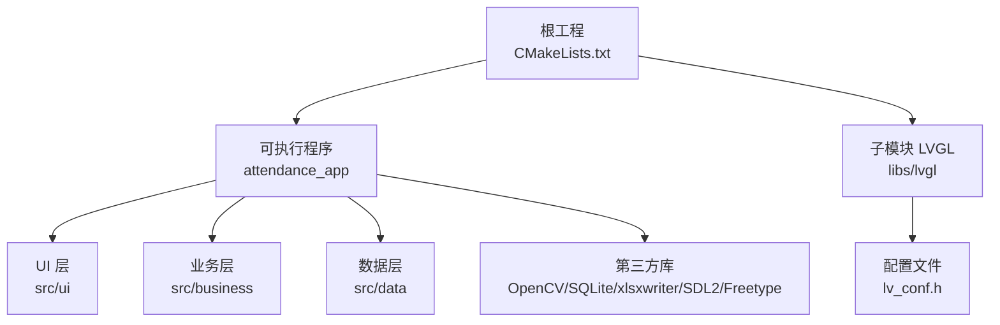
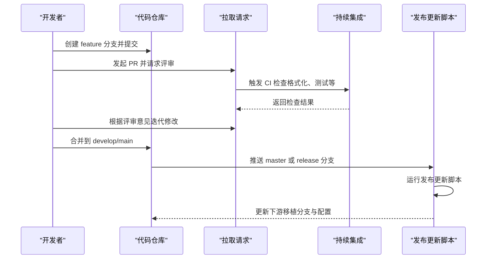
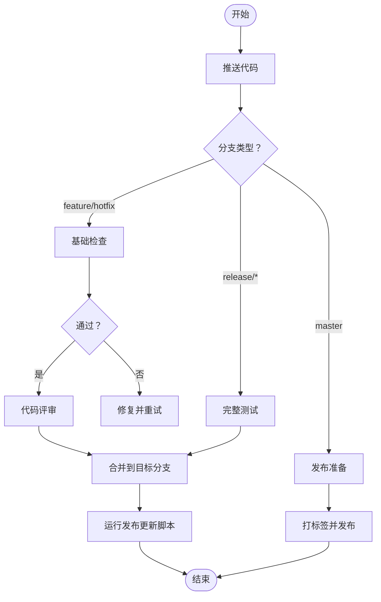
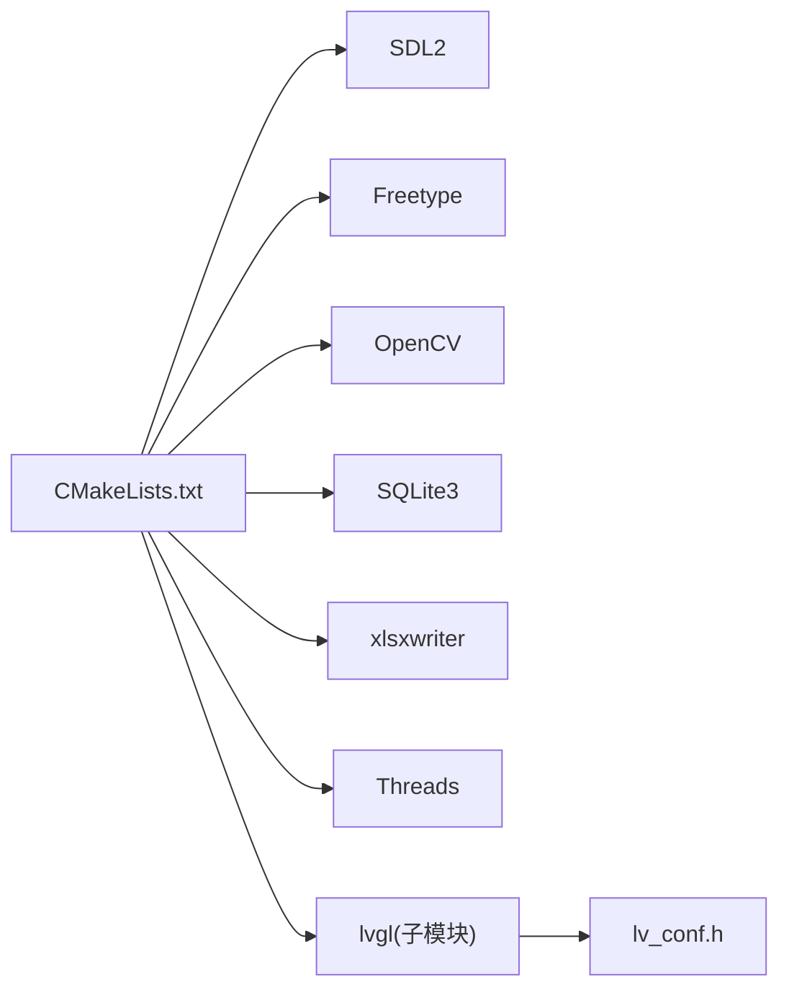

# 开发工作流程

<cite>
**本文引用的文件**
- [CMakeLists.txt](file://CMakeLists.txt)
- [lv_conf.h](file://lv_conf.h)
- [.github/pull_request_template.md](file://libs/lvgl/.github/pull_request_template.md)
- [.github/dependabot.yml](file://libs/lvgl/.github/dependabot.yml)
- [.github/workflows/release_branch_updater.yml](file://libs/lvgl/.github/workflows/release_branch_updater.yml)
- [scripts/changelog_gen.sh](file://libs/lvgl/scripts/changelog_gen.sh)
- [scripts/release_branch_updater.py](file://libs/lvgl/scripts/release_branch_updater.py)
- [docs/CODE_OF_CONDUCT.md](file://libs/lvgl/docs/CODE_OF_CONDUCT.md)
- [libs/lvgl/README.md](file://libs/lvgl/README.md)
</cite>

## 目录
1. [简介](#简介)
2. [项目结构](#项目结构)
3. [核心组件](#核心组件)
4. [架构总览](#架构总览)
5. [详细组件分析](#详细组件分析)
6. [依赖关系分析](#依赖关系分析)
7. [性能考虑](#性能考虑)
8. [故障排查指南](#故障排查指南)
9. [结论](#结论)
10. [附录](#附录)

## 简介
本文件为 SmartAttendance 项目制定标准化的开发工作流程与协作规范，覆盖 Git 分支管理、提交信息规范、代码评审流程、版本控制最佳实践（feature 分支、hotfix 处理、release 流程）、本地环境同步与冲突解决、版本回滚方法、持续集成与自动化构建部署、团队协作与进度跟踪、文档与变更日志维护及发布管理等。

## 项目结构
SmartAttendance 采用多模块混合结构：
- 根工程通过 CMake 组织，集成 LVGL 子模块与第三方库（OpenCV、SQLite、xlsxwriter、SDL2、FreeType）。
- UI 层基于 LVGL 实现，业务逻辑与数据访问分层清晰。
- 工程提供可执行应用入口与 UI 控制器，便于桌面端调试与演示。

图表来源
- [CMakeLists.txt:1-153](file://CMakeLists.txt#L1-L153)
- [lv_conf.h:1-800](file://lv_conf.h#L1-L800)

章节来源
- [CMakeLists.txt:1-153](file://CMakeLists.txt#L1-L153)

## 核心组件
- 构建系统与依赖管理：CMake 负责查找并链接依赖库，导出编译命令以便 IDE 自动索引。
- UI 框架：LVGL 提供跨平台图形界面能力，配置由 lv_conf.h 控制。
- 业务与数据：业务规则、事件总线、认证服务与数据库存储分离，便于测试与演进。
- 变更日志与发布：仓库内提供变更日志生成脚本与发布分支更新自动化。

章节来源
- [CMakeLists.txt:1-153](file://CMakeLists.txt#L1-L153)
- [lv_conf.h:1-800](file://lv_conf.h#L1-L800)

## 架构总览
下图展示从开发者到构建与发布的整体流程，体现分支策略、CI 触发与发布更新机制：

图表来源
- [.github/workflows/release_branch_updater.yml:1-46](file://libs/lvgl/.github/workflows/release_branch_updater.yml#L1-L46)
- [scripts/release_branch_updater.py:1-270](file://libs/lvgl/scripts/release_branch_updater.py#L1-L270)

## 详细组件分析

### Git 分支管理策略
- 分支模型
  - main/master：最新稳定版本，热修复直接合并。
  - develop：日常开发分支，功能完成后合并至 main/master。
  - feature/*：功能开发分支，命名如 feature/user-auth。
  - hotfix/*：紧急修复分支，修复后同时合并至 develop 与 main/master。
  - release/vX.Y：小版本发布分支，仅做缺陷修复与文档更新。
- 合并与保护
  - main/master 与 release 分支需保护分支规则（禁止直接推送、要求状态检查通过）。
  - feature 分支在合并前需通过 CI 与评审。

章节来源
- [libs/lvgl/docs/src/intro/introduction/repo.rst:38-64](file://libs/lvgl/docs/src/intro/introduction/repo.rst#L38-L64)

### 提交信息规范
- 类型与主题
  - feat：新功能
  - fix：缺陷修复
  - docs：文档更新
  - style：不影响逻辑的格式调整
  - refactor：重构但不改变行为
  - perf：性能优化
  - test：新增或调整测试
  - chore：构建流程、依赖等改动
- 主题与正文
  - 主题简短明确，首字母小写，末尾不加句号。
  - 正文描述动机与影响，必要时引用问题编号。
- 示例
  - feat(ui): 添加用户登录界面
  - fix(data): 修正数据库连接超时问题

章节来源
- [.github/pull_request_template.md:1-14](file://libs/lvgl/.github/pull_request_template.md#L1-L14)

### 代码评审流程
- PR 模板要求
  - 明确关联的问题编号。
  - 文档、示例、测试更新说明。
  - 代码格式化与风格检查。
  - Draft 状态与“就绪评审”切换。
- 评审要点
  - 功能正确性与边界条件。
  - 性能与资源占用。
  - 兼容性与回归风险。
  - 文档与注释完整性。

章节来源
- [.github/pull_request_template.md:1-14](file://libs/lvgl/.github/pull_request_template.md#L1-L14)

### 版本控制最佳实践
- Feature 分支开发
  - 在 feature/* 上进行迭代，定期 rebase 主干保持线性历史。
  - 小步提交，频繁推送，便于评审与回滚。
- Hotfix 处理
  - 从 main/master 切出 hotfix/*，修复后同时合并回 main/master 与 develop。
  - 发布后打标签并记录变更日志。
- Release 流程
  - 在 release/vX.Y 上只做最小化变更（缺陷修复、文档、版本号）。
  - 合并至 main/master 后打标签并发布。
  - 使用发布更新脚本同步下游移植分支。

章节来源
- [libs/lvgl/docs/src/intro/introduction/repo.rst:38-64](file://libs/lvgl/docs/src/intro/introduction/repo.rst#L38-L64)
- [.github/workflows/release_branch_updater.yml:1-46](file://libs/lvgl/.github/workflows/release_branch_updater.yml#L1-L46)
- [scripts/release_branch_updater.py:1-270](file://libs/lvgl/scripts/release_branch_updater.py#L1-L270)

### 本地开发环境同步与冲突解决
- 同步主干
  - 定期从 main/master rebase 当前分支，减少冲突。
  - 使用变基而非合并保持历史整洁。
- 冲突解决
  - 明确冲突范围，逐个文件解决。
  - 优先保留逻辑正确性与性能，再关注风格一致性。
- 本地验证
  - 本地运行 CMake 构建与基本功能测试。
  - 使用格式化脚本统一代码风格。

章节来源
- [CMakeLists.txt:1-153](file://CMakeLists.txt#L1-L153)

### 版本回滚方法
- 回滚策略
  - 若发布后出现严重问题，使用最近一次稳定标签进行回滚。
  - 对于热修复，可 cherry-pick 修复补丁或回退相关提交。
- 回滚流程
  - 在 release 分支上创建 hotfix 分支，修复后合并并重新打标签。
  - 通知下游移植分支同步更新。

章节来源
- [libs/lvgl/docs/src/intro/introduction/repo.rst:38-64](file://libs/lvgl/docs/src/intro/introduction/repo.rst#L38-L64)

### 持续集成与自动化构建部署
- CI 触发
  - Push 到 feature、hotfix、release 分支触发基础检查。
  - Push 到 master/release 分支触发完整测试与发布准备。
- 任务清单
  - 代码格式化检查与静态分析。
  - 单元测试与性能基准测试。
  - 依赖更新与安全扫描（Dependabot）。
- 发布更新
  - 定时任务与手动触发运行发布更新脚本，同步下游移植分支与配置文件。

图表来源
- [.github/workflows/release_branch_updater.yml:1-46](file://libs/lvgl/.github/workflows/release_branch_updater.yml#L1-L46)
- [scripts/release_branch_updater.py:1-270](file://libs/lvgl/scripts/release_branch_updater.py#L1-L270)

章节来源
- [.github/dependabot.yml:1-11](file://libs/lvgl/.github/dependabot.yml#L1-L11)
- [.github/workflows/release_branch_updater.yml:1-46](file://libs/lvgl/.github/workflows/release_branch_updater.yml#L1-L46)

### 团队协作规范、任务分配与进度跟踪
- 行为准则
  - 遵循贡献者公约，营造包容、尊重的协作环境。
- 任务分配
  - 使用 Issue 跟踪需求与缺陷；PR 关联对应 Issue。
  - 为复杂任务拆分子任务，明确负责人与截止时间。
- 进度跟踪
  - 使用里程碑规划版本节奏，结合发布分支控制交付节奏。
  - 评审与合并遵循模板，确保知识沉淀与可追溯性。

章节来源
- [docs/CODE_OF_CONDUCT.md:1-77](file://libs/lvgl/docs/CODE_OF_CONDUCT.md#L1-L77)
- [libs/lvgl/README.md:372-384](file://libs/lvgl/README.md#L372-L384)

### 文档更新、变更日志维护与发布管理
- 文档更新
  - 修改功能或接口时同步更新相关文档与示例。
  - PR 模板中明确是否需要更新文档。
- 变更日志
  - 使用变更日志生成脚本从最新版本标签起汇总变更。
  - 手动编辑生成的变更摘要并合并到主文档。
- 发布管理
  - 严格遵循发布分支策略与标签规范。
  - 使用发布更新脚本同步下游移植分支，确保配置一致性。

章节来源
- [.github/pull_request_template.md:1-14](file://libs/lvgl/.github/pull_request_template.md#L1-L14)
- [scripts/changelog_gen.sh:1-17](file://libs/lvgl/scripts/changelog_gen.sh#L1-L17)
- [scripts/release_branch_updater.py:1-270](file://libs/lvgl/scripts/release_branch_updater.py#L1-L270)

## 依赖关系分析
SmartAttendance 的构建与运行依赖如下：
- 依赖发现与链接：CMake 查找 SDL2、Freetype、OpenCV、SQLite、xlsxwriter，并设置 LVGL 配置路径。
- UI 集成：通过 add_subdirectory 引入 LVGL 子模块，设置编译定义与包含路径。
- 应用构建：自动收集 UI、业务、数据层源文件，链接所有依赖库。

图表来源
- [CMakeLists.txt:18-72](file://CMakeLists.txt#L18-L72)
- [lv_conf.h:1-800](file://lv_conf.h#L1-L800)

章节来源
- [CMakeLists.txt:18-72](file://CMakeLists.txt#L18-L72)

## 性能考虑
- 构建性能
  - 启用编译命令导出，提升 IDE 头文件索引效率。
  - 合理划分源文件与模块，避免全量重建。
- 运行性能
  - LVGL 渲染参数与内存配置需根据目标平台调优。
  - 依赖库版本与编译选项应与硬件能力匹配。

## 故障排查指南
- 构建失败
  - 检查依赖库是否正确安装与发现。
  - 确认 lv_conf.h 路径与宏定义正确。
- 评审被拒
  - 依据评审意见完善代码、文档与测试。
  - 使用格式化脚本统一风格。
- 发布异常
  - 检查发布更新脚本的上游分支与令牌配置。
  - 确保下游移植分支与配置文件已同步。

章节来源
- [CMakeLists.txt:73-78](file://CMakeLists.txt#L73-L78)
- [.github/pull_request_template.md:1-14](file://libs/lvgl/.github/pull_request_template.md#L1-L14)
- [scripts/release_branch_updater.py:1-270](file://libs/lvgl/scripts/release_branch_updater.py#L1-L270)

## 结论
通过统一的分支策略、提交规范、评审流程与自动化流水线，SmartAttendance 可实现高效、可追溯、低风险的持续交付。建议团队严格执行规范并持续改进流程，确保质量与效率双提升。

## 附录
- 快速参考
  - 分支命名：feature/*、hotfix/*、release/vX.Y、develop、main/master
  - 提交类型：feat、fix、docs、style、refactor、perf、test、chore
  - 评审模板：PR 模板中包含文档、示例、测试、格式化与状态切换说明
  - 发布更新：定时与手动触发，同步下游移植分支与配置