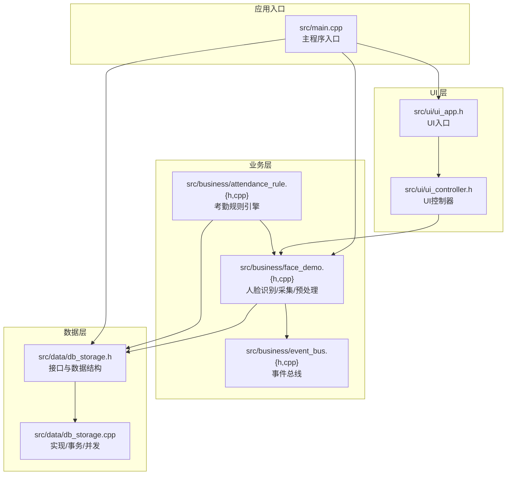
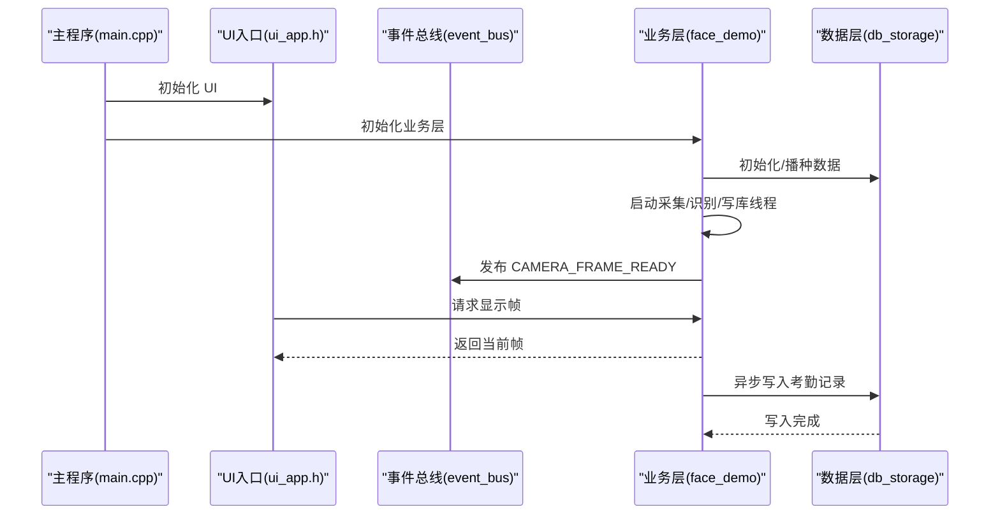
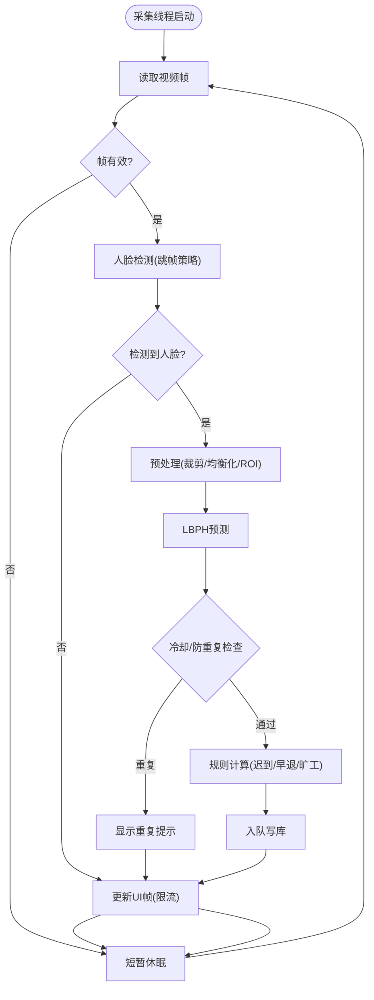
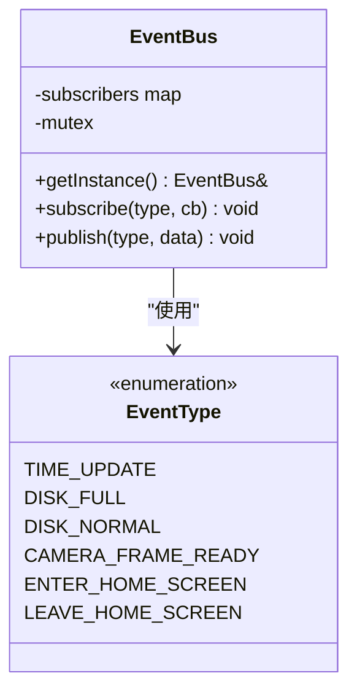
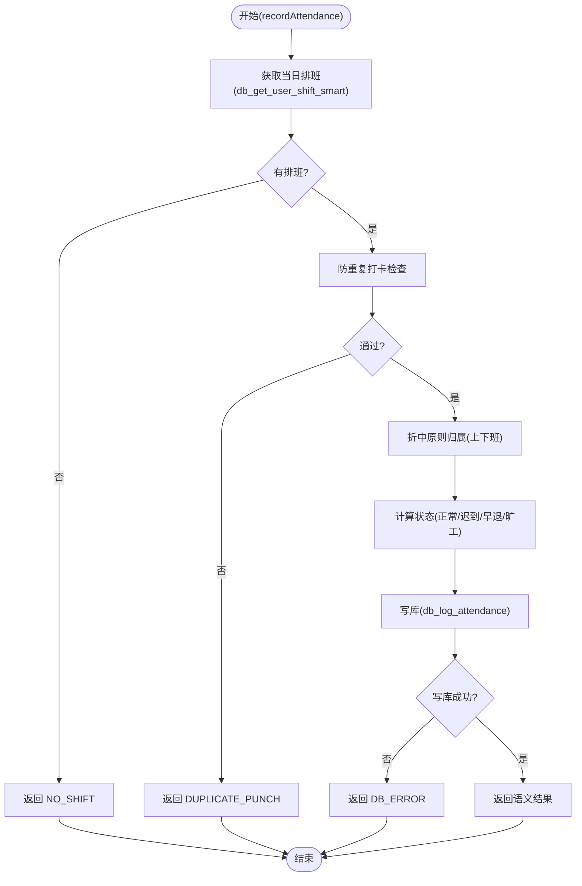
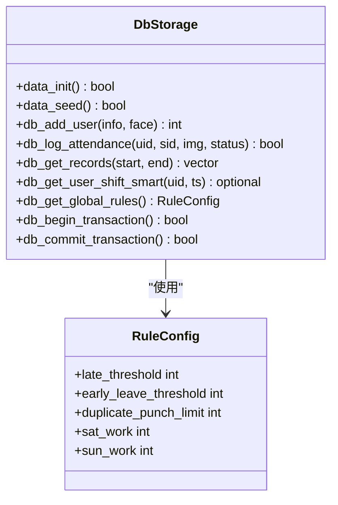
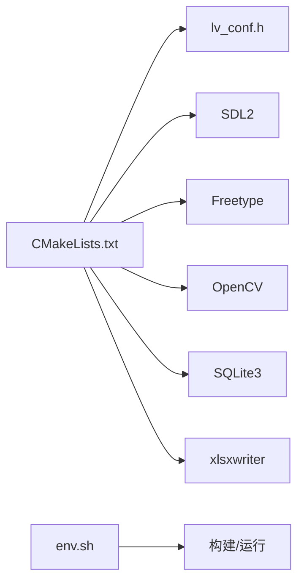
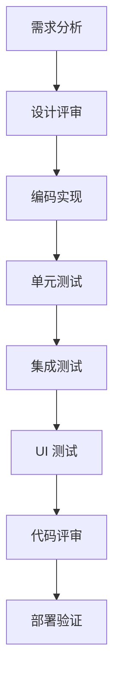

# 开发指南

<cite>
**本文引用的文件**
- [src/main.cpp](file://src/main.cpp)
- [CMakeLists.txt](file://CMakeLists.txt)
- [lv_conf.h](file://lv_conf.h)
- [env/env.sh](file://env/env.sh)
- [src/business/face_demo.h](file://src/business/face_demo.h)
- [src/business/face_demo.cpp](file://src/business/face_demo.cpp)
- [src/data/db_storage.h](file://src/data/db_storage.h)
- [src/data/db_storage.cpp](file://src/data/db_storage.cpp)
- [src/ui/ui_app.h](file://src/ui/ui_app.h)
- [src/ui/ui_controller.h](file://src/ui/ui_controller.h)
- [src/business/event_bus.h](file://src/business/event_bus.h)
- [src/business/event_bus.cpp](file://src/business/event_bus.cpp)
- [src/business/attendance_rule.h](file://src/business/attendance_rule.h)
- [src/business/attendance_rule.cpp](file://src/business/attendance_rule.cpp)
</cite>

## 目录
1. [简介](#简介)
2. [项目结构](#项目结构)
3. [核心组件](#核心组件)
4. [架构总览](#架构总览)
5. [详细组件分析](#详细组件分析)
6. [依赖关系分析](#依赖关系分析)
7. [性能考量](#性能考量)
8. [故障排查指南](#故障排查指南)
9. [结论](#结论)
10. [附录](#附录)

## 简介
本开发指南面向智能考勤系统的开发与维护人员，提供从代码规范、命名约定、注释规范，到新功能开发流程、测试策略、调试技巧、代码审查清单与质量保障措施的完整指引。系统采用 C++17 与 CMake 构建，集成 LVGL UI 框架、OpenCV 图像处理、SQLite3 数据持久化与线程池，形成“UI 层—业务层—数据层”的清晰分层。

## 项目结构
项目采用分层组织方式：
- UI 层：负责图形界面与用户交互，基于 LVGL，通过 ui_app 与 ui_controller 提供入口与控制器封装。
- 业务层：负责人脸识别、视频流采集、考勤规则计算、事件总线与多线程协调。
- 数据层：封装 SQLite3 访问、表结构与种子数据、事务与并发控制。
- 根目录构建与环境：CMakeLists.txt 管理编译配置与依赖发现；env.sh 提供一键构建与运行脚本。

图表来源
- [src/main.cpp:187-246](file://src/main.cpp#L187-L246)
- [src/ui/ui_app.h:8-12](file://src/ui/ui_app.h#L8-L12)
- [src/ui/ui_controller.h:21-108](file://src/ui/ui_controller.h#L21-L108)
- [src/business/face_demo.h:34-212](file://src/business/face_demo.h#L34-L212)
- [src/business/face_demo.cpp:557-694](file://src/business/face_demo.cpp#L557-L694)
- [src/business/event_bus.h:10-41](file://src/business/event_bus.h#L10-L41)
- [src/business/attendance_rule.h:43-89](file://src/business/attendance_rule.h#L43-L89)
- [src/data/db_storage.h:221-683](file://src/data/db_storage.h#L221-L683)
- [src/data/db_storage.cpp:133-310](file://src/data/db_storage.cpp#L133-L310)

章节来源
- [src/main.cpp:187-246](file://src/main.cpp#L187-L246)
- [CMakeLists.txt:1-155](file://CMakeLists.txt#L1-L155)
- [lv_conf.h:1-800](file://lv_conf.h#L1-L800)
- [env/env.sh:16-101](file://env/env.sh#L16-L101)

## 核心组件
- 主程序入口与生命周期
  - 初始化系统：禁用休眠、检查依赖、初始化数据层、UI 层与业务层，进入主循环驱动 LVGL。
  - 关键路径参考：[src/main.cpp:187-246](file://src/main.cpp#L187-L246)。
- UI 子系统
  - UI 入口与控制器封装，提供摄像头帧获取、用户管理、报表导出等能力。
  - 关键路径参考：[src/ui/ui_app.h:8-12](file://src/ui/ui_app.h#L8-L12)、[src/ui/ui_controller.h:21-108](file://src/ui/ui_controller.h#L21-L108)。
- 业务层（人脸识别与考勤）
  - 后台采集线程、识别线程、数据库写入线程、事件总线、预处理与规则计算。
  - 关键路径参考：[src/business/face_demo.h:34-212](file://src/business/face_demo.h#L34-L212)、[src/business/face_demo.cpp:291-549](file://src/business/face_demo.cpp#L291-L549)、[src/business/event_bus.h:10-41](file://src/business/event_bus.h#L10-L41)、[src/business/attendance_rule.cpp:263-342](file://src/business/attendance_rule.cpp#L263-L342)。
- 数据层（SQLite3）
  - 表结构、种子数据、事务、并发读写锁、预编译语句、图像 BLOB 存储。
  - 关键路径参考：[src/data/db_storage.h:221-683](file://src/data/db_storage.h#L221-L683)、[src/data/db_storage.cpp:133-310](file://src/data/db_storage.cpp#L133-L310)。

章节来源
- [src/main.cpp:187-246](file://src/main.cpp#L187-L246)
- [src/ui/ui_app.h:8-12](file://src/ui/ui_app.h#L8-L12)
- [src/ui/ui_controller.h:21-108](file://src/ui/ui_controller.h#L21-L108)
- [src/business/face_demo.h:34-212](file://src/business/face_demo.h#L34-L212)
- [src/business/face_demo.cpp:291-549](file://src/business/face_demo.cpp#L291-L549)
- [src/business/event_bus.h:10-41](file://src/business/event_bus.h#L10-L41)
- [src/business/attendance_rule.cpp:263-342](file://src/business/attendance_rule.cpp#L263-L342)
- [src/data/db_storage.h:221-683](file://src/data/db_storage.h#L221-L683)
- [src/data/db_storage.cpp:133-310](file://src/data/db_storage.cpp#L133-L310)

## 架构总览
系统采用“事件驱动 + 多线程 + 分层解耦”的架构：
- UI 层通过事件总线与业务层解耦，业务层通过数据层进行持久化。
- 业务层内部通过后台采集线程、识别线程与数据库写入线程协同，使用队列与条件变量实现异步落库。
- 数据层采用读写锁与预编译语句提升并发与性能。

图表来源
- [src/main.cpp:213-225](file://src/main.cpp#L213-L225)
- [src/business/face_demo.cpp:246-285](file://src/business/face_demo.cpp#L246-L285)
- [src/business/event_bus.cpp:14-28](file://src/business/event_bus.cpp#L14-L28)
- [src/data/db_storage.cpp:300-307](file://src/data/db_storage.cpp#L300-L307)

章节来源
- [src/main.cpp:213-225](file://src/main.cpp#L213-L225)
- [src/business/face_demo.cpp:246-285](file://src/business/face_demo.cpp#L246-L285)
- [src/business/event_bus.cpp:14-28](file://src/business/event_bus.cpp#L14-L28)
- [src/data/db_storage.cpp:300-307](file://src/data/db_storage.cpp#L300-L307)

## 详细组件分析

### 组件 A：人脸识别与采集（face_demo）
- 功能要点
  - 后台采集线程：周期性读取视频帧、人脸检测、绘制框与识别结果、更新 UI 缓冲。
  - 识别线程：预处理人脸、预测标签、冷却控制、防重复打卡、异步写库。
  - 数据库写入线程：消费队列、串行写库、异常隔离。
  - 预处理管线：裁剪、尺寸归一化、直方图均衡化、ROI 增强。
- 关键接口与数据结构
  - 预处理配置、用户列表缓存、记录缓存、全局规则配置。
  - 参考：[src/business/face_demo.h:42-136](file://src/business/face_demo.h#L42-L136)、[src/business/face_demo.cpp:60-77](file://src/business/face_demo.cpp#L60-L77)。
- 线程与同步
  - 采集线程与 UI 线程共享帧缓冲，使用互斥锁保护；识别线程与写库线程通过队列与条件变量解耦。
  - 参考：[src/business/face_demo.cpp:291-549](file://src/business/face_demo.cpp#L291-L549)。

图表来源
- [src/business/face_demo.cpp:291-549](file://src/business/face_demo.cpp#L291-L549)
- [src/business/face_demo.h:42-136](file://src/business/face_demo.h#L42-L136)

章节来源
- [src/business/face_demo.h:42-136](file://src/business/face_demo.h#L42-L136)
- [src/business/face_demo.cpp:291-549](file://src/business/face_demo.cpp#L291-L549)

### 组件 B：事件总线（event_bus）
- 功能要点
  - 单例事件总线，支持订阅/发布，线程安全回调列表复制。
- 关键接口
  - subscribe、publish。
- 参考：[src/business/event_bus.h:10-41](file://src/business/event_bus.h#L10-L41)、[src/business/event_bus.cpp:14-28](file://src/business/event_bus.cpp#L14-L28)。

图表来源
- [src/business/event_bus.h:10-41](file://src/business/event_bus.h#L10-L41)
- [src/business/event_bus.cpp:14-28](file://src/business/event_bus.cpp#L14-L28)

章节来源
- [src/business/event_bus.h:10-41](file://src/business/event_bus.h#L10-L41)
- [src/business/event_bus.cpp:14-28](file://src/business/event_bus.cpp#L14-L28)

### 组件 C：考勤规则引擎（attendance_rule）
- 功能要点
  - 时间清洗与容错、折中原则归属、迟到/早退/旷工判定、防重复打卡、写库封装。
- 关键接口
  - recordAttendance、calculatePunchStatus、determineShiftOwner。
- 参考：[src/business/attendance_rule.h:43-89](file://src/business/attendance_rule.h#L43-L89)、[src/business/attendance_rule.cpp:263-342](file://src/business/attendance_rule.cpp#L263-L342)。

图表来源
- [src/business/attendance_rule.cpp:263-342](file://src/business/attendance_rule.cpp#L263-L342)
- [src/business/attendance_rule.h:43-89](file://src/business/attendance_rule.h#L43-L89)

章节来源
- [src/business/attendance_rule.h:43-89](file://src/business/attendance_rule.h#L43-L89)
- [src/business/attendance_rule.cpp:263-342](file://src/business/attendance_rule.cpp#L263-L342)

### 组件 D：数据层（db_storage）
- 功能要点
  - 表结构与种子数据、事务、预编译语句、读写锁、图像 BLOB 存储、联合索引优化。
- 关键接口
  - data_init、data_seed、db_add_user、db_log_attendance、db_get_records 等。
- 参考：[src/data/db_storage.h:221-683](file://src/data/db_storage.h#L221-L683)、[src/data/db_storage.cpp:133-310](file://src/data/db_storage.cpp#L133-L310)。

图表来源
- [src/data/db_storage.h:221-683](file://src/data/db_storage.h#L221-L683)
- [src/data/db_storage.cpp:133-310](file://src/data/db_storage.cpp#L133-L310)

章节来源
- [src/data/db_storage.h:221-683](file://src/data/db_storage.h#L221-L683)
- [src/data/db_storage.cpp:133-310](file://src/data/db_storage.cpp#L133-L310)

## 依赖关系分析
- 构建与依赖
  - CMake 配置 C++17、Debug、导出 compile_commands.json、查找 SDL2、Freetype、OpenCV、SQLite3、xlsxwriter，并引入 libs/lvgl 子目录。
  - 参考：[CMakeLists.txt:1-155](file://CMakeLists.txt#L1-L155)。
- 运行时配置
  - LVGL 配置文件 lv_conf.h 控制颜色深度、渲染、操作系统抽象、字体与文本等。
  - 参考：[lv_conf.h:1-800](file://lv_conf.h#L1-L800)。
- 环境脚本
  - env.sh 提供一键构建、运行、清理与资源回收。
  - 参考：[env/env.sh:16-101](file://env/env.sh#L16-L101)。

图表来源
- [CMakeLists.txt:1-155](file://CMakeLists.txt#L1-L155)
- [lv_conf.h:1-800](file://lv_conf.h#L1-L800)
- [env/env.sh:16-101](file://env/env.sh#L16-L101)

章节来源
- [CMakeLists.txt:1-155](file://CMakeLists.txt#L1-L155)
- [lv_conf.h:1-800](file://lv_conf.h#L1-L800)
- [env/env.sh:16-101](file://env/env.sh#L16-L101)

## 性能考量
- 线程与并发
  - 业务层使用读写锁（shared_mutex）保护数据库访问，读多写少场景提升吞吐。
  - 预编译语句与联合索引（idx_att_user_time）降低写入与查询成本。
  - 参考：[src/data/db_storage.cpp:35-38](file://src/data/db_storage.cpp#L35-L38)、[src/data/db_storage.cpp:280-282](file://src/data/db_storage.cpp#L280-L282)。
- 图像处理与 UI
  - 采集线程采用跳帧与跟踪策略，减少 CPU 占用；UI 刷新限流（约 60 FPS）保证流畅。
  - 参考：[src/business/face_demo.cpp:291-549](file://src/business/face_demo.cpp#L291-L549)。
- SQLite 优化
  - WAL 模式、NORMAL 同步、内存临时表、缓存大小、外键约束启用。
  - 参考：[src/data/db_storage.cpp:148-160](file://src/data/db_storage.cpp#L148-L160)。

章节来源
- [src/data/db_storage.cpp:35-38](file://src/data/db_storage.cpp#L35-L38)
- [src/data/db_storage.cpp:148-160](file://src/data/db_storage.cpp#L148-L160)
- [src/business/face_demo.cpp:291-549](file://src/business/face_demo.cpp#L291-L549)

## 故障排查指南
- 构建与运行
  - 确认依赖安装：SDL2、Freetype、OpenCV、SQLite3、xlsxwriter。
  - 使用 env.sh 的 run 指令自动清理端口与摄像头占用，避免黑屏。
  - 参考：[CMakeLists.txt:18-38](file://CMakeLists.txt#L18-L38)、[env/env.sh:67-99](file://env/env.sh#L67-L99)。
- 人脸识别与视频流
  - 检查 SDP 管道与端口占用，必要时强制重连与释放。
  - 参考：[src/business/face_demo.cpp:314-344](file://src/business/face_demo.cpp#L314-L344)。
- 数据库问题
  - WAL 模式与预编译语句异常、事务未提交、索引缺失导致查询慢。
  - 参考：[src/data/db_storage.cpp:148-160](file://src/data/db_storage.cpp#L148-L160)、[src/data/db_storage.cpp:300-307](file://src/data/db_storage.cpp#L300-L307)。
- UI 无响应或黑屏
  - 禁用系统休眠与屏保，确保终端与 framebuffer 控制。
  - 参考：[src/main.cpp:156-182](file://src/main.cpp#L156-L182)。

章节来源
- [CMakeLists.txt:18-38](file://CMakeLists.txt#L18-L38)
- [env/env.sh:67-99](file://env/env.sh#L67-L99)
- [src/business/face_demo.cpp:314-344](file://src/business/face_demo.cpp#L314-L344)
- [src/data/db_storage.cpp:148-160](file://src/data/db_storage.cpp#L148-L160)
- [src/data/db_storage.cpp:300-307](file://src/data/db_storage.cpp#L300-L307)
- [src/main.cpp:156-182](file://src/main.cpp#L156-L182)

## 结论
本指南提供了从架构、组件、测试到调试与质量保障的全流程开发指导。通过清晰的分层与事件驱动设计，系统在性能与可维护性之间取得平衡。建议在新功能开发中遵循本文的流程与规范，确保高质量交付。

## 附录

### A. 代码规范与最佳实践
- C++ 编码标准
  - 使用 C++17 特性，避免未定义行为；合理使用智能指针与 RAII。
  - 线程安全：共享数据使用互斥锁或原子类型；避免在持有锁期间进行耗时操作。
  - 参考：[CMakeLists.txt:7-11](file://CMakeLists.txt#L7-L11)、[src/business/face_demo.cpp:60-77](file://src/business/face_demo.cpp#L60-L77)。
- 命名约定
  - 类型与结构体：PascalCase（如 UserData、ShiftInfo）。
  - 函数与方法：camelCase（如 data_init、db_add_user）。
  - 常量与枚举：UPPER_SNAKE_CASE（如 RECORD_RESULT）。
  - 参考：[src/data/db_storage.h:130-202](file://src/data/db_storage.h#L130-L202)、[src/business/attendance_rule.h:8-41](file://src/business/attendance_rule.h#L8-L41)。
- 注释规范
  - 文件头注释：简述模块职责与版本。
  - 接口注释：参数、返回值、异常与线程安全说明。
  - 复杂逻辑注释：解释算法与边界条件。
  - 参考：[src/business/face_demo.cpp:87-106](file://src/business/face_demo.cpp#L87-L106)、[src/business/attendance_rule.cpp:24-139](file://src/business/attendance_rule.cpp#L24-L139)。

### B. 新功能开发流程
- 需求分析
  - 明确业务目标、数据模型与 UI 原型。
- 设计评审
  - 评审接口设计、线程与并发、异常处理与性能影响。
- 编码实现
  - 遵循命名与注释规范；在业务层与数据层之间保持清晰边界。
- 测试验证
  - 单元测试：针对规则引擎与数据层接口。
  - 集成测试：UI 与业务层联动、视频流与识别闭环。
  - UI 测试：手动验证关键交互与提示。
- 参考流程图（概念）

### C. 测试策略与方法
- 单元测试
  - 覆盖规则引擎时间解析、折中原则、状态计算。
  - 参考：[src/business/attendance_rule.cpp:24-139](file://src/business/attendance_rule.cpp#L24-L139)。
- 集成测试
  - 业务层与数据层：模拟写库队列、事务与并发。
  - 参考：[src/business/face_demo.cpp:246-285](file://src/business/face_demo.cpp#L246-L285)、[src/data/db_storage.cpp:42-65](file://src/data/db_storage.cpp#L42-L65)。
- UI 测试
  - 使用 env.sh 运行程序，验证摄像头帧、识别提示与页面切换。
  - 参考：[env/env.sh:67-99](file://env/env.sh#L67-L99)。

### D. 调试技巧与工具使用
- GDB 调试
  - 启用 Debug 构建，使用 GDB 附加进程定位线程与锁问题。
  - 参考：[CMakeLists.txt:10-11](file://CMakeLists.txt#L10-L11)。
- 性能分析
  - 使用 SQLite PRAGMAs 与索引优化；关注 UI 刷新与识别线程的 CPU 占用。
  - 参考：[src/data/db_storage.cpp:148-160](file://src/data/db_storage.cpp#L148-L160)。
- 内存泄漏检测
  - 使用 shared_mutex 与 RAII 封装（ScopedSqliteStmt）避免资源泄漏。
  - 参考：[src/data/db_storage.cpp:42-65](file://src/data/db_storage.cpp#L42-L65)。

### E. 代码审查清单
- 接口一致性：参数与返回值文档齐全，异常路径明确。
- 并发安全：锁粒度合理，避免死锁与长时间持锁。
- 性能影响：数据库访问使用预编译与索引，避免热点查询。
- 可维护性：注释清晰、命名规范、模块边界清晰。
- 可测试性：接口可注入、状态可观察、异常可断言。