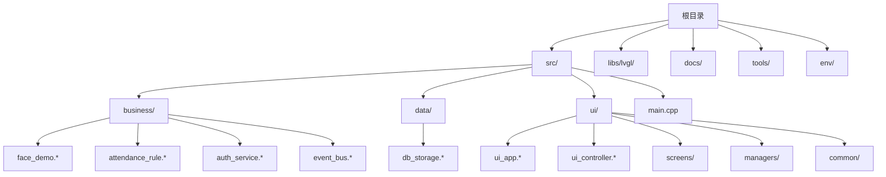
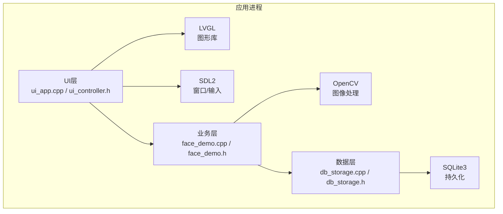
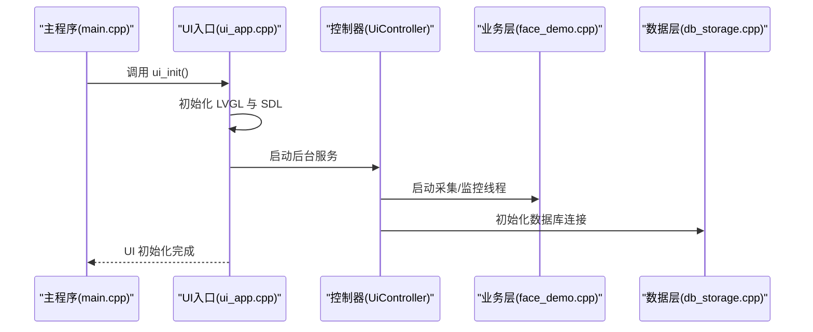
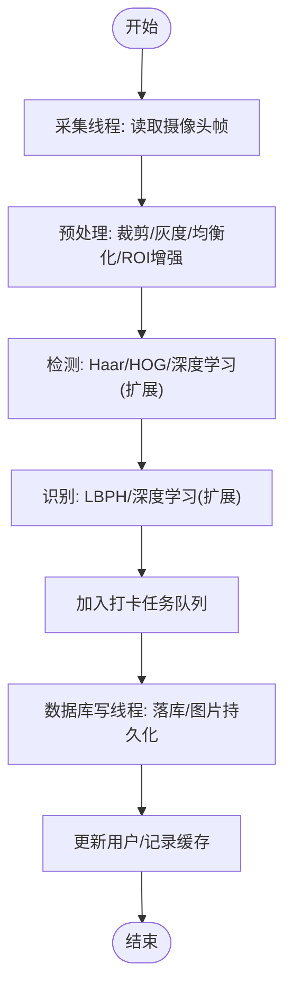
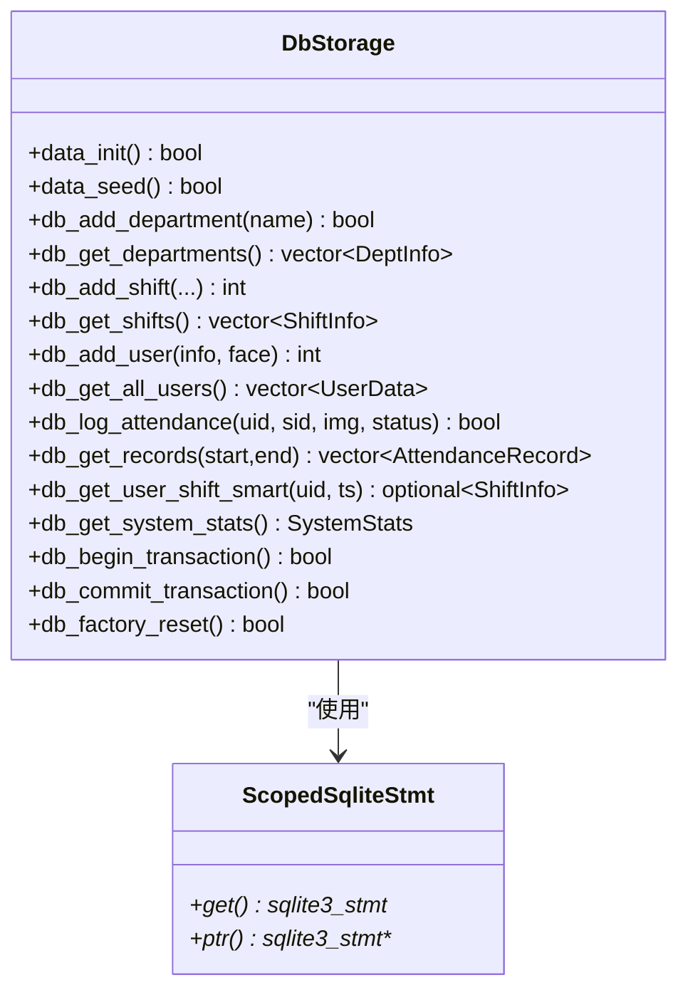
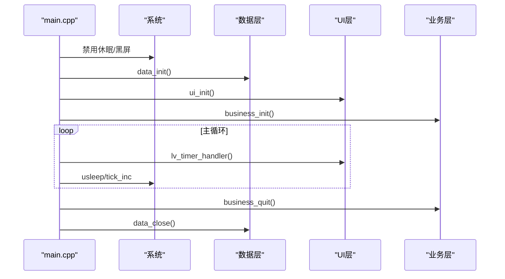
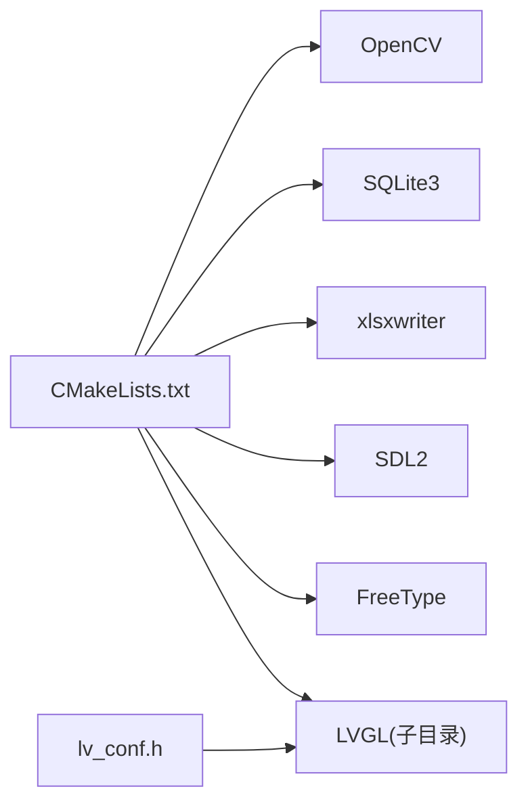

# 开发指南

<cite>
**本文引用的文件**
- [CMakeLists.txt](file://CMakeLists.txt)
- [main.cpp](file://src/main.cpp)
- [lv_conf.h](file://lv_conf.h)
- [env.sh](file://env/env.sh)
- [face_demo.h](file://src/business/face_demo.h)
- [face_demo.cpp](file://src/business/face_demo.cpp)
- [db_storage.h](file://src/data/db_storage.h)
- [db_storage.cpp](file://src/data/db_storage.cpp)
- [ui_app.h](file://src/ui/ui_app.h)
- [ui_app.cpp](file://src/ui/ui_app.cpp)
- [ui_controller.h](file://src/ui/ui_controller.h)
- [stress_test.sh](file://tools/stress_test.sh)
- [SmartAttendance框架结构.txt](file://docs/SmartAttendance框架结构.txt)
- [install-prerequisites.sh](file://libs/lvgl/scripts/install-prerequisites.sh)
</cite>

## 目录
1. [简介](#简介)
2. [项目结构](#项目结构)
3. [核心组件](#核心组件)
4. [架构总览](#架构总览)
5. [详细组件分析](#详细组件分析)
6. [依赖关系分析](#依赖关系分析)
7. [性能考量](#性能考量)
8. [故障排查指南](#故障排查指南)
9. [结论](#结论)
10. [附录](#附录)

## 简介
本开发指南面向SmartAttendance项目的开发者，提供从环境搭建、代码规范、测试策略、开发流程、调试与性能分析到扩展与集成的全流程说明。项目采用C/C++混合开发，结合LVGL图形库、OpenCV计算机视觉、SQLite数据库与Excel报表导出能力，形成“UI层-业务层-数据层”的清晰分层架构。

## 项目结构
项目采用模块化分层组织：
- 根目录构建脚本与配置：CMakeLists.txt、lv_conf.h、env/env.sh
- 源代码分层：src/business（业务）、src/data（数据）、src/ui（界面）、src/main.cpp（入口）
- 文档与工具：docs/、tools/、libs/lvgl/scripts/（第三方库与脚本）

**图表来源**
- [SmartAttendance框架结构.txt](file://docs/SmartAttendance框架结构.txt)
- [CMakeLists.txt](file://CMakeLists.txt)

**章节来源**
- [SmartAttendance框架结构.txt](file://docs/SmartAttendance框架结构.txt)
- [CMakeLists.txt](file://CMakeLists.txt)

## 核心组件
- UI层（LVGL + SDL2）：负责图形渲染、输入事件与页面管理，入口初始化在ui_app.cpp中完成。
- 业务层（OpenCV + SQLite）：人脸识别、考勤规则、事件总线与报表生成，核心接口在face_demo.h中定义。
- 数据层（SQLite3）：提供DAO接口与事务封装，支持高性能WAL模式与并发读写。
- 主程序入口：负责系统初始化顺序、信号处理与主循环调度。

**章节来源**
- [ui_app.cpp](file://src/ui/ui_app.cpp)
- [face_demo.h](file://src/business/face_demo.h)
- [db_storage.h](file://src/data/db_storage.h)
- [main.cpp](file://src/main.cpp)

## 架构总览
系统采用“UI驱动业务，业务驱动数据”的主循环模式。UI层通过UiController桥接到业务层，业务层通过db_storage访问数据库，OpenCV提供图像处理能力。

**图表来源**
- [ui_app.cpp](file://src/ui/ui_app.cpp)
- [ui_controller.h](file://src/ui/ui_controller.h)
- [face_demo.cpp](file://src/business/face_demo.cpp)
- [face_demo.h](file://src/business/face_demo.h)
- [db_storage.cpp](file://src/data/db_storage.cpp)
- [db_storage.h](file://src/data/db_storage.h)

## 详细组件分析

### UI层（ui_app.cpp / ui_controller.h）
- 初始化流程：LVGL与SDL窗口创建、输入设备绑定、样式与管理器初始化、加载主页。
- 事件绑定：键盘输入绑定到全局Keypad Group，确保导航与交互一致性。
- 后台服务：UiController启动监控与摄像头采集线程，提供帧缓存与线程安全访问。

**图表来源**
- [ui_app.cpp](file://src/ui/ui_app.cpp)
- [ui_controller.h](file://src/ui/ui_controller.h)
- [main.cpp](file://src/main.cpp)

**章节来源**
- [ui_app.cpp](file://src/ui/ui_app.cpp)
- [ui_controller.h](file://src/ui/ui_controller.h)

### 业务层（face_demo.cpp / face_demo.h）
- 核心职责：摄像头采集、人脸检测与识别、预处理配置、打卡任务队列与数据库写入线程、用户与记录缓存。
- 预处理管线：裁剪、灰度化、直方图均衡化（全局/CLAHE）、ROI增强。
- 线程模型：采集线程共享最新帧，识别线程消费队列，数据库写线程异步落库，互斥与条件变量保证线程安全。

**图表来源**
- [face_demo.cpp](file://src/business/face_demo.cpp)
- [face_demo.h](file://src/business/face_demo.h)

**章节来源**
- [face_demo.cpp](file://src/business/face_demo.cpp)
- [face_demo.h](file://src/business/face_demo.h)

### 数据层（db_storage.cpp / db_storage.h）
- 设计要点：RAII封装sqlite3_stmt、读写锁共享/独占分离、WAL模式提升并发、预编译语句复用、BLOB压缩存储（JPG）。
- 接口范围：部门/班次/用户/考勤/规则/报表辅助查询，支持批量导入与清理。
- 线程安全：共享锁允许多读，写锁独占，避免竞态。

**图表来源**
- [db_storage.cpp](file://src/data/db_storage.cpp)
- [db_storage.h](file://src/data/db_storage.h)

**章节来源**
- [db_storage.cpp](file://src/data/db_storage.cpp)
- [db_storage.h](file://src/data/db_storage.h)

### 主程序入口（main.cpp）
- 初始化顺序：禁用系统休眠、框架依赖自检、数据层初始化、UI初始化、业务层初始化。
- 主循环：驱动LVGL心跳、tick增量、限幅sleep，优雅退出与资源回收。

**图表来源**
- [main.cpp](file://src/main.cpp)

**章节来源**
- [main.cpp](file://src/main.cpp)

## 依赖关系分析
- 构建与依赖：CMakeLists.txt统一管理OpenCV、SQLite3、xslxwriter、SDL2、FreeType与LVGL子目录；导出compile_commands.json便于IDE索引。
- 运行时依赖：WSL2/PC环境下通过SDL2仿真显示与输入；摄像头设备占用需清理，避免黑屏。
- LVGL配置：lv_conf.h集中配置颜色深度、渲染器、字体、日志与断言等。

**图表来源**
- [CMakeLists.txt](file://CMakeLists.txt)
- [lv_conf.h](file://lv_conf.h)

**章节来源**
- [CMakeLists.txt](file://CMakeLists.txt)
- [lv_conf.h](file://lv_conf.h)

## 性能考量
- 数据层性能：WAL模式、NORMAL同步、内存临时存储、外键开启；预编译语句与读写锁分离。
- UI渲染：默认刷新周期、绘制线程栈大小与优先级、软件渲染复杂度开关。
- 业务处理：队列与线程池、帧缓存与互斥、预处理参数（尺寸、均衡化、ROI增强）对延迟的影响。
- 工具链：CMake导出compile_commands.json，提升IDE索引效率；一键构建与运行脚本。

**章节来源**
- [db_storage.cpp](file://src/data/db_storage.cpp)
- [lv_conf.h](file://lv_conf.h)
- [CMakeLists.txt](file://CMakeLists.txt)
- [env.sh](file://env/env.sh)

## 故障排查指南
- 黑屏/摄像头占用：运行前清理UDP端口与/dev/video0占用，必要时杀僵尸进程。
- 依赖缺失：使用install-prerequisites.sh安装LVGL开发前置；确认OpenCV4头文件路径/usr/include/opencv4。
- 构建失败：检查CMake输出的依赖路径与版本；确保lv_conf.h路径正确传递至LVGL目标。
- 压力测试：使用stress_test.sh监控RSS与PMEM，定位内存泄漏或异常抖动。
- 日志与断言：根据lv_conf.h中日志与断言配置，启用详细追踪或快速失败。

**章节来源**
- [env.sh](file://env/env.sh)
- [install-prerequisites.sh](file://libs/lvgl/scripts/install-prerequisites.sh)
- [stress_test.sh](file://tools/stress_test.sh)
- [lv_conf.h](file://lv_conf.h)

## 结论
SmartAttendance采用清晰的三层架构与模块化设计，结合LVGL与OpenCV实现高可用的桌面仿真与人脸识别考勤功能。通过CMake统一构建、SQLite高性能持久化与严格的线程安全设计，项目具备良好的可维护性与扩展性。建议在后续迭代中完善单元测试、集成测试与性能基准，并持续优化UI渲染与识别算法的实时性。

## 附录

### 开发环境搭建
- 前置条件
  - Linux/WSL2环境，安装SDL2、FreeType、OpenCV4、SQLite3、xlsxwriter。
  - 使用install-prerequisites.sh自动化安装依赖。
- 构建与运行
  - 使用env.sh提供的m/make一键构建，r/run一键运行；支持清理与回到根目录。
  - CMake导出compile_commands.json，VS Code等编辑器可自动识别头文件路径。
- IDE配置建议
  - 启用Clang-Tidy/Cppcheck（仓库提供脚本），统一代码格式（仓库提供code-format.py）。
  - 配置调试器（GDB/LLDB）与断点策略，关注业务线程与数据库事务边界。

**章节来源**
- [install-prerequisites.sh](file://libs/lvgl/scripts/install-prerequisites.sh)
- [env.sh](file://env/env.sh)
- [CMakeLists.txt](file://CMakeLists.txt)

### 代码规范与注释
- 命名约定
  - 头文件保护：DB_STORAGE_H、FACE_DEMO_H等。
  - 结构体与枚举：首字母大写（UserData、ShiftInfo、BellSchedule）。
  - 函数与变量：小驼峰（如data_init、business_init），全局变量前缀g_（如g_is_running）。
- 注释风格
  - 文件头注释：简述模块职责与版本。
  - 接口注释：@brief/@details/@param/@return，保持一致性。
  - 重要分支与边界：补充注释说明（如线程安全、预处理参数）。
- 格式化
  - 使用仓库提供的code-format.py与pre-commit钩子，统一缩进、空行与括号风格。

**章节来源**
- [db_storage.h](file://src/data/db_storage.h)
- [face_demo.h](file://src/business/face_demo.h)
- [ui_controller.h](file://src/ui/ui_controller.h)

### 测试策略
- 单元测试
  - 数据层：针对db_storage的DAO接口进行单元测试，覆盖增删改查、事务与异常路径。
  - 业务层：对预处理函数、识别流程与队列处理进行隔离测试。
- 集成测试
  - UI与业务：模拟摄像头帧与识别结果，验证UI列表与事件触发。
  - 数据与UI：验证报表导出、系统统计与后台服务稳定性。
- 性能测试
  - 使用stress_test.sh进行长时间运行监控；结合OpenCV与SQLite性能参数调优。
- 自动化
  - CMake导出compile_commands.json，配合静态分析工具与CI流水线。

**章节来源**
- [db_storage.h](file://src/data/db_storage.h)
- [face_demo.h](file://src/business/face_demo.h)
- [stress_test.sh](file://tools/stress_test.sh)

### 开发工作流程与版本控制
- 分支策略
  - 主干发布（release），特性分支（feature/*）、修复分支（fix/*）、热修复（hotfix/*）。
- 提交规范
  - 标题：类型(作用域): 概述；正文：动机、变更点、影响范围。
  - 示例：feat(data): 增加批量导入接口；fix(ui): 修复键盘绑定失效。
- 代码审查
  - 至少一名审查者；关注线程安全、异常路径、性能回归与文档一致性。
- 版本与发布
  - 使用update_version.py与CHANGELOG生成脚本，确保版本号与变更记录同步。

**章节来源**
- [CMakeLists.txt](file://CMakeLists.txt)

### 调试技巧与性能分析
- 调试
  - 启用LVGL日志与断言（lv_conf.h），在关键路径打桩（如业务线程、数据库事务）。
  - 使用gdb/LLDB附加进程，观察线程堆栈与锁竞争。
- 性能分析
  - 使用perf/valgrind/AddressSanitizer定位CPU热点与内存问题。
  - 结合stress_test.sh与系统监控（RSS/PMEM/IO）评估稳定性。
- 常见问题
  - 摄像头占用导致黑屏：运行前清理UDP与/dev/video0；确保无残留进程。
  - LVGL黑屏：检查SDL窗口创建与lv_conf.h中SDL驱动启用。

**章节来源**
- [lv_conf.h](file://lv_conf.h)
- [env.sh](file://env/env.sh)
- [stress_test.sh](file://tools/stress_test.sh)

### 扩展开发与第三方集成
- 插件机制
  - 业务层通过事件总线（event_bus）与UiController桥接，新增功能以模块形式接入。
- 第三方集成
  - OpenCV：扩展识别算法（深度学习模型）、图像增强与多模态融合。
  - SQLite：扩展规则表与报表视图，支持更多统计维度。
  - LVGL：按需启用硬件加速与矢量渲染，优化UI性能。
- 配置与适配
  - 通过lv_conf.h与CMakeLists.txt集中管理第三方库与编译选项，确保跨平台一致性。

**章节来源**
- [face_demo.h](file://src/business/face_demo.h)
- [db_storage.h](file://src/data/db_storage.h)
- [lv_conf.h](file://lv_conf.h)
- [CMakeLists.txt](file://CMakeLists.txt)