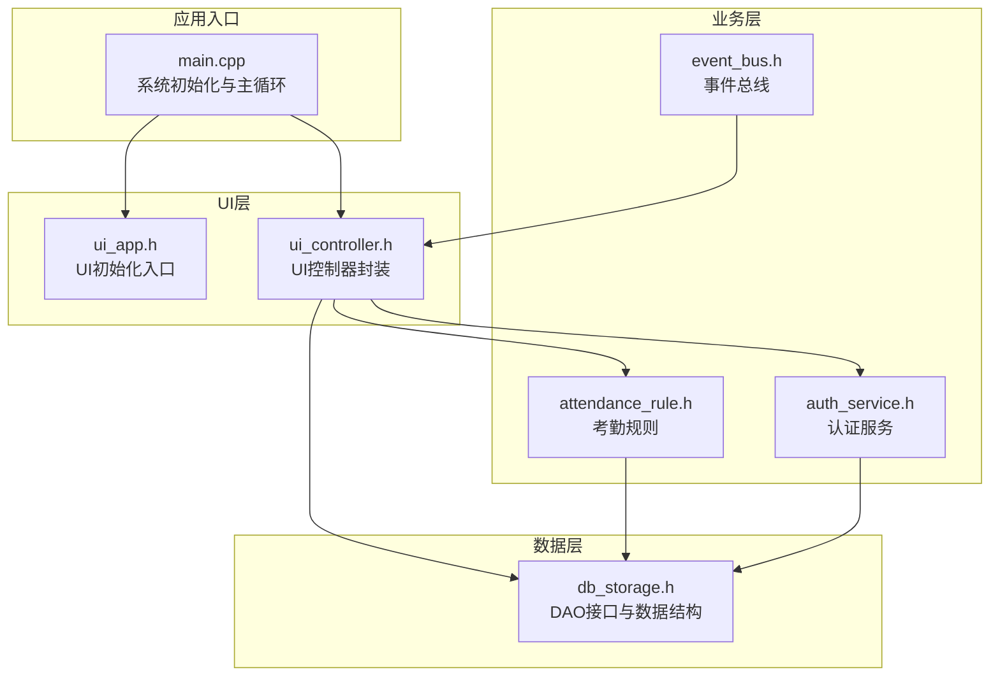
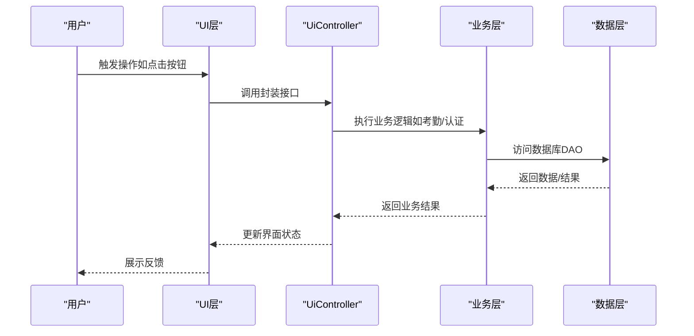
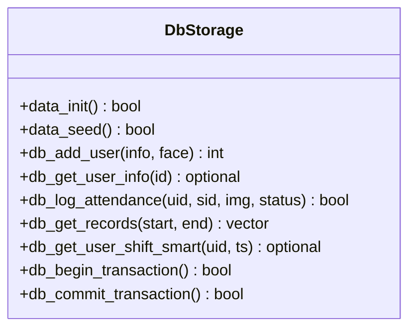
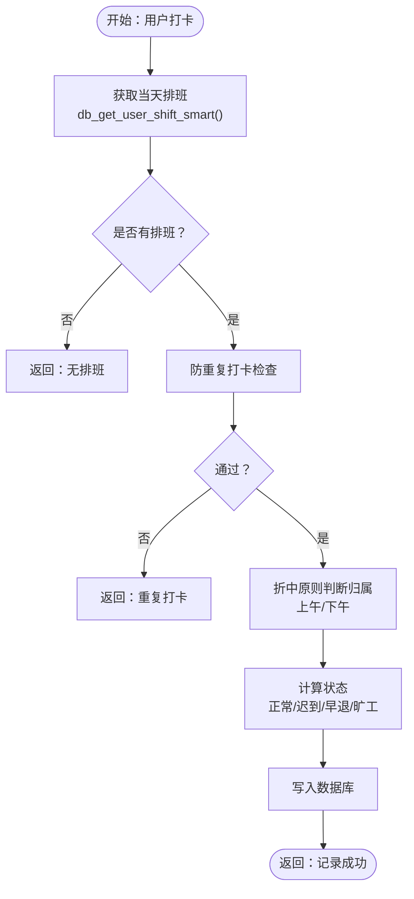
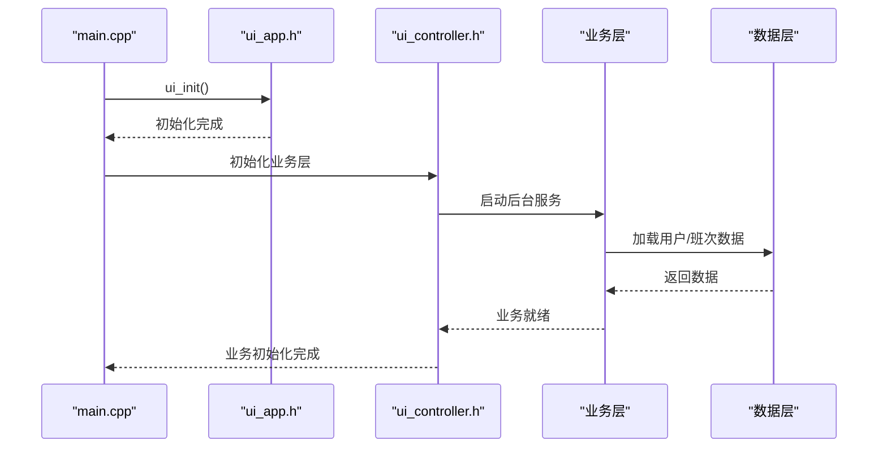
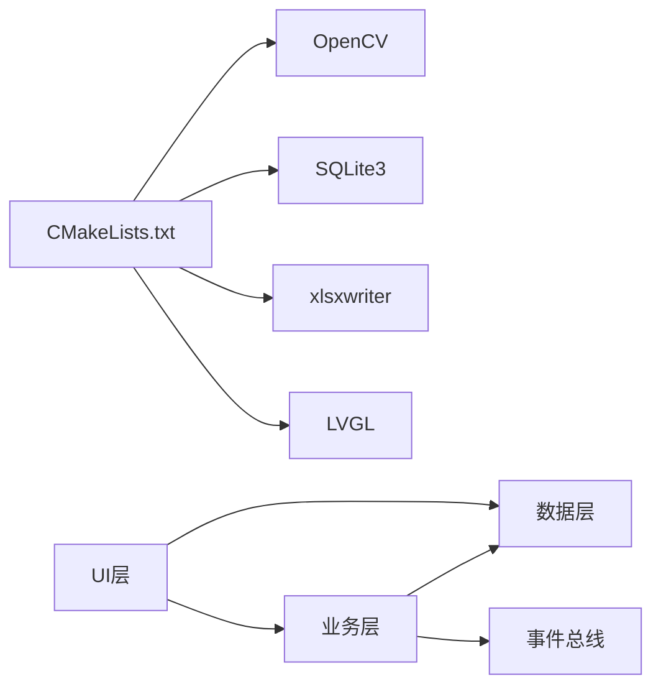

# 开发流程与工作流

<cite>
**本文引用的文件**   
- [CMakeLists.txt](file://CMakeLists.txt)
- [main.cpp](file://src/main.cpp)
- [SmartAttendance框架结构.txt](file://docs/SmartAttendance框架结构.txt)
- [README.md](file://libs/lvgl/README.md)
- [db_storage.h](file://src/data/db_storage.h)
- [attendance_rule.h](file://src/business/attendance_rule.h)
- [auth_service.h](file://src/business/auth_service.h)
- [event_bus.h](file://src/business/event_bus.h)
- [ui_app.h](file://src/ui/ui_app.h)
- [ui_controller.h](file://src/ui/ui_controller.h)
- [stress_test.sh](file://tools/stress_test.sh)
</cite>

## 目录
1. [简介](#简介)
2. [项目结构](#项目结构)
3. [核心组件](#核心组件)
4. [架构总览](#架构总览)
5. [详细组件分析](#详细组件分析)
6. [依赖关系分析](#依赖关系分析)
7. [性能考虑](#性能考虑)
8. [故障排查指南](#故障排查指南)
9. [结论](#结论)
10. [附录](#附录)

## 简介
本文件面向智能考勤系统的开发团队，提供从需求分析到功能上线的完整开发流程说明，涵盖需求收集、技术方案设计、原型开发、详细设计、编码实现、单元测试、集成测试、代码审查、部署上线等阶段。同时，结合仓库现有配置与代码，给出Git工作流（分支策略、提交规范、合并请求流程）、持续集成流程（自动化构建、测试执行、代码质量检查）、开发任务分解方法（用户故事拆分、技术债务管理、重构时机选择），并提供开发模板与检查清单，帮助团队规范化协作与高质量交付。

## 项目结构
项目采用分层架构与模块化组织，核心分为三层：
- 数据层（Data Layer）：负责数据库访问与持久化，提供DAO接口与数据结构定义。
- 业务层（Business Layer）：封装业务规则与服务，如考勤规则、认证服务、事件总线等。
- UI层（UI Layer）：基于LVGL图形库构建界面，包含通用组件、页面与控制器。

构建系统采用CMake，集成OpenCV、SQLite3、xlsxwriter与LVGL等依赖；顶层CMakeLists集中管理编译选项、依赖查找与目标链接。

**图表来源**
- [main.cpp:187-246](file://src/main.cpp#L187-L246)
- [ui_app.h:8-12](file://src/ui/ui_app.h#L8-L12)
- [ui_controller.h:21-108](file://src/ui/ui_controller.h#L21-L108)
- [attendance_rule.h:43-89](file://src/business/attendance_rule.h#L43-L89)
- [auth_service.h:23-44](file://src/business/auth_service.h#L23-L44)
- [event_bus.h:23-41](file://src/business/event_bus.h#L23-L41)
- [db_storage.h:214-683](file://src/data/db_storage.h#L214-L683)

**章节来源**
- [CMakeLists.txt:1-155](file://CMakeLists.txt#L1-L155)
- [SmartAttendance框架结构.txt:1-79](file://docs/SmartAttendance框架结构.txt#L1-L79)

## 核心组件
- 数据层（Data Layer）
  - 职责：提供部门、班次、用户、考勤记录等的增删改查接口，封装SQLite访问与事务处理。
  - 关键接口：初始化、播种、用户管理、排班管理、记录查询、系统配置等。
  - 数据结构：DeptInfo、ShiftInfo、UserData、AttendanceRecord、RuleConfig等。
- 业务层（Business Layer）
  - 职责：封装考勤规则、认证服务、事件总线，协调UI与数据层交互。
  - 关键类：AttendanceRule、AuthService、EventBus。
- UI层（UI Layer）
  - 职责：基于LVGL渲染界面，提供通用组件、页面与控制器，封装与业务/数据层的调用。
  - 关键接口：ui_init、UiController单例、摄像头帧缓存与导出报表等。

**章节来源**
- [db_storage.h:214-683](file://src/data/db_storage.h#L214-L683)
- [attendance_rule.h:43-89](file://src/business/attendance_rule.h#L43-L89)
- [auth_service.h:23-44](file://src/business/auth_service.h#L23-L44)
- [event_bus.h:23-41](file://src/business/event_bus.h#L23-L41)
- [ui_controller.h:21-108](file://src/ui/ui_controller.h#L21-L108)

## 架构总览
系统采用“UI层-业务层-数据层”的分层解耦设计，UI通过控制器与业务层交互，业务层通过DAO访问数据层。事件总线用于组件间异步通信，降低耦合度。主循环驱动LVGL渲染与定时器，确保界面流畅与系统事件及时响应。

**图表来源**
- [ui_controller.h:21-108](file://src/ui/ui_controller.h#L21-L108)
- [attendance_rule.h:43-89](file://src/business/attendance_rule.h#L43-L89)
- [auth_service.h:23-44](file://src/business/auth_service.h#L23-L44)
- [db_storage.h:214-683](file://src/data/db_storage.h#L214-L683)

## 详细组件分析

### 数据层（DAO与数据结构）
- 设计要点
  - DAO模式：将数据库操作抽象为清晰的接口，便于测试与替换。
  - 数据结构标准化：统一使用结构体承载实体信息，减少歧义。
  - 事务支持：批量导入/同步场景使用事务提升性能与一致性。
- 关键流程
  - 初始化：创建表结构、种子数据（播种）。
  - 用户管理：注册、更新、删除、查询。
  - 考勤记录：保存抓拍图、记录考勤、查询统计。
  - 排班管理：部门周排班、个人特殊排班、智能获取当天班次。
- 性能与可靠性
  - 批量查询避免N+1问题，报表导出使用JOIN一次性拉取。
  - 图像清理与事务控制保障存储空间与一致性。

**图表来源**
- [db_storage.h:214-683](file://src/data/db_storage.h#L214-L683)

**章节来源**
- [db_storage.h:214-683](file://src/data/db_storage.h#L214-L683)

### 业务层（考勤规则与认证）
- 考勤规则（AttendanceRule）
  - 功能：确定班次归属、计算打卡状态（正常/迟到/早退/旷工）、防重复打卡、写库。
  - 流程：优先级逻辑（个人特殊排班 > 部门排班 > 默认班次），节点K（周末是否上班）前置判断。
- 认证服务（AuthService）
  - 功能：密码与指纹1:1验证，返回标准化结果枚举。
- 事件总线（EventBus）
  - 功能：线程安全的发布/订阅机制，支持时间更新、摄像头帧就绪等事件。

**图表来源**
- [attendance_rule.h:43-89](file://src/business/attendance_rule.h#L43-L89)
- [db_storage.h:520-530](file://src/data/db_storage.h#L520-L530)

**章节来源**
- [attendance_rule.h:43-89](file://src/business/attendance_rule.h#L43-L89)
- [auth_service.h:23-44](file://src/business/auth_service.h#L23-L44)
- [event_bus.h:23-41](file://src/business/event_bus.h#L23-L41)

### UI层（入口与控制器）
- UI入口（ui_app）
  - 职责：初始化LVGL、输入设备、管理器与主页加载。
- UI控制器（UiController）
  - 职责：封装业务调用、提供单例访问、后台线程管理（监控/捕获）、摄像头帧缓存、报表导出等。
- 与业务/数据层交互
  - 通过UiController统一调度，避免UI直接依赖业务细节。

**图表来源**
- [main.cpp:213-225](file://src/main.cpp#L213-L225)
- [ui_app.h:8-12](file://src/ui/ui_app.h#L8-L12)
- [ui_controller.h:67-108](file://src/ui/ui_controller.h#L67-L108)

**章节来源**
- [main.cpp:187-246](file://src/main.cpp#L187-L246)
- [ui_app.h:8-12](file://src/ui/ui_app.h#L8-L12)
- [ui_controller.h:21-108](file://src/ui/ui_controller.h#L21-L108)

## 依赖关系分析
- 构建与运行时依赖
  - CMake：统一管理编译选项、导出编译命令、查找第三方库。
  - 第三方库：OpenCV（图像处理/人脸识别）、SQLite3（本地数据库）、xlsxwriter（Excel报表）、LVGL（图形界面）。
- 代码依赖
  - UI层依赖业务层与数据层接口；业务层依赖数据层DAO；事件总线作为横切关注点贯穿各层。

**图表来源**
- [CMakeLists.txt:18-71](file://CMakeLists.txt#L18-L71)
- [db_storage.h:214-683](file://src/data/db_storage.h#L214-L683)
- [event_bus.h:23-41](file://src/business/event_bus.h#L23-L41)

**章节来源**
- [CMakeLists.txt:18-71](file://CMakeLists.txt#L18-L71)

## 性能考虑
- 图像与数据库
  - 抓拍图保存与定期清理，避免磁盘膨胀；批量导入使用事务提升吞吐。
- UI渲染与事件
  - LVGL主循环限制心跳间隔，避免过快轮询；事件总线线程安全，避免竞态。
- 压力测试
  - 提供压力测试脚本，监控进程存活与内存占用，保障稳定性。

**章节来源**
- [db_storage.h:458-487](file://src/data/db_storage.h#L458-L487)
- [main.cpp:229-238](file://src/main.cpp#L229-L238)
- [stress_test.sh:1-20](file://tools/stress_test.sh#L1-L20)

## 故障排查指南
- 依赖缺失
  - CMake会在找不到db_storage.h时报错，请确认路径与文件存在。
- 数据库初始化失败
  - data_init返回false时，检查权限、磁盘空间与SQL错误日志。
- UI无画面或卡顿
  - 检查LVGL主循环与定时器心跳；确认SDL环境变量与系统休眠设置。
- 压力测试异常
  - 使用stress_test.sh观察RSS与PMEM变化，定位内存泄漏或崩溃点。

**章节来源**
- [CMakeLists.txt:73-78](file://CMakeLists.txt#L73-L78)
- [main.cpp:205-208](file://src/main.cpp#L205-L208)
- [stress_test.sh:8-18](file://tools/stress_test.sh#L8-L18)

## 结论
本项目以清晰的分层架构与模块化设计为基础，结合CMake构建体系与LVGL图形库，实现了从需求到上线的可扩展开发流程。通过标准化的DAO接口、业务规则封装与事件总线，系统具备良好的可维护性与可测试性。建议在后续迭代中完善Git工作流与CI流程，持续优化性能与用户体验。

## 附录

### 开发流程模板与检查清单
- 需求分析
  - 明确功能边界与验收标准；拆分用户故事与非功能性需求。
- 技术方案设计
  - 选择合适的技术栈与架构风格；评估性能与安全性；制定依赖与接口契约。
- 原型开发
  - 快速验证核心流程（如UI骨架、数据DAO、关键业务逻辑）。
- 详细设计
  - 输出接口定义、数据模型、时序图与类图；评审通过后进入编码。
- 编码实现
  - 遵循命名规范与模块职责；保持低耦合高内聚；及时提交与注释。
- 单元测试
  - 针对DAO与业务规则编写测试；覆盖正常/异常路径。
- 集成测试
  - 端到端验证UI-业务-数据链路；回归关键流程。
- 代码审查
  - 关注可读性、健壮性与性能；确保接口一致与文档齐全。
- 部署上线
  - 打包构建产物；验证依赖与运行环境；灰度发布与监控告警。

### Git工作流与分支策略
- 分支策略
  - feature分支：用于新功能开发，完成后合并至develop。
  - develop分支：集成所有特性，进行集成测试与质量把关。
  - release分支：准备发布版本，修复紧急缺陷与文档校对。
- 提交规范
  - 类型：feat/fix/docs/style/refactor/test/chore
  - 格式：type(scope): subject（简短描述）
  - 示例：feat(data): 添加批量导入接口
- 合并请求流程
  - PR需包含需求说明、变更内容与测试结果；至少一名Reviewer批准；通过CI后方可合并。

### 持续集成流程
- 自动化构建
  - CMake配置导出编译命令，确保IDE与编辑器正确索引头文件。
- 测试执行
  - 单元测试与集成测试在CI中执行；压力测试脚本可用于稳定性验证。
- 代码质量检查
  - 使用静态分析与格式化工具（如cppcheck、astyle）；遵循仓库脚本约定。

### 开发任务分解方法
- 用户故事拆分
  - 将复杂功能拆分为可独立验证的小故事；定义验收条件与测试场景。
- 技术债务管理
  - 识别重复代码、紧耦合模块与性能瓶颈；制定偿还计划与优先级。
- 重构时机选择
  - 在新增功能前后、性能优化阶段与发布前窗口进行；确保充分测试与备份。