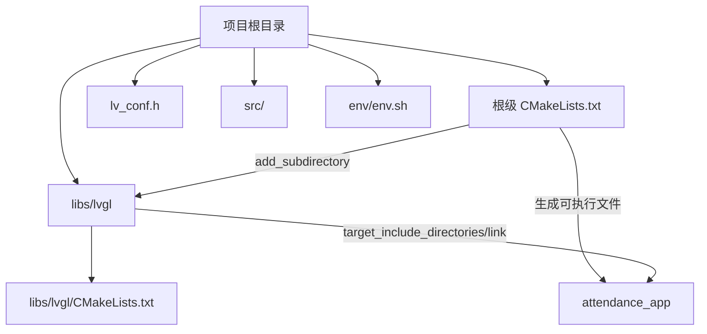
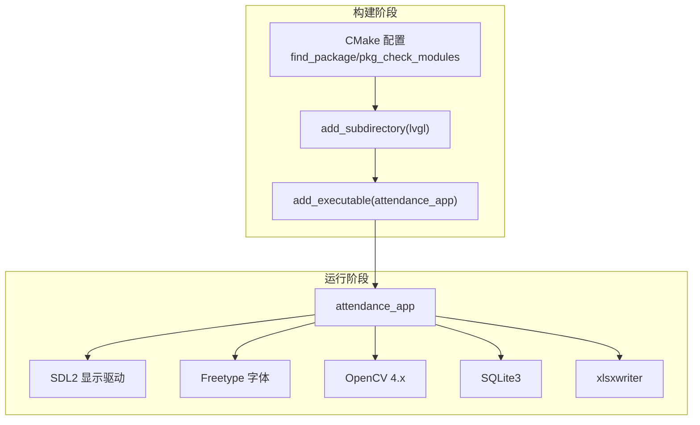
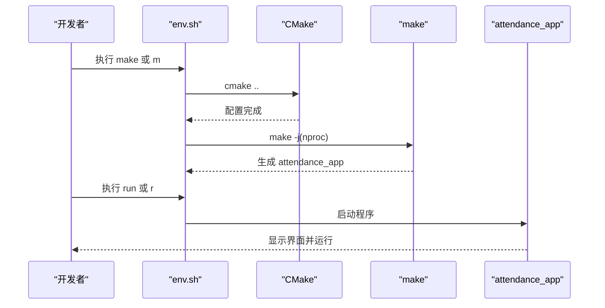
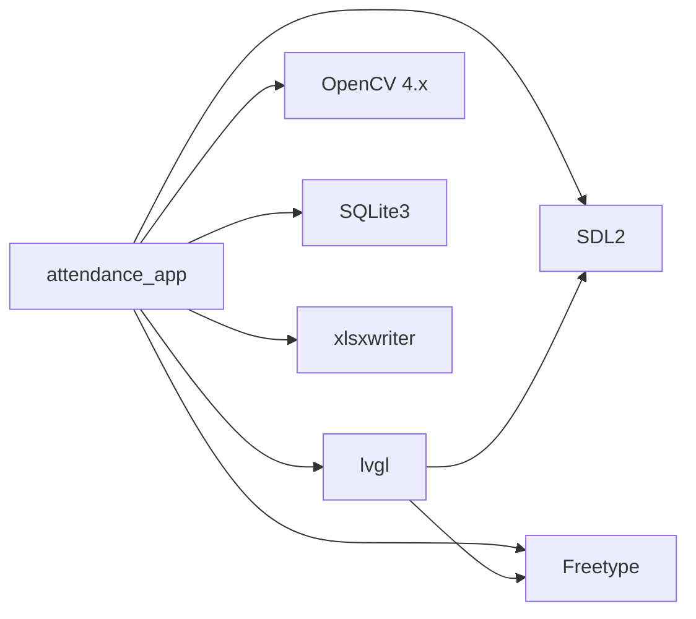

# 开发环境搭建

<cite>
**本文引用的文件**   
- [CMakeLists.txt](file://CMakeLists.txt)
- [env.sh](file://env/env.sh)
- [lv_conf.h](file://lv_conf.h)
- [SmartAttendance框架结构.txt](file://docs/SmartAttendance框架结构.txt)
- [libs/lvgl/CMakeLists.txt](file://libs/lvgl/CMakeLists.txt)
- [libs/lvgl/docs/src/details/integration/pc/sdl.rst](file://libs/lvgl/docs/src/details/integration/pc/sdl.rst)
- [libs/lvgl/docs/src/details/libs/freetype.rst](file://libs/lvgl/docs/src/details/libs/freetype.rst)
</cite>

## 目录
1. [简介](#简介)
2. [项目结构](#项目结构)
3. [核心组件](#核心组件)
4. [架构总览](#架构总览)
5. [详细组件分析](#详细组件分析)
6. [依赖分析](#依赖分析)
7. [性能考虑](#性能考虑)
8. [故障排查指南](#故障排查指南)
9. [结论](#结论)
10. [附录](#附录)

## 简介
本指南面向在 Linux/WSL2 上开发 SmartAttendance 项目的工程师，提供从零搭建开发环境的完整步骤，覆盖操作系统要求、必需与可选软件包安装、CMake 配置、编译器与环境变量、Debug/Release 构建流程，以及常见问题的排查方法。文档同时解释项目对 LVGL、OpenCV、SQLite3、SDL2、Freetype、xlsxwriter 的集成方式，并给出基于 env.sh 的一键构建与运行流程。

## 项目结构
SmartAttendance 采用 CMake 管理多模块工程，核心目录与职责如下：
- 根目录 CMakeLists.txt：统一管理编译选项、依赖查找、目标链接与包含路径。
- libs/lvgl：嵌入式图形库子项目，通过 add_subdirectory 集成；其 CMakeLists 提供桌面端配置。
- lv_conf.h：LVGL 配置文件，决定渲染后端、字体、日志等行为。
- src/：业务层、数据层、UI 层源码按模块组织。
- env/env.sh：提供 make/run/clean 等便捷命令，简化构建与运行。

**图表来源**
- [CMakeLists.txt:112-146](file://CMakeLists.txt#L112-L146)
- [libs/lvgl/CMakeLists.txt:19-27](file://libs/lvgl/CMakeLists.txt#L19-L27)

**章节来源**
- [SmartAttendance框架结构.txt:1-68](file://docs/SmartAttendance框架结构.txt#L1-L68)
- [CMakeLists.txt:83-146](file://CMakeLists.txt#L83-L146)

## 核心组件
- 编译器与标准
  - C++ 标准：C++17（C11 为 C 语言标准）
  - 默认构建类型：Debug（开启调试符号）
  - 导出 compile_commands.json，便于编辑器自动索引头文件
- 依赖库
  - 基础：PkgConfig、Threads
  - UI：SDL2、Freetype（LVGL 依赖）
  - 图像与人脸识别：OpenCV 4（核心、图像处理、视频IO、高GUI、目标检测、人脸检测、图像编解码）
  - 数据库：SQLite3
  - 报表：xlsxwriter（通过 pkg-config 查找）
- LVGL 集成
  - 通过 set(LV_CONF_PATH ...) 和 target_compile_definitions(...) 将配置文件路径注入构建
  - 将 SDL2_INCLUDE_DIRS/Freetype 头文件路径与库链接至 lvgl 目标

**章节来源**
- [CMakeLists.txt:7-13](file://CMakeLists.txt#L7-L13)
- [CMakeLists.txt:24-37](file://CMakeLists.txt#L24-L37)
- [CMakeLists.txt:54-71](file://CMakeLists.txt#L54-L71)
- [lv_conf.h:109-110](file://lv_conf.h#L109-L110)

## 架构总览
下图展示 SmartAttendance 的构建与运行关系：根级 CMake 负责查找依赖并链接；LVGL 作为子项目被集成；最终生成 attendance_app 可执行文件并在桌面环境中通过 SDL2 显示。

**图表来源**
- [CMakeLists.txt:24-37](file://CMakeLists.txt#L24-L37)
- [CMakeLists.txt:112-146](file://CMakeLists.txt#L112-L146)
- [libs/lvgl/CMakeLists.txt:25-27](file://libs/lvgl/CMakeLists.txt#L25-L27)

## 详细组件分析

### 依赖库安装（Ubuntu/Debian/CentOS/RHEL/Arch Linux）
以下为各发行版安装必需与可选依赖的命令示例。请根据实际系统选择对应命令。

- Ubuntu/Debian（示例）
  - 基础工具：cmake、gcc/g++、ninja-build、pkg-config、libsqlite3-dev
  - UI：libsdl2-dev、libfreetype-dev
  - 图像：libopencv-dev（或安装 opencv4 相关包）
  - 报表：libxlsxwriter-dev
  - 线程：libpthread-stubs0-dev（通常随系统提供）

- CentOS/RHEL（示例）
  - 基础工具：cmake、gcc/gcc-c++、ninja-build、pkg-config、sqlite-devel
  - UI：SDL2-devel、freetype-devel
  - 图像：opencv-devel 或 opencv4-devel
  - 报表：libxlsxwriter-devel
  - 线程：pthread-stubs（若缺失）

- Arch Linux（示例）
  - 基础工具：cmake、gcc、ninja、pkgconf、sqlite
  - UI：sdl2、freetype2
  - 图像：opencv（含 opencv_contrib 时需额外组件）
  - 报表：libxlsxwriter
  - 线程：pthread-stubs（若缺失）

- 可选 IDE（任选其一）
  - VS Code：安装 C/C++、CMake Tools、clang-format 扩展
  - CLion：JetBrains 提供的跨平台 C/C++ IDE

提示
- 若系统默认仓库缺少最新版本，请优先使用发行版官方仓库或第三方源（如 Kitware 的 CMake PPA）。
- 对于 OpenCV，若系统仓库版本过旧，建议参考上游文档进行二进制安装或源码编译。

**章节来源**
- [CMakeLists.txt:19-37](file://CMakeLists.txt#L19-L37)
- [libs/lvgl/docs/src/details/integration/pc/sdl.rst:20-48](file://libs/lvgl/docs/src/details/integration/pc/sdl.rst#L20-L48)
- [libs/lvgl/docs/src/details/libs/freetype.rst:30-42](file://libs/lvgl/docs/src/details/libs/freetype.rst#L30-L42)

### CMake 配置与编译器设置
- 版本与标准
  - 最低 CMake 版本：3.16
  - C++ 标准：C++17（C11）
  - 默认构建类型：Debug（便于调试）
- 关键开关
  - 生成 compile_commands.json，提升编辑器索引能力
  - 启用线程库查找（Threads）
- 依赖查找策略
  - PkgConfig：SDL2、xlsxwriter
  - CMake 模块：OpenCV（指定 COMPONENTS）、SQLite3、Freetype
- LVGL 集成
  - 设置 LV_CONF_PATH 并在目标中定义宏，确保 LVGL 使用根目录配置
  - 将 SDL2_INCLUDE_DIRS、Freetype 头文件路径与库链接到 lvgl 目标

**章节来源**
- [CMakeLists.txt:1-13](file://CMakeLists.txt#L1-L13)
- [CMakeLists.txt:19-37](file://CMakeLists.txt#L19-L37)
- [CMakeLists.txt:54-71](file://CMakeLists.txt#L54-L71)

### 编译与运行流程（含 Debug/Release）
- Debug 模式
  - 默认启用，包含调试符号，适合开发与问题定位
- Release 模式
  - 可通过 CMake 预设或手动指定构建类型进行切换
- 一键构建与运行（基于 env.sh）
  - make/m：自动创建 build 目录、执行 cmake ..、并行编译（nproc）
  - run/r：清理占用资源（端口/摄像头），启动 attendance_app
  - clean/cl：删除 build 目录

**图表来源**
- [env/env.sh:48-99](file://env/env.sh#L48-L99)

**章节来源**
- [env/env.sh:16-99](file://env/env.sh#L16-L99)
- [CMakeLists.txt:112-146](file://CMakeLists.txt#L112-L146)

### LVGL 配置要点（lv_conf.h）
- 操作系统与渲染
  - 默认 OS：无（LV_OS_NONE），渲染使用软件光栅（LV_USE_DRAW_SW）
  - 可通过宏启用 SDL 支持（见 LVGL 文档），但本项目通过 SDL2 库与 Freetype 集成
- 字体与文本
  - 默认字体与字符编码可按需调整
- 日志与断言
  - 日志模块默认关闭，可根据需要开启
- 内存与线程
  - 默认内置内存分配器，绘制线程栈大小与优先级可调

**章节来源**
- [lv_conf.h:109-110](file://lv_conf.h#L109-L110)
- [lv_conf.h:168-230](file://lv_conf.h#L168-L230)
- [lv_conf.h:649-651](file://lv_conf.h#L649-L651)

## 依赖分析
SmartAttendance 的依赖关系由根级 CMake 控制，LVGL 作为子项目被引入，最终链接到 attendance_app。OpenCV、SQLite3、SDL2、Freetype、xlsxwriter 通过 find_package/pkg_check_modules 查找并链接。

**图表来源**
- [CMakeLists.txt:139-146](file://CMakeLists.txt#L139-L146)
- [libs/lvgl/CMakeLists.txt:25-27](file://libs/lvgl/CMakeLists.txt#L25-L27)

**章节来源**
- [CMakeLists.txt:24-37](file://CMakeLists.txt#L24-L37)
- [CMakeLists.txt:139-146](file://CMakeLists.txt#L139-L146)

## 性能考虑
- Debug 模式便于调试，但性能开销较大；Release 模式应启用优化标志以获得最佳性能。
- 并行编译：env.sh 使用 nproc 控制并发度，建议在多核环境下提升编译速度。
- LVGL 渲染：软件光栅（SW）默认开启，若需更高性能可结合硬件加速方案（如 VG-Lite/OpenGLES），但需相应配置与驱动支持。
- OpenCV：优先使用系统已优化的二进制包，避免重复编译导致的性能回退。

## 故障排查指南
- 依赖未找到
  - 症状：CMake 报错找不到 OpenCV/SQLite3/SDL2/xlsxwriter
  - 处理：确认已安装对应开发包；必要时使用 pkg-config 或 CMake 的 find_package 参数指定路径
- OpenCV 头文件路径
  - 症状：编译时报错找不到 opencv4 头文件
  - 处理：根级 CMake 已显式包含 /usr/include/opencv4；若非标准路径，请调整 CMake 的 OpenCV_DIR 或头文件路径
- SDL2/Freetype 集成失败
  - 症状：链接阶段缺少 SDL2 或 Freetype 符号
  - 处理：确保已安装 libsdl2-dev 与 freetype 开发包；检查 pkg_check_modules 输出的 INCLUDE_DIRS/LIBRARIES
- xlsxwriter 链接异常
  - 症状：链接时报错找不到 xlsxwriter
  - 处理：安装 libxlsxwriter-dev；确认 pkg-config 能找到 xlsxwriter.pc
- 端口/设备占用导致黑屏或无法启动
  - 症状：运行后黑屏或摄像头无法打开
  - 处理：使用 env.sh 的 run/r 命令，它会尝试释放 5004/udp 与 /dev/video0 占用，并清理残留进程
- 构建目录污染
  - 症状：修改 CMake 配置后构建异常
  - 处理：执行 clean/cl 或 make-distclean 清理 build 目录后重新配置

**章节来源**
- [CMakeLists.txt:132-136](file://CMakeLists.txt#L132-L136)
- [CMakeLists.txt:32-37](file://CMakeLists.txt#L32-L37)
- [env/env.sh:68-99](file://env/env.sh#L68-L99)

## 结论
通过本指南，您可以在 Linux/WSL2 上快速搭建 SmartAttendance 的开发环境。建议优先使用发行版官方仓库安装依赖，确保 CMake 与编译器版本满足要求，并利用 env.sh 的一键构建与运行流程提高效率。遇到依赖或运行问题时，可依据“故障排查指南”逐项定位并解决。

## 附录
- 快速检查清单
  - 已安装 CMake 3.16+、GCC/G++（C++17 支持）
  - 已安装 SDL2、Freetype、OpenCV 4.x、SQLite3、xlsxwriter 开发包
  - 已准备 lv_conf.h 并放置于项目根目录
  - 使用 env.sh 的 make/run 流程验证构建与运行
- 参考文档
  - LVGL SDL 集成与 FreeType 使用说明

**章节来源**
- [libs/lvgl/docs/src/details/integration/pc/sdl.rst:20-48](file://libs/lvgl/docs/src/details/integration/pc/sdl.rst#L20-L48)
- [libs/lvgl/docs/src/details/libs/freetype.rst:30-42](file://libs/lvgl/docs/src/details/libs/freetype.rst#L30-L42)