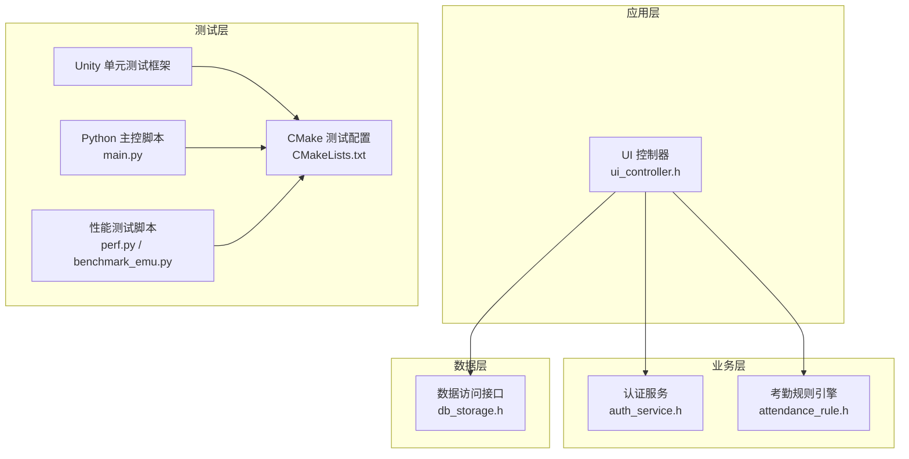
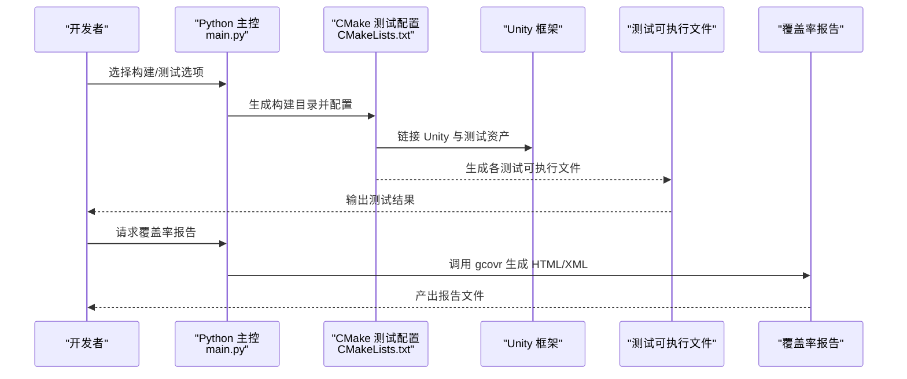
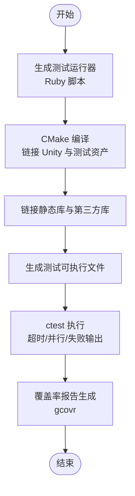
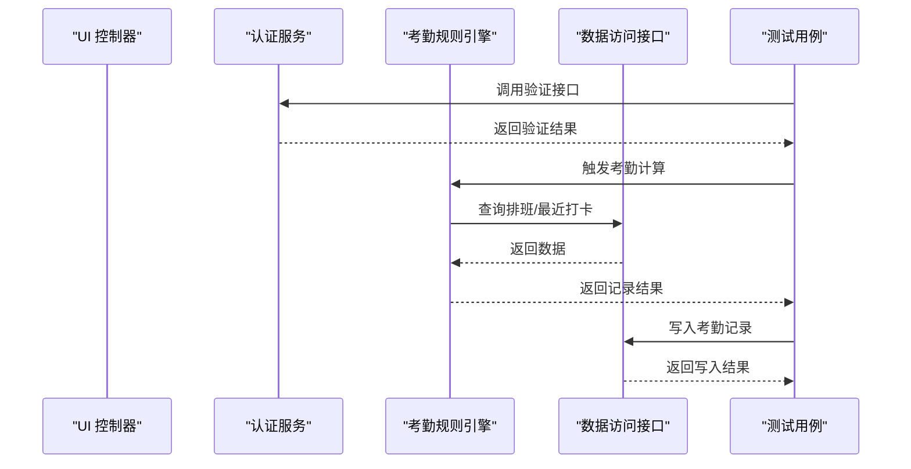
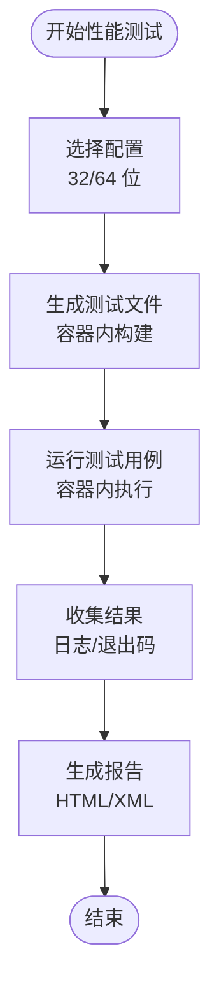
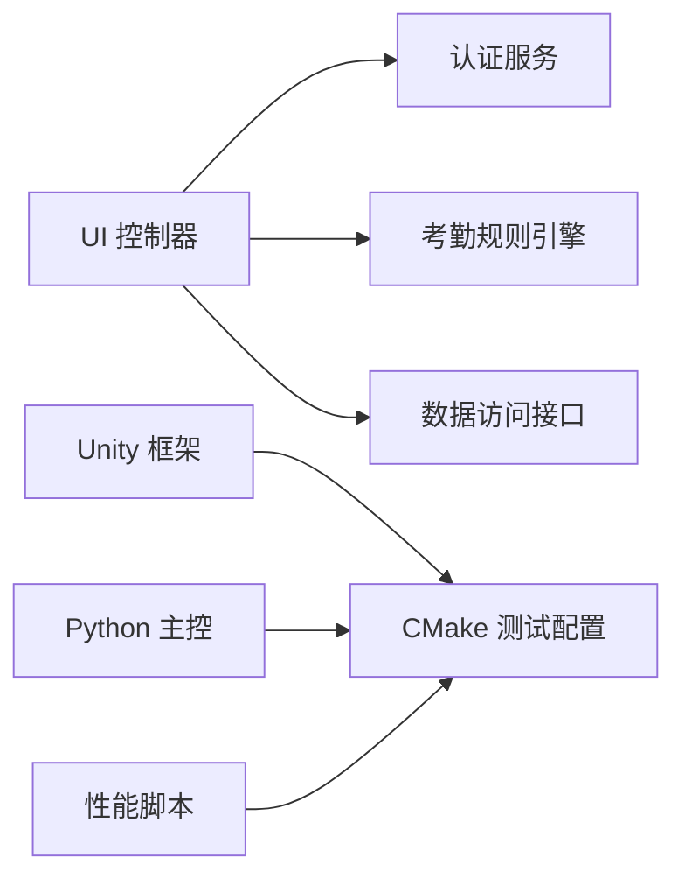

# 测试策略与实施

<cite>
**本文引用的文件**
- [libs/lvgl/tests/CMakeLists.txt](file://libs/lvgl/tests/CMakeLists.txt)
- [libs/lvgl/tests/config.yml](file://libs/lvgl/tests/config.yml)
- [libs/lvgl/tests/main.py](file://libs/lvgl/tests/main.py)
- [libs/lvgl/tests/perf.py](file://libs/lvgl/tests/perf.py)
- [libs/lvgl/tests/benchmark_emu.py](file://libs/lvgl/tests/benchmark_emu.py)
- [src/business/attendance_rule.h](file://src/business/attendance_rule.h)
- [src/business/auth_service.h](file://src/business/auth_service.h)
- [src/data/db_storage.h](file://src/data/db_storage.h)
- [src/ui/ui_controller.h](file://src/ui/ui_controller.h)
</cite>

## 目录
1. [引言](#引言)
2. [项目结构](#项目结构)
3. [核心组件](#核心组件)
4. [架构总览](#架构总览)
5. [详细组件分析](#详细组件分析)
6. [依赖关系分析](#依赖关系分析)
7. [性能考虑](#性能考虑)
8. [故障排查指南](#故障排查指南)
9. [结论](#结论)
10. [附录](#附录)

## 引言
本文件面向 SmartAttendance 项目，建立一套完整的测试策略与实施方法，覆盖单元测试（基于 Unity）、集成测试（UI 组件、业务逻辑、数据库操作）、性能测试（压力测试、基准测试、内存泄漏检测）、测试数据准备与模拟对象、测试环境隔离、持续集成与自动化执行、测试报告与覆盖率分析，以及测试维护最佳实践。文档同时给出与现有仓库测试基础设施的映射关系，确保策略可落地。

## 项目结构
SmartAttendance 采用分层架构：UI 层（UI 控制器）通过业务层（认证、考勤规则）与数据层（SQLite/ORM 封装）交互。测试体系主要依托 LVGL 测试子树中的 Unity 框架与 Python 构建脚本，结合 CMake 选项与编译器检测，形成可扩展的测试矩阵。

图表来源
- [src/ui/ui_controller.h:21-104](file://src/ui/ui_controller.h#L21-L104)
- [src/business/auth_service.h:23-44](file://src/business/auth_service.h#L23-L44)
- [src/business/attendance_rule.h:43-89](file://src/business/attendance_rule.h#L43-L89)
- [src/data/db_storage.h:195-596](file://src/data/db_storage.h#L195-L596)
- [libs/lvgl/tests/CMakeLists.txt:1-543](file://libs/lvgl/tests/CMakeLists.txt#L1-L543)
- [libs/lvgl/tests/main.py:1-313](file://libs/lvgl/tests/main.py#L1-L313)
- [libs/lvgl/tests/perf.py:1-595](file://libs/lvgl/tests/perf.py#L1-L595)
- [libs/lvgl/tests/benchmark_emu.py:1-289](file://libs/lvgl/tests/benchmark_emu.py#L1-L289)

章节来源
- [libs/lvgl/tests/CMakeLists.txt:1-543](file://libs/lvgl/tests/CMakeLists.txt#L1-L543)
- [libs/lvgl/tests/main.py:1-313](file://libs/lvgl/tests/main.py#L1-L313)

## 核心组件
- UI 控制器：封装系统状态、用户管理、记录查询、报表导出、摄像头帧缓存等接口，作为 UI 与业务/数据层的桥接。
- 认证服务：提供密码与指纹验证能力，返回标准化结果枚举。
- 考勤规则引擎：实现打卡归属班次、状态计算、重复打卡防抖、跨日与周末规则等核心逻辑。
- 数据访问接口：提供部门、班次、用户、考勤记录、系统配置等 CRUD 与批量操作接口，内置事务与清理机制。

章节来源
- [src/ui/ui_controller.h:21-104](file://src/ui/ui_controller.h#L21-L104)
- [src/business/auth_service.h:23-44](file://src/business/auth_service.h#L23-L44)
- [src/business/attendance_rule.h:43-89](file://src/business/attendance_rule.h#L43-L89)
- [src/data/db_storage.h:195-596](file://src/data/db_storage.h#L195-L596)

## 架构总览
测试体系围绕以下要素展开：
- 单元测试：基于 Unity 的 C 测试套件，通过 Ruby 生成测试运行器，CMake 统一编译与链接。
- 集成测试：覆盖 UI 控制器与业务/数据层交互、数据库读写一致性、跨模块协作。
- 性能测试：在容器化仿真环境中进行基准与压力测试，保证跨平台时间一致性。
- 覆盖率与报告：利用 gcovr 生成 HTML/XML 报告，CI 中可选择保留产物或清理空间。

图表来源
- [libs/lvgl/tests/main.py:107-188](file://libs/lvgl/tests/main.py#L107-L188)
- [libs/lvgl/tests/CMakeLists.txt:477-533](file://libs/lvgl/tests/CMakeLists.txt#L477-L533)
- [libs/lvgl/tests/config.yml:1-6](file://libs/lvgl/tests/config.yml#L1-L6)

## 详细组件分析

### 单元测试框架与配置（Unity）
- 测试生成：Ruby 脚本根据每个测试源文件生成独立的测试运行器，CMake 逐个构建测试可执行文件。
- 编译选项：启用地址消毒、泄漏检测、未定义行为检测与覆盖率标记；针对不同颜色深度与堆策略提供多组构建选项。
- 运行与收集：ctest 驱动执行，支持超时、并行与输出失败详情。
- 初始化与收尾：Unity 配置定义测试套件初始化与去初始化钩子，确保资源一致释放。

图表来源
- [libs/lvgl/tests/CMakeLists.txt:342-533](file://libs/lvgl/tests/CMakeLists.txt#L342-L533)
- [libs/lvgl/tests/config.yml:1-6](file://libs/lvgl/tests/config.yml#L1-L6)
- [libs/lvgl/tests/main.py:163-188](file://libs/lvgl/tests/main.py#L163-L188)

章节来源
- [libs/lvgl/tests/CMakeLists.txt:1-543](file://libs/lvgl/tests/CMakeLists.txt#L1-L543)
- [libs/lvgl/tests/config.yml:1-6](file://libs/lvgl/tests/config.yml#L1-L6)
- [libs/lvgl/tests/main.py:107-188](file://libs/lvgl/tests/main.py#L107-L188)

### 测试用例编写规范与断言指南
- 文件命名与组织：每个测试用例对应一个独立 .c 文件，位于测试源目录，CMake 自动发现并生成可执行文件。
- 测试生命周期：在 Unity 配置中定义套件初始化与去初始化，确保全局状态一致。
- 断言风格：使用 Unity 断言宏进行条件判断与错误报告，便于 ctest 收集失败信息。
- 平台适配：通过 CMake 选项切换颜色深度、堆策略与驱动可用性，确保测试在不同目标上稳定运行。

章节来源
- [libs/lvgl/tests/CMakeLists.txt:342-533](file://libs/lvgl/tests/CMakeLists.txt#L342-L533)
- [libs/lvgl/tests/config.yml:1-6](file://libs/lvgl/tests/config.yml#L1-L6)

### 集成测试方法
- UI 组件测试：通过 UI 控制器封装摄像头帧缓存、用户信息查询、报表导出等接口，配合业务/数据层桩或最小化依赖进行集成验证。
- 业务逻辑测试：针对认证服务与考勤规则引擎的关键分支（密码/指纹匹配、重复打卡、班次归属、跨日与周末规则）设计场景化用例。
- 数据库操作测试：验证数据层 CRUD、事务、批量导入、清理策略与查询一致性；在测试前准备种子数据，测试后清理或回滚。

图表来源
- [src/ui/ui_controller.h:21-104](file://src/ui/ui_controller.h#L21-L104)
- [src/business/auth_service.h:23-44](file://src/business/auth_service.h#L23-L44)
- [src/business/attendance_rule.h:43-89](file://src/business/attendance_rule.h#L43-L89)
- [src/data/db_storage.h:195-596](file://src/data/db_storage.h#L195-L596)

章节来源
- [src/ui/ui_controller.h:21-104](file://src/ui/ui_controller.h#L21-L104)
- [src/business/auth_service.h:23-44](file://src/business/auth_service.h#L23-L44)
- [src/business/attendance_rule.h:43-89](file://src/business/attendance_rule.h#L43-L89)
- [src/data/db_storage.h:195-596](file://src/data/db_storage.h#L195-L596)

### 性能测试方案
- 基准测试：使用容器镜像在仿真环境中运行演示基准，生成一致的时间指标；支持 32/64 位配置。
- 压力测试：通过性能测试脚本在容器内批量运行测试用例，支持拉取镜像、调试端口映射与自动清理。
- 内存泄漏检测：结合地址消毒与 Valgrind，CMake 中已配置内存检查命令与选项，可在 CI 中启用。

图表来源
- [libs/lvgl/tests/perf.py:28-124](file://libs/lvgl/tests/perf.py#L28-L124)
- [libs/lvgl/tests/benchmark_emu.py:26-98](file://libs/lvgl/tests/benchmark_emu.py#L26-L98)
- [libs/lvgl/tests/CMakeLists.txt:50-54](file://libs/lvgl/tests/CMakeLists.txt#L50-L54)

章节来源
- [libs/lvgl/tests/perf.py:28-124](file://libs/lvgl/tests/perf.py#L28-L124)
- [libs/lvgl/tests/benchmark_emu.py:26-98](file://libs/lvgl/tests/benchmark_emu.py#L26-L98)
- [libs/lvgl/tests/CMakeLists.txt:50-54](file://libs/lvgl/tests/CMakeLists.txt#L50-L54)

### 测试数据准备、模拟对象与环境隔离
- 测试数据：通过数据层播种接口在首次初始化时注入默认部门、班次与管理员；测试前可调用播种或使用预置数据库。
- 模拟对象：对摄像头帧缓存、认证服务与考勤规则引擎的关键接口进行桩或替身，隔离外部依赖。
- 环境隔离：CMake 提供多组构建选项（颜色深度、堆策略、驱动可用性），Python 主控脚本支持按需选择测试配置，确保不同目标的稳定性。

章节来源
- [src/data/db_storage.h:195-213](file://src/data/db_storage.h#L195-L213)
- [libs/lvgl/tests/CMakeLists.txt:60-154](file://libs/lvgl/tests/CMakeLists.txt#L60-L154)
- [libs/lvgl/tests/main.py:23-37](file://libs/lvgl/tests/main.py#L23-L37)

### 持续集成与自动化执行
- Python 主控：统一入口，支持构建、测试、覆盖率报告生成、自动清理与镜像拉取。
- CTest 驱动：CMake 生成测试可执行文件并通过 ctest 并行执行，支持超时与失败输出。
- 覆盖率：gcovr 生成 HTML/XML 报告，可选择保留产物或清理以节省 CI 空间。

章节来源
- [libs/lvgl/tests/main.py:107-188](file://libs/lvgl/tests/main.py#L107-L188)
- [libs/lvgl/tests/CMakeLists.txt:529-540](file://libs/lvgl/tests/CMakeLists.txt#L529-L540)

### 覆盖率分析与测试维护最佳实践
- 覆盖率：通过 gcovr 统一生成报告，过滤 LVGL 源码路径，聚焦业务与UI代码覆盖率。
- 最佳实践：测试用例粒度细化、断言明确、异常路径覆盖、平台差异配置、定期清理构建产物、报告归档与对比。

章节来源
- [libs/lvgl/tests/main.py:163-188](file://libs/lvgl/tests/main.py#L163-L188)

## 依赖关系分析
- 组件耦合：UI 控制器依赖业务与数据层；业务层依赖数据层；测试层通过 CMake 与 Unity 解耦业务实现。
- 外部依赖：PNG/JPEG/Freetype/FFmpeg 等库在测试中按需启用；Wayland/XKB/OpenGL/GLEW/glfw3 在非 Windows 平台可选。
- 循环依赖：当前结构清晰，无明显循环依赖；测试脚本与 CMake 仅作为执行与编译工具链。

图表来源
- [src/ui/ui_controller.h:21-104](file://src/ui/ui_controller.h#L21-L104)
- [src/business/auth_service.h:23-44](file://src/business/auth_service.h#L23-L44)
- [src/business/attendance_rule.h:43-89](file://src/business/attendance_rule.h#L43-L89)
- [src/data/db_storage.h:195-596](file://src/data/db_storage.h#L195-L596)
- [libs/lvgl/tests/CMakeLists.txt:342-533](file://libs/lvgl/tests/CMakeLists.txt#L342-L533)
- [libs/lvgl/tests/main.py:1-313](file://libs/lvgl/tests/main.py#L1-L313)
- [libs/lvgl/tests/perf.py:1-595](file://libs/lvgl/tests/perf.py#L1-L595)
- [libs/lvgl/tests/benchmark_emu.py:1-289](file://libs/lvgl/tests/benchmark_emu.py#L1-L289)

章节来源
- [libs/lvgl/tests/CMakeLists.txt:370-450](file://libs/lvgl/tests/CMakeLists.txt#L370-L450)

## 性能考虑
- 时间一致性：性能测试在容器化仿真环境中执行，避免宿主机差异影响。
- 资源占用：测试配置包含地址消毒与泄漏检测，建议在 CI 中启用 Valgrind 或 Sanitizer。
- 并行与超时：ctest 支持并行执行与超时控制，提升测试效率。

[本节为通用指导，无需列出具体文件来源]

## 故障排查指南
- 构建失败：检查 CMake 选项与第三方库发现（PNG/JPEG/Freetype/FFmpeg/Wayland 等）。
- 测试失败：查看 ctest 输出与日志，定位断言失败位置；必要时启用 Valgrind。
- 覆盖率缺失：确认 gcovr 参数与过滤规则，确保覆盖率文件存在。

章节来源
- [libs/lvgl/tests/CMakeLists.txt:50-54](file://libs/lvgl/tests/CMakeLists.txt#L50-L54)
- [libs/lvgl/tests/main.py:163-188](file://libs/lvgl/tests/main.py#L163-L188)

## 结论
通过 Unity 单元测试、Python 主控与 CMake 驱动的测试体系，结合容器化性能测试与覆盖率报告，SmartAttendance 可实现从单元到集成再到性能的全栈测试闭环。建议在 CI 中启用内存泄漏与覆盖率检查，并持续完善业务与UI关键路径的测试用例。

[本节为总结性内容，无需列出具体文件来源]

## 附录
- 测试矩阵选项：颜色深度（8/16/24/32 位）、堆策略（系统堆/默认堆）、驱动可用性（SDL/Wayland/OpenGL 等）。
- 性能配置：32/64 位仿真镜像、调试端口映射、自动清理构建产物。

章节来源
- [libs/lvgl/tests/CMakeLists.txt:60-154](file://libs/lvgl/tests/CMakeLists.txt#L60-L154)
- [libs/lvgl/tests/perf.py:12-23](file://libs/lvgl/tests/perf.py#L12-L23)
- [libs/lvgl/tests/benchmark_emu.py:9-20](file://libs/lvgl/tests/benchmark_emu.py#L9-L20)