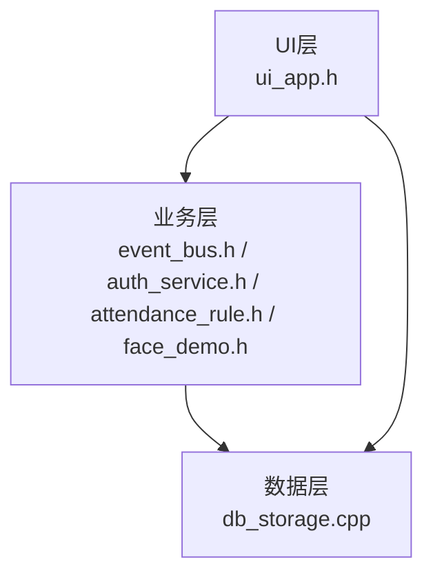
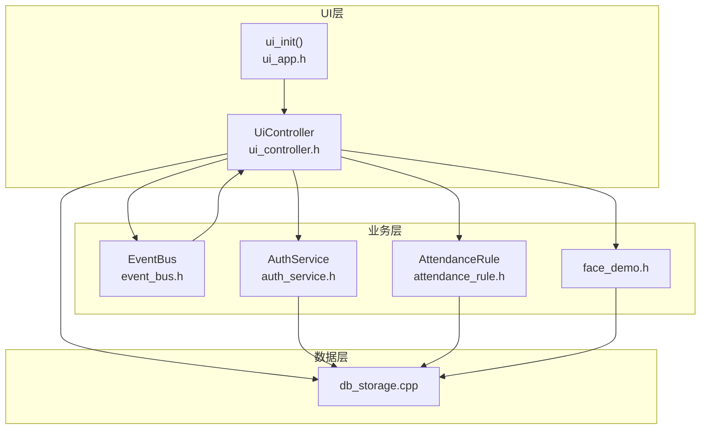
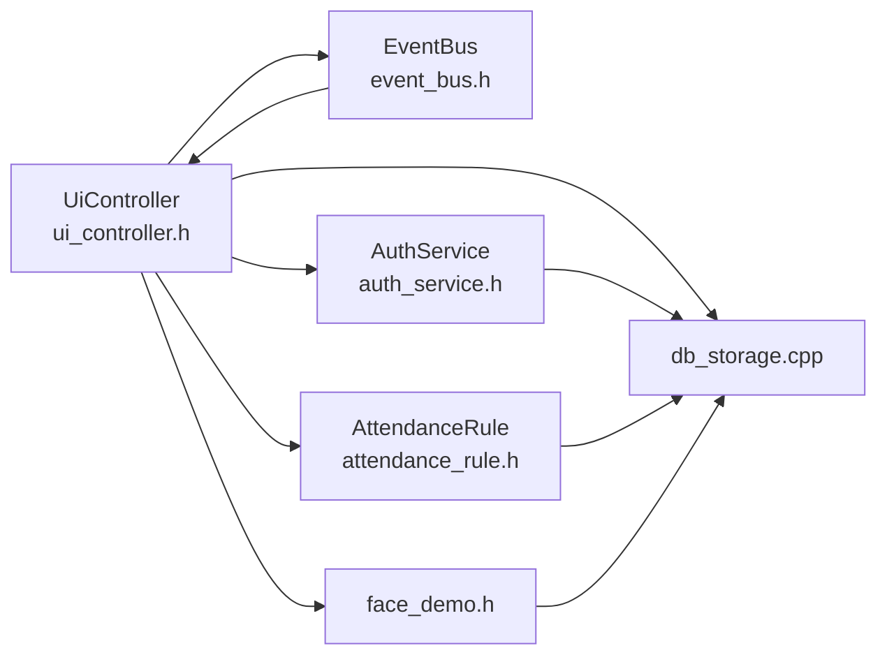

# 测试策略与实施

<cite>
**本文引用的文件**
- [src/main.cpp](file://src/main.cpp)
- [src/business/attendance_rule.h](file://src/business/attendance_rule.h)
- [src/business/auth_service.h](file://src/business/auth_service.h)
- [src/business/event_bus.h](file://src/business/event_bus.h)
- [src/business/face_demo.h](file://src/business/face_demo.h)
- [src/data/db_storage.cpp](file://src/data/db_storage.cpp)
- [src/ui/ui_app.h](file://src/ui/ui_app.h)
- [src/ui/ui_controller.h](file://src/ui/ui_controller.h)
- [libs/lvgl/tests/README.md](file://libs/lvgl/tests/README.md)
- [libs/lvgl/tests/main.py](file://libs/lvgl/tests/main.py)
- [libs/lvgl/tests/CMakeLists.txt](file://libs/lvgl/tests/CMakeLists.txt)
- [libs/lvgl/tests/unity/unity.h](file://libs/lvgl/tests/unity/unity.h)
- [libs/lvgl/tests/unity/unity.c](file://libs/lvgl/tests/unity/unity.c)
- [libs/lvgl/tests/src/test_cases/_test_template.c](file://libs/lvgl/tests/src/test_cases/_test_template.c)
</cite>

## 目录
1. [简介](#简介)
2. [项目结构](#项目结构)
3. [核心组件](#核心组件)
4. [架构总览](#架构总览)
5. [详细组件分析](#详细组件分析)
6. [依赖关系分析](#依赖关系分析)
7. [性能考量](#性能考量)
8. [故障排查指南](#故障排查指南)
9. [结论](#结论)
10. [附录](#附录)

## 简介
本文件面向智能考勤系统，基于仓库现有代码与LVGL测试子系统，制定一套完整的测试策略与实施方案。内容涵盖测试金字塔（单元测试、集成测试、端到端测试）、Unity测试框架使用、性能测试方法（UI响应、人脸识别、数据库查询）、自动化测试流程（CI/CD集成、测试报告与覆盖率分析），并提供测试数据准备与示例路径指引。

## 项目结构
智能考勤系统主要分为三层：
- UI层：负责界面渲染与交互，入口初始化函数位于UI应用头文件中。
- 业务层：负责业务逻辑与事件总线，包含考勤规则、认证服务、人脸识别接口等。
- 数据层：负责数据库初始化、表结构升级、数据播种与CRUD操作。

**图表来源**
- [src/ui/ui_app.h:1-18](file://src/ui/ui_app.h#L1-L18)
- [src/business/event_bus.h:1-43](file://src/business/event_bus.h#L1-L43)
- [src/business/auth_service.h:1-46](file://src/business/auth_service.h#L1-L46)
- [src/business/attendance_rule.h:1-92](file://src/business/attendance_rule.h#L1-L92)
- [src/business/face_demo.h:1-212](file://src/business/face_demo.h#L1-L212)
- [src/data/db_storage.cpp:1-800](file://src/data/db_storage.cpp#L1-L800)

**章节来源**
- [src/ui/ui_app.h:1-18](file://src/ui/ui_app.h#L1-L18)
- [src/business/event_bus.h:1-43](file://src/business/event_bus.h#L1-L43)
- [src/business/auth_service.h:1-46](file://src/business/auth_service.h#L1-L46)
- [src/business/attendance_rule.h:1-92](file://src/business/attendance_rule.h#L1-L92)
- [src/business/face_demo.h:1-212](file://src/business/face_demo.h#L1-L212)
- [src/data/db_storage.cpp:1-800](file://src/data/db_storage.cpp#L1-L800)

## 核心组件
- UI层入口：提供UI初始化接口，用于启动渲染与事件循环。
- 业务层：
  - 事件总线：提供线程安全的发布/订阅机制，支撑UI与业务解耦。
  - 认证服务：提供密码与指纹验证能力。
  - 考勤规则：提供打卡归属班次、状态计算、重复打卡防护等规则引擎。
  - 人脸识别：提供摄像头帧获取、用户注册/更新、记录查询等接口。
- 数据层：提供SQLite初始化、表结构与索引、数据播种、CRUD操作与线程安全锁。

**章节来源**
- [src/ui/ui_app.h:1-18](file://src/ui/ui_app.h#L1-L18)
- [src/business/event_bus.h:1-43](file://src/business/event_bus.h#L1-L43)
- [src/business/auth_service.h:1-46](file://src/business/auth_service.h#L1-L46)
- [src/business/attendance_rule.h:1-92](file://src/business/attendance_rule.h#L1-L92)
- [src/business/face_demo.h:1-212](file://src/business/face_demo.h#L1-L212)
- [src/data/db_storage.cpp:1-800](file://src/data/db_storage.cpp#L1-L800)

## 架构总览
系统采用“UI-业务-数据”分层架构，业务层通过事件总线与UI层解耦，数据层提供线程安全的数据库访问与预编译语句优化。

**图表来源**
- [src/ui/ui_app.h:1-18](file://src/ui/ui_app.h#L1-L18)
- [src/ui/ui_controller.h:1-110](file://src/ui/ui_controller.h#L1-L110)
- [src/business/event_bus.h:1-43](file://src/business/event_bus.h#L1-L43)
- [src/business/auth_service.h:1-46](file://src/business/auth_service.h#L1-L46)
- [src/business/attendance_rule.h:1-92](file://src/business/attendance_rule.h#L1-L92)
- [src/business/face_demo.h:1-212](file://src/business/face_demo.h#L1-L212)
- [src/data/db_storage.cpp:1-800](file://src/data/db_storage.cpp#L1-L800)

## 详细组件分析

### 单元测试策略
- 测试金字塔应用
  - 单元测试：针对纯函数与小范围逻辑（如考勤规则计算、认证服务验证、UI控制器封装接口）进行隔离测试。
  - 集成测试：验证模块间协作（UI与业务、业务与数据），重点覆盖事件总线、认证与考勤规则组合、人脸识别与数据库交互。
  - 端到端测试：模拟真实用户场景（注册、登录、打卡、查看记录），验证完整流程。
- 业务逻辑测试
  - 考勤规则：使用Unity断言验证“打卡归属班次”“状态计算”“重复打卡防护”等关键分支。
  - 认证服务：验证密码与指纹验证的返回枚举值，覆盖成功、失败与异常路径。
- UI组件测试
  - 使用LVGL测试子系统提供的截图比较与断言工具，验证界面渲染一致性与交互行为。
- 数据访问层测试
  - 验证数据播种、CRUD操作、索引与事务的正确性，关注线程安全与预编译语句性能。

**章节来源**
- [libs/lvgl/tests/README.md:1-153](file://libs/lvgl/tests/README.md#L1-L153)
- [libs/lvgl/tests/unity/unity.h](file://libs/lvgl/tests/unity/unity.h)
- [libs/lvgl/tests/unity/unity.c:652-1063](file://libs/lvgl/tests/unity/unity.c#L652-L1063)
- [src/business/attendance_rule.h:1-92](file://src/business/attendance_rule.h#L1-L92)
- [src/business/auth_service.h:1-46](file://src/business/auth_service.h#L1-L46)
- [src/data/db_storage.cpp:1-800](file://src/data/db_storage.cpp#L1-L800)

### 集成测试策略
- 事件总线集成：验证订阅/发布顺序与线程安全，确保UI与业务解耦。
- 认证与考勤：组合认证服务与考勤规则，验证“认证成功后写入考勤记录”的流程。
- 人脸识别与数据库：验证注册/更新用户人脸、查询记录、摄像头帧获取等跨层调用。

**章节来源**
- [src/business/event_bus.h:1-43](file://src/business/event_bus.h#L1-L43)
- [src/business/auth_service.h:1-46](file://src/business/auth_service.h#L1-L46)
- [src/business/attendance_rule.h:1-92](file://src/business/attendance_rule.h#L1-L92)
- [src/business/face_demo.h:1-212](file://src/business/face_demo.h#L1-L212)
- [src/data/db_storage.cpp:1-800](file://src/data/db_storage.cpp#L1-L800)

### 端到端测试策略
- 场景驱动：注册用户、登录、人脸识别打卡、查看记录、导出报表。
- 断言与报告：结合LVGL测试子系统的截图比较与覆盖率生成，输出测试报告。

**章节来源**
- [libs/lvgl/tests/README.md:1-153](file://libs/lvgl/tests/README.md#L1-L153)
- [libs/lvgl/tests/main.py:1-313](file://libs/lvgl/tests/main.py#L1-L313)

### 测试框架Unity使用
- 测试用例编写
  - 使用模板文件作为起点，按需扩展setUp/tearDown与测试函数。
  - 示例路径：[libs/lvgl/tests/src/test_cases/_test_template.c:1-23](file://libs/lvgl/tests/src/test_cases/_test_template.c#L1-L23)
- 断言使用
  - 数值断言、浮点断言、数组断言、相等性断言等，详见Unity源码断言函数。
  - 示例路径：[libs/lvgl/tests/unity/unity.c:652-1063](file://libs/lvgl/tests/unity/unity.c#L652-L1063)
- 测试套件组织
  - 通过CMake与Python脚本生成runner并执行ctest，支持多配置构建与覆盖率生成。
  - 示例路径：[libs/lvgl/tests/CMakeLists.txt:1-543](file://libs/lvgl/tests/CMakeLists.txt#L1-L543)，[libs/lvgl/tests/main.py:1-313](file://libs/lvgl/tests/main.py#L1-L313)

**章节来源**
- [libs/lvgl/tests/src/test_cases/_test_template.c:1-23](file://libs/lvgl/tests/src/test_cases/_test_template.c#L1-L23)
- [libs/lvgl/tests/unity/unity.c:652-1063](file://libs/lvgl/tests/unity/unity.c#L652-L1063)
- [libs/lvgl/tests/CMakeLists.txt:1-543](file://libs/lvgl/tests/CMakeLists.txt#L1-L543)
- [libs/lvgl/tests/main.py:1-313](file://libs/lvgl/tests/main.py#L1-L313)

### 性能测试方法
- UI响应时间测试
  - 使用LVGL测试子系统提供的基准与截图比较，评估不同配置下的渲染性能。
  - 示例路径：[libs/lvgl/tests/README.md:1-153](file://libs/lvgl/tests/README.md#L1-L153)
- 人脸识别性能测试
  - 通过业务层接口获取摄像头帧与注册/更新人脸，结合时间统计评估处理耗时。
  - 示例路径：[src/business/face_demo.h:1-212](file://src/business/face_demo.h#L1-L212)
- 数据库查询性能测试
  - 利用数据层预编译语句与联合索引，设计查询热点用例（如“按用户与时间倒序查询最近记录”），结合SQLite PRAGMAs优化。
  - 示例路径：[src/data/db_storage.cpp:1-800](file://src/data/db_storage.cpp#L1-L800)

**章节来源**
- [libs/lvgl/tests/README.md:1-153](file://libs/lvgl/tests/README.md#L1-L153)
- [src/business/face_demo.h:1-212](file://src/business/face_demo.h#L1-L212)
- [src/data/db_storage.cpp:1-800](file://src/data/db_storage.cpp#L1-L800)

### 自动化测试流程
- CI/CD集成
  - 使用Python脚本与CMake构建测试目标，ctests执行测试，支持过滤与并行。
  - 示例路径：[libs/lvgl/tests/main.py:1-313](file://libs/lvgl/tests/main.py#L1-L313)，[libs/lvgl/tests/CMakeLists.txt:1-543](file://libs/lvgl/tests/CMakeLists.txt#L1-L543)
- 测试报告生成
  - 通过脚本生成HTML与XML覆盖率报告，便于CI展示与归档。
  - 示例路径：[libs/lvgl/tests/main.py:163-188](file://libs/lvgl/tests/main.py#L163-L188)
- 覆盖率分析
  - 使用gcovr生成覆盖率报告，筛选LVGL相关源文件，输出HTML与XML。
  - 示例路径：[libs/lvgl/tests/main.py:163-188](file://libs/lvgl/tests/main.py#L163-L188)

**章节来源**
- [libs/lvgl/tests/main.py:1-313](file://libs/lvgl/tests/main.py#L1-L313)
- [libs/lvgl/tests/CMakeLists.txt:1-543](file://libs/lvgl/tests/CMakeLists.txt#L1-L543)

### 具体测试代码示例与数据准备
- 测试代码示例
  - Unity断言与模板用法参考：
    - [libs/lvgl/tests/src/test_cases/_test_template.c:1-23](file://libs/lvgl/tests/src/test_cases/_test_template.c#L1-L23)
    - [libs/lvgl/tests/unity/unity.c:652-1063](file://libs/lvgl/tests/unity/unity.c#L652-L1063)
- 测试数据准备
  - 数据层播种：首次运行自动创建默认部门、班次、管理员与响铃计划，确保测试具备初始数据。
    - 示例路径：[src/data/db_storage.cpp:343-413](file://src/data/db_storage.cpp#L343-L413)
  - UI测试图像：参考LVGL测试子系统提供的图像生成与比较机制。
    - 示例路径：[libs/lvgl/tests/README.md:1-153](file://libs/lvgl/tests/README.md#L1-L153)

**章节来源**
- [libs/lvgl/tests/src/test_cases/_test_template.c:1-23](file://libs/lvgl/tests/src/test_cases/_test_template.c#L1-L23)
- [libs/lvgl/tests/unity/unity.c:652-1063](file://libs/lvgl/tests/unity/unity.c#L652-L1063)
- [src/data/db_storage.cpp:343-413](file://src/data/db_storage.cpp#L343-L413)
- [libs/lvgl/tests/README.md:1-153](file://libs/lvgl/tests/README.md#L1-L153)

## 依赖关系分析
- 组件耦合与内聚
  - UI层通过UiController封装业务与数据调用，降低与底层细节的耦合。
  - 业务层通过EventBus实现松耦合事件通信。
  - 数据层提供线程安全与性能优化（预编译语句、索引、WAL模式）。
- 外部依赖与集成点
  - LVGL测试子系统提供截图比较、覆盖率与多配置构建能力。
  - SQLite提供高性能与外键约束保障。

**图表来源**
- [src/ui/ui_controller.h:1-110](file://src/ui/ui_controller.h#L1-L110)
- [src/business/event_bus.h:1-43](file://src/business/event_bus.h#L1-L43)
- [src/business/auth_service.h:1-46](file://src/business/auth_service.h#L1-L46)
- [src/business/attendance_rule.h:1-92](file://src/business/attendance_rule.h#L1-L92)
- [src/business/face_demo.h:1-212](file://src/business/face_demo.h#L1-L212)
- [src/data/db_storage.cpp:1-800](file://src/data/db_storage.cpp#L1-L800)

**章节来源**
- [src/ui/ui_controller.h:1-110](file://src/ui/ui_controller.h#L1-L110)
- [src/business/event_bus.h:1-43](file://src/business/event_bus.h#L1-L43)
- [src/business/auth_service.h:1-46](file://src/business/auth_service.h#L1-L46)
- [src/business/attendance_rule.h:1-92](file://src/business/attendance_rule.h#L1-L92)
- [src/business/face_demo.h:1-212](file://src/business/face_demo.h#L1-L212)
- [src/data/db_storage.cpp:1-800](file://src/data/db_storage.cpp#L1-L800)

## 性能考量
- UI层
  - 使用LVGL渲染与事件循环，结合测试子系统评估不同配置下的帧率与内存占用。
- 业务层
  - 人脸识别预处理参数（裁剪、直方图均衡化、ROI增强）影响识别准确率与性能，建议在测试中量化不同参数组合的耗时。
- 数据层
  - SQLite启用WAL、NORMAL同步、内存临时表、缓存大小与外键约束，配合联合索引提升查询性能。

**章节来源**
- [libs/lvgl/tests/README.md:1-153](file://libs/lvgl/tests/README.md#L1-L153)
- [src/business/face_demo.h:1-212](file://src/business/face_demo.h#L1-L212)
- [src/data/db_storage.cpp:148-161](file://src/data/db_storage.cpp#L148-L161)

## 故障排查指南
- 依赖自检
  - 主程序提供框架依赖版本检查，便于定位OpenCV、SQLite3、LVGL版本问题。
  - 示例路径：[src/main.cpp:46-59](file://src/main.cpp#L46-L59)
- 数据层初始化失败
  - 检查数据库连接、表结构创建与播种逻辑，确认权限与路径。
  - 示例路径：[src/data/db_storage.cpp:133-310](file://src/data/db_storage.cpp#L133-L310)
- UI初始化与主循环
  - 确认UI初始化顺序与主循环心跳驱动，避免资源泄漏。
  - 示例路径：[src/main.cpp:187-246](file://src/main.cpp#L187-L246)

**章节来源**
- [src/main.cpp:46-59](file://src/main.cpp#L46-L59)
- [src/main.cpp:187-246](file://src/main.cpp#L187-L246)
- [src/data/db_storage.cpp:133-310](file://src/data/db_storage.cpp#L133-L310)

## 结论
本测试策略以测试金字塔为核心，结合Unity测试框架与LVGL测试子系统，覆盖单元、集成与端到端测试，配套性能测试与自动化流水线，确保系统在UI响应、人脸识别与数据库查询方面的稳定性与可维护性。建议在CI中持续运行测试与覆盖率报告，逐步完善测试用例与数据准备流程。

## 附录
- 测试执行与报告
  - 本地测试与覆盖率生成参考：[libs/lvgl/tests/README.md:1-153](file://libs/lvgl/tests/README.md#L1-L153)，[libs/lvgl/tests/main.py:1-313](file://libs/lvgl/tests/main.py#L1-L313)
- 数据层初始化与播种
  - 示例路径：[src/data/db_storage.cpp:343-413](file://src/data/db_storage.cpp#L343-L413)