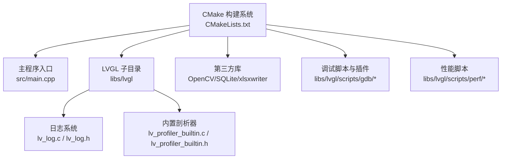
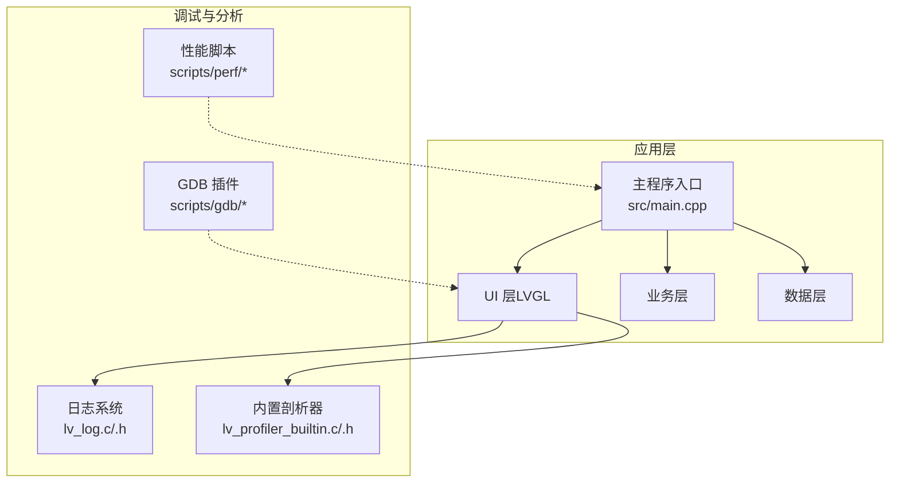
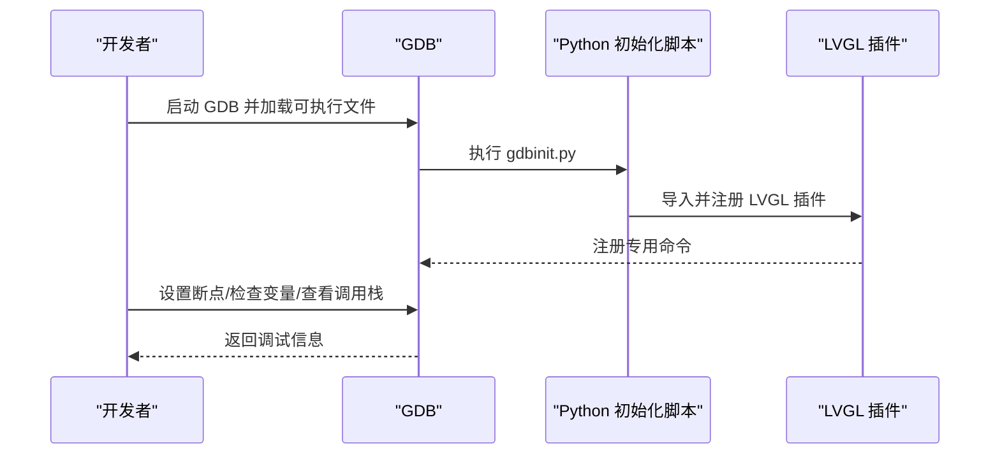
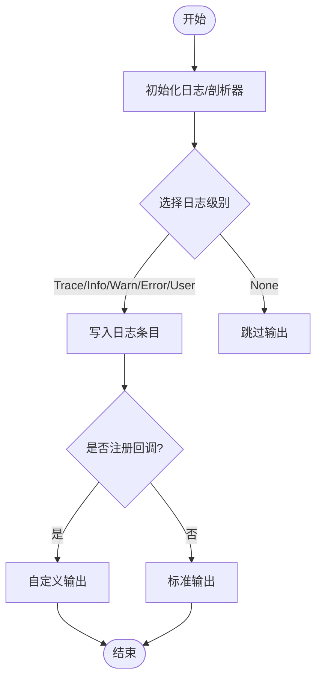
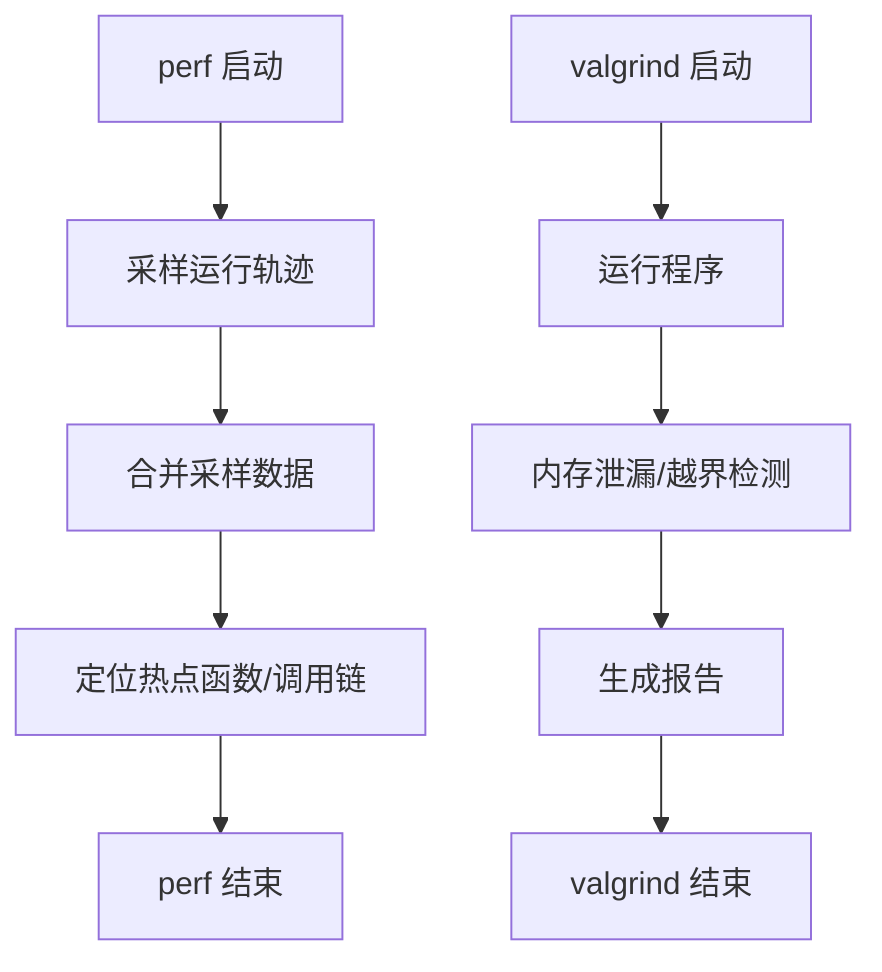
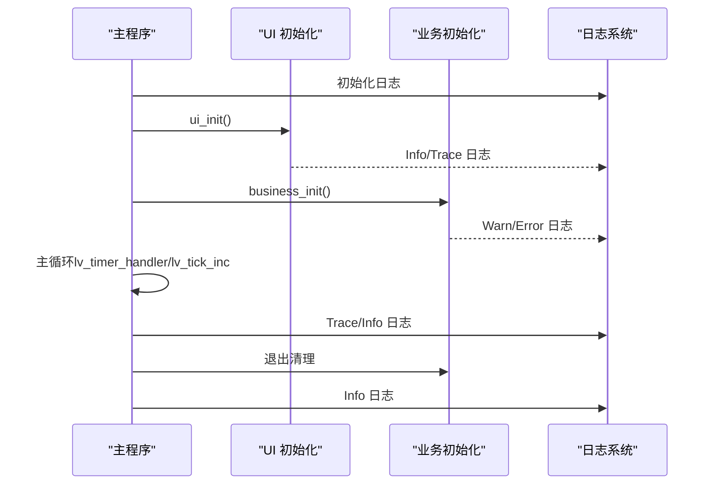
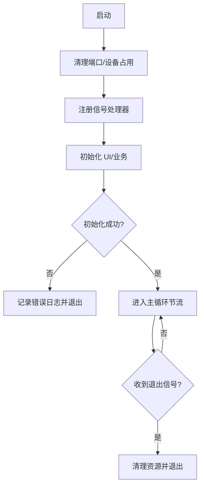
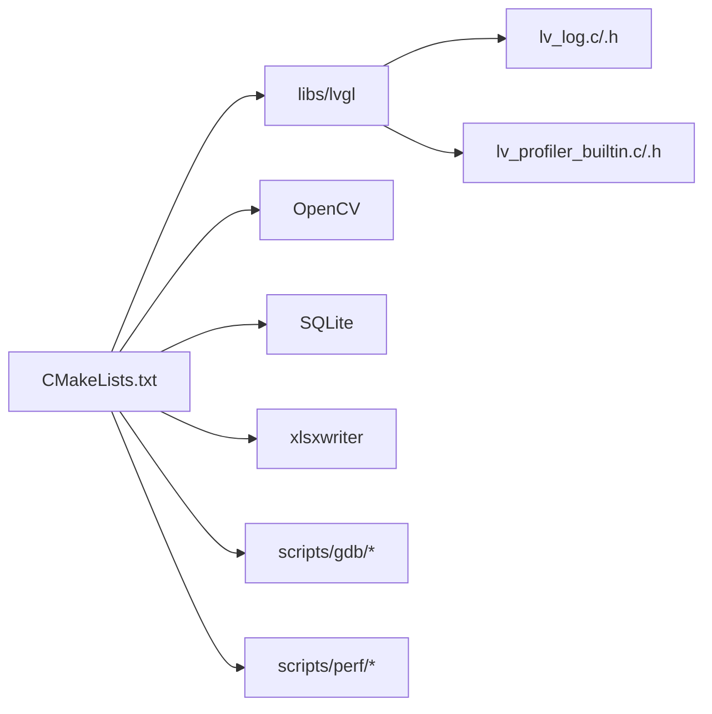

# 调试工具与技巧

<cite>
**本文引用的文件**
- [CMakeLists.txt](file://CMakeLists.txt)
- [env.sh](file://env/env.sh)
- [main.cpp](file://src/main.cpp)
- [lv_conf.h](file://lv_conf.h)
- [lv_log.c](file://libs/lvgl/src/misc/lv_log.c)
- [lv_log.h](file://libs/lvgl/src/misc/lv_log.h)
- [lv_profiler_builtin.c](file://libs/lvgl/src/misc/lv_profiler_builtin.c)
- [lv_profiler_builtin.h](file://libs/lvgl/src/misc/lv_profiler_builtin.h)
- [gdbinit.py](file://libs/lvgl/scripts/gdb/gdbinit.py)
- [README.md（LVGL GDB 插件）](file://libs/lvgl/scripts/gdb/README.md)
- [lvperf_dependencies.sh](file://libs/lvgl/scripts/perf/lvperf_dependencies.sh)
</cite>

## 目录
1. [简介](#简介)
2. [项目结构](#项目结构)
3. [核心组件](#核心组件)
4. [架构总览](#架构总览)
5. [详细组件分析](#详细组件分析)
6. [依赖关系分析](#依赖关系分析)
7. [性能考量](#性能考量)
8. [故障排查指南](#故障排查指南)
9. [结论](#结论)
10. [附录](#附录)

## 简介
本指南面向 SmartAttendance 项目开发者，聚焦于调试工具与高效调试技巧，覆盖以下主题：
- GDB 调试器配置与使用：断点设置、变量检查、调用栈分析
- LVGL 专用调试工具与可视化调试方法
- 性能分析工具（perf、valgrind）使用：内存泄漏检测与性能瓶颈定位
- 日志系统配置、调试输出管理与错误追踪
- 常见问题的调试流程、错误代码解读与快速定位技巧
- 远程调试、多线程调试与跨平台调试注意事项

## 项目结构
SmartAttendance 采用 CMake 构建，主程序入口位于 src/main.cpp，UI 层基于 LVGL（libs/lvgl）。项目通过 CMakeLists.txt 统一配置编译选项、导出编译命令以便 IDE 辅助，并引入 LVGL 子目录与第三方库（OpenCV、SQLite、xlsxwriter 等）。调试相关能力由 LVGL 提供的日志与内置剖析器支撑，同时提供 GDB 插件与性能脚本。

**图示来源**
- [CMakeLists.txt:1-153](file://CMakeLists.txt#L1-L153)
- [main.cpp:1-246](file://src/main.cpp#L1-L246)
- [lv_log.c:1-150](file://libs/lvgl/src/misc/lv_log.c#L1-L150)
- [lv_log.h:1-163](file://libs/lvgl/src/misc/lv_log.h#L1-L163)
- [lv_profiler_builtin.c:1-271](file://libs/lvgl/src/misc/lv_profiler_builtin.c#L1-L271)
- [lv_profiler_builtin.h:1-86](file://libs/lvgl/src/misc/lv_profiler_builtin.h#L1-L86)
- [gdbinit.py:1-14](file://libs/lvgl/scripts/gdb/gdbinit.py#L1-L14)
- [README.md（LVGL GDB 插件）:1-21](file://libs/lvgl/scripts/gdb/README.md#L1-L21)
- [lvperf_dependencies.sh:1-10](file://libs/lvgl/scripts/perf/lvperf_dependencies.sh#L1-L10)

**章节来源**
- [CMakeLists.txt:1-153](file://CMakeLists.txt#L1-L153)
- [main.cpp:1-246](file://src/main.cpp#L1-L246)

## 核心组件
- 构建与调试基础
  - Debug 构建类型与编译命令导出：便于 IDE 与静态分析工具识别头文件路径与编译参数
  - 线程库链接：为多线程调试与业务线程提供支持
- 日志系统（LVGL）
  - 支持级别化日志、时间戳、文件行号、自定义打印回调
  - 可通过回调将日志重定向至文件、串口或自定义输出
- 内置剖析器（LVGL）
  - 基于环形缓冲区的轻量级性能标记，支持开启/关闭、刷新与多线程保护
  - 输出格式兼容 Android Tracing（如 perfetto），便于后续分析
- GDB 插件（LVGL）
  - 提供针对 LVGL 对象与内存的可视化辅助命令，提升 UI 相关问题定位效率
- 性能脚本（LVGL）
  - 提供性能测试依赖安装脚本，便于在容器环境中复现与对比性能结果

**章节来源**
- [CMakeLists.txt:10-13](file://CMakeLists.txt#L10-L13)
- [CMakeLists.txt:21-22](file://CMakeLists.txt#L21-L22)
- [lv_log.c:67-122](file://libs/lvgl/src/misc/lv_log.c#L67-L122)
- [lv_log.h:66-92](file://libs/lvgl/src/misc/lv_log.h#L66-L92)
- [lv_profiler_builtin.c:102-148](file://libs/lvgl/src/misc/lv_profiler_builtin.c#L102-L148)
- [lv_profiler_builtin.h:27-31](file://libs/lvgl/src/misc/lv_profiler_builtin.h#L27-L31)
- [gdbinit.py:1-14](file://libs/lvgl/scripts/gdb/gdbinit.py#L1-L14)
- [README.md（LVGL GDB 插件）:1-21](file://libs/lvgl/scripts/gdb/README.md#L1-L21)
- [lvperf_dependencies.sh:1-10](file://libs/lvgl/scripts/perf/lvperf_dependencies.sh#L1-L10)

## 架构总览
下图展示调试相关组件在系统中的位置与交互关系。

**图示来源**
- [main.cpp:187-246](file://src/main.cpp#L187-L246)
- [lv_log.c:67-122](file://libs/lvgl/src/misc/lv_log.c#L67-L122)
- [lv_profiler_builtin.c:102-148](file://libs/lvgl/src/misc/lv_profiler_builtin.c#L102-L148)
- [gdbinit.py:1-14](file://libs/lvgl/scripts/gdb/gdbinit.py#L1-L14)
- [lvperf_dependencies.sh:1-10](file://libs/lvgl/scripts/perf/lvperf_dependencies.sh#L1-L10)

## 详细组件分析

### GDB 调试器配置与使用
- 启用调试符号与导出编译命令
  - Debug 构建类型与导出 compile_commands.json，使 VS Code 等编辑器能自动解析头文件路径与编译参数，提升补全与跳转体验
- GDB 插件加载
  - 通过 Python 初始化脚本加载 LVGL GDB 插件，随后可在 GDB 中使用 LVGL 专用命令进行对象与内存可视化
- 断点设置与变量检查
  - 在主循环、UI 初始化、业务初始化等关键路径设置断点；结合变量检查与表达式求值定位状态异常
- 调用栈分析
  - 结合 LVGL 事件回调与渲染路径，利用调用栈定位阻塞点或异常分支

**图示来源**
- [gdbinit.py:1-14](file://libs/lvgl/scripts/gdb/gdbinit.py#L1-L14)
- [README.md（LVGL GDB 插件）:1-21](file://libs/lvgl/scripts/gdb/README.md#L1-L21)

**章节来源**
- [CMakeLists.txt:10-13](file://CMakeLists.txt#L10-L13)
- [gdbinit.py:1-14](file://libs/lvgl/scripts/gdb/gdbinit.py#L1-L14)
- [README.md（LVGL GDB 插件）:1-21](file://libs/lvgl/scripts/gdb/README.md#L1-L21)

### LVGL 专用调试工具与可视化调试
- 日志系统
  - 支持 Trace/Info/Warn/Error/User 等级别；可启用时间戳与文件行号宏；可通过注册回调将日志重定向
  - 适合在 UI 事件、渲染路径、输入设备处理等关键节点输出上下文信息
- 内置剖析器
  - 通过宏在函数入口/出口写入标记，配合 flush 输出到日志；支持开启/关闭与多线程保护
  - 输出格式兼容 Android Tracing，便于性能分析工具链接入

**图示来源**
- [lv_log.c:72-122](file://libs/lvgl/src/misc/lv_log.c#L72-L122)
- [lv_log.h:97-135](file://libs/lvgl/src/misc/lv_log.h#L97-L135)
- [lv_profiler_builtin.c:180-208](file://libs/lvgl/src/misc/lv_profiler_builtin.c#L180-L208)
- [lv_profiler_builtin.h:27-31](file://libs/lvgl/src/misc/lv_profiler_builtin.h#L27-L31)

**章节来源**
- [lv_log.c:67-122](file://libs/lvgl/src/misc/lv_log.c#L67-L122)
- [lv_log.h:66-92](file://libs/lvgl/src/misc/lv_log.h#L66-L92)
- [lv_profiler_builtin.c:102-148](file://libs/lvgl/src/misc/lv_profiler_builtin.c#L102-L148)
- [lv_profiler_builtin.h:27-31](file://libs/lvgl/src/misc/lv_profiler_builtin.h#L27-L31)

### 性能分析工具（perf、valgrind）
- perf
  - 可用于采样 CPU 占用热点，结合 LVGL 剖析器输出的函数标记进行关联分析
  - 建议在主循环节流与渲染路径上观察热点函数
- valgrind
  - 用于检测内存泄漏、越界访问与未初始化读取
  - 建议在数据层与业务层关键路径运行，关注 OpenCV 与 SQLite 相关分配与释放
- 性能脚本
  - 提供容器环境下的依赖安装脚本，便于在 CI 或复现实验中复现性能结果

**图示来源**
- [lvperf_dependencies.sh:1-10](file://libs/lvgl/scripts/perf/lvperf_dependencies.sh#L1-L10)

**章节来源**
- [lvperf_dependencies.sh:1-10](file://libs/lvgl/scripts/perf/lvperf_dependencies.sh#L1-L10)

### 日志系统配置、调试输出管理与错误追踪
- 日志级别与输出
  - 通过配置头文件启用/禁用日志与时间戳、文件行号宏；在需要时注册自定义打印回调
- 错误追踪
  - 在 UI 初始化、业务初始化、主循环等关键路径插入日志；结合调用栈与时间戳快速定位异常
- 资源清理
  - 在信号处理与退出路径确保业务层与数据层资源释放，避免悬挂资源导致的二次问题

**图示来源**
- [main.cpp:187-246](file://src/main.cpp#L187-L246)
- [lv_log.c:72-122](file://libs/lvgl/src/misc/lv_log.c#L72-L122)

**章节来源**
- [lv_conf.h:1-200](file://lv_conf.h#L1-L200)
- [lv_log.c:67-122](file://libs/lvgl/src/misc/lv_log.c#L67-L122)
- [main.cpp:187-246](file://src/main.cpp#L187-L246)

### 常见问题的调试流程、错误代码解读与快速定位技巧
- 黑屏/摄像头占用
  - 运行前清理端口与设备占用，避免黑屏与资源冲突
- Ctrl+C 退出
  - 注册信号处理器，设置全局退出标志，确保优雅退出
- 主循环节流
  - 限制最小/最大休眠时间，避免过快或过慢导致的卡顿或高占用
- 多线程调试
  - 确保线程库链接，使用互斥保护剖析器缓冲区，避免竞态

**图示来源**
- [env.sh:67-99](file://env/env.sh#L67-L99)
- [main.cpp:40-44](file://src/main.cpp#L40-L44)
- [main.cpp:229-238](file://src/main.cpp#L229-L238)

**章节来源**
- [env.sh:67-99](file://env/env.sh#L67-L99)
- [main.cpp:40-44](file://src/main.cpp#L40-L44)
- [main.cpp:229-238](file://src/main.cpp#L229-L238)

### 远程调试、多线程调试与跨平台调试注意事项
- 远程调试
  - 使用 GDBServer 在目标机运行，本地通过 GDB 连接；确保交叉编译工具链与符号完整
- 多线程调试
  - 启用线程库链接；在剖析器写入与刷新处使用互斥保护；关注线程切换与锁竞争
- 跨平台调试
  - 在不同平台（Linux/Windows/嵌入式）统一日志与时间戳策略；针对平台差异调整 UI 驱动与输入设备

**章节来源**
- [CMakeLists.txt:21-22](file://CMakeLists.txt#L21-L22)
- [lv_profiler_builtin.c:135-137](file://libs/lvgl/src/misc/lv_profiler_builtin.c#L135-L137)

## 依赖关系分析
- 构建与第三方库
  - CMakeLists 配置 Debug、导出编译命令、链接线程库与 LVGL 子目录；引入 OpenCV、SQLite、xlsxwriter
- 调试与分析
  - LVGL 日志与剖析器作为调试基础设施；GDB 插件与性能脚本提供工具链支持

**图示来源**
- [CMakeLists.txt:10-13](file://CMakeLists.txt#L10-L13)
- [CMakeLists.txt:21-22](file://CMakeLists.txt#L21-L22)
- [lv_log.c:67-122](file://libs/lvgl/src/misc/lv_log.c#L67-L122)
- [lv_profiler_builtin.c:102-148](file://libs/lvgl/src/misc/lv_profiler_builtin.c#L102-L148)
- [gdbinit.py:1-14](file://libs/lvgl/scripts/gdb/gdbinit.py#L1-L14)
- [lvperf_dependencies.sh:1-10](file://libs/lvgl/scripts/perf/lvperf_dependencies.sh#L1-L10)

**章节来源**
- [CMakeLists.txt:10-13](file://CMakeLists.txt#L10-L13)
- [CMakeLists.txt:21-22](file://CMakeLists.txt#L21-L22)

## 性能考量
- 主循环节流
  - 通过限制每次休眠时间，平衡响应性与能耗；与 LVGL 计时器协同工作
- 剖析器使用
  - 在 UI 渲染、事件处理、图像处理等热点路径插入标记，结合日志输出进行热点定位
- 多线程与锁
  - 在共享数据路径使用互斥保护，避免剖析器缓冲区竞争

**章节来源**
- [main.cpp:229-238](file://src/main.cpp#L229-L238)
- [lv_profiler_builtin.c:180-208](file://libs/lvgl/src/misc/lv_profiler_builtin.c#L180-L208)

## 故障排查指南
- 环境准备
  - 使用环境脚本清理端口与设备占用，避免黑屏与资源冲突
- 信号与退出
  - 确保信号处理器正确设置全局退出标志，主循环及时退出
- 日志与错误
  - 在关键路径输出日志，结合时间戳与文件行号快速定位问题
- 资源回收
  - 业务层与数据层退出前进行资源清理，避免悬挂与二次问题

**章节来源**
- [env.sh:67-99](file://env/env.sh#L67-L99)
- [main.cpp:40-44](file://src/main.cpp#L40-L44)
- [main.cpp:242-245](file://src/main.cpp#L242-L245)

## 结论
通过 Debug 构建、日志与剖析器、GDB 插件与性能脚本的组合，SmartAttendance 项目具备完善的调试与性能分析能力。建议在日常开发中：
- 统一日志规范与级别，关键路径必打日志
- 在 UI 渲染与业务热点路径使用剖析器标记
- 使用 GDB 插件与 perf/valgrind 快速定位问题与优化瓶颈
- 规范资源清理与退出流程，确保稳定性

## 附录
- 快速参考
  - 构建与运行：使用环境脚本一键构建与运行
  - 调试符号：确保 Debug 构建与 compile_commands.json 导出
  - 日志级别：根据需要调整 LVGL 日志级别与输出策略
  - 剖析器：在函数入口/出口使用宏标记，定期刷新输出

**章节来源**
- [env.sh:47-99](file://env/env.sh#L47-L99)
- [CMakeLists.txt:10-13](file://CMakeLists.txt#L10-L13)
- [lv_log.h:97-135](file://libs/lvgl/src/misc/lv_log.h#L97-L135)
- [lv_profiler_builtin.h:27-31](file://libs/lvgl/src/misc/lv_profiler_builtin.h#L27-L31)