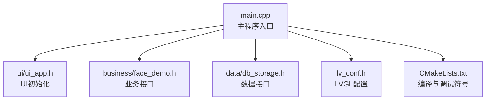
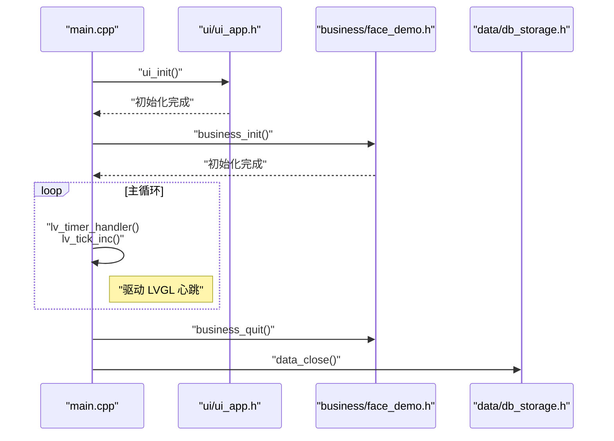
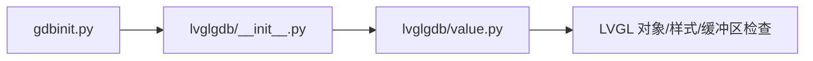
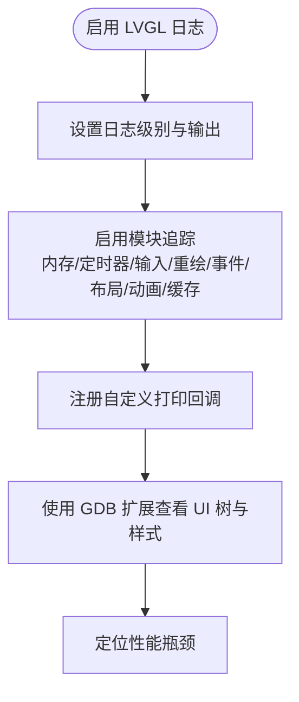
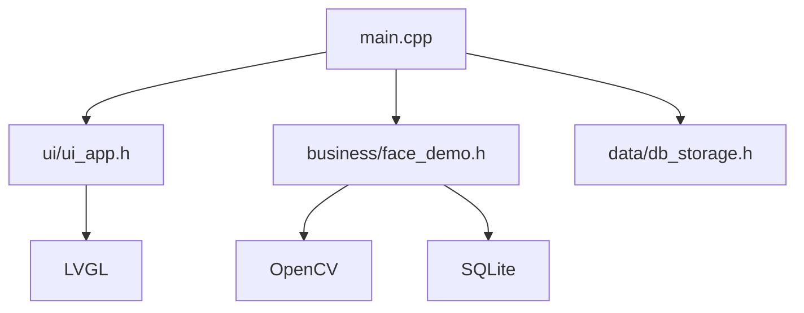
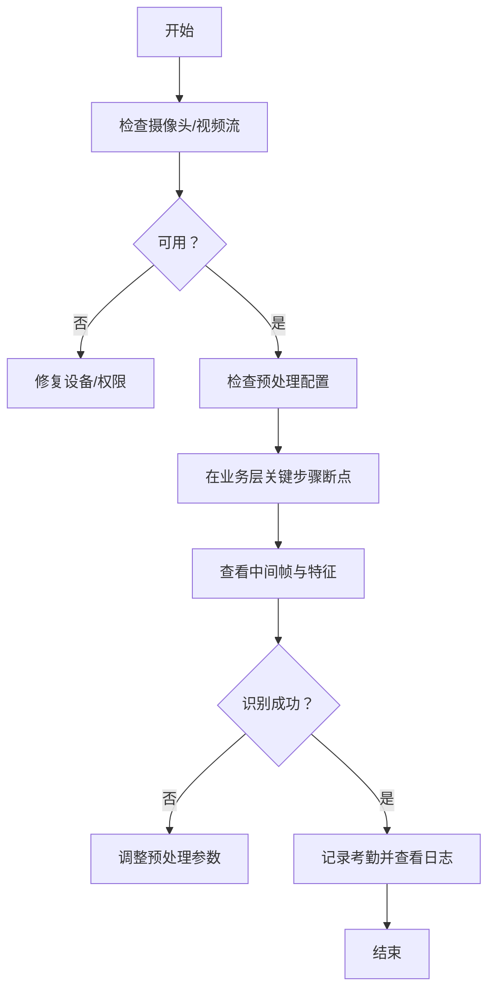
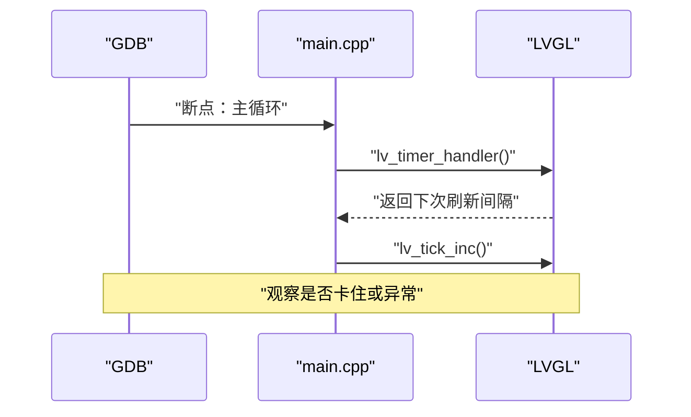
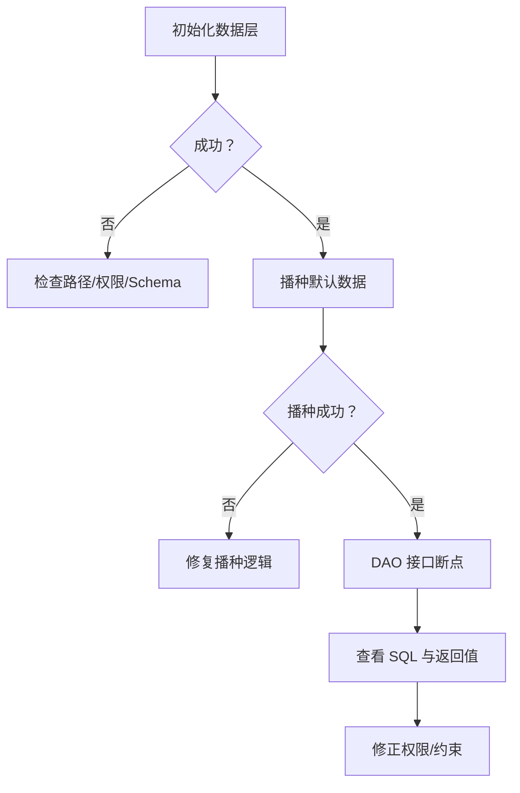

# 调试技巧与工具

<cite>
**本文引用的文件**
- [main.cpp](file://src/main.cpp)
- [CMakeLists.txt](file://CMakeLists.txt)
- [lv_conf.h](file://lv_conf.h)
- [face_demo.h](file://src/business/face_demo.h)
- [db_storage.h](file://src/data/db_storage.h)
- [ui_app.h](file://src/ui/ui_app.h)
- [README.md](file://libs/lvgl/scripts/gdb/README.md)
- [gdbinit.py](file://libs/lvgl/scripts/gdb/gdbinit.py)
- [value.py](file://libs/lvgl/scripts/gdb/lvglgdb/value.py)
- [lv_log.c](file://libs/lvgl/src/misc/lv_log.c)
- [lv_log.h](file://libs/lvgl/src/misc/lv_log.h)
- [lv_assert.h](file://libs/lvgl/src/misc/lv_assert.h)
</cite>

## 目录
1. [简介](#简介)
2. [项目结构](#项目结构)
3. [核心组件](#核心组件)
4. [架构总览](#架构总览)
5. [详细组件分析](#详细组件分析)
6. [依赖关系分析](#依赖关系分析)
7. [性能考虑](#性能考虑)
8. [故障排查指南](#故障排查指南)
9. [结论](#结论)
10. [附录](#附录)

## 简介
本文件面向智能考勤系统的开发者与维护者，提供一套系统化的调试技巧与工具使用指南。内容涵盖：
- GDB 调试器的断点设置、变量查看、调用栈分析、内存检查
- LVGL 调试工具（日志、断言、UI 树与事件跟踪）
- 内存调试技术（泄漏检测、野指针检查、缓冲区溢出）
- 日志调试方法（日志级别、关键路径追踪、错误定位）
- IDE 调试配置（VS Code、CLion 等）
- 典型调试场景与解决方案（人脸识别失败、UI 无响应、数据库连接问题）

## 项目结构
智能考勤系统采用分层架构：UI 层（LVGL）、业务层（OpenCV + SQLite）、数据层（SQLite）。顶层入口负责系统初始化与主循环，驱动 LVGL 心跳。

图表来源
- [main.cpp:187-246](file://src/main.cpp#L187-L246)
- [ui_app.h:8-12](file://src/ui/ui_app.h#L8-L12)
- [face_demo.h:34-212](file://src/business/face_demo.h#L34-L212)
- [db_storage.h:214-683](file://src/data/db_storage.h#L214-L683)
- [lv_conf.h:412-451](file://lv_conf.h#L412-L451)
- [CMakeLists.txt:10-14](file://CMakeLists.txt#L10-L14)

章节来源
- [main.cpp:187-246](file://src/main.cpp#L187-L246)
- [CMakeLists.txt:10-14](file://CMakeLists.txt#L10-L14)

## 核心组件
- 主程序入口与主循环：负责系统初始化、UI 初始化、业务层初始化、LVGL 心跳与退出清理。
- UI 子系统：封装 LVGL 初始化、事件订阅与页面管理。
- 业务子系统：封装人脸识别、预处理、视频帧获取、用户注册与考勤记录查询。
- 数据子系统：封装 SQLite 数据访问对象（DAO），提供部门、班次、用户、考勤记录等接口。

章节来源
- [main.cpp:187-246](file://src/main.cpp#L187-L246)
- [ui_app.h:8-12](file://src/ui/ui_app.h#L8-L12)
- [face_demo.h:34-212](file://src/business/face_demo.h#L34-L212)
- [db_storage.h:214-683](file://src/data/db_storage.h#L214-L683)

## 架构总览
系统主循环持续驱动 LVGL 心跳，同时业务层与数据层在后台协作完成识别与数据持久化。

图表来源
- [main.cpp:213-245](file://src/main.cpp#L213-L245)
- [ui_app.h:8-12](file://src/ui/ui_app.h#L8-L12)
- [face_demo.h:207-212](file://src/business/face_demo.h#L207-L212)
- [db_storage.h:214-239](file://src/data/db_storage.h#L214-L239)

## 详细组件分析

### GDB 调试器使用
- 启用调试符号与编译命令导出：CMake 已设置 Debug 构建类型并导出 compile_commands.json，便于 VS Code 自动发现头文件路径。
- LVGL GDB 扩展：仓库提供 LVGL GDB 脚本包，可辅助查看 LVGL 对象、样式与绘制缓冲区。
- 断点策略：在主循环、UI 初始化、业务初始化、数据库操作等关键路径设置断点；对 UI 无响应问题可在 LVGL 心跳与事件回调处断点。
- 变量查看：关注 LVGL 全局状态、对象树、样式链、绘制缓冲区；对业务层关注摄像头帧、预处理配置、识别开关。
- 调用栈分析：当 UI 无响应或崩溃时，查看主线程与 LVGL 渲染线程的调用栈，定位阻塞点或异常路径。
- 内存检查：结合 GDB 与 Valgrind/AddressSanitizer，检查内存泄漏、越界访问与野指针。

图表来源
- [gdbinit.py:1-13](file://libs/lvgl/scripts/gdb/gdbinit.py#L1-L13)
- [README.md:1-21](file://libs/lvgl/scripts/gdb/README.md#L1-L21)
- [value.py:1-37](file://libs/lvgl/scripts/gdb/lvglgdb/value.py#L1-L37)

章节来源
- [CMakeLists.txt:10-14](file://CMakeLists.txt#L10-L14)
- [gdbinit.py:1-13](file://libs/lvgl/scripts/gdb/gdbinit.py#L1-L13)
- [README.md:1-21](file://libs/lvgl/scripts/gdb/README.md#L1-L21)
- [value.py:1-37](file://libs/lvgl/scripts/gdb/lvglgdb/value.py#L1-L37)

### LVGL 调试工具
- 日志系统：可通过配置启用日志模块与详细追踪（内存、定时器、输入设备、重绘、事件、布局、动画、缓存），并可注册自定义打印回调。
- 断言系统：启用空指针、内存分配、样式完整性等断言，失败时输出错误日志并触发处理器。
- UI 树与事件：结合 LVGL GDB 扩展，可遍历对象树、查看样式链、定位事件回调与绘制路径。
- 性能分析：利用日志中的时间戳与文件行号，定位耗时热点；必要时开启调试模式观察重绘区域。

图表来源
- [lv_conf.h:412-451](file://lv_conf.h#L412-L451)
- [lv_log.c:67-122](file://libs/lvgl/src/misc/lv_log.c#L67-L122)
- [lv_log.h:66-92](file://libs/lvgl/src/misc/lv_log.h#L66-L92)
- [lv_assert.h:37-59](file://libs/lvgl/src/misc/lv_assert.h#L37-L59)

章节来源
- [lv_conf.h:412-451](file://lv_conf.h#L412-L451)
- [lv_log.c:67-122](file://libs/lvgl/src/misc/lv_log.c#L67-L122)
- [lv_log.h:66-92](file://libs/lvgl/src/misc/lv_log.h#L66-L92)
- [lv_assert.h:37-59](file://libs/lvgl/src/misc/lv_assert.h#L37-L59)

### 内存调试技术
- 泄漏检测：使用 AddressSanitizer/Valgrind/LeakSanitizer，重点检查 OpenCV Mat、SQLite 句柄、LVGL 分配的缓冲区与样式链。
- 野指针检查：启用 LVGL 断言（空指针、内存分配、样式完整性），在对象生命周期关键点（创建/销毁）断点验证。
- 缓冲区溢出：对 UI 显示帧缓冲、数据库 BLOB、图像编码/解码缓冲进行边界检查；在 GDB 中使用监视点监控越界写入。

章节来源
- [lv_assert.h:65-81](file://libs/lvgl/src/misc/lv_assert.h#L65-L81)
- [lv_conf.h:456-468](file://lv_conf.h#L456-L468)

### 日志调试方法
- 日志级别：根据问题严重性选择 Trace/Info/Warn/Error/User/None。
- 关键路径追踪：在 UI 初始化、业务初始化、主循环、数据库操作前后打点；对人脸识别流程的关键步骤（预处理、检测、识别、记录）分别记录。
- 错误定位：结合时间戳与文件行号，快速定位异常模块与调用栈。

章节来源
- [lv_log.c:67-122](file://libs/lvgl/src/misc/lv_log.c#L67-L122)
- [lv_log.h:26-32](file://libs/lvgl/src/misc/lv_log.h#L26-L32)

### IDE 调试配置
- VS Code：启用 Debug 构建类型与 compile_commands.json 导出，自动识别头文件路径；在 launch.json 中配置 GDB 启动参数与断点策略。
- CLion：使用 CMake 的 Debug 配置，自动加载编译数据库；设置断点于主循环、UI 初始化、业务初始化与数据库接口。

章节来源
- [CMakeLists.txt:10-14](file://CMakeLists.txt#L10-L14)

## 依赖关系分析
系统各层之间存在清晰的依赖关系：主程序依赖 UI、业务与数据层；业务层依赖 OpenCV 与 SQLite；UI 层依赖 LVGL。

图表来源
- [main.cpp:187-246](file://src/main.cpp#L187-L246)
- [ui_app.h:8-12](file://src/ui/ui_app.h#L8-L12)
- [face_demo.h:14-16](file://src/business/face_demo.h#L14-L16)
- [db_storage.h:10-14](file://src/data/db_storage.h#L10-L14)

章节来源
- [main.cpp:187-246](file://src/main.cpp#L187-L246)
- [ui_app.h:8-12](file://src/ui/ui_app.h#L8-L12)
- [face_demo.h:14-16](file://src/business/face_demo.h#L14-L16)
- [db_storage.h:10-14](file://src/data/db_storage.h#L10-L14)

## 性能考虑
- LVGL 性能：合理设置默认刷新周期、DPI、绘制线程优先级与堆栈大小；在高负载场景下减少复杂样式与动画。
- 人脸识别性能：控制预处理步数与图像尺寸，避免频繁大内存分配；在 UI 帧缓冲与识别帧之间做合理的拷贝与格式转换。
- 数据库性能：批量操作使用事务；避免在 UI 线程执行数据库操作；对高频查询建立索引。

## 故障排查指南

### 场景一：人脸识别失败
- 检查摄像头/视频流是否可用（OpenCV 相关初始化）。
- 检查预处理配置（裁剪、尺寸归一化、直方图均衡化）是否合理。
- 在业务层关键路径（预处理、检测、识别、记录）设置断点，查看中间帧与特征向量。
- 使用日志记录识别开关状态、帧获取结果与数据库写入结果。

图表来源
- [face_demo.h:76-84](file://src/business/face_demo.h#L76-L84)
- [face_demo.h:98-128](file://src/business/face_demo.h#L98-L128)
- [lv_log.c:67-122](file://libs/lvgl/src/misc/lv_log.c#L67-L122)

章节来源
- [face_demo.h:76-84](file://src/business/face_demo.h#L76-L84)
- [face_demo.h:98-128](file://src/business/face_demo.h#L98-L128)
- [lv_log.c:67-122](file://libs/lvgl/src/misc/lv_log.c#L67-L122)

### 场景二：UI 无响应
- 在主循环中设置断点，检查 LVGL 心跳与时间增量是否正常。
- 使用 GDB 查看 UI 树与事件回调，确认是否存在阻塞或死循环。
- 启用 LVGL 日志与断言，定位绘制或事件处理异常。

图表来源
- [main.cpp:229-238](file://src/main.cpp#L229-L238)
- [lv_log.c:67-122](file://libs/lvgl/src/misc/lv_log.c#L67-L122)

章节来源
- [main.cpp:229-238](file://src/main.cpp#L229-L238)
- [lv_log.c:67-122](file://libs/lvgl/src/misc/lv_log.c#L67-L122)

### 场景三：数据库连接问题
- 检查数据层初始化与播种流程，确认数据库文件路径与权限。
- 在 DAO 接口（如添加用户、记录考勤）设置断点，查看 SQL 执行与返回值。
- 使用日志记录 SQL 错误与事务状态，定位权限或约束冲突。

图表来源
- [db_storage.h:214-239](file://src/data/db_storage.h#L214-L239)
- [db_storage.h:248-254](file://src/data/db_storage.h#L248-L254)
- [db_storage.h:458-467](file://src/data/db_storage.h#L458-L467)

章节来源
- [db_storage.h:214-239](file://src/data/db_storage.h#L214-L239)
- [db_storage.h:248-254](file://src/data/db_storage.h#L248-L254)
- [db_storage.h:458-467](file://src/data/db_storage.h#L458-L467)

## 结论
通过结合 GDB、LVGL 日志/断言、IDE 调试配置与系统化的日志/断点策略，可以高效定位并解决智能考勤系统中的 UI 无响应、人脸识别失败与数据库连接等问题。建议在开发与回归测试阶段持续启用日志与断言，配合可视化调试工具，提升问题定位效率与系统稳定性。

## 附录
- GDB 常用命令建议
  - 断点：break、info breakpoints、delete、disable/enable
  - 变量：print、display、watch、x/ examine
  - 调用栈：bt/backtrace、frame、up/down
  - LVGL：使用仓库提供的 GDB 扩展查看对象树与样式
- IDE 调试建议
  - VS Code：确保 Debug 构建与 compile_commands.json 生效
  - CLion：使用 CMake Debug 配置，设置多断点与条件断点
- 日志级别建议
  - 开发：LV_LOG_LEVEL_TRACE
  - 回归：LV_LOG_LEVEL_WARN
  - 发布：LV_LOG_LEVEL_ERROR 或关闭 LV_USE_LOG