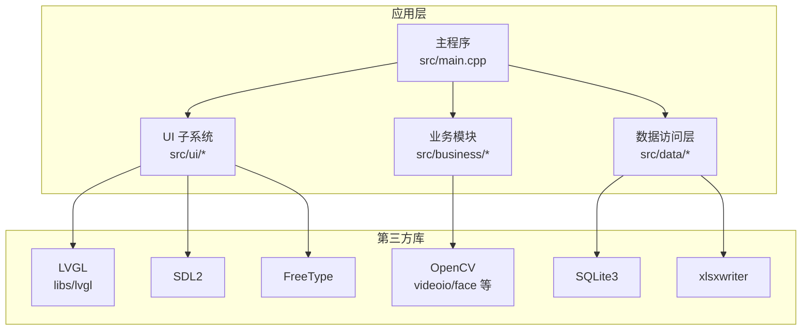
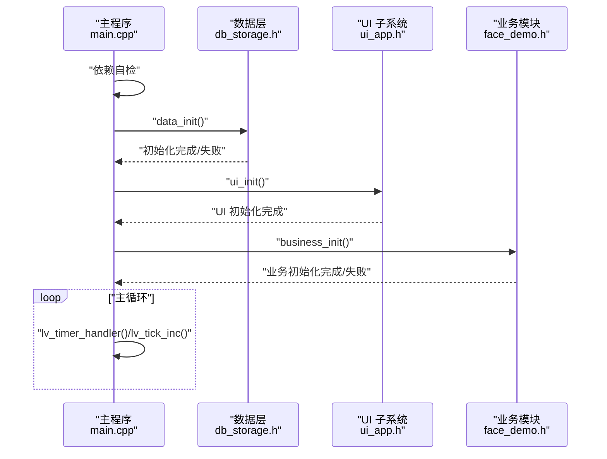
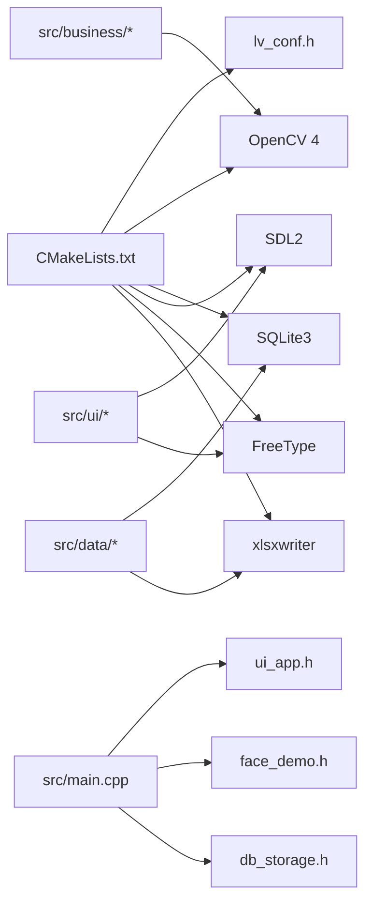

# 快速开始

<cite>
**本文引用的文件**
- [CMakeLists.txt](file://CMakeLists.txt)
- [lv_conf.h](file://lv_conf.h)
- [main.cpp](file://src/main.cpp)
- [db_storage.h](file://src/data/db_storage.h)
- [face_demo.h](file://src/business/face_demo.h)
- [ui_app.h](file://src/ui/ui_app.h)
- [env.sh](file://env/env.sh)
- [install-prerequisites.sh](file://libs/lvgl/scripts/install-prerequisites.sh)
- [install-prerequisites.bat](file://libs/lvgl/scripts/install-prerequisites.bat)
</cite>

## 目录
1. [简介](#简介)
2. [项目结构](#项目结构)
3. [核心组件](#核心组件)
4. [架构总览](#架构总览)
5. [详细组件分析](#详细组件分析)
6. [依赖关系分析](#依赖关系分析)
7. [性能注意事项](#性能注意事项)
8. [故障排查指南](#故障排查指南)
9. [结论](#结论)
10. [附录](#附录)

## 简介
本指南面向首次接触 SmartAttendance 项目的开发者，提供从环境准备、依赖安装、CMake 构建、编译选项配置到首次运行的完整流程。内容覆盖 Linux 与 Windows WSL2 的安装差异，包含验证安装成功的方法、基本使用示例与常见问题解决方案。

## 项目结构
SmartAttendance 采用分层架构：UI 层（基于 LVGL）、业务层（人脸识别与考勤逻辑）、数据层（SQLite + OpenCV + xlsxwriter），并通过 CMake 统一构建。

图表来源
- [CMakeLists.txt:112-146](file://CMakeLists.txt#L112-L146)
- [main.cpp:187-246](file://src/main.cpp#L187-L246)

章节来源
- [CMakeLists.txt:112-146](file://CMakeLists.txt#L112-L146)
- [main.cpp:187-246](file://src/main.cpp#L187-L246)

## 核心组件
- 主程序入口：负责系统初始化、依赖自检、数据层初始化、UI 与业务层初始化、主循环驱动。
- UI 子系统：封装 LVGL 初始化、显示与输入设备配置、页面管理与事件分发。
- 业务模块：封装人脸检测/识别、视频流获取、用户注册与更新、考勤记录查询等。
- 数据层：封装 SQLite 数据库访问、表结构创建与播种、用户与考勤数据的增删改查。

章节来源
- [main.cpp:187-246](file://src/main.cpp#L187-L246)
- [ui_app.h:8-12](file://src/ui/ui_app.h#L8-L12)
- [face_demo.h:35-40](file://src/business/face_demo.h#L35-L40)
- [db_storage.h:195-213](file://src/data/db_storage.h#L195-L213)

## 架构总览
系统启动顺序：主程序 → 依赖自检 → 数据层初始化（含播种）→ UI 初始化 → 业务模块初始化 → 主循环（驱动 LVGL 心跳）。

图表来源
- [main.cpp:200-238](file://src/main.cpp#L200-L238)
- [ui_app.h:8-12](file://src/ui/ui_app.h#L8-L12)
- [face_demo.h:35-40](file://src/business/face_demo.h#L35-L40)

## 详细组件分析

### 1) 环境与依赖安装（Linux）
- 安装前置依赖（图形、字体、OpenGL、包管理工具等）
- 安装 OpenCV 4（含 face、imgcodecs、highgui、videoio 等组件）
- 安装 SQLite3、FreeType、SDL2
- 安装 xlsxwriter（用于生成 Excel 报表）

参考脚本
- [install-prerequisites.sh:11-15](file://libs/lvgl/scripts/install-prerequisites.sh#L11-L15)

章节来源
- [install-prerequisites.sh:11-15](file://libs/lvgl/scripts/install-prerequisites.sh#L11-L15)

### 2) 环境与依赖安装（Windows/WSL2）
- 使用 vcpkg 安装：libpng、freetype、opengl、glfw3、glew
- 安装 Python 依赖：pypng、lz4、kconfiglib

参考脚本
- [install-prerequisites.bat:1-5](file://libs/lvgl/scripts/install-prerequisites.bat#L1-L5)

章节来源
- [install-prerequisites.bat:1-5](file://libs/lvgl/scripts/install-prerequisites.bat#L1-L5)

### 3) CMake 构建与编译选项
- C++17、C11 标准，Debug 构建类型，开启编译命令导出以便 IDE 自动解析头文件
- 依赖查找：Threads、SDL2、FreeType、OpenCV 4（含 face、imgcodecs、highgui、videoio、objdetect、imgproc、core）、SQLite3、xlsxwriter
- LVGL 集成：设置 LV_CONF_PATH，将 lv_conf.h 传递给 LVGL 构建；配置包含路径与链接库
- 主程序目标：attendance_app，自动收集 src 下多类源文件，包含 UI、业务、数据三层
- 链接库：lvgl、OpenCV、SQLite3、SDL2、xlsxwriter、Threads

章节来源
- [CMakeLists.txt:7-13](file://CMakeLists.txt#L7-L13)
- [CMakeLists.txt:24-37](file://CMakeLists.txt#L24-L37)
- [CMakeLists.txt:54-71](file://CMakeLists.txt#L54-L71)
- [CMakeLists.txt:84-110](file://CMakeLists.txt#L84-L110)
- [CMakeLists.txt:115-136](file://CMakeLists.txt#L115-L136)
- [CMakeLists.txt:139-146](file://CMakeLists.txt#L139-L146)

### 4) LVGL 配置
- 项目使用根目录 lv_conf.h 作为 LVGL 配置文件，通过宏 LV_CONF_PATH 注入
- 颜色深度、默认刷新周期、默认 DPI、软件渲染开关、绘制线程栈大小与优先级等均在配置中定义
- 可根据平台与性能需求调整渲染与内存相关参数

章节来源
- [lv_conf.h:29-95](file://lv_conf.h#L29-L95)
- [lv_conf.h:168-169](file://lv_conf.h#L168-L169)
- [lv_conf.h:154-166](file://lv_conf.h#L154-L166)
- [CMakeLists.txt:54-61](file://CMakeLists.txt#L54-L61)

### 5) 主程序初始化与主循环
- 信号处理：捕获 Ctrl+C，安全退出
- 屏幕保护与休眠禁用：设置 SDL 环境变量与 Linux 控制台命令
- 依赖自检：输出 OpenCV、SQLite3、LVGL 版本
- 数据层初始化：自动创建表结构并进行默认数据播种
- UI 初始化：完成显示与输入设备准备
- 业务层初始化：启动线程与识别流程
- 主循环：驱动 LVGL 心跳与时间推进，限制休眠范围以平衡性能与响应

章节来源
- [main.cpp:41-44](file://src/main.cpp#L41-L44)
- [main.cpp:156-182](file://src/main.cpp#L156-L182)
- [main.cpp:49-59](file://src/main.cpp#L49-L59)
- [main.cpp:200-208](file://src/main.cpp#L200-L208)
- [main.cpp:213-224](file://src/main.cpp#L213-L224)
- [main.cpp:229-238](file://src/main.cpp#L229-L238)

### 6) 数据层接口（DAO）
- 提供部门、班次、用户、考勤记录的增删改查接口
- 支持批量导入、事务、系统配置、节假日管理、报表辅助查询等
- 数据库初始化与播种：自动创建表并注入默认数据

章节来源
- [db_storage.h:195-213](file://src/data/db_storage.h#L195-L213)
- [db_storage.h:222-288](file://src/data/db_storage.h#L222-L288)
- [db_storage.h:324-420](file://src/data/db_storage.h#L324-L420)
- [db_storage.h:432-461](file://src/data/db_storage.h#L432-L461)
- [db_storage.h:468-474](file://src/data/db_storage.h#L468-L474)
- [db_storage.h:482-503](file://src/data/db_storage.h#L482-L503)

### 7) 业务层接口（人脸识别与考勤）
- 初始化：加载人脸检测模型、打开摄像头或视频流
- 预处理配置：裁剪、尺寸归一化、直方图均衡化（全局/CLAHE）、ROI 增强
- 用户注册与更新：基于当前帧提取人脸特征并入库
- 考勤记录查询：加载缓存并在 UI 列表中展示

章节来源
- [face_demo.h:35-40](file://src/business/face_demo.h#L35-L40)
- [face_demo.h:77-84](file://src/business/face_demo.h#L77-L84)
- [face_demo.h:128-135](file://src/business/face_demo.h#L128-L135)
- [face_demo.h:147-166](file://src/business/face_demo.h#L147-L166)

### 8) UI 子系统
- 负责 HAL（SDL/FB）初始化、输入设备配置、管理器启动以及加载主页
- 与 LVGL 集成，提供显示缓冲与刷新回调

章节来源
- [ui_app.h:8-12](file://src/ui/ui_app.h#L8-L12)

### 9) 构建与运行（一键脚本）
- 提供 env.sh 环境脚本，包含 make/m、run/r、clean/cl 等快捷命令
- make：自动创建 build 目录、执行 cmake ..、并行编译
- run：清理端口占用与摄像头占用、杀掉僵尸进程、启动 attendance_app

章节来源
- [env.sh:48-65](file://env/env.sh#L48-L65)
- [env.sh:67-99](file://env/env.sh#L67-L99)

## 依赖关系分析

图表来源
- [CMakeLists.txt:54-71](file://CMakeLists.txt#L54-L71)
- [CMakeLists.txt:115-146](file://CMakeLists.txt#L115-L146)
- [main.cpp:31-33](file://src/main.cpp#L31-L33)

章节来源
- [CMakeLists.txt:54-71](file://CMakeLists.txt#L54-L71)
- [CMakeLists.txt:115-146](file://CMakeLists.txt#L115-L146)
- [main.cpp:31-33](file://src/main.cpp#L31-L33)

## 性能注意事项
- LVGL 绘制线程栈大小与优先级可在配置中调整，以适配不同平台性能
- 软件渲染复杂度与阴影/渐变缓存可根据实际硬件能力开启或关闭
- 主循环中对 lv_timer_handler 的休眠时间做了上下限限制，兼顾响应与 CPU 占用
- 业务层预处理（直方图均衡化、ROI 增强）可按需启用，避免过度开销

章节来源
- [lv_conf.h:154-166](file://lv_conf.h#L154-L166)
- [lv_conf.h:208-229](file://lv_conf.h#L208-L229)
- [main.cpp:229-238](file://src/main.cpp#L229-L238)

## 故障排查指南
- 依赖未找到
  - 现象：CMake 报错找不到 OpenCV、SQLite3、SDL2、FreeType 或 xlsxwriter
  - 处理：确认各库已安装且 find_package 能定位；Linux 下确保 pkg-config 与头文件路径正确；Windows/WSL2 使用 vcpkg 安装
- OpenCV 组件缺失
  - 现象：找不到 videoio/face 等组件
  - 处理：安装 opencv4 的开发包（含 contrib 模块），确保 /usr/include/opencv4 可用
- LVGL 配置未生效
  - 现象：UI 显示异常或功能缺失
  - 处理：确认 LV_CONF_PATH 指向正确，且 lv_conf.h 已复制到项目根目录
- 屏幕保护导致黑屏
  - 现象：运行时黑屏或休眠
  - 处理：主程序已尝试禁用屏保与自动休眠；也可手动执行 setterm 命令或设置 SDL 环境变量
- 端口/摄像头占用
  - 现象：黑屏或摄像头无法打开
  - 处理：使用 env.sh 的 run 命令自动清理 5004/udp 与 /dev/video0 占用，或手动 fuser -k

章节来源
- [CMakeLists.txt:28-37](file://CMakeLists.txt#L28-L37)
- [CMakeLists.txt:134-135](file://CMakeLists.txt#L134-L135)
- [main.cpp:156-182](file://src/main.cpp#L156-L182)
- [env.sh:82-87](file://env/env.sh#L82-L87)

## 结论
通过本指南，您可以在 Linux 与 Windows WSL2 上完成 SmartAttendance 的环境准备、依赖安装与 CMake 构建，并借助一键脚本快速运行。建议在首次运行前先进行依赖自检与数据层初始化，确保 SQLite、OpenCV、LVGL、SDL2、FreeType、xlsxwriter 均已正确安装与链接。

## 附录

### A. 从源码到首次运行的完整流程
- Linux
  - 安装依赖：参考 [install-prerequisites.sh:11-15](file://libs/lvgl/scripts/install-prerequisites.sh#L11-L15)
  - 准备配置：复制并编辑 [lv_conf.h](file://lv_conf.h) 至项目根目录
  - 构建与运行：执行 [env.sh:48-65](file://env/env.sh#L48-L65) 中的 make 与 run
- Windows/WSL2
  - 安装依赖：参考 [install-prerequisites.bat:1-5](file://libs/lvgl/scripts/install-prerequisites.bat#L1-L5)
  - 准备配置：复制并编辑 [lv_conf.h](file://lv_conf.h) 至项目根目录
  - 构建与运行：在 WSL2 终端中使用 [env.sh:48-65](file://env/env.sh#L48-L65) 的 make 与 run

章节来源
- [install-prerequisites.sh:11-15](file://libs/lvgl/scripts/install-prerequisites.sh#L11-L15)
- [install-prerequisites.bat:1-5](file://libs/lvgl/scripts/install-prerequisites.bat#L1-L5)
- [lv_conf.h:1-20](file://lv_conf.h#L1-L20)
- [env.sh:48-65](file://env/env.sh#L48-L65)

### B. 验证安装成功的方法
- 依赖自检输出：OpenCV、SQLite3、LVGL 版本信息
- 数据库初始化：检查是否存在 attendance.db 与表结构
- UI 启动：观察窗口弹出与主界面加载
- 业务功能：尝试注册用户、查看考勤记录

章节来源
- [main.cpp:49-59](file://src/main.cpp#L49-L59)
- [main.cpp:200-208](file://src/main.cpp#L200-L208)
- [main.cpp:213-224](file://src/main.cpp#L213-L224)

### C. 基本使用示例（操作步骤）
- 运行程序：在 build 目录执行 attendance_app，或使用 [env.sh:67-99](file://env/env.sh#L67-L99) 的 run
- 注册用户：在 UI 中选择“注册用户”，提供姓名并确认
- 查看考勤：进入“考勤记录”界面，查看历史打卡信息

章节来源
- [env.sh:67-99](file://env/env.sh#L67-L99)
- [face_demo.h:128-135](file://src/business/face_demo.h#L128-L135)
- [face_demo.h:147-166](file://src/business/face_demo.h#L147-L166)