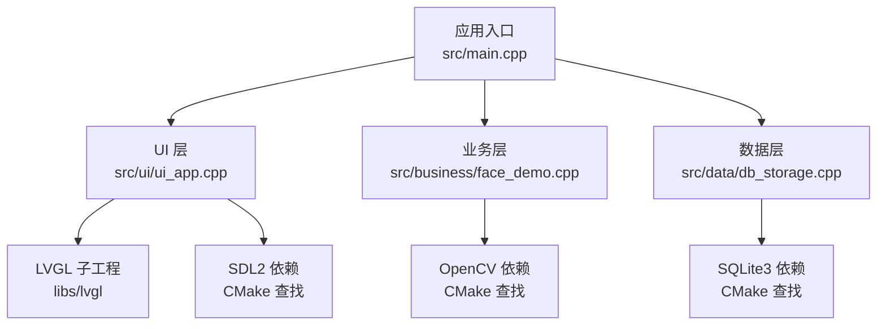
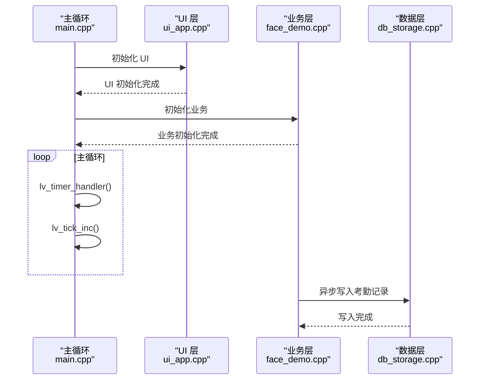
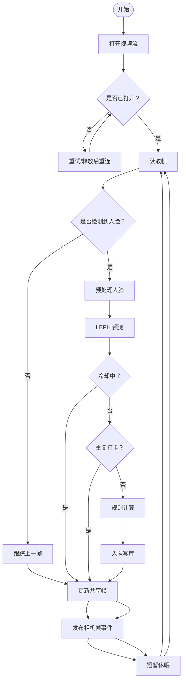
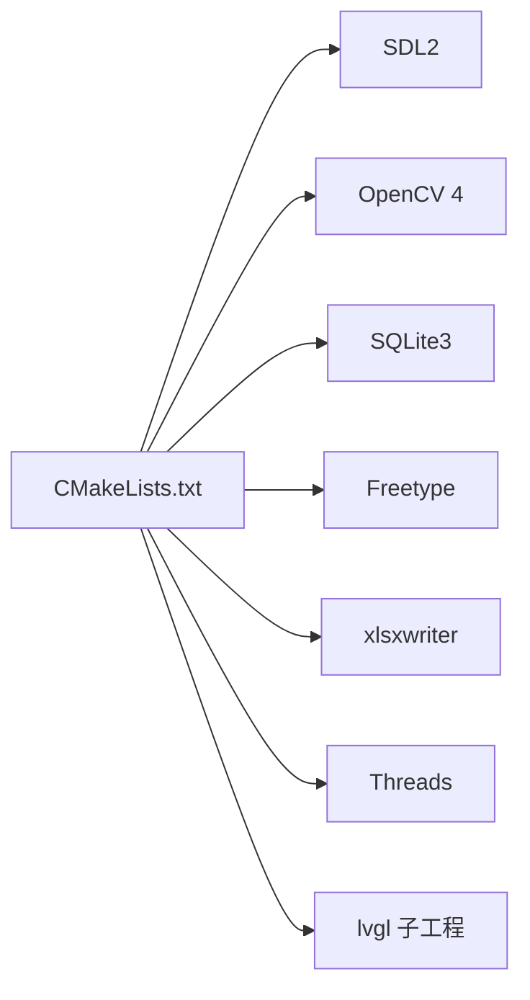
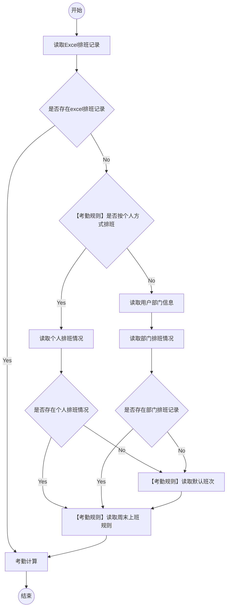

# 快速开始

<cite>
**本文引用的文件**
- [CMakeLists.txt](file://CMakeLists.txt)
- [lv_conf.h](file://lv_conf.h)
- [env.sh](file://env/env.sh)
- [main.cpp](file://src/main.cpp)
- [ui_app.cpp](file://src/ui/ui_app.cpp)
- [face_demo.cpp](file://src/business/face_demo.cpp)
- [db_storage.cpp](file://src/data/db_storage.cpp)
- [appendix2_3Att_computer.md](file://docs/markdowm/appendix2_3Att_computer.md)
- [T9键盘集成指南.md](file://docs/markdowm/T9键盘集成指南.md)
- [libs/lvgl/README.md](file://libs/lvgl/README.md)
</cite>

## 目录
1. [简介](#简介)
2. [项目结构](#项目结构)
3. [核心组件](#核心组件)
4. [架构概览](#架构概览)
5. [详细组件分析](#详细组件分析)
6. [依赖分析](#依赖分析)
7. [性能考虑](#性能考虑)
8. [故障排查指南](#故障排查指南)
9. [结论](#结论)
10. [附录](#附录)

## 简介
本指南面向首次接触智能考勤系统的开发者，帮助您在最短时间内完成环境搭建、编译构建与首次运行。系统基于 LVGL 图形库、OpenCV 人脸识别、SQLite3 数据存储与 SDL2 显示驱动，提供从 UI 到业务再到数据层的完整链路。

## 项目结构
项目采用分层架构：
- 应用入口与主循环：src/main.cpp
- UI 层：src/ui（WSL2/PC 仿真，使用 SDL2 驱动 LVGL）
- 业务层：src/business（人脸识别、打卡队列、规则计算）
- 数据层：src/data（SQLite3 + OpenCV 图像 BLOB 存储）
- LVGL 集成：libs/lvgl（子工程，通过 CMake 引入）
- 环境脚本：env/env.sh（一键构建、运行、清理）

图表来源
- [CMakeLists.txt:15-71](file://CMakeLists.txt#L15-L71)
- [main.cpp:187-246](file://src/main.cpp#L187-L246)
- [ui_app.cpp:34-94](file://src/ui/ui_app.cpp#L34-L94)
- [face_demo.cpp:557-694](file://src/business/face_demo.cpp#L557-L694)
- [db_storage.cpp:133-310](file://src/data/db_storage.cpp#L133-L310)

章节来源
- [CMakeLists.txt:15-71](file://CMakeLists.txt#L15-L71)
- [main.cpp:187-246](file://src/main.cpp#L187-L246)
- [ui_app.cpp:34-94](file://src/ui/ui_app.cpp#L34-L94)
- [face_demo.cpp:557-694](file://src/business/face_demo.cpp#L557-L694)
- [db_storage.cpp:133-310](file://src/data/db_storage.cpp#L133-L310)

## 核心组件
- 应用入口与主循环：负责系统初始化、依赖自检、UI 初始化、业务初始化与主循环调度。
- UI 层：使用 SDL2 创建窗口与输入设备，初始化 LVGL，加载主页并启动后台服务。
- 业务层：后台采集线程、人脸识别与打卡队列、规则计算、冷却与防抖、异步写库。
- 数据层：SQLite3 初始化、表结构与索引、数据播种、事务与并发控制、BLOB 存储。
- LVGL 配置：通过 lv_conf.h 控制渲染、字体、OS、绘图等特性；通过 CMake 注入配置路径。

章节来源
- [main.cpp:187-246](file://src/main.cpp#L187-L246)
- [ui_app.cpp:34-94](file://src/ui/ui_app.cpp#L34-L94)
- [face_demo.cpp:557-694](file://src/business/face_demo.cpp#L557-L694)
- [db_storage.cpp:133-310](file://src/data/db_storage.cpp#L133-L310)
- [lv_conf.h:29-110](file://lv_conf.h#L29-L110)

## 架构概览
系统采用“主循环 + 多线程”的模式：
- 主线程负责 LVGL 心跳与事件循环；
- 业务线程负责视频采集、人脸检测/识别、规则计算与 UI 刷新；
- 数据写入线程负责异步写库，避免主线程阻塞；
- UI 层通过事件总线与业务层解耦。

图表来源
- [main.cpp:229-238](file://src/main.cpp#L229-L238)
- [ui_app.cpp:86-93](file://src/ui/ui_app.cpp#L86-L93)
- [face_demo.cpp:246-285](file://src/business/face_demo.cpp#L246-L285)
- [db_storage.cpp:300-307](file://src/data/db_storage.cpp#L300-L307)

## 详细组件分析

### 环境与依赖
- 系统要求
  - Linux/WSL2（推荐 Ubuntu 20.04+，内核支持 ALSA/SDL2/摄像头）
  - CMake 3.16+，GCC/G++（C++17/C11 标准）
- 依赖库
  - OpenCV 4（含 face、imgcodecs、highgui、videoio、objdetect）
  - SQLite3
  - SDL2（用于桌面仿真显示）
  - FreeType（LVGL 字体）
  - xlsxwriter（报表导出，可选）
  - 线程库（CMake Threads）

章节来源
- [CMakeLists.txt:19-37](file://CMakeLists.txt#L19-L37)

### 编译与构建
- 使用 env.sh 提供的一键构建脚本
  - make/m：进入 build 目录，执行 cmake .. 与 make -j$(nproc)
  - run/r：清理占用资源后运行 attendance_app
  - clean/cl：清理 build 目录
- CMake 配置要点
  - C++17/C11 标准、Debug 构建、导出 compile_commands.json
  - find_package(PkgConfig)、find_package(Threads)
  - OpenCV 4（COMPONENTS core imgproc videoio highgui objdetect face imgcodecs）
  - SQLite3、SDL2、Freetype、xlsxwriter
  - LVGL 子工程与配置注入（LV_CONF_PATH）

章节来源
- [env.sh:48-65](file://env/env.sh#L48-L65)
- [env.sh:67-99](file://env/env.sh#L67-L99)
- [CMakeLists.txt:7-13](file://CMakeLists.txt#L7-L13)
- [CMakeLists.txt:19-37](file://CMakeLists.txt#L19-L37)
- [CMakeLists.txt:52-71](file://CMakeLists.txt#L52-L71)

### 首次运行与配置
- 禁用系统休眠
  - 设置 SDL_VIDEO_ALLOW_SCREENSAVER=0
  - 调用 setterm、控制台转义序列、fb0 blank 等命令
- 数据库初始化与播种
  - 自动创建目录与表结构，插入默认部门、班次、管理员、响铃计划等
  - 预编译高频语句，启用 WAL、NORMAL 同步、内存临时表、缓存大小、外键约束
- UI 初始化（WSL2/PC 仿真）
  - 创建 SDL 窗口与鼠标/键盘输入设备
  - 绑定键盘到 UI Group，加载主页并启动后台服务

章节来源
- [main.cpp:156-182](file://src/main.cpp#L156-L182)
- [main.cpp:203-208](file://src/main.cpp#L203-L208)
- [db_storage.cpp:133-310](file://src/data/db_storage.cpp#L133-L310)
- [ui_app.cpp:34-94](file://src/ui/ui_app.cpp#L34-L94)

### 人脸识别与打卡流程
- 后台采集线程
  - 每 5 帧检测一次，其余帧跟踪上一帧位置
  - 识别冷却时间 2000ms，用户级冷却 60s 防重复
  - 队列长度限制 10，超限丢弃
- 规则计算
  - 基于默认班次与考勤规则计算迟到/早退/缺勤
- 异步写库
  - 单独线程消费队列，try-catch 防止单次异常导致崩溃
- UI 刷新
  - 16ms 限流，避免 UI 队列爆炸

图表来源
- [face_demo.cpp:291-549](file://src/business/face_demo.cpp#L291-L549)
- [face_demo.cpp:246-285](file://src/business/face_demo.cpp#L246-L285)

章节来源
- [face_demo.cpp:291-549](file://src/business/face_demo.cpp#L291-L549)
- [face_demo.cpp:246-285](file://src/business/face_demo.cpp#L246-L285)

### 数据层设计
- 表结构与索引
  - departments、shifts、users、attendance、dept_schedule、user_schedule、bells、system_config、holidays
  - 联合索引 idx_att_user_time 加速查询
- 并发与事务
  - shared_mutex 读写锁，读多写少场景
  - 事务批量播种与响铃计划初始化
- BLOB 存储
  - 考勤抓拍图与注册头像以 .jpg BLOB 存储，路径字段冗余便于检索
- 预编译语句
  - log_attendance 插入语句预编译，减少解析开销

章节来源
- [db_storage.cpp:164-293](file://src/data/db_storage.cpp#L164-L293)
- [db_storage.cpp:300-307](file://src/data/db_storage.cpp#L300-L307)
- [db_storage.cpp:415-430](file://src/data/db_storage.cpp#L415-L430)

### LVGL 配置与集成
- 配置文件
  - lv_conf.h 中设置颜色深度、默认刷新周期、DPI、OS、绘图引擎、字体等
  - 通过 CMake 将 LV_CONF_PATH 指向根目录配置文件
- 集成方式
  - add_subdirectory(libs/lvgl)
  - target_include_directories 与 target_link_libraries 链接 SDL2/Freetype
  - UI 层使用 lv_sdl_window_create/lv_sdl_mouse_create/lv_sdl_keyboard_create

章节来源
- [lv_conf.h:29-110](file://lv_conf.h#L29-L110)
- [CMakeLists.txt:52-71](file://CMakeLists.txt#L52-L71)
- [ui_app.cpp:43-57](file://src/ui/ui_app.cpp#L43-L57)

### T9 键盘集成（可选）
- 功能概述
  - 4x4 硬件键盘映射到 PC 键码，支持数字/英文/中文/符号模式
  - 候选词选择、模式切换、UI 组件集成
- 集成步骤
  - 在 CMakeLists.txt 中添加 t9_keyboard 静态库并链接
  - 初始化 T9Keyboard 与 T9KeyMap，处理硬件键盘事件
  - 在 LVGL UI 中创建 ui_t9_keyboard 组件并绑定文本框

章节来源
- [T9键盘集成指南.md:66-95](file://docs/markdowm/T9键盘集成指南.md#L66-L95)
- [T9键盘集成指南.md:99-134](file://docs/markdowm/T9键盘集成指南.md#L99-L134)
- [T9键盘集成指南.md:136-148](file://docs/markdowm/T9键盘集成指南.md#L136-L148)

## 依赖分析
- CMake 依赖查找
  - pkg_check_modules：SDL2、xlsxwriter
  - find_package：Threads、OpenCV 4、SQLite3、Freetype
- LVGL 子工程
  - add_subdirectory(libs/lvgl)
  - 通过 LV_CONF_PATH 注入配置
- 链接顺序
  - lvgl → OpenCV → SQLite3 → SDL2 → xlsxwriter → Threads

图表来源
- [CMakeLists.txt:19-37](file://CMakeLists.txt#L19-L37)
- [CMakeLists.txt:52-71](file://CMakeLists.txt#L52-L71)

章节来源
- [CMakeLists.txt:19-37](file://CMakeLists.txt#L19-L37)
- [CMakeLists.txt:52-71](file://CMakeLists.txt#L52-L71)

## 性能考虑
- SQLite 性能调优
  - WAL 模式、NORMAL 同步、内存临时表、缓存大小、外键约束
- 人脸识别与 UI 刷新
  - 采集线程 60FPS，UI 限流 16ms，避免过度刷新
  - 跳帧检测与跟踪，降低 CPU 占用
- 并发与锁
  - 读多写少场景使用 shared_mutex，写入使用预编译语句
- 图像存储
  - BLOB 以 .jpg 存储，兼顾体积与识别一致性

章节来源
- [db_storage.cpp:148-160](file://src/data/db_storage.cpp#L148-L160)
- [face_demo.cpp:514-527](file://src/business/face_demo.cpp#L514-L527)
- [face_demo.cpp:354-378](file://src/business/face_demo.cpp#L354-L378)

## 故障排查指南
- 构建失败
  - 缺少依赖：确认 pkg-config、OpenCV、SQLite3、SDL2、Freetype、xlsxwriter 安装
  - CMake 版本过低：升级到 3.16+
  - OpenCV4 路径：确保 /usr/include/opencv4 存在
- 运行黑屏/摄像头占用
  - 使用 env.sh 的 run/r 自动清理 5004/udp 与 /dev/video0 占用
  - 确认 SDL 环境变量 SDL_VIDEO_ALLOW_SCREENSAVER=0
- 人脸识别异常
  - 检查 haarcascade 文件路径与存在性
  - 确认模型文件 face_model.xml 是否存在，必要时重新训练
- 数据库问题
  - WAL/同步/缓存/外键等 PRAGMA 生效
  - 预编译语句失败时检查 SQL 语法与表结构

章节来源
- [env.sh:67-99](file://env/env.sh#L67-L99)
- [main.cpp:156-182](file://src/main.cpp#L156-L182)
- [face_demo.cpp:173-182](file://src/business/face_demo.cpp#L173-L182)
- [db_storage.cpp:148-160](file://src/data/db_storage.cpp#L148-L160)

## 结论
通过本快速开始指南，您已经完成了从环境准备、依赖安装、编译构建到首次运行的全流程。系统具备完善的 UI、业务与数据层，支持人脸识别与规则计算，并针对性能与并发进行了优化。建议在开发过程中结合 T9 键盘集成文档完善输入体验，并根据实际硬件平台逐步替换为嵌入式驱动。

## 附录

### 常用命令
- 构建：source env/env.sh 后执行 make 或 m
- 运行：source env/env.sh 后执行 run 或 r
- 清理：source env/env.sh 后执行 clean 或 cl

章节来源
- [env.sh:16-27](file://env/env.sh#L16-L27)
- [env.sh:48-65](file://env/env.sh#L48-L65)
- [env.sh:67-99](file://env/env.sh#L67-L99)

### 考勤计算流程参考
系统支持多种排班来源与规则，流程图展示了从排班记录到最终计算的决策路径。

图表来源
- [appendix2_3Att_computer.md:5-29](file://docs/markdowm/appendix2_3Att_computer.md#L5-L29)